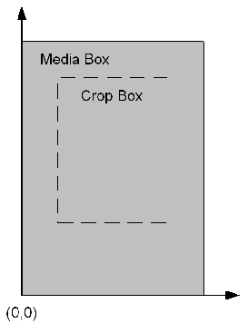
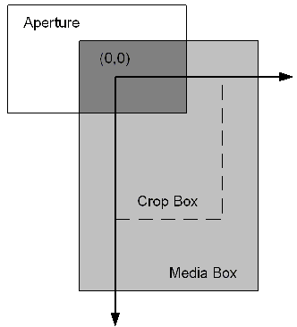

******************************************************
Coordinate Systems
******************************************************

User space
==========

The user space is the coordinate system used within PDF files. In the IAC interface, it is used for most PD layer objects (that is, objects such as ``PDBookmark`` whose names begin with "PD"). The following graphic shows the user space coordinate system. The orientation, origin, and scale of the user space coordinate system can be changed by operators in the page description in a PDF file.

User space coordinate system

The default user space is the user space coordinate system in effect immediately before each page begins drawing. The origin of this coordinate system is the lower left corner of a page's media box. The x-coordinate increases to the right, and the y-coordinate increases upward. One unit in the default user space is 1/72 of an inch.

Device space
============

The device space specifies coordinates in screen pixels, as shown in the following graphic. It is used in the AV layer of the IAC interface (that is, objects such as ``AVDoc`` whose names begin with "AV").

Device space coordinate system

The origin of the device space coordinate system is at the upper left corner of the visible page on the screen (that is, the upper left corner of the white part of the page). The x-coordinate increases to the right, and the y-coordinate increases downward.

The upper left corner of the visible page is determined by the intersection of a page's PDF crop box and media box. As a result, the device space coordinate system changes if the cropping on a page changes.

