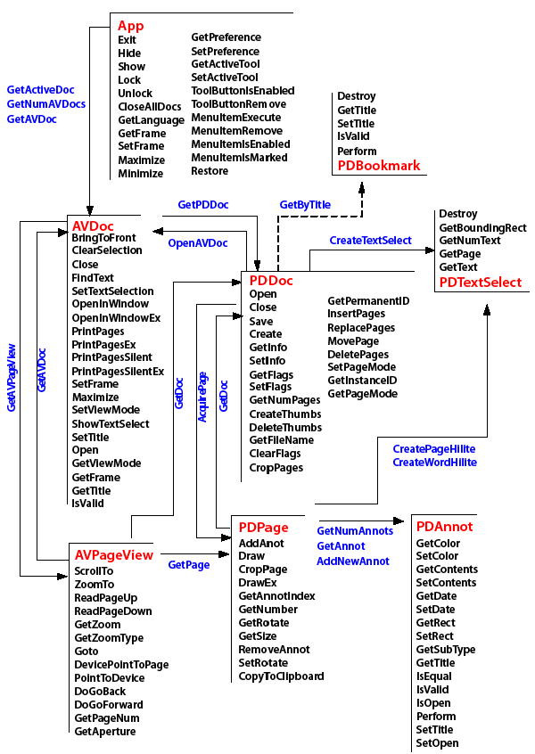

******************************************************
Using OLE
******************************************************

This chapter describes how you can use OLE 2.0 support in Adobe Acrobat for Microsoft Windows. Acrobat applications are OLE servers and also respond to a variety of OLE automation messages.

Since Acrobat provides the appropriate interfaces to be an OLE server, you can embed PDF documents into documents created by an application that is an OLE client, or link them to OLE containers. However, Acrobat does not perform in-place activation.

Acrobat supports the OLE automation methods described in this document. Acrobat Reader does not support OLE automation, except for the PDF browser controls provided in the ``AcroPDF`` object.

The best practical resources for Visual Basic or Visual C# programmers, besides the object browser, are the sample projects. The samples demonstrate use of the Acrobat OLE objects and contain comments describing the parameters for the more complicated methods. For more information, see the `Acrobat SDK Samples Guide <http://www.adobe.com/go/acrobatsdk_samplesguide>`__ .

For more information on OLE 2.0 and OLE automation, see the *OLE Automation Programmer's Reference* , ISBN 1-55615-851-3, Microsoft Press. You can also find numerous articles at http://msdn.microsoft.com .

.. raw:: html

   

OLE capabilities in Acrobat
==============================

For OLE automation, Acrobat provides three capabilities: rendering PDF documents, remotely controlling the application, and implementing PDF browser controls.

On-screen rendering
-------------------

You can render PDF documents on the screen in two ways:

-  Use an interface similar to the Acrobat user interface.

In this approach, use the ``AVDoc`` object's ``OpenInWindowEx`` method to open a PDF file in your application's window. The window has vertical and horizontal scroll bars, and has buttons on the window's perimeter for setting the zoom factor. Users interacting with this type of window find its operation similar to that of working in Acrobat. For example, links are active and the window can display any text annotation on a page.

The ActiveView sample in the `Acrobat SDK Samples Guide <http://www.adobe.com/go/acrobatsdk_samplesguide>`__ demonstrates this approach.

-  Use the ``PDPage`` object's ``DrawEx`` method.

In this approach, you provide a window and a device context, as well as a zoom factor. Acrobat renders the current page into your window. The application must manage the scroll bars and other items in the user interface.

The StaticView sample in the `Acrobat SDK Samples Guide <http://www.adobe.com/go/acrobatsdk_samplesguide>`__ demonstrates this approach.

Remote control of Acrobat
----------------------------

You can control Acrobat remotely in two ways:

-  Given the exported interfaces, you can write an application that manipulates various aspects of PDF documents, such as pages, annotations, and bookmarks. Your application might use ``AVDoc``, ``PDDoc``, ``PDPage``, and ``annotation`` methods, and might not provide any visual feedback that requires rendering into its application window.
-  You can launch Acrobat from your own application, which has set up the environment for the user. Your application can cause Acrobat to open a file, set the page location and zoom factor, and possibly even select some text. For example, this could be useful as part of a help system.

PDF browser controls
--------------------

You can use the ``AcroPDF`` library to display a PDF document in applications using simplified browser controls. In this case, the PDF document is treated as an ActiveX document, and the interface is available in Acrobat Reader.

Load the document with the ``AcroPDF`` object's ``LoadFile`` method. You can then implement browser controls for the following functionality:

-  To determine which page to display
-  To choose the display, view, and zoom modes
-  To display bookmarks, thumbs, scrollbars, and toolbars
-  To print pages using various options
-  To highlight a text selection

.. raw:: html

   

Development environment considerations
======================================

You have a choice of environments in which to integrate with Acrobat: Visual Basic, Visual C#, and Visual C++.

If possible, use Visual Basic or Visual C#. The run-time type checking offered by the ``CreateObject`` call in Visual Basic allows quick prototyping of an application, and in both of these languages the implementation details are simplified.

For comparison, consider the following examples, in which you can see strings with ``"AcroExch.App"`` and strings with ``"Acrobat.CAcroApp"``. The first is the form for the external string used by OLE clients to create an object of that type. The second is the form that is included in developer type libraries.

This example shows a Visual Basic subroutine to view a given page of an open document:

#. Viewing a page with Visual Basic

::

   Private Sub myGoto(ByVal where As Integer)
       Dim app as Object, avdoc as Object, pageview as Object
       Set app = CreateObject("AcroExch.App")
       Set avdoc = app.GetActiveDoc
       Set pageview = avdoc.GetAVPageView
       pageview.Goto(where)
   End Sub

The following example does the same, but in Visual C++:

#. Viewing a page with Visual C++

::

   void goto(int where)
   {
       CAcroApp app;
       CAcroAVDoc *avdoc = new CAcroAVDoc;
       CAcroAVPageView pageview;
       COleException e;
       app.CreateDispatch("AcroExch.App");
       avdoc->AttachDispatch(app.GetActiveDoc, TRUE);
       pageview->AttachDispatch(avdoc->GetAVPageView, TRUE);
       pageview->Goto(where);
   }

The next example shows how to use PDF browser controls to view a page in Visual Basic:

#. Using AcroPDF browser controls with Visual Basic

::

   Friend WithEvents AxAcroPDF1 As AxAcroPDFLib.AxAcroPDF
   Me.AxAcroPDF1 = New AxAcroPDFLib.AxAcroPDF
   'AxAcroPDF1
   Me.AxAcroPDF1.Enabled = True
   Me.AxAcroPDF1.Location = New System.Drawing.Point(24, 40)
   Me.AxAcroPDF1.Name = "AxAcroPDF1"
   Me.AxAcroPDF1.OcxState = CType(
          resources.GetObject("AxAcroPDF1.OcxState"),
          System.Windows.Forms.AxHost.State
   )
   Me.AxAcroPDF1.Size = New System.Drawing.Size(584, 600)
   Me.AxAcroPDF1.TabIndex = 0
   AxAcroPDF1.LoadFile("http://www.example.com/example.pdf")
   AxAcroPDF1.setCurrentPage(TextBox2.Text)

The Visual Basic examples are simpler to read, write, and support, and the implementation details are similar to Visual C#.

In Visual C++, the ``CAcro`` classes hide much of the type checking that must be done. Using OLE automation objects in Visual C++ requires an understanding of the ``AttachDispatch`` and ``CreateDispatch`` methods of the ``COleDispatchDriver`` class. For more information, see `Using the Acrobat OLE interfaces <IAC_DevApp_OLE_Support.html#50532372_78674>`__.

.. note::

   The header files containing the values of constants that are required by C and C++ programmers to use OLE automation are located in the Acrobat SDK IAC directory. Visual Basic and Visual C# users do not need these header files, though it may be useful to refer to them in order to verify the constant definitions.

Environment configuration
-------------------------

The only requirement for using the OLE objects made available by Acrobat is to have the product installed on your system and the appropriate type library file included in the project references for your project. The Acrobat type library file is named Acrobat.tlb. This file is included in the InterAppCommunicationSupportHeaders folder in the SDK. Once you have the type library file included in your project, you can use the object browser to browse the OLE objects.

It is not sufficient to install just an ActiveX control or DLL to enable OLE automation. You must have the full Acrobat product installed.

If you are a Visual Basic programmer, it is helpful to include the iac.bas module in your project (included in the headers folder). This module defines the constant variables.

Necessary C knowledge
---------------------

These documents, as well as the API, were designed with C programming in mind and programming with the API requires some familiarity with C concepts.

Although you do not need the header files provided in the SDK, you can use them to find the values of various constants, such as ``AV_DOC_VIEW``, that are referenced in the documentation. The file iac.h contains most of these values.

Some of the methods, such as ``OpenInWindowEx``, can be initially confusing when used in Visual Basic. ``OpenInWindowEx`` takes a ``long`` for the ``openflags`` parameter. The options for this parameter are:

* ``AV_EXTERNAL_VIEW``: Open the document with the toolbar visible.
* ``AV_DOC_VIEW``: Draw the page pane and scrollbars.
* ``AV_PAGE_VIEW``: Draw only the page pane.

If you were developing in C, these strings would be replaced by a numeric value prior to compilation; passing these strings to the method would not raise an error. When programming in Visual Basic, these strings correspond to constant variables defined in iac.bas.

In some situations, you need to apply a bitwise ``OR`` to multiple values and pass the resultant value to a method. For example, in iac.h the ``ntype`` parameter of the ``PDDocSave`` method is a bitwise ``OR`` of the following flags:

::

   /* PDSaveFlags: used for PD-level Save 
   ** All undefined flags should be set to zero. 
   ** If either PDSaveCollectGarbage or PDSaveCopy are used, PDSaveFull must be used. */
   typedef enum { 
       PDSaveIncremental = 0x0000,  /* write changes only */ 
       PDSaveFull = 0x0001,         /* write entire file */ 
       PDSaveCopy = 0x0002,         /* write copy w/o affecting current state */
      PDSaveLinearized = 0x0004,   /* write the file linearized for 
       **       page-served remote (net) access. */
      PDSaveBinaryOK = 0x0010, /* OK to store binary in file */
      PDSaveCollectGarbage = 0x0020  /* perform garbage collection on
      **       unreferenced objects */ 
   } PDSaveFlags;

For example, if you would like to fully save the PDF file and optimize it for the Web (linearize it) within a Visual Basic application, pass ``PDSaveFull + PDSaveLinearized`` (both defined in iac.bas) into the ``ntype`` parameter; this is the equivalent of a binary ``OR`` of the ``PDSaveFull`` and ``PDSaveLinearized`` parameters.

In many instances, the numeric values are spelled out in comments in the Visual Basic sample code. However, knowledge of why the methods are structured in this way and how they are used in C can be useful to Visual Basic and Visual C# programmers.

.. raw:: html

   

Using the Acrobat OLE interfaces
===================================

This section describes using the ``CAcro`` classes and the ``COleDispatchDriver`` class. The ``CAcro`` classes are subclasses of ``COleDispatchDriver``.

About the CAcro classes
-----------------------

OLE 2.0 support in Acrobat includes several classes whose names begin with "``CAcro`` ", such as ``CAcroApp`` and ``CAcroPDDoc``. Several files in the SDK encapsulate the definitions of these classes.

The ``CAcro`` classes are defined in the Acrobat type library acrobat.tlb. The ``OLEView`` tool in Visual Studio allows you to browse registered type libraries. Use acrobat.tlb when defining OLE automation for a project in Microsoft Visual C++. The files acrobat.h and acrobat.cpp are included in the Acrobat SDK, and implement a type-safe wrapper to the Acrobat automation server.

.. note::

   Do not modify the acrobat.tlb, acrobat.h, and acrobat.cpp files in the SDK; these define Acrobat's OLE automation interface.

The ``CAcro`` classes inherit from the MFC ``COleDispatchDriver`` class. Understanding this class makes it easier to write applications that use the ``CAcro`` classes and their methods.

See the *Interapplication Communication API Reference* for details on the ``CAcro`` classes and their methods.

About the COleDispatchDriver class
----------------------------------

The ``COleDispatchDriver`` class implements the client side of OLE automation, providing most of the code needed to access automation objects. It provides the wrapper functions ``AttachDispatch``, ``DetachDispatch``, and ``ReleaseDispatch``, as well as the convenience functions ``InvokeHelper``, ``SetProperty``, and ``GetProperty``. You employ some of these methods when you use the Acrobat-provided automation objects. Other methods are used in the Acrobat implementation of these objects.

``COleDispatchDriver`` is essentially a "class wrapper" for ``IDispatch``, which is the OLE interface by which applications expose methods and properties so that other applications written in Visual Basic and Visual C# can use the application's features. This provides OLE support for Acrobat applications.

.. raw:: html

   

Using COleDispatchDriver objects and methods
--------------------------------------------

This section discusses how to use the classes exported by acrobat.cpp, and shows when to call the ``CreateDispatch`` and ``AttachDispatch`` methods.

The following is a section of code from acrobat.h that declares t ``he`` ``CAcroHiliteList`` ``class. CAcroHiliteList`` is a subclass of the ``COleDispatchDriver`` class, which means that it shares all the instance variables of ``COleDispatchDriver``.

One of these variables is ``m_lpDispatch``, which holds an ``LPDISPATCH`` for that object. An ``LPDISPATCH`` is a ``long`` pointer to an ``IDispatch``, which can be considered an opaque data type representing a dispatch connection. ``m_lpDispatch`` can be used in functions that require an ``LPDISPATCH`` argument.

#. CAcroHiliteList class declaration

::

   class CAcroHiliteList : public COleDispatchDriver
   {
   public:
      CAcroHiliteList() {}        // Calls COleDispatchDriver default constructor
      CAcroHiliteList(LPDISPATCH pDispatch) : COleDispatchDriver(pDispatch) {}
      CAcroHiliteList(const CAcroHiliteList& dispatchSrc) :

           COleDispatchDriver(dispatchSrc) {}
   
   // Attributes
   public:
   
   // Operations
   public:
      bool Add(short nOffset, short nLength);
   };

The following is the related implementation section of the ``Add`` method from acrobat.cpp:

::

   bool CAcroHiliteList::Add(short nOffset, short nLength)
   {
      bool result;
      static BYTE parms[] =
          VTS_I2 VTS_I2;
      InvokeHelper(0x1, DISPATCH_METHOD, VT_I4, (void*)&result, parms,
          nOffset, nLength);
      return result;
   }

When the ``Add`` method is called, such as with this code from the following example `Using the COleDispatchDriver class <IAC_DevApp_OLE_Support.html#50532372_95231>`__,

::

      hilite->Add(0, 10); 

the ``InvokeHelper`` function is called. This ``COleDispatchDriver`` method takes a variable number of arguments. It eventually calls the Acrobat implementation for ``CAcroHiliteList`` object's ``Add`` method. This happens across the virtual OLE "wires" and takes care of all the OLE details. The end result is that a page range is added to the ``CAcroHiliteList`` object.

The following is an implementation of a method adapted from the ``ActiveView`` sample:

#. Using the COleDispatchDriver class

::

   // This code demonstrates how to highlight words with 
   // either a word or page highlight list
   void CActiveViewDoc::OnToolsHilitewords()
   {
      CAcroAVPageView pageView;
      CAcroPDPage page;
      CAcroPDTextSelect* textSelect = new CAcroPDTextSelect;
      CAcroHiliteList* hilite = new CAcroHiliteList;
      char buf[255];
      long selectionSize;
   
      if ((BOOL) GetCurrentPageNum() > PDBeforeFirstPage) {
   
          // Obtain the AVPageView
          pageView.AttachDispatch(m_pAcroAVDoc->GetAVPageView(),TRUE);
   
          // Create the Hilite list object
          hilite->CreateDispatch("AcroExch.HiliteList");
          if (hilite) {
   
      // Add the first 10 words or characters of that page to the highlight list
              hilite->Add(0,10);
              page.AttachDispatch(pageView.GetPage(), TRUE);
   
              // Create text selection for either page or word highlight list
              textSelect->AttachDispatch(page.CreateWordHilite(hilite->m_lpDispatch));
              m_pAcroAVDoc->SetTextSelection(textSelect->m_lpDispatch);
              m_pAcroAVDoc->ShowTextSelect();
   
              // Extract the number of words and the first word of text selection
              selectionSize = textSelect->GetNumText();
              if (selectionSize)
                  sprintf (buf, "# of words in text selection: %ldn1st word in text
                      selection = '%s'", selectionSize, textSelect->GetText(0));
              else
                  sprintf (buf, "Failed to create text selection.");
   
              AfxMessageBox(buf);
          }
      }
   
      delete textSelect;
      delete hilite;
   }

In the preceding example, the objects with the prefix ``CAcro`` are all ``CAcro`` class objects—and they are also ``COleDispatchDriver`` objects—because all the Acrobat ``CAcro`` classes are subclasses of ``COleDispatchDriver``.

*Instantiating a class is not sufficient to use it* . Before you use an object, you must *attach* your object to the appropriate Acrobat object by using one of the ``Dispatch`` methods of the ``COleDispatchDriver`` class. These functions also initialize the ``m_lpDispatch`` instance variable for the object.

This code from the previous example shows how to attach an ``IDispatch`` that already exists:

::

   CAcroAVPageView pageView;

   // Obtain the AVPageView 

   pageView.AttachDispatch(m_pAcroAVDoc->GetAVPageView(), TRUE);

The ``GetAVPageView`` method of the ``CAcroAVDoc`` class returns an ``LPDISPATCH``, which is what the ``AttachDispatch`` method is expecting for its first argument. The ``BOOL`` passed as the second argument indicates whether or not the ``IDispatch`` should be released when the object goes out of scope, and is typically ``TRUE``. In general, when an ``LPDISPATCH`` is returned from a method such as ``GetAVPageView``, you use ``AttachDispatch`` to attach it to an object.

The following code from the previous example uses the ``CreateDispatch`` method:

::

   CAcroHiliteList *hilite = new CAcroHiliteList; 
   hilite->CreateDispatch("AcroExch.HiliteList");
   hilite->Add(0, 10);

In this case, the ``CreateDispatch`` method both creates the ``IDispatch`` object and attaches it to the object. This code works fine; however, the following code would fail:

::

   CAcroHiliteList *hilite = new CAcroHiliteList; 
   hilite->Add(0, 10);

This error is analogous to using an uninitialized variable. Until the ``IDispatch`` object is attached to the ``COleDispatchDriver`` object, it is not valid.

``CreateDispatch`` takes a string parameter, such as ``"AcroExch.HiliteList"``, which represents a class. The following code is incorrect:

::

   CAcroPDDoc doc = new CAcroPDDoc;
   doc.CreateDispatch("AcroExch.Create");

This fails because Acrobat won't respond to such a parameter. The parameter should be ``"AcroExch.PDDoc"`` instead.

The valid strings for ``CreateDispatch`` are as follows:

.. list-table::
   :widths: 10 90
   :header-rows: 1

   * - Class
     - String

   * - CAcroPoint
     - "AcroExch.Point"

   * - CAcroRect
     - "AcroExch.Rect"

   * - CAcroTime
     - "AcroExch.Time"

   * - CAcroApp
     - "AcroExch.App"

   * - CAcroPDDoc
     - "AcroExch.PDDoc"

   * - CAcroAVDoc
     - "AcroExch.AVDoc"

   * - CAcroHiliteList
     - "AcroExch.HiliteList"

   * - CAcroPDBookmark
     - "AcroExch.PDBookmark"

   * - CAcroMatrix
     - "AcroExch.Matrix"

   * - AcroPDF
     - "AxAcroPDFLib.AxAcroPDF"

Refer again to this code from the previous example:

::

   CAcroPDPage page;
   page.AttachDispatch(pageView.GetPage(), TRUE);

A ``PDPage`` object is required because the purpose of this code is to highlight words on the current page. Since it is a ``CAcro`` variable, it is necessary to attach to the OLE object before using its methods. ``CreateDispatch`` cannot be used to create a ``PDPage`` object because ``"AcroExch.PDPage"`` is not a valid string for ``CreateDispatch``. However, the ``AVPageView`` method ``GetPage`` returns an ``LPDISPATCH`` pointer for a ``PDPage`` object. This is passed as the first argument to the ``AttachDispatch`` method of the page object. The ``TRUE`` argument indicates that the object is to be released automatically when it goes out of scope.

::

   CAcroPDTextSelect* textSelect = new CAcroPDTextSelect;
   textSelect->AttachDispatch 
      (page.CreateWordHilite(hilite->m_lpDispatch));
   m_pAcroAVDoc->SetTextSelection (textSelect->m_lpDispatch);
   m_pAcroAVDoc->ShowTextSelect();

This code performs the following steps:

#. Declares a text selection object ``textSelect``.
#. Calls the ``CAcroPDPage`` method ``CreateWordHilite``, which returns an ``LPDISPATCH`` for a ``PDTextSelect``. ``CreateWordHilite`` takes an ``LPDISPATCH`` argument representing a ``CAcroHilite`` list. The ``hilite`` variable already contains a ``CAcroHiliteList`` object, and its instance variable ``m_lpDispatch`` contains the ``LPDISPATCH`` pointer for the object.
#. Calls the ``CAcroAVDoc`` object's ``SetTextSelection`` method to select the first ten words on the current page.
#. Calls the ``AcroAVDoc's`` ``ShowTextSelect`` method to cause the visual update on the screen.

.. raw:: html

   

Using the JSObject interface
============================

Acrobat provides a rich set of JavaScript programming interfaces that can be used from within the Acrobat environment. It also provides the ``JSObject`` interface, which allows external clients to access the same functionality from environments such as Visual Basic.

In precise terms, ``JSObject`` is an interpretation layer between an OLE automation client, such as a Visual Basic application, and the JavaScript functionality provided by Acrobat. From a developer's point of view, programming ``JSObject`` in a Visual Basic environment is similar to programming in JavaScript using the Acrobat console.

This section explains how to extend Acrobat using JavaScript in a Visual Basic programming environment. It provides a set of examples to illustrate the key concepts.

Whenever possible, you should take advantage of these capabilities by using the ``JSObject`` interface available within the ``AcroExch.PDDoc`` object. To obtain the interface, invoke the object's ``GetJSObject`` method.

Adding a reference to the Acrobat type library
-------------------------------------------------

This procedure adds a reference to the Acrobat type library so that you can access the Acrobat automation APIs, including JSObject, in Visual Basic. Do this before using the JSObject interface, as in the examples that follow.

#. To add a reference to the Acrobat type library:
#. Install Acrobat and Visual Basic.
#. Create a new Visual Basic project from the Windows Application template. This provides a blank form and project workspace.
#. Select **Project** > **Add Reference** and click the **COM** tab.
#. From the list of available references, select **Adobe Acrobat <version> Type Library** and click **OK** .

Creating a simple application
-----------------------------

This example provides the minimum code to display "Hello, Acrobat!" in the Acrobat JavaScript console.

#. To set up and run the "Hello, Acrobat!" example:
#. Open the source code window for the default form by clicking **View** > **Code** .
#. Select **(Form1 Events)** from the selection box in the upper left corner of that window.

The selection box in the upper right corner now shows all the functions available to the Form1 object.

#. Select **Load** from the functions selection box. This creates an empty function stub. The Form1 ``Load`` function is called when Form1 is first displayed, so this is a good place to add the initialization code.
#. Add the following code to define some global variables before the subroutine.

::

      Dim gApp As Acrobat.CAcroApp
      Dim gPDDoc As Acrobat.CAcroPDDoc
      Dim jso As Object

#. Add the following code to the private ``Form1_Load`` subroutine.

::

          gApp = CreateObject("AcroExch.App")
          gPDDoc = CreateObject("AcroExch.PDDoc")
          If gPDDoc.Open("c:example.pdf") Then
              jso = gPDDoc.GetJSObject
              jso.console.Show
              jso.console.Clear
              jso.console.println ("Hello, Acrobat!")
              gApp.Show
          End If

#. Create a file called ``example.pdf`` at the root level of the C: drive.
#. Save and run the project.

When you run the application, Acrobat is launched, Form1 is displayed, and the JavaScript Debugger window is opened, displaying "Hello, Acrobat!".

#. Displaying "Hello, Acrobat!" in the JavaScript console

::

      Dim gApp As Acrobat.CAcroApp
      Dim gPDDoc As Acrobat.CAcroPDDoc
      Dim jso As Object
      
      Private Sub Form1_Load(ByVal sender As Object, ByVal e As System.EventArgs)

               Handles Me.Load
          gApp = CreateObject("AcroExch.App")
          gPDDoc = CreateObject("AcroExch.PDDoc")
          If gPDDoc.Open("c:example.pdf") Then
              jso = gPDDoc.GetJSObject
              jso.console.Show
              jso.console.Clear
              jso.console.println ("Hello, Acrobat!")
              gApp.Show
          End If
      End Sub

The Visual Basic program attaches to the Acrobat automation interface using the ``CreateObject`` call, and then shows the main window using the ``App`` object's ``Show`` command.

You may have a few questions after studying the code. For example, why is ``jso`` declared as an Object, while ``gApp`` and ``gPDDoc`` are declared as types found in the Acrobat type library? Is there a real type for ``JSObject`` ?

The answer is no, ``JSObject`` does not appear in the type library, except in the context of the ``CAcroPDDoc.GetJSObject`` call. The COM interface used to export JavaScript functionality through JSObject is known as an IDispatch interface, which in Visual Basic is more commonly known simply as an "Object" type. This means that the methods available to the programmer are not particularly well-defined. For example, if you replace the call to

::

      jso.console.clear

with

::

      jso.ThisCantPossiblyCompileCanIt("Yes it can!")

the compiler compiles the code, but fails at run time. Visual Basic has no type information for ``JSObject``, so Visual Basic does not know if a particular call is syntactically valid until run-time, and will compile any function call to a ``JSObject``. For that reason, you must rely on the documentation to know what functionality is available through the ``JSObject`` interface. For details, see the JavaScript for Acrobat API Reference.

You may also wonder why it is necessary to open a ``PDDoc`` before creating a ``JSObject``. Running the program shows that no document appears onscreen, and suggests that using the JavaScript console should be possible without a ``PDDoc``. However, ``JSObject`` is designed to work closely with a particular document, as most of the available features operate at the document level. There are some application-level features in JavaScript (and therefore in ``JSObject``), but they are of secondary interest. In practice, a ``JSObject`` is always associated with a particular document.

When working with a large number of documents, you must structure your code so that a new ``JSObject`` is acquired for each document, rather than creating a single ``JSObject`` to work on every document.

Working with annotations
------------------------

This example uses the ``JSObject`` interface to open a PDF file, add a predefined annotation to it, and save the file back to disk.

#. To set up and run the annotations example:
#. Create a new Visual Basic project and add the Adobe Acrobat type library to the project.
#. From the Toolbox, drag the **OpenFileDialog** control to the form.
#. Drag a **Button** to your form.

.. image:: _images/dragbutton.png

#. Select **View** > **Code** and set up the following source code:
#. Adding an annotation

::

      Dim gApp As Acrobat.CAcroApp
      
      Private Sub Form1_Load(ByVal sender As System.Object, ByVal e As

          System.EventArgs) Handles MyBase.Load
          gApp = CreateObject("AcroExch.App")
      End Sub
      
      Private Sub Form1_Closed(Cancel As Integer)
          If Not gApp Is Nothing Then
              gApp.Exit
          End If
          gApp = Nothing
      End Sub
      
      Private Sub Button1_Click(ByVal sender As System.Object, ByVal e As

          System.EventArgs) Handles Button1.Click
          Dim pdDoc As Acrobat.CAcroPDDoc
          Dim page As Acrobat.CAcroPDPage
          Dim jso As Object
          Dim path As String
          Dim point(1) As Integer
          Dim popupRect(3) As Integer
          Dim pageRect As Object
          Dim annot As Object
          Dim props As Object
          
          OpenFileDialog1.ShowDialog()
          path = OpenFileDialog1.FileName
          
          pdDoc = CreateObject("AcroExch.PDDoc")
          If pdDoc.Open(path) Then
              jso = pdDoc.GetJSObject
              If Not jso Is Nothing Then
              
                  ' Get size for page 0 and set up arrays
                  page = pdDoc.AcquirePage(0)
                  pageRect = page.GetSize
                  point(0) = 0
                  point(1) = pageRect.y
                  popupRect(0) = 0
                  popupRect(1) = pageRect.y - 100
                  popupRect(2) = 200
                  popupRect(3) = pageRect.y
                  
                  ' Create a new text annot
                  annot = jso.AddAnnot
                  props = annot.getProps
                  props.Type = "Text"
                  annot.setProps props
                  
                  ' Fill in a few fields
                  props = annot.getProps
                  props.page = 0
                  props.point = point
                  props.popupRect = popupRect
                  props.author = "John Doe"
                  props.noteIcon = "Comment"
                  props.strokeColor = jso.Color.red
                  props.Contents = "I added this comment from Visual Basic!"
                  annot.setProps props
              End If
              pdDoc.Close
              MsgBox "Annotation added to " & path
          Else
              MsgBox "Failed to open " & path
          End If
          
          pdDoc = Nothing
      End Sub

#. Save and run the application.

The code in the ``Form_Load`` and ``Form_Closed`` routines initializes and shuts down the Acrobat automation interface. More interesting work happens in the Command button's click routine. The first lines declare local variables and show the Windows Open dialog box, which allows the user to select a file to be annotated. The code then opens the PDF file's ``PDDoc`` object and obtains a ``JSObject`` interface to that document.

Some standard Acrobat automation methods are used to determine the size of the first page in the document. These numbers are critical to achieving the correct layout, because the PDF coordinate system is based in the lower-left corner of the page, but the annotation will be anchored at the upper left corner of the page.

The lines following the ``"Create a new text annot"`` comment do exactly that, but this block of code bears additional explanation.

First, ``addAnnot`` looks as if it is a method of ``JSObject``, but the JavaScript reference shows that the method is associated with the ``doc`` object. You might expect the syntax to be ``jso.doc.addAnnot``. However, ``jso`` is the ``Doc`` object, so ``jso.addAnnot`` is correct. All of the properties and methods in the ``Doc`` object are used in this manner.

Second, observe the use of ``annot.getProps`` and ``annot.setProps``. The ``Annot`` object is implemented with a separate properties object, meaning that you cannot set the properties directly. For example, you cannot do the following:

::

      annot = jso.AddAnnot
      annot.Type = "Text"
      annot.page = 0
      ...

Instead, you must obtain the properties object of ``Annot`` using ``annot.getProps``, and use that object for read or write access. To save changes back to the original ``Annot``, call ``annot.setProps`` with the modified properties object.

Third, note the use of ``JSObject`` 's color property. This object defines several simple colors such as red, green, and blue. In working with colors, you may need a greater range of colors than is available through this object. Also, there is a performance hit associated with every call to ``JSObject``. To set colors more efficiently, you can use code such as the following, which sets the annot's ``strokeColor`` to red directly, bypassing the color object.

::

      dim color(0 to 3) as Variant
      color(0) = "RGB"
      color(1) = 1#
      color(2) = 0#
      color(3) = 0#
      annot.strokeColor = color

You can use this technique anywhere a color array is needed as a parameter to a ``JSObject`` routine. The example sets the colorspace to RGB and specifies floating point values ranging from 0 to 1 for red, green, and blue. Note the use of the ``#`` character following the color values. These are required, since they tell Visual Basic that the array element should be set to a floating point value, rather than an integer. It is also important to declare the array as containing Variants, because it contains both strings and floating point values. The other color spaces ("T", "G", "CMYK") have varying requirements for array length. For more information, refer to the ``Color`` object in the JavaScript for Acrobat API Reference.

.. note::

   If you want users to be able to edit annotations, set the JavaScript property ``Collab.showAnnotsToolsWhenNoCollab`` to true.

Spell-checking a document
-------------------------

Acrobat includes a plug-in that can scan a document for spelling errors. The plug-in also provides JavaScript methods that can be accessed using ``JSObject``. In this example, you start with the source code from the example `Adding an annotation <IAC_DevApp_OLE_Support.html#50532372_54159>`__ and make the following changes:

-  Add a List View control to the main form. Keep the default name ``ListView1`` for the control.
-  Replace the code in the existing ``Command1_Click`` routine with the following:
-  Spell-checking a document

::

      Private Sub Button1_Click(ByVal sender As System.Object, ByVal e As

               System.EventArgs) Handles Button1.Click
          Dim pdDoc As Acrobat.CAcroPDDoc
          Dim jso As Object
          Dim path As String
          Dim count As Integer
          Dim i As Integer, j As Integer
          Dim word As Variant
          Dim result As Variant
          Dim foundErr As Boolean
          
          OpenFileDialog1.ShowDialog()
          path = OpenFileDialog1.FileName
          foundErr = False
          pdDoc = CreateObject("AcroExch.PDDoc")
          
          If pdDoc.Open(path) Then
              jso = pdDoc.GetJSObject
              If Not jso Is Nothing Then
                  count = jso.getPageNumWords(0)
                  For i = 0 To count - 1
                      word = jso.getPageNthWord(0, i)
                      If VarType(word) = vbString Then
                          result = jso.spell.checkWord(word)
                          If IsArray(result) Then
                              foundErr = True
                              ListView1.Items.Add (word & " is misspelled.")
                              ListView1.Items.Add ("Suggestions:")
                              For j = LBound(result) To UBound(result)
                                  ListView1.Items.Add (result(j))
                              Next j
                              ListView1.Items.Add ("")
                          End If
                      End If
                  Next i
                  jso = Nothing
                  pdDoc.Close
                  
                  If Not foundErr Then
                      ListView1.Items.Add ("No spelling errors found in " & path)
                  End If
              End If
          Else
              MsgBox "Failed to open " & path
          End If
          
          pdDoc = Nothing
      End Sub

In this example, note the use of the Spell object's ``check`` method. As described in the JavaScript for Acrobat API Reference, this method takes a word as input, and returns a null object if the word is found in the dictionary, or an array of suggested words if the word is not found.

The safest approach when storing the return value of a ``JSObject`` method call is to use a Variant. You can use the ``IsArray`` function to determine if the Variant is an array, and write code to handle that situation accordingly. In this simple example, if the program finds an array of suggested words, it dumps them out to the List View control.

Tips for translating JavaScript to JSObject
-------------------------------------------

Covering every method available to ``JSObject`` is beyond the scope of this document. However, the JavaScript for Acrobat API Reference covers the subject in detail, and much can be inferred from the reference by keeping a few basic facts in mind:

-  Most of the objects and methods in the reference are available in Visual Basic, but not all. In particular, any JavaScript object that requires the ``new`` operator for construction cannot be created in Visual Basic. This includes the ``Report`` object.
-  The ``Annots`` object is unusual in that it requires ``JSObject`` to set and get its properties as a separate object using the ``getProps`` and ``setProps`` methods.
-  If you are unsure what type to use to declare a variable, declare it as a Variant. This gives Visual Basic more flexibility for type conversion, and helps prevent runtime errors.
-  ``JSObject`` cannot add new properties, methods, or objects to JavaScript. Due to this limitation, the ``global.setPersistent`` property is not meaningful.
-  ``JSObject`` is case-insensitive. Visual Basic often capitalizes leading characters of an identifier and prevents you from changing its case. Don't be concerned about this, since ``JSObject`` ignores case when matching the identifier to its JavaScript equivalent.
-  ``JSObject`` always returns values as Variants. This includes property gets as well as return values from method calls. An empty Variant is used when a null return value is expected. When ``JSObject`` returns an array, each element in the array is a Variant. To determine the actual data type of a Variant, use the utility functions ``IsArray``, ``IsNumeric``, ``IsEmpty``, ``IsObject``, and ``VarType`` from the Information module of the Visual Basic for Applications (VBA) library.
-  ``JSObject`` can process most elemental Visual Basic types for setting properties and for and input parameters for method calls, including Variant, Array, Boolean, String, Date, Double, Long, Integer, and Byte. ``JSObject`` can accept Object parameters, but only when the Object is the result of a property get or method call to a ``JSObject``. ``JSObject`` fails to accept values of type Error and Currency.

.. raw:: html

   

Other development topics
========================

This section contains a variety of topics related to developing OLE applications.

Synchronous messaging
---------------------

The Acrobat OLE automation implementation is based on a synchronous messaging scheme. When an application sends a request to Acrobat, the application processes that request and returns control to the application. Only then can the application send Acrobat another message. If your application sends one message followed immediately by another, the second message may not be properly received: instead of generating a server busy error, it fails with no error message.

For example, this can occur with the ``AVDoc.OpenInWindowEx`` method, where a large volume of information regarding drawing position and mouse clicks is exchanged, and with the usage of the ``PDPage.DrawEx`` method on especially complex pages. With the ``DrawEx`` method, the problem arises when a ``WM_PAINT`` message is generated. If the page is complex and the environment is multi-threaded, the application may not finish drawing the page before the application generates another ``WM_PAINT`` message. Because the application is single-threaded, multi-thread applications must handle this situation appropriately.

MDI applications
----------------

Suppose you create a multiple document interface (MDI) application that creates a static window into which Acrobat is displayed using the ``OpenInWindowEx`` call, and this window is based on the ``CFormView`` OLE class. If another window is placed on top of that window and is subsequently removed, the Acrobat window does not repaint correctly.

To fix this, assign the Clip Children style to the dialog box template (on which ``CFormView`` is based). Otherwise, the dialog box erases the background of all child windows, including the one containing the PDF file, which wipes out the previously covered part of the PDF window.

Event handling in child windows
-------------------------------

When a PDF file is opened with ``OpenInWindowEx``, Acrobat creates a child window on top of it. This allows the application to receive events for this window directly. However, an application must also handle the following events: ``resize``, ``key up``, and ``key down``.

The following example from the ActiveView sample shows how to handle a resize event:

#. Handling resize events

::

   void CActiveViewVw::OnSize(UINT nType, int cx, int cy)
   {
       CWnd* pWndChild = GetWindow(GW_CHILD);
       if (!pWndChild)
           return;
       CRect rect;
       GetClientRect(&rect);
       pWndChild->
           SetWindowPos(NULL,0,0,rect.Width,rect.Height,
                       SWP_NOZORDER  SWP_NOMOVE);
       CView::OnSize(nType, cx, cy);
   }

After sending the message to the child window, it also does a resize. This results in both windows being resized, which is the desired effect.

Determining if an Acrobat application is running
---------------------------------------------------

Use the Windows ``FindWindow`` method with the Acrobat class name. You can use the Microsoft Spy++ utility to determine the class name for the version of the application.

Exiting from an application
---------------------------

When a user exits from an application using OLE automation, Acrobat itself or a web browser displaying a PDF document can be affected:

-  If no PDF documents are open in Acrobat, the application quits.
-  If a web browser is displaying a PDF document, the display goes blank. The user can refresh the page to redisplay it.

.. raw:: html

   

Summary of OLE objects and methods
==================================

OLE automation support is provided by a set of classes in the Acrobat API.

The following diagram shows the objects and methods that are used in OLE. The arrows indicate bridge methods, which are methods that can get an object from a related object of a different layer. For example, if you want to get the ``PDDoc`` associated with a particular ``AVDoc`` object, you can use the ``GetPDDoc`` method in the ``AcroExch.AVDoc`` object.

OLE objects and methods

