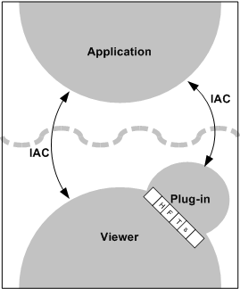
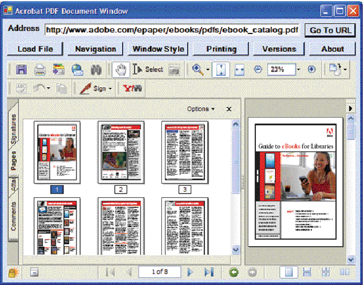

******************************************************
Developing Applications Using IAC
******************************************************

With IAC, an external application can control Acrobat or Acrobat Reader. For example, you can write an application that launches Acrobat, opens a specific file, and sets the page location and zoom factor. You can also manipulate PDF files by, for example, deleting pages or adding annotations and bookmarks. Communication between your application and the Acrobat or Acrobat Reader application occurs through objects and events.

.. raw:: html

   

About the API object layers
===========================

You can think of the Acrobat API as having two distinct layers that use IAC objects:

-  The Acrobat application (AV) layer. The AV layer en3bles you to control how the document is viewed. For example, the view of a document object resides in the layer associated with Acrobat.
-  The portable document (PD) layer. The PD layer provides access to the information within a document, such as a page. From the PD layer you can perform basic manipulations of PDF documents, such as deleting, moving, or replacing pages, as well as changing annotation attributes. You can also print PDF pages, select text, access manipulated text, and create or delete thumbnails.

You can control the application's user interface and the appearance of its window by either using its PD layer object, ``PDPage``, or by using its AV layer object, ``AVDoc``. The ``PDPage`` object has a method called ``Draw`` that exposes the rendering capabilities of Acrobat. If you need finer control, you can create your application with the ``AVDoc`` object, which has a function called ``OpenInWindow`` that can display text annotations and active links in your application's window.

You can also treat a PDF document as an ActiveX® document and implement convenient PDF browser controls through the ``AcroPDF`` object. This object provides you with the ability to load a file, move to various pages within a file, and specify various display and print options. A detailed description of its usage is provided in `Summary of OLE objects and methods <IAC_DevApp_OLE_Support.html#50401300_40418>`__.

Object reference syntax
-----------------------

The Acrobat core API exposes most of its architecture in C, although it is written to simulate an object-oriented system with nearly fifty objects. The IAC interface for OLE automation and Apple events exposes a smaller number of objects. These objects closely map to those in the Acrobat API and can be accessed through various programming languages.

DDE does not organize IAC capabilities around objects, but instead uses DDE messages to Acrobat.

OLE automation, Apple events, and AppleScript each refer to the objects with a different syntax.

-  In OLE, you use the object name in either a Visual Basic or Visual C# ``CreateObject`` statement or in an MFC ``CreateDispatch`` statement.
-  In Apple events, you use the name of the object in a ``CreateObjSpecifier`` statement.
-  In AppleScript, you use the object name in a ``set ... to`` statement.

Objects in the Acrobat application layer
-------------------------------------------

This table describes the IAC objects in the Acrobat application (AV) layer. The first three objects are the primary source for controlling the user interface.

.. list-table::
   :widths: 10 10 10 70
   :header-rows: 1

   * - Object
     - Description
     - OLE automation class name
     - Apple event class name

   * - AVApp
     - Controls the appearance of Acrobat. This is the top-level object, representing Acrobat. You can control the appearance of Acrobat, determine whether an Acrobat window appears, and set the size of the application window. Your application has access to the menu bar and the toolbar through this object.  
     - ``AcroExch.App``  
     - ``Application`` 

   * - AVDoc
     -  Represents a window containing an open PDF  file. Your application can use this object to  cause Acrobat to render into a window so that it closely resembles the Acrobat window. You can also use this object to select text, find text, or print pages. This object has several bridge methods to access other objects.   For more information on bridge methods, see `Summary of OLE objects and methods <IAC_DevApp_OLE_Support.html#50401300_40418>`__.
     - ``AcroExch.AVDoc``
     - ``Document``
       
 

   * - AVPageView
     - Controls the contents of the ``AVDoc`` window. Your application can scroll, magnify, or go to the next, previous, or any arbitrary page. This object also holds the history stack.
     - ``AcroExch.AVPageView``
     - ``PDF Window``

   * - AVMenu
     - Represents a menu in Acrobat. You can count or remove menus. Each menu has a language-independent name used to access it. 
     - None  `
     - Menu`` 

   * - AVMenuItem
     - Represents a single item in a menu. You can execute or remove menu items. Every menu item has a language-independent name used to access it.
     - None
     - ``Menu item``

   * - AVConversion
     - Represents the format in which to save the document.
     - None
     - ``conversion``

Objects in the portable document layer
--------------------------------------

This table describes the IAC objects in the portable document (PD) layer.

.. _section-1:

.. list-table::
   :widths: 10 10 10 70
   :header-rows: 1

   * - Object
     - Description
     - OLE automation class name
     - Apple event class name
   * - PDDoc
     - For OLE automation, the first page of a document is page 0. For Apple events, the first page is page 1.
     - ``AcroExch.PDDoc``
     - ``Document``
   * - PDPage
     - Represents one page of a ``PDDoc`` object. You can use this object to render Acrobat to your application's window. You can also access page size and rotation, set up text regions, and create and access annotations.  `  For OLE automation, the first page of a document is page 0. For Apple events, the first page is page 1.
     - ``AcroExch.PDPage``
     - page`` 
   * - PDAnnot
     - Manipulates link and text annotations. You can set and query the physical attributes of an annotation and you can perform a link annotation with this object.  Apple events have two additional, related objects: ``PDTextAnnot``, a text annotation, and ``PDLinkAnnot``, a link annotation. 
     - ``AcroExch.PDAnnot``
     - ``annotation``
   * - PDBookmark
     - Represents bookmarks in the PDF document. You cannot directly create a bookmark, but if you know a bookmark's title, you can change its title or delete it.
     - ``AcroExch.PDBookmark``
     - ``bookmark``
   * - PDTextSelect
     - Causes text to appear selected. If selected text exists within an ``AVDoc`` object, your application can also access the words in that region through this object.
     - ``AcroExch.PDTextSelect``
     - None

Plugins for extending the IAC interfaces
========================================

You can extend the functionality of the IAC interfaces by writing Plugins that use core API objects that are not already part of the IAC support system. The following graphic shows the software architecture needed to establish a connection. The plug-in calls methods through host function tables (HFTs).

Using Plugins for interapplication communication

Similarly, the ``JSObject`` interface provides you with convenient access to the Acrobat features made available through JavaScript. Take advantage of this interface wherever possible. Its usage is explained in `Using the JSObject interface <IAC_DevApp_OLE_Support.html#50401300_56738>`__.

.. tip::

   Your plugins should make use of a broker to work correctly when protected mode is enabled.

Developing for Acrobat Reader
=============================

On Windows, the only OLE automation supported for Reader is the *PDF browser controls* interface, which enables you to treat a PDF document as an ActiveX document within an external application. This makes it possible to load a file, move to various pages within the file, highlight a text selection, and specify various print and display options, as shown below.

PDF browser controls

PDF browser controls are available through the ``AxAcroPDFLib.AxAcroPDF`` interface, which provides the following methods used to programmatically control the PDF document window:

-  ``GoBackwardStack``
-  ``GoForwardStack``
-  ``GotoFirstPage``
-  ``GotoLastPage``
-  ``GotoNextPage``
-  ``GotoPreviousPage``
-  ``LoadFile``
-  ``Print``
-  ``PrintAll``
-  ``PrintAllFit``
-  ``PrintPages``
-  ``PrintPagesFit``
-  ``PrintWithDialog``
-  ``SetCurrentHighlight``
-  ``SetCurrentPage``
-  ``SetLayoutMode``
-  ``SetNamedDest``
-  ``SetPageMode``
-  ``SetShowScrollbars``
-  ``SetShowToolbar``
-  ``SetView``
-  ``SetViewRect``
-  ``SetViewScroll``
-  ``SetZoom``
-  ``SetZoomScroll``

DDE messages
============

Adobe Reader supports the following DDE messages:

-  ``AppExit``
-  ``CloseAllDocs``
-  ``DocClose``
-  ``DocGoTo``
-  ``DocGoToNameDest``
-  ``DocOpen``
-  ``FileOpen``
-  ``FileOpenEx``
-  ``FilePrint``
-  ``FilePrintEx``
-  ``FilePrintSilent``
-  ``FilePrintSilentEx``
-  ``FilePrintTo``
-  ``FilePrintToEx``

Apple events
============

On Mac OS, you may use Apple events and AppleScript. Adobe Reader supports only the following *required* Apple events:

-  ``open``
-  ``print``
-  ``quit``
-  ``run``