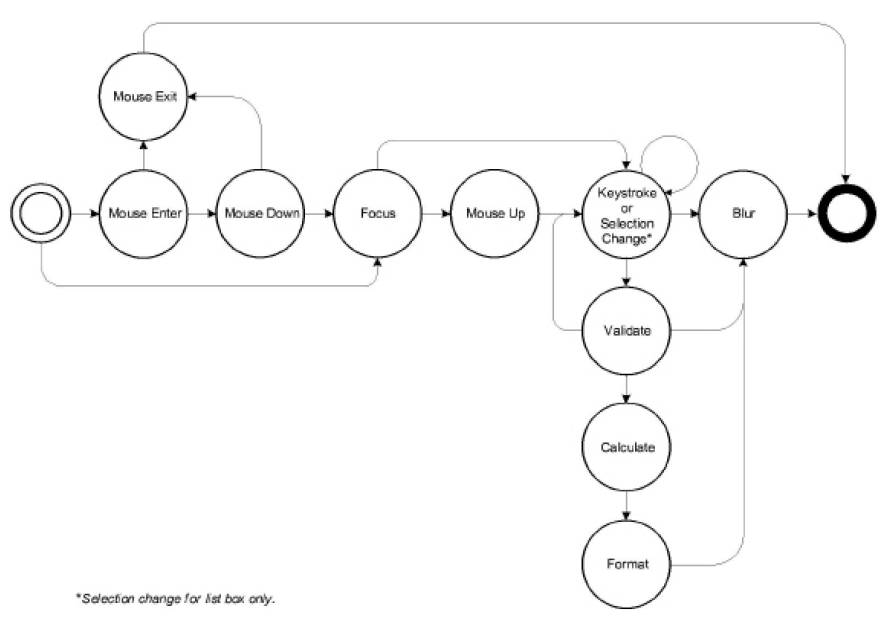

******************************************************
JavaScript APIs
******************************************************

.. raw:: html

   <a name="53810"></a>

Alerter
=======

.. list-table::
   :header-rows: 1

   * - Acrobat #
     - Save and Preferences
     - Security?
     - Availability
   * - 7.0
     - No
     - No
     - All

The Acrobat multimedia plug-in displays error alerts under various conditions such as a missing media file. JavaScript code can customize these alerts, either for an entire document or for an individual media player.

In an alert situation, the internal function ``app.media.alert`` is called with parameters containing information about the alert. The ``app.media.alert`` method handles the alert by looking for alerter objects and calling their ``dispatch`` methods, in this order:

::

      args.alerter
      doc.media.alerter
      doc.media.stockAlerter

To handle alerts for a specific player, provide an alerter object in ``args.alerter`` when you call ``app.media.createPlayer`` or ``app.media.openPlayer``.

To handle alerts for an entire document, set ``doc.media.alerter`` to an alerter object.

All alerts can be suppressed for a player or document by setting ``args.alerter`` or ``doc.media.alerter`` to ``null``.

``doc.media.stockAlerter`` provides the default alerts that are used if a custom alerter is not specified. This property is initialized automatically by ``app.media.alert``. Normally, ``doc.media.stockAlerter`` would not be referenced in developer code.

Alerter methods
---------------

* `dispatch <JS_API_AcroJS.html#41501>`__

.. raw:: html

   <a name="41501"></a>

dispatch
~~~~~~~~
.. list-table::
   :header-rows: 1

   * - Acrobat #
     - Save and Preferences
     - Security?
     - Availability
   * - 7.0
     - No
     - No
     - All

Called by ``app.media.alert`` to handle alert situations.

**Parameters**

* ``alert`` An `Alert object <JS_API_AcroJS.html#41949>`__ (see below).

**Returns** 

A Boolean value, ``true`` to stop further alert processing, ``false`` to continue processing.

.. raw:: html

   <a name="41949"></a>

**Alert object**

.. list-table::
   :widths: 10 10 80
   :header-rows: 1

   * - Properties
     - Type
     - Description

   * - ``type``
     - String
     - All alert types

   * - ``doc``
     - Doc object
     - All alert types

   * - ``fromUser``
     - Boolean
     - All alert types

   * - ``error``
     - Object
     - Available for the Exception type alert. The error object has a ``message`` property:
       
       ``error: { message: String }``

   * - ``errorText``
     - String
     - Available for the PlayerError type alert.

   * - ``fileName``
     - String
     - Available for the FileNotFound type alert.

   * - ``selection``
     - ``MediaSelection`` object
     - Available for the SelectFailed type alert.

Example 1: Open a media player and suppress all alerts for this player.

::

      app.media.openPlayer({ alerter: null });
      
      // A more elaborate way to do the same thing
      app.media.openPlayer(
      {
          alerter:
          {
              dispatch() { return true; }
          }
      });

Example 2: For all players in this document, log any alerts to a text field and allow the normal alert box to be displayed.

::

      function logAlerts( doc )
      {
          count = 0;
          doc.alerter =
          {
              dispatch( alert )
              {
                  doc.getField("AlertLog").value += "Alert #" 
                      + ++count + ": " + alert.type + "n";
              }
          }
      }
      logAlerts( this );
      
      // Another way to keep the counter
      function logAlerts( doc )
      {
          doc.alerter =
          {
              count = 0,
              dispatch( alert )
              {
                  doc.getField("AlertLog").value += "Alert #" 
                      + ++this.count + ": " + alert.type + "n";
              }
          }
      }
      logAlerts( this );

Example  3: Handle the PlayerError alert here, with defaults for other alerts.

::

      this.media.alerter =
      {
          dispatch( alert )
          {
              switch( alert.type )
              {
                  case "PlayerError":
                  app.alert( "Player error: " + alert.errorText );
                  return true;
              }
          }
      }

.. raw:: html

   <a name="15210"></a>

AlternatePresentation
=====================

This object provides an interface to the document's particular alternate presentation. Use the Doc object method `alternatePresentations <JS_API_AcroJS.html#27482>`__ to acquire an AlternatePresentation object.

See the `PDF Referece <https://adobe.com/go/pdfreference>`_ for additional details on alternate presentations.

AlternatePresentation properties
--------------------------------

* `active <JS_API_AcroJS.html#45263>`__
* `type <JS_API_AcroJS.html#39659>`__

.. raw:: html

   <a name="45263"></a>

active
~~~~~~

.. list-table::
   :header-rows: 1

   * - Acrobat #
     - Save and Preferences
     - Security?
     - Availability
     - Type
     - Access
   * - 6.0
     - No
     - No
     - All
     - boolean
     - R

This property is ``true`` if the presentation is currently active and ``false`` otherwise. When a presentation is active, it controls how the document that owns it is displayed.

Example: See the `start <JS_API_AcroJS.html#63957>`__ method for an example.

.. raw:: html

   <a name="39659"></a>

type
~~~~

.. list-table::
   :header-rows: 1

   * - Acrobat #
     - Save and Preferences
     - Security?
     - Availability
     - Type
     - Access
   * - 6.0
     - No
     - No
     - All
     - string
     - R

The type of the alternate presentation. Currently, the only supported type is "SlideShow".

AlternatePresentation methods
-----------------------------

* `start <JS_API_AcroJS.html#63957>`__
* `stop <JS_API_AcroJS.html#40183>`__

.. raw:: html

   <a name="63957"></a>

start
~~~~~

.. list-table::
   :header-rows: 1

   * - Acrobat #
     - Save and Preferences
     - Security?
     - Availability
   * - 6.0
     - No
     - No
     - All

Switches the document view into the alternate presentation mode and sets the ``active`` property to ``true``. An exception is thrown if this or any other alternate presentation is already active.

**Parameters**

.. list-table::
   :widths: 10 90
   :header-rows: 1

   * - Parameter
     - Description
   * - ``cOnStop``
     - (optional) An expression to be evaluated by Acrobat when the presentation completes for any reason (as a result of a call to ``stop``, an explicit user action, or the presentation logic itself). 

   * - ``cCommand``
     - (optional) A command or script to pass to the alternate presentation.  -  This command is presentation-specific (not a JavaScript expression).

Example: Assume there is a named presentation called "MySlideShow" within the document.

::

      // oMySlideShow is an AlternatePresentation object
      oMySlideShow = this.alternatePresentations.MySlideShow;
      if (!oMySlideShow.active) oMySlideShow.start();

Note that ``this.alternatePresentations`` is used to access the specified presentation by property name.

.. raw:: html

   <a name="40183"></a>

stop
~~~~

.. list-table::
   :header-rows: 1

   * - Acrobat #
     - Save and Preferences
     - Security?
     - Availability
   * - 6.0
     - No
     - No
     - All

Stops the presentation and switches the document into normal (PDF) presentation. An exception is thrown if this presentation is not active.

Example: In this example, ``oMySlideShow`` is an AlternatePresentations object. See `start <JS_API_AcroJS.html#63957>`__ for a related example.

::

      // Stop the show if already active
      if (oMySlideShow.active) oMySlideShow.stop();

annotAttachment
===============

The ``annotAttachment`` object represents the file stored as the attachment for a ``FileAttachment`` type annotation. ``annotAttachment`` is similar to the ``Data`` object and represents the file content and metadata of the attachment.

See the `PDF Referece <https://adobe.com/go/pdfreference>`_ for additional details on annotations.

annotAttachment properties
--------------------------

* `contentStream <JS_API_AcroJS.html#72818>`__
* `creationDate <JS_API_AcroJS.html#34862>`__
* `MIMEtype <JS_API_AcroJS.html#43017>`__
* `modDate <JS_API_AcroJS.html#87427>`__
* `name <JS_API_AcroJS.html#39211>`__
* `pathname <JS_API_AcroJS.html#17608>`__
* `size <JS_API_AcroJS.html#22417>`__

.. raw:: html

   <a name="72818"></a>

contentStream
~~~~~~~~~~~~~

.. list-table::
   :header-rows: 1

   * - Acrobat #
     - Save and Preferences
     - Security?
     - Availability
     - Type
     - Access
   * - 11.0
     - No
     - No
     - All
     - object
     - R

A ``ReadStream`` property representing the file attachment stream. This property enables access to the contents of the file attachment associated with an ``annotAttachment`` object.

A ``NotAllowedError`` is thrown and the method fails if it attempts to access the content of an embedded file attachment for which any of the following conditions is true (all file name extension matching is case-insensitive):

-  The attachment's file name extension is ".SWF". If a legitimate .SWF application or module run as part of Acrobat's Rich Media Annotation or PDF Portfolio navigator is allowed access to the content bytes of .SWF embedded file attachments, it is possible that the legitimate .SWF will load a malicious .SWF.

.. note::

   If you use the ``Data.MIMEType`` property to check whether a Data object represents a .SWF file, note that the MIME type for .SWF files is ``application/x-shockwave-flash``.

-  The attachment's file name extension is ".GIF", ".JPG", ".JPEG", or ".PNG" and the first three bytes of its content have the header signature of a .SWF file ("FWS" or "CWS"). The reason for this security restriction is that the same ``ActionScriptflash.display.Loader class load()`` method that can be used to load GIF, JPEG, and PNG images can also be used to load a SWF file. If a malicious SWF file's extension has been altered to that of one of these image types, the SWF could be loaded.

.. raw:: html

   <a name="34862"></a>

creationDate
~~~~~~~~~~~~

.. list-table::
   :header-rows: 1

   * - Acrobat #
     - Save and Preferences
     - Security?
     - Availability
     - Type
     - Access
   * - 11.0
     - No
     - No
     - All
     - date
     - R

The date of creation of the attached file.

.. raw:: html

   <a name="43017"></a>

MIMEtype
~~~~~~~~

.. list-table::
   :header-rows: 1

   * - Acrobat #
     - Save and Preferences
     - Security?
     - Availability
     - Type
     - Access
   * - 11.0
     - No
     - No
     - All
     - string
     - R

The MIME type of the attached file.

.. raw:: html

   <a name="87427"></a>

modDate
~~~~~~~

.. list-table::
   :header-rows: 1

   * - Acrobat #
     - Save and Preferences
     - Security?
     - Availability
     - Type
     - Access
   * - 11.0
     - No
     - No
     - No
     - date
     - R 

The date of modification of the attached file.

.. raw:: html

   <a name="39211"></a>

name
~~~~

.. list-table::
   :header-rows: 1

   * - Acrobat #
     - Save and Preferences
     - Security?
     - Availability
     - Type
     - Access
   * - 11.0
     - No
     - No
     - All
     - string
     - R

The name of the attached file.

.. raw:: html

   <a name="17608"></a>

pathname
~~~~~~~~

.. list-table::
   :header-rows: 1

   * - Acrobat #
     - Save and Preferences
     - Security?
     - Availability
     - Type
     - Access
   * - 11.0
     - No
     - No
     - All
     - string
     - R

The pathname of the attached file.

.. raw:: html

   <a name="22417"></a>

size
~~~~

.. list-table::
   :header-rows: 1

   * - Acrobat #
     - Save and Preferences
     - Security?
     - Availability
     - Type
     - Access
   * - 11.0
     - No
     - No
     - All
     - number
     - R

The size, in bytes, of the uncompressed attachment.

Example: 

::

      var annot = this.addAnnot({
          page: 0
          type: "FileAttachment",
          point: [400,500],
          author: "A. C. Robat",
          contents: "Call Smith to get help on this paragraph.",
          cAttachmentPath: "/d/a.pdf",
      }); 
      var attachObj = annot.attachment;
      console.println("Name: " + attachObj.name);
      console.println("Type: " + attachObj.MIMEType);
      console.println("Size: "+ attachObj.size);
      console.println("==============Content=================");
      var stm = attachObj.contentStream;
      console.println(util.stringFromStream(stm));

Annotation
==========

This object represents an Acrobat annotation. Annotations can be created using the Acrobat annotation tool or by using the Doc object method ``addAnnot``.

Before an annotation can be accessed, it must be bound to a JavaScript variable through a Doc object method such as ``getAnnot`` :

::

      var a = this.getAnnot(0, "Important");

The script can then manipulate the annotation named "Important" on page 1 (0-based page numbering system) by means of the variable ``a``. For example, the following code first stores the type of annotation in the variable ``thetype``, then changes the author to "John Q. Public".

::

      var thetype = a.type;          // read property
      a.author = "John Q. Public";   // write property

Another way of accessing the Annotation object is through the Doc object ``getAnnots`` method.

.. note::

   In Adobe Reader 5.1 or later, you can get the value of any annotation property except ``contents``. The ability to set these properties depends on Comments document rights, as indicated by the *C* icon.

.. note::

   The user interface in Acrobat refers to annotations as *comments* .

.. raw:: html

   <a name="51128"></a>

Annotation types
----------------

Annotations are of different types, as reflected in the ``type`` property. Each type is listed in the table below, along with all documented properties returned by the ``getProps`` method.

.. list-table::
   :widths: 10 90
   :header-rows: 1

   * - Annotation type
     - Properties

   * - ``Caret``
     - `author <JS_API_AcroJS.html#80493>`__, `borderEffectIntensity <JS_API_AcroJS.html#14280>`__, `borderEffectStyle <JS_API_AcroJS.html#98183>`__, `caretSymbol <JS_API_AcroJS.html#41597>`__, `contents <JS_API_AcroJS.html#62713>`__, `creationDate <JS_API_AcroJS.html#59581>`__, `delay <JS_API_AcroJS.html#44387>`__, `hidden <JS_API_AcroJS.html#72369>`__, `inReplyTo <JS_API_AcroJS.html#58242>`__, `intent <JS_API_AcroJS.html#42956>`__, `lock <JS_API_AcroJS.html#59735>`__, `modDate <JS_API_AcroJS.html#22713>`__, `name <JS_API_AcroJS.html#95838>`__, `noView <JS_API_AcroJS.html#51663>`__, `opacity <JS_API_AcroJS.html#91716>`__, `page <JS_API_AcroJS.html#18012>`__, `popupOpen <JS_API_AcroJS.html#13181>`__, `popupRect <JS_API_AcroJS.html#35916>`__, `print <JS_API_AcroJS.html#25722>`__, `readOnly <JS_API_AcroJS.html#64008>`__, `rect <JS_API_AcroJS.html#31420>`__, `refType <JS_API_AcroJS.html#77065>`__, `richContents <JS_API_AcroJS.html#52718>`__, `rotate <JS_API_AcroJS.html#37250>`__, `seqNum <JS_API_AcroJS.html#46593>`__, `strokeColor <JS_API_AcroJS.html#14118>`__, `style <JS_API_AcroJS.html#29533>`__, `subject <JS_API_AcroJS.html#49482>`__, `toggleNoView <JS_API_AcroJS.html#70681>`__, `type <JS_API_AcroJS.html#68108>`__, `width <JS_API_AcroJS.html#86349>`__

   * - ``Circle``
     - `author <JS_API_AcroJS.html#80493>`__, `borderEffectIntensity <JS_API_AcroJS.html#14280>`__, `borderEffectStyle <JS_API_AcroJS.html#98183>`__, `contents <JS_API_AcroJS.html#62713>`__, `creationDate <JS_API_AcroJS.html#59581>`__, `dash <JS_API_AcroJS.html#48107>`__, `delay <JS_API_AcroJS.html#44387>`__, `fillColor <JS_API_AcroJS.html#69717>`__, `hidden <JS_API_AcroJS.html#72369>`__, `inReplyTo <JS_API_AcroJS.html#58242>`__, `intent <JS_API_AcroJS.html#42956>`__, `lock <JS_API_AcroJS.html#59735>`__, `modDate <JS_API_AcroJS.html#22713>`__, `name <JS_API_AcroJS.html#95838>`__, `noView <JS_API_AcroJS.html#51663>`__, `opacity <JS_API_AcroJS.html#91716>`__, `page <JS_API_AcroJS.html#18012>`__, `popupOpen <JS_API_AcroJS.html#13181>`__, `popupRect <JS_API_AcroJS.html#35916>`__, `print <JS_API_AcroJS.html#25722>`__, `readOnly <JS_API_AcroJS.html#64008>`__, `rect <JS_API_AcroJS.html#31420>`__, `refType <JS_API_AcroJS.html#77065>`__, `richContents <JS_API_AcroJS.html#52718>`__, `rotate <JS_API_AcroJS.html#37250>`__, `seqNum <JS_API_AcroJS.html#46593>`__, `strokeColor <JS_API_AcroJS.html#14118>`__, `style <JS_API_AcroJS.html#29533>`__, `subject <JS_API_AcroJS.html#49482>`__, `toggleNoView <JS_API_AcroJS.html#70681>`__, `type <JS_API_AcroJS.html#68108>`__, `width <JS_API_AcroJS.html#86349>`__

   * - ``FileAttachment``
     - `attachIcon <JS_API_AcroJS.html#97925>`__, `attachment <JS_API_AcroJS.html#75359>`__, `author <JS_API_AcroJS.html#80493>`__, `borderEffectIntensity <JS_API_AcroJS.html#14280>`__, `borderEffectStyle <JS_API_AcroJS.html#98183>`__, `cAttachmentPath <JS_API_AcroJS.html#43581>`__, `contents <JS_API_AcroJS.html#62713>`__, `creationDate <JS_API_AcroJS.html#59581>`__, `delay <JS_API_AcroJS.html#44387>`__, `hidden <JS_API_AcroJS.html#72369>`__, `inReplyTo <JS_API_AcroJS.html#58242>`__, `intent <JS_API_AcroJS.html#42956>`__, `lock <JS_API_AcroJS.html#59735>`__, `modDate <JS_API_AcroJS.html#22713>`__, `name <JS_API_AcroJS.html#95838>`__, `noView <JS_API_AcroJS.html#51663>`__, `opacity <JS_API_AcroJS.html#91716>`__, `page <JS_API_AcroJS.html#18012>`__, `point <JS_API_AcroJS.html#25272>`__, `print <JS_API_AcroJS.html#25722>`__, `readOnly <JS_API_AcroJS.html#64008>`__, `rect <JS_API_AcroJS.html#31420>`__, `refType <JS_API_AcroJS.html#77065>`__, `richContents <JS_API_AcroJS.html#52718>`__, `rotate <JS_API_AcroJS.html#37250>`__, `seqNum <JS_API_AcroJS.html#46593>`__, `strokeColor <JS_API_AcroJS.html#14118>`__, `style <JS_API_AcroJS.html#29533>`__, `subject <JS_API_AcroJS.html#49482>`__, `toggleNoView <JS_API_AcroJS.html#70681>`__, `type <JS_API_AcroJS.html#68108>`__, `width <JS_API_AcroJS.html#86349>`__

   * - ``FreeText``
     - `alignment <JS_API_AcroJS.html#99809>`__, `author <JS_API_AcroJS.html#80493>`__, `borderEffectIntensity <JS_API_AcroJS.html#14280>`__, `borderEffectStyle <JS_API_AcroJS.html#98183>`__, `callout <JS_API_AcroJS.html#99031>`__, `contents <JS_API_AcroJS.html#62713>`__, `creationDate <JS_API_AcroJS.html#59581>`__, `dash <JS_API_AcroJS.html#48107>`__, `delay <JS_API_AcroJS.html#44387>`__, `fillColor <JS_API_AcroJS.html#69717>`__, `hidden <JS_API_AcroJS.html#72369>`__, `inReplyTo <JS_API_AcroJS.html#58242>`__, `intent <JS_API_AcroJS.html#42956>`__, `lineEnding <JS_API_AcroJS.html#46482>`__, `lock <JS_API_AcroJS.html#59735>`__, `modDate <JS_API_AcroJS.html#22713>`__, `name <JS_API_AcroJS.html#95838>`__, `noView <JS_API_AcroJS.html#51663>`__, `opacity <JS_API_AcroJS.html#91716>`__, `page <JS_API_AcroJS.html#18012>`__, `print <JS_API_AcroJS.html#25722>`__, `readOnly <JS_API_AcroJS.html#64008>`__, `rect <JS_API_AcroJS.html#31420>`__, `refType <JS_API_AcroJS.html#77065>`__, `richContents <JS_API_AcroJS.html#52718>`__, `richDefaults <JS_API_AcroJS.html#95750>`__, `rotate <JS_API_AcroJS.html#37250>`__, `seqNum <JS_API_AcroJS.html#46593>`__, `strokeColor <JS_API_AcroJS.html#14118>`__, `style <JS_API_AcroJS.html#29533>`__, `subject <JS_API_AcroJS.html#49482>`__, `textFont <JS_API_AcroJS.html#93184>`__, `textSize <JS_API_AcroJS.html#79538>`__, `toggleNoView <JS_API_AcroJS.html#70681>`__, `type <JS_API_AcroJS.html#68108>`__, `width <JS_API_AcroJS.html#86349>`__

   * - ``Highlight``
     - `author <JS_API_AcroJS.html#80493>`__, `borderEffectIntensity <JS_API_AcroJS.html#14280>`__, `borderEffectStyle <JS_API_AcroJS.html#98183>`__, `contents <JS_API_AcroJS.html#62713>`__, `creationDate <JS_API_AcroJS.html#59581>`__, `delay <JS_API_AcroJS.html#44387>`__, `hidden <JS_API_AcroJS.html#72369>`__, `inReplyTo <JS_API_AcroJS.html#58242>`__, `intent <JS_API_AcroJS.html#42956>`__, `lock <JS_API_AcroJS.html#59735>`__, `modDate <JS_API_AcroJS.html#22713>`__, `name <JS_API_AcroJS.html#95838>`__, `noView <JS_API_AcroJS.html#51663>`__, `opacity <JS_API_AcroJS.html#91716>`__, `page <JS_API_AcroJS.html#18012>`__, `popupOpen <JS_API_AcroJS.html#13181>`__, `popupRect <JS_API_AcroJS.html#35916>`__, `print <JS_API_AcroJS.html#25722>`__, `quads <JS_API_AcroJS.html#42514>`__, `readOnly <JS_API_AcroJS.html#64008>`__, `rect <JS_API_AcroJS.html#31420>`__, `refType <JS_API_AcroJS.html#77065>`__, `richContents <JS_API_AcroJS.html#52718>`__, `rotate <JS_API_AcroJS.html#37250>`__, `seqNum <JS_API_AcroJS.html#46593>`__, `strokeColor <JS_API_AcroJS.html#14118>`__, `style <JS_API_AcroJS.html#29533>`__, `subject <JS_API_AcroJS.html#49482>`__, `toggleNoView <JS_API_AcroJS.html#70681>`__, `type <JS_API_AcroJS.html#68108>`__, `width <JS_API_AcroJS.html#86349>`__

   * - ``Ink``
     - `author <JS_API_AcroJS.html#80493>`__, `borderEffectIntensity <JS_API_AcroJS.html#14280>`__, `borderEffectStyle <JS_API_AcroJS.html#98183>`__, `contents <JS_API_AcroJS.html#62713>`__, `creationDate <JS_API_AcroJS.html#59581>`__, `dash <JS_API_AcroJS.html#48107>`__, `delay <JS_API_AcroJS.html#44387>`__, `gestures <JS_API_AcroJS.html#72469>`__, `hidden <JS_API_AcroJS.html#72369>`__, `inReplyTo <JS_API_AcroJS.html#58242>`__, `intent <JS_API_AcroJS.html#42956>`__, `lock <JS_API_AcroJS.html#59735>`__, `modDate <JS_API_AcroJS.html#22713>`__, `name <JS_API_AcroJS.html#95838>`__, `noView <JS_API_AcroJS.html#51663>`__, `opacity <JS_API_AcroJS.html#91716>`__, `page <JS_API_AcroJS.html#18012>`__, `popupOpen <JS_API_AcroJS.html#13181>`__, `popupRect <JS_API_AcroJS.html#35916>`__, `print <JS_API_AcroJS.html#25722>`__, `readOnly <JS_API_AcroJS.html#64008>`__, `rect <JS_API_AcroJS.html#31420>`__, `refType <JS_API_AcroJS.html#77065>`__, `richContents <JS_API_AcroJS.html#52718>`__, `rotate <JS_API_AcroJS.html#37250>`__, `seqNum <JS_API_AcroJS.html#46593>`__, `strokeColor <JS_API_AcroJS.html#14118>`__, `style <JS_API_AcroJS.html#29533>`__, `subject <JS_API_AcroJS.html#49482>`__, `toggleNoView <JS_API_AcroJS.html#70681>`__, `type <JS_API_AcroJS.html#68108>`__, `width <JS_API_AcroJS.html#86349>`__

   * - ``Line``
     - `arrowBegin <JS_API_AcroJS.html#17692>`__, `arrowEnd <JS_API_AcroJS.html#57468>`__, `author <JS_API_AcroJS.html#80493>`__, `borderEffectIntensity <JS_API_AcroJS.html#14280>`__, `borderEffectStyle <JS_API_AcroJS.html#98183>`__, `contents <JS_API_AcroJS.html#62713>`__, `creationDate <JS_API_AcroJS.html#59581>`__, `dash <JS_API_AcroJS.html#48107>`__, `delay <JS_API_AcroJS.html#44387>`__, `doCaption <JS_API_AcroJS.html#42571>`__, `fillColor <JS_API_AcroJS.html#69717>`__, `hidden <JS_API_AcroJS.html#72369>`__, `inReplyTo <JS_API_AcroJS.html#58242>`__, `intent <JS_API_AcroJS.html#42956>`__, `leaderExtend <JS_API_AcroJS.html#88415>`__, `leaderLength <JS_API_AcroJS.html#18708>`__, `lock <JS_API_AcroJS.html#59735>`__, `modDate <JS_API_AcroJS.html#22713>`__, `name <JS_API_AcroJS.html#95838>`__, `noView <JS_API_AcroJS.html#51663>`__, `opacity <JS_API_AcroJS.html#91716>`__, `page <JS_API_AcroJS.html#18012>`__, `points <JS_API_AcroJS.html#47728>`__, `popupOpen <JS_API_AcroJS.html#13181>`__, `popupRect <JS_API_AcroJS.html#35916>`__, `print <JS_API_AcroJS.html#25722>`__, `readOnly <JS_API_AcroJS.html#64008>`__, `rect <JS_API_AcroJS.html#31420>`__, `refType <JS_API_AcroJS.html#77065>`__, `richContents <JS_API_AcroJS.html#52718>`__, `rotate <JS_API_AcroJS.html#37250>`__, `seqNum <JS_API_AcroJS.html#46593>`__, `strokeColor <JS_API_AcroJS.html#14118>`__, `style <JS_API_AcroJS.html#29533>`__, `subject <JS_API_AcroJS.html#49482>`__, `toggleNoView <JS_API_AcroJS.html#70681>`__, `type <JS_API_AcroJS.html#68108>`__, `width <JS_API_AcroJS.html#86349>`__

   * - ``Polygon``
     - `author <JS_API_AcroJS.html#80493>`__, `borderEffectIntensity <JS_API_AcroJS.html#14280>`__, `borderEffectStyle <JS_API_AcroJS.html#98183>`__, `contents <JS_API_AcroJS.html#62713>`__, `creationDate <JS_API_AcroJS.html#59581>`__, `dash <JS_API_AcroJS.html#48107>`__, `delay <JS_API_AcroJS.html#44387>`__, `fillColor <JS_API_AcroJS.html#69717>`__, `hidden <JS_API_AcroJS.html#72369>`__, `inReplyTo <JS_API_AcroJS.html#58242>`__, `intent <JS_API_AcroJS.html#42956>`__, `lock <JS_API_AcroJS.html#59735>`__, `modDate <JS_API_AcroJS.html#22713>`__, `name <JS_API_AcroJS.html#95838>`__, `noView <JS_API_AcroJS.html#51663>`__, `opacity <JS_API_AcroJS.html#91716>`__, `page <JS_API_AcroJS.html#18012>`__, `popupOpen <JS_API_AcroJS.html#13181>`__, `popupRect <JS_API_AcroJS.html#35916>`__, `print <JS_API_AcroJS.html#25722>`__, `readOnly <JS_API_AcroJS.html#64008>`__, `rect <JS_API_AcroJS.html#31420>`__, `refType <JS_API_AcroJS.html#77065>`__, `richContents <JS_API_AcroJS.html#52718>`__, `rotate <JS_API_AcroJS.html#37250>`__, `seqNum <JS_API_AcroJS.html#46593>`__, `strokeColor <JS_API_AcroJS.html#14118>`__, `style <JS_API_AcroJS.html#29533>`__, `subject <JS_API_AcroJS.html#49482>`__, `toggleNoView <JS_API_AcroJS.html#70681>`__, `type <JS_API_AcroJS.html#68108>`__, `vertices <JS_API_AcroJS.html#33431>`__, `width <JS_API_AcroJS.html#86349>`__

   * - ``PolyLine``
     - `arrowBegin <JS_API_AcroJS.html#17692>`__, `arrowEnd <JS_API_AcroJS.html#57468>`__, `author <JS_API_AcroJS.html#80493>`__, `borderEffectIntensity <JS_API_AcroJS.html#14280>`__, `borderEffectStyle <JS_API_AcroJS.html#98183>`__, `contents <JS_API_AcroJS.html#62713>`__, `creationDate <JS_API_AcroJS.html#59581>`__, `dash <JS_API_AcroJS.html#48107>`__, `delay <JS_API_AcroJS.html#44387>`__, `fillColor <JS_API_AcroJS.html#69717>`__, `hidden <JS_API_AcroJS.html#72369>`__, `inReplyTo <JS_API_AcroJS.html#58242>`__, `intent <JS_API_AcroJS.html#42956>`__, `lock <JS_API_AcroJS.html#59735>`__, `modDate <JS_API_AcroJS.html#22713>`__, `name <JS_API_AcroJS.html#95838>`__, `noView <JS_API_AcroJS.html#51663>`__, `opacity <JS_API_AcroJS.html#91716>`__, `page <JS_API_AcroJS.html#18012>`__, `popupOpen <JS_API_AcroJS.html#13181>`__, `popupRect <JS_API_AcroJS.html#35916>`__, `print <JS_API_AcroJS.html#25722>`__, `readOnly <JS_API_AcroJS.html#64008>`__, `rect <JS_API_AcroJS.html#31420>`__, `refType <JS_API_AcroJS.html#77065>`__, `richContents <JS_API_AcroJS.html#52718>`__, `rotate <JS_API_AcroJS.html#37250>`__, `seqNum <JS_API_AcroJS.html#46593>`__, `strokeColor <JS_API_AcroJS.html#14118>`__, `style <JS_API_AcroJS.html#29533>`__, `subject <JS_API_AcroJS.html#49482>`__, `toggleNoView <JS_API_AcroJS.html#70681>`__, `type <JS_API_AcroJS.html#68108>`__, `vertices <JS_API_AcroJS.html#33431>`__, `width <JS_API_AcroJS.html#86349>`__

   * - ``Redact``
     - In addition to all the usual properites of a markup type annotation (see for example, the property list of the ``Highlight`` type), the properties `alignment <JS_API_AcroJS.html#99809>`__, `overlayText <JS_API_AcroJS.html#77086>`__ and `repeat <JS_API_AcroJS.html#60232>`__ are particular to the ``Redact`` annotation.

   * - ``Sound``
     - `author <JS_API_AcroJS.html#80493>`__, `borderEffectIntensity <JS_API_AcroJS.html#14280>`__, `borderEffectStyle <JS_API_AcroJS.html#98183>`__, `contents <JS_API_AcroJS.html#62713>`__, `creationDate <JS_API_AcroJS.html#59581>`__, `delay <JS_API_AcroJS.html#44387>`__, `hidden <JS_API_AcroJS.html#72369>`__, `inReplyTo <JS_API_AcroJS.html#58242>`__, `intent <JS_API_AcroJS.html#42956>`__, `lock <JS_API_AcroJS.html#59735>`__, `modDate <JS_API_AcroJS.html#22713>`__, `name <JS_API_AcroJS.html#95838>`__, `noView <JS_API_AcroJS.html#51663>`__, `opacity <JS_API_AcroJS.html#91716>`__, `page <JS_API_AcroJS.html#18012>`__, `point <JS_API_AcroJS.html#25272>`__, `print <JS_API_AcroJS.html#25722>`__, `readOnly <JS_API_AcroJS.html#64008>`__, `rect <JS_API_AcroJS.html#31420>`__, `refType <JS_API_AcroJS.html#77065>`__, `richContents <JS_API_AcroJS.html#52718>`__, `rotate <JS_API_AcroJS.html#37250>`__, `seqNum <JS_API_AcroJS.html#46593>`__, `soundIcon <JS_API_AcroJS.html#27366>`__, `strokeColor <JS_API_AcroJS.html#14118>`__, `style <JS_API_AcroJS.html#29533>`__, `subject <JS_API_AcroJS.html#49482>`__, `toggleNoView <JS_API_AcroJS.html#70681>`__, `type <JS_API_AcroJS.html#68108>`__, `width <JS_API_AcroJS.html#86349>`__

   * - ``Square``
     - `author <JS_API_AcroJS.html#80493>`__, `borderEffectIntensity <JS_API_AcroJS.html#14280>`__, `borderEffectStyle <JS_API_AcroJS.html#98183>`__, `contents <JS_API_AcroJS.html#62713>`__, `creationDate <JS_API_AcroJS.html#59581>`__, `dash <JS_API_AcroJS.html#48107>`__, `delay <JS_API_AcroJS.html#44387>`__, `fillColor <JS_API_AcroJS.html#69717>`__, `hidden <JS_API_AcroJS.html#72369>`__, `inReplyTo <JS_API_AcroJS.html#58242>`__, `intent <JS_API_AcroJS.html#42956>`__, `lock <JS_API_AcroJS.html#59735>`__, `modDate <JS_API_AcroJS.html#22713>`__, `name <JS_API_AcroJS.html#95838>`__, `noView <JS_API_AcroJS.html#51663>`__, `opacity <JS_API_AcroJS.html#91716>`__, `page <JS_API_AcroJS.html#18012>`__, `popupOpen <JS_API_AcroJS.html#13181>`__, `popupRect <JS_API_AcroJS.html#35916>`__, `print <JS_API_AcroJS.html#25722>`__, `readOnly <JS_API_AcroJS.html#64008>`__, `rect <JS_API_AcroJS.html#31420>`__, `refType <JS_API_AcroJS.html#77065>`__, `richContents <JS_API_AcroJS.html#52718>`__, `rotate <JS_API_AcroJS.html#37250>`__, `seqNum <JS_API_AcroJS.html#46593>`__, `strokeColor <JS_API_AcroJS.html#14118>`__, `style <JS_API_AcroJS.html#29533>`__, `subject <JS_API_AcroJS.html#49482>`__, `toggleNoView <JS_API_AcroJS.html#70681>`__, `type <JS_API_AcroJS.html#68108>`__, `width <JS_API_AcroJS.html#86349>`__

   * - ``Squiggly``
     - `author <JS_API_AcroJS.html#80493>`__, `borderEffectIntensity <JS_API_AcroJS.html#14280>`__, `borderEffectStyle <JS_API_AcroJS.html#98183>`__, `contents <JS_API_AcroJS.html#62713>`__, `creationDate <JS_API_AcroJS.html#59581>`__, `delay <JS_API_AcroJS.html#44387>`__, `hidden <JS_API_AcroJS.html#72369>`__, `inReplyTo <JS_API_AcroJS.html#58242>`__, `intent <JS_API_AcroJS.html#42956>`__, `lock <JS_API_AcroJS.html#59735>`__, `modDate <JS_API_AcroJS.html#22713>`__, `name <JS_API_AcroJS.html#95838>`__, `noView <JS_API_AcroJS.html#51663>`__, `opacity <JS_API_AcroJS.html#91716>`__, `page <JS_API_AcroJS.html#18012>`__, `popupOpen <JS_API_AcroJS.html#13181>`__, `popupRect <JS_API_AcroJS.html#35916>`__, `print <JS_API_AcroJS.html#25722>`__, `quads <JS_API_AcroJS.html#42514>`__, `readOnly <JS_API_AcroJS.html#64008>`__, `rect <JS_API_AcroJS.html#31420>`__, `refType <JS_API_AcroJS.html#77065>`__, `richContents <JS_API_AcroJS.html#52718>`__, `rotate <JS_API_AcroJS.html#37250>`__, `seqNum <JS_API_AcroJS.html#46593>`__, `strokeColor <JS_API_AcroJS.html#14118>`__, `style <JS_API_AcroJS.html#29533>`__, `subject <JS_API_AcroJS.html#49482>`__, `toggleNoView <JS_API_AcroJS.html#70681>`__, `type <JS_API_AcroJS.html#68108>`__, `width <JS_API_AcroJS.html#86349>`__

   * - ``Stamp``
     - `AP <JS_API_AcroJS.html#13531>`__, `author <JS_API_AcroJS.html#80493>`__, `borderEffectIntensity <JS_API_AcroJS.html#14280>`__, `borderEffectStyle <JS_API_AcroJS.html#98183>`__, `contents <JS_API_AcroJS.html#62713>`__, `creationDate <JS_API_AcroJS.html#59581>`__, `delay <JS_API_AcroJS.html#44387>`__, `hidden <JS_API_AcroJS.html#72369>`__, `inReplyTo <JS_API_AcroJS.html#58242>`__, `intent <JS_API_AcroJS.html#42956>`__, `lock <JS_API_AcroJS.html#59735>`__, `modDate <JS_API_AcroJS.html#22713>`__, `name <JS_API_AcroJS.html#95838>`__, `noView <JS_API_AcroJS.html#51663>`__, `opacity <JS_API_AcroJS.html#91716>`__, `page <JS_API_AcroJS.html#18012>`__, `popupOpen <JS_API_AcroJS.html#13181>`__, `popupRect <JS_API_AcroJS.html#35916>`__, `print <JS_API_AcroJS.html#25722>`__, `readOnly <JS_API_AcroJS.html#64008>`__, `rect <JS_API_AcroJS.html#31420>`__, `refType <JS_API_AcroJS.html#77065>`__, `rotate <JS_API_AcroJS.html#37250>`__, `seqNum <JS_API_AcroJS.html#46593>`__, `strokeColor <JS_API_AcroJS.html#14118>`__, `style <JS_API_AcroJS.html#29533>`__, `subject <JS_API_AcroJS.html#49482>`__, `toggleNoView <JS_API_AcroJS.html#70681>`__, `type <JS_API_AcroJS.html#68108>`__

   * - ``StrikeOut``
     - `author <JS_API_AcroJS.html#80493>`__, `borderEffectIntensity <JS_API_AcroJS.html#14280>`__, `borderEffectStyle <JS_API_AcroJS.html#98183>`__, `contents <JS_API_AcroJS.html#62713>`__, `creationDate <JS_API_AcroJS.html#59581>`__, `delay <JS_API_AcroJS.html#44387>`__, `hidden <JS_API_AcroJS.html#72369>`__, `inReplyTo <JS_API_AcroJS.html#58242>`__, `intent <JS_API_AcroJS.html#42956>`__, `lock <JS_API_AcroJS.html#59735>`__, `modDate <JS_API_AcroJS.html#22713>`__, `name <JS_API_AcroJS.html#95838>`__, `noView <JS_API_AcroJS.html#51663>`__, `opacity <JS_API_AcroJS.html#91716>`__, `page <JS_API_AcroJS.html#18012>`__, `popupOpen <JS_API_AcroJS.html#13181>`__, `popupRect <JS_API_AcroJS.html#35916>`__, `print <JS_API_AcroJS.html#25722>`__, `quads <JS_API_AcroJS.html#42514>`__, `readOnly <JS_API_AcroJS.html#64008>`__, `rect <JS_API_AcroJS.html#31420>`__, `refType <JS_API_AcroJS.html#77065>`__, `richContents <JS_API_AcroJS.html#52718>`__, `rotate <JS_API_AcroJS.html#37250>`__, `seqNum <JS_API_AcroJS.html#46593>`__, `strokeColor <JS_API_AcroJS.html#14118>`__, `style <JS_API_AcroJS.html#29533>`__, `subject <JS_API_AcroJS.html#49482>`__, `toggleNoView <JS_API_AcroJS.html#70681>`__, `type <JS_API_AcroJS.html#68108>`__, `width <JS_API_AcroJS.html#86349>`__

   * - ``Text``
     - `author <JS_API_AcroJS.html#80493>`__, `borderEffectIntensity <JS_API_AcroJS.html#14280>`__, `borderEffectStyle <JS_API_AcroJS.html#98183>`__, `contents <JS_API_AcroJS.html#62713>`__, `creationDate <JS_API_AcroJS.html#59581>`__, `delay <JS_API_AcroJS.html#44387>`__, `hidden <JS_API_AcroJS.html#72369>`__, `inReplyTo <JS_API_AcroJS.html#58242>`__, `intent <JS_API_AcroJS.html#42956>`__, `lock <JS_API_AcroJS.html#59735>`__, `modDate <JS_API_AcroJS.html#22713>`__, `name <JS_API_AcroJS.html#95838>`__, `noView <JS_API_AcroJS.html#51663>`__, `noteIcon <JS_API_AcroJS.html#14440>`__, `opacity <JS_API_AcroJS.html#91716>`__, `page <JS_API_AcroJS.html#18012>`__, `point <JS_API_AcroJS.html#25272>`__, `popupOpen <JS_API_AcroJS.html#13181>`__, `popupRect <JS_API_AcroJS.html#35916>`__, `print <JS_API_AcroJS.html#25722>`__, `readOnly <JS_API_AcroJS.html#64008>`__, `rect <JS_API_AcroJS.html#31420>`__, `refType <JS_API_AcroJS.html#77065>`__, `richContents <JS_API_AcroJS.html#52718>`__, `rotate <JS_API_AcroJS.html#37250>`__, `seqNum <JS_API_AcroJS.html#46593>`__, `state <JS_API_AcroJS.html#11707>`__, `stateModel <JS_API_AcroJS.html#51718>`__, `strokeColor <JS_API_AcroJS.html#14118>`__, `style <JS_API_AcroJS.html#29533>`__, `subject <JS_API_AcroJS.html#49482>`__, `toggleNoView <JS_API_AcroJS.html#70681>`__, `type <JS_API_AcroJS.html#68108>`__, `width <JS_API_AcroJS.html#86349>`__

   * - ``Underline``
     - `author <JS_API_AcroJS.html#80493>`__, `borderEffectIntensity <JS_API_AcroJS.html#14280>`__, `borderEffectStyle <JS_API_AcroJS.html#98183>`__, `contents <JS_API_AcroJS.html#62713>`__, `creationDate <JS_API_AcroJS.html#59581>`__, `delay <JS_API_AcroJS.html#44387>`__, `hidden <JS_API_AcroJS.html#72369>`__, `inReplyTo <JS_API_AcroJS.html#58242>`__, `intent <JS_API_AcroJS.html#42956>`__, `lock <JS_API_AcroJS.html#59735>`__, `modDate <JS_API_AcroJS.html#22713>`__, `name <JS_API_AcroJS.html#95838>`__, `noView <JS_API_AcroJS.html#51663>`__, `opacity <JS_API_AcroJS.html#91716>`__, `page <JS_API_AcroJS.html#18012>`__, `popupOpen <JS_API_AcroJS.html#13181>`__, `popupRect <JS_API_AcroJS.html#35916>`__, `print <JS_API_AcroJS.html#25722>`__, `quads <JS_API_AcroJS.html#42514>`__, `readOnly <JS_API_AcroJS.html#64008>`__, `rect <JS_API_AcroJS.html#31420>`__, `refType <JS_API_AcroJS.html#77065>`__, `richContents <JS_API_AcroJS.html#52718>`__, `rotate <JS_API_AcroJS.html#37250>`__, `seqNum <JS_API_AcroJS.html#46593>`__, `strokeColor <JS_API_AcroJS.html#14118>`__, `style <JS_API_AcroJS.html#29533>`__, `subject <JS_API_AcroJS.html#49482>`__, `toggleNoView <JS_API_AcroJS.html#70681>`__, `type <JS_API_AcroJS.html#68108>`__, `width <JS_API_AcroJS.html#86349>`__

Annotation properties
---------------------

The `PDF Referece <https://adobe.com/go/pdfreference>`_ documents all Annotation properties and specifies how they are stored.

Some property values are stored in the PDF document as names and others are stored as strings (see the `PDF Referece <https://adobe.com/go/pdfreference>`_ for details). A property stored as a name can have only 127 characters.

**Examples** of properties that have a 127-character limit include ``AP``, ``beginArrow``, ``endArrow``, ``attachIcon``, ``noteIcon``, and ``soundIcon``.

The Annotation properties are:

.. list-table::
   :header-rows: 1

   * - `alignment <JS_API_AcroJS.html#99809>`__
     - `doCaption <JS_API_AcroJS.html#42571>`__
     - `overlayText <JS_API_AcroJS.html#77086>`__
     - `seqNum <JS_API_AcroJS.html#46593>`__

   * - `AP <JS_API_AcroJS.html#13531>`__
     - `fillColor <JS_API_AcroJS.html#69717>`__
     - `page <JS_API_AcroJS.html#18012>`__
     - `soundIcon <JS_API_AcroJS.html#27366>`__

   * - `arrowBegin <JS_API_AcroJS.html#17692>`__
     - `gestures <JS_API_AcroJS.html#72469>`__
     - `point <JS_API_AcroJS.html#25272>`__
     - `state <JS_API_AcroJS.html#11707>`__

   * - `arrowEnd <JS_API_AcroJS.html#57468>`__
     - `hidden <JS_API_AcroJS.html#72369>`__
     - `points <JS_API_AcroJS.html#47728>`__
     - `stateModel <JS_API_AcroJS.html#51718>`__

   * - `attachIcon <JS_API_AcroJS.html#97925>`__
     - `inReplyTo <JS_API_AcroJS.html#58242>`__
     - `popupOpen <JS_API_AcroJS.html#13181>`__
     - `strokeColor <JS_API_AcroJS.html#14118>`__

   * - `author <JS_API_AcroJS.html#80493>`__
     - `intent <JS_API_AcroJS.html#42956>`__
     - `popupRect <JS_API_AcroJS.html#35916>`__
     - `style <JS_API_AcroJS.html#29533>`__

   * - `borderEffectIntensity <JS_API_AcroJS.html#14280>`__
     - `leaderExtend <JS_API_AcroJS.html#88415>`__
     - `print <JS_API_AcroJS.html#25722>`__
     - `subject <JS_API_AcroJS.html#49482>`__

   * - `borderEffectStyle <JS_API_AcroJS.html#98183>`__
     - `leaderLength <JS_API_AcroJS.html#18708>`__
     - `quads <JS_API_AcroJS.html#42514>`__
     - `textFont <JS_API_AcroJS.html#93184>`__

   * - `callout <JS_API_AcroJS.html#99031>`__
     - `lineEnding <JS_API_AcroJS.html#46482>`__
     - `rect <JS_API_AcroJS.html#31420>`__
     - `textSize <JS_API_AcroJS.html#79538>`__

   * - `caretSymbol <JS_API_AcroJS.html#41597>`__
     - `lock <JS_API_AcroJS.html#59735>`__
     - `readOnly <JS_API_AcroJS.html#64008>`__
     - `toggleNoView <JS_API_AcroJS.html#70681>`__

   * - `contents <JS_API_AcroJS.html#62713>`__
     - `modDate <JS_API_AcroJS.html#22713>`__
     - `refType <JS_API_AcroJS.html#77065>`__
     - `type <JS_API_AcroJS.html#68108>`__

   * - `creationDate <JS_API_AcroJS.html#59581>`__
     - `name <JS_API_AcroJS.html#95838>`__
     - `repeat <JS_API_AcroJS.html#60232>`__
     - `vertices <JS_API_AcroJS.html#33431>`__

   * - `dash <JS_API_AcroJS.html#48107>`__
     - `noteIcon <JS_API_AcroJS.html#14440>`__
     - `richContents <JS_API_AcroJS.html#52718>`__
     - `width <JS_API_AcroJS.html#86349>`__

   * - `delay <JS_API_AcroJS.html#44387>`__
     - `noView <JS_API_AcroJS.html#51663>`__
     - `richDefaults <JS_API_AcroJS.html#95750>`__
     - 

   * - `doc <JS_API_AcroJS.html#61639>`__
     - `opacity <JS_API_AcroJS.html#91716>`__
     - `rotate <JS_API_AcroJS.html#37250>`__
     - 

.. raw:: html

   <a name="99809"></a>

alignment
~~~~~~~~~~~~~~

.. list-table::
   :header-rows: 1

   * - Acrobat #
     - Save and Preferences
     - Security?
     - Availability
     - Type
     - Access
   * - 11.0
     - D
     - No
     - C
     - number
     - R/W
 
Controls the alignment of the text for a ``FreeText`` annotation.

Beginning with version 8.0, when the annotation is of type ``Redact``, this property determines the alignment of the `overlayText <JS_API_AcroJS.html#77086>`__.

============= =====
Alignment     Value
============= =====
Left aligned  0
Centered      1
Right aligned 2
============= =====

**Annotations**: FreeText, Redact

.. raw:: html

   <a name="75359"></a>

attachment
~~~~~~~~~~

.. list-table::
   :header-rows: 1

   * - Acrobat #
     - Save and Preferences
     - Security?
     - Availability
     - Type
     - Access
   * - 11.0
     - No
     - No
     - All
     - object
     - R

Represents the ``annotAttachment`` object for a ``FileAttachment`` type annotation.

Beginning with version 11.0, when the annotation is of type ``FileAttachment``, this property determines the object to be attached. For annotation types other than ``FileAttachment``, an undefined value is returned. The ``ESErrorGenral`` exception occurs if the attachment is invalid.

.. _annotations-1:

**Annotations**: FileAttachment

Example: 

::

   var annot = this.addAnnot({
          page: 0,
          type: "FileAttachment",
          point: [400,500],
          author: "A. C. Robat",
          contents: "Call Smith to get help on this paragraph.",
          cAttachmentPath: "/d/a.pdf" 
      }); 
      var attachmentObj = annot.attachment;

.. raw:: html

   <a name="13531"></a>

AP
~~~

.. list-table::
   :header-rows: 1

   * - Acrobat #
     - Save and Preferences
     - Security?
     - Availability
     - Type
     - Access
   * - 5.0
     - D
     - No
     - C
     - string
     - R/W

The named appearance of the stamp to be used in displaying a stamp annotation. The names of the standard stamp annotations are given below:

* Approved
* AsIs
* Confidential
* Departmental
* Draft
* Experimental
* Expired
* Final
* ForComment
* ForPublicRelease
* NotApproved
* NotForPublicRelease
* Sold
* TopSecret

.. _annotations-2:

**Annotations**: Stamp

Example: Programmatically add a stamp annotation.

::

      var annot = this.addAnnot({
          page: 0,
          type: "Stamp",
          author: "A. C. Robat",
          name: "myStamp",
          rect: [400, 400, 550, 500],
          contents: "Try it again, this time with order and method!",
          AP: "NotApproved" });

.. note::

   The name of a particular stamp can be found by opening the PDF file in the ``Stamps`` folder that contains the stamp in question. For a list of stamp names currently in use in the document, see the Doc object `icons <JS_API_AcroJS.html#12748>`__ property.

.. raw:: html

   <a name="17692"></a>

arrowBegin
~~~~~~~~~~

.. list-table::
   :header-rows: 1

   * - Acrobat #
     - Save and Preferences
     - Security?
     - Availability
     - Type
     - Access
   * - 5.0
     - D
     - No
     - C
     - string
     - R/W

Determines the line cap style that specifies the shape to be used at the beginning of a line annotation. Permissible values are:

* None (default)
* OpenArrow
* ClosedArrow
* ROpenArrow*   // Acrobat 6.0
* RClosedArrow* // Acrobat 6.0
* Butt*         // Acrobat 6.0
* Diamond
* Circle
* Square
* Slash            // Acrobat 7.0

.. _annotations-3:

**Annotations**: Line, PolyLine

Example: See the `setProps <JS_API_AcroJS.html#59338>`__ method.

.. raw:: html

   <a name="57468"></a>

arrowEnd
~~~~~~~~~~~~~~~~

.. list-table::
   :header-rows: 1

   * - Acrobat #
     - Save and Preferences
     - Security?
     - Availability
     - Type
     - Access
   * - 5.0
     - D
     - No
     - C
     - string
     - R/W

Determines the line cap style that specifies the shape to be used at the end of a line annotation. The following list shows the allowed values:

* None (default)
* OpenArrow
* ClosedArrow
* ROpenArrow*     // Acrobat 6.0
* RClosedArrow*   // Acrobat 6.0
* Butt*           // Acrobat 6.0
* Diamond
* Circle
* Square
* Slash              // Acrobat 7.0

.. _annotations-4:

**Annotations**: Line, PolyLine

Example: See the `setProps <JS_API_AcroJS.html#59338>`__ method.

.. raw:: html

   <a name="97925"></a>

attachIcon
~~~~~~~~~~

.. list-table::
   :header-rows: 1

   * - Acrobat #
     - Save and Preferences
     - Security?
     - Availability
     - Type
     - Access
   * - 5.0
     - D
     - No
     - C
     - string
     - R/W

The name of an icon to be used in displaying the annotation. Recognized values are listed below:

* Paperclip
* PushPin (default)
* Graph
* Tag

.. _annotations-5:

**Annotations**: FileAttachment

.. raw:: html

   <a name="80493"></a>

author
~~~~~~

.. list-table::
   :header-rows: 1

   * - Acrobat #
     - Save and Preferences
     - Security?
     - Availability
     - Type
     - Access
   * - 5.0
     - D
     - No
     - C
     - string
     - R/W

Gets or sets the author of the annotation.

.. _annotations-6:

**Annotations**: All

Example: See the `contents <JS_API_AcroJS.html#62713>`__ property.

.. raw:: html

   <a name="14280"></a>

borderEffectIntensity
~~~~~~~~~~~~~~~~~~~~~

.. list-table::
   :header-rows: 1

   * - Acrobat #
     - Save and Preferences
     - Security?
     - Availability
     - Type
     - Access
   * - 6.0
     - D
     - No
     - C
     - string
     - R/W

The intensity of the border effect, if any. This represents how cloudy a cloudy rectangle, polygon, or oval is.

.. _annotations-7:

**Annotations**: All

.. raw:: html

   <a name="98183"></a>

borderEffectStyle
~~~~~~~~~~~~~~~~~

.. list-table::
   :header-rows: 1

   * - Acrobat #
     - Save and Preferences
     - Security?
     - Availability
     - Type
     - Access
   * - 6.0
     - D
     - No
     - C
     - string
     - R/W

If non-empty, the name of a border effect style. Currently, the only supported border effects are the empty string (nothing) or "C" for cloudy.

.. _annotations-8:

**Annotations**: All

.. raw:: html

   <a name="99031"></a>

callout
~~~~~~~

.. list-table::
   :header-rows: 1

   * - Acrobat #
     - Save and Preferences
     - Security?
     - Availability
     - Type
     - Access
   * - 7.0
     - D
     - No
     - C
     - array
     - R/W

.. _annotations-9:

**Annotations**: FreeText

.. raw:: html

   <a name="43581"></a>

cAttachmentPath
~~~~~~~~~~~~~~~

.. list-table::
   :header-rows: 1

   * - Acrobat #
     - Save and Preferences
     - Security?
     - Availability
     - Type
     - Access
   * - 11.0
     - D
     - No
     - C
     - string
     - W

(Optional) Represents the device-independent path of the file to be attached. If this property is not set, the user is prompted to select a data file using the File Open dialog box. This property does not apply to annotation types other than ``FileAttachment``. See the `PDF Referece <https://adobe.com/go/pdfreference>`_ for additional details.

.. _annotations-10:

**Annotations**: FileAttachment

Example: 

::

   var annot = this.addAnnot({
          page: 0,
          type: "FileAttachment",
          point: [400,500],
          author: "A. C. Robat",
          contents: "Call Smith to get help on this paragraph.",
          cAttachmentPath: "/d/a.pdf" 
      }); 

.. raw:: html

   <a name="41597"></a>

caretSymbol
~~~~~~~~~~~

.. list-table::
   :header-rows: 1

   * - Acrobat #
     - Save and Preferences
     - Security?
     - Availability
     - Type
     - Access
   * - 6.0
     - D
     - No
     - C
     - string
     - R/W

The symbol associated with a Caret annotation, which is a visual symbol that indicates the presence of text edits. Valid values are "" (nothing), "P" (paragraph symbol) or "S" (space symbol).

.. _annotations-11:

**Annotations**: Caret

.. raw:: html

   <a name="62713"></a>

contents
~~~~~~~~

.. _section-32:
 
.. list-table::
   :header-rows: 1

   * - Acrobat #
     - Save and Preferences
     - Security?
     - Availability
     - Type
     - Access
   * - 5.0
     - D
     - No
     - C
     - string
     - R/W

Accesses the contents of any annotation that has a pop-up window. For sound and file attachment annotations, specifies the text to be displayed as a description.

.. _annotations-12:

**Annotations**: All

Example: Create a text annotation, with author and contents specified.

::

      var annot = this.addAnnot({
          page: 0,
          type: "Text",
          point: [400,500],
          author: "A. C. Robat",
          contents: "Call Smith to get help on this paragraph.",
          noteIcon: "Help" 
      }); 

See also the Doc object `addAnnot <JS_API_AcroJS.html#92733>`__ method.

.. raw:: html

   <a name="59581"></a>

.. _creationdate-1:

creationDate
~~~~~~~~~~~~

.. list-table::
   :header-rows: 1

   * - Acrobat #
     - Save and Preferences
     - Security?
     - Availability
     - Type
     - Access
   * - 6.0
     - No
     - No
     - C
     - date
     - R

The date and time when the annotation was created.

.. _annotations-13:

**Annotations**: All

.. raw:: html

   <a name="48107"></a>

dash
~~~~

.. list-table::
   :header-rows: 1

   * - Acrobat #
     - Save and Preferences
     - Security?
     - Availability
     - Type
     - Access
   * - 6.0
     - D
     - No
     - C
     - array
     - R/W

A dash array defining a pattern of dashes and gaps to be used in drawing a dashed border. For example, a value of [3, 2] specifies a border drawn with 3-point dashes alternating with 2-point gaps.

To set the dash array, the ``style`` property must be set to ``D``.

.. _annotations-14:

**Annotations**: FreeText, Line, PolyLine, Polygon, Circle, Square, Ink

Example: Assuming ``annot`` is an ``Annotation`` object, this example changes the border to dashed.

::

      annot.setProps({ style: "D", dash: [3,2] });

See also the example following the `delay <JS_API_AcroJS.html#44387>`__ property.

.. raw:: html

   <a name="44387"></a>

delay
~~~~~

.. list-table::
   :header-rows: 1

   * - Acrobat #
     - Save and Preferences
     - Security?
     - Availability
     - Type
     - Access
   * - 5.0
     - No
     - No
     - C
     - boolean
     - R/W

If ``true``, property changes to the annotation are queued and then executed when ``delay`` is set back to ``false``. (Similar to the Field object ``delay`` property.)

.. _annotations-15:

**Annotations**: All

Example: Assuming ``annot`` is an ``Annotation`` object, the code below changes the border to dashed.

::

      annot.delay=true;
      annot.style = "D";
      annot.dash = [4,3];
      annot.delay = false;

.. raw:: html

   <a name="61639"></a>

doc
~~~

.. list-table::
   :header-rows: 1

   * - Acrobat #
     - Save and Preferences
     - Security?
     - Availability
     - Type
     - Access
   * - 5.0
     - No
     - No
     - C
     - object
     - R

The Doc object of the document in which the annotation resides.

.. _annotations-16:

**Annotations**: All

Example: Construct an annotation, and illustrate the use of the ``doc`` property.

::

      var inch = 72;
      var annot = this.addAnnot({
          page: 0,
          type: "Square",
          rect: [1*inch, 3*inch, 2*inch, 3.5*inch]
      });
      /* displays, for example, "file:///C|/Adobe/Annots/myDoc.pdf" */
      console.println(annot.doc.URL); 

.. raw:: html

   <a name="42571"></a>

doCaption
~~~~~~~~~

.. _section-37:
 
 
.. list-table::
   :header-rows: 1

   * - Acrobat #
     - Save and Preferences
     - Security?
     - Availability
     - Type
     - Access
   * - 7.0
     - D
     - No
     - C
     - boolean
     - R/W

.. _annotations-17:

**Annotations**: Line

Example: See the example following the `points <JS_API_AcroJS.html#47728>`__ property.

.. raw:: html

   <a name="69717"></a>

fillColor
~~~~~~~~~

.. list-table::
   :header-rows: 1

   * - Acrobat #
     - Save and Preferences
     - Security?
     - Availability
     - Type
     - Access
   * - 5.0
     - D
     - No
     - C
     - color
     - R/W

Sets the background color for circle, square, line, polygon, polyline, and free text annotations. Values are defined by using ``transparent``, ``gray``, ``RGB`` or ``CMYK`` color. See `Color arrays <JS_API_AcroJS.html#98898>`__ for information on defining color arrays and how values are used with this property.

.. _annotations-18:

**Annotations**: Circle, Square, Line, Polygon, PolyLine, FreeText

Example: Create a Circle annotation and set the background color.

::

      var annot = this.addAnnot(
      {
          type: "Circle",
          page: 0,
          rect: [200,200,400,300],
          author: "A. C. Robat",
          name: "myCircle",
          popupOpen: true,
          popupRect: [200,100,400,200],
          contents: "Hi World!",
          strokeColor: color.red,
          fillColor: ["RGB",1,1,.855]
      });

.. raw:: html

   <a name="72469"></a>

gestures
~~~~~~~~

.. list-table::
   :header-rows: 1

   * - Acrobat #
     - Save and Preferences
     - Security?
     - Availability
     - Type
     - Access
   * - 5.0
     - D
     - No
     - C
     - array
     - R/W

An array of arrays, each representing a stroked path. Each array is a series of alternating *x* and *y* coordinates in default user space, specifying points along the path. When drawn, the points are connected by straight lines or curves in an implementation-dependent way. See the `PDF Referece <https://adobe.com/go/pdfreference>`_ for more details.

.. _annotations-19:

**Annotations**: Ink

.. raw:: html

   <a name="72369"></a>

hidden
~~~~~~

.. list-table::
   :header-rows: 1

   * - Acrobat #
     - Save and Preferences
     - Security?
     - Availability
     - Type
     - Access
   * - 5.0
     - D
     - No
     - C
     - boolean
     - R/W

If ``true``, the annotation is not shown and there is no user interaction, display, or printing of the annotation.

.. _annotations-20:

**Annotations**: All

.. raw:: html

   <a name="58242"></a>

inReplyTo
~~~~~~~~~

.. list-table::
   :header-rows: 1

   * - Acrobat #
     - Save and Preferences
     - Security?
     - Availability
     - Type
     - Access
   * - 6.0
     - D
     - No
     - C
     - string
     - R/W

If non-empty, specifies the ``name`` value of the annotation that this annotation is in reply to.

.. _annotations-21:

**Annotations**: All

.. raw:: html

   <a name="42956"></a>

intent
~~~~~~

.. list-table::
   :header-rows: 1

   * - Acrobat #
     - Save and Preferences
     - Security?
     - Availability
     - Type
     - Access
   * - 7.0
     - D
     - No
     - C
     - string
     - R/W

This property allows a markup annotation type to behave differently, depending on the intended use of the annotation. For example, the Callout Tool is a free text annotation with ``intent`` set to ``FreeTextCallout``.

Though this property is defined for all annotations, currently, only free text, polygon, and line annotations have non-empty values for ``intent``.

.. _annotations-22:

**Annotations**: All

The table below lists the tools available through the UI for creating annotations with special appearances.

================= =============== ===================
UI                Annotation type Intent
================= =============== ===================
Callout Tool      ``FreeText``    ``FreeTextCallout``
Cloud Tool        ``Polygon``     ``PolygonCloud``
Arrow Tool        ``Line``        ``LineArrow``
Dimensioning Tool ``Line``        ``LineDimension``
================= =============== ===================

.. raw:: html

   <a name="88415"></a>

leaderExtend
~~~~~~~~~~~~

.. list-table::
   :header-rows: 1

   * - Acrobat #
     - Save and Preferences
     - Security?
     - Availability
     - Type
     - Access
   * - 7.0
     - D
     - No
     - C
     - number
     - R/W

Specifies the length of *leader line extensions* that extend from both endpoints of the line, perpendicular to the line. These lines extend from the line proper 180 degrees from the leader lines. The value should always be greater than or equal to zero.

The default is zero (no leader line extension).

.. _annotations-23:

**Annotations**: Line

.. raw:: html

   <a name="18708"></a>

leaderLength
~~~~~~~~~~~~

.. list-table::
   :header-rows: 1

   * - Acrobat #
     - Save and Preferences
     - Security?
     - Availability
     - Type
     - Access
   * - 7.0
     - D
     - No
     - C
     - number
     - R/W

Specifies the length of *leader lines* that extend from both endpoints of the line, perpendicular to the line. The value may be negative to specify an alternate orientation of the leader lines.

The default is 0 (no leader line).

.. _annotations-24:

**Annotations**: Line

.. raw:: html

   <a name="46482"></a>

lineEnding
~~~~~~~~~~

.. list-table::
   :header-rows: 1

   * - Acrobat #
     - Save and Preferences
     - Security?
     - Availability
     - Type
     - Access
   * - 7.0
     - D
     - No
     - C
     - string
     - R/W

This property determines how the end of a callout line is stroked. It is relevant only for a free text annotation when the value of ``intent`` is ``FreeTextCallout``. Recognized values are listed below:

* None (default)
* OpenArrow
* ClosedArrow
* ROpenArrow*   // Acrobat 6.0
* RClosedArrow  // Acrobat 6.0
* Butt          // Acrobat 6.0
* Diamond
* Circle
* Square
* Slash             // Acrobat 7.0

.. _annotations-25:

**Annotations**: FreeText

.. raw:: html

   <a name="59735"></a>

lock
~~~~

.. list-table::
   :header-rows: 1

   * - Acrobat #
     - Save and Preferences
     - Security?
     - Availability
     - Type
     - Access
   * - 5.0
     - D
     - No
     - C
     - boolean
     - R/W

If ``true``, the annotation is locked, which is equivalent to ``readOnly`` except that the annotation is accessible through the properties dialog box in the UI.

.. _annotations-26:

**Annotations**: All

.. raw:: html

   <a name="22713"></a>

.. _moddate-1:

modDate
~~~~~~~

.. list-table::
   :header-rows: 1

   * - Acrobat #
     - Save and Preferences
     - Security?
     - Availability
     - Type
     - Access
   * - 5.0
     - No
     - No
     - C
     - date
     - R/W

The last modification date for the annotation.

.. _annotations-27:

**Annotations**: All

Example: Print the modification date to the console.

::

      console.println(util.printd("mmmm dd, yyyy", annot.modDate));

.. raw:: html

   <a name="95838"></a>

.. _name-1:

name
~~~~

.. list-table::
   :header-rows: 1

   * - Acrobat #
     - Save and Preferences
     - Security?
     - Availability
     - Type
     - Access
   * - 6.0
     - D
     - No
     - C
     - string
     - R/W

The name of an annotation. This value can be used by the Doc object ``getAnnot`` method to find and access the properties and methods of the annotation.

.. _annotations-28:

**Annotations**: All

Example: Locate the annotation named ``myNote`` and appends a comment.

::

      var gannot = this.getAnnot(0, "myNote");
      gannot.contents += "rrDon't forget to check with Smith";

.. raw:: html

   <a name="14440"></a>

noteIcon
~~~~~~~~

.. list-table::
   :header-rows: 1

   * - Acrobat #
     - Save and Preferences
     - Security?
     - Availability
     - Type
     - Access
   * - 5.0
     - D
     - No
     - C
     - string
     - R/W

The name of an icon to be used in displaying the annotation. Recognized values are given below:

* Check
* Circle
* Comment
* Cross
* Help
* Insert
* Key
* NewParagraph
* Note(default)
* Paragraph
* RightArrow
* RightPointer
* Star
* UpArrow
* UpLeftArrow

     - String
     - R/W

.. _annotations-29:

**Annotations**: Text

Example: See the `contents <JS_API_AcroJS.html#62713>`__ property.

.. raw:: html

   <a name="51663"></a>

noView
~~~~~~

.. list-table::
   :header-rows: 1

   * - Acrobat #
     - Save and Preferences
     - Security?
     - Availability
     - Type
     - Access
   * - 5.0
     - D
     - No
     - C
     - boolean
     - R/W

If ``true``, the annotation is hidden, but if the annotation has an appearance, that appearance should be used for printing only.

.. _annotations-30:

**Annotations**: All

Example: See the `toggleNoView <JS_API_AcroJS.html#70681>`__ property.

.. raw:: html

   <a name="91716"></a>

opacity
~~~~~~~

.. list-table::
   :header-rows: 1

   * - Acrobat #
     - Save and Preferences
     - Security?
     - Availability
     - Type
     - Access
   * - 5.0
     - D
     - No
     - C
     - number
     - R/W

The constant opacity value to be used in painting the annotation. This value applies to all visible elements of the annotation in its closed state (including its background and border), but not to the pop-up window that appears when the annotation is opened. Permissible values are 0.0 - 1.0. A value of 0.5 makes the annotation semitransparent.

.. _annotations-31:

**Annotations**: All

.. raw:: html

   <a name="77086"></a>

overlayText
~~~~~~~~~~~

.. list-table::
   :header-rows: 1

   * - Acrobat #
     - Save and Preferences
     - Security?
     - Availability
     - Type
     - Access
   * - 8.0
     - D
     - No
     - C
     - string
     - R/W

A text string specifying the overlay text that should be drawn over the redacted region after the affected content has been removed.

.. _annotations-32:

**Annotations**: Redact

Example: Set the redaction properties of a particular redaction annotation.

::

   var a = this.getAnnots();                              // get all annotations in doc
   var r = a[0]           ;                               // the first one is Redact type
   r.setProps({                                           // now set its properties
      overlayText: " A.C. Robat ", 
      alignment: 0,
      repeat: true,
      fillColor:color.blue,
      textColor: color.green
   });

There is a popup associated with a ``Redact`` annotation, now add content to this popup note.

::

   r.setProps({ contents: "Shall we redact this paragraph?" });

See also the `applyRedactions <JS_API_AcroJS.html#64761>`__ method of the Doc object.

.. raw:: html

   <a name="18012"></a>

page
~~~~~~~~~~~~

.. list-table::
   :header-rows: 1

   * - Acrobat #
     - Save and Preferences
     - Security?
     - Availability
     - Type
     - Access
   * - 5.0
     - D
     - No
     - C
     - integer
     - R/W

The page on which the annotation resides. 

.. _annotations-33:

**Annotations**: All

Example: The following code moves the ``Annotation`` object ``annot`` from its current page to page 3 (0-based page numbering system).

::

      annot.page = 2;

.. raw:: html

   <a name="25272"></a>

point
~~~~~

.. list-table::
   :header-rows: 1

   * - Acrobat #
     - Save and Preferences
     - Security?
     - Availability
     - Type
     - Access
   * - 5.0
     - D
     - No
     - C
     - array
     - R/W

An array of two numbers, [ *x* *ul*, *y* *ul* ] that specifies the upper left-hand corner in default user space of the icon for a text, sound or file attachment annotation.

.. _annotations-34:

**Annotations**: Text, Sound, FileAttachment

Example: Place a help note icon at specified coordinates. The icon is located at the upper right corner of the popup note.

::

      var annot = this.addAnnot({
          page: 0,
          type: "Text",
          point: [400,500],
          contents: "Call Smith to get help on this paragraph.",
          popupRect: [400,400,550,500],
          popupOpen: true,
          noteIcon: "Help" 
      }); 

See also the `noteIcon <JS_API_AcroJS.html#14440>`__ property and the Doc object `addAnnot <JS_API_AcroJS.html#92733>`__ method.

.. raw:: html

   <a name="47728"></a>

points
~~~~~~

.. _section-56:
 
.. list-table::
   :header-rows: 1

   * - Acrobat #
     - Save and Preferences
     - Security?
     - Availability
     - Type
     - Access
   * - 5.0
     - D
     - No
     - C
     - array
     - R/W

An array of two points, [[ *x* *1* *, y* *1* ], [ *x* *2* *, y* *2* ]], specifying the starting and ending coordinates of the line in default user space.

.. _annotations-35:

**Annotations**: Line

Example: Draw a line between two specified points.

::

      var annot = this.addAnnot({
          type: "Line",
          page: 0,
          author: "A. C. Robat",
          doCaption: true,
          contents: "Look at this again!",
          points: [[10,40],[200,200]], 
      });

See the `arrowBegin <JS_API_AcroJS.html#17692>`__ and `arrowEnd <JS_API_AcroJS.html#57468>`__ properties, the `setProps <JS_API_AcroJS.html#59338>`__ method, and the Doc object `addAnnot <JS_API_AcroJS.html#92733>`__ method.

.. raw:: html

   <a name="13181"></a>

popupOpen
~~~~~~~~~

.. _section-57:
 
.. list-table::
   :header-rows: 1

   * - Acrobat #
     - Save and Preferences
     - Security?
     - Availability
     - Type
     - Access
   * - 5.0
     - D
     - No
     - C
     - boolean
     - R/W

If ``true``, the pop-up text note appears open when the page is displayed.

.. _annotations-36:

**Annotations**: All except FreeText, Sound, FileAttachment

Example: See the `print <JS_API_AcroJS.html#25722>`__ property.

.. raw:: html

   <a name="35916"></a>

popupRect
~~~~~~~~~

.. _section-58:
 
.. list-table::
   :header-rows: 1

   * - Acrobat #
     - Save and Preferences
     - Security?
     - Availability
     - Type
     - Access
   * - 5.0
     - D
     - No
     - C
     - array
     - R/W

An array of four numbers [ *x* *ll*, *y* *ll*, *x* *ur* *,* *y* *ur* ] specifying the lower-left *x*, lower-left *y*, upper-right *x*, and upper-right *y* coordinates—in default user space—of the rectangle of the pop-up annotation associated with a parent annotation. It defines the location of the pop-up annotation on the page.

.. _annotations-37:

**Annotations**: All except FreeText, Sound, FileAttachment

Example: See the `print <JS_API_AcroJS.html#25722>`__ property.

.. raw:: html

   <a name="25722"></a>

print
~~~~~

.. _section-59:
 
.. list-table::
   :header-rows: 1

   * - Acrobat #
     - Save and Preferences
     - Security?
     - Availability
     - Type
     - Access
   * - 5.0
     - D
     - No
     - C
     - boolean
     - R/W

Indicates whether the annotation should be printed (``true``) or not (``false``).

.. _annotations-38:

**Annotations**: All

.. raw:: html

   <a name="42514"></a>

quads
~~~~~

.. list-table::
   :header-rows: 1

   * - Acrobat #
     - Save and Preferences
     - Security?
     - Availability
     - Type
     - Access
   * - 5.0
     - D
     - No
     - C
     - array
     - R/W

An array of 8 x *n* numbers specifying the coordinates of *n* quadrilaterals in default user space. Each quadrilateral encompasses a word or group of contiguous words in the text underlying the annotation. See the `PDF Referece <https://adobe.com/go/pdfreference>`_ for more details. The ``quads`` for a word can be obtained through calls to the Doc object ``getPageNthWordQuads`` method.

     - Array
     - R/W

.. _annotations-39:

**Annotations**: Highlight, StrikeOut, Underline, Squiggly,Redact

Example: See the Doc object `getPageNthWordQuads <JS_API_AcroJS.html#68212>`__ method.

.. raw:: html

   <a name="31420"></a>

rect
~~~~

.. _section-61:
 
.. list-table::
   :header-rows: 1

   * - Acrobat #
     - Save and Preferences
     - Security?
     - Availability
     - Type
     - Access
   * - 5.0
     - D
     - No
     - C
     - array
     - R/W

The ``rect`` array consists of four numbers [ *x* *ll*, *y* *ll*, *x* *ur*, *y* *ur* ] specifying the lower-left *x*, lower-left *y*, upper-right *x*, and upper-right *y* coordinates—in default user space—of the rectangle defining the location of the annotation on the page. See also the `popupRect <JS_API_AcroJS.html#35916>`__ property.

.. _annotations-40:

**Annotations**: All

.. raw:: html

   <a name="64008"></a>

readOnly
~~~~~~~~

.. list-table::
   :header-rows: 1

   * - Acrobat #
     - Save and Preferences
     - Security?
     - Availability
     - Type
     - Access
   * - 5.0
     - D
     - No
     - C
     - boolean
     - R/W

.. _annotations-41:

**Annotations**: All

.. raw:: html

   <a name="77065"></a>

refType
~~~~~~~

.. _section-63:
 
.. list-table::
   :header-rows: 1

   * - Acrobat #
     - Save and Preferences
     - Security?
     - Availability
     - Type
     - Access
   * - 7.0
     - D
     - No
     - C
     - string
     - R/W

The reference type of the annotation. The property distinguishes whether ``inReplyTo`` indicates a plain threaded discussion relationship or a group relationship. Recognized values are "R" and "Group". See the `PDF Referece <https://adobe.com/go/pdfreference>`_ for additional details.

.. _annotations-42:

**Annotations**: All

.. raw:: html

   <a name="60232"></a>

repeat
~~~~~~

.. list-table::
   :header-rows: 1

   * - Acrobat #
     - Save and Preferences
     - Security?
     - Availability
     - Type
     - Access
   * - 8.0
     - D
     - No
     - C
     - boolean
     - R/W

If ``true``, the text specified by `overlayText <JS_API_AcroJS.html#77086>`__ should be repeated to fill the redacted region after the affected content has been removed. Default value: ``false``.

.. _annotations-43:

**Annotations**: Redact

.. raw:: html

   <a name="52718"></a>

richContents
~~~~~~~~~~~~

.. _section-65:
 
.. list-table::
   :header-rows: 1

   * - Acrobat #
     - Save and Preferences
     - Security?
     - Availability
     - Type
     - Access
   * - 6.0
     - D
     - No
     - C
     - Array of ``Span`` objects
     - R/W

This property gets the text contents and formatting of an annotation. The rich text contents are represented as an array of ``Span`` objects containing the text contents and formatting of the annotation.

.. _annotations-44:

**Annotations**: All except Sound, FileAttachment

Example: Create a text annotation and give it some rich text contents.

::

      var annot = this.addAnnot({
          page: 0,
          type: "Text",
          point: [72,500],
          popupRect: [72, 500,6*72,500-2*72],
          popupOpen: true,
          noteIcon: "Help" 
      }); 
      
      var spans = new Array();
      spans[0] = new Object();
      spans[0].text = "Attention:r";
      spans[0].textColor = color.blue;
      spans[0].textSize = 18;
      
      spans[1] = new Object();
      spans[1].text = "Adobe Acrobat 6.0r";
      spans[1].textColor = color.red;
      spans[1].textSize = 20;
      spans[1].alignment = "center";
      
      spans[2] = new Object();
      spans[2].text = "will soon be here!";
      spans[2].textColor = color.green;
      spans[2].fontStyle = "italic";
      spans[2].underline = true;
      spans[2].alignment = "right";
      
      // Now give the rich field a rich value
      annot.richContents = spans;

See also the Field object `richValue <JS_API_AcroJS.html#88243>`__ method and the ``event`` object methods `richValue <JS_API_AcroJS.html#73797>`__, `richChange <JS_API_AcroJS.html#85239>`__, and `richChangeEx <JS_API_AcroJS.html#86693>`__ for examples of using the ``Span`` object.

.. raw:: html

   <a name="95750"></a>

richDefaults
~~~~~~~~~~~~

.. list-table::
   :header-rows: 1

   * - Acrobat #
     - Save and Preferences
     - Security?
     - Availability
     - Type
     - Access
   * - 6.0
     - D
     - No
     - C
     - ``Span`` object
     - R/W

This property defines the default style attributes for a free text annotation. See the description of the Field object `defaultStyle <JS_API_AcroJS.html#14483>`__ property for additional details.

.. _annotations-45:

**Annotations**: FreeText

.. raw:: html

   <a name="37250"></a>

rotate
~~~~~~

.. _section-67:
 
.. list-table::
   :header-rows: 1

   * - Acrobat #
     - Save and Preferences
     - Security?
     - Availability
     - Type
     - Access
   * - 5.0
     - D
     - No
     - C
     - integer
     - R/W

The number of degrees (0, 90, 180, 270) the annotation is rotated counterclockwise relative to the page. This property is only significant for free text annotations.

.. _annotations-46:

**Annotations**: FreeText

.. raw:: html

   <a name="46593"></a>

seqNum
~~~~~~

.. _section-68:
 
.. list-table::
   :header-rows: 1

   * - Acrobat #
     - Save and Preferences
     - Security?
     - Availability
     - Type
     - Access
   * - 5.0
     - No
     - No
     - C
     - integer
     - R

A read-only sequence number for the annotation on the page.

.. _annotations-47:

**Annotations**: All

.. raw:: html

   <a name="27366"></a>

soundIcon
~~~~~~~~~

.. _section-69:
 
.. list-table::
   :header-rows: 1

   * - Acrobat #
     - Save and Preferences
     - Security?
     - Availability
     - Type
     - Access
   * - 5.0
     - D
     - No
     - C
     - string
     - R/W

The name of an icon to be used in displaying the sound annotation. A value of "Speaker" is recognized.

.. _annotations-48:

**Annotations**: Sound

.. raw:: html

   <a name="11707"></a>

state
~~~~~

.. _section-70:
 
.. list-table::
   :header-rows: 1

   * - Acrobat #
     - Save and Preferences
     - Security?
     - Availability
     - Type
     - Access
   * - 6.0
     - D
     - No
     - C
     - string
     - R/W

The state of the text annotation. The values of this property depend on the stateModel. For a state model of Marked, values are Marked and Unmarked. For a Review state model, the values are Accepted, Rejected, Cancelled, Completed and None.

.. _annotations-49:

**Annotations**: Text

.. raw:: html

   <a name="51718"></a>

stateModel
~~~~~~~~~~

.. list-table::
   :header-rows: 1

   * - Acrobat #
     - Save and Preferences
     - Security?
     - Availability
     - Type
     - Access
   * - 6.0
     - D
     - No
     - C
     - string
     - R/W

Beginning with Acrobat 6.0, annotations may have an author-specific state associated with them. The state is specified by a separate text annotation that refers to the original annotation by means of its IRT entry (see the `inReplyTo <JS_API_AcroJS.html#58242>`__ property). There are two types of state models, "Marked" and "Review".

.. _annotations-50:

**Annotations**: Text

See also the `getStateInModel <JS_API_AcroJS.html#88159>`__ method.

.. raw:: html

   <a name="14118"></a>

strokeColor
~~~~~~~~~~~

.. list-table::
   :header-rows: 1

   * - Acrobat #
     - Save and Preferences
     - Security?
     - Availability
     - Type
     - Access
   * - 5.0
     - D
     - No
     - C
     - color
     - R/W

Sets the appearance color of the annotation. Values are defined by using ``transparent``, ``gray``, ``RGB`` or ``CMYK`` color. In the case of a free text annotation, ``strokeColor`` sets the border and text colors. See `Color arrays <JS_API_AcroJS.html#98898>`__ for information on defining color arrays and how values are used with this property.

.. _annotations-51:

**Annotations**: All

Example: Make a text note red.

::

      var annot = this.addAnnot({type: "Text"});
      annot.strokeColor = color.red;

.. raw:: html

   <a name="29533"></a>

style
~~~~~

.. list-table::
   :header-rows: 1

   * - Acrobat #
     - Save and Preferences
     - Security?
     - Availability
     - Type
     - Access
   * - 5.0
     - D
     - No
     - C
     - string
     - R/W

This property gets and sets the border style. Recognized values are ``S`` (solid) and ``D`` (dashed). The style property is defined for all annotation types but is only relevant for line, free text, circle, square, polyline, polygon and ink annotations.

.. _annotations-52:

**Annotations**: All

See the `dash <JS_API_AcroJS.html#48107>`__ property for an example.

.. raw:: html

   <a name="49482"></a>

subject
~~~~~~~

.. list-table::
   :header-rows: 1

   * - Acrobat #
     - Save and Preferences
     - Security?
     - Availability
     - Type
     - Access
   * - 6.0
     - D
     - No
     - C
     - string
     - R/W

Text representing a short description of the subject being addressed by the annotation. The text appears in the title bar of the pop-up window, if there is one, or the properties dialog box.

.. _annotations-53:

**Annotations**: All

.. raw:: html

   <a name="93184"></a>

textFont
~~~~~~~~

.. list-table::
   :header-rows: 1

   * - Acrobat #
     - Save and Preferences
     - Security?
     - Availability
     - Type
     - Access
   * - 5.0
     - D
     - No
     - C
     - string
     - R/W

Determines the font that is used when laying out text in a free text annotation. Valid fonts are defined as properties of the ``font`` object (see the Field object `textFont <JS_API_AcroJS.html#11104>`__ property).

An arbitrary font can be used when laying out a free text annotation by setting the value of ``textFont`` equal to a string that represents the PostScript name of the font.

.. _annotations-54:

**Annotations**: FreeText

Example: Create a FreeText annotation using the Helvetica font.

::

      var annot = this.addAnnot({
          page: 0,
          type: "FreeText",
          textFont: font.Helv, // or, textFont: "Viva-Regular",
          textSize: 10,
          rect: [200, 300, 200+150, 300+3*12], // height for three lines
          width: 1,
          alignment: 1 });

.. raw:: html

   <a name="79538"></a>

textSize
~~~~~~~~

.. list-table::
   :header-rows: 1

   * - Acrobat #
     - Save and Preferences
     - Security?
     - Availability
     - Type
     - Access
   * - 5.0
     - D
     - No
     - C
     - number
     - R/W

The text size (in points) for a free text annotation. Valid text sizes include zero and the range from 4 to 144, inclusive. Zero indicates the largest point size that allows all the text to fit in the annotation's rectangle.

.. _annotations-55:

**Annotations**: FreeText

Example: See the `textFont <JS_API_AcroJS.html#93184>`__ property.

.. raw:: html

   <a name="70681"></a>

toggleNoView
~~~~~~~~~~~~

.. list-table::
   :header-rows: 1

   * - Acrobat #
     - Save and Preferences
     - Security?
     - Availability
     - Type
     - Access
   * - 6.0
     - D
     - No
     - C
     - string
     - R/W

If ``true``, the `noView <JS_API_AcroJS.html#51663>`__ flag is toggled when the mouse hovers over the annotation or the annotation is selected.

If an annotation has both the ``noView`` and ``toggleNoView`` flags set, the annotation is usually invisible. However, when the mouse is over it or it is selected, it becomes visible.

.. _annotations-56:

**Annotations**: All

.. raw:: html

   <a name="68108"></a>

type
~~~~~~~~~~~~~~~~

.. list-table::
   :header-rows: 1

   * - Acrobat #
     - Save and Preferences
     - Security?
     - Availability
     - Type
     - Access
   * - 5.0
     - No
     - No
     - C
     - string
     - R

The type of annotation. The type of an annotation can only be set within the object-literal argument of the Doc object `addAnnot <JS_API_AcroJS.html#92733>`__ method. The valid values are:

* Text
* FreeText
* Line
* Square
* Circle
* Polygon
* PolyLine
* Highlight
* Underline
* Squiggly
* StrikeOut
* Stamp
* Caret
* Ink
* FileAttachment
* Sound

.. _annotations-57:

**Annotations**: All

.. raw:: html

   <a name="33431"></a>

vertices
~~~~~~~~

.. list-table::
   :header-rows: 1

   * - Acrobat #
     - Save and Preferences
     - Security?
     - Availability
     - Type
     - Access
   * - 6.0
     - D
     - No
     - C
     - Array of arrays
     - R/W

An array of coordinate arrays representing the alternating horizontal and vertical coordinates, respectively, of each vertex, in default user space of a polygon or polyline annotation. See the `PDF Referece <https://adobe.com/go/pdfreference>`_ for details.

.. _annotations-58:

**Annotations**: Polygon, PolyLine

.. raw:: html

   <a name="86349"></a>

width
~~~~~

.. list-table::
   :header-rows: 1

   * - Acrobat #
     - Save and Preferences
     - Security?
     - Availability
     - Type
     - Access
   * - 5.0
     - D
     - No
     - C
     - number
     - R/W

The border width in points. If this value is 0, no border is drawn. The default value is 1.

.. _annotations-59:

**Annotations**: Square, Circle, Line, Ink, FreeText

Annotation methods
------------------

* `destroy <JS_API_AcroJS.html#47511>`__
* `getProps <JS_API_AcroJS.html#43743>`__
* `getStateInModel <JS_API_AcroJS.html#88159>`__
* `setProps <JS_API_AcroJS.html#59338>`__
* `transitionToState <JS_API_AcroJS.html#92934>`__

.. raw:: html

   <a name="47511"></a>

destroy

.. list-table::
   :header-rows: 1

   * - Acrobat #
     - Save and Preferences
     - Security?
     - Availability
   * - 5.0
     - D
     - No
     - C

Destroys the annotation, removing it from the page. The object becomes invalid.

Example: Remove all "FreeText" annotations on page 0.

::

      var annots = this.getAnnots({ nPage:0 }); 
      for (var i = 0; i < annots.length; i++) 
          if (annots[i].type == "FreeText") annots[i].destroy();

.. raw:: html

   <a name="43743"></a>

getProps
~~~~~~~~

.. list-table::
   :header-rows: 1

   * - Acrobat #
     - Save and Preferences
     - Security?
     - Availability
   * - 6.0
     - D
     - No
     - C

Get the collected properties of an annotation. Can be used to copy an annotation.

**Returns** 

An object literal of the properties of the annotation. The object literal is just like the one passed to the Doc object ``addAnnot`` method.

Example 1: Copy a given annotation to every page in the document.

::

      var annot = this.addAnnot({
          page: 0,
          type: "Text",
          rect: [40, 40, 140, 140]
      });
      
      // Make a copy of the properties of annot
      var copy_props = annot.getProps();
      
      // Now create a new annot with the same properties on every page
      var numpages = this.numPages;
      for (var i=0; i < numpages; i++) {
          var copy_annot = this.addAnnot(copy_props);
          // but move it to page i
          copy_annot.page=i;
      }

Example 2: Display all properties and values of an annotation.

::

      var a = this.getAnnots(0);     // get all annots on page 0
      if ( a != null ) {
          var p = a[0].getProps();     // get the properties of first one
          for ( o in p ) console.println( o + " : " + p[o] ); 
      }

.. raw:: html

   <a name="88159"></a>

getStateInModel
~~~~~~~~~~~~~~~

.. list-table::
   :header-rows: 1

   * - Acrobat #
     - Save and Preferences
     - Security?
     - Availability
   * - 6.0
     - D
     - No
     - C

Gets the current state of the annotation in the context of a state model. See also the `transitionToState <JS_API_AcroJS.html#92934>`__ method.

**Parameters**

.. list-table::
   :header-rows: 1

   * - Parameter
     - Description
   * - ``cStateModel``
     - The state model to determine the state of the annotation.

**Returns** 

The result is an array of the identifiers for the current state of the annotation:

-  If the state model was defined to be exclusive, there is only a single state (or no states if the state has not been set).
-  If the state model is non-exclusive, there may be multiple states (or no entries if the state has not been set and there is no default).

Example: Report on the status of all annotations on all pages of this document.

::

      annots = this.getAnnots()
      for ( var i= 0; i< annots.length; i++) {
          states = annots[i].getStateInModel("Review");
          if ( states.length > 0 ) {
              for(j = 0; j < states.length; j++)
              {
                  var d = util.printd(2, states[j].modDate);
                  var s = states[j].state;
                  var a = states[j].author;
                  
                  console.println(annots[i].type + ": " + a + " " 
                      + s + " " + d + "on page " 
                      + (annots[i].page+1) );
              }
      
          }   
      }

.. raw:: html

   <a name="59338"></a>

setProps
~~~~~~~~

.. list-table::
   :header-rows: 1

   * - Acrobat #
     - Save and Preferences
     - Security?
     - Availability
   * - 6.0
     - D
     - No
     - C

**Parameters**

.. list-table::
   :header-rows: 1

   * - Parameter
     - Description
   * - object literal
     - A generic object that specifies the properties of the ``Annotation`` object to be created (such as ``type``, ``rect``, and ``page``). This object is the same as the parameter of the Doc object ``addAnnot`` method. 

**Returns** 

The ``Annotation`` object

Example: Set various properties of a Line annotation.

::

      var annot = this.addAnnot({type: "Line"})
      annot.setProps({
          page: 0,
          points: [[10,40],[200,200]], 
          strokeColor: color.red,
          author: "A. C. Robat",
          contents: "Check with Jones on this point.",
          popupOpen: true,
          popupRect: [200, 100, 400, 200], // Place rect at tip of the arrow
          arrowBegin: "Diamond",
          arrowEnd: "OpenArrow"
      });

.. raw:: html

   <a name="92934"></a>

transitionToState
~~~~~~~~~~~~~~~~~

.. list-table::
   :header-rows: 1

   * - Acrobat #
     - Save and Preferences
     - Security?
     - Availability
   * - 6.0
     - D
     - No
     - C

Sets the state of the annotation to ``cState`` by performing a state transition. The state transition is recorded in the audit trail of the annotation.

See also the `getStateInModel <JS_API_AcroJS.html#88159>`__ method.

.. note::

   For the states to work correctly in a multiuser environment, all users must have the same state model definitions. Therefore, it is best to place state model definitions in a folder-level JavaScript file that can be distributed to all users or installed on all systems.

**Parameters**

.. list-table::
   :widths: 10 90
   :header-rows: 1

   * - Parameter
     - Description
   * - ``cStateModel``
     - The state model in which to perform the state transition. ``cStateModel`` must have been previously added by calling the ``Collab`` method ``addStateModel``. 

   * - ``cState``
     - A valid state in the state model to transition to.

Example: Define a custom set of transition states, then set the state of an annotation.

::

      try {
          // Create a document
          var myDoc = app.newDoc();
          // Create an annot
          var myAnnot = myDoc.addAnnot
          ({
              page: 0,
              type: "Text",
              point: [300,400],
              name: "myAnnot",
          });
          // Create the state model
          var myStates = new Object();
          myStates["initial"] = {cUIName: "Haven't reviewed it"};
          myStates["approved"] = {cUIName: "I approve"};
          myStates["rejected"] = {cUIName: "Forget it"};
          myStates["resubmit"] = {cUIName: "Make some changes"};
          Collab.addStateModel({
              cName: "ReviewStates", 
              cUIName: "My Review",
              oStates: myStates, 
              cDefault: "initial"
          });
      } catch(e) { console.println(e); }
      // Change the states
      myAnnot.transitionToState("ReviewStates", "resubmit");
      myAnnot.transitionToState("ReviewStates", "approved");

.. raw:: html

   <a name="99657"></a>

AnnotRichMedia
==============

An AnnotRichMedia object represents a particular rich media annotation; that is, an annotation created using one of the tools 3D, Flash, Video, or Sound from the Multimedia toolbar. The AnnotRichMedia object can be acquired from the `getAnnotRichMedia <JS_API_AcroJS.html#16446>`__ and `getAnnotsRichMedia <JS_API_AcroJS.html#55638>`__ methods of the Doc object.

AnnotRichMedia properties
-------------------------

The properties of the AnnotRichMedia object are

* `activated <JS_API_AcroJS.html#35022>`__
* `context3D <JS_API_AcroJS.html#94284>`__
* `name <JS_API_AcroJS.html#65756>`__
* `page <JS_API_AcroJS.html#67124>`__
* `rect <JS_API_AcroJS.html#62225>`__
* `subtype <JS_API_AcroJS.html#53504>`__

.. raw:: html

   <a name="35022"></a>

activated
~~~~~~~~~

.. _section-89:
 
.. list-table::
   :header-rows: 1

   * - Acrobat #
     - Save and Preferences
     - Security?
     - Availability
     - Type
     - Access
   * - 6.0
     - No
     - No
     - All
     - boolean
     - R/W

A Boolean value that indicates whether the annotation is enabled and interactive (``true``) or just displaying the poster artwork (``false``). Setting this property to ``true`` activates the annotation.

.. raw:: html

   <a name="94284"></a>

context3D
~~~~~~~~~


 
.. list-table::
   :header-rows: 1

   * - Acrobat #
     - Save and Preferences
     - Security?
     - Availability
     - Type
     - Access
   * - 9.0
     - No
     - No
     - All
     - ``global`` object or ``undefined``
     - R

If ``activated`` is ``true`` and ``subtype`` is ``"3D"``, this property returns the global scripting context of the annotation (a ``global`` object containing the 3D scene.) (See the `JS 3D API Reference <../js3dapi/index.html>`__ for more information.) If ``activated`` is ``false`` or ``subtype`` is not ``"3D"``, this property returns ``undefined``.

.. raw:: html

   <a name="65756"></a>

.. _name-2:

name
~~~~

.. _section-91:
 
.. list-table::
   :header-rows: 1

   * - Acrobat #
     - Save and Preferences
     - Security?
     - Availability
     - Type
     - Access
   * - 9.0
     - No
     - No
     - All
     - string
     - R

The name of the rich media annotation.

.. raw:: html

   <a name="67124"></a>

page
~~~~

 
.. list-table::
   :header-rows: 1

   * - Acrobat #
     - Save and Preferences
     - Security?
     - Availability
     - Type
     - Access
   * - 9.0
     - No
     - No
     - All
     - integer
     - R

The 0-based page number of the page containing the annotation.

.. raw:: html

   <a name="62225"></a>

.. _rect-1:

rect
~~~~

.. _section-90:
 
.. list-table::
   :header-rows: 1

   * - Acrobat #
     - Save and Preferences
     - Security?
     - Availability
     - Type
     - Access
   * - 9.0
     - No
     - No
     - All
     - array
     - R/W

**Returns** an array of four numbers [xll, yll, xur, yur] specifying the lower-left x, lower-left y, upper-right x and upper-right y coordinates, in default user space, of the rectangle defining the location of the annotation on the page.

.. raw:: html

   <a name="53504"></a>

subtype
~~~~~~~

.. _section-94:
 
 
.. list-table::
   :header-rows: 1

   * - Acrobat #
     - Save and Preferences
     - Security?
     - Availability
     - Type
     - Access
   * - 9.0
     - No
     - No
     - All
     - string
     - R

The subtype of the annotation. The property will have a value of ``"3D"``, ``"Flash"``, ``"Video"``, or ``"Sound"``.

AnnotRichMedia methods
----------------------

.. raw:: html

   <a name="36391"></a>

callAS
~~~~~~

.. list-table::
   :header-rows: 1

   * - Acrobat #
     - Save and Preferences
     - Security?
     - Availability
   * - 9.0
     - No
     - No
     - All

| Calls into ActionScript with the ``ExternalInterface`` calling convention to an exposed method
| (``ExternalInterface.addCallback`` in ActionScript). The ``callAS`` method returns the return value of the method specified as the first parameter.

.. note::

   The  `JS 3D API Reference <../js3dapi/index.html>`__ has the ``call`` method of the FlashMovie object that uses the same mechanism as the ``callAS`` method.

**Parameters**

.. list-table::
   :widths: 10 90
   :header-rows: 1

   * - Parameter
     - Description
   * - ``methodName``
     - The string name of the exposed method in ActionScript to be called.

   * - ``arguments``
     - A series of arguments of arbitrary type to be passed to the ActionScript method being called.

**Returns** 

The return value from the called function, which can be of any type.

The Multimedia Operation (Acrobat 9 and later) is an Action type for rich media annotations that can be used to perform Play, Pause, Rewind, Next Chapter Point, Previous Chapter Point, Seek to time, Mute, Volume, and Custom actions. The same actions can be executed through the ``callAS`` method.

The following lists some custom ActionScript methods that are visible through the Multimedia Operations dialog box, and can be used in the ``callAS`` method.

* Custom ActionScript Methods

* ``multimedia_play():void`` Play the video or sound clip from the current location.

* ``multimedia_pause():void`` Pause playback of the current media.

* ``multimedia_rewind():void`` Rewind the media clip to the beginning. This method does not pause the clip.

* ``multimedia_nextCuePoint():void`` Move the play head to the next cue (chapter) point.

* ``multimedia_prevCuePoint():void`` Move the play head to the previous (chapter) point.

* ``multimedia_seek(time:Number):void`` Move the play location to an offset of ``time`` from the beginning of the media, where ``time`` is measured in seconds.

* ``multimedia_mute():void`` Mute the audio of the media.

* ``multimedia_volume(volume:Number):void`` Set the volume level. The ``volume`` is a number between 0 and 1 inclusive. A value of 0 mutes the audio, while a volume of 1 sets the volume level to the maximum level.

Example: In this example, it is assumed that a video has been embedded in the current PDF using the Video tool, and that the video has a number of Chapter Points, perhaps created through the Video tab of the Insert Video dialog box. Below are several Run a JavaScript actions for buttons that control the video. The annotation targeted is the first rich media annotation on the first page.

::

   // Code for a Play button
   var rm = this.getAnnotsRichMedia(0)[0]; 
   if (!rm.activated) rm.activated=true;
   rm.callAS("multimedia_play");
   
   // Code for a Pause button
   var rm = this.getAnnotsRichMedia(0)[0];
   if (rm.activated) { rm.callAS("multimedia_pause"); }
   
   // Code for a Next Chapter Point button
   var rm = this.getAnnotsRichMedia(0)[0];
   if (rm.activated) { rm.callAS("multimedia_nextCuePoint"); }
   
   // Code for a simple Volume button, set volume to the 50% level.
   var rm = this.getAnnotsRichMedia(0)[0];
   if (rm.activated) { rm.callAS("multimedia_volume", 0.5); }
   
   

.. raw:: html

   <a name="98081"></a>

Annot3D
=======

An Annot3D object represents a particular Acrobat 3D annotation; that is, an annotation created using the Acrobat 3D Tool. The Annot3D object can be acquired from the Doc object methods `getAnnot3D <JS_API_AcroJS.html#54780>`__ and `getAnnots3D <JS_API_AcroJS.html#86665>`__.

Annot3D properties
------------------

* `activated <JS_API_AcroJS.html#87772>`__
* `context3D <JS_API_AcroJS.html#38599>`__
* `innerRect <JS_API_AcroJS.html#98501>`__
* `name <JS_API_AcroJS.html#29343>`__
* `page <JS_API_AcroJS.html#53981>`__
* `rect <JS_API_AcroJS.html#24770>`__

.. raw:: html

   <a name="87772"></a>

.. _activated-1:

activated
~~~~~~~~~

.. list-table::
   :header-rows: 1

   * - Acrobat #
     - Save and Preferences
     - Security?
     - Availability
     - Type
     - Access
   * - 7.0
     - No
     - No
     - All
     - boolean
     - R/W

A Boolean value that indicates whether the annotation is displaying the 3D artwork (``true``) or just the posterboard picture (``false``).

See the `context3D <JS_API_AcroJS.html#38599>`__ property.

.. raw:: html

   <a name="38599"></a>

context3D
~~~~~~~~~~~~~~~

.. list-table::
   :header-rows: 1

   * - Acrobat #
     - Save and Preferences
     - Security?
     - Availability
     - Type
     - Access
   * - 7.0
     - No
     - No
     - All
     - ``global`` object
     - R

If ``activated`` is ``true``, this property returns the context of the 3D annotation (a ``global`` object containing the 3D scene.) See the `JS 3D API Reference <../js3dapi/index.html>`__ for more information. If ``activated`` is ``false``, this property returns ``undefined``.

.. raw:: html

   <a name="98501"></a>

innerRect
~~~~~~~~~

.. list-table::
   :header-rows: 1

   * - Acrobat #
     - Save and Preferences
     - Security?
     - Availability
     - Type
     - Access
   * - 7.0
     - No
     - No
     - All
     - array
     - R/W

An array of four numbers [x *ll*, y *ll*, x *ur*, y *ur* ] specifying the lower-left x, lower-left y, upper-right *x* and upper-right *y* coordinates, in the coordinate system of the annotation (lower-left is [0, 0], top right is [width, height]), of the 3D annotation's 3DB box, where the 3D artwork is rendered.

.. raw:: html

   <a name="29343"></a>

.. _name-3:

name
~~~~

.. list-table::
   :header-rows: 1

   * - Acrobat #
     - Save and Preferences
     - Security?
     - Availability
     - Type
     - Access
   * - 7.0
     - No
     - No
     - All
     - string
     - R

The name of the annotation.

.. raw:: html

   <a name="53981"></a>

.. _page-1:

page
~~~~

.. list-table::
   :header-rows: 1

   * - Acrobat #
     - Save and Preferences
     - Security?
     - Availability
     - Type
     - Access
   * - 7.0
     - No
     - No
     - All
     - integer
     - R

The 0-based page number of the page containing the annotation.

.. raw:: html

   <a name="24770"></a>

.. _rect-2:

rect
~~~~

.. list-table::
   :header-rows: 1

   * - Acrobat #
     - Save and Preferences
     - Security?
     - Availability
     - Type
     - Access
   * - 7.0
     - No
     - No
     - All
     - array
     - R/W

**Returns** an array of four numbers [x *ll*, y *ll*, x *ur*, y *ur* ] specifying the lower-left x, lower-left y, upper-right *x* and upper-right *y* coordinates, in default user space, of the rectangle defining the location of the annotation on the page.

.. raw:: html

   <a name="81243"></a>

app
===

A static JavaScript object that represents the Acrobat application. It defines a number of Acrobat-specific functions plus a variety of utility routines and convenience functions.

app properties
--------------

.. list-table::
   :widths: 10 10 80
   :header-rows: 1

   * - `activeDocs <JS_API_AcroJS.html#82645>`__
     - `media <JS_API_AcroJS.html#49059>`__
     - `runtimeHighlightColor <JS_API_AcroJS.html#80977>`__

   * - `calculate <JS_API_AcroJS.html#69217>`__
     - `monitors <JS_API_AcroJS.html#72376>`__
     - `thermometer <JS_API_AcroJS.html#18969>`__

   * - `constants <JS_API_AcroJS.html#99849>`__
     - `numPlugIns <JS_API_AcroJS.html#19633>`__
     - `toolbar <JS_API_AcroJS.html#92576>`__

   * - `focusRect <JS_API_AcroJS.html#46620>`__
     - `openInPlace <JS_API_AcroJS.html#17183>`__
     - `toolbarHorizontal <JS_API_AcroJS.html#25841>`__

   * - `formsVersion <JS_API_AcroJS.html#35940>`__
     - `platform <JS_API_AcroJS.html#50421>`__
     - `toolbarVertical <JS_API_AcroJS.html#42746>`__

   * - `fromPDFConverters <JS_API_AcroJS.html#72896>`__
     - `plugIns <JS_API_AcroJS.html#56835>`__
     - `viewerType <JS_API_AcroJS.html#39047>`__

   * - `fs <JS_API_AcroJS.html#70082>`__
     - `printColorProfiles <JS_API_AcroJS.html#52944>`__
     - `viewerVariation <JS_API_AcroJS.html#29204>`__

   * - `fullscreen <JS_API_AcroJS.html#42010>`__
     - `printerNames <JS_API_AcroJS.html#16579>`__
     - `viewerVersion <JS_API_AcroJS.html#16762>`__

   * - `language <JS_API_AcroJS.html#82355>`__
     - `runtimeHighlight <JS_API_AcroJS.html#70509>`__
     - 

.. raw:: html

   <a name="82645"></a>

activeDocs
~~~~~~~~~~

.. list-table::
   :header-rows: 1

   * - Acrobat #
     - Save and Preferences
     - Security?
     - Availability
     - Type
     - Access
   * - 5.0
     - No
     - Yes
     - All
     - array
     - R

An array containing the Doc object for each active document. If no documents are active, ``activeDocs`` returns nothing; that is, it has the same behavior as ``d`` ``=`` ``new Array(0)`` in core JavaScript.

In versions of Acrobat earlier than 7.0, executing the script ``d = app.activeDocs`` in the console returned ``[object Global]`` to the console. Beginning with Acrobat 7.0, no ``toString()`` value is output to the console.

.. note::

   You should be aware of the following version-related information:

-  In Acrobat 5.0, this property returns an array containing the Doc object for each active document.
-  In Acrobat 5.0.5, this property was changed to return an array of Doc objects of only those open documents that have the Doc object ``disclosed`` property set to ``true``.
-  Beginning with the Acrobat 5.0.5 Accessibility and Forms Patch and continuing with Acrobat 6.0 and later, the behavior is as follows: During a batch, console or menu event, ``activeDocs`` ignores the ``disclosed`` property and returns an array of Doc objects of the active documents. During any other event, ``activeDocs`` returns an array of Doc objects of only those active documents that have ``disclosed`` set to ``true``.
-  Beginning with Acrobat 7.0, execution of JavaScript through a menu event is no longer privileged. See `Privileged versus non-privileged context <JS_API_AcroJSPreface.html#76421>`__ for details.

The array returned by ``app.activeDocs`` includes any documents opened by ``app.openDoc`` with the ``bHidden`` parameter set to ``true``, subject to the security restrictions described above.

Example: This example searches among the open documents for the document with a title of ``myDoc``, then inserts a button in that document using the Doc object ``addField`` method. Whether the documents must be ``disclosed`` depends on the version of Acrobat executing this code and on the placement of the code (for example, console versus mouse-up action).

::

      var d = app.activeDocs; 
      for (var i=0; i < d.length; i++)
      if (d[i].info.Title == "myDoc") {
          var f = d[i].addField("myButton", "button", 0, [20, 100, 100, 20]);
          f.setAction("MouseUp","app.beep(0)");
          f.fillColor=color.gray;99849106
      }

.. raw:: html

   <a name="69217"></a>

calculate
~~~~~~~~~

   * - Acrobat #
     - Save and Preferences
     - Security?
     - Availability
     - Type
     - Access
   * - deprecated
     - No
     - No
     - All
     - Boolean
     - R/W

If ``true`` (the default value), calculations can be performed. If ``false``, calculations are not permitted.

The use of this property is discouraged; the Doc object property ``calculate`` is preferred.

.. raw:: html

   <a name="99849"></a>

constants
~~~~~~~~~

.. list-table::
   :header-rows: 1
   
   * - Acrobat #
     - Save and Preferences
     - Security?
     - Availability
     - Type
     - Access
   * - 7.0
     - No
     - No
     - All
     - Object
     - R

A wrapper object for holding various constant values. Currently, this property returns an object with a single property, ``align``.

``app.constants.align`` is an object that has the possible properties ``left``, ``center``, ``right``, ``top``, and ``bottom``, indicating the type of alignment. These values can be used to specify alignment, such as when adding a watermark.

Example: See the Doc object methods `addWatermarkFromFile <JS_API_AcroJS.html#85679>`__ and `addWatermarkFromText <JS_API_AcroJS.html#73135>`__ for examples.

.. raw:: html

   <a name="46620"></a>

focusRect
~~~~~~~~~

.. list-table::
   :header-rows: 1
   
   * - Acrobat #
     - Save and Preferences
     - Security?
     - Availability
     - Type
     - Access
   * - 4.05
     - P
     - No
     - All
     - Boolean
     - R/W

Turns the focus rectangle on and off. The focus rectangle is the faint dotted line around buttons, check boxes, radio buttons, and signatures to indicate that the form field has the keyboard focus. A value of true ``turns`` on the focus rectangle.

Example: Turn off the focus rectangle.

::

      app.focusRect = false;

.. raw:: html

   <a name="35940"></a>

formsVersion
~~~~~~~~~~~~

.. list-table::
   :header-rows: 1
   
   * - Acrobat #
     - Save and Preferences
     - Security?
     - Availability
     - Type
     - Access
   * - 4.0
     - No
     - No
     - All
     - Number
     - R

The version number of the viewer forms software. Check this property to determine whether objects, properties, or methods in newer versions of the software are available if you want to maintain backward compatibility in your scripts.

Example: Toggle fullscreen mode.

::

      if (typeof app.formsVersion != "undefined" && app.formsVersion >= 5.0) {
              app.fs.defaultTransition = "";
              app.fs.isFullScreen = !app.fs.isFullScreen;
      }
      else app.fullscreen = !app.fullscreen;

.. raw:: html

   <a name="72896"></a>

fromPDFConverters
~~~~~~~~~~~~~~~~~

.. list-table::
   :header-rows: 1
   
   * - Acrobat #
     - Save and Preferences
     - Security?
     - Availability
     - Type
     - Access
   * - 6.0
     - No
     - No
     - All
     - Array
     - R

An array of file type conversion ID strings. A conversion ID string can be passed to the Doc object ``saveAs`` method.

Example: List all currently supported conversion ID strings.

::

      for ( var i = 0; i < app.fromPDFConverters.length; i++)
          console.println(app.fromPDFConverters[i]);

.. raw:: html

   <a name="70082"></a>

fs
~~

.. list-table::
   :header-rows: 1
   
   * - Acrobat #
     - Save and Preferences
     - Security?
     - Availability
     - Type
     - Access
   * - 5.0
     - No
     - No
     - All
     - Object
     - R

A ``FullScreen`` object, which can be used to access the fullscreen properties.

Example: 

::

      // This code puts the viewer into fullscreen (presentation) mode.
      app.fs.isFullScreen = true;

See also ``fullScreenObject.`` `isFullScreen <JS_API_AcroJS.html#11586>`__.

.. raw:: html

   <a name="42010"></a>

fullscreen
~~~~~~~~~~

   * - Acrobat #
     - Save and Preferences
     - Security?
     - Availability
     - Type
     - Access
   * - deprecated
     - No
     - No
     - All
     - Boolean
     - R/W

The use of this property is discouraged; it has been superseded by the ``FullScreen`` object property ``isFullScreen``. The ``fs`` method returns a ``FullScreen`` object that can be used to access the fullscreen properties.

Controls whether the viewer is in full screen mode or regular viewing mode.

.. note::

   A PDF document being viewed from within a web browser cannot be put into full screen mode. Full screen mode can be initiated from within the browser, but applies only to a document open in the Acrobat viewer application, if any, not to the browser itself.

.. raw:: html

   <a name="82355"></a>

language
~~~~~~~~

.. list-table::
   :header-rows: 1
   
   * - Acrobat #
     - Save and Preferences
     - Security?
     - Availability
     - Type
     - Access
   * - 3.01
     - No
     - No
     - All
     - String
     - R

The language of the running Acrobat viewer. It can be one of the following strings.

======= ====================
String  Language
======= ====================
``CHS`` Chinese Simplified
``CHT`` Chinese Traditional
``DAN`` Danish
``DEU`` German
``ENU`` English
``ESP`` Spanish
``FRA`` French
``ITA`` Italian
``KOR`` Korean
``JPN`` Japanese
``NLD`` Dutch
``NOR`` Norwegian
``PTB`` Brazilian Portuguese
``SUO`` Finnish
``SVE`` Swedish
======= ====================

.. raw:: html

   <a name="49059"></a>

media
~~~~~

.. list-table::
   :header-rows: 1
   
   * - Acrobat #
     - Save and Preferences
     - Security?
     - Availability
     - Type
     - Access
   * - 6.0
     - No
     - No
     - All
     - Object
     - R

Defines an extensive number of properties and methods useful for setting up and controlling a multimedia player.

See the `app.media <JS_API_AcroJS.html#19976>`__ object for a listing of the properties and methods of this object, as well as numerous examples of use.

.. raw:: html

   <a name="72376"></a>

monitors
~~~~~~~~

.. list-table::
   :header-rows: 1
   
   * - Acrobat #
     - Save and Preferences
     - Security?
     - Availability
     - Type
     - Access
   * - 6.0
     - No
     - No
     - All
     - ``Monitors`` object
     - R

A ``Monitors`` object, which is an array containing one or more ``Monitor`` objects representing each of the display monitors connected to the user's system. Each access to ``app.monitors`` returns a new, up-to-date copy of this array.

A ``Monitors`` object also has several methods that can be used to select a display monitor. Alternatively, JavaScript code can look through the array explicitly.

Example: Count the number of display monitors connected to the user's system.

::

      var monitors = app.monitors;
      console.println("There are " + monitors.length 
          + " monitor(s) connected to this system.");

.. raw:: html

   <a name="19633"></a>

numPlugIns
~~~~~~~~~~

.. _section-117:
 
.. list-table::
   :header-rows: 1

   * - Acrobat #
     - Save and Preferences
     - Security?
     - Availability
     - Type
     - Access
   * - deprecated
     - No
     - No
     - All
     - Number
     - R

.. note::

   This method has been superseded by the ``plugIns`` property.

Indicates the number of plug-ins that have been loaded by Acrobat.

.. raw:: html

   <a name="17183"></a>

openInPlace
~~~~~~~~~~~

.. list-table::
   :header-rows: 1
   
   * - Acrobat #
     - Save and Preferences
     - Security?
     - Availability
     - Type
     - Access
   * - 4.0
     - P
     - No
     - All
     - Boolean
     - R/W

Specifies whether cross-document links are opened in the same window or opened in a new window.

Example: Open cross-document links in the same window.

::

      app.openInPlace = true;

.. raw:: html

   <a name="50421"></a>

platform
~~~~~~~~

.. list-table::
   :header-rows: 1
   
   * - Acrobat #
     - Save and Preferences
     - Security?
     - Availability
     - Type
     - Access
   * - 4.0
     - No
     - No
     - All
     - String
     - R

The platform that the script is currently executing on. There are three valid values:

::

      WIN
      MAC
      UNIX

.. raw:: html

   <a name="56835"></a>

plugIns
~~~~~~~

.. list-table::
   :header-rows: 1
   
   * - Acrobat #
     - Save and Preferences
     - Security?
     - Availability
     - Type
     - Access
   * - 5.0
     - No
     - No
     - All
     - Array
     - R

An array of ``PlugIn`` objects representing the plug-ins that are currently installed in the viewer.

Example: 

::

      // Get array of PlugIn objects
      var aPlugins = app.plugIns;
      // Get number of plug-ins
      var nPlugins = aPlugins.length;
      // Enumerate names of all plug-ins
      for ( var i = 0; i < nPlugins; i++)
          console.println("Plugin #"+i+" is " + aPlugins[i].name);

.. raw:: html

   <a name="52944"></a>

printColorProfiles
~~~~~~~~~~~~~~~~~~

.. list-table::
   :header-rows: 1
   
   * - Acrobat #
     - Save and Preferences
     - Security?
     - Availability
     - Type
     - Access
   * - 6.0
     - No
     - No
     - Acrobat only
     - Array of Strings
     - R

A list of available printer color spaces. Each of these values is suitable to use as the value of the ``colorProfile`` property of a ``PrintParams`` object.

Example: Print out a listing of available printer color spaces:

::

      var l = app.printColorProfiles.length
      for ( var i = 0; i < l; i++)
          console.println("(" + (i+1) + ") " + app.printColorProfiles[i]);

.. raw:: html

   <a name="16579"></a>

printerNames
~~~~~~~~~~~~

.. list-table::
   :header-rows: 1
   
   * - Acrobat #
     - Save and Preferences
     - Security?
     - Availability
     - Type
     - Access
   * - 6.0
     - No
     - No
     - All
     - Array of Strings
     - R

A list of available printers. Each of these values is suitable to use in the ``printerName`` property of the ``PrintParams`` object. If no printers are installed on the system, an empty array is returned.

Example: Print out a listing of available printers:

::

      var l = app.printerNames.length
      for ( var i = 0; i < l; i++)
          console.println("(" + (i+1) + ") " + app.printerNames[i]);

.. raw:: html

   <a name="70509"></a>

runtimeHighlight
~~~~~~~~~~~~~~~~

.. list-table::
   :header-rows: 1
   
   * - Acrobat #
     - Save and Preferences
     - Security?
     - Availability
     - Type
     - Access
   * - 6.0
     - No
     - No
     - Acrobat Pro only
     - Boolean
     - R/W

If ``true``, the background color and hover color for form fields are shown.

Example: If run-time highlighting is off (``false``), do nothing, otherwise change the preferences.

::

      if (!app.runtimeHighlight)
      {
          app.runtimeHighlight = true;
          app.runtimeHighlightColor = color.red;
      }

.. raw:: html

   <a name="80977"></a>

runtimeHighlightColor
~~~~~~~~~~~~~~~~~~~~~

.. list-table::
   :header-rows: 1
   
   * - Acrobat #
     - Save and Preferences
     - Security?
     - Availability
     - Type
     - Access
   * - 6.0
     - No
     - No
     - Acrobat Pro only
     - Color array
     - R/W

Sets the color for runtime highlighting of form fields.

The value of this property is a color array. (See `Color arrays <JS_API_AcroJS.html#98898>`__ for details.)

Example: See the `runtimeHighlight <JS_API_AcroJS.html#70509>`__ property.

.. raw:: html

   <a name="18969"></a>

thermometer
~~~~~~~~~~~

.. list-table::
   :header-rows: 1
   
   * - Acrobat #
     - Save and Preferences
     - Security?
     - Availability
     - Type
     - Access
   * - 6.0
     - No
     - No
     - All
     - Object
     - R

A ``Thermometer`` object, which is a combined status window/progress bar that indicates to the user that a lengthy operation is in progress.

Example: See the `Thermometer <JS_API_AcroJS.html#87483>`__ object.

.. raw:: html

   <a name="92576"></a>

toolbar
~~~~~~~

.. list-table::
   :header-rows: 1
   
   * - Acrobat #
     - Save and Preferences
     - Security?
     - Availability
     - Type
     - Access
   * - 3.01
     - No
     - No
     - Acrobat Pro only
     - Boolean
     - R/W

Allows a script to show or hide both the horizontal and vertical Acrobat toolbars of Acrobat 9 or earlier. In Acrobat X, allows a script to show or hide the Plugin Addon Tools panel on the right side of the display area. It does not hide the toolbar (Acrobat 9 or earlier) or the tools panel (Acrobat X), in external windows (that is, in an Acrobat window within a web browser).

Example: Hide the toolbar.

::

      app.toolbar = false;

.. raw:: html

   <a name="25841"></a>

toolbarHorizontal
~~~~~~~~~~~~~~~~~

.. list-table::
   :header-rows: 1

   * - Acrobat #
     - Save and Preferences
     - Security?
     - Availability
     - Type
     - Access
   * - deprecated
     - No
     - No
     - P
     - boolean
     - R/W

.. note::

   This property has been deprecated in Acrobat 5.0 and later. If accessed, it acts like ``toolbar``.

Allows a script to show or hide the Acrobat horizontal toolbar. It does not hide the toolbar in external windows (that is, in an Acrobat window within a web browser).

.. raw:: html

   <a name="42746"></a>

toolbarVertical
~~~~~~~~~~~~~~~

.. _section-128:
 
.. list-table::
   :header-rows: 1

   * - Acrobat #
     - Save and Preferences
     - Security?
     - Availability
     - Type
     - Access
   * - deprecated
     - No
     - No
     - P
     - boolean
     - R/W

.. note::

   This property has been deprecated in Acrobat 5.0 and later. If accessed, it acts like ``toolbar``.

Allows a script to show or hide the Acrobat vertical toolbar. It does not hide the toolbar in external windows (that is, in an Acrobat window within a web browser).

.. raw:: html

   <a name="39047"></a>

viewerType
~~~~~~~~~~

.. list-table::
   :header-rows: 1

   * - Acrobat #
     - Save and Preferences
     - Security?
     - Availability
     - Type
     - Access
   * - 3.01
     - No
     - No
     - All
     - String
     - R

A string that indicates which viewer application is running. It can be one of these values.

.. list-table::
   :widths: 10 90
   :header-rows: 1

   * - Value
     - Description

   * - ``Reader``
     - Acrobat Reader version 5.0 or earlier / Adobe Reader version 5.1 or later

   * - ``Exchange``
     - Adobe Acrobat earlier than version 6.0 / Acrobat Standard version 6.0 or later

   * - ``Exchange-Pro``
     - Acrobat Pro version 6.0 or later

.. raw:: html

   <a name="29204"></a>

viewerVariation
~~~~~~~~~~~~~~~

.. list-table::
   :header-rows: 1

   * - Acrobat #
     - Save and Preferences
     - Security?
     - Availability
     - Type
     - Access
   * - 5.0
     - No
     - No
     - All
     - String
     - R

Indicates the packaging of the running viewer application. It can be one of these values:

::

      Reader
      Fill-In
      Business Tools
      Full 

.. raw:: html

   <a name="16762"></a>

viewerVersion
~~~~~~~~~~~~~

.. _section-132:
 
.. list-table::
   :header-rows: 1

   * - Acrobat #
     - Save and Preferences
     - Security?
     - Availability
     - Type
     - Access
   * - 4.0
     - No
     - No
     - All
     - Number
     - R

Indicates the version number of the current viewer application.

app methods
-----------

.. list-table::
   :widths: 10 10 80
   :header-rows: 1

   * - `addMenuItem <JS_API_AcroJS.html#52015>`__
     - `getPath <JS_API_AcroJS.html#92839>`__
     - `newFDF <JS_API_AcroJS.html#93566>`__

   * - `addSubMenu <JS_API_AcroJS.html#61494>`__
     - `goBack <JS_API_AcroJS.html#20707>`__
     - `openDoc <JS_API_AcroJS.html#61826>`__

   * - `addToolButton <JS_API_AcroJS.html#99640>`__
     - `goForward <JS_API_AcroJS.html#76600>`__
     - `openFDF <JS_API_AcroJS.html#28383>`__

   * - `alert <JS_API_AcroJS.html#20224>`__
     - `hideMenuItem <JS_API_AcroJS.html#35938>`__
     - `popUpMenu <JS_API_AcroJS.html#24690>`__

   * - `beep <JS_API_AcroJS.html#40142>`__
     - `hideToolbarButton <JS_API_AcroJS.html#18455>`__
     - `popUpMenuEx <JS_API_AcroJS.html#40999>`__

   * - `beginPriv <JS_API_AcroJS.html#93097>`__
     - `launchURL <JS_API_AcroJS.html#88818>`__
     - `removeToolButton <JS_API_AcroJS.html#29847>`__

   * - `browseForDoc <JS_API_AcroJS.html#38492>`__
     - `listMenuItems <JS_API_AcroJS.html#86089>`__
     - `response <JS_API_AcroJS.html#87724>`__

   * - `clearInterval <JS_API_AcroJS.html#17506>`__
     - `listToolbarButtons <JS_API_AcroJS.html#35171>`__
     - `setInterval <JS_API_AcroJS.html#89991>`__

   * - `clearTimeOut <JS_API_AcroJS.html#16685>`__
     - `endPriv <JS_API_AcroJS.html#77464>`__
     - `loadPolicyFile <JS_API_AcroJS.html#76382>`__

   * - `setTimeOut <JS_API_AcroJS.html#17472>`__
     - `execDialog <JS_API_AcroJS.html#27233>`__
     - `mailGetAddrs <JS_API_AcroJS.html#75294>`__

   * - `trustedFunction <JS_API_AcroJS.html#32666>`__
     - `execMenuItem <JS_API_AcroJS.html#25717>`__
     - `mailMsg <JS_API_AcroJS.html#29487>`__

   * - `trustPropagatorFunction <JS_API_AcroJS.html#79731>`__
     - `newCollection <JS_API_AcroJS.html#10067>`__
     - `newDoc <JS_API_AcroJS.html#24970>`__

   * - `getNthPlugInName <JS_API_AcroJS.html#28851>`__
     - 
     - 

.. raw:: html

   <a name="52015"></a>

addMenuItem
~~~~~~~~~~~

.. list-table::
   :header-rows: 1
   
   * - Acrobat #
     - Save and Preferences
     - Security?
     - Availability
   * - 5.0
     - No
     - Yes
     - All

Adds a menu item to a menu.

.. note::

   Starting Acrobat X, the number of top-level menu items has been reduced. The menu items available from Acrobat X onwards are: File, Edit, View, Window, and Help. If any of your previous scripts referred to a top-level menu item that no longer exists, the reference will not work.

.. note::

   This method can only be executed during application initialization or console events. See the `event <JS_API_AcroJS.html#38077>`__ object for a discussion of JavaScript events.

See also the `addSubMenu <JS_API_AcroJS.html#61494>`__, `execMenuItem <JS_API_AcroJS.html#25717>`__, `hideMenuItem <JS_API_AcroJS.html#35938>`__, and `listMenuItems <JS_API_AcroJS.html#86089>`__ methods.

**Parameters**

.. list-table::
   :widths: 10 90
   :header-rows: 1

   * - Parameter
     - Description
   * - ``cName``
     - The language-independent name of the menu item. This name can be used by other methods (for example, ``hideMenuItem``) to access the menu item. 

   * - ``cUser``
     - (optional) The user string (language-dependent name) to display as the menu item name. If ``cUser`` is not specified, ``cName`` is used.

   * - ``cParent``
     - The name of the parent menu item. Its submenu will have the new menu item added to it. If ``cParent`` has no submenu, an exception is thrown.  Menu item names can be obtained with the ``listMenuItems`` method.

   * - ``nPos``
     - (optional) The position within the submenu to locate the new menu item. The default behavior is to append to the end of the submenu. Specifying ``nPos`` as ``0`` adds the menu to the top of the submenu. Beginning with Acrobat 6.0, the value of ``nPos`` can also be the language-independent name of a menu item.  (Acrobat 6.0) If the value ``nPos`` is a string, this string is interpreted as a named item in the menu (a language-independent name of a menu item). The named item determines the position at which the new menu item is to be inserted. See ```bPrepend`` <JS_API_AcroJS.html#80851>`__ for additional details.  The ``nPos`` parameter is ignored in certain menus that are alphabetized. The alphabetized menus are  -  The first section of View > Navigation Panels. -  The first section of View > Toolbars. -  When ``nPos`` is a number, ``nPos`` is not obeyed in the Tools menu. A menu item introduced into the Tools menu comes in at the top of the menu. ``nPos`` is obeyed when it is a string referencing another user-defined menu item.

   * - ``cExec``
     - An expression string to evaluate when the menu item is selected by the user.  -  Beginning with Acrobat 7.0, execution of JavaScript through a menu event is no longer privileged. See `Privileged versus non-privileged context <JS_API_AcroJSPreface.html#76421>`__ for details.

   * - ``cEnable``
     - (optional) An expression string that is evaluated to determine whether to enable the menu item. The default is that the menu item is always enabled. This expression should set ``event.rc`` to ``false`` to disable the menu item.

   * - ``cMarked``
     - (optional) An expression string that determines whether the menu item has a check mark next to it. The expression should set ``event.rc`` to ``false`` to uncheck the menu item and ``true`` to check it. The default is that the menu item is not marked.

   * - ``bPrepend``
     - (optional, Acrobat 6.0) Determines the position of the new menu item relative to the position specified by ``nPos``. The default value is ``false``. If ``bPrepend`` is ``true``, the rules for insertion are as follows:   -  If ``nPos`` is a string, the new item is placed before the named item. -  If ``nPos`` is a number, the new item is placed before the numbered item. -  If the named item cannot be found or ``nPos`` is not between zero and the number of items in the list, inclusive, the new item is inserted as the first item in the menu (rather than at the end of the menu).  ``bPrepend`` is useful when the named item is the first item in a group.

Example 1: At the top of the File menu, add a menu item that opens an alert dialog box displaying the active document title. This menu is only enabled if a document is opened.

::

      app.addMenuItem({ cName: "Hello", cParent: "File",
          cExec: "app.alert(event.target.info.title, 3);",
          cEnable: "event.rc = (event.target != null);",
          nPos: 0
      });

**Example 2 (Acrobat 6.0)**

Place two menu items in the File menu, one before the Close item and the other after the Close item.

::

      // Insert after the "Close" item (the default behavior)
      app.addMenuItem( { cName: "myItem1", cUser: "My Item 1", cParent:
          "File", cExec: "_myProc1()", nPos: "Close"});
      // Insert before the "Close" item, set bPrepend to true.
      app.addMenuItem( { cName: "myItem2", cUser: "My Item 2", cParent:
          "File", cExec: "_myProc2()", nPos: "Close", bPrepend: true });

.. raw:: html

   <a name="61494"></a>

addSubMenu
~~~~~~~~~~

.. list-table::
   :header-rows: 1
   
   * - Acrobat #
     - Save and Preferences
     - Security?
     - Availability

   * - 5.0
     - No
     - Yes
     - All

Adds a menu item with a submenu to the application.

See also the `addMenuItem <JS_API_AcroJS.html#52015>`__, `execMenuItem <JS_API_AcroJS.html#25717>`__, `hideMenuItem <JS_API_AcroJS.html#35938>`__, and `listMenuItems <JS_API_AcroJS.html#86089>`__ methods.

.. note::

   Starting Acrobat X, the number of top-level menu items has been reduced. The menu items available from Acrobat X onwards are: File, Edit, View, Window, and Help. If any of your previous scripts referred to a top-level menu item that no longer exists, the reference will not work.

.. note::

   This method can only be executed during application initialization or console events. See the `event <JS_API_AcroJS.html#38077>`__ object for a discussion of JavaScript events.

See also the addSubMenu, execMenuItem, hideMenuItem, and listMenuItems methods. 

.. list-table::
   :widths: 10 90
   :header-rows: 1

   * - Parameter
     - Description
   * - ``cName``
     - The language-independent name of the menu item. This language-independent name is used to access the menu item (for example, for ``hideMenuItem``). 

   * - ``cUser``
     - (optional) The user string (language-dependent name) to display as the menu item name. If ``cUser`` is not specified, ``cName`` is used.

   * - ``cParent``
     - The name of the parent menu item to receive the new submenu.  Menu item names can be discovered with ``listMenuItems``. 

   * - ``nPos``
     - (optional) The position within the parent's submenu to locate the new submenu. The default is to append to the end of the parent's submenu. Specifying ``nPos`` as ``0`` adds the submenu to the top of the parent's submenu.  The ``nPos`` parameter is ignored in certain menus that are alphabetized. The alphabetized menus are  -  The first section of View > Navigational Panels. -  The first section of View > Toolbars. -  When ``nPos`` is a number, ``nPos`` is not obeyed in the Tools menu. A menu item introduced into the Tools menu comes in at the top of the menu. ``nPos`` is obeyed when ``nPos`` is a string referencing another user-defined menu item.

Example: See the `newDoc <JS_API_AcroJS.html#24970>`__ method.

.. raw:: html

   <a name="99640"></a>

addToolButton
~~~~~~~~~~~~~

.. list-table::
   :header-rows: 1
   
   * - Acrobat #
     - Save and Preferences
     - Security?
     - Availability
   * - 6.0
     - No
     - No
     - All

Adds a button to the "Add-on" toolbar of Acrobat 9 or earlier. In Acrobat X, adds a button to the Plugin Addon Tools panel on the right side of the display area.

If there is an active document (for example, ``docA.pdf)`` open in Acrobat when this method is called to add a button, Acrobat will remove the button when ``docA.pdf`` is either no longer active or is closed. In the former case, the button will be automatically added to the toolbar if ``docA.pdf`` becomes the active document again.

The icon size is restricted to 20 by 20 pixels. If an icon of larger dimensions is used, an exception is thrown.

.. note::

   (Acrobat 7.0) A number of changes have been made with regard to the secure use of this method. Execution of ``addToolButton`` in the console and application initialization is considered privileged execution and is trusted.

If this method is called from nonprivileged script, the warning "JavaScript Window" appears on the "Add-on" toolbar, which will not be dockable. (See `Privileged versus non-privileged context <JS_API_AcroJSPreface.html#76421>`__.)

See also `removeToolButton <JS_API_AcroJS.html#29847>`__.

**Parameters**

.. list-table::
   :widths: 10 90
   :header-rows: 1

   * - Parameter
     - Description
   * - ``cName``
     - A unique language-independent identifier for the button. The language-independent name is used to access the button for other methods (for example, ``removeToolButton``).   -  The value of ``cName`` must be unique. To avoid a name conflict, check ``listToolbarButtons``, which lists all toolbar button names currently installed. 

   * - ``oIcon``
     - An ``Icon Stream`` object.  Beginning with Acrobat 7.0, this parameter is optional if a ``cLabel`` is provided.

   * - ``cExec``
     - The expression string to evaluate when the button is selected.

   * - ``cEnable``
     - (optional) An expression string that determines whether to enable the toolbutton. The default is that the button is always enabled. This expression should set ``event.rc`` to ``false`` to disable the button.

   * - ``cMarked``
     - (optional) An expression string that determines whether the toolbutton is marked. The default is that the button is not marked. This expression should set ``event.rc`` to ``true`` to mark the button.

   * - ``cTooltext``
     - (optional) The text to display in the button help text when the mouse is over the toolbutton. The default is not to have a tool tip.  -  Avoid the use of extended characters in the ``cTooltext`` string as the string may be truncated.

   * - ``nPos``
     - (optional) The button number to place the added button before in the toolbar. If ``nPos`` is ``-1`` (the default), the button is appended to the toolbar.

   * - ``cLabel``
     - (optional, Acrobat 7.0) A text label to be displayed on the button to the right of the icon. The default is not to have a label.

**Returns** 

``undefined``

Example: Create a button from an icon graphic on the user's hard drive. This script is executed from the console.

::

      // Create a document
      var myDoc = app.newDoc();
      
      // import icon (20x20 pixels) from the file specified 
      myDoc.importIcon("myIcon", "/C/myIcon.jpg", 0);
      
      // convert the icon to a stream.
      oIcon = util.iconStreamFromIcon(myDoc.getIcon("myIcon"));
      
      // close the doc now that we have grabbed the icon stream
      myDoc.closeDoc(true);
      
      // add a toolbutton
      app.addToolButton({
          cName: "myToolButton",
          oIcon: oIcon,
          cExec: "app.alert('Someone pressed me!')",
          cTooltext: "Push Me!",
          cEnable: true,
          nPos: 0
      });
      
      app.removeToolButton("myToolButton")

See also the example following ``util.`` `iconStreamFromIcon <JS_API_AcroJS.html#71009>`__.

.. raw:: html

   <a name="20224"></a>

alert
~~~~~

.. list-table::
   :header-rows: 1
   
   * - Acrobat #
     - Save and Preferences
     - Security?
     - Availability
   * - 3.01
     - No
     - No
     - All

Displays an alert dialog box.

**Parameters**

.. list-table::
   :widths: 10 90
   :header-rows: 1

   * - Parameter
     - Description
   * - ``cMsg``
     - A string containing the message to be displayed.

   * - ``nIcon``
     - (optional) An icon type. Possible values are these:  
     
       * *0*: Error (default)  
       * *1*: Warning  
       * *2*: Question  
       * *3*: Status  -  In Mac OS, there is no distinction between warnings and questions.

   * - ``nType``
     - (optional) A button group type. Possible values are these:  
     
       * *0*: OK (default)  
       * *1*: OK, Cancel  
       * *2*: Yes, No  
       * *3*: Yes, No, Cancel

   * - ``cTitle``
     - (optional, Acrobat 6.0) The dialog box title. If not specified, the title "Adobe Acrobat" is used.

   * - ``oDoc``
     - (optional, Acrobat 6.0) The Doc object that the alert should be associated with.

   * - ``oCheckbox``
     - (optional, Acrobat 6.0) If specified, a check box is created in the lower left region of the alert box. ``oCheckbox`` is a generic JavaScript object that has three properties. The first two property values are passed to the ``alert`` method; the third property returns a Boolean value.  
     
       * *cMsg*: (optional) A string to display with the check box. If not specified, the default string is "Do not show this message again".  
       * *bInitialValue*: (optional) If ``true``, the initial state of the check box is checked. The default is ``false``.   
       * *bAfterValue*: When the alert method exits, contains the state of the check box when the dialog box is closed. If ``true``, the check box was checked when the alert box is closed. 

**Returns** 

``nButton``, the type of the button that was pressed by the user:

* *1*: OK
* *2*: Cancel
* *3*: No
* *4*: Yes

Example 1: Display a simple alert box:

::

      app.alert({
          cMsg: "Error! Try again!", 
          cTitle: "Acme Testing Service"
      });

Example 2: Close the document with the user's permission:

::

      // A MouseUp action
      var nButton = app.alert({ 
          cMsg: "Do you want to close this document?",
          cTitle: "A message from A. C. Robat", 
          nIcon: 2, nType: 2 
      });
      if ( nButton == 4 ) this.closeDoc();

**Example 3 (Acrobat 6.0)**

One document creates an alert box in another document. There are two documents, DocA and DocB, one open in a browser and the other in the viewer.

::

      // The following is a declaration at the document level in DocA
      var myAlertBoxes = new Object;
      myAlertBoxes.oMyCheckbox = {
          cMsg: "Care to see this message again?",
          bAfterValue: false
      }

The following is a mouse-up action in DocA. The variable ``theOtherDoc`` is the Doc object of DocB. The alert box asks if the user wants to see this alert box again. If the user clicks the check box, the alert does not appear again.

::

      if ( !myAlertBoxes.oMyCheckbox.bAfterValue )
      {
          app.alert({
              cMsg: "This is a message from the DocA?",
              cTitle: "A message from A. C. Robat",
              oDoc:theOtherDoc, 
              oCheckbox: myAlertBoxes.oMyCheckbox
          });
      }

.. raw:: html

   <a name="40142"></a>

beep
~~~~

.. list-table::
   :header-rows: 1
   
   * - Acrobat #
     - Save and Preferences
     - Security?
     - Availability
   * - 3.01
     - No
     - No
     - All

Causes the system to play a sound.

.. note::

   On Mac OS and UNIX systems the beep type is ignored.

**Parameters**

.. list-table::
   :widths: 10 90
   :header-rows: 1

   * - Parameter
     - Description
   * - ``nType``
     - (optional) The sound type. Values are associated with sounds as follows:  
     
       * *0*: Error  
       * *1*: Warning  
       * *2*: Question  
       * *3*: Status  
       * *4*: Default (default value)

.. raw:: html

   <a name="93097"></a>

beginPriv
~~~~~~~~~

.. list-table::
   :header-rows: 1
   
   * - Acrobat #
     - Save and Preferences
     - Security?
     - Availability
   * - 7.0
     - No
     - Yes
     - All

Raises the execution privilege of the current stack frame such that methods marked secure can execute without security exceptions. For the method to succeed, there must be a frame on the stack representing the execution of a trusted function, and all frames (including the frame making the call) between the currently executing frame and that frame must represent the execution of trust propagator functions.

Use ``app.endPriv`` to revoke privilege. The ``app.trustedFunction`` method can create a trusted function, and ``app.trustPropagatorFunction`` can create a trust propagator function. The term stack frame is discussed following the description of ``app.trustedFunction``.

**Returns** 

``undefined`` on success, exception on failure

Example: For examples of usage, see `trustedFunction <JS_API_AcroJS.html#32666>`__ and `trustPropagatorFunction <JS_API_AcroJS.html#79731>`__.

.. raw:: html

   <a name="38492"></a>

browseForDoc
~~~~~~~~~~~~

.. list-table::
   :header-rows: 1
   
   * - Acrobat #
     - Save and Preferences
     - Security?
     - Availability
   * - 7.0
     - No
     - Yes
     - All

Presents a file system browser and returns an object containing information concerning the user's response.

.. note::

   This method can only be executed during a batch or console event. See the `event <JS_API_AcroJS.html#38077>`__ object for a discussion of JavaScript events. See `Privileged versus non-privileged context <JS_API_AcroJSPreface.html#76421>`__ for details.

**Parameters**

.. list-table::
   :widths: 10 90
   :header-rows: 1

   * - Parameter
     - Description   
   * - ``bSave``
     - (optional) A Boolean value that, if ``true``, specifies that the file system browser should be presented as it would be for a save operation. The default is ``false``. 

   * - ``cFilenameInit``
     - (optional) A string that specifies the default file name for the file system browser to be populated with.

   * - ``cFSInit``
     - (optional) A string that specifies the file system that the file system browser operates on initially. Two values are supported: "" (the empty string) representing the default file system and "CHTTP". The default is the default file system. This parameter is only relevant if the web server supports WebDAV.

**Returns** 

On success, returns an object that has three properties.

.. list-table::
   :widths: 10 90
   :header-rows: 1

   * - Property
     - Description

   * - ``cFS``
     - A string containing the resulting file system name for the chosen file.

   * - ``cPath``
     - A string containing the resulting path for the chosen file.

   * - ``cURL``
     - A string containing the resulting URL for the chosen file. 

If the user cancels, the return value is ``undefined``. On error, throws an exception.

Example 1: Browse for a document and report the results to the console.

::

      var oRetn = app.browseForDoc({
          cFilenameInit: "myComDoc.pdf",
          cFSInit: "CHTTP",
      });
      if ( typeof oRetn != "undefined" )
          for ( var o in oRetn ) 
              console.println( "oRetn." + o + "=" + oRetn[o]);
      else console.println("User cancelled!");

If the user selects a file on a WebDAV server, a possible output of this code is given below:

::

      oRetn.cFS=CHTTP
      oRetn.cPath=http://www.example.com/WebDAV/myComDoc.pdf
      oRetn.cURL=http://www.example.com/WebDAV/myComDoc.pdf

Should the user select a file in the default file system, a typical output of this code is given below:

::

      oRetn.cFS=DOS
      oRetn.cPath=/C/temp/myComDoc.pdf
      oRetn.cURL=file:///C|/temp/myComDoc.pdf

The script can go on to open the selected file using ``app.openDoc``.

::

      var myURL = (oRetn.cFS=="CHTTP") ? encodeURI(oRetn.cPath) : oRetn.cPath;
      var oDoc = app.openDoc({cPath: myURL, cFS: oRetn.cFS});

.. note::

   ``app.openDoc`` requires ``cPath`` to be an escaped string when retrieving a file from a WebDAV server. See ``app.`` `openDoc <JS_API_AcroJS.html#61826>`__ for a brief description and example.

Example 2: Browse and save a document.

::

      var oRetn = app.browseForDoc({
          bSave: true,
          cFilenameInit: "myComDoc.pdf",
          cFSInit: "CHTTP",
      });
      if ( typeof oRetn != "undefined" ) this.saveAs({
          cFS: oRetn.cFS, cPath: oRetn.cPath, bPromptToOverwrite: false});

.. raw:: html

   <a name="17506"></a>

clearInterval
~~~~~~~~~~~~~

.. _section-148:
 

.. list-table::
   :header-rows: 1

   * - Acrobat #
     - Save and Preferences
     - Security?
     - Availability
   * - 5.0
     - No
     - No
     - All

Cancels a previously registered interval initially set by the ``setInterval`` method.

See also `setTimeOut <JS_API_AcroJS.html#17472>`__ and `clearTimeOut <JS_API_AcroJS.html#16685>`__.

**Parameters**

============= ==================================
``oInterval`` The registered interval to cancel.
============= ==================================

Example: See `setTimeOut <JS_API_AcroJS.html#17472>`__.

.. raw:: html

   <a name="16685"></a>

clearTimeOut
~~~~~~~~~~~~

.. list-table::
   :header-rows: 1
   
   * - Acrobat #
     - Save and Preferences
     - Security?
     - Availability
   * - 5.0
     - No
     - No
     - All

    

Cancels a previously registered time-out interval. Such an interval is initially set by ``setTimeOut``.

See also `setInterval <JS_API_AcroJS.html#89991>`__ and `clearInterval <JS_API_AcroJS.html#17506>`__.

**Parameters**

========= ======================================================
``oTime`` The previously registered time-out interval to cancel.
========= ======================================================

Example: See `setTimeOut <JS_API_AcroJS.html#17472>`__.

.. raw:: html

   <a name="77464"></a>

endPriv
~~~~~~~

.. list-table::
   :header-rows: 1
   
   * - Acrobat #
     - Save and Preferences
     - Security?
     - Availability
   * - 7.0
     - No
     - Yes
     - All

Revokes any privilege bestowed upon the current stack frame by ``app.beginPriv``. Does not revoke privilege bestowed by the current event.

**Related methods** are ``app.`` `trustedFunction <JS_API_AcroJS.html#32666>`__, ``app.`` `trustPropagatorFunction <JS_API_AcroJS.html#79731>`__ and ``app.`` `beginPriv <JS_API_AcroJS.html#93097>`__.

**Returns** 

``undefined`` on success, exception on failure

Example: For examples of usage, see `trustedFunction <JS_API_AcroJS.html#32666>`__ and `trustPropagatorFunction <JS_API_AcroJS.html#79731>`__.

.. raw:: html

   <a name="27233"></a>

execDialog
~~~~~~~~~~

.. list-table::
   :header-rows: 1

   * - Acrobat #
     - Save and Preferences
     - Security?
     - Availability
   * - 7.0
     - No
     - No
     - All

Presents a modal dialog box to the user. Modal dialog boxes must be closed by the user before the host application can be directly used again.

The ``monitor`` parameter specifies a *dialog descriptor*, which is a generic object literal that consists of a set of handler functions for various events and a set of properties that describe the contents of the dialog box.

Dialog box items are identified by an *ItemID*, which is a unique 4-character string. An *ItemID* is necessary only if the element must be referred to elsewhere in the dialog box description (for example, to set or get a value for the element, to add a handler for the element, or to set a tab order including the element).

.. note::

   To distinguish Acrobat dialog boxes from those created by JavaScript, dialog boxes that are added at the document level have a title of "JavaScript Dialog" and display the text "Warning: JavaScript Dialog" at the bottom.

**Parameters**

.. list-table::
   :widths: 10 90
   :header-rows: 1

   * - Parameter
     - Description
   * - ``monitor``
     - An object literal. It consists of several handlers (see `Dialog box handlers <JS_API_AcroJS.html#26717>`__) and a ``description`` property that describes the dialog box elements (see `description property <JS_API_AcroJS.html#36916>`__).

   * - ``inheritDialog``
     - (optional) A ``Dialog`` object that should be reused when displaying this dialog box. It is useful when displaying a series of dialog boxes (such as a wizard) to prevent one from disappearing before the new one is displayed. The default is not to reuse a dialog box.

   * - ``parentDoc``
     - (optional) A Doc object to use as the parent for this dialog box. The default parent is the Acrobat application.

**Returns** 

A string, which is the *ItemID* of the element that caused the dialog box to be dismissed. The return value is "ok" or "cancel" if the dismissing element is the ``ok`` or ``cancel`` button.

.. note::

   Debugging is disabled while a modal dialog box created by ``app.execDialog`` is active.

.. raw:: html

   <a name="26717"></a>

**Dialog box handlers**

The dialog box handlers are called when specific dialog box events occur. Each handler is optional and is passed a ``Dialog`` object that can be used to query or set values in the dialog box. The supported handlers are listed in the table that follows.

.. list-table::
   :widths: 10 90
   :header-rows: 1

   * - Dialog box handler
     - Description

   * - ``initialize``
     - Called when the dialog box is being initialized.

   * - ``validate``
     - Called when a field is modified to determine if the value is acceptable (by returning ``true``) or unacceptable (by returning ``false``). 

   * - ``commit``
     - Called when the OK button of the dialog box is clicked.

   * - ``destroy``
     - Called when the dialog box is being destroyed.

   * - ``ItemID``
     - Called when the dialog box element *ItemID* is modified. For a text box, it is when the text box loses focus. For other controls, it is when the selection changes.  If *ItemID* is not a JavaScript identifier, the name must be enclosed in double quotes when the method is defined, as in the example below.  
     
     
:: 

  "bt:1": function () { .. }  
    //If *ItemID* is a JavaScript identifier, the double quotes are optional. For example, the following are both correct.  ``"butn": function () { .. }
    butn: function () { .. }

.. raw:: html

   <a name="36916"></a>

**description property**

The ``description`` property is an object literal that contains properties describing the dialog. Its ``elements`` property specifies the elements of the dialog box, and each of the elements in turn can have an ``elements`` property describing subelements.

The dialog properties at the root level of the ``description`` property are listed in the table that follows.

.. list-table::
   :widths: 10 10 80
   :header-rows: 1

   * - Property
     - Type
     - Description

   * - ``name``
     - String
     - The title bar of the dialog box, which should be localized.

   * - ``first_tab``
     - String
     - An *ItemID* for the dialog box item that should be first in the tab order. This dialog box item will also be active when the dialog box is created. This property is required for setting up a tabbing order. See the ```next_tab`` <JS_API_AcroJS.html#85802>`__ property defined below.

   * - ``width``
     - Numeric
     - The width of the dialog box in pixels. If no width is specified, the combined width of the contents is used.

   * - ``height``
     - Numeric
     - The height of the dialog box in pixels. If no height is specified, the combined height of the contents is used.

   * - ``char_width``
     - Numeric
     - The width of the dialog box in characters. If no width is specified, the combined width of the contents is used.

   * - ``char_height``
     - Numeric
     - The height of the dialog box in characters. If no height is specified, the combined height of the contents is used.

   * - ``align_children``
     - String
     - The alignment for all descendants. Must be one of the following values:
       
       * "align_left": Left aligned
       
       * "align_center": Center aligned
       
       * "align_right": Right aligned
       
       * "align_top": Top aligned
       
       * "align_fill": Align to fill the parent's width; may widen objects.
       
       * "align_distribute": Distribute the contents over the parent's width.
       
       * "align_row": Distribute the contents over the parent's width with a consistent baseline.
       
       * "align_offscreen": Align items one on top of another.

   * - ``elements``
     - Array
     - An array of *object literals* that describe the dialog box elements contained within this dialog (see `elements property <JS_API_AcroJS.html#26936>`__).

.. raw:: html

   <a name="26936"></a>

**elements property**

A dialog box ``elements`` property specifies an object literal with the following set of properties.

.. list-table::
   :widths: 10 10 80
   :header-rows: 1

   * - Property
     - Type
     - Description

   * - ``name``
     - String
     - The displayed name of the dialog box element, which should be localized. This property is ignored for the "edit_text" type.

   * - ``item_id``
     - String
     - An *ItemID* for this dialog box, which is a unique 4-character string.

   * - ``type``
     - String
     - The type of this dialog box element. It must be one of the following strings:
       
        * button" - A push button.
       
        * check_box" - A check box.
       
        * radio" - A radio button.
       
        * list_box" - A list box.
       
        * hier_list_box" - A hierarchical list box.
       
        * static_text" - A static text box.
       
        * edit_text" - An editable text box.
       
        * popup" - A pop-up control.
       
        * ok" - An OK button.
       
        * ok_cancel" - An OK and Cancel Button.
       
        * ok_cancel_other" - An OK, Cancel, and Other button.
       
        * view" - A container for a set controls.
       
        * cluster" - A frame for a set of controls.
       
        * gap" - A place holder.

   * - ``next_tab``
     - String
     - An *ItemID* for the next dialog box item in the tab order. Tabbing does not stop at any dialog box item that is not the target of the ``next_tab`` (or ``first_tab``) property. Tabbing should form a circular linked list. 

   * - ``width``
     - Numeric
     - Specifies the width of the element in pixels. If no width is specified, the combined width of the contents is used.

   * - ``height``
     - Numeric
     - Specifies the height of the element in pixels. If no height is specified, the combined height of the contents is used.

   * - ``char_width``
     - Numeric
     - Specifies the width of the element in characters. If no width is specified, the combined width of the contents is used.

   * - ``char_height``
     - Numeric
     - Specifies the height of the element in characters. If no height is specified, the combined height of the contents is used.

   * - ``font``
     - String
     - The font to use for this element. Must be one of the following strings:
       
        * default" - Default font
       
        * dialog" - Dialog box font
       
        * palette" - Palette (small) Font

   * - ``bold``
     - Boolean
     - Specify if the font is bold.

   * - ``italic``
     - Boolean
     - Specify if the font is italic.

   * - ``alignment``
     - String
     - Sets the alignment for this element. Must be one of the following values:
       
        * align_left": Left aligned
       
        * align_center": Center aligned
       
        * align_right": Right aligned
       
        * align_top": Top aligned
       
        * align_fill": Align to fill the parent's width; may widen objects.
       
        * align_distribute": Distribute the contents over the parent's width.
       
        * align_row": Distribute the contents over the parent's width with a consistent baseline.
       
        * align_offscreen": Align items one on top of another.

   * - ``align_children``
     - String
     - Sets the alignment for all descendants. Possible values are the same as for ``alignment``. 

   * - ``elements``
     - Array
     - An array of object literals that describe the subelements of this dialog box element. Its properties are the same as those described in this table.

.. list-table:: Additional attributes
   :header-rows: 1

   * - Element type
     - Property
     - Type
     - Description

   * - static_text
     - ``multiline``
     - Boolean
     - If ``true``, this static text element is multiline.  For Mac OS, the height property must be at least 49 to display the up/down buttons, which allow users to read the whole box content.
   * - edit_text
     -  ``multiline``
     - Boolean
     -  If ``true``, this edit text element is multiline.
   * - edit_text
     - ``readonly``
     - Boolean
     - If ``true``, this text element is read only. This property is ignored when ``password`` is set to ``true``.
   * - edit_text
     -  ``password``
     - Boolean
     -  If ``true``, this text element is a password field. 
   * - edit_text
     -  ``PopupEdit``
     - Boolean
     - If ``true``, it is a pop-up edit text element.
   * - edit_text
     -  ``SpinEdit``
     - Boolean
     - If ``true``, it is a spin edit text element. 
   * - radio
     - ``group_id``
     - String
     - The group name to which this radio button belongs.

   * -  ok, ok_cancel,| ok_cancel_other
     - ``ok_name``
     - String
     - The name for the OK button.

   * - ok, ok_cancel,| ok_cancel_other
     - ``cancel_name`` 
     - String 
     - The name for the cancel button. 

   * - ok, ok_cancel,| ok_cancel_other
     - ``other_name`` 
     - String 
     - The name for the other button. 

Example 1: The following dialog box descriptor can be a document-level or folder-level JavaScript. The dialog box created contains text fields for your first and last name. When the OK button is clicked, the names entered are reported to the console.

::

      var dialog1 = {
      
          initialize: function (dialog) {
              // Create a static text containing the current date.
              var todayDate = dialog.store()["date"];
              todayDate = "Date: " + util.printd("mmmm dd, yyyy", new Date());
              dialog.load({ "date": todayDate });
          },
          commit:function (dialog) { // called when OK pressed
              var results = dialog.store();
              // Now do something with the data collected, for example, 
              console.println("Your name is " + results["fnam"]
                  + " " + results["lnam"] );
          },
          description:
          {
              name: "Personal Data",    // Dialog box title
              align_children: "align_left",
              width: 350,
              height: 200,
              elements:
              [
                  {
                      type: "cluster",
                      name: "Your Name",
                      align_children: "align_left",
                      elements:
                      [
                          {
                              type: "view",
                              align_children: "align_row",
                              elements:
                              [
                                  {
                                      type: "static_text",
                                      name: "First Name: "
                                  },
                                  {
                                      item_id: "fnam",
                                      type: "edit_text",
                                      alignment: "align_fill",
                                      width: 300,
                                      height: 20
                                  }
                              ]
                          },
                          {
                              type: "view",
                              align_children: "align_row",
                              elements:
                              [
                                  {
                                      type: "static_text",
                                      name: "Last Name: "
                                  },
                                  {
                                      item_id: "lnam",
                                      type: "edit_text",
                                      alignment: "align_fill",
                                      width: 300,
                                      height: 20
                                  }
                              ]
                          },
                          {
                              type: "static_text",
                              name: "Date: ",
                              char_width: 25,
                              item_id: "date"
                          },
                      ]
                  },
                  {
                      alignment: "align_right",
                      type: "ok_cancel",
                      ok_name: "Ok",
                      cancel_name: "Cancel"
                  }
              ]
          }
      };

Now, the following line can be executed from actions such as the mouse-up action of a button or a menu action.

::

      app.execDialog(dialog1);

Example 2: The following example uses a check box and a radio button field. This code might be a document-level JavaScript.

::

      var dialog2 =
      {
          initialize: function(dialog) {
              // Set a default value for radio button field
              dialog.load({"rd01": true });
              this.hasPet = false;
              // Disable radio button field
              dialog.enable({
                  "rd01" : this.hasPet,
                  "rd02" : this.hasPet,
                  "rd03" : this.hasPet
              });
          },
          commit: function(dialog) {
              // When the user presses "Ok", this handler will execute first
              console.println("commit");
              var results = dialog.store();
              // Do something with the data, for example,
              var hasPet = (this.hasPet) ? "have" : "don't have";
              console.println("You " + hasPet + " a pet.");
              if (this.hasPet)
                  console.println("You have " + this.getNumPets(results) 
                      + " pet(s).");
          },
          getNumPets: function (results) {
              for ( var i=1; i<=3; i++) {
                  if ( results["rd0"+i] ) {
                      switch (i) {
                          case 1:
                              var nPets = "one";
                              break;
                          case 2:
                              var nPets = "two";
                              break;
                          case 3:
                              var nPets = "three or more";
                      }
                  }
              };
              return nPets;
          },
          ok: function(dialog) {
              // The handler for the Ok button will be handed after commit
              console.println("Ok!");
          },
          ckbx: function (dialog) {
              // Process the checkbox, if the user has a pet, turn on radios
              this.hasPet = !this.hasPet;
              dialog.enable({
                  "rd01" : this.hasPet,
                  "rd02" : this.hasPet,
                  "rd03" : this.hasPet
              });
          },
          cancel: function(dialog) { // Handle the cancel button
              console.println("Cancel!");
          },
          other: function(dialog){ // Handle the other button
              app.alert("Thanks for pressing me!");
              dialog.end("other"); // End the dialog box, return "other"!
          },
          // The dialog box description
          description:
          {
              name: "More Personal Information",
              elements:
              [
                  {
                      type: "view",
                      align_children: "align_left",
                      elements:
                      [
                          {
                              type: "static_text",
                              name: "Personal Information",
                              bold: true,
                              font: "dialog",
                              char_width: 30,
                              height: 20
                          },
                          {
                              type: "check_box",
                              item_id: "ckbx",
                              name: "Pet Owner"
                          },
                          {
                              type: "view",
                              align_children: "align_row",
                              elements:
                              [
                                  {
                                      type: "static_text",
                                      name: "Number of pets: "
                                  },
                                  {
                                      type: "radio",
                                      item_id: "rd01",
                                      group_id: "rado",
                                      name: "One"
   
                                  },
                                  {
                                      type: "radio",
                                      item_id: "rd02",
                                      group_id: "rado",
                                      name: "Two",
                                  },
                                  {
                                      type: "radio",
                                      item_id: "rd03",
                                      group_id: "rado",
                                      name: "Three or more",
                                  }
                              ]
                          }
                      ]
                  },
                  {
                      type: "gap",    //Add a small vertical gap between
                      height: 10      //..radio fields and buttons
                  },
                  {
                      type: "ok_cancel_other",
                      ok_name: "Ok",
                      cancel_name: "Cancel",
                      other_name: "Press Me"
                  }
              ]
          }
      };

The following line can be executed in situations such as the mouse-up action of a button or a menu action.

::

      var retn = app.execDialog(dialog2);

The value of ``retn`` is "ok" if the Ok button was clicked, "cancel" if the Cancel button was clicked, and "other" if the button labeled "Press Me" was clicked.

Example 3: This example uses a list box.

::

      var dialog3 = {
          // This dialog box is called when the dialog box is created
          initialize: function(dialog) {
              this.loadDefaults(dialog);
          },
          // This dialog box is called when the OK button is clicked.
          commit: function(dialog) {
                  // See the Dialog object for a description of how dialog.load
                  // and dialog.store work.
                  var elements = dialog.store()["subl"];
                  // do something with the data.
          },
          // Callback for when the button "butn" is clicked.
          butn: function(dialog) {
              var elements = dialog.store()["subl"]
              for(var i in elements) {
                  if ( elements[i] > 0 ) {
                      app.alert("You chose "" + i 
                          + "", which has a value of " + elements[i] );
                  }
              }
          },
          loadDefaults: function (dialog) {
              dialog.load({
                  subl:
                  {
                      "Acrobat Professional": +1,
                      "Acrobat Standard": -2,
                      "Adobe Reader": -3
                  }
              })
          },
          // The dialog box description
          description:
          {
              name: "Adobe Acrobat Products", // Title of the dialog box
              elements: // Child element array
              [
                  {
                      type: "view",
                      align_children: "align_left",
                      elements: // Child element array
                      [
                          {
                              type: "cluster",
                              name: "Select",
                              elements: // Child Element Array
                              [
                                  {
                                      type: "static_text",
                                      name: "Select Acrobat you use",
                                      font: "default"
                                  },
                                  {
                                      type: "list_box",
                                      item_id: "subl",
                                      width: 200,
                                      height: 60
                                  },
                                  {
                                      type: "button",
                                      item_id: "butn",
                                      name: "Press Me"
                                  }
                              ]
                          },
                          {
                              type: "ok_cancel"
                          }
                      ]
                  }
              ]
          }
      }

Then execute

::

      app.execDialog(dialog3);

In the example above, if the line ``type: "list_box"`` is replaced by ``type: "popup"`` and the ``height`` specification is removed, the example will run with a pop-up control rather than a list box.

Example 4: This example shows a hierarchical list box. After the dialog box is opened, a hierarchical list is presented. After a selection is made and the user clicks the Select button, the document jumps to the destination chosen by the user. The Doc object is passed to the dialog box by making it a property of the dialog box.

::

      var dialog4 = {
          initialize: function(dialog) {
              dialog.load({
                  subl:
                      {
                          "Chapter 1":
                          {
                              "Section 1":
                              {
                                  "SubSection 1": -1,
                                  "SubSection 2": -2,
                              },
                              "Section 2":
                              {
                                  "SubSection 1": -3,
                                  "SubSection 2": -4,
                              }
                          },
                          "Chapter 3": -5,
                          "Chapter 4": -6
                      }
              })
          },
          subl: function(dialog) {
              console.println("Selection Box Hit");
          },
          getHierChoice: function (e)
          {
              if (typeof e == "object") {
                  for ( var i in e ) {
                      if ( typeof e[i] == "object" ) {
                          var retn = this.getHierChoice(e[i]);
                          if ( retn ) {
                              retn.label = i + ", " + retn.label;
                              return retn;
                          }
                      // if e[i] > 0, we've found the selected item
                      } else  if ( e[i] > 0 ) return { label:i, value: e[i] };
                  }
              } else {
                  if ( e[i] > 0 ) return e[i];
              }
          },
          butn: function (dialog)
          {
              var element = dialog.store()["subl"]
              var retn = this.getHierChoice(element);
              if ( retn ) {
                  // Write to the console the full name of the item selected
                  console.println("The selection you've chosen is "" 
                          + retn.label + "", its value is " + retn.value );
                  dialog.end("ok");
                  // this.doc is the doc object of this document
                  this.doc.gotoNamedDest("dest"+retn.value);
              }
              else app.alert("Please make a selection, or cancel");
          },
          cncl: function (dialog) { dialog.end("cancel") },
          // Dialog box description
          description:
          {
              name: "My Novel",
              elements:
              [
                  {
                      type: "view",
                      align_children: "align_left",
                      elements:
                      [
                          {
                              type: "cluster",
                              name: "Book Headings",
                              elements:
                              [
                                  {
                                      type: "static_text",
                                      name: "Make a selection",
                                  },
                                  {
                                      type: "hier_list_box",
                                      item_id: "subl",
                                      char_width: 20,
                                      height: 200
                                  }
                              ]
                          },
                          {
                              type: "view",
                              align_children: "align_row",
                              elements:
                              [
                                  {
                                      type: "button",
                                      item_id: "cncl",
                                      name: "Cancel"
                                  },
                                  {
                                      item_id: "butn",
                                      type: "button",
                                      name: "Select"
                                  }
                              ]
                          }
                      ]
                  }
              ]
          }
      };

This function attaches the Doc object to the dialog box, then passes the dialog box to the ``app.execDialog`` method. The ``dialog4`` object and this function can be at the document level.

::

      function dotheDialog(dialog,doc)
      {
          dialog.doc = doc;
          var retn = app.execDialog( dialog )
      }

Finally, the following script can be executed from a mouse-up action, for example.

::

      dotheDialog( dialog4, this );

.. raw:: html

   <a name="37556"></a>

Example 5: See `Example 2 <JS_API_AcroJS.html#71246>`__ following `trustPropagatorFunction <JS_API_AcroJS.html#79731>`__ which shows how to execute privileged code from a non-privileged context.

.. raw:: html

   <a name="25717"></a>

execMenuItem

.. list-table::
   :header-rows: 1

   * - Acrobat #
     - Save and Preferences
     - Security?
     - Availability
   * - 4.0
     - No
     - Yes
     - All

Executes the specified menu item.

Beginning with Acrobat 5.0, ``app.execMenuItem("SaveAs")`` can be called, subject to the restrictions described below. Executing the Save As menu item saves the current file to the user's hard drive after presenting a dialog box asking the user to select a folder and file name. The file is saved as a linearized file if "Save As Optimizes for Fast Web View" is checked in the Documents preferences.

.. note::

   (Acrobat 7.0) In previous versions of Acrobat, the following code could only be executed during a batch, console or menu event.

::

  app.execMenuItem("SaveAs");

Acrobat 7.0 removes this restriction, so that ``app.execMenuItem("SaveAs")`` can be executed during a mouse-up event, for example.

If the user preferences are set to "Save As Optimizes for Fast Web View", a form object will not survive a Save As operation. Field objects are no longer valid, and an exception may be thrown when trying to access a Field object immediately after saving. See the examples that follow.

For security reasons, scripts are not allowed to execute the Quit menu item. Beginning with Acrobat 6.0, scripts are not allowed to execute the Paste menu item.

(Acrobat 8.0) The execution of menu items through ``execMenuItem`` method is restricted to a short list of safe menus. The ``execMenuItem`` method will *silently fail* if a named menu item is executed that is not on the safe menu list. Menu items *may be removed* in future releases, or their *behavior may change* .

To see the list of safe menus, create a form button, and in the Button Properties dialog box, select the Actions tab. From the Select Action list, select "Execute a menu item". Finally, click the Add button to see the Menu Item dialog box with the list of safe menus.

The ``app.execMenuItem`` method may be executed, without restriction, in a privileged context, such as in the console or in a batch sequence. For folder JavaScript, ``app.execMenuItem`` can be executed, again, without restriction, through a trusted function with raised privilege. See Example 4, below.

Another approach to executing ``app.execMenuItem`` without restriction is through Sign & Certify. When the document author signs and certifies the document, privileged methods can be executed from a non-privileged context provided the document consumer lists the author's certificate in the list of trusted identities and the consumer trusts the author for execution of embedded high privilege JavaScript.

To ensure a secure environment, the menu items that can be executed are limited to the following:

.. list-table::
   :widths: 10 10 80
   :header-rows: 1

   * - AcroSendMail:SendMail
     - HandMenuItem
     - ShowHideToolbarBasicTools

   * - ActualSize
     - HelpReader
     - ShowHideToolbarCommenting

   * - AddFileAttachment
     - InsertPages
     - ShowHideToolbarData

   * - Annots:Tool:InkMenuItem
     - LastPage
     - ShowHideToolbarEdit

   * - BookmarkShowLocation
     - NextPage
     - ShowHideToolbarEditing

   * - Close
     - OneColumn
     - ShowHideToolbarFile

   * - CropPages
     - OpenOrganizer
     - ShowHideToolbarFind

   * - DeletePages
     - PageSetup
     - ShowHideToolbarForms

   * - DocHelpUserGuide
     - PrevPage
     - ShowHideToolbarMeasuring

   * - ExtractPages
     - Print
     - ShowHideToolbarNavigation

   * - Find
     - PropertyToolbar
     - ShowHideToolbarPageDisplay

   * - FindCurrentBookmark
     - Quit
     - ShowHideToolbarPrintProduction

   * - FindSearch
     - ReplacePages
     - ShowHideToolbarRedaction

   * - FirstPage
     - RotatePages
     - ShowHideToolbarTasks

   * - FitHeight
     - SaveAs
     - ShowHideToolbarTypewriter

   * - FitPage
     - Scan
     - SinglePage

   * - FitVisible
     - ShowHideAnnotManager
     - Spelling

   * - FitWidth
     - ShowHideArticles
     - Spelling:Check

   * - FullScreen
     - ShowHideBookmarks
     - TwoColumns

   * - GeneralInfo (Properties)
     - ShowHideFields
     - TwoPages

   * - GeneralPrefs
     - ShowHideFileAttachment
     - Web2PDF:OpenURL

   * - GoBack
     - ShowHideModelTree
     - ZoomDragMenuItem

   * - GoBackDoc
     - ShowHideOptCont
     - ZoomTo

   * - GoForward
     - ShowHideSignatures
     - ZoomViewIn

   * - GoForwardDoc
     - ShowHideThumbnails
     - ZoomViewOut

   * - GoToPage
     - 
     - 

This list applies only to document-level access to menu items. It does not apply to application-level JavaScript or JavaScript from a privileged context.

The list is written to the Acrobat registry and can be edited if you determine that the list must be expanded. If you need to modify the list, you can edit the related registry entries:

-  The key for the default list is HKEY_LOCAL_MACHINESOFTWAREPoliciesAdobeAdobe Acrobat9.0FeatureLockDowncDefaultExecMenuItems.
-  The key for the list used by Tuner is HKEY_LOCAL_MACHINESOFTWAREPoliciesAdobeAdobe Acrobat9.0FeatureLockDowncAdminExecMenuItems.

For both keys, the value name is ``tWhiteList`` and the type is ``REG_SZ``. The value data contains all menu item names and each menu item name is separated with the "|" delimiter.

See also `addMenuItem <JS_API_AcroJS.html#52015>`__, `addSubMenu <JS_API_AcroJS.html#61494>`__, and `hideMenuItem <JS_API_AcroJS.html#35938>`__. Use `listMenuItems <JS_API_AcroJS.html#86089>`__ to have the console list the names of all menu items.

**Parameters**

.. list-table::
   :widths: 10 90
   :header-rows: 1

   * - Parameter
     - Description
   * - ``cMenuItem``
     - The menu item to execute.  A list of menu item names can be obtained with ``listMenuItems``. 

   * - ``oDoc``
     - (optional, Acrobat 7.0) ``oDoc`` is the Doc object of a document that is not hidden (see the Doc object `hidden <JS_API_AcroJS.html#66824>`__ property). If this parameter is present, ``execMenuItem`` executes the menu item in the document's context.

Example 1: This example executes the File > Open menu item. It displays a dialog box asking for the file to be opened.

::

      app.execMenuItem("Open");

Example 2 (Acrobat 5.0)

This example illustrates how a form object does not survive the execution of ``app.execMenuItem("SaveAs")``, as noted above.

::

      var f = this.getField("myField");
      // Assume preferences set to save linearized
      app.execMenuItem("SaveAs");
      // Exception thrown, field not updated
      f.value = 3;

Example 3 (Acrobat 5.0)

After executing ``app.execMenuItem("SaveAs")``, Field objects must be acquired again.

::

      var f = this.getField("myField");
      // Assume preferences set to save linearized
      app.execMenuItem("SaveAs");
      // Get the field again after the linear save
      var f = getField("myField");
      // Field updated to a value of 3
      f.value = 3;

**Example 4 (Acrobat 8.0 and later)**

Execute ``app.execMenuItem`` in folder JavaScript using a trusted function.

::

      myTrustedMenu = app.trustedFunction( function( name )
      {
          app.beginPriv();
          app.execMenuItem(name);
          app.endPriv();
      });

Once Acrobat or Adobe Reader is restarted, the script, for example,

::

      myTrustedMenu("PropertyToolbar");

may be executed from a non-privileged context, such as a mouse-up button action, without silent failure. The script above shows/hides the Properties toolbar.

.. raw:: html

   <a name="28851"></a>

getNthPlugInName
~~~~~~~~~~~~~~~~

.. list-table::
   :header-rows: 1
   
   * - Acrobat #
     - Save and Preferences
     - Security?
     - Availability
   * - deprecated
     - No
     - No
     - All

.. note::

   This method has been superseded by the ``plugIns`` property.

Obtains the name of the *n* th plug-in that has been loaded by the viewer.

**Parameters**

========== ========================================
``nIndex`` The *n* th plug-in loaded by the viewer.
========== ========================================

**Returns** 

``cName``, the plug-in name that corresponds to ``nIndex``.

.. raw:: html

   <a name="92839"></a>

getPath
~~~~~~~

.. list-table::
   :header-rows: 1

   * - Acrobat #
     - Save and Preferences
     - Security?
     - Availability
   * - 6.0
     - No
     - Yes
     - All

**Returns** the path to folders created during installation. A distinction is made between application folders and user folders. The method throws a ``GeneralError`` exception (see `Error <JS_API_AcroJS.html#13935>`__ object) if the path does not exist.

.. note::

   (Acrobat 7.0) This method can only be executed during a batch or console event (see the `event <JS_API_AcroJS.html#38077>`__ object). See also `Privileged versus non-privileged context <JS_API_AcroJSPreface.html#76421>`__.

**Parameters**

.. list-table::
   :widths: 10 90
   :header-rows: 1

   * - Parameter
     - Description
   * - ``cCategory``
     - (optional) The category of folder sought. Valid values are ``app`` (the default) and ``user``. 

   * - ``cFolder``
     - (optional) A platform-independent string that indicates the folder. Valid values are  *root, eBooks, preferences, sequences, documents, javascript, stamps, dictionaries, plugIns spPlugIns,help, temp, messages, resource, update*  The default is ``root``. 

**Returns** 

The path to the folder determined by the parameters. An exception is thrown if the folder does not exist.

Example 1: Find the path to the user's Sequences folder.

::

      try {
          var userBatch = app.getPath("user","sequences");
      } catch(e) {
          var userBatch = "User has not defined any custom batch sequences";
      }
      console.println(userBatch);

.. raw:: html

   <a name="28719"></a>

Example 2: On a Windows platform, create and save a document to the My Documents folder.

::

      var myDoc = app.newDoc();
      var myPath = app.getPath("user", "documents") + "/myDoc.pdf"
      myDoc.saveAs(myPath);
      myDoc.closeDoc();

.. raw:: html

   <a name="20707"></a>

goBack
~~~~~~~~~~~~~~~~~~~

.. list-table::
   :header-rows: 1

   * - Acrobat #
     - Save and Preferences
     - Security?
     - Availability
   * - 3.01
     - No
     - No
     - All

Goes to the previous view on the view stack, which is equivalent to clicking the Previous View button on the Acrobat toolbar.

Example: Create a go-back button. This code could be part of a batch sequence, for example, to place navigation buttons on the selected PDF documents.

::

      var aRect = this.getPageBox();
      var width = aRect[2] - aRect[0];
      // The rectangle is 12 points high and 18 points wide, centered at bottom
      rect = [width/2-8, 10, width/2+8, 22];
      f = this.addField("goBack", "button", 0, rect);
      f.textFont="Wingdings";
      f.textSize=0;
      f.buttonSetCaption("u00E7");              // Left pointing arrow
      f.setAction("MouseUp", "app.goBack()");    // Add an action

.. raw:: html

   <a name="76600"></a>

goForward
~~~~~~~~~

.. list-table::
   :header-rows: 1

   * - Acrobat #
     - Save and Preferences
     - Security?
     - Availability
   * - 3.01
     - No
     - No
     - All

Goes to the next view on the view stack, which is equivalent to clicking the go Next View button on the Acrobat toolbar.

Example: See the example following ``app.`` `goBack <JS_API_AcroJS.html#20707>`__.

.. raw:: html

   <a name="35938"></a>

hideMenuItem
~~~~~~~~~~~~

.. list-table::
   :header-rows: 1

   * - Acrobat #
     - Save and Preferences
     - Security?
     - Availability
   * - 4.0
     - No
     - Yes
     - All

Removes a specified menu item.

See also `addMenuItem <JS_API_AcroJS.html#52015>`__, `addSubMenu <JS_API_AcroJS.html#61494>`__, `execMenuItem <JS_API_AcroJS.html#25717>`__, and `listMenuItems <JS_API_AcroJS.html#86089>`__.

.. note::

   This method can only be executed during a console or application initialization event. See the `event <JS_API_AcroJS.html#38077>`__ object for a discussion of JavaScript events.

**Parameters**

.. list-table::
   :widths: 10 90
   :header-rows: 1

   * - Parameter
     - Description
   * - ``cName``
     - The menu item name to remove.  Menu item names can be discovered with ``listMenuItems``. 

.. raw:: html

   <a name="18455"></a>

hideToolbarButton
~~~~~~~~~~~~~~~~~

.. list-table::
   :header-rows: 1

   * - Acrobat #
     - Save and Preferences
     - Security?
     - Availability
   * - 4.0
     - No
     - Yes
     - All

Removes the specified toolbar button from the "Add-on" toolbar of Acrobat 9 or earlier. In Acrobat X, hides the specified button from the Plugin Addon Tools panel on the right side of the display area.

.. note::

   This method can only be executed during console or application initialization event. See the `event <JS_API_AcroJS.html#38077>`__ object for a discussion of JavaScript events.

**Parameters**

.. list-table::
   :widths: 10 90
   :header-rows: 1

   * - Parameter
     - Description
   * - ``cName``
     - The name of the toolbar button to remove.  Toolbar item names can be discovered with ``listToolbarButtons``. 

Example: A file named, ``myConfig.js``, containing the following script is placed in one of the folder-level JavaScript folders.

::

      app.hideToolbarButton("Hand");

When the viewer is started, the "Hand" icon does not appear.

.. raw:: html

   <a name="88818"></a>

launchURL
~~~~~~~~~

.. list-table::
   :header-rows: 1

   * - Acrobat #
     - Save and Preferences
     - Security?
     - Availability
   * - 7.0
     - No
     - Yes
     - All

Launches a URL in a browser window.

.. note::

   Beginning with Acrobat 8.1, File and JavaScript URLs can be executed only when operating in a privileged context, such as during a batch or console event. File and JavaScript URLs begin with the scheme names ``javascript`` or ``file``.

**Parameters**

.. list-table::
   :widths: 10 90
   :header-rows: 1

   * - Parameter
     - Description
   * - ``cURL``
     - A string that specifies the URL to launch.

   * - ``bNewFrame``
     - (optional) If ``true``, this method launches the URL in a new window of the browser application. The default is ``false``. 

**Returns** 

The value ``undefined`` is returned on success. An exception is thrown on failure.

Example 1: 

::

      app.launchURL("http://www.example.com/", true);

.. raw:: html

   <a name="94035"></a>

Example 2: Add an online help item to the menu system. This code should be placed in a folder-level JavaScript file, or executed from the JavaScript Debugger console.

::

      app.addMenuItem({
          cName: "myHelp", cUser: "Online myHelp", 
          cParent: "Help", 
          cExec: "app.launchURL('www.example.com/myhelp.html');", 
          nPos: 0 
      });

**Related methods** are `openDoc <JS_API_AcroJS.html#61826>`__ and the Doc object `getURL <JS_API_AcroJS.html#57404>`__ method.

.. raw:: html

   <a name="86089"></a>

listMenuItems
~~~~~~~~~~~~~

.. list-table::
   :header-rows: 1
   
   * - Acrobat #
     - Save and Preferences
     - Security?
     - Availability
   * - 5.0
     - No
     - No
     - All

Beginning with Acrobat 6.0, returns an array of ``TreeItem`` objects, which describes a menu hierarchy.

Prior to Acrobat 6.0, this method returned a list of menu item names to the console.

See also `addMenuItem <JS_API_AcroJS.html#52015>`__, `addSubMenu <JS_API_AcroJS.html#61494>`__, `execMenuItem <JS_API_AcroJS.html#25717>`__, and `hideMenuItem <JS_API_AcroJS.html#35938>`__.

**Returns** 

Array of ``TreeItem`` objects.

.. raw:: html

   <a name="63097"></a>

**TreeItem Object**

A generic JavaScript object that represents a menu or toolbar item hierarchy. An array of these objects is returned by ``app.listMenuItems`` and ``app.listToolbarButtons`` (starting in Acrobat 6.0). It contains the following properties.

.. list-table::
   :widths: 10 90
   :header-rows: 1

   * - ``cName``
     - The name of a menu item or toolbar button.

   * - ``oChildren``
     - (optional) An array of ``treeItem`` objects containing the submenus or flyout buttons.

Example 1: List all menu item names to the console.

::

      var menuItems = app.listMenuItems()
      for( var i in menuItems)
          console.println(menuItems[i] + "n")

Example 2: List all menu items to the console using a fancy format.

::

      function FancyMenuList(m, nLevel)
      {
          var s = "";
          for (var i = 0; i < nLevel; i++) s += " ";
          console.println(s + "+-" + m.cName);
          if ( m.oChildren != null )
              for ( var i = 0; i < m.oChildren.length; i++ )
                  FancyMenuList(m.oChildren[i], nLevel + 1);
      }
      var m = app.listMenuItems();
      for ( var i=0; i < m.length; i++ ) FancyMenuList(m[i], 0);

.. raw:: html

   <a name="35171"></a>

listToolbarButtons
~~~~~~~~~~~~~~~~~~

.. list-table::
   :header-rows: 1
   
   * - Acrobat #
     - Save and Preferences
     - Security?
     - Availability
   * - 5.0
     - No
     - No
     - All

Beginning with Acrobat 6.0, returns an array of ``treeItem`` objects that describes a toolbar hierarchy (with flyout toolbars).

Prior to Acrobat 6.0, this method displayed a list of toolbar button names in the console.

(Acrobat 8.0) In the Documents category of the Preferences dialog box, when "Show each document in its own window (requires restart)" item is checked, the document window must be empty in order for ``listToolbarButtons`` to return the array of ``TreeItem`` objects.

**Returns** 

Array of ``TreeItem`` objects

Example: List all toolbar names in the console.

::

      var toolbarItems = app.listToolbarButtons()
      for( var i in toolbarItems)
          console.println(toolbarItems[i] + "n")

See also the `hideToolbarButton <JS_API_AcroJS.html#18455>`__ method.

.. raw:: html

   <a name="76382"></a>

loadPolicyFile
~~~~~~~~~~~~~~

.. _section-176:
   * - Acrobat #
     - Save and Preferences
     - Security?
     - Availability
   * - 9.0
     - No
     - No
     - All

Specifies a cross-domain policy file from a location specified by the url parameter. Acrobat uses policy files as a permission mechanism to permit PDFs to load data from servers other than their own. With the addition of ``app.loadPolicyFile()``, Acrobat can load policy files from arbitrary locations, as shown in the following example:

::

   app.loadPolicyFile("http://www.example.com/sub/dir/pf.xml");

This causes Acrobat to retrieve a policy file from the specified URL when a crossdomain policy check is required. Any permissions granted by the policy file at that location will apply to all content at the same level or lower in the virtual directory hierarchy of the server. The following code continues the previous example:

::

   this.getURL("http://www.example.com/sub/dir/vars.txt", true) // allowed
   this.getURL("http://www.example.com/sub/dir/deep/vars2.txt", true) // allowed
   this.getURL("http://www.example.com/mydir/vars3.txt", true) // not allowed

Any number of policy files can be loaded using ``loadPolicyFile()``. When considering a request that requires a policy file, Acrobat always waits for the completion of any policy file downloads before denying a request. As a final fallback, if no policy file specified with ``loadPolicyFile()`` authorizes a request, Acrobat consults the original default location, ``/crossdomain.xml``.

**Parameters**

.. list-table::
   :widths: 10 90
   :header-rows: 1

   * - Parameter
     - Description
   * - ``url``
     - The url of the location of a cross-domain policy file.  The length of url is limited to 1024 bytes . If a larger string is passed an exception is thrown.  -  This method does not take single object argument with properties that contain the arguments as many JavaScript for Acrobat methods do. The argument of this method is a string.

**Returns** 

Nothing

.. raw:: html

   <a name="75294"></a>

mailGetAddrs
~~~~~~~~~~~~

.. list-table::
   :header-rows: 1

   * - Acrobat #
     - Save and Preferences
     - Security?
     - Availability
   * - 6.0
     - No
     - Yes
     - Not available in Reader

.. note::

   This method is a Windows-only feature.

Displays an address book dialog box to let the user choose e-mail recipients. The dialog box is optionally prepopulated with semicolon-separated lists of addressees in the ``cTo``, ``cCc``, and ``cBcc`` strings. The ``bCc`` and ``bBcc`` Boolean values control whether the user should be allowed to choose CC and BCC recipients.

See also `mailMsg <JS_API_AcroJS.html#29487>`__, the Doc object methods `mailDoc <JS_API_AcroJS.html#56439>`__ and `mailForm <JS_API_AcroJS.html#29734>`__, the ``FDF`` object `mail <JS_API_AcroJS.html#38284>`__ method and the ``Report`` object `mail <JS_API_AcroJS.html#52175>`__ method.

.. note::

   (Acrobat 7.0) This method can only be executed during a batch or console event. See also `Privileged versus non-privileged context <JS_API_AcroJSPreface.html#76421>`__. See the `event <JS_API_AcroJS.html#38077>`__ object for a discussion of JavaScript events.

**Parameters**

.. list-table::
   :widths: 10 90
   :header-rows: 1

   * - Parameter
     - Description
   * - ``cTo``
     - (optional) A semicolon-separated list of "To" addressees to use.

   * - ``cCc``
     - (optional) A semicolon-separated list of CC addressees to use.

   * - ``cBcc``
     - (optional) A semicolon-separated list of BCC addressees to use.

   * - ``cCaption``
     - (optional) A string to appear on the caption bar of the address dialog box.

   * - ``bCc``
     - (optional) A Boolean value to indicate whether the user can choose CC recipients.

   * - ``bBcc``
     - (optional) A Boolean value to indicate whether the user can choose BCC recipients. This Boolean should only be used when ``bCc`` is ``true`` ; otherwise, the method fails (and returns ``undefined``). 

**Returns** 

On failure (the user cancelled), returns undefined. On success, returns an array of three strings for To, CC, and BCC.

Example: Give the user two chances to provide mail addresses.

::

      var attempts = 2; 
      while (attempts > 0)
      {
          var recipients = app.mailGetAddrs
          ({
              cCaption: "Select Recipients, Please",
              bBcc: false
          })
          if (typeof recipients == "undefined" ) {
              if (--attempts == 1) 
                  app.alert("You did not choose any recipients, try again");
          } else break;
      }
      if (attempts == 0)
          app.alert("Cancelling the mail message");
      else {
          // JavaScript statements to send mail
      }

.. raw:: html

   <a name="29487"></a>

mailMsg
~~~~~~~

.. list-table::
   :header-rows: 1

   * - Acrobat #
     - Save and Preferences
     - Security?
     - Availability
   * - 4.0
     - No
     - Yes
     - All

Sends out an e-mail message with or without user interaction.

See also the Doc object `mailDoc <JS_API_AcroJS.html#56439>`__ and `mailForm <JS_API_AcroJS.html#29734>`__ methods, the ``FDF`` object `mail <JS_API_AcroJS.html#38284>`__ method and the ``Report`` object `mail <JS_API_AcroJS.html#52175>`__ method.

.. note::

   On Windows: The client machine must have its default mail program configured to be MAPI enabled to use this method.

**Parameters**

.. list-table::
   :widths: 10 90
   :header-rows: 1

   * - Parameter
     - Description
   * - ``bUI``
     - Indicates whether user interaction is required. If ``true``, the remaining parameters are used to seed the compose-new-message window that is displayed to the user. If ``false``, the ``cTo`` parameter is required and others are optional.   -  (Acrobat 7.0) When this method is executed in a non-privileged context, the ``bUI`` parameter is not honored and defaults to ``true``. See `Privileged versus non-privileged context <JS_API_AcroJSPreface.html#76421>`__. 

   * - ``cTo``
     - A semicolon-separated list of addressees.

   * - ``cCc``
     - (optional) A semicolon-separated list of CC addressees.

   * - ``cBcc``
     - (optional) A semicolon-separated list of BCC addressees.

   * - ``cSubject``
     - (optional) Subject line text. The length limit is 64 KB.

   * - ``cMsg``
     - (optional) Mail message text. The length limit is 64 KB.

Example: Open the compose new message window.

::

      app.mailMsg(true);

Send the message to ``fun1@example.com`` and ``fun2@example.com``.

::

      app.mailMsg(false, "fun1@example.com; fun2@example.com", "", "", 
      "This is the subject", "This is the body of the mail.");

It is possible to compose a message containing form data.

::

      var cMyMsg = "Below are the current budget figures:nn";
      cMyMsg += "Date Compiled: " + this.getField("date").value + "n";
      cMyMsg += "Current Estimate: " + this.getField("budget").value + "n";
      app.mailMsg({
          bUI: true, 
          cTo: "myBoss@example.com",
          cSubject: "The latest budget figures",
          cMsg: cMyMsg
      } );

.. raw:: html

   <a name="24970"></a>

newDoc
~~~~~~

.. list-table::
   :header-rows: 1

   * - Acrobat #
     - Save and Preferences
     - Security?
     - Availability
   * - 5.0
     - No
     - Yes 
     - Not available in Reader

Creates a new document and returns its Doc object. The optional parameters specify the media box dimensions of the document in points.

.. note::

   This method can only be executed during a batch or console event. See `Privileged versus non-privileged context <JS_API_AcroJSPreface.html#76421>`__. See the `event <JS_API_AcroJS.html#38077>`__ object for a discussion of JavaScript events.

**Parameters**

.. list-table::
   :widths: 10 90
   :header-rows: 1

   * - Parameter
     - Description
   * - ``nWidth``
     - (optional) The width (in points) for the new document. The default value is 612.

   * - ``nHeight``
     - (optional) The height (in points) for the new document. The default value is 792.

**Returns** 

The object of the newly created document.

Example: Add a New item to the Acrobat File menu. Within New, there are three menu items: Letter, A4, and Custom. This script should go in a folder-level JavaScripts ``.js`` file.

::

      app.addSubMenu({ cName: "New", cParent: "File", nPos: 0 })
      app.addMenuItem({ cName: "Letter", cParent: "New", cExec:
          "app.newDoc();"});
      app.addMenuItem({ cName: "A4", cParent: "New", cExec:
          "app.newDoc(420,595)"});
      app.addMenuItem({ cName: "Custom...", cParent: "New", cExec:
          "var nWidth = app.response({ cQuestion:'Enter Width in Points',
              cTitle:     'Custom Page Size'});"
          +"if (nWidth == null) nWidth = 612;"
          +"var nHeight = app.response({ cQuestion:'Enter Height in Points',
              cTitle: 'Custom Page Size'});"
          +"if (nHeight == null) nHeight = 792;"
          +"app.newDoc({ nWidth: nWidth, nHeight: nHeight })"});

The script above works for versions of Acrobat prior to 7.0. For Acrobat 7.0, it works correctly if the user JavaScript preference Enable Menu Items JavaScript Execution Privileges is enabled.

If this item is not checked, the ``app.newDoc`` method must be executed through a ``trustedFunction`` because execution of JavaScript through a menu event is no longer privileged beginning with Acrobat 7.0. See `Privileged versus non-privileged context <JS_API_AcroJSPreface.html#76421>`__.

The same example can be worked as follows:

::

      trustedNewDoc = app.trustedFunction( function (nWidth, nHeight)
      {
          app.beginPriv();
              switch( arguments.length ) {
                  case 2:
                      app.newDoc( nWidth, nHeight );
                      break;
                  case 1:
                      app.newDoc( nWidth );
                      break;
                  default:
                      app.newDoc();
              }
          app.endPriv();
      })
      app.addSubMenu({ cName: "New", cParent: "File", nPos: 0 })
      app.addMenuItem({ cName: "Letter", cParent: "New", cExec: 
          "trustedNewDoc();"});
      app.addMenuItem({ cName: "A4", cParent: "New", cExec:
          "trustedNewDoc(420,595)"});
      app.addMenuItem({ cName: "Custom...", cParent: "New", cExec:
          "var nWidth = app.response({ cQuestion:'Enter Width in Points',
              cTitle: 'Custom Page Size'});"
          +"if (nWidth == null) nWidth = 612;"    
          +"var nHeight = app.response({ cQuestion:'Enter Height in Points',
              cTitle: 'Custom Page Size'});"
          +"if (nHeight == null) nHeight = 792;"
          +"trustedNewDoc(nWidth, nHeight) "});

The code is incomplete. In the case of the Custom menu item, additional lines can be inserted to prevent the user from entering the empty string, or a value too small or too large. See the `PDF Referece <https://adobe.com/go/pdfreference>`_ for the current limitations.

Example: Create a blank document and acquire the Doc object, then insert a watermark.

::

      var myNewDoc = app.newDoc();
      myNewDoc.addWatermarkFromText("Confidential",0,font.Helv,24,color.red);

This example uses the Doc object `addWatermarkFromText <JS_API_AcroJS.html#73135>`__ method.

.. raw:: html

   <a name="10067"></a>

newCollection
~~~~~~~~~~~~~

.. list-table::
   :header-rows: 1

   * - Acrobat #
     - Save and Preferences
     - Security?
     - Availability
   * - 9.0
     - No
     - No
     - All

Creates a new collection-based PDF, a PDF portfolio, with no content.

To work with an existent PDF portfolio, begin with Doc. `collection <JS_API_AcroJS.html#22209>`__.

**Returns** 

A Doc object of the newly created PDF.

Example: Create a new PDF portfolio and get the Doc object of the newly created PDF.

::

   var doc = app.newCollection();

.. raw:: html

   <a name="93566"></a>

newFDF
~~~~~~

.. list-table::
   :header-rows: 1

   * - Acrobat #
     - Save and Preferences
     - Security?
     - Availability
   * - 6.0
     - No
     - Yes 
     - Not available in Reader

Creates a new ``FDF`` object that contains no data.

.. note::

   This method is available only during batch, console and application initialization. Not available in Adobe Reader. See `Privileged versus non-privileged context <JS_API_AcroJSPreface.html#76421>`__.

**Returns** 

A new ``FDF`` object.

Example: Create an FDF with an embedded PDF file.

::

      var fdf = app.newFDF();
      fdf.addEmbeddedFile( "/c/myPDFs/myFile.pdf", 1);
      fdf.save( "/c/myFDFs/myFile.fdf" );

This example continues following the description of ``app.`` `openFDF <JS_API_AcroJS.html#28383>`__.

.. raw:: html

   <a name="61826"></a>

openDoc
~~~~~~~

.. list-table::
   :header-rows: 1
   
   * - Acrobat #
     - Save and Preferences
     - Security?
     - Availability
   * - 5.0
     - No
     - No
     - All

Opens a specified PDF document and returns its Doc object. This object can be used by the script to call methods, or to get or set properties in the newly opened document.

.. note::

   When a batch sequence is running, a modal dialog box is open, which prevents user interference while processing. Consequently, this method cannot be executed through a batch sequence.

.. note::

   The ``app.openDoc`` API cannot be called from a doc open script. A script which is executed on the doc open action is known as doc open script. In such cases, Viewer raises a ``NotAllowedError`` exception, which ``escript`` passes to the user. However, it can be called successfully from other triggers, such as a page open action.

An exception is thrown and an invalid Doc object is returned when an HTML document is opened using this method. To catch the exception, enclose ``app.openDoc`` in a ``try/catch`` construct. See `Example 2 <JS_API_AcroJS.html#25282>`__ below.

**Parameters**

.. list-table::
   :widths: 10 90
   :header-rows: 1

   * - Parameter
     - Description
   * - ``cPath``
     - A device-independent path to the document to be opened. If ``oDoc`` is specified, the path can be relative to it. The target document must be accessible in the default file system.  -  When ``cFS`` is set to "CHTTP", the ``cPath`` string should be escaped, perhaps using the core JavaScript global function ``encodeURI``. See `Example 5 (Acrobat 7.0) <JS_API_AcroJS.html#30714>`__ below. 

   * - ``oDoc``
     - (optional) A Doc object to use as a base to resolve a relative ``cPath``. Must be accessible in the default file system. 

   * - ``cFS``
     - (optional, Acrobat 7.0) A string that specifies the source file system name. Two values are supported: "" (the empty string, which is the default), representing the default file system, and "CHTTP". This parameter is relevant only if the web server supports WebDAV.

   * - ``bHidden``
     - (optional, Acrobat 7.0) A Boolean value that if ``true``, opens the PDF file with its window hidden. The default is ``false``. 

   * - ``bUseConv``
     - (optional, Acrobat 7.0) A Boolean value that is used when ``cPath`` references a non-PDF file. If ``true``, the method tries to convert the non-PDF file to a PDF document. The default is ``false``.   -  (Acrobat 7.0) ``bUseConv`` can only be set to ``true`` during a console or batch event. See also `Privileged versus non-privileged context <JS_API_AcroJSPreface.html#76421>`__.

   * - ``cDest``
     - (optional, Acrobat 8.0) The name of the destination within a document. This parameter forces opening at named destination within the PDF document. For details on named destinations and how to create them, see the `PDF Referece <https://adobe.com/go/pdfreference>`_ .

**Returns** 

A Doc object or ``null`` :

-  In Acrobat 5.0, this method returns a Doc object.
-  In Acrobat 5.0.5, the method returns the Doc object unless the ``disclosed`` property of the target document is not ``true``, in which case it returns ``null``.
-  Beginning with the Acrobat 5.0.5 Accessibility and Forms Patch and continuing with Acrobat 6.0 and later, ``openDoc`` behaves as follows:

   -  During a batch, console or menu event, ``openDoc`` ignores the ``disclosed`` property and returns the Doc object of the file specified by ``cPath``.
   -  During any other event, ``openDoc`` returns the Doc, if ``disclosed`` is ``true``, and ``null``, otherwise.

Example 1: This example opens another document, inserts a prompting message into a text field, sets the focus in the field, and then closes the current document.

::

      var otherDoc = app.openDoc("/c/temp/myDoc.pdf");
      otherDoc.getField("name").value="Enter your name here: "
      otherDoc.getField("name").setFocus(); 
      this.closeDoc();

Same example as above, but a relative path is used.

::

      var otherDoc = app.openDoc("myDoc.pdf", this);
      otherDoc.getField("name").value="Enter your name here: "
      otherDoc.getField("name").setFocus(); 
      this.closeDoc();

This example uses the Doc `closeDoc <JS_API_AcroJS.html#87947>`__ method and the Field object `setFocus <JS_API_AcroJS.html#34701>`__ method.

.. raw:: html

   <a name="25282"></a>

Example 2: Open an HTML document on the user's hard drive and convert it to PDF.

::

      try {
          app.openDoc("/c/myWeb/myHomePage.html");
      } catch (e) {};

**Example 3 (Acrobat 7.0)**

Open a hidden PDF document, extract information from it, and close it.

::

      oDoc = app.openDoc({
          cPath:"/C/myDocs/myInfo.pdf", 
          bHidden: true
      });
      var v = oDoc.getField("myTextField").value;
      this.getField("yourTextField").value = v;
      oDoc.closeDoc();

**Example 4 (Acrobat 7.0)**

Open a non-PDF file by converting it to a PDF document. The following script can be executed successfully from the console.

::

      app.openDoc({
          cPath: "/c/temp/myPic.jpg",
          bUseConv: true
      })

.. raw:: html

   <a name="30714"></a>

**Example 5 (Acrobat 7.0)**

Open a file from a WebDAV server. The ``app.openDoc`` method requires the path to the file to be escaped.

::

      var myURL = encodeURI("http://www.example.com/My Folder/ComDoc.pdf");
      app.openDoc({cPath: myURL, cFS: "CHTTP" });

See also ``app.`` `browseForDoc <JS_API_AcroJS.html#38492>`__.

.. raw:: html

   <a name="78489"></a>

**Example 6 (Acrobat 8.0)**

Open a document and jump to a named destination.

::

      app.openDoc({ cPath: "/c/temp/myDoc.pdf", cDest: "myDest" });

In versions previous to 8.0, this jump is not possible unless the document is ``disclosed``. See the example following `gotoNamedDest <JS_API_AcroJS.html#11678>`__.

.. raw:: html

   <a name="28383"></a>

openFDF
~~~~~~~

.. list-table::
   :header-rows: 1

   * - Acrobat #
     - Save and Preferences
     - Security?
     - Availability
   * - 6.0
     - No
     - Yes 
     - Not available in Reader

Creates a new ``FDF`` object by opening the specified file. The ``FDF`` object has methods and properties that can be used on the data that this file contains.

.. note::

   This method is available only during batch, console and application initialization events. See also `Privileged versus non-privileged context <JS_API_AcroJSPreface.html#76421>`__.

**Parameters**

=========== =====================================================
``cDIPath`` The device-independent path to the file to be opened.
=========== =====================================================

**Returns** 

The ``FDF`` object for the FDF file that is opened.

Example: Create an FDF file with an embedded PDF file.

::

      var fdf = app.newFDF();
      fdf.addEmbeddedFile( "/c/myPDFs/myFile.pdf", 1);
      fdf.save( "/c/myFDFs/myFile.fdf" ); // save and close this FDF
      
      // Now open the FDF file and embed another PDF doc.
      var fdf = app.openFDF( "/c/myFDFs/myFile.fdf" );
      fdf.addEmbeddedFile( "/c/myPDFs/myOtherFile.pdf", 1);
      fdf.save( "/c/myFDFs/myFile.fdf" ); // save and close this FDF

See the ``FDF`` object `signatureSign <JS_API_AcroJS.html#33751>`__ method for another example of usage.

.. raw:: html

   <a name="24690"></a>

popUpMenu
~~~~~~~~~

.. list-table::
   :header-rows: 1
   
   * - Acrobat #
     - Save and Preferences
     - Security?
     - Availability
   * - 5.0
     - No
     - No
     - All

.. note::

   ``popUpMenuEx`` is preferred over this method.

Creates a pop-up menu at the current mouse position, containing the specified items.

**Parameters**

.. list-table::
   :widths: 10 90
   :header-rows: 1

   * - Parameter
     - Description
   * - ``cItem``
     - (optional) If the argument is a string, it is listed in the menu as a menu item. The menu item name "-" is reserved to draw a separator line in the menu.

   * - ``Array``
     - (optional) If the argument is an array, it appears as a submenu where the first element in the array is the parent menu item. This array can contain further submenus.

**Returns** 

The name of the menu item that was selected, or ``null`` if no item was selected.

Example: Create a pop-up menu consisting of chapter of a document.

::

      var cChoice = app.popUpMenu("Introduction", "-", "Chapter 1", 
          [ "Chapter 2", "Chapter 2 Start", "Chapter 2 Middle", 
          ["Chapter 2 End", "The End"]]);
      app.alert("You chose the "" + cChoice + "" menu item");

.. raw:: html

   <a name="40999"></a>

popUpMenuEx
~~~~~~~~~~~

.. list-table::
   :header-rows: 1
   
   * - Acrobat #
     - Save and Preferences
     - Security?
     - Availability
   * - 6.0
     - No
     - No
     - All

Creates a pop-up menu at the current mouse position. Each of the parameters is a ``MenuItem`` object that describes a menu item to be included in the pop-up menu.

This method is preferred over the use of ``popUpMenu``.

**Parameters**

One or more ``MenuItem`` objects (see below).

**Returns** 

The ``cReturn`` value of the menu item that was selected, or its ``cName`` if ``cReturn`` was not specified for that item. The method returns ``null`` if no selection was made.

.. raw:: html

   <a name="52312"></a>

**MenuItem Object**

This generic JavaScript object represents a menu item. It has the following properties.

.. list-table::
   :widths: 10 90
   :header-rows: 1

   * - Property
     - Description

   * - ``cName``
     - The menu item name, which is the string to appear on the menu item. The value of "-" is reserved to draw a separator line in the menu.

   * - ``bMarked``
     - (optional) A Boolean value specifying whether the item is to be marked with a check. The default is ``false`` (not marked).

   * - ``bEnabled``
     - (optional) A Boolean value specifying whether the item is to appear enabled or grayed out. The default is ``true`` (enabled).

   * - ``cReturn``
     - (optional) A string to be returned when the menu item is selected. The default is the value of ``cName``. 

   * - ``oSubMenu``
     - (optional) A ``MenuItem`` object representing a submenu item or an array of submenu items, each represented by a ``MenuItem`` object.

Example 1: Show all the features of the ``popUpMenuEx`` method.

::

   var cChoice = app.popUpMenuEx
      (
          {cName: "Item 1", bMarked:true, bEnabled:false},
          {cName: "-"},
          {cName: "Item 2", oSubMenu: 
              [ {cName: "Item 2, Submenu 1"}, 
                  {
                      cName: "Item 2, Submenu 2",
                      oSubMenu: {cName:"Item 2, Submenu 2, Subsubmenu 1", cReturn: "0"}
                  }
              ] 
          },
          {cName: "Item 3"},
          {cName: "Item 4", bMarked:true, cReturn: "1"}
      )
      app.alert("You chose the "" + cChoice + "" menu item");

.. raw:: html

   <a name="87385"></a>

Example 2: Because the ``popupMenuEx`` method takes a list of ``MenuItem`` objects, its parameters cannot be passed to it as a JavaScript variable. As a workaround, you can create an array of menu items and use the Function object method ``apply`` from core JavaScript. This method allows arguments to be passed as an array.

::

      // Declare pop-up menu properties as an array.
      var aParams = [ 
          {cName: "Example Web Page", cReturn: "www.example.com"}, 
          {cName: "-"},
          {cName: "The Example Product Line", 
           cReturn: "www.example.com/products/main.html"},
          {cName: "Example Reader",
           cReturn: "www.example.com/products/reader/main.html"}
      ];
      // Apply the function app.popUpMenuEx to the app object, with an array
      // of parameters aParams
      var cChoice = app.popUpMenuEx.apply( app, aParams );
      if ( cChoice != null ) app.launchURL(cChoice);

.. raw:: html

   <a name="29847"></a>

removeToolButton
~~~~~~~~~~~~~~~~

.. list-table::
   :header-rows: 1
   
   * - Acrobat #
     - Save and Preferences
     - Security?
     - Availability
   * - 6.0
     - No
     - No
     - All

Removes a previously added button from the toolbar.

.. note::

   (Acrobat 7.0) To remove a toolbutton added by the ``addToolButton`` method, ``removeToolButton`` must be executed within the same context as when ``addToolButton`` was executed.

If no document was open in Acrobat when the button was added, there must be no document open in Acrobat when the button is removed. See `Example 2 <JS_API_AcroJS.html#26425>`__ below.

Similarly, if a certain document was the active document when a toolbutton was added, that same document must be active for the button to be removed using ``removeToolButton``.

In the case of a document that is active when the toolbutton is added, the button is automatically removed when this document is closed. See also the notes following the description of `addToolButton <JS_API_AcroJS.html#99640>`__.

**Parameters**

.. list-table::
   :widths: 10 90
   :header-rows: 1

   * - Parameter
     - Description
   * - ``cName``
     - The language-independent identifier provided when ``addToolButton`` was called.

Example 1: See the example following `addToolButton <JS_API_AcroJS.html#99640>`__.

.. raw:: html

   <a name="26425"></a>

Example 2: This example shows the removal of a toolbutton with the same context as ``addToolButton``. Initially, there is no document open in the Acrobat. Execute the following code from the console:

::

      app.addToolButton({cName: "button1", cExec:"app.alert('pressed');",

           cTooltext:"Button1"});

Open a PDF document in Acrobat and execute the next line from the console:

::

      app.removeToolButton({cName:"button1"});

An exception is thrown and the removal of the button fails.

If you close the PDF document and execute the ``removeToolButton`` script again, the button is removed.

.. raw:: html

   <a name="87724"></a>

response
~~~~~~~~

.. list-table::
   :header-rows: 1

   * - Acrobat #
     - Save and Preferences
     - Security?
     - Availability
   * - 3.01
     - No
     - No
     - All

Displays a dialog box containing a question and an entry field for the user to reply to the question.

**Parameters**

.. list-table::
   :widths: 10 90
   :header-rows: 1

   * - Parameter
     - Description
   * - ``cQuestion``
     - The question to be posed to the user.

   * - ``cTitle``
     - (optional) The title of the dialog box.

   * - ``cDefault``
     - (optional) A default value for the answer to the question. If not specified, no default value is presented.

   * - ``bPassword``
     - (optional) If ``true``, indicates that the user's response should show as asterisks (*) or bullets (•) to mask the response, which might be sensitive information. The default is ``false``. 

   * - ``cLabel``
     - (optional, Acrobat 6.0) A short string to appear in front of and on the same line as the edit text field.

**Returns** 

A string containing the user's response. If the user clicks the Cancel button, the response is the ``null`` object.

Example: Asks for a response from the user and report back the response.

::

      var cResponse = app.response({ 
          cQuestion: "How are you today?", 
              cTitle: "Your Health Status", 
              cDefault: "Fine", 
              cLabel: "Response:"
      });
      if (cResponse == null)
          app.alert("Thanks for trying anyway.");
      else
          app.alert("You responded, ""+cResponse+"", to the health " 
              + "question.",3);

.. raw:: html

   <a name="89991"></a>

setInterval
~~~~~~~~~~~

.. list-table::
   :header-rows: 1
   
   * - Acrobat #
     - Save and Preferences
     - Security?
     - Availability
   * - 5.0
     - No
     - No
     - All

Specifies a JavaScript script and a time period. The script is executed every time the period elapses.

The return value of this method must be held in a JavaScript variable. Otherwise, the interval object is subject to garbage-collection, which would cause the clock to stop.

To terminate the periodic execution, pass the returned interval object to ``clearInterval``.

.. note::

   Beginning with Acrobat 7.05, an interval is automatically terminated when the document whose script called ``setInterval`` is closed (assuming it was not previously terminated).

Opening and closing the document JavaScripts dialog box causes the JavaScript interpreter to re-read the document JavaScripts and consequently to re-initialize any document-level variables. Resetting document-level variables in this way after JavaScript expressions have been registered to be evaluated by ``setInterval`` or ``setTimeOut`` may cause JavaScript errors if those scripts use document-level variables.

See also `clearInterval <JS_API_AcroJS.html#17506>`__, `setTimeOut <JS_API_AcroJS.html#17472>`__ and `clearTimeOut <JS_API_AcroJS.html#16685>`__.

**Parameters**

================= =====================================
``cExpr``         The JavaScript script to be executed.
``nMilliseconds`` The time period in milliseconds.
================= =====================================

**Returns** 

An ``interval`` object

Example: Create a simple color animation on a field called "Color" that changes every second.

::

      function DoIt() {
          var f = this.getField("Color");
          var nColor = (timeout.count++ % 10 / 10);
          // Various shades of red.
          var aColor = new Array("RGB", nColor, 0, 0);
          f.fillColor = aColor;
      }
      // save return value as a variable
      timeout = app.setInterval("DoIt()", 1000); 
      // Add a property to our timeout object so that DoIt() can keep 
      // a count going.
      timeout.count = 0;

See `setTimeOut <JS_API_AcroJS.html#17472>`__ for an additional example.

.. raw:: html

   <a name="17472"></a>

setTimeOut
~~~~~~~~~~

.. list-table::
   :header-rows: 1
   
   * - Acrobat #
     - Save and Preferences
     - Security?
     - Availability
   * - 5.0
     - No
     - No
     - All

Specifies a JavaScript script and a time period. The script is executed one time only, after the period elapses.

The return value of this method must be held in a JavaScript variable. Otherwise, the timeout object is subject to garbage-collection, which would cause the clock to stop.

To cancel the timeout event, pass the returned timeout object to ``clearTimeOut``.

.. note::

   Beginning with Acrobat 7.05, an interval is automatically terminated when the document whose script called ``setInterval`` is closed (assuming it was not previously terminated).

Opening and closing the document JavaScripts dialog box causes the JavaScript interpreter to re-read the document JavaScripts and consequently to re-initialize any document-level variables. Resetting document-level variables in this way after JavaScript expressions have been registered to be evaluated by `setInterval <JS_API_AcroJS.html#89991>`__ or ``setTimeOut`` may cause JavaScript errors if those scripts use document-level variables.

See also `clearTimeOut <JS_API_AcroJS.html#16685>`__, `setInterval <JS_API_AcroJS.html#89991>`__, and `clearInterval <JS_API_AcroJS.html#17506>`__.

**Parameters**

================= =====================================
``cExpr``         The JavaScript script to be executed.
``nMilliseconds`` The time period in milliseconds.
================= =====================================

**Returns** 

A ``timeout`` object

Example: Create a simple running marquee. Assume there is a text field named "marquee". The default value of this field is "Adobe Acrobat version 8.0 will soon be here!".

::

      // Document-level JavaScript function
      function runMarquee() {
          var f = this.getField("marquee");
          var cStr = f.value;
          // get field value
          var aStr = cStr.split("");        // Convert to an array
          aStr.push(aStr.shift());          // Move first char to last
          cStr = aStr.join("");             // Back to string again
          f.value = cStr;                   // Put new value in field
      }
      
      // Insert a mouse-up action into a "Go" button
      run = app.setInterval("runMarquee()", 100);
      // stop after a minute
      stoprun=app.setTimeOut("app.clearInterval(run)",6000); 
      
      // Insert a mouse-up action into a "Stop" button
      try {
          app.clearInterval(run);
          app.clearTimeOut(stoprun);
      } catch (e){}

The Stop button code is protected with a try/catch construct. If the user clicks the Stop button without having first clicked Go, ``run`` and ``stoprun`` will be undefined and the Stop code will throw an exception. When the exception is thrown, the ``catch`` code is executed. In this example, the code does nothing if the user clicks Stop first.

.. raw:: html

   <a name="32666"></a>

trustedFunction
~~~~~~~~~~~~~~~

.. list-table::
   :header-rows: 1

   * - Acrobat #
     - Save and Preferences
     - Security?
     - Availability
   * - 7.0
     - No
     - No
     - All

Marks a function as trusted. Trusted functions can explicitly increase the current *privilege level* for their stack frame. Typically, the stack frame (which corresponds to the body of the function) contains security-restricted methods that require a privileged context in which to run. By increasing the privilege level, these restricted methods can be executed in non-privileged contexts. See `Privileged versus non-privileged context <JS_API_AcroJSPreface.html#76421>`__.

Within the body of the function definition, calls to the ``app.beginPriv`` and ``app.endPriv`` methods must enclose any code that normally executes in a privileged context, as the examples below show.

.. note::

   This method is available only during batch, console and application initialization events

**Parameters**

.. list-table::
   :widths: 10 90
   :header-rows: 1

   * - Parameter
     - Description
   * - ``oFunc``
     - A function object that specifies the function to mark as trusted.

**Returns** 

On success, returns the same function object that was passed in. After successful execution, the function object will be trusted. On error, throws ``NotAllowedError``.

**Syntax**

This method can be called in two ways.

::

      myTrustedFunction = app.trustedFunction( 
          function() 
          {
              <function body>
          }
      );

or

::

      function myOtherTrustedFunction() 
      { 
          <function body> 
      };
      app.trustedFunction(myOtherTrustedFunction);

The following examples, along with the examples following the ``app.trustPropagatorFunction`` method, contain many comments that clarify the notion of trusted function and highlight some of the nuances of the topic.

Example 1: ``app.newDoc`` is a security-restricted method that needs a privileged context in which to run. For example, it cannot normally be executed from a mouse-up event. This example shows how this method can be executed from a mouse-up event by creating a trusted function.

Place the following script in a ``.js`` file in the User (or App) JavaScript folder.

::

      trustedNewDoc = app.trustedFunction( function (nWidth, nHeight)
      {
          // Additional code may appear above 
          app.beginPriv();    // Explicitly raise privilege
          app.newDoc( nWidth, nHeight );
          app.endPriv();
          // Additional code may appear below.
      })

After Acrobat is restarted, the ``trustedNewDoc`` function can be executed from anywhere. The following script for a mouse-up action of a button creates a new document that is 200 points by 200 points.

::

      trustedNewDoc( 200, 200 );

Because of security restrictions, ``app.newDoc(200,200)`` cannot normally be executed from a mouse-up event. The trusted function permits the creation of a new document.

.. note::

   This example is simplified. The trusted function could be modified so that it also has the two optional arguments of the ``app.newDoc`` method.

The ``trustedNewDoc`` function can also be executed as a menu item.

::

      app.addMenuItem( { 
          cName: "myTrustedNewDoc", 
          cUser: "New Doc", cParent: "Tools", 
          cExec: "trustedNewDoc(200,200)", nPos: 0 
      } );

Again, ``trustedNewDoc`` could be enhanced by having the user input the dimensions for the new document, either through a series of ``app.response`` dialog boxes, or a full dialog box, created by ``app.execDialog``.

.. note::

   If ``app.newDoc`` is not enclosed in the ``app.beginPriv/app.endPriv`` pair, executing ``trustedNewDoc`` from a non-privileged context will fail and an exception will be thrown. You must explicitly raise the privilege level in the way shown.

Example 2: The ``app.activeDocs`` property behaves differently depending on the setting:

-  During a console or batch event, it returns an array of all active documents.
-  In a non-privileged context, it returns an array of only those active documents that have their ``disclosed`` property set to ``true``.

To overcome this limitation in non-privileged context, you can define a trusted function that raises the privilege level and calls ``activeDocs``. This function would be defined in a ``.js`` file in the User (or App) JavaScript folder.

::

      trustedActiveDocs = app.trustedFunction ( 
          function()
          {
              app.beginPriv(); // Explicitly raise the privilege
              var d = app.activeDocs;
              app.endPriv();
              return d;
          }
      )

The following code can be executed from a mouse-up action of a form button.

::

      var d = trustedActiveDocs();
      console.println("There are d = " + d.length 
          + " files open in the viewer.")
      for ( var i=0; i< d.length; i++) 
          console.println((i+1) + ". " + d[i].documentFileName )

The console reports the number and file name of all documents—disclosed or not—open in the viewer.

.. raw:: html

   <a name="70390"></a>

Example 3: A trusted function is capable of explicitly increasing the current privilege level only for its own stack frame. This example shows some related issues.

The following code attempts to make a trusted function more modular:

::

      function mySaveAs(doc, path)
      {
          doc.saveAs(doc, path);
      }
      myFunc = app.trustedFunction( function (doc, path)
      {
          // privileged and/or non-privileged code here
          app.beginPriv();
          mySaveAs(doc, path);
          app.endPriv();
          // privileged and/or non-privileged code here
      }

A problem occurs because when the privileged code ``doc.saveAs(doc, path)`` is executed, it is not within the stack frame (function body) of the calling trusted function ``myFunc`` but rather within the stack frame of ``mySaveAs``, which is not a trusted function. Therefore, when ``myFunc`` is executed in a non-privileged context, it throws an exception.

A possible solution is to make ``mySaveAs`` into a trusted function so that ``myFunc`` succeeds. However, this exposes the privileged ``doc.saveAs`` function to non-privileged execution by anyone that knows this function is on your system.

You cannot simply enclose ``doc.saveAs(doc,path)`` in a ``beginPriv/endPriv`` pair. When ``myFunc`` is run from a non-privileged context, an exception will be thrown by the ``app.beginPriv`` within the body of the ``mySaveAs`` function. This is because ``mySaveAs`` is not trusted and therefore is not authorized to request an increased privilege level.

To summarize the observations above, there is a need for a kind of function that has the following characteristics:

-  It can be called by a trusted function.
-  It is not trusted itself and therefore cannot be directly called from a non-privileged context.

A *trust propagator* function satisfies these criteria (see `trustPropagatorFunction <JS_API_AcroJS.html#79731>`__ below).

.. raw:: html

   <a name="79731"></a>

trustPropagatorFunction
~~~~~~~~~~~~~~~~~~~~~~~

.. list-table::
   :header-rows: 1

   * - Acrobat #
     - Save and Preferences
     - Security?
     - Availability
   * - 7.0
     - No
     - Yes
     - All

Marks a function as a *trust propagator* . Such a function is not itself trusted but can inherit trust if called from a trusted function.

A trust propagator function propagates trust, not privilege. Therefore, as with the method ``app.trustedFunction``, an ``app.beginPriv/app.endPriv`` pair must enclose any code within the function body that normally executes in a privileged context.

Trust propagator functions can play the role of utility functions. They can be called by a trusted function and by another trust propagator function, but they cannot successfully be called by a function that is not trusted in a non-privileged context.

.. note::

   Functions defined in ``.js`` files in the App JavaScript folder are implicitly trust propagator functions. Functions defined in ``.js`` files in the User JavaScript folder are not.

This method is available only during batch, console, and application initialization.

.. _syntax-1:

**Syntax**

This method can be called in two ways.

::

      myPropagatorFunction = app.trustPropagatorFunction( 
          function() 
          {
              <function body>
          }
      );

or

::

      function myOtherPropagatorFunction() 
      { 
          <function body> 
      };
      app.trustPropagatorFunction(myOtherPropagatorFunction);

**Parameters**

.. list-table::
   :widths: 10 90
   :header-rows: 1

   * - Parameter
     - Description
   * - ``oFunc``
     - A function object that specifies the function to mark as a trust propagator.

**Returns** 

On success, returns the same function object that was passed in. After successful execution, the function object will be a trust propagator. On error, throws ``NotAllowedError``.

Example 1: For background, see `Example 3 <JS_API_AcroJS.html#70390>`__ following `trustedFunction <JS_API_AcroJS.html#32666>`__.

This example defines a trust propagator function, ``mySaveAs``, to save a file to a folder, and a trusted function, ``myTrustedSpecialTaskFunc``, to perform various tasks involving privileged and non-privileged code. The ``mySaveAs`` function cannot be called directly in a non-privileged context.

::

      mySaveAs = app.trustPropagatorFunction(function(doc,path) 
      {
          app.beginPriv();
              doc.saveAs(path);
          app.endPriv();
      })
      myTrustedSpecialTaskFunc = app.trustedFunction(function(doc,path)
      {
          // Privileged and/or non-privileged code above
          app.beginPriv();
              mySaveAs(doc,path);
          app.endPriv();
          // Privileged and/or non-privileged code below
      });

Executing the code from a mouse-up button, for example, saves the current document to the specified path.

::

      myTrustedSpecialTaskFunc(this, "/c/temp/mySavedDoc.pdf");

.. raw:: html

   <a name="71246"></a>

Example 2: This example develops a simple dialog box using the ``app.execDialog`` method and executes privileged code.

The dialog box asks for your name and asks you to browse for a document from your local hard drive (or a network drive). When you click the OK button, the selected file is loaded into the viewer and your name is placed in the author field of the document properties. (The insertion of the name only occurs if the author field is empty.) The dialog box also displays the value of ``identity.email``, which is privileged information.

Any privileged code is enclosed by a ``beginPriv/endPriv`` pair.

Note the use of the ``ANTrustPropagateAll`` function, which is useful for creating dialog boxes that use privileged code. It takes a single object as its argument, turns every function in the object into a trust propagator function, then returns that object.

::

      myDialog = app.trustedFunction(function()
      {
          app.beginPriv();
          var dialog = ANTrustPropagateAll({
              initialize:function(dialog) {
                  this.data = {};   // An object to hold dialog data
                  app.beginPriv();
                  dialog.load({ "emai": "Email: " + identity.email });
                  app.endPriv();
              },
              commit:function (dialog) { // Called when OK pressed
                  var results = dialog.store();
                  console.println("Your name is " + results["name"] );
                  this.data.name = results["name"];
              },
              brws: function (dialog) {
                  app.beginPriv();
                  var oRetn = app.browseForDoc();
                  if ( typeof oRetn != "undefined")  
                      this.data.oRetn = oRetn;
                  app.endPriv();
              },
              doDialog:function() {
                  app.beginPriv();
                  var retn = app.execDialog(this); 
                  app.endPriv();
                  return retn;
              },
              description: {
                  name: "Open File & Populate Info Field",  
                  align_children: "align_left",
                  elements:
                  [
                      {
                          type: "view",
                          align_children: "align_left",
                          elements:
                          [
                              {
                                  type: "view",
                                  align_children: "align_row",
                                  elements:
                                  [
                                      {
                                          type: "static_text",
                                          name: "Name: "
                                      },
                                      {
                                          item_id: "name",
                                          type: "edit_text",
                                          alignment: "align_fill",
                                          width: 300,
                                          height: 20
                                      },
                                  ]
                              }, 
                              {
                                  type: "static_text",
                                  item_id: "emai",
                                  name: "Email: ",
                                  char_width: 25
                              },
                              { 
                                  type: "gap", 
                                  height: 10
                              },
                              {
                                  type: "view",
                                  align_children: "align_row",
                                  elements:
                                  [
                                      {
                                          type: "button",
                                          name: "Browse",
                                          item_id: "brws"
                                      },
                                      {
                                          type: "ok_cancel",
                                          ok_name: "Ok",
                                          cancel_name: "Cancel"
                                      }
                                  ]
                              }
                          ]
                      }
                  ]
              }
          });
          app.endPriv();
          try { // Protect against user pressing the Esc key 
              // After everything is set up, run the dialog box using the doDialog
              // function, defined in the object dialog.
              var retn = dialog.doDialog(); 
              app.beginPriv();
              // If the user clicked the Ok button and there is oRetn data we load
              // the requested file using app.openDoc(), a restricted method.
              if ( (retn == "ok") && dialog.data.oRetn ) {
                  var oDoc = app.openDoc({
                      cPath: dialog.data.oRetn.cPath,
                      cFS: dialog.data.oRetn.cFS 
                  });
                  if ( !oDoc.info.Author  ) 
                      oDoc.info.Author = dialog.data.name;
              }
              app.endPriv();
          } catch(e) {}
      })

This dialog box can be activated from a button or, more appropriately, from a menu item or a toolbar button. For example, place the following code in a User JavaScript file to add a menu item to the Tools menu.

::

      app.addMenuItem( { cName: "myDialog", cUser: "My Cool Dialog", 
          cParent: "Tools", cExec: "myDialog()", nPos: 0 } );

.. raw:: html

   <a name="19976"></a>

app.media
=========

This object defines properties and functions useful in multimedia JavaScript code.

Several ``app.media`` properties are enumeration objects that list the values allowed in various properties. Future versions of Acrobat may add more such values, and JavaScript code should be prepared to encounter values other than the ones listed here. Similarly, JavaScript code may be run on an older version of Acrobat than it was designed for, in which case it must fall back to using the values available in that version.

.. note::

   The ``app.media`` is part of the Acrobat 6.0 (and Later) Compatible Media JavaScript API. Multimedia assets that use this approach rely on the underlying operating system to locate and launch a multimedia player residing on the user's system. Acrobat 9.0 natively supports Flash video (FLV) and Flash applications (SWF) which can be embedded in, or streamed to, a PDF document. Native support for Flash enables reliable cross-platform playback. No additional media player or specific codec is necessary.

Acrobat 6.0 (and Later) Compatible Media is superseded by the multimedia of Acrobat 9.0, which uses rich media annotations. Developers of PDFs with multimedia assets are, therefore, strongly encouraged to use the rich media annotations of Acrobat 9. Refer to the `AnnotRichMedia <JS_API_AcroJS.html#99657>`__ object for JavaScript support for rich media annotations.

app.media properties
--------------------

.. list-table::
   :widths: 10 10 80
   :header-rows: 1

   * - `align <JS_API_AcroJS.html#81246>`__
     - `monitorType <JS_API_AcroJS.html#91536>`__
     - `renditionType <JS_API_AcroJS.html#45162>`__

   * - `canResize <JS_API_AcroJS.html#97250>`__
     - `openCode <JS_API_AcroJS.html#16905>`__
     - `status <JS_API_AcroJS.html#19461>`__

   * - `closeReason <JS_API_AcroJS.html#42939>`__
     - `over <JS_API_AcroJS.html#77583>`__
     - `trace <JS_API_AcroJS.html#64005>`__

   * - `defaultVisible <JS_API_AcroJS.html#55562>`__
     - `pageEventNames <JS_API_AcroJS.html#24937>`__
     - `version <JS_API_AcroJS.html#81793>`__

   * - `ifOffScreen <JS_API_AcroJS.html#99487>`__
     - `raiseCode <JS_API_AcroJS.html#30071>`__
     - `windowType <JS_API_AcroJS.html#31862>`__

   * - `layout <JS_API_AcroJS.html#95552>`__
     - `raiseSystem <JS_API_AcroJS.html#51270>`__
     - 

.. raw:: html

   <a name="81246"></a>

align
~~~~~

.. list-table::
   :header-rows: 1
   
   * - Acrobat #
     - Save and Preferences
     - Security?
     - Availability
     - Type
     - Access
   * - 6.0
     - No
     - No
     - All
     - Object (enumeration)
     - R

Enumerates the values that may be found in the ``MediaSettings.floating.align`` property. The alignment is relative to the window specified by the ``MediaSettings.floating.over`` property. (See the values for ``app.media.`` `over <JS_API_AcroJS.html#77583>`__.)

Valid values are listed in the table below.

================================ ===========================
Value                            Position of floating window
================================ ===========================
``app.media.align.topLeft``      At the top left corner
``app.media.align.topCenter``    At the top center
``app.media.align.topRight``     At the top right corner
``app.media.align.centerLeft``   At the center left
``app.media.align.center``       At the center
``app.media.align.centerRight``  At the center right
``app.media.align.bottomLeft``   At the bottom left corner
``app.media.align.bottomCenter`` At the bottom center
``app.media.align.bottomRight``  At the bottom right corner
================================ ===========================

.. raw:: html

   <a name="97250"></a>

canResize
~~~~~~~~~

.. list-table::
   :header-rows: 1
   
   * - Acrobat #
     - Save and Preferences
     - Security?
     - Availability
     - Type
     - Access
   * - 6.0
     - No
     - No
     - All
     - Object (enumeration)
     - R

Enumerates the values that may be found in the ``MediaSettings.floating.canResize`` property, which specifies whether a floating window may be resized by the user.

These values are listed in the table below.

.. list-table::
   :widths: 10 90
   :header-rows: 1

   * - Value
     - Description

   * - ``app.media.canResize.no``
     - May not be resized

   * - ``app.media.canResize.keepRatio``
     - May be resized only if the aspect ratio is preserved

   * - ``app.media.canResize.yes``
     - May be resized without preserving the aspect ratio


.. raw:: html

   <a name="42939"></a>

closeReason
~~~~~~~~~~~

.. list-table::
   :header-rows: 1
   
   * - Acrobat #
     - Save and Preferences
     - Security?
     - Availability
     - Type
     - Access
   * - 6.0
     - No
     - No
     - All
     - Object (enumeration)
     - R

Enumerates the values that may be found in the ``event.reason`` property for a Close event. These values are:

::

* app.media.closeReason.general

*  app.media.closeReason.error

*  app.media.closeReason.done

*  app.media.closeReason.stop

*  app.media.closeReason.play

*  app.media.closeReason.uiGeneral

*  app.media.closeReason.uiScreen

*  app.media.closeReason.uiEdit

*  app.media.closeReason.docClose

*  app.media.closeReason.docSave

*  app.media.closeReason.docChange

See the `afterClose <JS_API_AcroJS.html#83809>`__ and `onClose <JS_API_AcroJS.html#45762>`__ methods of the ``EventListener`` object.


.. raw:: html

   <a name="55562"></a>

defaultVisible
~~~~~~~~~~~~~~

.. list-table::
   :header-rows: 1
   
   * - Acrobat #
     - Save and Preferences
     - Security?
     - Availability
     - Type
     - Access
   * - 6.0
     - No
     - No
     - All
     - Boolean
     - R

This property is defined as ``true``, which is the default value for ``MediaSettings.visible``.

.. raw:: html

   <a name="99487"></a>

ifOffScreen
~~~~~~~~~~~

.. list-table::
   :header-rows: 1
   
   * - Acrobat #
     - Save and Preferences
     - Security?
     - Availability
     - Type
     - Access
   * - 6.0
     - No
     - No
     - All
     - Object (enumeration)
     - R

Enumerates the values allowed in a ``MediaSettings.floating.ifOffScreen`` property, which specifies what action should be taken if the floating window is positioned totally or partially offscreen.

These values and their descriptions are given in the table below.

.. list-table::
   :widths: 10 90
   :header-rows: 1

   * - Value
     - Description

   * - ``app.media.ifOffScreen.allow``
     - Take no action

   * - ``app.media.ifOffScreen.forceOnScreen``
     - Move and/or resize the window so that it is on-screen

   * - ``app.media.ifOffScreen.cancel``
     - Cancel playing the media clip

.. raw:: html

   <a name="95552"></a>

layout
~~~~~~

.. list-table::
   :header-rows: 1
   
   * - Acrobat #
     - Save and Preferences
     - Security?
     - Availability
     - Type
     - Access
   * - 6.0
     - No
     - No
     - All
     - Object (enumeration)
     - R

Enumerates the values allowed in a ``MediaSettings.layout`` property.

The table below contains the values and their descriptions.

.. list-table::
   :widths: 10 90
   :header-rows: 1

   * - Value
     - Description

   * - ``app.media.layout.meet``
     - Scale to fit all content, preserve aspect, no clipping, background fill

   * - ``app.media.layout.slice``
     - Scale to fill the window, preserve aspect, and clip X or Y as needed

   * - ``app.media.layout.fill``
     - Scale X and Y separately to fill the window

   * - ``app.media.layout.scroll``
     - Natural size with scrolling

   * - ``app.media.layout.hidden``
     - Natural size with clipping

   * - ``app.media.layout.standard``
     - Use the player's default settings

.. raw:: html

   <a name="91536"></a>

monitorType
~~~~~~~~~~~

.. list-table::
   :header-rows: 1
   
   * - Acrobat #
     - Save and Preferences
     - Security?
     - Availability
     - Type
     - Access
   * - 6.0
     - No
     - No
     - All
     - Object (enumeration)
     - R

Enumerates the values allowed in a ``MediaSettings.monitorType`` property.

The table below contains the values and their descriptions:

.. list-table::
   :widths: 10 90
   :header-rows: 1

   * - Value
     - Description

   * - ``app.media.monitorType.document``
     - The monitor containing the largest section of the document window

   * - ``app.media.monitorType.nonDocument``
     - The monitor containing the smallest section of the document window

   * - ``app.media.monitorType.primary``
     - Primary monitor

   * - ``app.media.monitorType.bestColor``
     - Monitor with the greatest color depth

   * - ``app.media.monitorType.largest``
     - Monitor with the greatest area (in pixels squared)

   * - ``app.media.monitorType.tallest``
     - Monitor with the greatest height (in pixels)

   * - ``app.media.monitorType.widest``
     - Monitor with the greatest width (in pixels)

.. raw:: html

   <a name="16905"></a>

openCode
~~~~~~~~

.. list-table::
   :header-rows: 1
   
   * - Acrobat #
     - Save and Preferences
     - Security?
     - Availability
     - Type
     - Access
   * - 6.0
     - No
     - No
     - All
     - Object (enumeration)
     - R

Enumerates the values that may be found in the code property of the return value from ``MediaPlayer.open``. The values are:

* app.media.openCode.success

*  app.media.openCode.failGeneral

*  app.media.openCode.failSecurityWindow

*  app.media.openCode.failPlayerMixed

*  app.media.openCode.failPlayerSecurityPrompt

*  app.media.openCode.failPlayerNotFound

*  app.media.openCode.failPlayerMimeType

*  app.media.openCode.failPlayerSecurity

*  app.media.openCode.failPlayerData

.. raw:: html

   <a name="77583"></a>

over
~~~~

.. list-table::
   :header-rows: 1
   
   * - Acrobat #
     - Save and Preferences
     - Security?
     - Availability
     - Type
     - Access
   * - 6.0
     - No
     - No
     - All
     - Object (enumeration)
     - R

Enumerates the values allowed in a ``MediaSettings.floating.over`` property, the value of which is used to align a floating window. See ``app.media.align``.

.. list-table::
   :widths: 10 90
   :header-rows: 1

   * - Value
     - Description

   * - ``app.media.over.pageWindow``
     - Align the floating window relative to the document (page) window

   * - ``app.media.over.appWindow``
     - Align the floating window relative to the application window

   * - ``app.media.over.desktop``
     - Align the floating window relative to the full virtual desktop

   * - ``app.media.over.monitor``
     - Align the floating window relative to the (selected) monitor display screen

.. raw:: html

   <a name="24937"></a>

pageEventNames
~~~~~~~~~~~~~~

.. list-table::
   :header-rows: 1
   
   * - Acrobat #
     - Save and Preferences
     - Security?
     - Availability
     - Type
     - Access
   * - 6.0
     - No
     - No
     - All
     - Object (enumeration)
     - R

Enumerates the values that may be found in the ``event.name`` property for a page-level action. Event names that represent direct user actions are not included here. This enumeration is used to distinguish page-level actions from user actions. The values are:

* app.media.pageEventNames.Open

*  app.media.pageEventNames.Close

*  app.media.pageEventNames.InView

*  app.media.pageEventNames.OutView

Example: ``app.media.pageEventNames`` can be used to distinguish between a page-level action and a direct user action. The script below is folder-level or document-level JavaScript that can be called from anywhere in a document.

::

      function myMMfunction () {
          if ( app.media.pageEventNames[event.name] ) {
              console.println("Page Event: " + event.name);
              ...
          } else {
              console.println("User Generated Event: " + event.name);
              ...
          }
      }

.. raw:: html

   <a name="30071"></a>

raiseCode
~~~~~~~~~

.. list-table::
   :header-rows: 1
   
   * - Acrobat #
     - Save and Preferences
     - Security?
     - Availability
     - Type
     - Access
   * - 6.0
     - No
     - No
     - All
     - Object (enumeration)
     - R

Enumerates values that may be found in the ``error.raiseCode`` property when an exception is thrown. This property exists only when ``error.name`` is "RaiseError". Other values may be encountered in addition to these.

::

      app.media.raiseCode.fileNotFound
      app.media.raiseCode.fileOpenFailed

.. raw:: html

   <a name="51270"></a>

raiseSystem
~~~~~~~~~~~

.. list-table::
   :header-rows: 1
   
   * - Acrobat #
     - Save and Preferences
     - Security?
     - Availability
     - Type
     - Access
   * - 6.0
     - No
     - No
     - All
     - Object (enumeration)
     - R

Enumerates values that may be found in the ``error.raiseSystem`` property when an exception is thrown. This property exists only when ``error.name`` is "RaiseError".

::

      app.media.raiseSystem.fileError

Other values may be added to the above property.

.. raw:: html

   <a name="45162"></a>

renditionType
~~~~~~~~~~~~~

.. list-table::
   :header-rows: 1
   
   * - Acrobat #
     - Save and Preferences
     - Security?
     - Availability
     - Type
     - Access
   * - 6.0
     - No
     - No
     - All
     - Object (enumeration)
     - R

Enumerates the values that may be found in ``Rendition.type``. The values and their descriptions are given below.

.. list-table::
   :widths: 10 90
   :header-rows: 1

   * - Value
     - Description

   * - ``app.media.renditionType.unknown``
     - A type not known by this version of Acrobat

   * - ``app.media.renditionType.media``
     - A media rendition

   * - ``app.media.renditionType.selector``
     - A rendition selector

.. raw:: html

   <a name="19461"></a>

status
~~~~~~

.. list-table::
   :header-rows: 1
   
   * - Acrobat #
     - Save and Preferences
     - Security?
     - Availability
     - Type
     - Access
   * - 6.0
     - No
     - No
     - All
     - Object (enumeration)
     - R

Enumerates the values that may be found in the ``event.media.code`` property for a Status event (see `onStatus <JS_API_AcroJS.html#12658>`__  and `afterStatus <JS_API_AcroJS.html#20336>`__). Most of these values have additional information that is found in the ``event.text`` property. The values are:

.. list-table::
   :widths: 10 90
   :header-rows: 1

   * - Value
     - Description

   * - ``app.media.status.clear``
     - Empty string—this status event clears any message

   * - ``app.media.status.message``
     - General message

   * - ``app.media.status.contacting``
     - Hostname being contacted

   * - ``app.media.status.buffering``
     - Progress message or nothing

   * - ``app.media.status.init``
     - Name of the engine being initialized

   * - ``app.media.status.seeking``
     - Empty string

Along with the ``event.media.status`` code, there is also the ``event.media.text``, a string that reflects the current status, as described above.

.. raw:: html

   <a name="64005"></a>

trace
~~~~~

.. list-table::
   :header-rows: 1
   
   * - Acrobat #
     - Save and Preferences
     - Security?
     - Availability
     - Type
     - Access
   * - 6.0
     - No
     - No
     - All
     - Boolean
     - R/W

Set this property to ``true`` to print trace messages to the JavaScript console during player creation and event dispatching.

.. note::

   ``app.media.trace`` is for test purposes only. Do not use this property in a PDF file that you publish. It will change in future versions of Acrobat.

.. raw:: html

   <a name="81793"></a>

version
~~~~~~~

.. list-table::
   :header-rows: 1
   
   * - Acrobat #
     - Save and Preferences
     - Security?
     - Availability
     - Type
     - Access
   * - 6.0
     - No
     - No
     - All
     - Number
     - R

The version number of the multimedia API, currently 7.0.

.. raw:: html

   <a name="31862"></a>

windowType
~~~~~~~~~~

.. list-table::
   :header-rows: 1
   
   * - Acrobat #
     - Save and Preferences
     - Security?
     - Availability
     - Type
     - Access
   * - 6.0
     - No
     - No
     - All
     - Object (enumeration)
     - R

Enumerates the values allowed in a ``MediaSettings.windowType`` property. These values are given in the table below.

=================================== ========================
Value                               Description
=================================== ========================
``app.media.windowType.docked``     Docked to a PDF page
``app.media.windowType.floating``   Floating (pop-up) window
``app.media.windowType.fullScreen`` Full screen mode
=================================== ========================

app.media methods
-----------------

.. list-table::
   :widths: 10 10 80
   :header-rows: 1

   * - `addStockEvents <JS_API_AcroJS.html#53287>`__
     - `getAltTextData <JS_API_AcroJS.html#42321>`__
     - `getRenditionSettings <JS_API_AcroJS.html#95330>`__

   * - `alertFileNotFound <JS_API_AcroJS.html#98736>`__
     - `getAltTextSettings <JS_API_AcroJS.html#12647>`__
     - `getURLData <JS_API_AcroJS.html#27456>`__

   * - `alertSelectFailed <JS_API_AcroJS.html#81716>`__
     - `getAnnotStockEvents <JS_API_AcroJS.html#20177>`__
     - `getURLSettings <JS_API_AcroJS.html#30722>`__

   * - `argsDWIM <JS_API_AcroJS.html#89486>`__
     - `getAnnotTraceEvents <JS_API_AcroJS.html#53877>`__
     - `getWindowBorderSize <JS_API_AcroJS.html#17972>`__

   * - `canPlayOrAlert <JS_API_AcroJS.html#45001>`__
     - `getPlayers <JS_API_AcroJS.html#25402>`__
     - `openPlayer <JS_API_AcroJS.html#84417>`__

   * - `computeFloatWinRect <JS_API_AcroJS.html#29947>`__
     - `getPlayerStockEvents <JS_API_AcroJS.html#16134>`__
     - `removeStockEvents <JS_API_AcroJS.html#57992>`__

   * - `constrainRectToScreen <JS_API_AcroJS.html#75243>`__
     - `getPlayerTraceEvents <JS_API_AcroJS.html#63413>`__
     - `startPlayer <JS_API_AcroJS.html#99051>`__

   * - `createPlayer <JS_API_AcroJS.html#97532>`__
     - 
     - 

.. raw:: html

   <a name="53287"></a>

addStockEvents
~~~~~~~~~~~~~~

.. list-table::
   :header-rows: 1
   
   * - Acrobat #
     - Save and Preferences
     - Security?
     - Availability
   * - 6.0
     - No
     - No
     - All

Adds stock EventListeners to a ``MediaPlayer`` object and sets ``player.stockEvents`` as a reference to these listeners for later removal.

If the optional ``annot`` parameter is provided, a reference to the annotation is saved in ``MediaPlayer.annot``. Later, when the player is opened with ``MediaPlayer.open``, stock ``EventListeners`` will also be added to this annotation and ``annot.player`` will be set as a reference to the player.

**Parameters**

========== ===================================
``player`` A required ``MediaPlayer`` object
``annot``  (optional) A ``ScreenAnnot`` object
========== ===================================

The stock EventListeners provide standard Acrobat behavior such as focus handling.

If ``app.media.trace`` is ``true``, debug trace listeners are also included with the stock EventListeners.

Use the ``removeStockEvents`` method to remove EventListeners that were added with ``addStockEvents``.

The ``app.media.createPlayer`` and ``app.media.openPlayer`` methods call ``addStockEvents`` internally, so in most cases it is not necessary to call this method yourself.

.. raw:: html

   <a name="98736"></a>

alertFileNotFound
~~~~~~~~~~~~~~~~~

.. list-table::
   :header-rows: 1
   
   * - Acrobat #
     - Save and Preferences
     - Security?
     - Availability
   * - 6.0
     - No
     - No
     - All

Displays the standard file not found alert, with an optional Don't Show Again check box.

**Parameters**

.. list-table::
   :widths: 10 90
   :header-rows: 1

   * - Parameter
     - Description
   * - ``oDoc``
     - ``oDoc`` is the Doc the alert is associated with

   * - ``cFilename``
     - ``cFilename`` is the name of the missing file

   * - ``bCanSkipAlert``
     - (optional) If ``bCanSkipAlert`` is ``true`` and the user checks the check box, returns ``true``, otherwise returns ``false``. The default is ``false``. 

**Returns** 

If ``bCanSkipAlert`` is ``true``, returns ``true`` if the check box is checked, otherwise returns ``false``.

Example: 

::

      if ( !doNotNotify )
      {
          var bRetn = app.media.alertFileNotFound(this, cFileClip, true );
          var doNotNotify = bRetn;
      }

.. raw:: html

   <a name="81716"></a>

alertSelectFailed
~~~~~~~~~~~~~~~~~

.. list-table::
   :header-rows: 1
   
   * - Acrobat #
     - Save and Preferences
     - Security?
     - Availability
   * - 6.0
     - No
     - No
     - All

Displays the standard alert for a ``rendition.select`` failure.

**Parameters**

.. list-table::
   :widths: 10 90
   :header-rows: 1

   * - Parameter
     - Description
   * - ``oDoc``
     - The Doc the alert is associated with

   * - ``oRejects``
     - (optional) If provided, an array of ``MediaReject`` objects as returned by ``PlayerInfoList.select``. 

   * - ``bCanSkipAlert``
     - (optional) If ``true`` and the user checks the check box, the method returns ``true`` ; otherwise, the method returns ``false``. The default is ``false``. 

   * - ``bFromUser``
     - (optional) A Boolean value that affects the wording of the alert message. It should be ``true`` if a direct user action triggered this code, or ``false`` if some other action, such as selecting a bookmark, triggered it. The default is ``false``. 

**Returns** 

If ``bCanSkipAlert`` is ``true``, returns ``true`` if the check box is checked, otherwise returns ``false``.

.. note::

   When ``rendition.select`` fails to find a usable player, and the ``select`` parameter ``bWantRejects`` is set to ``true``, the returned ``MediaSelection`` object will contain an array of ``MediaReject`` objects, which can be passed to this method as the ``oRejects`` parameter. The ``alertSelectFailed`` method will, in turn, ask the user to go to the web to download an appropriate player.

Example: Displays Cannot Play Media Clip, with check box.

::

      var bRetn = app.media.alertSelectFailed({
          oDoc: this,
          bCanSkipAlert: true
      });

.. raw:: html

   <a name="89486"></a>

argsDWIM
~~~~~~~~

.. list-table::
   :header-rows: 1
   
   * - Acrobat #
     - Save and Preferences
     - Security?
     - Availability
   * - 6.0
     - No
     - No
     - All

This method is a "do what I mean" function that is used by ``app.media.createPlayer``, ``app.media.openPlayer``, and ``app.media.startPlayer``. It fills in default values for properties that are not provided in the ``PlayerArgs`` object, picking them out of the ``event`` object, so that these functions may be used as rendition action event handlers with no arguments or in custom JavaScript with explicit arguments.

**Parameters**

.. list-table::
   :widths: 10 90
   :header-rows: 1

   * - Parameter
     - Description
   * - ``args``
     - A ``PlayerArgs`` object (see ``app.media``. `createPlayer <JS_API_AcroJS.html#97532>`__). 

**Returns** 

``PlayerArgs`` object

Example: See `Example 1 <JS_API_AcroJS.html#68527>`__ following `createPlayer <JS_API_AcroJS.html#97532>`__ for an example of usage.

.. raw:: html

   <a name="45001"></a>

canPlayOrAlert
~~~~~~~~~~~~~~

.. list-table::
   :header-rows: 1
   
   * - Acrobat #
     - Save and Preferences
     - Security?
     - Availability
   * - 6.0
     - No
     - No
     - All

Determines whether any media playback is allowed and returns ``true`` if it is. If playback is not allowed, it alerts the user and returns ``false``.

**Parameters**

.. list-table::
   :widths: 10 90
   :header-rows: 1

   * - Parameter
     - Description
   * - ``args``
     - A ``PlayerArgs`` object (see ``app.media.`` `createPlayer <JS_API_AcroJS.html#97532>`__).

**Returns** 

``true`` if media playback is allowed, otherwise ``false``.

.. note::

   The ``createPlayer`` method calls this function before attempting to create a player. If you write your own code to substitute for ``createPlayer``, you can call ``canPlayOrAlert`` to alert the user in situations where playback is not allowed, such as in multimedia authoring mode.

The only property in the ``args`` object that is used is ``doc``, so you can use the following code.

::

      // There is a Doc in myDoc
      if( app.media.canPlayOrAlert({ doc: myDoc })
      /* OK to create player here */ ;

The above code displays "Cannot play media while in authoring mode", or other alerts, as appropriate.

.. raw:: html

   <a name="29947"></a>

computeFloatWinRect
~~~~~~~~~~~~~~~~~~~

.. list-table::
   :header-rows: 1
   
   * - Acrobat #
     - Save and Preferences
     - Security?
     - Availability
   * - 6.0
     - No
     - No
     - All

Calculates and returns the rectangle in screen coordinates needed as specified by its parameters.

**Parameters**

.. list-table::
   :widths: 10 90
   :header-rows: 1

   * - Parameter
     - Description
   * - ``doc``
     - The Doc object for the document.

   * - ``floating``
     - The floating parameters from the object returned by ``MediaSettings.floating``. 

   * - ``monitorType``
     - A number indicating which monitor to use. See the ``app.media.`` `monitorType <JS_API_AcroJS.html#91536>`__ property.

   * - ``uiSize``
     - (optional) The user interface size given as an array of four numbers [w, x, y, z] representing the size, as returned by ``MediaPlayer.uiSize``. 

**Returns** 

The rectangle in screen coordinates.

Example: Get the calculated rectangle for a floating window.

::

      var floating =
      {
          over: app.media.over.monitor,
          align: app.media.align.center,
          canResize: app.media.canResize.no,
          hasClose: false,
          hasTitle: true,
          width: 400,
          height: 400
      }
      var rect = app.media.computeFloatWinRect
          (this, floating, app.media.monitorType.primary);

.. raw:: html

   <a name="75243"></a>

constrainRectToScreen
~~~~~~~~~~~~~~~~~~~~~

.. list-table::
   :header-rows: 1
   
   * - Acrobat #
     - Save and Preferences
     - Security?
     - Availability
   * - 6.0
     - No
     - No
     - All

**Returns** a rectangle of screen coordinates, moved and resized if needed to place it entirely on some display monitor. If ``anchorPt`` is provided and ``rect`` must be shrunk to fit, it shrinks proportionally toward ``anchorPt`` (which is an array of two numbers representing a point as [x, y]).

**Parameters**

.. list-table::
   :widths: 10 90
   :header-rows: 1

   * - Parameter
     - Description
   * - ``rect``
     - An array of four numbers representing the screen coordinates of the d rectangle.

   * - ``anchorPt``
     - (optional) An array of two points [x, y] that is to be an anchor point.

**Returns** 

A rectangle in screen coordinates.

.. raw:: html

   <a name="97532"></a>

createPlayer
~~~~~~~~~~~~

.. list-table::
   :header-rows: 1
   
   * - Acrobat #
     - Save and Preferences
     - Security?
     - Availability
   * - 6.0
     - No
     - No
     - All

Creates a ``MediaPlayer`` object without opening the player.

.. note::

   To open the player, call ``MediaPlayer.open``. You can combine these two steps into one by calling ``app.media.openPlayer`` instead of ``createPlayer``.

If ``createPlayer`` is called inside a rendition action (for example, in custom JavaScript entered from the Actions tab in the Multimedia Properties panel), default values are taken from the action's ``event`` object. The ``args`` parameter is not required in this case unless you want to override the rendition action's values. ``createPlayer`` calls ``argsDWIM`` to process the ``event`` object and ``args`` (see `PlayerArgs object <JS_API_AcroJS.html#42847>`__ object) parameter.

Unless ``noStockEvents`` of the ``PlayerArgs`` object is set to ``true``, the ``MediaPlayer`` object is equipped with stock EventListeners that provide the standard behavior required to interact properly with Acrobat. Additional EventListeners can be provided in the PlayerArgs object or may be added afterward with ``MediaPlayer.events.add``.

If ``args.annot.player`` is an open ``MediaPlayer``, ``createPlayer`` closes that player, which triggers events.

**Parameters**

.. list-table::
   :widths: 10 90
   :header-rows: 1

   * - Parameter
     - Description
   * - ``args``
     - A PlayerArgs object, whose required and optional properties are described below.  If ``createPlayer`` is executed within a Rendition action with an associated rendition, this parameter is optional and its properties are populated by the defaults and by options selected in the UI. Otherwise, this parameter is required.

.. raw:: html

   <a name="42847"></a>

**PlayerArgs object**

.. list-table::
   :widths: 10 10 80
   :header-rows: 1

   * - Property
     - Type
     - Description

   * - ``doc``
     - Object
     - The Doc object of the document. Required if both ``annot`` and ``rendition`` are omitted, for example, for URL playback.

   * - ``annot``
     - Object
     - A ``ScreenAnnot`` object. Required for docked playback unless it is found in the ``event`` object or ``MediaSettings.page`` is provided. The new player is associated with the annotation. If a player was already associated with the annotation, it is stopped and closed.

   * - ``rendition``
     - Object
     - (optional) A ``Rendition`` object (either a MediaRendition or a RenditionList). Required unless ``rendition`` is found in the ``event`` object or ``URL`` is present.

   * - ``URL``
     - String
     - Either ``URL`` or ``rendition`` is required, with ``URL`` taking precedence.

   * - ``mimeType``
     - String
     - (optional) Ignored unless ``URL`` is present. If ``URL`` is present, either ``mimeType`` or ``settings.players``, as returned by ``app.media.getPlayers``, is required. 

   * - ``settings``
     - Object
     - (optional) A ``MediaSettings`` object. Overrides the ``rendition`` settings.

   * - ``events``
     - Object
     - (optional) An ``EventListener`` object. Optional if stock events are used, added after stock events.

   * - ``noStockEvents``
     - Boolean
     - (optional) If ``true``, do not use stock events. The default is ``false``. 

   * - ``fromUser``
     - Boolean
     - (optional) It should be ``true`` if a direct user action will trigger this code, or ``false``, otherwise. The default depends on the ``event`` object. 

   * - ``showAltText``
     - Boolean
     - (optional) If ``true``, show alternate text (see ``Rendition.`` `altText <JS_API_AcroJS.html#57156>`__ ) if the media cannot be played. The default is ``true``. 

   * - ``showEmptyAltText``
     - Boolean
     - (optional) If ``true`` and alternate text (see ``Rendition.`` `altText <JS_API_AcroJS.html#57156>`__ ) is empty, show the alternate text as an empty box; if ``false``, respond with an alert. 
       
       The default value is ``true`` if ``fromUser`` is ``false``, and ``false`` if ``fromUser`` is ``true``. 

**Returns** 

``MediaPlayer`` object

.. raw:: html

   <a name="68527"></a>

Example 1: The following code is the definition of ``openPlayer``, which uses ``createPlayer`` in its definition.

::

      app.media.openPlayer = function( args )
      {
          var player = null;
          try
          {
              args = app.media.argsDWIM( args );  
              
              player = app.media.createPlayer( args );
              if( player )
              {
                  var result = player.open(); 
                  if( result.code != app.media.openCode.success ) 
                  { 
                      player = null;  
                      app.media.alert
                          ( "Open", args, { code: result.code } );
                  }
                  else if( player.visible )
                  player.setFocus();  // triggers Focus event
              }
          }
          catch( e )
          {
              player = null;
              app.media.alert( 'Exception', args, { error: e } );
          }
          
          return player;
      }

Example 2: See the examples at the end of the description of `openPlayer <JS_API_AcroJS.html#84417>`__ for examples of PlayerArgs usage.

.. raw:: html

   <a name="42321"></a>

getAltTextData
~~~~~~~~~~~~~~

.. list-table::
   :header-rows: 1
   
   * - Acrobat #
     - Save and Preferences
     - Security?
     - Availability
   * - 6.0
     - No
     - No
     - All

**Returns** a MediaData object (see ``MediaSettings.`` `data <JS_API_AcroJS.html#52881>`__) that represents alternate text data for the given text. This object can be used to create a player to display the alternate text.

**Parameters**

============ ===================================================
``cAltText`` A string that is to be used as alternate text data.
============ ===================================================

**Returns** 

* ``MediaData`` object (see ``MediaSettings.`` `data <JS_API_AcroJS.html#52881>`__).

Example: See the embedded example following the ``getAltTextSettings`` method.

.. raw:: html

   <a name="12647"></a>

getAltTextSettings
~~~~~~~~~~~~~~~~~~

.. list-table::
   :header-rows: 1
   
   * - Acrobat #
     - Save and Preferences
     - Security?
     - Availability
   * - 6.0
     - No
     - No
     - All

Takes a ``PlayerArgs`` object containing at least ``settings``, ``showAltText``, and ``showEmptyAltText`` properties, along with a selection object as returned by ``rendition.select``, and finds the first available alternate text rendition if there is one. It then creates and returns a new ``MediaSettings`` object suitable for playback of the alternate text. Otherwise it returns ``null``.

**Parameters**

============= ===========================
``args``      A ``PlayerArgs`` object
``selection`` A ``MediaSelection`` object
============= ===========================

**Returns** 

``MediaSettings`` object or ``null``

Example: This example plays back the alternate text of the rendition. The code plays back the alternate text in a screen annotation, but can be modified for playback in a floating window.

::

      var rendition = this.media.getRendition("myClip");
      var settings = rendition.getPlaySettings();
      var args = {
          settings: settings,
          showAltText: true,
          showEmptyAltText: true
      };
      var selection = rendition.select();
      settings = app.media.getAltTextSettings( args, selection );
      
      // You can also play custom alternate text by uncommenting the next line
      // settings.data = app.media.getAltTextData("A. C. Robat");
      
      // Uncomment the code below to obtain a floating window to play back
      // the alternate text
      /*
      settings.windowType = app.media.windowType.floating
      settings.floating = {
          canResize: app.media.canResize.keepRatio,
          hasClose: true,
          width: 400, 
          height: 100 
      } */
      
      // Now define an args parameter for use with openPlayer, which will 

       // play the alternate text.
      args = {
          rendition: rendition,
          annot: this.media.getAnnot({nPage: 0, cAnnotTitle:"myScreen"}),
          settings: settings
      };
      app.media.openPlayer(args);

.. raw:: html

   <a name="20177"></a>

getAnnotStockEvents
~~~~~~~~~~~~~~~~~~~

.. list-table::
   :header-rows: 1
   
   * - Acrobat #
     - Save and Preferences
     - Security?
     - Availability
   * - 6.0
     - No
     - No
     - All

**Returns** an ``event`` object containing the stock EventListeners required in a screen annotation for normal playback in Acrobat. The stock EventListeners provide standard Acrobat behavior such as focus handling.

If ``app.media.trace`` is ``true``, debug trace listeners are also included with the stock EventListeners.

**Parameters**

.. list-table::
   :widths: 10 90
   :header-rows: 1

   * - Parameter
     - Description
   * - ``settings``
     - A number corresponding to the window type (see ``app.media.windowType``). 

**Returns** 

``event`` object

.. raw:: html

   <a name="53877"></a>

getAnnotTraceEvents
~~~~~~~~~~~~~~~~~~~

.. list-table::
   :header-rows: 1
   
   * - Acrobat #
     - Save and Preferences
     - Security?
     - Availability
   * - 6.0
     - No
     - No
     - All

**Returns** an ``Events`` object containing EventListeners that provide a debugging trace as events are dispatched.

**Returns** 

``Events`` object

.. raw:: html

   <a name="25402"></a>

getPlayers
~~~~~~~~~~

.. list-table::
   :header-rows: 1
   
   * - Acrobat #
     - Save and Preferences
     - Security?
     - Availability
   * - 6.0
     - No
     - No
     - All

**Returns** a ``PlayerInfoList`` object, which is an array of ``PlayerInfo`` objects representing the available media players.

The PlayerInfoList may be filtered using its ``select`` method, and it may be used in the ``settings.players`` property when creating a media player with ``createPlayer``.

See `PlayerInfoList <JS_API_AcroJS.html#14162>`__ object and `PlayerInfo <JS_API_AcroJS.html#58967>`__ object for more details.

**Parameters**

.. list-table::
   :widths: 10 90
   :header-rows: 1

   * - Parameter
     - Description
   * - ``cMimeType``
     - (optional) An optional MIME type such as "audio/wav". If ``cMimeType`` is omitted, the list includes all available players. If ``cMimeType`` is specified, the list includes only players that can handle that MIME type.

**Returns** 

``PlayerInfoList`` object

Example 1: List MP3 players to the debug console.

::

      var mp = app.media.getPlayers("audio/mp3")
      for ( var i = 0; i < mp.length; i++) {
          console.println("nmp[" + i + "] Properties");
          for ( var p in mp[i] ) console.println(p + ": " + mp[i][p]);
      }

Example 2: Choose any player that can play Flash media by matching the MIME type. The code assumes the code below is executed as a Rendition action with associated rendition (so no arguments for ``createPlayer`` are required).

::

      var player = app.media.createPlayer();
      player.settings.players 
          = app.media.getPlayers( "application/x-shockwave-flash" );
      player.open();

.. raw:: html

   <a name="16134"></a>

getPlayerStockEvents
~~~~~~~~~~~~~~~~~~~~

.. list-table::
   :header-rows: 1
   
   * - Acrobat #
     - Save and Preferences
     - Security?
     - Availability
   * - 6.0
     - No
     - No
     - All

**Returns** an ``Events`` object containing the stock EventListeners required in a media player for normal playback in Acrobat. The stock EventListeners provide standard Acrobat behavior such as focus handling.

Use ``MediaPlayer.events.add`` to add these stock events to a media player.

The ``app.media.createPlayer`` and ``app.media.openPlayer`` methods automatically call ``getPlayerStockEvents`` internally, so it is not necessary to call this method yourself unless you are writing code that sets up all EventListeners explicitly.

If ``app.media.trace`` is ``true``, debug trace listeners are also included with the stock EventListeners.

**Parameters**

============ ===========================
``settings`` A ``MediaSettings`` object.
============ ===========================

**Returns** 

``Events`` object

.. raw:: html

   <a name="63413"></a>

getPlayerTraceEvents
~~~~~~~~~~~~~~~~~~~~

.. list-table::
   :header-rows: 1
   
   * - Acrobat #
     - Save and Preferences
     - Security?
     - Availability
   * - 6.0
     - No
     - No
     - All

**Returns** an ``Events`` object containing EventListeners that provide a debugging trace as events are dispatched.

**Returns** 

An ``Events`` object

.. raw:: html

   <a name="95330"></a>

getRenditionSettings
~~~~~~~~~~~~~~~~~~~~

.. list-table::
   :header-rows: 1
   
   * - Acrobat #
     - Save and Preferences
     - Security?
     - Availability
   * - 6.0
     - No
     - No
     - All

Calls ``Rendition.select`` to get a ``MediaSelection`` object, then ``MediaSelection.rendition.getPlaySettings`` to get a ``MediaSettings`` object for playback. If either of these fails, it calls the ``getAltTextSettings`` method to get a ``MediaSettings`` object for alternate text playback. Finally, it returns the resulting ``MediaSettings`` object, or ``null`` if ``getAltTextSettings`` returned ``null`` (that is, alternate text was not specified or not allowed).

**Parameters**

======== ========================
``args`` A ``PlayerArgs`` object.
======== ========================

**Returns** 

``MediaSettings`` object or ``null``

Example: See `Example 3 <JS_API_AcroJS.html#57275>`__ following `openPlayer <JS_API_AcroJS.html#84417>`__.

.. raw:: html

   <a name="27456"></a>

getURLData
~~~~~~~~~~

.. list-table::
   :header-rows: 1
   
   * - Acrobat #
     - Save and Preferences
     - Security?
     - Availability
   * - 6.0
     - No
     - No
     - All

**Returns** a MediaData object (see ``MediaSettings.`` `data <JS_API_AcroJS.html#52881>`__) that represents data to be retrieved for a URL and optional MIME type. This MediaData object can be used to create a player that accesses data from that URL.

**Parameters**

============= =================================================
``cURL``      The URL from which media data is to be retrieved.
``cMimeType`` (optional) The MIME type of the data.
============= =================================================

**Returns** 

``MediaData`` object

Example: Retrieve a media clip from the Internet and plays it in a floating window.

::

      var myURLClip = "http://www.example.com/myClip.mpg";
      var args = {
          URL: myURLClip,
          mimeType: "video/x-mpg",    
          doc: this,
          settings: {
              players: app.media.getPlayers("video/x-mpg"),
              windowType: app.media.windowType.floating,
              data: app.media.getURLData(myURLClip,"video/x-mpg"),
              floating: { height: 400, width: 600 }
          }
      }
      app.media.openPlayer(args);

.. raw:: html

   <a name="30722"></a>

getURLSettings
~~~~~~~~~~~~~~

.. list-table::
   :header-rows: 1
   
   * - Acrobat #
     - Save and Preferences
     - Security?
     - Availability
   * - 6.0
     - No
     - No
     - All

Takes a ``PlayerArgs`` object that contains a ``settings`` property and returns a ``MediaSettings`` object suitable for playback of a URL. The settings property must contain a ``URL`` property and may contain a ``mimeType`` property. It may also contain additional settings that are copied into the resulting settings object.

**Parameters**

======== ========================
``args`` A ``PlayerArgs`` object.
======== ========================

**Returns** 

``MediaSettings`` object

Example 1: Same example as above. ``getURLSettings`` calls ``getURLData`` and inserts the return ``MediaData`` object into the ``data`` property into the ``setting``, which it then returns.

::

      var myURLClip = "http://www.example.com/myClip.mpg";
      args = {
          URL: myURLClip,
          mimeType: "video/x-mpg", 
          doc: this,
          settings:
          {
              players: app.media.getPlayers("video/x-mpg"),
              windowType: app.media.windowType.floating,
              floating: { height: 400, width: 600 }
          }
      };
      settings = app.media.getURLSettings(args)
      args.settings = settings;
      app.media.openPlayer(args);

Example 2: The example below is a custom keystroke action of a combo box. The combo box is a simple playlist of streamed audio and video websites. The export value of each element in the list has the form "URL,mimeType", for example

::

      http://www.example.com/streaming/radio.asx,video/x-ms-asx

The script below splits the export value into a 2-element array, where the first element is the URL and the second is the mimeType. Any video is shown in the screen annotation "myScreen". Otherwise, only audio is heard.

::

      if (!event.willCommit)
      {
          var aURLMime = event.changeEx.split(",")
          console.println("aURLMime[0] = " + aURLMime[0]);
          console.println("aURLMime[1] = " + aURLMime[1]);
          var args = {
              annot:this.media.getAnnot({ nPage:0,cAnnotTitle: "myScreen" }),
              URL: aURLMime[0],
              mimeType: aURLMime[1],    
              doc: this,
              settings: {
                  players: app.media.getPlayers(aURLMime[1]),
                  windowType: app.media.windowType.docked
              }
          };
          settings = app.media.getURLSettings(args);        
          args.settings = settings; 
          var player = app.media.openPlayer(args);
      }

.. raw:: html

   <a name="17972"></a>

getWindowBorderSize
~~~~~~~~~~~~~~~~~~~

.. list-table::
   :header-rows: 1
   
   * - Acrobat #
     - Save and Preferences
     - Security?
     - Availability
   * - 6.0
     - No
     - No
     - All

**Returns** an array of four numbers representing the size in pixels of the left, top, right, and bottom borders that would be used for a floating window with the properties specified in the parameters.

The ``hasTitle`` and ``hasClose`` parameters are Boolean values, and ``canResize`` may be any of the values in ``app.media.canResize``.

These parameters have the same names as properties of a ``MediaSettings.floating`` object, so you can simply pass in a floating object as a single parameter:

::

      var size = doc.media.getWindowBorderSize( settings.floating );

**Parameters**

============= ======================================================
``hasTitle``  (optional) The default is ``true``.
``hasClose``  (optional) The default is ``true``.
``canResize`` (optional) The default is ``app.media.canResize.no``.
============= ======================================================

**Returns** 

An array of 4 numbers.

.. raw:: html

   <a name="84417"></a>

openPlayer
~~~~~~~~~~

.. list-table::
   :header-rows: 1
   
   * - Acrobat #
     - Save and Preferences
     - Security?
     - Availability
   * - 6.0
     - No
     - No
     - All

Calls ``app.media.createPlayer`` to create a ``MediaPlayer`` object and then calls ``MediaPlayer.open`` to open the player.

This method triggers several events, which may include ``Ready`` (see `onReady <JS_API_AcroJS.html#82350>`__ and `afterReady <JS_API_AcroJS.html#75362>`__), ``Play`` (see `onPlay <JS_API_AcroJS.html#42101>`__ and `afterPlay <JS_API_AcroJS.html#72989>`__), and ``Focus`` (see `onFocus <JS_API_AcroJS.html#14108>`__ and `afterFocus <JS_API_AcroJS.html#64720>`__). See the ``EventListener`` object for a general description of these events.

The method alerts the user and returns ``null`` on failure. It does not throw exceptions.

**Parameters**

======== ===================================
``args`` (optional) A ``PlayerArgs`` object.
======== ===================================

**Returns** 

A ``MediaPlayer`` object, or ``null`` on failure

Example 1: This minimal example is a custom JavaScript from the Actions tab in the Multimedia Properties panel of a screen annotation. To override the parameters specified by the UI of the screen annotation, the ``args`` parameter is passed.

::

      app.media.openPlayer();

Override ``settings.repeat`` : if repeat is set to 1, change it to 2. Otherwise, set it to 1.

::

      var nRepeat = 
          ( event.action.rendition.getPlaySettings().repeat == 1 ) ? 2 : 1;
      var args = { settings: { repeat: nRepeat } };
      app.media.openPlayer(args);

See the `event <JS_API_AcroJS.html#38077>`__ object for an explanation of ``event.action.rendition``. The above example also uses ``Rendition.getPlaySettings`` to access the settings associated with the rendition to be played (the one associated with the screen annotation).

.. raw:: html

   <a name="87538"></a>

Example 2: The following script is executed from a mouse-up action of a form button. It plays a docked media clip in a screen annotation.

::

      app.media.openPlayer({
          rendition: this.media.getRendition( "myClip" ),
          annot: this.media.getAnnot( {nPage:0,cAnnotTitle:"myScreen"} ),
          settings: { windowType: app.media.windowType.docked }
      });

.. raw:: html

   <a name="57275"></a>

Example 3: This example is a custom JavaScript from the Actions tab in the Multimedia Properties of a screen annotation. The user clicks the annotation and a randomly chosen movie clip is played.

::

      // These are placed at the top level of the document JavaScript
      var myRenditions = new Array();
      myRenditions[0] = "myClip1";
      myRenditions[1] = "myClip2";
      myRenditions[2] = "myClip3";
      
      // This code is a custom JavaScript of a ScreenAnnot. All renditions 

       // are docked and are played in the ScreenAnnot.
      var l = myRenditions.length;
      randomIndex = Math.floor( Math.random() * l ) % l;    
      
      var rendition = this.media.getRendition(myRenditions[randomIndex]);
      var settings = app.media.getRenditionSettings({ rendition: rendition });
      
      var args = { rendition: rendition, settings: settings }
   app.media.openPlayer(args);

.. raw:: html

   <a name="57992"></a>

removeStockEvents
~~~~~~~~~~~~~~~~~

.. list-table::
   :header-rows: 1
   
   * - Acrobat #
     - Save and Preferences
     - Security?
     - Availability
   * - 6.0
     - No
     - No
     - All

Removes any stock EventListeners from a ``MediaPlayer`` object and from any associated ``ScreenAnnot`` object and deletes the ``player.stockEvents``, ``player.annot``, ``annot.stockEvents``, and ``annot.player`` properties. This undoes the effect of a previous ``addStockEvents`` call.

**Parameters**

========== ========================
``player`` A ``MediaPlayer`` object
========== ========================

.. raw:: html

   <a name="99051"></a>

startPlayer
~~~~~~~~~~~

.. list-table::
   :header-rows: 1
   
   * - Acrobat #
     - Save and Preferences
     - Security?
     - Availability
   * - 6.0
     - No
     - No
     - All

Checks whether an annotation is provided in the ``PlayerArgs`` object and the annotation already has a player open. If so, it calls ``player.play`` on that player to start or resume playback. If not, it calls ``app.media.openPlayer`` to create and open a new ``MediaPlayer`` object. See `openPlayer <JS_API_AcroJS.html#84417>`__ for more details.

.. note::

   ``app.media.startPlayer`` is the default mouse-up action when you use the Acrobat user interface to create a multimedia annotation and rendition and you do not specify any custom JavaScript.

**Parameters**

======== ==================================
``args`` (optional) A ``PlayerArgs`` object
======== ==================================

**Returns** 

A ``MediaPlayer`` object or ``null`` on failure

Example: Start a screen annotation from a form button.

::

      var args = {
          rendition: this.media.getRendition( "myClip" ),
          annot: this.media.getAnnot({ nPage: 0, cAnnotTitle: "myScreen" }),
      };
      app.media.startPlayer(args);

.. raw:: html

   <a name="49491"></a>

Bookmark
========

A Bookmark object represents a node in the bookmark tree that appears in the bookmarks navigational panel. Bookmarks are typically used as a table of contents allowing the user to navigate quickly to topics of interest.

Bookmark properties
-------------------

.. list-table::
   :widths: 10 10 80
   :header-rows: 1

   * - `children <JS_API_AcroJS.html#98065>`__
     - `name <JS_API_AcroJS.html#76081>`__
     - `parent <JS_API_AcroJS.html#36697>`__

   * - `color <JS_API_AcroJS.html#71326>`__
     - `open <JS_API_AcroJS.html#57280>`__
     - `style <JS_API_AcroJS.html#86167>`__

   * - `doc <JS_API_AcroJS.html#40682>`__
     - 
     - 

.. raw:: html

   <a name="98065"></a>

children

.. list-table::
   :header-rows: 1
   
   * - Acrobat #
     - Save and Preferences
     - Security?
     - Availability
     - Type
     - Access
   * - 5.0
     - No
     - No
     - All
     - Array  ``null``
     - R

An array of ``Bookmark`` objects that are the children of this bookmark in the bookmark tree. If there are no children of this bookmark, this property has a value of ``null``.

See also the `parent <JS_API_AcroJS.html#36697>`__ and `bookmarkRoot <JS_API_AcroJS.html#74889>`__ properties.

Example: Dump all bookmarks in the document.

::

      function DumpBookmark(bkm, nLevel)
      {
          var s = "";
          for (var i = 0; i < nLevel; i++) s += " ";
          console.println(s + "+-" + bkm.name);
          if (bkm.children != null)
              for (var i = 0; i < bkm.children.length; i++) 
                  DumpBookmark(bkm.children[i], nLevel + 1); 
      } 
      console.clear(); console.show();
      console.println("Dumping all bookmarks in the document.");
      DumpBookmark(this.bookmarkRoot, 0);

.. raw:: html

   <a name="71326"></a>

color
~~~~~

.. list-table::
   :header-rows: 1

   * - Acrobat #
     - Save and Preferences
     - Security?
     - Availability
     - Type
     - Access
   * - 5.0
     - D
     - No
     - Not available in Reader
     - Array
     - R/W (Adobe Reader: R only)

Specifies the color for a bookmark. Values are defined by using gray, RGB or CMYK color. See `Color arrays <JS_API_AcroJS.html#98898>`__ for information on defining color arrays and how values are used with this property. See also the `style <JS_API_AcroJS.html#86167>`__ property.


Example: The following fun script colors the top-level bookmark red, green, and blue.

::

      var bkm = this.bookmarkRoot.children[0];
      bkm.color = color.black;
      var C = new Array(1, 0, 0);
      var run = app.setInterval(
          'bkm.color = ["RGB",C[0],C[1],C[2]]; C.push(C.shift());', 1000);
      var stoprun=app.setTimeOut(
          "app.clearInterval(run); bkm.color=color.black",12000);

.. raw:: html

   <a name="40682"></a>

.. _doc-1:

doc
~~~

.. list-table::
   :header-rows: 1
   
   * - Acrobat #
     - Save and Preferences
     - Security?
     - Availability
     - Type
     - Access
   * - 5.0
     - No
     - No
     - All
     - Object
     - R

The Doc that the bookmark resides in.

.. raw:: html

   <a name="76081"></a>

.. _name-4:

name
~~~~

.. list-table::
   :header-rows: 1

   * - Acrobat #
     - Save and Preferences
     - Security?
     - Availability
     - Type
     - Access
   * - 5.0
     - D
     - No
     - Not available in Reader
     - String
     - R/W (Adobe Reader: R only)

The text string for the bookmark that the user sees in the navigational panel.


Example: Put the top-level bookmark in bold.

::

      var bkm = this.bookmarkRoot.children[0];
      console.println( "Top-level bookmark name: " + bkm.name );

The example that follows the `children <JS_API_AcroJS.html#98065>`__ property also uses the ``name`` property.

.. raw:: html

   <a name="57280"></a>

open
~~~~

.. list-table::
   :header-rows: 1

   * - Acrobat #
     - Save and Preferences
     - Security?
     - Availability
     - Type
     - Access
   * - 5.0
     - D
     - No
     - Not available in Reader
     - Boolean
     - R/W (Adobe Reader: R only)

Determines whether the bookmark shows its children in the navigation panel (open) or whether the children subtree is collapsed (closed).


.. raw:: html

   <a name="36697"></a>

parent
~~~~~~

.. list-table::
   :header-rows: 1
   
   * - Acrobat #
     - Save and Preferences
     - Security?
     - Availability
     - Type
     - Access
   * - 5.0
     - No
     - No
     - All
     - Object  ``null``
     - R

The parent bookmark of the bookmark or ``null`` if the bookmark is the root bookmark. See also the `children <JS_API_AcroJS.html#98065>`__ and `bookmarkRoot <JS_API_AcroJS.html#74889>`__ properties.

.. raw:: html

   <a name="86167"></a>

.. _style-1:

style
~~~~~

.. list-table::
   :header-rows: 1

   * - Acrobat #
     - Save and Preferences
     - Security?
     - Availability
     - Type
     - Access
   * - 5.0
     - D
     - No
     - Not available in Reader
     - Integer
     - R/W (Adobe Reader: R only)

Specifies the style for the bookmark's font: 0 is normal, 1 is italic, 2 is bold, and 3 is bold-italic. See also the `color <JS_API_AcroJS.html#71326>`__ property.

Example: The following code puts the top-level bookmark in bold.

::

      var bkm = this.bookmarkRoot.children[0];
      bkm.style = 2;

Bookmark methods
----------------

* `createChild <JS_API_AcroJS.html#81576>`__
* `execute <JS_API_AcroJS.html#81661>`__
* `insertChild <JS_API_AcroJS.html#61060>`__
* `remove <JS_API_AcroJS.html#43068>`__
* `setAction <JS_API_AcroJS.html#52228>`__

.. raw:: html

   <a name="81576"></a>

createChild
~~~~~~~~~~~

.. list-table::
   :header-rows: 1

   * - Acrobat #
     - Save and Preferences
     - Security?
     - Availability
   * - 5.0
     - D
     - No
     - Not available in Reader

Creates a new child bookmark at the specified location.

See also the `children <JS_API_AcroJS.html#98065>`__ property and the `insertChild <JS_API_AcroJS.html#61060>`__ and `remove <JS_API_AcroJS.html#43068>`__ methods.

**Parameters**

.. list-table::
   :widths: 10 90
   :header-rows: 1

   * - Parameter
     - Description
   * - ``cName``
     - The name of the bookmark that the user sees in the navigation panel.

   * - ``cExpr``
     - (optional) An expression to be evaluated whenever the user clicks the bookmark. It is equivalent to creating a bookmark with a JavaScript action, as described in the `PDF Referece <https://adobe.com/go/pdfreference>`_ . The default is no expression.

   * - ``nIndex``
     - (optional) The 0-based index into the children array of the bookmark at which to create the new child. The default is 0.

Example: Create a bookmark at the top of the bookmark panel that takes you to the next page in the document.

::

      this.bookmarkRoot.createChild("Next Page", "this.pageNum++");

.. raw:: html

   <a name="81661"></a>

execute
~~~~~~~

.. list-table::
   :header-rows: 1
   
   * - Acrobat #
     - Save and Preferences
     - Security?
     - Availability
   * - 5.0
     - No
     - No
     - All

Executes the action associated with this bookmark. This can have a variety of behaviors. See the `PDF Referece <https://adobe.com/go/pdfreference>`_ for a list of common action types. See also the `createChild <JS_API_AcroJS.html#81576>`__ method.

Example: Implement a simple search of the bookmarks. If successful, the action associated with the bookmark is executed.

::

      // Document-level or folder-level JavaScript.
      function searchBookmarks(bkm, nLevel, bkmName)
      {
          if ( bkm.name == bkmName ) return bkm;
          if (bkm.children != null) {
              for (var i = 0; i < bkm.children.length; i++)
              {
                  var bkMark = searchBookmarks(
                      bkm.children[i], nLevel + 1, bkmName);
                  if ( bkMark != null ) break;
              }
              return bkMark;
          }
          return null;
      } 
      // Redefine this function for a more sophisticated compare.
      function bmkCompare( name1, name2 )
      {
              return ( name1 == name2 );
      }

The following code initiates the search. This code could be executed as field-level JavaScript or be executed as a menu action.

::

      var bkmName = app.response({
          cQuestion: "Enter the name of the bookmark to find",
          cTitle: "Bookmark Search and Execute"
      });
      if ( bkmName != null ) {
          var bkm = searchBookmarks(this.bookmarkRoot, 0, bkmName );
          if ( bkm != null ) bkm.execute();
          else app.alert("Bookmark not found");
      }

.. raw:: html

   <a name="61060"></a>

insertChild
~~~~~~~~~~~

.. list-table::
   :header-rows: 1

   * - Acrobat #
     - Save and Preferences
     - Security?
     - Availability
   * - 5.0
     - D
     - No
     - Not available in Reader

Inserts the specified bookmark as a child of this bookmark. If the bookmark already exists in the bookmark tree, it is unlinked before inserting it back into the tree. In addition, the insertion is checked for circularities and disallowed if one exists. This prevents users from inserting a bookmark as a child or grandchild of itself. See also the `children <JS_API_AcroJS.html#98065>`__ property and the `createChild <JS_API_AcroJS.html#81576>`__ and `remove <JS_API_AcroJS.html#43068>`__ methods.

**Parameters**

.. list-table::
   :widths: 10 90
   :header-rows: 1

   * - Parameter
     - Description
   * - ``oBookmark``
     - A bookmark object to add as the child of this bookmark.

   * - ``nIndex``
     - (optional) The 0-based index into the children array of the bookmark at which to insert the new child. The default is 0.

Example: Take the first child bookmark and move it to the end of the bookmarks.

::

      var bm = bookmarkRoot.children[0];
      bookmarkRoot.insertChild(bm, bookmarkRoot.children.length);

.. raw:: html

   <a name="43068"></a>

remove
~~~~~~

.. list-table::
   :header-rows: 1

   * - Acrobat #
     - Save and Preferences
     - Security?
     - Availability
   * - 5.0
     - D
     - No
     - Not available in Reader

Removes the bookmark and all its children from the bookmark tree. See also the `children <JS_API_AcroJS.html#98065>`__ property and the `createChild <JS_API_AcroJS.html#81576>`__ and `insertChild <JS_API_AcroJS.html#61060>`__ methods.

Example: Remove all bookmarks from the document.

::

      bookmarkRoot.remove();

.. raw:: html

   <a name="52228"></a>

setAction
~~~~~~~~~

.. list-table::
   :header-rows: 1

   * - Acrobat #
     - Save and Preferences
     - Security?
     - Availability
   * - 6.0
     - No
     - No
     - All but Reader

Sets a JavaScript action for a bookmark.

See also the Doc `addRequirement <JS_API_AcroJS.html#17850>`__ and `setPageAction <JS_API_AcroJS.html#69422>`__ methods and the Field object `setAction <JS_API_AcroJS.html#37472>`__ method.

.. note::

   This method overwrites any action already defined for this bookmark.

**Parameters**

.. list-table::
   :widths: 10 90
   :header-rows: 1

   * - Parameter
     - Description
   * - ``cScript``
     - Defines the JavaScript expression that is to be executed whenever the user clicks the bookmark.

Example: Attach an action to the topmost bookmark.

::

      var bm = bookmarkRoot.children[0]
      bm.setAction("app.beep(0);");

.. raw:: html

   <a name="33812"></a>

catalog
=======

A static object that accesses the functionality provided by the Acrobat Catalog plug-in. This plug-in must be installed to interface with the ``catalog`` object.

.. note::

   The Catalog plug-in (and the ``catalog`` object) is available only in Acrobat Pro.

See also the `Index <JS_API_AcroJS.html#95590>`__ object, which is used to invoke various indexing operations provided by the Catalog plug-in, and the `CatalogJob <JS_API_AcroJS.html#13857>`__ object.

catalog properties
------------------

* `isIdle <JS_API_AcroJS.html#59187>`__
* `jobs <JS_API_AcroJS.html#22300>`__

.. raw:: html

   <a name="59187"></a>

isIdle
~~~~~~

 .. list-table::
   :header-rows: 1

   * - Acrobat #
     - Save and Preferences
     - Security?
     - Availability
     - Type
     - Access
   * - 6.0
     - No
     - No
     - Acrobat Pro only
     - Boolean
     - R

**Returns** ``true`` when Catalog is not busy with an indexing job.

.. raw:: html

   <a name="22300"></a>

jobs
~~~~

 .. list-table::
   :header-rows: 1

   * - Acrobat #
     - Save and Preferences
     - Security?
     - Availability
     - Type
     - Access
   * - 6.0
     - No
     - No
     - Acrobat Pro only
     - Array
     - R

Gets information about the Catalog jobs. Catalog maintains a list of its pending, in-progress, and completed jobs for each Acrobat session. Returns an array of ``CatalogJob`` objects.

catalog methods
---------------

* `getIndex <JS_API_AcroJS.html#87258>`__
* `remove <JS_API_AcroJS.html#37233>`__

.. raw:: html

   <a name="87258"></a>

getIndex
~~~~~~~~

 .. list-table::
   :header-rows: 1

   * - Acrobat #
     - Save and Preferences
     - Security?
     - Availability
   * - 6.0
     - No
     - No
     - Acrobat Pro only

Uses a specified path of a Catalog index to get an ``Index`` object. The returned object can be used to perform various indexing operations such as building or deleting an index.

**Parameters**

=========== ===============================================
``cDIPath`` The device-independent path of a Catalog index.
=========== ===============================================

**Returns** 

The ``Index`` object.

.. raw:: html

   <a name="37233"></a>

.. _remove-1:

remove
~~~~~~

.. list-table::
   :header-rows: 1

   * - Acrobat #
     - Save and Preferences
     - Security?
     - Availability
   * - 6.0
     - No
     - No
     - Acrobat Pro only

Removes the specified ``CatalogJob`` object from Catalog's job list. Catalog maintains a list of pending, in-progress, and completed jobs for each Acrobat session.

**Parameters**

.. list-table::
   :widths: 10 90
   :header-rows: 1

   * - Parameter
     - Description
   * - ``oJob``
     - The ``CatalogJob`` object to remove, as returned by the ``jobs`` property and various methods of the ``Index`` object.

Example: Delete all jobs that are pending and need complete rebuild.

::

      if (typeof catalog != undefined)  {
          for (var i=0; i<catalog.jobs.length; i++){
              var job = catalog.jobs[i];
              console.println("Index: ", job.path);
              
              if (job.status == "Pending" && job.type == "Rebuild")
                  catalog.remove(job);
          }
      }

.. raw:: html

   <a name="13857"></a>

CatalogJob
==========

This generic JavaScript object provides information about a job submitted to Catalog. It is returned by the ``build`` method of the ``Index`` object and the ``catalog.jobs`` property, and passed to ``catalog.remove.``

CatalogJob properties
---------------------

* `path <JS_API_AcroJS.html#49309>`__
* `type <JS_API_AcroJS.html#58696>`__
* `status <JS_API_AcroJS.html#20317>`__

.. raw:: html

   <a name="49309"></a>

path
~~~~

Device-independent path of the index associated with the job

.. list-table::
   :header-rows: 1

   * - Type
     - Access
   * - String
     - R

.. raw:: html

   <a name="58696"></a>

type
~~~~

Type of indexing operation associated with the job. 

.. list-table::
   :header-rows: 1

   * - Type
     - Access
   * - String
     - R

Possible values are:

::

      Build
      Rebuild
      Delete

.. raw:: html

   <a name="20317"></a>

.. _status-1:

status
~~~~~~

The status of the indexing operation. 

.. list-table::
   :header-rows: 1

   * - Type
     - Access
   * - String
     - R

Possible values are:

::

      Pending
      Processing
      Completed
      CompletedWithErrors


.. raw:: html

   <a name="44855"></a>

Certificate
===========

The Certificate object provides read-only access to the properties of an X.509 public key certificate.

Related objects and methods are:

* ``security`` object: `importFromFile <JS_API_AcroJS.html#36368>`__ and `getSecurityPolicies <JS_API_AcroJS.html#45284>`__
* ``DirConnection`` object: `search <JS_API_AcroJS.html#65566>`__

Field object: `signatureInfo <JS_API_AcroJS.html#89499>`__
* ``FDF`` object: `signatureValidate <JS_API_AcroJS.html#81915>`__
* `RDN <JS_API_AcroJS.html#79704>`__ object

* `Usage Object <JS_API_AcroJS.html#87917>`__

.. note::

   There are no security restrictions on this object.

Certificate properties
----------------------

.. list-table::
   :widths: 10 10 80
   :header-rows: 0

   * - `binary <JS_API_AcroJS.html#96257>`__
     - `privateKeyValidityStart <JS_API_AcroJS.html#63122>`__
     - `ubRights <JS_API_AcroJS.html#50891>`__

   * - `issuerDN <JS_API_AcroJS.html#20527>`__
     - `SHA1Hash <JS_API_AcroJS.html#34510>`__
     - `usage <JS_API_AcroJS.html#81656>`__

   * - `keyUsage <JS_API_AcroJS.html#87992>`__
     - `serialNumber <JS_API_AcroJS.html#68894>`__
     - `validityEnd <JS_API_AcroJS.html#74572>`__

   * - `MD5Hash <JS_API_AcroJS.html#40392>`__
     - `subjectCN <JS_API_AcroJS.html#31991>`__
     - `validityStart <JS_API_AcroJS.html#55071>`__

   * - `privateKeyValidityEnd <JS_API_AcroJS.html#62254>`__
     - `subjectDN <JS_API_AcroJS.html#23415>`__
     - 

.. raw:: html

   <a name="96257"></a>

binary
~~~~~~

.. list-table::
   :header-rows: 1
   
   * - Acrobat #
     - Save and Preferences
     - Security?
     - Availability
     - Type
     - Access
   * - 5.0
     - No
     - No
     - All
     - String
     - R

The raw bytes of the certificate, as a hex encoded string.

.. raw:: html

   <a name="20527"></a>

issuerDN
~~~~~~~~

.. list-table::
   :header-rows: 1
   
   * - Acrobat #
     - Save and Preferences
     - Security?
     - Availability
     - Type
     - Access
   * - 5.0
     - No
     - No
     - All
     - ``RDN`` object
     - R

The distinguished name of the issuer of the certificate, returned as an ``RDN`` object.

.. raw:: html

   <a name="87992"></a>

keyUsage
~~~~~~~~

.. list-table::
   :header-rows: 1
   
   * - Acrobat #
     - Save and Preferences
     - Security?
     - Availability
     - Type
     - Access
   * - 6.0
     - No
     - No
     - All
     - Array of Strings
     - R

An array of strings indicating the value of the certificate key usage extension. Possible values are

::

      kDigitalSignature    kDataEncipherment    kCRLSign
      kNonRepudiation      kKeyAgreement        kEncipherOnly
      kKeyEncipherment     kKeyCertSign         kDecipherOnly

.. raw:: html

   <a name="40392"></a>

MD5Hash
~~~~~~~

.. list-table::
   :header-rows: 1
   
   * - Acrobat #
     - Save and Preferences
     - Security?
     - Availability
     - Type
     - Access
   * - 5.0
     - No
     - No
     - All
     - String
     - R

The MD5 digest of the certificate, represented as a hex-encoded string. This provides a unique fingerprint for this certificate.

.. raw:: html

   <a name="62254"></a>

privateKeyValidityEnd
~~~~~~~~~~~~~~~~~~~~~

.. list-table::
   :header-rows: 1
   
   * - Acrobat #
     - Save and Preferences
     - Security?
     - Availability
     - Type
     - Access
   * - 8.0
     - No
     - No
     - All
     - Date object
     - R

The date before which it's legal to use the private key associated with this certificate. If the PKUP extension is not present or this property isn't present in the extension, this represents the validity end date of the certificate itself. Before a digital ID can be used for signing, Acrobat ensures that the signing time is prior to the ``privateKeyValidityEnd`` date.

.. raw:: html

   <a name="63122"></a>

privateKeyValidityStart
~~~~~~~~~~~~~~~~~~~~~~~

.. list-table::
   :header-rows: 1
   
   * - Acrobat #
     - Save and Preferences
     - Security?
     - Availability
     - Type
     - Access
   * - 8.0
     - No
     - No
     - All
     - Date object
     - R

The date after which it's legal to use the private key associated with this certificate. If the Private Key Usage Period (PKUP) certificate extension is not present, this represents the validity start date of the certificate itself. Before a digital ID can be used for signing, Acrobat ensures that the signing time is more recent than the ``privateKeyValidityStart`` date.

.. raw:: html

   <a name="34510"></a>

SHA1Hash
~~~~~~~~

.. list-table::
   :header-rows: 1
   
   * - Acrobat #
     - Save and Preferences
     - Security?
     - Availability
     - Type
     - Access
   * - 5.0
     - No
     - No
     - All
     - String
     - R

The SHA1 digest of the certificate, represented as a hex-encoded string. This provides a unique fingerprint for this certificate.

.. raw:: html

   <a name="68894"></a>

serialNumber
~~~~~~~~~~~~

.. list-table::
   :header-rows: 1
   
   * - Acrobat #
     - Save and Preferences
     - Security?
     - Availability
     - Type
     - Access
   * - 5.0
     - No
     - No
     - All
     - String
     - R

A unique identifier for this certificate, used in conjunction with ``issuerDN``.

.. raw:: html

   <a name="31991"></a>

subjectCN
~~~~~~~~~

.. list-table::
   :header-rows: 1
   
   * - Acrobat #
     - Save and Preferences
     - Security?
     - Availability
     - Type
     - Access
   * - 5.0
     - No
     - No
     - All
     - String
     - R

The common name of the signer.

.. raw:: html

   <a name="23415"></a>

subjectDN
~~~~~~~~~

.. list-table::
   :header-rows: 1
   
   * - Acrobat #
     - Save and Preferences
     - Security?
     - Availability
     - Type
     - Access
   * - 5.0
     - No
     - No
     - All
     - ``RDN`` object
     - R

The distinguished name of the signer, returned as an RDN object.

.. raw:: html

   <a name="50891"></a>

ubRights
~~~~~~~~

.. list-table::
   :header-rows: 1
   
   * - Acrobat #
     - Save and Preferences
     - Security?
     - Availability
     - Type
     - Access
   * - 7.0
     - No
     - No
     - All
     - Rights object
     - R

The application rights that can be enabled by this certificate, returned as a generic ``Rights`` object.

.. raw:: html

   <a name="36240"></a>

**Rights Object**

A ``Rights`` object has the following properties.

.. list-table::
   :widths: 10 10 10 70
   :header-rows: 1

   * - Property
     - Type
     - Access
     - Description

   * - ``mode``
     - String
     - R
     - Possible values are:
       
       * *Evaluation*: Rights enabled by this certificate for this document are valid as long as this certificate is valid.
       * *Production*: Rights enabled by this certificate for this document are valid for eternity.
       
       Currently, this value is not used by Adobe's PDF viewer.

   * - ``rights``
     - Array of Strings
     - R
     - Array of strings indicating the application rights that can be enabled by this certificate. Possible values are:
       
       * *FormFillInAndSave*: The right to fill in forms, excluding signature fields, and to save the modified file.
       * *FormImportExport*: The right to import and export form data.
       * *FormAddDelete*: The right to add or delete a form field.
       * *SubmitStandalone*: The right to submit a document outside a browser.
       * *SpawnTemplate*: The right to spawn page templates.
       * *Signing*: The right to sign existing form fields in a document.
       * *AnnotModify*: The right to create, delete, and modify comments.
       * *AnnotImportExport*: The right to import and export annotations.
       * *BarcodePlaintext*: The right to encode the appearance of a form field as a plain text barcode.
       * *AnnotOnline*: Allow online commenting. Enables uploading of any annotations in the document to a server and downloading of annotations from a server. Does not enable the addition of these annotations into the document.
       * *FormOnline*: Enable forms-specific online mechanisms such as SOAP or Active Data Object.
       * *EFModify*: The right to create, delete, modify, and import named embedded files. Does not apply to file attachment annotations.

.. raw:: html

   <a name="81656"></a>

usage
~~~~~

.. list-table::
   :header-rows: 1
   
   * - Acrobat #
     - Save and Preferences
     - Security?
     - Availability
     - Type
     - Access
   * - 6.0
     - No
     - No
     - All
     - Usage object
     - R

The purposes for which this certificate may be used within the Acrobat environment returned as a ``Usage`` object.

.. raw:: html

   <a name="87917"></a>

**Usage Object**

This generic JavaScript object represents a certificate usage value in the ``certificate.usage`` property. It has the following properties.

.. list-table::
   :widths: 10 10 10 70
   :header-rows: 1

   * - Property
     - Type
     - Access
     - Description

   * - ``endUserSigning``
     - Boolean
     - R
     - ``true`` if the certificate is usable for end-user signing.

   * - ``endUserEncryption``
     - Boolean
     - R
     - ``true`` if the certificate is usable for end-user encryption.

Example: Encrypt the currently open document for everyone in the address book. Address book entries that contain sign-only certificates, CA certificates, no certificates, or are otherwise unsuitable for encryption, are not included in the final recipient list.

::

      var eng = security.getHandler( "Adobe.AAB" );
      var dc = eng.directories[0].connect();
      var recipients = dc.search();
      
      var filteredRecipients = new Array();
      for( i = 0; i < recipients.length; ++i ) {
          if( recipients[i].defaultEncryptCert &&
              recipients[i].defaultEncryptCert.usage.endUserEncryption ) {
              filteredRecipients[filteredRecipients.length] = recipients[i];
              continue;
          }
          if(recipients[i].certificates) {
              for( j = 0; j < recipients[i].certificates.length; ++j )
                  if( recipients[i].certificates[j].usage.endUserEncryption ) {
                      filteredRecipients[filteredRecipients.length] 

                           = recipients[i];
                      continue;
                  }
          }
      }
      this.encryptForRecipients({ 
          oGroups:[{userEntities: filteredRecipients}] 
      });

.. raw:: html

   <a name="74572"></a>

validityEnd
~~~~~~~~~~~

.. list-table::
   :header-rows: 1
   
   * - Acrobat #
     - Save and Preferences
     - Security?
     - Availability
     - Type
     - Access
   * - 7.05
     - No
     - No
     - All
     - Date object
     - R

The validity end date of the certificate. Before a digital ID can be used for signing, Acrobat ensures that the signing time is prior to the ``validityEnd`` date.

.. raw:: html

   <a name="55071"></a>

validityStart
~~~~~~~~~~~~~

.. list-table::
   :header-rows: 1
   
   * - Acrobat #
     - Save and Preferences
     - Security?
     - Availability
     - Type
     - Access
   * - 7.05
     - No
     - No
     - All
     - Date object
     - R

The validity start date of the certificate. Before a digital ID can be used for signing Acrobat, ensures that the signing time is more recent than the ``validityStart`` date.

.. raw:: html

   <a name="29350"></a>

Collab
======

This static object represents the collaboration functionality.

Collab methods
--------------

* `addStateModel <JS_API_AcroJS.html#49904>`__
* `documentToStream <JS_API_AcroJS.html#77375>`__
* `removeStateModel <JS_API_AcroJS.html#90340>`__

.. raw:: html

   <a name="49904"></a>

addStateModel
~~~~~~~~~~~~~

.. list-table::
   :header-rows: 1
   
   * - Acrobat #
     - Save and Preferences
     - Security?
     - Availability
   * - 6.0
     - No
     - No
     - All

Adds a new state model to Acrobat. A state model describes the valid states that an annotation using the model can have (see the `Annotation <JS_API_AcroJS.html#41213>`__ object for details about getting and setting the state of an annotation). State models can be used to describe the workflow that a document review goes through and can be used for review management.

See also `removeStateModel <JS_API_AcroJS.html#90340>`__, `getStateInModel <JS_API_AcroJS.html#88159>`__, and `transitionToState <JS_API_AcroJS.html#92934>`__.

**Parameters**

.. list-table::
   :widths: 10 90
   :header-rows: 1

   * - Parameter
     - Description
   * - ``cName``
     - A unique, language-independent identifier for the State Model.

   * - ``cUIName``
     - The display name of the state model used in the user interface. The value should be a localized string.

   * - ``oStates``
     - The states in the state model, described by a ``States`` object.

   * - ``cDefault``
     - (optional) One of the states in the model to be used as a default state if no other state is set. The default is for there to be no default state.

   * - ``bHidden``
     - (optional) Specifies whether the state model should be hidden in the state model user interface. The default is ``false`` (the State Model is shown).

   * - ``bHistory``
     - (optional) Specifies whether an audit history is maintained for the state model. Keeping an audit history requires more space in the file. The default is ``true``. 

.. raw:: html

   <a name="10552"></a>

**States object**

This generic object represents a set of states in a state model and is passed as the ``oStates`` parameter. The elements in the object literal are the unique state identifiers and the values are objects having the following properties:

.. list-table::
   :widths: 10 90
   :header-rows: 1

   * - Property
     - Description

   * - ``cUIName``
     - The UI (display name) for the state.

   * - ``oIcon``
     - (optional) An ``Icon Stream`` object that is displayed in the UI for the state.

Example: Add a new state model with a unique name of "ReviewStates":

::

      Collab.addStateModel({
          cName: "ReviewStates", 
          cUIName: "My Review",

           oStates:
          {
              "initial": {cUIName: "Haven't reviewed it"},
              "approved": {cUIName: "I approve"},
              "rejected": {cUIName: "Forget it"},
              "resubmit": {cUIName: "Make some changes"}
          }, 
          cDefault: "initial"
      });

A state model can be removed with ``Collab.removeStateModel``.

.. raw:: html

   <a name="77375"></a>

documentToStream
~~~~~~~~~~~~~~~~

.. list-table::
   :header-rows: 1

   * - Acrobat #
     - Save and Preferences
     - Security?
     - Availability
   * - 7.0.5
     - No
     - Yes
     - All

Saves a copy of a Doc and returns the contents as a stream object.

The document ``dirty`` property is preserved after this method is called and the original document is not modified.

**Parameters**

============= ========
``oDocument`` The Doc.
============= ========

**Returns** 

A ``ReadStream`` object.

.. raw:: html

   <a name="90340"></a>

removeStateModel
~~~~~~~~~~~~~~~~

.. list-table::
   :header-rows: 1
   
   * - Acrobat #
     - Save and Preferences
     - Security?
     - Availability
   * - 6.0
     - No
     - No
     - All

Removes a state model that was previously added by calling ``addStateModel``. Removing a state model does not remove the state information associated with individual annotations. If the model is removed and added again, all of the state information for the annotations is still available.

See also `addStateModel <JS_API_AcroJS.html#49904>`__, `getStateInModel <JS_API_AcroJS.html#88159>`__, and `transitionToState <JS_API_AcroJS.html#92934>`__.

**Parameters**

.. list-table::
   :widths: 10 90
   :header-rows: 1

   * - Parameter
     - Description
   * - ``cName``
     - A unique, language-independent identifier for the state model that was used in ``addStateModel``. 

Example: Continuing the example in ``addStateModel``, remove the state model "ReviewStates":

::

      // Remove the state model
      Collab.removeStateModel("ReviewStates");

.. raw:: html

   <a name="37083"></a>

.. _color-1:

color
=====

The ``color`` object is a convenience static object that defines the basic colors. Use this object to set a property or call a method that requires a color array.

.. raw:: html

   <a name="98898"></a>

Color arrays

A color is represented in JavaScript as an array containing 1, 2, 4, or 5 elements corresponding to a Transparent, Gray, RGB, or CMYK color space, respectively. The first element in the array is a string denoting the color space type. The subsequent elements are numbers that range between zero and one inclusive. For example, the color red can be represented as ``["RGB", 1, 0, 0]``.

Invalid strings or insufficient elements in a color array cause the color to be interpreted as the color black.

.. list-table::
   :header-rows: 1

   * - Color space
     - String
     - Number of additional elements
     - Description

   * - Transparent
     - "T"
     - 0
     - A *transparent* color space indicates a complete absence of color and allows those portions of the document underlying the current field to show through.

   * - Gray
     - "G"
     - 1
     - Colors are represented by a single value—the intensity of achromatic light. In this color space, 0 is black, 1 is white, and intermediate values represent shades of gray. For example, .5 represents medium gray.

   * - RGB
     - "RGB"
     - 3
     - Colors are represented by three values: the intensity of the *red*, *green*, and *blue* components in the output. RGB is commonly used for video displays, which are generally based on red, green, and blue phosphors.

   * - CMYK
     - "CMYK"
     - 4
     - Colors are represented by four values, the amounts of the cyan, magenta, yellow, and black components in the output. This color space is commonly used for color printers, where they are the colors of the inks used in four-color printing. Only cyan, magenta, and yellow are necessary, but black is generally used in printing because black ink produces a better black than a mixture of cyan, magenta, and yellow inks and because black ink is less expensive than the other inks.

color properties
----------------

The ``color`` object defines the following colors.

============ ===================== ======================= =======
Color object Keyword               Equivalent JavaScript   Version
============ ===================== ======================= =======
Transparent  ``color.transparent`` ``[ "T" ]``             
Black        ``color.black``       ``[ "G", 0 ]``          
White        ``color.white``       ``[ "G", 1 ]``          
Red          ``color.red``         ``[ "RGB", 1,0,0 ]``    
Green        ``color.green``       ``[ "RGB", 0,1,0 ]``    
Blue         ``color.blue``        ``[ "RGB", 0, 0, 1 ]``  
Cyan         ``color.cyan``        ``[ "CMYK", 1,0,0,0 ]`` 
Magenta      ``color.magenta``     ``[ "CMYK", 0,1 0,0 ]`` 
Yellow       ``color.yellow``      ``[ "CMYK", 0,0,1,0 ]`` 
Dark Gray    ``color.dkGray``      ``[ "G", 0.25 ]``       4.0
Gray         ``color.gray``        ``[ "G", 0.5 ]``        4.0
Light Gray   ``color.ltGray``      ``[ "G", 0.75 ]``       4.0
============ ===================== ======================= =======

Example: This example sets the text color of the field to red if the value of the field is negative, or to black if the field value is nonnegative.

::

      var f = event.target; /* field that the event occurs at */
      f.target.textColor = event.value < 0 ? color.red : color.black;

color methods
-------------

* `convert <JS_API_AcroJS.html#16408>`__
* `equal <JS_API_AcroJS.html#10606>`__

.. raw:: html

   <a name="16408"></a>

convert
~~~~~~~

.. list-table::
   :header-rows: 1
   
   * - Acrobat #
     - Save and Preferences
     - Security?
     - Availability
   * - 5.0
     - No
     - No
     - All

Converts the color space and color values specified by the ``color`` object to the specified color space:

-  Conversion to the gray color space is lossy (in the same fashion that displaying a color TV signal on a black-and-white TV is lossy).
-  The conversion of RGB to CMYK does not take into account any black generation or undercolor removal parameters.

**Parameters**

.. list-table::
   :widths: 10 90
   :header-rows: 1

   * - Parameter
     - Description
   * - ``colorArray``
     - Array of color values. See `Color arrays <JS_API_AcroJS.html#98898>`__.

   * - ``cColorspace``
     - The color space to which to convert.

**Returns** 

A color array.

Example: The return value of the code line below is the array ``["CMYK", 0, 1, 1, 0]``.

::

      color.convert(["RGB",1,0,0], "CMYK");

.. raw:: html

   <a name="10606"></a>

equal
~~~~~

.. list-table::
   :header-rows: 1
   
   * - Acrobat #
     - Save and Preferences
     - Security?
     - Availability
   * - 5.0
     - No
     - No
     - All

Compares two ``Color Arrays`` to see if they are the same. The routine performs conversions, if necessary, to determine if the two colors are indeed equal (for example, ``["RGB",1,1,0]`` is equal to ``["CMYK",0,0,1,0]``).

**Parameters**

=============== ======================================
``colorArray1`` The first color array for comparison.
``colorArray2`` The second color array for comparison.
=============== ======================================

**Returns** 

``true`` if the arrays represent the same color, ``false`` otherwise.

Example: 

::

      var f = this.getField("foo");
      if (color.equal(f.textColor, f.fillColor)) 
          app.alert("Foreground and background color are the same!");

.. raw:: html

   <a name="40112"></a>

colorConvertAction
==================

This object describes a single color conversion action.

You can obtain colorConvertAction object from the Doc object method `getColorConvertAction <JS_API_AcroJS.html#82396>`__. The returned object can then be modified. A color conversion action is divided into a "match" section and an "action" section. The "match" section describes what sorts of objects can match this action. The Doc object method `colorConvertPage <JS_API_AcroJS.html#87010>`__, accepts an array of these actions, against which matches are attempted until a match is found.

colorConvertAction properties
-----------------------------

.. list-table::
   :widths: 10 10 80
   :header-rows: 1

   * - `action <JS_API_AcroJS.html#60292>`__
     - `embed <JS_API_AcroJS.html#29705>`__
     - `matchSpaceTypeAll <JS_API_AcroJS.html#45157>`__

   * - `alias <JS_API_AcroJS.html#95592>`__
     - `isProcessColor <JS_API_AcroJS.html#85716>`__
     - `matchSpaceTypeAny <JS_API_AcroJS.html#78757>`__

   * - `colorantName <JS_API_AcroJS.html#66014>`__
     - `matchAttributesAll <JS_API_AcroJS.html#68063>`__
     - `preserveBlack <JS_API_AcroJS.html#36011>`__

   * - `convertIntent <JS_API_AcroJS.html#41068>`__
     - `matchAttributesAny <JS_API_AcroJS.html#55787>`__
     - `useBlackPointCompensation <JS_API_AcroJS.html#66694>`__

   * - `convertProfile <JS_API_AcroJS.html#84007>`__
     - `matchIntent <JS_API_AcroJS.html#23732>`__
     - 

.. raw:: html

   <a name="60292"></a>

action
~~~~~~

.. list-table::
   :header-rows: 1

   * - Acrobat #
     - Save and Preferences
     - Security?
     - Availability
     - Type
     - Access
   * - 8.0
     - No
     - No
     - Acrobat Pro only
     - Integer
     - R/W

Describes the action to perform if a match occurs.

The value of ``action`` is accessed through the ``constants.actions`` object of the colorConvertAction object as the following constants:

**constants.actions object**

=============== ===================================
Name            Description
=============== ===================================
``Preserve``    Do nothing but handle ink aliases.
``Convert``     Convert to target space.
``Decalibrate`` Convert calibrated space to device.
``DownConvert`` Downconvert NChannel to DeviceN.
=============== ===================================

.. raw:: html

   <a name="95592"></a>

alias
~~~~~

.. list-table::
   :header-rows: 1

   * - Acrobat #
     - Save and Preferences
     - Security?
     - Availability
     - Type
     - Access
   * - 8.0
     - No
     - No
     - Acrobat Pro only
     - String
     - R/W

If this action is an ink action then this describes the ink's alias.

.. raw:: html

   <a name="66014"></a>

colorantName
~~~~~~~~~~~~

.. list-table::
   :header-rows: 1

   * - Acrobat #
     - Save and Preferences
     - Security?
     - Availability
     - Type
     - Access
   * - 8.0
     - No
     - No
     - Acrobat Pro only
     - String
     - R/W

If this action is an ink action then this describes the colorant name.

See the related property `isProcessColor <JS_API_AcroJS.html#85716>`__.

.. raw:: html

   <a name="41068"></a>

convertIntent
~~~~~~~~~~~~~

.. list-table::
   :header-rows: 1

   * - Acrobat #
     - Save and Preferences
     - Security?
     - Availability
     - Type
     - Access
   * - 8.0
     - No
     - No
     - Acrobat Pro only
     - Integer
     - R/W

Defines the rendering intent used to color convert the object. For a detailed description of rendering intents, please see Table 4.20 of the `PDF Referece <https://adobe.com/go/pdfreference>`_ .

The value of convertIntent is accessed through the `constants.renderingIntents object <JS_API_AcroJS.html#56390>`__ of the colorConvertAction object.

.. raw:: html

   <a name="84007"></a>

convertProfile
~~~~~~~~~~~~~~

.. list-table::
   :header-rows: 1

   * - Acrobat #
     - Save and Preferences
     - Security?
     - Availability
     - Type
     - Access
   * - 8.0
     - No
     - No
     - Acrobat Pro only
     - String
     - R/W

Describes the color profile to which matching objects should be converted if the action is ``Convert``. A list of available color profiles can be obtained from the `printColorProfiles <JS_API_AcroJS.html#52944>`__ property of the ``app`` object

.. raw:: html

   <a name="29705"></a>

embed
~~~~~

.. list-table::
   :header-rows: 1

   * - Acrobat #
     - Save and Preferences
     - Security?
     - Availability
     - Type
     - Access
   * - 8.0
     - No
     - No
     - Acrobat Pro only
     - Boolean
     - R/W

If the matched object is to be converted and ``embed`` is ``true``, the resulting object will have a color profile embedded in the file. Otherwise, the object will be stored as the corresponding device color space for the profile to which the object was converted.

.. raw:: html

   <a name="85716"></a>

isProcessColor
~~~~~~~~~~~~~~

.. list-table::
   :header-rows: 1

   * - Acrobat #
     - Save and Preferences
     - Security?
     - Availability
     - Type
     - Access
   * - 8.0
     - No
     - No
     - Acrobat Pro only
     - Boolean 
     - R/W

If this action is an ink action and if ``isProcessColor`` is ``true``, the ink represents a process color, and the ``colorantName`` should be one of ``Cyan``, ``Magenta``, ``Yellow``, ``Black``, ``Red``, ``Green`` or ``Blue``.

.. raw:: html

   <a name="68063"></a>

matchAttributesAll
~~~~~~~~~~~~~~~~~~

.. list-table::
   :header-rows: 1

   * - Acrobat #
     - Save and Preferences
     - Security?
     - Availability
     - Type
     - Access
   * - 8.0
     - No
     - No
     - Acrobat Pro only
     - Integer
     - R/W

The value of the ``matchAttributesAll`` property is a bitmap containing object attributes (flags) to be matched. A match occurs if all flags match, i.e. if there is a complete match.

The flags are accessed through the ``constants.objectFlags`` object of the colorConvertAction object and are defined as follows:

.. raw:: html

   <a name="47626"></a>

**constants.objectFlags object**

==================== ====================================
Flag name            Description
==================== ====================================
``ObjImage``         Object is an image.
``ObjJPEG``          Object is a JPEG image.
``ObjJPEG2000``      Object is a JPEG2000 Image.
``ObjLossy``         Image in a lossy space.
``ObjNonLossy``      Image in a non-lossy space.
``ObjText``          Object is text.
``ObjLineArt``       Object is line-art (fill or stroke).
``ObjShade``         Object is a smooth shade.
``ObjTransparent``   Object is not opaque.
``ObjOverprinting``  Object overprints.
``ObjOverprintMode`` OPM is set to 1.
==================== ====================================

.. note::

   The value of ``matchAttributesAll`` can be set by using the bitwise operators with the bit flags of ``constants.objectFlags``.

Example: Match images that overprint.

::

   var action = this.getColorConvertAction();
   action.matchAttributesAll = action.constants.objFlags.ObjImage 
                  action.constants.objFlags.ObjOverprinting;

.. raw:: html

   <a name="55787"></a>

matchAttributesAny
~~~~~~~~~~~~~~~~~~

.. list-table::
   :header-rows: 1

   * - Acrobat #
     - Save and Preferences
     - Security?
     - Availability
     - Type
     - Access
   * - 8.0
     - No
     - No
     - Acrobat Pro only
     - Integer
     - R/W

The value of the ``matchAttributesAny`` property is a bitmap containing object attributes to be matched. A match occurs if any of the flags match.

The flags are accessed through the `constants.objectFlags object <JS_API_AcroJS.html#47626>`__ of the colorConvertAction object.

.. note::

   The value of ``matchAttributesAny`` can be set by using the bitwise operators with the bit flags of ``constants.objectFlags``.

.. raw:: html

   <a name="23732"></a>

matchIntent
~~~~~~~~~~~

.. list-table::
   :header-rows: 1

   * - Acrobat #
     - Save and Preferences
     - Security?
     - Availability
     - Type
     - Access
   * - 8.0
     - No
     - No
     - Acrobat Pro only
     - Integer
     - R/W

Matches the rendering intent used for the object. For a detailed description of rendering intents, please see Table 4.20 of the `PDF Referece <https://adobe.com/go/pdfreference>`_ .

The value of ``matchIntent`` is accessed through the ``constants.renderingIntents`` object of the colorConvertAction object and are defined as follows:

.. raw:: html

   <a name="56390"></a>

**constants.renderingIntents object**

.. list-table::
   :widths: 10 90
   :header-rows: 1

   * - Name
     - Description

   * - ``AbsoluteColorimetric``
     - Absolute colorimetric rendering intent.

   * - ``RelativeColorimetric``
     - Relative colorimetric rendering intent.

   * - ``Saturation``
     - Saturation rendering intent

   * - ``Perceptual``
     - Perceptual rendering intent

   * - ``Any``
     - Match any of the above rendering intents

   * - ``Document``
     - Use the rendering intent specified by the current graphics state in which the matched object is rendered (used by convertIntent only).

.. raw:: html

   <a name="45157"></a>

matchSpaceTypeAll
~~~~~~~~~~~~~~~~~

.. list-table::
   :header-rows: 1

   * - Acrobat #
     - Save and Preferences
     - Security?
     - Availability
     - Type
     - Access
   * - 8.0
     - No
     - No
     - Acrobat Pro only
     - Integer
     - R/W

The value of the ``matchSpaceTypeAll`` property is a bitmap containing color space attributes (flags) to be matched. A match occurs if all flags match, i.e. if there is a complete match.

These two fields are bitmaps containing color space attributes to be matched. The first field will only match if all flags match, i.e. if there is a complete match. The second field will match if any of the flags match.

The flags are accessed through the ``constants.spaceFlags`` object of the colorConvertAction object and are defined as follows:

.. raw:: html

   <a name="76159"></a>

**constants.spaceFlags object**

.. list-table::
   :widths: 10 90
   :header-rows: 1

   * - Flag name
     - Description

   * - ``DeviceSpace``
     - Color space is one of DeviceRGB, DeviceCMYK, or DeviceGray.

   * - ``CalibratedSpace``
     - Color space is ICCBased, CalRGB, CalGray, or Lab.

   * - ``AlternateSpace``
     - This color space is the alternate space of a DeviceN, Separation, or ICCBased.

   * - ``BaseSpace``
     - This color space is the base space of an Indexed space.

   * - ``IndexedSpace``
     - This color space is an indexed space.

   * - ``SeparationSpace``
     - This color space is a Separation color space.

   * - ``DeviceNSpace``
     - This color space is a DeviceN color space.

   * - ``NChannelSpace``
     - This color space is a DeviceN color space with NChannel attributes.

   * - ``RGBSpace``
     - This space is RGB. This flag should only be used in combination with ``DeviceSpace`` or ``CalibratedSpace``. 

   * - ``CMYKSpace``
     - This space is CMYK. This flag should only be used in combination with ``DeviceSpace`` or ``CalibratedSpace``. 

   * - ``GraySpace``
     - This space is Grayscale. This flag should only be used in combination with ``DeviceSpace`` or ``CalibratedSpace``. 

   * - ``LabSpace``
     - This space is CIELAB. This flag should only be used in combination with *DeviceSpace* or ``CalibratedSpace``. 

.. note::

   The value of ``matchSpaceTypeAll`` can be set by using the bitwise operators with the bit flags of ``constants.spaceFlags``.

.. raw:: html

   <a name="78757"></a>

matchSpaceTypeAny
~~~~~~~~~~~~~~~~~

.. list-table::
   :header-rows: 1

   * - Acrobat #
     - Save and Preferences
     - Security?
     - Availability
     - Type
     - Access
   * - 8.0
     - No
     - No
     - Acrobat Pro only
     - Integer
     - R/W

The value of the ``matchSpaceTypeAny`` property is a bitmap containing color space attributes (flags) to be matched. A match occurs if any of the flags match.

The flags are accessed through the `constants.spaceFlags object <JS_API_AcroJS.html#76159>`__ of the colorConvertAction object.

.. note::

   The value of ``matchSpaceTypeAny`` can be set by using the bitwise operators with the bit flags of ``constants.spaceFlags``.

.. raw:: html

   <a name="36011"></a>

preserveBlack
~~~~~~~~~~~~~

.. list-table::
   :header-rows: 1

   * - Acrobat #
     - Save and Preferences
     - Security?
     - Availability
     - Type
     - Access
   * - 8.0
     - No
     - No
     - Acrobat Pro only
     - Boolean
     - R/W

If the matched object is to be converted and ``preserveBlack`` is ``true``, the conversion will be done using a "black-preserving" transform, in which text or line art objects are handled specially. If a CMYK color is (0.0, 0.0, 0.0, 1.0), an RGB color is (0.0, 0.0, 0.0) or a gray color is (0.0), and ``preserveBlack`` is ``true``, that color is considered special-case black, and is converted straight to black without using the conversion profile. The resulting color will be as described for the matching black color for the corresponding profile target color space, for example, if the convert profile is RGB, the resulting color will be (0.0, 0.0, 0.0) no matter what the color profile says.

.. raw:: html

   <a name="66694"></a>

useBlackPointCompensation
~~~~~~~~~~~~~~~~~~~~~~~~~

.. list-table::
   :header-rows: 1

   * - Acrobat #
     - Save and Preferences
     - Security?
     - Availability
     - Type
     - Access
   * - 8.0
     - No
     - No
     - Acrobat Pro only
     - Boolean
     - R/W

If ``useBlackPointCompensation`` is true, ``use`` black point compensation for all color conversions. The effect of this flag depends on the color management method (CMM) being used, but if the Adobe CMM is being used, colorimetric transforms are scaled such that black remains black no matter what the media black point of the source profile.

.. raw:: html

   <a name="26749"></a>

Collection
==========

A collection object is obtained from the Doc. `collection <JS_API_AcroJS.html#22209>`__ property. Doc. ``collection`` returns a ``null`` value when there is no PDF collection (also called PDF package and PDF portfolio).

The collection object is used to set the initial document in the collection, set the initial view of the collection, and to get, add, and remove collection fields (or categories).

Collection properties
---------------------

* `fields <JS_API_AcroJS.html#67804>`__
* `initialDoc <JS_API_AcroJS.html#10634>`__
* `initialView <JS_API_AcroJS.html#11002>`__

.. raw:: html

   <a name="67804"></a>

fields
~~~~~~

.. list-table::
   :header-rows: 1

   * - Acrobat #
     - Save and Preferences
     - Security?
     - Availability
     - Type
     - Access
   * - 8.0
     - No
     - No
     - All
     - Array
     - R/W

The ``fields`` property is an array of `collectionField <JS_API_AcroJS.html#31572>`__ objects in the collection.

Example: Enumerate all the ``collectionFields`` in a collection.

::

   for (var i in collection.fields)

console.println(i);

.. raw:: html

   <a name="10634"></a>

initialDoc
~~~~~~~~~~

.. list-table::
   :header-rows: 1

   * - Acrobat #
     - Save and Preferences
     - Security?
     - Availability
     - Type
     - Access
   * - 9.0
     - No
     - No
     - All
     - String
     - R/W

Use the ``initialDoc`` property to specify the document in the collection that is initially viewed when the collection is opened. The value of ``initialDoc`` is the `name <JS_API_AcroJS.html#27704>`__ property of the `Data <JS_API_AcroJS.html#69212>`__ object of the initial document, or ``null`` if no initial document is specified.

Example: Set the initial document to the third file in the collection.

::

   this.collection.initialDoc = this.dataObjects[2].name;

.. raw:: html

   <a name="11002"></a>

initialView
~~~~~~~~~~~

.. list-table::
   :header-rows: 1

   * - Acrobat #
     - Save and Preferences
     - Security?
     - Availability
     - Type
     - Access
   * - 9.0
     - No
     - No
     - All
     - String
     - R/W

A string describing the initial collection view. Possible values include ``Tile``, ``Details``, ``Hidden``, ``Custom``, or ``null``. The values of ``Tile`` and ``Details`` are built-in views, while ``Custom`` indicates that a document-based Navigator is preferred.


Example: Set the initial view to ``Details``.

::

   this.collection.initialView = "Details";

Collection methods
------------------

* `addField <JS_API_AcroJS.html#23829>`__
* `getField <JS_API_AcroJS.html#87286>`__
* `removeField <JS_API_AcroJS.html#70653>`__

.. raw:: html

   <a name="23829"></a>

addField
~~~~~~~~

.. list-table::
   :header-rows: 1

   * - Acrobat #
     - Save and Preferences
     - Security?
     - Availability
   * - 9.0
     - No
     - No
     - All

Adds a new field (or category) to the collection schema. The method throws an exception if the field already exits.

.. list-table::
   :widths: 10 90
   :header-rows: 1

   * - ``name``
     - A string that is the name of the field of the `collectionField <JS_API_AcroJS.html#31572>`__ object to be added.

   * - ``text``
     - The text of this field that is displayed to the user in the user interface.

   * - ``type``
     - (Optional) A string that specifices the type of data associated with the field. Possible values are are listed below.  ``S``, a string type. A field with a string value.   ``D``, a date type. A field with a date value.   ``N``, a numeric type. A field with a numeric value.   The following values identify the types of file-related fields:  ``F``, a field reserved for the file name of a member of the collection.   ``Desc``, a field reserved for a description string of a member of the collection.   ``Size``, a ield reserved for the file size of a member of the collection.   ``ModDate``, a field reserved for the modification date of a member of the collection.   ``CreationDate``, a field reserved for the creation date of a member of the collection.   ``CompressedSize``, a field reserved for the compressed file size of a member of the collection.   The default is ``"S"``, a string type. 

   * - ``order``
     - (Optional) An integer that indicates the order of the field in the display of the collection in the user interface. If this parameter is not specified, the new field is listed last.

   * - ``visible``
     - (Optional) A Boolean value that indicates the visibility of the field. The field is visible if the the value is ``true`` ; not visible if ``false``. The default is ``true``. 

   * - ``readOnly``
     - (Optional) A Boolean value, the field is read only if ``true``. The default is ``false``.   If a field is read only, the user is not allowed to change the value of this field through the user interface.

**Returns** 

The `collectionField <JS_API_AcroJS.html#31572>`__ object of the newly created field.

Example: Create a new field in the collection called ``"to"`` using object literal techniques.

::

   this.collection.addField({name:"to", order:3, text:"To", type:"S"});
   
   // The same example as above, but using ordered parameters.
   this.collection.addField("to", "To", "S", 3);

.. raw:: html

   <a name="87286"></a>

getField
~~~~~~~~

.. list-table::
   :header-rows: 1

   * - Acrobat #
     - Save and Preferences
     - Security?
     - Availability
   * - 9.0
     - No
     - No
     - All

The ``getField`` method returns the `collectionField <JS_API_AcroJS.html#31572>`__ object corresponding to the ``name`` of a collection field.

**Parameters**

.. list-table::
   :widths: 10 90
   :header-rows: 1

   * - Parameter
     - Description
   * - ``name``
     - A string that is the `name <JS_API_AcroJS.html#50349>`__ of the field of the ``collectionField`` object to be retrieved.

**Returns** 

A ``collectionField`` object, or ``null`` if the field is not found.

Example: Get the collectionField object of the ``"from"`` field.

::

   var f = this.collection.getField("from");

.. raw:: html

   <a name="70653"></a>

removeField
~~~~~~~~~~~

.. list-table::
   :header-rows: 1

   * - Acrobat #
     - Save and Preferences
     - Security?
     - Availability
   * - 9.0
     - No
     - No
     - All

Remove a field from the collection schema.

**Parameters**

======== =====================================================
``name`` A string that is the name of the field to be removed.
======== =====================================================

Example: Remove the ``"from"`` field from the collection schema.

::

   this.collection.removeField("from");

.. raw:: html

   <a name="31572"></a>

collectionField
===============

The properties of the ``collectionField`` object are the fields (or categories) used by the collection. The `text <JS_API_AcroJS.html#56468>`__ property (see below) is the (display) string the user sees in the user-interface with viewing a listing of the files files in the collection. Use the ``collectionField`` object to set the order the fields are listed in the user-interface, the sort order of the listing of the files, or to set a field as read only.

The collection field values for embedded files in the collection can be got or set through `getFieldValue <JS_API_AcroJS.html#72277>`__ and `setFieldValue <JS_API_AcroJS.html#16110>`__ methods of the `Data <JS_API_AcroJS.html#69212>`__ object.

collectionField properties
--------------------------

* `name <JS_API_AcroJS.html#50349>`__
* `order <JS_API_AcroJS.html#70457>`__
* `readOnly <JS_API_AcroJS.html#30423>`__
* `sort <JS_API_AcroJS.html#94450>`__
* `text <JS_API_AcroJS.html#56468>`__
* `type <JS_API_AcroJS.html#20646>`__

.. raw:: html

   <a name="50349"></a>

.. _name-5:

name
~~~~

.. list-table::
   :header-rows: 1

   * - Acrobat #
     - Save and Preferences
     - Security?
     - Availability
     - Type
     - Access
   * - 9.0
     - No
     - No
     - All
     - String
     - R

The string that specifies the name of the field.

.. raw:: html

   <a name="70457"></a>

order
~~~~~

.. list-table::
   :header-rows: 1

   * - Acrobat #
     - Save and Preferences
     - Security?
     - Availability
     - Type
     - Access
   * - 9.0
     - No
     - No
     - All
     - Integer
     - R/W

Specifies the order the field is listed in relation to other fields. Field order is 0-based. When changing the value, if needed, the order of other fields will be incremented to prevent duplicates.

.. raw:: html

   <a name="30423"></a>

.. _readonly-1:

readOnly
~~~~~~~~

.. list-table::
   :header-rows: 1

   * - Acrobat #
     - Save and Preferences
     - Security?
     - Availability
     - Type
     - Access
   * - 9.0
     - No
     - No
     - All
     - Boolean
     - R/W

A Boolean value that specifies whether the user may change values of the field in the user interface. When readonly is ``true``, no changes are allowed.

.. raw:: html

   <a name="94450"></a>

sort
~~~~

.. list-table::
   :header-rows: 1

   * - Acrobat #
     - Save and Preferences
     - Security?
     - Availability
     - Type
     - Access
   * - 9.0
     - No
     - No
     - All
     - Integer
     - R/W

The value of ``sort`` specifies how this field contributes to the ordering of files in the collection.

If the value is 0, this field is not used to sort the files. If the absolute value is 1, this field is the primary sort field. If the absolute value is 2, the field is the secondary sort field (used to break ties on the primary sort field), and so on. Additionally, the sign of value indicates the direction in which the files should be sorted. Positive values indicate that the files are sorted in ascending order, and negative values indicate that files are sorted in descending order.

Example: To illustrate the sorting scheme, consider a simple set of 4 fields that describe an email inbox: ``From``, ``Subject``, ``To``, and ``Received``. Each file in the collection represents a single email message. Set the sort order for each of these fields as indicated below:

* ``From``: ``0``
* ``To``: ``0``
* ``Subject``: ``1``
* ``Received``: ``-2``

The above sort order indicates that the primary sort field is ``"Subject"`` (the absolute value of the field is 1) and that files should be sorted in ascending order (the sign is positive). If two files have the same subject, the secondary sort field is consulted. In this case, the secondary sort field is ``"Received"`` (the absolute value of the field is 2) and it is specified to sort in descending order. The files are sorted by ``Subject`` in ascending order. Any files that have identical ``Subjects`` will be sorted in a subgroup by their ``Received`` field, but in descending order. The other fields do not contribute to the sort, since they are 0.

.. raw:: html

   <a name="56468"></a>

text
~~~~

.. list-table::
   :header-rows: 1

   * - Acrobat #
     - Save and Preferences
     - Security?
     - Availability
     - Type
     - Access
   * - 9.0
     - No
     - No
     - All
     - String
     - R/W

The value of ``text`` specifies the display text used by the field in the user-interface.

.. raw:: html

   <a name="20646"></a>

type
~~~~

.. list-table::
   :header-rows: 1

   * - Acrobat #
     - Save and Preferences
     - Security?
     - Availability
     - Type
     - Access
   * - 9.0
     - No
     - No
     - All
     - String
     - R/W

A text string that specifies the type of data stored in the field. Possible values include:

* ``S``, the value of this field is a string type.

* ``D``, the value of this field is a date type.

* ``N``, the value of this field is a number type.

* ``F``, the value of this field is the file name of a member of the collection.

* ``Desc``, the value of this field is a description string of a member of the collection.

* ``Size``, the value of this field is the file size of a member of the collection.

* ``ModDate``, the value of this field is the modification date of a member of the collection.

* ``CreationDate``, the value of this field is the creation date of a member of the collection.

* ``CompressedSize``, the value of this field is the compressed file size of a member of the collection.

The value of this property cannot be changed for a field that already exists. When a new field is created using the `addField <JS_API_AcroJS.html#23829>`__ method, the ``type`` can be set.

Example: Modify and examine the properties of user-defined field ``"from".``

::

   var f = this.collection.getField("from");
   f.visible = true;
   f.order = 1;
   f.text = "From";
   console.println("Field name: " + f.name);
   console.println("Field type: " + f.type);

.. raw:: html

   <a name="78269"></a>

Column
======

This generic JavaScript object contains the data from every row in a column. A column object is returned by the ``getColumn`` and ``getColumnArray`` methods of the ``Statement`` object. See also the `ColumnInfo <JS_API_AcroJS.html#73870>`__ object.

Column properties
-----------------

* `columnNum <JS_API_AcroJS.html#53313>`__
* `name <JS_API_AcroJS.html#16818>`__
* `type <JS_API_AcroJS.html#15970>`__
* `typeName <JS_API_AcroJS.html#45830>`__
* `value <JS_API_AcroJS.html#56665>`__

.. raw:: html

   <a name="53313"></a>

columnNum
~~~~~~~~~

START HERE

The number identifying the column.

.. list-table::
   :header-rows: 1

   * - Type
     - Access
   * - Number
     - R

.. raw:: html

   <a name="16818"></a>

.. _name-6:

name
~~~~

The name of the column.

.. list-table::
   :header-rows: 1

   * - Type
     - Access
   * - String
     - R

.. raw:: html

   <a name="15970"></a>

type
~~~~

One of the ``SQL Types`` for the data in the column.

.. list-table::
   :header-rows: 1

   * - Type
     - Access
   * - Number
     - R

.. raw:: html

   <a name="45830"></a>

typeName
~~~~~~~~

The name of the type of data the column contains.

.. list-table::
   :header-rows: 1

   * - Type
     - Access
   * - String
     - R

.. raw:: html

   <a name="56665"></a>

value
~~~~~

The value of the data in the column, in the format in which the data was originally retrieved.

.. list-table::
   :header-rows: 1

   * - Type
     - Access
   * - various
     - R/W

.. raw:: html

   <a name="73870"></a>

ColumnInfo
==========

This generic JavaScript object contains basic information about a column of data. It is returned by the ``getColumnList`` method of the ``Connection`` object. See also the `Column <JS_API_AcroJS.html#78269>`__ object.

ColumnInfo properties
---------------------

* `name <JS_API_AcroJS.html#87257>`__
* `description <JS_API_AcroJS.html#33941>`__
* `type <JS_API_AcroJS.html#62088>`__
* `typeName <JS_API_AcroJS.html#22487>`__

.. raw:: html

   <a name="87257"></a>

.. _name-7:

name
~~~~

A string that represents the identifying name of a column. This string can be used in a call to the ``getColumn`` method of the ``Statement`` object identify the associated column.

.. list-table::
   :header-rows: 1

   * - Type
     - Access
   * - String
     - R

.. raw:: html

   <a name="33941"></a>

description
~~~~~~~~~~~

A string that contains database-dependent information about the column.

.. list-table::
   :header-rows: 1

   * - Type
     - Access
   * - String
     - R

.. raw:: html

   <a name="62088"></a>

type
~~~~

A numeric value identifying one of the ``ADBC SQL Types`` that applies to the data contained in the column associated with the ``ColumnInfo`` object.

.. list-table::
   :header-rows: 1

   * - Type
     - Access
   * - Number
     - R

.. raw:: html

   <a name="22487"></a>

.. _typename-1:

typeName
~~~~~~~~

A string identifying the type of the data contained in the associated column. It is not one of the ``SQL Types`` (see ``type`` above), but a database-dependent string representing the data type. This property may give useful information about user-defined data types.

     - string
     - R

.. raw:: html

   <a name="92099"></a>

console

The ``console`` object is a static object that enables access to the Acrobat JavaScript Console for executing JavaScript and displaying debug messages.

This object does not function in Adobe Reader versions earlier than 7.0. Beginning with version 7.0, Adobe Reader has a console window. Its primary function is to report errors and messages. This capability is controlled by the JavaScript preference Show Console on Errors and Messages. Though the console is not interactive, the methods of the ``console`` object function as they do in Acrobat.

The debugging capability of the Acrobat JavaScript Debugging window can be made available for Adobe Reader for the Windows and Mac OS platforms. To debug within Adobe Reader, the JavaScript file debugger.js must be installed and the Windows registry must be edited appropriately. See ` <../AcroJSGuide/JS_Dev_Overview.html#50777>`__ for technical details.

See also the `dbg <JS_API_AcroJS.html#65262>`__ object.

console methods
---------------

* `clear <JS_API_AcroJS.html#68659>`__
* `hide <JS_API_AcroJS.html#70690>`__
* `println <JS_API_AcroJS.html#92823>`__
* `show <JS_API_AcroJS.html#54323>`__

.. raw:: html

   <a name="68659"></a>

clear
~~~~~

.. list-table::
   :header-rows: 1

   * - Acrobat #
     - Save and Preferences
     - Security?
     - Availability
   * - 3.01
     - No
     - No
     - All

Clears the console windows buffer of any output.

.. raw:: html

   <a name="70690"></a>

hide
~~~~

.. list-table::
   :header-rows: 1
   
   * - Acrobat #
     - Save and Preferences
     - Security?
     - Availability
   * - 4.0
     - No
     - No
     - All

Closes the console window.

.. raw:: html

   <a name="92823"></a>

println
~~~~~~~

.. list-table::
   :header-rows: 1
   
   * - Acrobat #
     - Save and Preferences
     - Security?
     - Availability
   * - 3.01
     - No
     - No
     - All

Prints a string value to the console window with an accompanying carriage return.

**Parameters**

============ ==========================
``cMessage`` A string message to print.
============ ==========================

Example 1: This example prints the value of a field to the console window. The script could be executed during a mouse-up event.

::

      var f = this.getField("myText");
      console.clear(); console.show();
      console.println("Field value = " + f.value);

Example 2: The console can be used as a debugging tool. For example, you can write values of variables to the console. The following script is at the document level:

::

      var debugIsOn = true;
      function myFunction ( n, m )
      {
          if (debugIsOn)
          {
              console.println("Entering function: myFunction");
              console.println(" Parameter 1: n = " + n);
              console.println(" Parameter 2: m = " + m);
          }
          ....
          ....
          if (debugIsOn) console.println(" Return value: rtn = " + rtn);
          return rtn;
      }

Beginning with Acrobat 6.0, debugging can also be accomplished with the JavaScript Debugger. See the `dbg <JS_API_AcroJS.html#65262>`__ object.

.. raw:: html

   <a name="54323"></a>

show
~~~~

.. list-table::
   :header-rows: 1

   * - Acrobat #
     - Save and Preferences
     - Security?
     - Availability
   * - 3.01
     - No
     - No
     - All

Shows the console window.

Example: Clear and show the console window:

::

      console.clear();
      console.show();

.. raw:: html

   <a name="69212"></a>

Data
====

.. list-table::
   :header-rows: 1
   
   * - Acrobat #
     - Save and Preferences
     - Security?
     - Availability
   * - 5.0
     - No
     - No
     - All

The Data object is the representation of an embedded file or data stream that is stored in the document. See the `PDF Referece <https://adobe.com/go/pdfreference>`_ for details.

Using Data objects is a good way to associate and embed source files, metadata, and other associated data with a document. Data objects can be inserted from the external file system, queried, and extracted.

See the following Doc properties and methods:

* `createDataObject <JS_API_AcroJS.html#49328>`__, `dataObjects <JS_API_AcroJS.html#32072>`__, `exportDataObject <JS_API_AcroJS.html#84187>`__, `getDataObject <JS_API_AcroJS.html#86645>`__, `importDataObject <JS_API_AcroJS.html#64990>`__, `removeDataObject <JS_API_AcroJS.html#81117>`__, `openDataObject <JS_API_AcroJS.html#51160>`__, `getDataObjectContents <JS_API_AcroJS.html#42001>`__, and `setDataObjectContents <JS_API_AcroJS.html#44192>`__.

The following objects, properties and methods support PDF portfolios (also called PDF collections or PDF packages):

* ``app.newCollection``, Doc. `collection <JS_API_AcroJS.html#22209>`__, `Collection <JS_API_AcroJS.html#26749>`__ object, and `collectionField <JS_API_AcroJS.html#31572>`__ object

.. note::

   The Data object methods were implemented in Acrobat 5.0. However, the ability to use them in Adobe Reader with additional usage rights only became available in Adobe Reader 6.0.

Data properties
---------------

.. list-table::
   :widths: 10 10 80
   :header-rows: 1

   * - `creationDate <JS_API_AcroJS.html#35317>`__
     - `modDate <JS_API_AcroJS.html#17649>`__
     - `path <JS_API_AcroJS.html#11291>`__

   * - `description <JS_API_AcroJS.html#89891>`__
     - `name <JS_API_AcroJS.html#27704>`__
     - `size <JS_API_AcroJS.html#68523>`__

   * - `MIMEType <JS_API_AcroJS.html#45643>`__
     - 
     - 

.. raw:: html

   <a name="35317"></a>

.. _creationdate-2:

creationDate
~~~~~~~~~~~~

The creation date of the file that was embedded.

.. list-table::
   :header-rows: 1

   * - Type
     - Access
   * - Date
     - R

.. raw:: html

   <a name="89891"></a>

.. _description-1:

description
~~~~~~~~~~~

.. list-table::
   :header-rows: 1

   * - Acrobat #
     - Save and Preferences
     - Security?
     - Availability
     - Type
     - Access
   * - 7.05
     - No
     - No
     - All
     - String
     - R/W

The description associated with this data object.

.. raw:: html

   <a name="45643"></a>

.. _mimetype-1:

MIMEType
~~~~~~~~

The MIME type associated with this data object.

.. list-table::
   :header-rows: 1

   * - Type
     - Access
   * - String
     - R

.. raw:: html

   <a name="17649"></a>

.. _moddate-2:

modDate
~~~~~~~

The modification date of the file that was embedded.

.. list-table::
   :header-rows: 1

   * - Type
     - Access
   * - Date
     - R

.. raw:: html

   <a name="27704"></a>

.. _name-8:

name
~~~~

The name associated with this data object.

.. list-table::
   :header-rows: 1

   * - Type
     - Access
   * - String
     - R

Example: Display the names of file attachments to this document.

::

      console.println("Dumping all data objects in the document.");
      var d = this.dataObjects;
      for (var i = 0; i < d.length; i++)
          console.println("DataObject[" + i + "]=" + d[i].name);

.. raw:: html

   <a name="11291"></a>

.. _path-1:

path
~~~~

The file name and extension of the file that was embedded.

.. list-table::
   :header-rows: 1

   * - Type
     - Access
   * - String
     - R

.. raw:: html

   <a name="68523"></a>

.. _size-1:

size
~~~~

The size, in bytes, of the uncompressed data object.

.. list-table::
   :header-rows: 1

   * - Type
     - Access
   * - Number
     - R

Data methods
------------

* `getFieldValue <JS_API_AcroJS.html#72277>`__
* `setFieldValue <JS_API_AcroJS.html#16110>`__

.. raw:: html

   <a name="72277"></a>

getFieldValue
~~~~~~~~~~~~~

.. list-table::
   :header-rows: 1
   
   * - Acrobat #
     - Save and Preferences
     - Security?
     - Availability
   * - 9.0
     - No
     - No
     - All

Get the value of the field as specified by the ``name`` parameter for this embedded file. When attempting to get a field value that is not defined in the collection schema, ``null`` is returned.

**Parameters**

.. list-table::
   :widths: 10 90
   :header-rows: 1

   * - Parameter
     - Description
   * - ``name``
     - A string that identifies the field of interest.

   * - ``includePrefix``
     - (Optional) A Boolean value indicating whether the prefix should be included with the returned string. If ``true``, the prefix is included with the return string. The default is ``false``. 

**Returns** 

The value of the field, or ``null`` if field is not present in schema.

.. raw:: html

   <a name="16110"></a>

setFieldValue
~~~~~~~~~~~~~

.. list-table::
   :header-rows: 1
   
   * - Acrobat #
     - Save and Preferences
     - Security?
     - Availability
   * - 9.0
     - No
     - No
     - All

Type conversion is performed when setting field values. The type conversion is determined by the collectionField in the schema. When attempting to set a field value that is not defined in the schema, an exception is raised.

**Parameters**

.. list-table::
   :widths: 10 90
   :header-rows: 1

   * - Parameter
     - Description
   * - ``name``
     - A string that identifies the field of interest. An exception raised if ``name`` not present in schema.

   * - ``value``
     - A string, a number, or a date that specifies the value of the field. The value will be type-coerced to match the schema.

   * - prefix
     - (Optional) A string that specifies the field value prefix.

**Returns** 

The value of the field, or ``null`` if field is not present in schema.

Example: Get and set field values of the first data object in this collection.

::

   var d = this.dataObjects[0];
   d.setFieldValue("subject", "New laptop!", "RE: ");
   
   // Now get the same field value we just set. Here s = "RE: New laptop!"
   var s = d.getFieldValue({ name:"subject", includePrefix:true });
   
   // Get the same field value, with includePrefix set to false, the default
   // Now the value of s is "New laptop!".
   s = d.getFieldValue("subject");
   
   // Sets subject to "A. C. Robat" and clears prefix
   d.setFieldValue("subject", "A. C. Robat");

.. raw:: html

   <a name="80986"></a>

DataSourceInfo
==============

This generic JavaScript object contains basic information about a database. The ``ADBC.getDataSourceList`` method returns an array of these objects.

DataSourceInfo properties
-------------------------

* `name <JS_API_AcroJS.html#59989>`__
* `description <JS_API_AcroJS.html#21861>`__

.. raw:: html

   <a name="59989"></a>

.. _name-9:

name
~~~~

A string that represents the identifying name of a database. This string can be passed to ``newConnection`` to establish a connection to the database that the ``DataSourceInfo`` object is associated with.

.. list-table::
   :header-rows: 1

   * - Type
     - Access
   * - String
     - R

.. raw:: html

   <a name="21861"></a>

.. _description-2:

description
~~~~~~~~~~~

A string that contains database-dependent information about the database.

.. list-table::
   :header-rows: 1

   * - Type
     - Access
   * - String
     - R

.. raw:: html

   <a name="65262"></a>

dbg
===

The ``dbg`` object is a static object that can be used to control the JavaScript Debugger from a command-line console. Its methods provide the same functionality as the buttons in the JavaScript Debugger dialog box toolbar. In addition, breakpoints can be created, deleted, and inspected using the ``dbg`` object.

The ``dbg`` object and the JavaScript Debugger are only available in Acrobat Pro.

.. note::

   If the viewer locks up during a debugging session, pressing Esc may resolve the problem.

Debugging is not possible with a modal dialog box open; for example, when debugging a batch sequence.

Debugging a script with a running event initiated by either ``app.setInterval`` or ``app.setTimeOut`` may cause recurring alert boxes to appear. Use Esc after the modal dialog box is dismissed to resolve the problem.

(Acrobat 7.0) While the Debugger is open and a debugging session is under way, the Acrobat application is unavailable.

dbg properties
--------------

* `bps <JS_API_AcroJS.html#45894>`__

.. raw:: html

   <a name="45894"></a>

bps
~~~

.. list-table::
   :header-rows: 1
   
   * - Acrobat #
     - Save and Preferences
     - Security?
     - Availability
     - Type
     - Access
   * - 6.0
     - No
     - No
     - P
     - Array
     - R

An array of *breakpoint generic objects* corresponding to breakpoints set in the debugger. This object contains the following properties and methods.

.. list-table::
   :widths: 10 10 10 70
   :header-rows: 1

   * - Property
     - Type
     - Access
     - Description

   * - ``fileName``
     - string
     - R
     - A string that identifies the script in the debugger.

   * - ``condition``
     - string
     - R
     - A JavaScript expression evaluated by the debugger to decide to whether to stop at a breakpoint. Used to create conditional breakpoints. The default value for this property is the string "true".

   * - ``lineNum``
     - number
     - R
     - The line number in the script for which the breakpoint is set.

============ ========== ======= ===================================
Method       Parameters Returns Description
============ ========== ======= ===================================
``toString`` none       String  A string describing the breakpoint.
============ ========== ======= ===================================

Example: List all currently active breakpoints.

::

      var db = dbg.bps
      for ( var i = 0; i < db.length; i++ )
      {
          for ( var o in db[i] ) console.println(o + ": " + db[i][o]);
          console.println("------------------------------------");
      }

See `sb <JS_API_AcroJS.html#85448>`__ for another example of usage.

dbg methods
-----------

.. list-table::
   :header-rows: 1

   * - `c <JS_API_AcroJS.html#24979>`__
     - `q <JS_API_AcroJS.html#14994>`__
     - `si <JS_API_AcroJS.html#70905>`__
     - `so <JS_API_AcroJS.html#47502>`__

   * - `cb <JS_API_AcroJS.html#54263>`__
     - `sb <JS_API_AcroJS.html#85448>`__
     - `sn <JS_API_AcroJS.html#67180>`__
     - `sv <JS_API_AcroJS.html#92782>`__

.. raw:: html

   <a name="24979"></a>

c
~~~~~~

.. list-table::
   :header-rows: 1

   * - Acrobat #
     - Save and Preferences
     - Security?
     - Availability
   * - 6.0
     - No
     - No
     - Acrobat Pro only

The ``c`` (continue) method resumes execution of a program stopped in the debugger. The JavaScript program may either stop again, depending on where the breakpoints are set, or reach execution end.

.. raw:: html

   <a name="54263"></a>

cb
~~~~

.. list-table::
   :header-rows: 1

   * - Acrobat #
     - Save and Preferences
     - Security?
     - Availability
   * - 6.0
     - D
     - No
     - Acrobat Pro only

The ``cb`` (clear breakpoint) method clears a breakpoint in the debugger. The ``dbg.cb`` method dirties the document only if breakpoints are stored in the document, as set through the user preferences, Edit > Preferences > JavaScript.

**Parameters**

.. list-table::
   :widths: 10 90
   :header-rows: 1

   * - Parameter
     - Description
   * - ``fileName``
     - The name of the script from where the breakpoint is going to be deleted.

   * - ``lineNum``
     - The line number for the breakpoint that is going to be cleared in the script.

.. raw:: html

   <a name="14994"></a>

q
~~~~

.. list-table::
   :header-rows: 1

   * - Acrobat #
     - Save and Preferences
     - Security?
     - Availability
   * - 6.0
     - D
     - No
     - Acrobat Pro only

The ``q`` (quit) method quits debugging and executing the current JavaScript. It additionally dismisses the debugger dialog box.

.. raw:: html

   <a name="85448"></a>

sb
~~~~~

.. list-table::
   :header-rows: 1

   * - Acrobat #
     - Save and Preferences
     - Security?
     - Availability
   * - 6.0
     - D
     - No
     - Acrobat Pro only

The ``sb`` (set breakpoint) method sets a new breakpoint in the debugger. The ``dbg.sb`` method dirties the document only if breakpoints are stored in the document, as set through the user preferences, Edit > Preferences > JavaScript.

**Parameters**

.. list-table::
   :widths: 10 90
   :header-rows: 1

   * - Parameter
     - Description
   * - ``fileName``
     - The name of the script where the breakpoint is to be set.

   * - ``lineNum``
     - The line number in the script to create the breakpoint.

   * - ``condition``
     - (optional) a JavaScript expression to be evaluated when the debugger reaches the breakpoint. If the expression evaluates to ``true``, the debugger stops at the breakpoint. If the expression evaluates to ``false``, the debugger continues executing the script and does not stop at the breakpoint. The default value is ``true``. 

Example 1: Some script is run and an exception is thrown due to some error. A breakpoint is programmatically set using the information given in the error message.

::

      SyntaxError: missing ; before statement 213:Document-Level: myDLJS
      // now set a breakpoint using the console
      dbg.sb({
          fileName: "Document-Level: myDLJS", 
          lineNum: 213, 
          condition: "true"
      });

Example 2: Simulate the functionality of the Store Breakpoints in PDF File check box in the JavaScript user preferences.

::

      // Save breakpoints in PDF file
      this.addScript("myBreakpoints", "var myBPS = " + dbg.bps.toSource());
      
      // Now reset the breakpoints
      for ( var i = 0; i < myBPS.length; i++ ) dbg.sb( myBPS[i] );

Example 3: Set a conditional break. Consider the following code, which is a mouse-up action.

::

      for (var i=0; i<100; i++) 
          myFunction(i);          // defined at document level
      
      // In the console, set a conditional break. Here, we break when the 

       // index of the loop is greater than 30.
      dbg.sb({
          fileName:"AcroForm:Button1:Annot1:MouseUp:Action1", 
          lineNum:2, 
          condition:"i > 30"
      })

.. raw:: html

   <a name="70905"></a>

si
~~~~

.. list-table::
   :header-rows: 1

   * - Acrobat #
     - Save and Preferences
     - Security?
     - Availability
   * - 6.0
     - No
     - No
     - Acrobat Pro only

The ``si`` (step in) method advances the program pointer to the next instruction in the JavaScript program, entering each function call for which there is a script defined. (Native JavaScript calls cannot be stepped into.)

.. raw:: html

   <a name="67180"></a>

sn
~~~~

.. list-table::
   :header-rows: 1

   * - Acrobat #
     - Save and Preferences
     - Security?
     - Availability
   * - 6.0
     - No
     - No
     - Acrobat Pro only

The ``sn`` (step instruction) method advances the program pointer to the next bytecode in the JavaScript program. (Each JavaScript instruction is made up of several bytecodes as defined by the JavaScript interpreter.)

.. raw:: html

   <a name="47502"></a>

so
~~~~

.. list-table::
   :header-rows: 1

   * - Acrobat #
     - Save and Preferences
     - Security?
     - Availability
   * - 6.0
     - No
     - No
     - Acrobat Pro only

The ``so`` (step out) method executes the program until it exits the current function. Execution stops at the instruction immediately following the call to the current function. If the scope currently under debug is the top-level scope, the program either continues executing until it ends or stops again when it reaches a breakpoint.

.. raw:: html

   <a name="92782"></a>

sv
~~~~

.. list-table::
   :header-rows: 1

   * - Acrobat #
     - Save and Preferences
     - Security?
     - Availability
   * - 6.0
     - No
     - No
     - Acrobat Pro only

The ``sv`` (step over) method advances the program pointer to the next instruction in the JavaScript program. If a function call is encountered, the debugger does not step into the instructions defined inside that function.

.. raw:: html

   <a name="26032"></a>

Dialog
======

An instance of this object is passed as a parameter to dialog box handlers (see `Dialog box handlers <JS_API_AcroJS.html#26717>`__). These handlers include the ``initialize``, ``validate``, ``commit``, ``destroy`` and *ItemID* methods of the dialog box descriptor object literal that is passed to ``app.execDialog``. The Dialog object allows the current state of the Dialog to be queried and set.

Dialog methods
--------------

* `enable <JS_API_AcroJS.html#83122>`__
* `end <JS_API_AcroJS.html#99912>`__
* `load <JS_API_AcroJS.html#32700>`__
* `store <JS_API_AcroJS.html#63111>`__

.. raw:: html

   <a name="83122"></a>

enable
~~~~~~

.. list-table::
   :header-rows: 1
   
   * - Acrobat #
     - Save and Preferences
     - Security?
     - Availability
   * - 7.0
     - No
     - No
     - All

Enables or disables various dialog box elements using the object literal passed in.

Typically, ``enable`` is called in the ``initialize`` method (see `Dialog box handlers <JS_API_AcroJS.html#26717>`__) of the object literal passed to ``app.execDialog`` to preset whether various dialog box elements are enabled or not.

**Parameters**

.. list-table::
   :widths: 10 90
   :header-rows: 1

   * - Parameter
     - Description
   * - object literal
     - For each dialog box item to modify, there should be an entry in the object literal with the Dialog *ItemID* as the label and a Boolean value as the value indicating if it is enabled or not.

Example: See the examples following ``app.`` `execDialog <JS_API_AcroJS.html#27233>`__.

.. raw:: html

   <a name="99912"></a>

end
~~~

.. list-table::
   :header-rows: 1
   
   * - Acrobat #
     - Save and Preferences
     - Security?
     - Availability
   * - 7.0
     - No
     - No
     - All

Terminates a currently executing dialog box (as if the Cancel button had been pressed). This method takes an optional parameter of the *ItemID*, a string, of the dialog box element that will be reported as dismissing the dialog. This *ItemID* will be the return value of the ``app.execDialog`` call that created the dialog.

**Parameters**

.. list-table::
   :widths: 10 90
   :header-rows: 1

   * - Parameter
     - Description
   * - String
     - (optional) The *ItemID* of the dialog box element that will be reported as dismissing the dialog.

Example: See the examples following ``app.`` `execDialog <JS_API_AcroJS.html#27233>`__.

.. raw:: html

   <a name="32700"></a>

load
~~~~

.. list-table::
   :header-rows: 1
   
   * - Acrobat #
     - Save and Preferences
     - Security?
     - Availability
   * - 7.0
     - No
     - No
     - All

Sets the values of dialog box elements using the object literal passed in. Dialog box items are identified by an *ItemID* which is a unique 4-character string.

Typically, ``load`` is called in the ``initialize`` method (see `Dialog box handlers <JS_API_AcroJS.html#26717>`__) of the object literal passed to ``app.execDialog`` to preset the value of various dialog box elements.

**Parameters**

.. list-table::
   :widths: 10 90
   :header-rows: 1

   * - Parameter
     - Description
   * - object literal
     - For each dialog box item to be modified, there should be an entry in the object literal with the *ItemID* as the label and the dialog box element setting as the contents. If the dialog box element takes multiple values (for example, a ``list_box`` or a ``popup``), the value should be an object literal consisting of the displayed entry as the label and a numeric value as the contents. Similarly, if the dialog box element is hierarchical in nature (for example, a ``hier_list_box``), the value should be a set of nested object literals. If the numeric value is greater than 0, the item is selected, otherwise it is not selected. 

Example: See the examples following ``app.`` `execDialog <JS_API_AcroJS.html#27233>`__.

.. raw:: html

   <a name="63111"></a>

store
~~~~~

.. list-table::
   :header-rows: 1
   
   * - Acrobat #
     - Save and Preferences
     - Security?
     - Availability
   * - 7.0
     - No
     - No
     - All

Gets the values of dialog box elements as an object literal returned. Dialog box items are identified by an *ItemID*, which is a unique 4-character string. For each dialog box element, there will be an entry in the object literal with the *ItemID* as the label and the dialog box element setting as the contents. If the dialog box element takes multiple values (for example, a ``list_box`` or a ``popup``), the value should be an object literal consisting of the displayed entry as the label and a numeric value as the contents. If the numeric value is greater than 0, the item was selected, otherwise it was not selected.

Typically, ``store`` is called in the ``commit`` method (see `Dialog box handlers <JS_API_AcroJS.html#26717>`__) of the object literal passed to ``app.execDialog`` to extract the value of various dialog box elements.

**Returns** 

object literal

.. raw:: html

   <a name="70131"></a>

DirConnection
=============

.. list-table::
   :header-rows: 1

   * - Acrobat #
     - Save and Preferences
     - Security?
     - Availability
   * - 6.0
     - No
     - Yes
     - All

This object represents an open connection to a directory: a repository of user information, including public-key certificates. Directory connections are opened using the ``Directory`` object ``connect`` method. A directory with a particular name can have more than one connection open at a time. All DirConnection objects must support all properties and methods listed here, unless otherwise specified.

.. note::

   This object can only be obtained from a ``Directory`` object and is thus governed by the security restrictions of the ``Directory`` object. The ``DirConnection`` object is therefore available only for batch, console and application initialization, including in Adobe Reader. See also `Privileged versus non-privileged context <JS_API_AcroJSPreface.html#76421>`__.

DirConnection properties
------------------------

.. list-table::
   :widths: 10 10 80
   :header-rows: 1

   * - `canList <JS_API_AcroJS.html#61351>`__
     - `canDoStandardSearch <JS_API_AcroJS.html#64521>`__
     - `name <JS_API_AcroJS.html#68524>`__

   * - `canDoCustomSearch <JS_API_AcroJS.html#54768>`__
     - `groups <JS_API_AcroJS.html#38818>`__
     - `uiName <JS_API_AcroJS.html#66947>`__

   * - `canDoCustomUISearch <JS_API_AcroJS.html#19446>`__
     - 
     - 

.. raw:: html

   <a name="61351"></a>

canList
~~~~~~~

.. list-table::
   :header-rows: 1

   * - Acrobat #
     - Save and Preferences
     - Security?
     - Availability
     - Type
     - Access
   * - 6.0
     - No
     - Yes
     - All
     - Boolean
     - R

Indicates whether the directory connection is capable of listing all of its entries. Some directories may contain too many entries for this operation to be practical.

Example: The AAB directory allows listing of the local trusted identity list.

::

      var sh = security.getHandler( "Adobe.AAB" );
      var dc = sh.directories[0].connect();
      console.println( "CanList = " + dc.canList );

.. raw:: html

   <a name="54768"></a>

canDoCustomSearch
~~~~~~~~~~~~~~~~~

.. list-table::
   :header-rows: 1

   * - Acrobat #
     - Save and Preferences
     - Security?
     - Availability
     - Type
     - Access
   * - 6.0
     - No
     - Yes
     - All
     - Boolean
     - R

Specifies whether the directory connection supports searching using directory-specific search parameter attributes. For example, directory-specific attributes for an LDAP directory include o (organization), c (country), cn (common name), givenname, sn (surname), uid, st, postalcode, mail, and telephonenumber.

.. raw:: html

   <a name="19446"></a>

canDoCustomUISearch
~~~~~~~~~~~~~~~~~~~

.. list-table::
   :header-rows: 1

   * - Acrobat #
     - Save and Preferences
     - Security?
     - Availability
     - Type
     - Access
   * - 6.0
     - No
     - Yes
     - All
     - Boolean
     - R

Specifies whether the directory connection supports searching using its own custom user interface to collect the search parameters.

.. raw:: html

   <a name="64521"></a>

canDoStandardSearch
~~~~~~~~~~~~~~~~~~~

.. list-table::
   :header-rows: 1

   * - Acrobat #
     - Save and Preferences
     - Security?
     - Availability
     - Type
     - Access
   * - 6.0
     - No
     - Yes
     - All
     - Boolean
     - R

Specifies whether the directory connection supports search using standard search parameter attributes. The standard attributes are

::

      firstName 
      lastName
      fullName
      email
      certificates

Some directory database implementations may not support these attributes, but directory handlers are free to translate these attributes to names understood by the directory.

.. raw:: html

   <a name="38818"></a>

groups
~~~~~~

.. list-table::
   :header-rows: 1

   * - Acrobat #
     - Save and Preferences
     - Security?
     - Availability
     - Type
     - Access
   * - 6.0
     - No
     - Yes
     - All
     - Array
     - R

An array of language-dependent names for groups that are available through this connection.

.. raw:: html

   <a name="68524"></a>

.. _name-10:

name
~~~~

.. list-table::
   :header-rows: 1

   * - Acrobat #
     - Save and Preferences
     - Security?
     - Availability
     - Type
     - Access
   * - 6.0
     - No
     - Yes
     - All
     - String
     - R

The language-independent name of the directory that this object is connected to. An example of this would be ``Adobe.PPKMS.ADSI.dir0``. All ``DirConnection`` objects must support this property.

.. raw:: html

   <a name="66947"></a>

uiName
~~~~~~

.. list-table::
   :header-rows: 1

   * - Acrobat #
     - Save and Preferences
     - Security?
     - Availability
     - Type
     - Access
   * - 6.0
     - No
     - Yes
     - All
     - String
     - R

The language-dependent string of the directory this object is connected to. This string is suitable for user interfaces. All ``DirConnection`` objects must support this property.

DirConnection methods
---------------------

* `search <JS_API_AcroJS.html#65566>`__
* `setOutputFields <JS_API_AcroJS.html#89710>`__

.. raw:: html

   <a name="65566"></a>

search
~~~~~~

.. list-table::
   :header-rows: 1

   * - Acrobat #
     - Save and Preferences
     - Security?
     - Availability
   * - 6.0
     - No
     - Yes
     - All

Searches the directory and returns an array of UserEntity objects that match the search parameters. A ``UserEntity`` object is a generic object that contains properties for all attributes that were requested by the ``setOutputFields`` method. If the ``setOutputFields`` method is not called prior to a search, it would return a ``UserEntity`` object containing no entries.

**Parameters**

.. list-table::
   :widths: 10 90
   :header-rows: 1

   * - Parameter
     - Description
   * - ``oParams``
     - (optional) A generic object containing an array of key-value pairs consisting of search attribute names and their corresponding strings. If ``oParams`` is not provided and ``canList`` is ``true`` for this directory, all entries in the directory will be returned. If ``oParams`` is not provided and ``canList`` is ``false``, an exception occurs. 

   * - ``cGroupName``
     - (optional) The name of a group (not to be confused with ``Group`` objects). If specified, the search will be restricted to this group.

   * - ``bCustom``
     - (optional) If ``false`` (the default), ``oParams`` contains standard search attributes. If ``true``, ``oParams`` contains directory-specific search parameters. If the ``canDoCustomSearch`` property is not ``true``, an exception occurs. 

   * - ``bUI``
     - (optional) If ``true``, the handler displays the user interface to allow collection of search parameters. The results of the search are returned by this method. ``canDoCustomUISearch`` must also be ``true`` if ``bUI`` is ``true``, or an exception will occur. If ``bUI`` is specified, ``bCustom`` must also be specified, though its value is ignored. 

**Returns** 

An array of ``UserEntity`` objects.

Example 1: Directory search.

::

      var sh = security.getHandler( "Adobe.PPKMS" );
      var dc= sh.directories[0].connect();
      dc.setOutputFields( {oFields:["certificates","email"]} )
      var retVal = dc.search({oParams:{lastName:"Smith"}});
      if( retVal.length )
      console.println( retVal[0].email );

Example 2: List all entries in a local Acrobat Address Book. The script searches the directory and returns an array of users, along with their certificate information.

::

      var sh = security.getHandler( "Adobe.AAB" );
      var dc = sh.directories[0].connect();
      if( dc.canList ) {
          var x = dc.search();
          for( j=0; j<x.length; ++j ) {
              console.println("Entry[" + j + "] = " + x[j].fullName + ":");
              for(i in x[j]) console.println("  " + i + " = " + x[j][i]);
          }
      }

.. raw:: html

   <a name="45615"></a>

**UserEntity object**

A generic JavaScript object that describes a user in a directory and the user's associated certificates. It contains standard properties that have a specific meaning for all directory handlers. Directory handlers translate these entries to the ones that are specific to them when required. An array of these objects is returned by the ``search`` method of the ``DirConnection`` object.

It has the following properties

.. list-table::
   :widths: 10 10 10 70
   :header-rows: 1

   * - Property
     - Type
     - Access
     - Description

   * - ``firstName``
     - String
     - R/W
     - The first name of the user.

   * - ``lastName``
     - String
     - R/W
     - The last name of the user.

   * - ``fullName``
     - String
     - R/W
     - The full name of the user.

   * - ``certificates``
     - Array of ``Certificate`` objects
     - R/W
     - An array of certificates that belong to this user. To find a certificate that is to be used for a particular use, the caller should inspect the certificate's ``keyUsage`` property.

   * - ``defaultEncryptCert``
     - Array of ``Certificate`` objects
     - R/W
     - The preferred certificate to use when encrypting documents for this user entity. Routines that process user entity objects will look first to this property when choosing an encryption certificate. If this property is not set, the first valid match in the certificates property will be used.

.. raw:: html

   <a name="89710"></a>

setOutputFields
~~~~~~~~~~~~~~~

.. list-table::
   :header-rows: 1

   * - Acrobat #
     - Save and Preferences
     - Security?
     - Availability
   * - 6.0
     - No
     - Yes 
     - Not available in Reader

Defines the list of attributes that should be returned when executing the ``search`` method.

.. note::

   This method is not supported by the Adobe.AAB directory handler. Custom options are not supported by the Adobe.PPKMS.ADSI directory handler.

**Parameters**

.. list-table::
   :widths: 10 90
   :header-rows: 1

   * - Parameter
     - Description
   * - ``oFields``
     - An array of strings containing the names of attributes that should be returned from the directory when calling the search method. The names in this array must either be names of standard attributes that can be used for all directory handlers or custom attributes that are defined for a particular directory. The standard attributes are the property names defined for the ``UserEntity`` object. Directory handlers can, when needed, translate standard attribute names to names that it understands.

   * - ``bCustom``
     - (optional) A Boolean value indicating that the names in ``oFields`` are standard output attribute names. If ``true``, the names represent directory-specific attributes that are defined for a particular directory handler. The default is ``false``. 

**Returns** 

An array of strings, containing the names of attributes from ``oFields`` that are not supported by this directory. An empty array is returned if the ``oFields`` array is empty.

Example: In this example, ``dc.setOutputFields`` returns the array of strings ``["x", "y"]``.

::

      var sh = security.getHandler("Adobe.PPKMS");
      var dc = sh.directories[0].connect();
      var w = dc.setOutputFields( [ "certificates", "email", "x", "y"] );
      console.println( w );

See also the examples that follow the ``DirConnection.search`` method.

.. raw:: html

   <a name="60701"></a>

Directory

.. list-table::
   :header-rows: 1

   * - Acrobat #
     - Save and Preferences
     - Security?
     - Availability
   * - 6.0
     - No
     - Yes
     - All

Directories are a repository of user information, including public-key certificates. Directory objects provide directory access and are obtained using the ``directories`` property or the ``newDirectory`` method of the ``SecurityHandler`` object.

Acrobat 6.0 and later provides several directories. The Adobe.AAB Security Handler has a single directory named Adobe.AAB.AAB. This directory provides access to the local Acrobat Address Book, also called the *trusted identity store* . On Windows, the Adobe.PPKMS Security Handler provides access through the Microsoft Active Directory Script Interface (ADSI) to as many directories as have been created by the user. These directories are created sequentially with names ``Adobe.PPKMS.ADSI.dir0``, ``Adobe.PPKMS.ADSI.dir1``, and so on.

.. note::

   This object can only be obtained from a ``SecurityHandler`` object and is thus governed by the security restrictions of the ``SecurityHandler`` object. The Directory object is therefore available only for batch, console and application initialization, including in Adobe Reader. See also `Privileged versus non-privileged context <JS_API_AcroJSPreface.html#76421>`__.

Directory properties
--------------------

* `info <JS_API_AcroJS.html#53347>`__

.. raw:: html

   <a name="53347"></a>

info
~~~~

.. list-table::
   :header-rows: 1

   * - Acrobat #
     - Save and Preferences
     - Security?
     - Availability
     - Type
     - Access
   * - 6.0
     - No
     - Yes
     - All
     - Object
     - R/W

The value of this property is a ``DirectoryInformation`` object, a generic object used to set and get the properties for this ``Directory`` object.

Example: 

::

      // Create and activate a new directory
      var oDirInfo = { dirStdEntryID: "dir0",
          dirStdEntryName: "Employee LDAP Directory",
          dirStdEntryPrefDirHandlerID: "Adobe.PPKMS.ADSI",
          dirStdEntryDirType: "LDAP",
          server: "ldap0.example.com",
          port: 389 };
      var sh = security.getHandler( "Adobe.PPKMS" );
      var newDir = sh.newDirectory();
      newDir.info = oDirInfo;

.. raw:: html

   <a name="56624"></a>

**DirectoryInformation object**

A directory information object is a generic object representing the properties for a directory and has the following standard properties.

.. list-table::
   :widths: 10 10 10 10 60
   :header-rows: 1

   * - Property
     - Type
     - Access
     - Required
     - Description

   * - ``dirStdEntryID``
     - String
     - R/W
     - Yes
     - A unique, language-independent name for the directory. Must be alphanumeric and can include underscores, periods and hyphens. For new directory objects, it is suggested that the ID not be provided, in which case a new unique name will be automatically generated.

   * - ``dirStdEntryName``
     - String
     - R/W
     - Yes
     - A user-friendly name for the directory.

   * - ``dirStdEntryPrefDirHandlerID``
     - String
     - R/W
     - No
     - The name of the directory handler to be used by this directory. Security handlers can support multiple directory handlers for multiple directory types (for example, local directories and LDAP directories).

   * - ``dirStdEntryDirType``
     - String
     - R/W
     - No
     - The type of directory. Examples of this are LDAP, ADSI, and WINNT.

   * - ``dirStdEntryVersion``
     - String
     - R
     - No
     - The version of the data. The default value is 0 if this is not set by the directory. The value for Acrobat 6.0 directories for the Adobe.AAB and Adobe.PPKMS.ADSI directory handlers is ``0x00010000``. 

Directory information objects can include additional properties that are specific to a particular directory handler. The Adobe.PPKMS.ADSI directory handler includes the following additional properties:

.. list-table::
   :widths: 10 10 10 70
   :header-rows: 1

   * - Property
     - Type
     - Access
     - Description

   * - ``server``
     - String
     - R/W
     - The server that hosts the data. For example, addresses.employees.example.com.

   * - ``port``
     - Number
     - R/W
     - The port number for the server. The standard LDAP port number is 389.

   * - ``searchBase``
     - String
     - R/W
     - Narrows the search to a particular section of the directory. An example of this is
       
       o=XYZ Systems,c=US.

   * - ``maxNumEntries``
     - Number
     - R/W
     - The maximum number of entries to be retrieved in a single search.

   * - ``timeout``
     - Number
     - R/W
     - The maximum time allowed for a search.

Example 1: Create and activate a new directory.

::

      var oDirInfo = { dirStdEntryID: "dir0",
          dirStdEntryName: "Employee LDAP Directory",
          dirStdEntryPrefDirHandlerID: "Adobe.PPKMS.ADSI",
          dirStdEntryDirType: "LDAP",
          server: "ldap0.example.com",
          port: 389 
      };
      var sh = security.getHandler( "Adobe.PPKMS" );
      var newDir = sh.newDirectory();
      newDir.info = oDirInfo;

Example 2: Get information for an existing directory.

::

      var sh = security.getHandler("Adobe.PPKMS");
      var dir0 = sh.directories[0];
      // Get directory info object just once for efficiency
      var dir0Info = dir0.info;
      console.println( "Directory " + dir0Info.dirStdEntryName );
      console.println( "address " + dir0Info.server + ":" + dir0Info.port );


Directory methods
-----------------

* `connect <JS_API_AcroJS.html#36168>`__

.. raw:: html

   <a name="36168"></a>

connect
~~~~~~~

.. list-table::
   :header-rows: 1

   * - Acrobat #
     - Save and Preferences
     - Security?
     - Availability
   * - 6.0
     - No
     - Yes
     - All

**Returns** a ``DirConnection`` object that is a connection to the directory with the specified name. There can be more than one active connection for a directory.

See also the `DirConnection <JS_API_AcroJS.html#70131>`__ object and the ``SecurityHandler`` object's `directories <JS_API_AcroJS.html#57042>`__ property.

**Parameters**

.. list-table::
   :widths: 10 90
   :header-rows: 1

   * - Parameter
     - Description
   * - ``oParams``
     - (optional) A generic object that can contain parameters that are necessary to create the connection. Properties of this object are dependent on the particular directory handler and can include ``userid`` and ``password``. 
   * - ``bUI``
     - (optional) A Boolean value whose default is ``false``. It specifies whether the directory handler can bring its UI, if required for establishing the connection. 

**Returns** 

A ``DirConnection`` object, or ``null`` if there is no directory with the specified name.

Example: Enumerate available directories and connect.

::

      var sh = security.getHandler( "Adobe.PPKMS" );
      var dirList = sh.directories;
      for ( var i=0; i< dirList.length; i++)
          for ( var o in dirList[i].info ) 
              console.println( o + " = " + dirList[i].info[o]);
      var dirConnection = dirList[0].connect();

.. raw:: html

   <a name="92005"></a>

Embedded PDF
============

This object describes an API exposed to the object model of a container application that allows sending and receiving messages from an embedded PDF document. For example, when a PDF document is embedded in an HTML document using the <OBJECT> tag, the PDF object is scripted in the browser scripting context.

The ``HostContainer`` object provides the corresponding interface in the PDF scripting model. Both the container and PDF document must explicitly allow this communication to occur for security reasons.

Embedded PDF properties
-----------------------

* `messageHandler <JS_API_AcroJS.html#71300>`__

.. raw:: html

   <a name="71300"></a>

messageHandler
~~~~~~~~~~~~~~

.. list-table::
   :header-rows: 1

   * - Acrobat #
     - Save and Preferences
     - Security?
     - Availability
     - Type
     - Access
   * - 7.0.5
     - No
     - No
     - All
     - Object
     - R/W

This property allows a script running in the web browser scripting context to register a notification object that will be called if a script in the PDF document calls the Doc ``hostContainer.postMessage`` method.

The value of this property is an object that may expose the following methods.

.. list-table::
   :widths: 10 90
   :header-rows: 1

   * - Method
     - Description

   * - ``onMessage``
     - If present, this method will be called in response to the Doc ``hostContainer.postMessage`` method. The message is delivered asynchronously. The method is passed a single array parameter containing the array passed to the ``postMessage`` method.

   * - ``onError``
     - If present, this method will be called in response to an error. It is passed an Error object and an array of strings corresponding to the message that caused the error. If an error occurs and this property is undefined, the error will not be delivered (unlike messages, errors are not queued).  The ``name`` property of the ``Error`` object will be set to one of the following strings:  -  "MessageGeneralError": A general error occurred. -  "MessageNotAllowedError": The operation failed for security reasons. -  "MessageDocNotDisclosedError": The document has not been configured for disclosure to the host container. The ``hostContainer.messageHandler.onDisclose`` property of the Doc must be initialized correctly. -  "MessageDocRefusedDisclosureError": The document has refused to disclose itself to the host container based on the URL because the ``hostContainer.messageHandler.onDisclose`` method returned ``false``. 

When the methods are invoked, the ``this`` object will be the ``messageHandler`` instance that the method is being called on. Properties on the ``messageHandler`` property that begin with ``on`` are reserved for future use as notification methods.

If the PDF document has had the ``postMessage`` method called on it prior to this method being registered, all of the queued messages will subsequently be passed to the ``messageHandler`` object once it is set.

Messages are guaranteed to be delivered in the order in which they are posted and errors are guaranteed to be delivered in the order in which they occurred. However, there is no correspondence between the delivery order of messages and errors.

**Exceptions** thrown from within the handler methods will be discarded. Messages and errors will not be delivered while inside an ``onMessage`` / onError ``handler``.

.. note::

   This property is not implemented on the Mac OS platform.

Embedded PDF methods
--------------------

* `postMessage <JS_API_AcroJS.html#48590>`__

.. raw:: html

   <a name="48590"></a>

postMessage
~~~~~~~~~~~

.. list-table::
   :header-rows: 1

   * - Acrobat #
     - Save and Preferences
     - Security?
     - Availability
   * - 7.0.5
     - No
     - No
     - All

Sends a message asynchronously to the PDF document message handler if the PDF document has disclosed itself by returning ``true`` from the ``onDisclosed`` method of the ``HostContainer`` object ``messageHandler`` property.

The message is passed to the ``onMessage`` method of the ``messageHandler``.

If the PDF document does not disclose itself to the host container, an error will be passed to the ``onError`` method of the ``messageHandler`` property at some later point after ``postMessage`` has returned. If the PDF document has not registered to receive events by setting the Doc ``hostContainer.messageHandler`` property, the events will be queued until the PDF document sets the property.

The messages will be submitted to a queue of messages until they are delivered. If the queue size exceeds a maximum, an error will be thrown until some of the messages in the queue have been delivered.

**Parameters**

.. list-table::
   :widths: 10 90
   :header-rows: 1

   * - Parameter
     - Description
   * - ``aMessage``
     - An array of one or more strings that will be passed to ``onMessage``. 

.. note::

   This method is not implemented on the Mac OS platform.

.. raw:: html

   <a name="13935"></a>

Error
=====

Error objects are dynamically created whenever an exception is thrown from methods or properties implemented in JavaScript. Several subclasses of the Error object can be thrown by core JavaScript (``EvalError``, ``RangeError``, ``SyntaxError``, ``TypeError``, ``ReferenceError``, ``URLError``). They all have the Error object as prototype. JavaScript can throw some of these exceptions, or implement subclasses of the Error object at its convenience. If your scripts are using the mechanism of ``try/catch`` error handling, the object thrown should be one of the types listed in the following table.

.. list-table::
   :widths: 10 90
   :header-rows: 1

   * - Error object
     - Brief description

   * - ``RangeError``
     - Argument value is out of valid range.

   * - ``TypeError``
     - Wrong type of argument value.

   * - ``ReferenceError``
     - Reading a variable that does not exist.

   * - ``MissingArgError``
     - Missing required argument.

   * - ``NumberOfArgsError``
     - Invalid number of arguments to a method.

   * - ``InvalidSetError``
     - A property set is not valid or possible.

   * - ``InvalidGetError``
     - A property get is not valid or possible.

   * - ``OutOfMemoryError``
     - Out of memory condition occurred.

   * - ``NotSupportedError``
     - Functionality not supported in this configuration (for example, Adobe Reader).

   * - ``NotSupportedHFTError``
     - HFT is not available (a plug-in may be missing).

   * - ``NotAllowedError``
     - Method or property is not allowed for security reasons.

   * - ``GeneralError``
     - Unspecified error cause.

   * - ``RaiseError``
     - Acrobat internal error.

   * - ``DeadObjectError``
     - Object is dead.

   * - ``HelpError``
     - User requested for help with a method.

Error object types implemented by JavaScript inherit properties and methods from the core Error object. Some JavaScript objects may implement their own specific types of exception. A description of the Error subclass (with added methods and properties, if any) should be provided in the documentation for the particular object.

Example: Print all properties of the Error object to the console.

::

      try {
          app.alert(); // one argument is required for alert
      } catch(e) {
          for (var i in e)
          console.println( i + ": " + e[i])
      }

Error properties
----------------

* `fileName <JS_API_AcroJS.html#50406>`__
* `lineNumber <JS_API_AcroJS.html#67199>`__
* `extMessage <JS_API_AcroJS.html#43381>`__
* `message <JS_API_AcroJS.html#71361>`__
* `name <JS_API_AcroJS.html#24685>`__

.. raw:: html

   <a name="50406"></a>

fileName
~~~~~~~~

.. list-table::
   :header-rows: 1
   
   * - Acrobat #
     - Save and Preferences
     - Security?
     - Availability
     - Type
     - Access
   * - 6.0
     - No
     - No
     - All
     - String
     - R

The name of the script that caused the exception to be thrown.

.. raw:: html

   <a name="67199"></a>

lineNumber
~~~~~~~~~~

.. list-table::
   :header-rows: 1
   
   * - Acrobat #
     - Save and Preferences
     - Security?
     - Availability
     - Type
     - Access
   * - 6.0
     - No
     - No
     - All
     - Integer
     - R

The offending line number from where an exception was thrown in the JavaScript code.

.. raw:: html

   <a name="43381"></a>

extMessage
~~~~~~~~~~

.. list-table::
   :header-rows: 1
   
   * - Acrobat #
     - Save and Preferences
     - Security?
     - Availability
     - Type
     - Access
   * - 7.0
     - No
     - No
     - All
     - String
     - R

A message providing additional details about the exception.

.. raw:: html

   <a name="71361"></a>

message
~~~~~~~

.. list-table::
   :header-rows: 1
   
   * - Acrobat #
     - Save and Preferences
     - Security?
     - Availability
     - Type
     - Access
   * - 6.0
     - No
     - No
     - All
     - String
     - R

The error message providing details about the exception.

.. raw:: html

   <a name="24685"></a>

.. _name-11:

name
~~~~

.. list-table::
   :header-rows: 1
   
   * - Acrobat #
     - Save and Preferences
     - Security?
     - Availability
     - Type
     - Access
   * - 6.0
     - No
     - No
     - All
     - String
     - R/W

The name of the ``Error`` object subclass, indicating the type of the ``Error`` object instance.

Error methods
-------------

* `toString <JS_API_AcroJS.html#69913>`__

.. raw:: html

   <a name="69913"></a>

toString
~~~~~~~~

.. list-table::
   :header-rows: 1
   
   * - Acrobat #
     - Save and Preferences
     - Security?
     - Availability

   * - 6.0
     - No
     - No
     - All

Gets the error message that provides details about the exception.

**Returns** 

The error message string. (See the `message <JS_API_AcroJS.html#71361>`__ property.)

.. raw:: html

   <a name="38077"></a>

event
=====

All JavaScript scripts are executed as the result of a particular event. For each of these events, JavaScript creates an ``event`` object. During the occurrence of each event, you can access this object to get and possibly manipulate information about the current state of the event.

Each event has a ``type`` and a ``name`` property that uniquely identify the event. This section describes all the events, listed as type/name pairs, and indicates which additional properties, if any, they define.

The ``rc`` property of an event is its return code. The description for each event describes whether it listens to (is affected by) the return code.

It is important for JavaScript writers to know when these events occur and in what order they are processed. Some methods or properties can only be accessed during certain events.

.. raw:: html

   <a name="96982"></a>

Event type/name combinations
----------------------------

.. list-table::
   :widths: 10 10 80
   :header-rows: 1

   * - `App/Init <JS_API_AcroJS.html#40668>`__
     - `Field/Calculate <JS_API_AcroJS.html#18804>`__
     - `Page/Close <JS_API_AcroJS.html#17115>`__

   * - `Batch/Exec <JS_API_AcroJS.html#22318>`__
     - `Field/Focus <JS_API_AcroJS.html#81424>`__
     - `Screen/Blur <JS_API_AcroJS.html#58772>`__

   * - `Bookmark/Mouse Up <JS_API_AcroJS.html#69923>`__
     - `Field/Format <JS_API_AcroJS.html#41224>`__
     - `Screen/Close <JS_API_AcroJS.html#46576>`__

   * - `Console/Exec <JS_API_AcroJS.html#49873>`__
     - `Field/Keystroke <JS_API_AcroJS.html#53758>`__
     - `Screen/Focus <JS_API_AcroJS.html#26372>`__

   * - `Doc/DidPrint <JS_API_AcroJS.html#95882>`__
     - `Field/Mouse Down <JS_API_AcroJS.html#70126>`__
     - `Screen/InView <JS_API_AcroJS.html#95360>`__

   * - `Doc/DidSave <JS_API_AcroJS.html#54367>`__
     - `Field/Mouse Enter <JS_API_AcroJS.html#48038>`__
     - `Screen/Mouse Down <JS_API_AcroJS.html#70918>`__

   * - `Doc/Open <JS_API_AcroJS.html#94455>`__
     - `Field/Mouse Exit <JS_API_AcroJS.html#92326>`__
     - `Screen/Mouse Enter <JS_API_AcroJS.html#53256>`__

   * - `Doc/WillClose <JS_API_AcroJS.html#47806>`__
     - `Field/Mouse Up <JS_API_AcroJS.html#75790>`__
     - `Screen/Mouse Exit <JS_API_AcroJS.html#20493>`__

   * - `Doc/WillPrint <JS_API_AcroJS.html#69309>`__
     - `Field/Validate <JS_API_AcroJS.html#33923>`__
     - `Screen/Mouse Up <JS_API_AcroJS.html#99716>`__

   * - `Doc/WillSave <JS_API_AcroJS.html#94560>`__
     - `Link/Mouse Up <JS_API_AcroJS.html#23496>`__
     - `Screen/Open <JS_API_AcroJS.html#55831>`__

   * - `External/Exec <JS_API_AcroJS.html#79170>`__
     - `Menu/Exec <JS_API_AcroJS.html#79394>`__
     - `Screen/OutView <JS_API_AcroJS.html#91599>`__

   * - `Field/Blur <JS_API_AcroJS.html#41111>`__
     - `Page/Open <JS_API_AcroJS.html#77991>`__
     - 

.. raw:: html

   <a name="40668"></a>

App/Init
~~~~~~~~

This event (the *application initialization event* ) occurs when the viewer is started. Script files, called *folder-level JavaScripts*, are read in from the application and user JavaScript folders. They load in the following order: config.js, glob.js, all other files, then any user files.

This event does not listen to the ``rc`` return code.

.. raw:: html

   <a name="22318"></a>

Batch/Exec
~~~~~~~~~~

.. list-table::
   :header-rows: 1
   
   * - Acrobat #
     - Save and Preferences
     - Security?
     - Availability

   * - 5.0
     - No
     - No
     - All

This event occurs during the processing of each document of a batch sequence. Scripts authored as part of a batch sequence can access the ``event`` object upon execution.

The ``target`` for this event is the Doc.

This event listens to the ``rc`` return code. If ``rc`` is set to ``false``, the batch sequence is stopped.

.. raw:: html

   <a name="69923"></a>

Bookmark/Mouse Up
~~~~~~~~~~~~~~~~~

.. list-table::
   :header-rows: 1
   
   * - Acrobat #
     - Save and Preferences
     - Security?
     - Availability

   * - 5.0
     - No
     - No
     - All

This event occurs whenever a user clicks a bookmark that executes a JavaScript.

The ``target`` for this event is the bookmark object that was clicked.

This event does not listen to the ``rc`` return code.

.. raw:: html

   <a name="49873"></a>

Console/Exec
~~~~~~~~~~~~

.. list-table::
   :header-rows: 1
   
   * - Acrobat #
     - Save and Preferences
     - Security?
     - Availability

   * - 5.0
     - No
     - No
     - All

This event occurs whenever a user evaluates a JavaScript in the console.

This event does not listen to the ``rc`` return code.

.. raw:: html

   <a name="95882"></a>

Doc/DidPrint
~~~~~~~~~~~~

.. list-table::
   :header-rows: 1
   
   * - Acrobat #
     - Save and Preferences
     - Security?
     - Availability

   * - 5.0
     - No
     - No
     - All

This event is triggered after a document has printed.

The ``target`` for this event is the Doc.

This event does not listen to the ``rc`` return code.

.. raw:: html

   <a name="54367"></a>

Doc/DidSave
~~~~~~~~~~~

.. list-table::
   :header-rows: 1
   
   * - Acrobat #
     - Save and Preferences
     - Security?
     - Availability

   * - 5.0
     - No
     - No
     - All

This event is triggered after a document has been saved.

The ``target`` for this event is the Doc.

This event does not listen to the ``rc`` return code.

.. raw:: html

   <a name="94455"></a>

Doc/Open
~~~~~~~~

.. list-table::
   :header-rows: 1
   
   * - Acrobat #
     - Save and Preferences
     - Security?
     - Availability

   * - 4.0
     - No
     - No
     - All

This event is triggered whenever a document is opened. When a document is opened, the document-level script functions are scanned and any exposed scripts are executed.

The ``target`` for this event is the Doc. This event also defines the ``targetName`` property.

This event does not listen to the ``rc`` return code.

.. raw:: html

   <a name="47806"></a>

Doc/WillClose
~~~~~~~~~~~~~

.. list-table::
   :header-rows: 1
   
   * - Acrobat #
     - Save and Preferences
     - Security?
     - Availability

   * - 5.0
     - No
     - No
     - All

This event is triggered before a document is closed.

The ``target`` for this event is the Doc.

This event does not listen to the ``rc`` return code.

.. raw:: html

   <a name="69309"></a>

Doc/WillPrint
~~~~~~~~~~~~~

.. list-table::
   :header-rows: 1
   
   * - Acrobat #
     - Save and Preferences
     - Security?
     - Availability

   * - 5.0
     - No
     - No
     - All

This event is triggered before a document is printed.

The ``target`` for this event is the Doc.

This event does not listen to the ``rc`` return code.

.. raw:: html

   <a name="94560"></a>

Doc/WillSave
~~~~~~~~~~~~

.. list-table::
   :header-rows: 1
   
   * - Acrobat #
     - Save and Preferences
     - Security?
     - Availability

   * - 5.0
     - No
     - No
     - All

This event is triggered before a document is saved.

The ``target`` for this event is the Doc.

This event does not listen to the ``rc`` return code.

.. raw:: html

   <a name="79170"></a>

External/Exec
~~~~~~~~~~~~~

.. list-table::
   :header-rows: 1
   
   * - Acrobat #
     - Save and Preferences
     - Security?
     - Availability
   * - 5.0
     - No
     - No
     - All

This event is the result of an external access, for example, through OLE, AppleScript, or loading an FDF.

This event does not listen to the ``rc`` return code.

.. raw:: html

   <a name="41111"></a>

Field/Blur
~~~~~~~~~~

.. list-table::
   :header-rows: 1

   * - Acrobat #
     - Save and Preferences
     - Security?
     - Availability
   * - 4.05
     - No
     - No
     - All

This event occurs after all other events just as a field loses focus. This event is generated regardless of whether a mouse click is used to deactivate the field (for example, a tab key could be used instead).

Additional properties defined:

-  ``target``: The field whose validation script is being executed.
-  ``modifier``, ``shift``, ``targetName``, and ``value``.

This event does not listen to the ``rc`` return code.

.. raw:: html

   <a name="18804"></a>

Field/Calculate
~~~~~~~~~~~~~~~

.. list-table::
   :header-rows: 1

   * - Acrobat #
     - Save and Preferences
     - Security?
     - Availability
   * - 3.01
     - No
     - No
     - All

This event is defined when a change in a form requires that all fields that have a calculation script attached to them be executed. All fields that depend on the value of the changed field will now be recalculated. These fields may in turn generate additional ``Field/Validate``, ``Field/Blur``, and ``Field/Focus`` events.

Calculated fields may have dependencies on other calculated fields whose values must be determined beforehand. The *calculation order array* contains an ordered list of all the fields in a document that have a calculation script attached. When a full calculation is needed, each of the fields in the array is calculated in turn starting with the zeroth index of the array and continuing in sequence to the end of the array.

To change the calculation order of fields, use the Forms > Edit Fields > Set Field Calculation Order menu item while in Edit Form mode.

The ``target`` for this event is the field whose calculation script is being executed. This event also defines the ``source`` and ``targetName`` properties.

This event listens to the ``rc`` return code. If the return code is set to ``false``, the field's value is not changed. If true, the field takes on the value found in the ``value`` property.

.. raw:: html

   <a name="81424"></a>

Field/Focus
~~~~~~~~~~~

.. list-table::
   :header-rows: 1

   * - Acrobat #
     - Save and Preferences
     - Security?
     - Availability
   * - 4.05
     - No
     - No
     - All

This event occurs after the mouse-down event but before the mouse-up event after the field gains the focus. It occurs regardless of whether a mouse click is used to activate the field (or, for example, the tab key) and is the best place to perform processing that must be done before the user can interact with the field.

The ``target`` for this event is the field whose validation script is being executed. This event also defines the ``modifier``, ``shift``, and ``targetName`` properties.

This event does not listen to the ``rc`` return code.

.. raw:: html

   <a name="41224"></a>

Field/Format
~~~~~~~~~~~~

.. list-table::
   :header-rows: 1

   * - Acrobat #
     - Save and Preferences
     - Security?
     - Availability
   * - 3.01
     - No
     - No
     - All

This event is triggered once all dependent calculations have been performed. It allows the attached JavaScript to change the way that the data value appears to a user (also known as its presentation or appearance). For example, if a data value is a number and the context in which it should be displayed is currency, the formatting script can add a dollar sign ($) to the front of the value and limit it to two decimal places past the decimal point.

The ``target`` for this event is the field whose format script is being executed. This event also defines the ``commitKey``, ``targetName``, and ``willCommit`` properties.

This event does not listen to the ``rc`` return code. However, the resulting ``value`` is used as the field's formatted appearance.

.. raw:: html

   <a name="53758"></a>

Field/Keystroke
~~~~~~~~~~~~~~~

.. list-table::
   :header-rows: 1

   * - Acrobat #
     - Save and Preferences
     - Security?
     - Availability
   * - 3.01
     - No
     - No
     - All

This event occurs whenever a user types a keystroke into a text box or combo box (including cut and paste operations) or selects an item in a combo box list or list box field. A keystroke script may limit the type of keys allowed. For example, a numeric field might only allow numeric characters.

The Acrobat user interface allows the author to specify a ``Selection Change`` script for list boxes. The script is triggered every time an item is selected. This is implemented as the keystroke event where the keystroke value is equivalent to the user selection. This behavior is also implemented for the combo box—the "keystroke" could be thought to be a paste into the text field of the value selected from the drop-down list.

There is a final call to the keystroke script before the validate event is triggered. This call sets the ``willCommit`` to ``true`` for the event. With keystroke processing, it is sometimes useful to make a final check on the field value (pre-commit) before it is committed. This allows the script writer to gracefully handle particularly complex formats that can only be partially checked on a keystroke-by-keystroke basis.

The ``keystroke`` event of text fields is called in situations other than when the user is entering text with the keyboard or committing the field value. It is also called to validate the default value of a field when set through the UI or by JavaScript and to validate entries provided by autofill. In these situations not all properties of the event are defined. Specifically ``event.target`` will be ``undefined`` when validating default values and ``event.richChange`` and ``event.richValue`` will be ``undefined`` when validating autofill entries.

The ``target`` for this event is the field whose keystroke script is being executed. This event also defines the ``commitKey``, ``change``, ``changeEx``, ``keyDown``, ``modifier``, ``selEnd``, ``selStart``, ``shift``, ``targetName``, ``value``, and ``willCommit`` properties.

This event listens to the ``rc`` return code. If set to ``false``, the keystroke is ignored. The resulting ``change`` is used as the keystroke if the script wants to replace the keystroke code. The resultant ``selEnd`` and ``selStart`` properties can change the current text selection in the field.

.. raw:: html

   <a name="70126"></a>

Field/Mouse Down
~~~~~~~~~~~~~~~~

.. list-table::
   :header-rows: 1

   * - Acrobat #
     - Save and Preferences
     - Security?
     - Availability
   * - 3.01
     - No
     - No
     - All

This event is triggered when a user starts to click a form field and the mouse button is still down. A mouse-down event does not occur unless a ``mouse enter`` event has already occurred. It is advised that you perform very little processing during this event (for example, play a short sound).

The ``target`` for this event is the field whose validation script is being executed. This event also defines the ``modifier``, ``shift``, and ``targetName`` properties.

This event does not listen to the ``rc`` return code.

.. raw:: html

   <a name="48038"></a>

Field/Mouse Enter
~~~~~~~~~~~~~~~~~

.. list-table::
   :header-rows: 1

   * - Acrobat #
     - Save and Preferences
     - Security?
     - Availability
   * - 3.01
     - No
     - No
     - All

This event is triggered when a user moves the pointer inside the rectangle of a field. This is the typical place to open a text field to display help text, for example.

The ``target`` for this event is the field whose validation script is being executed. This event also defines the ``modifier``, ``shift``, and ``targetName`` properties.

This event does not listen to the ``rc`` return code.

.. raw:: html

   <a name="92326"></a>

Field/Mouse Exit
~~~~~~~~~~~~~~~~

.. list-table::
   :header-rows: 1

   * - Acrobat #
     - Save and Preferences
     - Security?
     - Availability
   * - 3.01
     - No
     - No
     - All

This event occurs when a user moves the mouse pointer outside of the rectangle of a field. A ``mouse exit`` event will not occur unless a ``mouse enter`` event has already occurred.

The ``target`` for this event is the field whose validation script is being executed. This event also defines the ``modifier``, ``shift``, and ``targetName`` properties.

This event does not listen to the ``rc`` return code.

.. raw:: html

   <a name="75790"></a>

Field/Mouse Up
~~~~~~~~~~~~~~

.. list-table::
   :header-rows: 1

   * - Acrobat #
     - Save and Preferences
     - Security?
     - Availability
   * - 3.01
     - No
     - No
     - All

This event is triggered when the user clicks a form field and releases the mouse button. This is the typical place to attach routines such as the submit action of a form. A mouse-up event will not occur unless a mouse-down event has already occurred.

The ``target`` for this event is the field whose validation script is being executed. This event also defines the ``modifier``, ``shift``, and ``targetName`` properties.

This event does not listen to the ``rc`` return code.

.. raw:: html

   <a name="33923"></a>

Field/Validate
~~~~~~~~~~~~~~

.. list-table::
   :header-rows: 1

   * - Acrobat #
     - Save and Preferences
     - Security?
     - Availability
   * - 3.01
     - No
     - No
     - All

Regardless of the field type, user interaction with a field may produce a new value for that field. After the user has either clicked outside a field, tabbed to another field, or pressed the enter key, the user is said to have *committed* the new data value.

This event is the first event generated for a field after the value has been committed so that a JavaScript can verify that the value entered was correct. If the validate event is successful, the next event triggered is the ``calculate`` event.

The ``target`` for this event is the field whose validation script is being executed. This event also defines the ``change``, ``changeEx``, ``keyDown``, ``modifier``, ``shift``, ``targetName``, and ``value`` properties.

This event does not listen to the ``rc`` return code. If the return code is set to ``false``, the field value is considered to be invalid and the value of the field is unchanged.

.. raw:: html

   <a name="23496"></a>

Link/Mouse Up
~~~~~~~~~~~~~

.. list-table::
   :header-rows: 1
   
   * - Acrobat #
     - Save and Preferences
     - Security?
     - Availability
   * - 5.0
     - No
     - No
     - All

This event is triggered when a link containing a JavaScript action is activated by the user.

The ``target`` for this event is the Doc.

This event does not listen to the `rc <JS_API_AcroJS.html#98376>`__ return code.

.. raw:: html

   <a name="79394"></a>

Menu/Exec
~~~~~~~~~

.. list-table::
   :header-rows: 1
   
   * - Acrobat #
     - Save and Preferences
     - Security?
     - Availability
   * - 5.0
     - No
     - No
     - All

This event occurs whenever JavaScript that has been attached to a menu item is executed. The user can add a menu item and associate JavaScript actions with it. For example,

::

      app.addMenuItem({ cName: "Hello", cParent: "File", 
          cExec: "app.alert('Hello',3);", nPos: 0});

The script ``app.alert('Hello',3)`` will execute during a menu event. There are two ways for this to occur:

-  The user can select the menu item in the user interface.
-  Programmatically, when ``app.execMenuItem("Hello")`` is executed (perhaps, during a mouse-up event of a button field).

The ``target`` for this event is the currently active document, if one is open. This event also defines the ``targetName`` property.

This event listens to the ``rc`` return code in the case of the enable and marked proc for menu items. (See the ``cEnabled`` and ``cMarked`` parameters of ``app.`` `addMenuItem <JS_API_AcroJS.html#52015>`__.) A return code of ``false`` will disable or unmark a menu item. A return code of ``true`` will enable or mark a menu item.

.. raw:: html

   <a name="77991"></a>

Page/Open
~~~~~~~~~

.. list-table::
   :header-rows: 1

   * - Acrobat #
     - Save and Preferences
     - Security?
     - Availability
   * - 4.05
     - No
     - No
     - All

This event occurs whenever a new page is viewed by the user and after page drawing for the page has occurred.

The ``target`` for this event is the Doc.

This event does not listen to the ``rc`` return code.

.. raw:: html

   <a name="17115"></a>

Page/Close
~~~~~~~~~~

.. list-table::
   :header-rows: 1

   * - Acrobat #
     - Save and Preferences
     - Security?
     - Availability
   * - 4.05
     - No
     - No
     - All

This event occurs whenever the page being viewed is no longer the current page; that is, the user switched to a new page or closed the document.

The ``target`` for this event is the Doc.

This event does not listen to the ``rc`` return code.

.. raw:: html

   <a name="58772"></a>

Screen/Blur
~~~~~~~~~~~

.. list-table::
   :header-rows: 1
   
   * - Acrobat #
     - Save and Preferences
     - Security?
     - Availability

   * - 6.0
     - No
     - No
     - All

This event occurs after all other events, just as the screen annotation loses focus. This event is generated regardless of whether a mouse click is used to deactivate the screen annotation (for example, the tab key might be used).

The ``target`` for this event is the ``ScreenAnnot`` object that initiated this event. ``targetName`` is the title of the screen annotation. This event also defines the ``modifier`` and ``shift`` properties.

This event does not listen to the ``rc`` return code.

.. raw:: html

   <a name="46576"></a>

Screen/Close
~~~~~~~~~~~~

.. list-table::
   :header-rows: 1
   
   * - Acrobat #
     - Save and Preferences
     - Security?
     - Availability
   * - 6.0
     - No
     - No
     - All

This event occurs whenever the page being viewed is no longer the current page; that is, the user switched to a new page or closed the document.

The ``target`` for this event is the ``ScreenAnnot`` object that initiated this event. ``targetName`` is the title of the screen annotation. This event also defines the ``modifier``, ``shift``, and ``target`` properties.

This event does not listen to the ``rc`` return code.

.. raw:: html

   <a name="26372"></a>

Screen/Focus
~~~~~~~~~~~~

.. list-table::
   :header-rows: 1
   
   * - Acrobat #
     - Save and Preferences
     - Security?
     - Availability
   * - 6.0
     - No
     - No
     - All

This event occurs after the mouse-down event but before the mouse-up after the field gains the focus. This routine is called regardless of whether a mouse click is used to activate the screen annotation (for example, the tab key might be used). It is the best place to perform processing that must be done before the user can interact with the field.

The ``target`` for this event is the ``ScreenAnnot`` object that initiated this event. ``targetName`` is the title of the screen annotation. This event also defines the ``modifier`` and ``shift`` properties.

This event does not listen to the ``rc`` return code.

.. raw:: html

   <a name="95360"></a>

Screen/InView
~~~~~~~~~~~~~

.. list-table::
   :header-rows: 1
   
   * - Acrobat #
     - Save and Preferences
     - Security?
     - Availability
   * - 6.0
     - No
     - No
     - All

This event occurs whenever a new page first comes into view by the user. When the page layout is set to Continuous or Continuous - Facing, this event occurs before the Screen/Open event.

The ``target`` for this event is the ``ScreenAnnot`` object that initiated this event. ``targetName`` is the title of the screen annotation. This event also defines the ``modifier`` and ``shift`` properties.

This event does not listen to the ``rc`` return code.

.. raw:: html

   <a name="70918"></a>

Screen/Mouse Down
~~~~~~~~~~~~~~~~~

.. list-table::
   :header-rows: 1
   
   * - Acrobat #
     - Save and Preferences
     - Security?
     - Availability
   * - 6.0
     - No
     - No
     - All

This event is triggered when a user starts to click a screen annotation and the mouse button is still down. It is advised that you perform very little processing (that is, play a short sound) during this event. A mouse-down event will not occur unless a ``mouse enter`` event has already occurred.

The ``target`` for this event is the ``ScreenAnnot`` object that initiated this event. ``targetName`` is the title of the screen annotation. This event also defines the ``modifier`` and ``shift`` properties.

This event does not listen to the ``rc`` return code.

.. raw:: html

   <a name="53256"></a>

Screen/Mouse Enter
~~~~~~~~~~~~~~~~~~

.. list-table::
   :header-rows: 1
   
   * - Acrobat #
     - Save and Preferences
     - Security?
     - Availability
   * - 6.0
     - No
     - No
     - All

This event is triggered when a user moves the mouse pointer inside the rectangle of an screen annotation.

The ``target`` for this event is the ``ScreenAnnot`` object that initiated this event. ``targetName`` is the title of the screen annotation. This event also defines the ``modifier`` and ``shift`` properties.

This event does not listen to the ``rc`` return code.

.. raw:: html

   <a name="20493"></a>

Screen/Mouse Exit
~~~~~~~~~~~~~~~~~

.. list-table::
   :header-rows: 1
   
   * - Acrobat #
     - Save and Preferences
     - Security?
     - Availability
   * - 6.0
     - No
     - No
     - All

This event is the opposite of the ``Mouse Enter`` event and occurs when a user moves the mouse pointer outside of the rectangle of a screen annotation. A ``Mouse Exit`` event will not occur unless a ``Mouse Enter`` event has already occurred.

The ``target`` for this event is the ``ScreenAnnot`` object that initiated this event. ``targetName`` is the title of the screen annotation. This event also defines the ``modifier`` and ``shift`` properties.

This event does not listen to the ``rc`` return code.

.. raw:: html

   <a name="99716"></a>

Screen/Mouse Up
~~~~~~~~~~~~~~~

.. list-table::
   :header-rows: 1
   
   * - Acrobat #
     - Save and Preferences
     - Security?
     - Availability
   * - 6.0
     - No
     - No
     - All

This event is triggered when the user clicks a screen annotation and releases the mouse button. This is the typical place to attach routines such as starting a multimedia clip. A mouse-up event will not occur unless a mouse-down event has already occurred.

The ``target`` for this event is the ``ScreenAnnot`` object that initiated this event. ``targetName`` is the title of the screen annotation. This event also defines the ``modifier`` and ``shift`` properties.

This event does not listen to the ``rc`` return code.

.. raw:: html

   <a name="55831"></a>

Screen/Open
~~~~~~~~~~~

.. list-table::
   :header-rows: 1
   
   * - Acrobat #
     - Save and Preferences
     - Security?
     - Availability
   * - 6.0
     - No
     - No
     - All

This event occurs whenever a new page is viewed by the user and after page drawing for the page has occurred.

The ``target`` for this event is the ``ScreenAnnot`` object that initiated this event. ``targetName`` is the title of the screen annotation. This event also defines the ``modifier`` and ``shift`` properties.

This event does not listen to the ``rc`` return code.

.. raw:: html

   <a name="91599"></a>

Screen/OutView
~~~~~~~~~~~~~~

.. list-table::
   :header-rows: 1
   
   * - Acrobat #
     - Save and Preferences
     - Security?
     - Availability
   * - 6.0
     - No
     - No
     - All

This event occurs whenever a page first goes out of view from the user. When the page layout is set to Continuous or Continuous - Facing, this event occurs after the ``Screen/Close`` event.

The ``target`` for this event is the ``ScreenAnnot`` object that initiated this event. ``targetName`` is the title of the screen annotation. This event also defines the ``modifier`` and ``shift`` properties.

This event does not listen to the ``rc`` return code.

.. raw:: html

   <a name="73503"></a>

Document Event Processing
-------------------------

When a document is opened, the ``Doc/Open`` event occurs. Functions are scanned and any exposed (top-level) scripts are executed. Next, if the NeedAppearances entry in the PDF file is set to ``true`` in the AcroForm dictionary, the formatting scripts of all form fields in the document are executed. (See the `PDF Referece <https://adobe.com/go/pdfreference>`_ .) Finally, the ``Page/Close`` event occurs.

.. note::

   For users who create PDF files containing form fields with the NeedAppearances entry set to true, be sure to do a Save As before posting such files on the web. Performing a Save As on a file generates the form appearances, which are saved with the file. This increases the performance of Adobe Reader when it loads the file within a web browser.

.. raw:: html

   <a name="93066"></a>

Form event processing
---------------------

The order in which the form events occur is shown in the state diagram below. Certain dependencies are worth noting. For example, the mouse-up event cannot occur if the Focus event did not occur.



Multimedia event processing
---------------------------

Whenever an event is triggered and dispatched to an EventListener, a multimedia ``event`` object is passed as a parameter to the EventListener. This object is similar to the event object used elsewhere in Acrobat and it has the properties listed below.

Multimedia ``event`` objects triggered by rendition actions (for example, in custom JavaScript entered from the Actions tab in the Multimedia Properties panel) also include these properties:

==================== ==========================================
``action.annot``     The ``ScreenAnnot`` object for this event.
``action.rendition`` The ``Rendition`` object for this event.
==================== ==========================================

Multimedia event objects that have been dispatched by the standard multimedia event dispatcher also include these properties. These are not present if you provide your own ``events.dispatch`` method.

================ ==============================================
``media.doc``    The document, same as ``target.doc``.
``media.events`` The events object, same as ``target.events``.
``media.id``     A copy of ``event.name`` with spaces removed.
================ ==============================================

Individual events may have additional properties. See the description of each ``EventListener`` object method for details.

An event method called by the standard event dispatcher may set either of these properties to stop further event dispatching:

::

      stopDispatch
      stopAllDispatch

To stop the current event from being dispatched to any remaining EventListeners, an event method can set ``event.stopDispatch`` to ``true``. If this is done in an ``on`` event method, no more ``on`` methods will be called for the event, but ``after`` methods will still be called. If you set ``event.stopAllDispatch``, no more event methods of either type will be called. See the ``EventListener`` object for a description of the ``on`` and ``after`` EventListeners.

event properties
----------------

.. list-table::
   :widths: 10 10 80
   :header-rows: 1

   * - `change <JS_API_AcroJS.html#26427>`__
     - `name <JS_API_AcroJS.html#54531>`__
     - `shift <JS_API_AcroJS.html#22573>`__

   * - `Example <JS_API_AcroJS.html#79488>`__
     - `rc <JS_API_AcroJS.html#98376>`__
     - `source <JS_API_AcroJS.html#92374>`__

   * - `changeEx <JS_API_AcroJS.html#64007>`__
     - `richChange <JS_API_AcroJS.html#85239>`__
     - `target <JS_API_AcroJS.html#17801>`__

   * - `commitKey <JS_API_AcroJS.html#88273>`__
     - `richChangeEx <JS_API_AcroJS.html#86693>`__
     - `targetName <JS_API_AcroJS.html#40616>`__

   * - `fieldFull <JS_API_AcroJS.html#98939>`__
     - `richValue <JS_API_AcroJS.html#73797>`__
     - `type <JS_API_AcroJS.html#12523>`__

   * - `keyDown <JS_API_AcroJS.html#72020>`__
     - `selEnd <JS_API_AcroJS.html#70481>`__
     - `value <JS_API_AcroJS.html#98853>`__

   * - `modifier <JS_API_AcroJS.html#41458>`__
     - `selStart <JS_API_AcroJS.html#57955>`__
     - `willCommit <JS_API_AcroJS.html#47823>`__

.. raw:: html

   <a name="26427"></a>

change
~~~~~~

.. list-table::
   :header-rows: 1

   * - Acrobat #
     - Save and Preferences
     - Security?
     - Availability
     - Type
     - Access
   * - 3.01
     - No
     - No
     - All
     - String
     - R/W

A string specifying the change in value that the user has just typed. A JavaScript may replace part or all of this string with different characters. The change may take the form of an individual keystroke or a string of characters (for example, if a paste into the field is performed).

.. raw:: html

   <a name="79488"></a>

**Example**: Change all keystrokes to upper case.

::

      // Custom Keystroke for text field
      event.change = event.change.toUpperCase();

.. raw:: html

   <a name="64007"></a>

changeEx
~~~~~~~~

.. list-table::
   :header-rows: 1
   
   * - Acrobat #
     - Save and Preferences
     - Security?
     - Availability
     - Type
     - Access
   * - 5.0
     - No
     - No
     - All
     - Various
     - R

Contains the export value of the change and is available only during a ``Field/Keystroke`` event for list boxes and combo boxes.

For the list box, the keystroke script, if any, is entered under the Selection Change tab in the properties dialog box.

For the combo box, ``changeEx`` is only available if the pop-up list is used—that is, a selection (with the mouse or the keyboard) is being made from the list. If the combo is editable and the user types in an entry, the ``Field/Keystroke`` event behaves as for a text field (that is, there are no ``changeEx`` or ``keyDown`` event properties).

Beginning with Acrobat 6.0, ``event.changeEx`` is defined for text fields. When ``event.fieldFull`` is ``true``, ``changeEx`` is set to the entire text string the user attempted to enter and ``event.change`` is the text string cropped to what fits within the field. Use ``event.richChangeEx`` (and ``event.richChange``) to handle rich text fields.

Example 1: This example implements a simple HTML online help file system.

Here is a combo box, which is described programmatically.

::

      var c = this.addField({
          cName: "myHelp",
          cFieldType: "combobox",
          nPageNum: 0,
          oCoords: [72,12+3*72, 3*72, 0+3*72]
      })

Now set the items in the combo box.

::

      c.setItems([
          ["Online Help", "http://www.example.com/myhelp.html"],
          ["How to Print", "http://www.example.com/myhelp.html#print"],
          ["How to eMail", "http://www.example.com/myhelp.html#email"]
      ]);

Set the action.

::

      c.setAction("Keystroke", "getHelp()");

This function is defined at the document level.

::

      function getHelp() {
          if ( !event.willCommit && (event.changeEx != "") )
              app.launchURL(event.changeEx);
      }

Example 2: For an example of the use of ``changeEx`` with text fields, see the example following `fieldFull <JS_API_AcroJS.html#98939>`__ .

.. raw:: html

   <a name="88273"></a>

commitKey
~~~~~~~~~

.. list-table::
   :header-rows: 1
   
   * - Acrobat #
     - Save and Preferences
     - Security?
     - Availability
     - Type
     - Access
   * - 4.0
     - No
     - No
     - All
     - Number
     - R

Determines how a form field will lose focus. Values are:

* *0*: Value was not committed (for example, escape key was pressed).
* *1*: Value was committed because of a click outside the field using the mouse.
* *2*: Value was committed because of pressing the Enter key.
* *3*: Value was committed by tabbing to a new field.

Example: To automatically display an alert dialog box after a field has been committed, add the following to the field's format script:

::

      if (event.commitKey != 0)
          app.alert("Thank you for your new field value.");

.. raw:: html

   <a name="98939"></a>

fieldFull
~~~~~~~~~

.. list-table::
   :header-rows: 1
   
   * - Acrobat #
     - Save and Preferences
     - Security?
     - Availability
     - Type
     - Access
   * - 6.0
     - No
     - No
     - All
     - Boolean
     - R

Set to ``true`` when the user attempts to enter text that does not fit in the field due to either a space limitation (the Field object property ``doNotScroll`` is set to ``true``) or the maximum character limit (the Field object property ``charLimit`` is set to a positive value). When ``fieldFull`` is ``true``, ``event.changeEx`` is set to the entire text string the user attempted to enter and ``event.change`` is the text string cropped to what fits within the field.

Only available in keystroke events for text fields.

**Events**

Keystroke

Example 1: This is a custom keystroke script for a text field that has a character limit. When the field gets filled, or if the user commits the data entered, the focus moves to another field.

::

      if ( event.fieldFull | event.willCommit ) 
          this.getField("NextTabField").setFocus();

Example 2: Test whether the user has overfilled the text field. A custom keystroke script for a text field. Initially, the field is set so that text does not scroll.

::

      if ( event.fieldFull )
      {
          app.alert("You've filled the given space with text," 
          + " and as a result, you've lost some text. I'll set the field to" 
          + " scroll horizontally, and paste in the rest of your"
          + " missing text.");
          this.resetForm([event.target.name]);     // Reset field to lose focus
          event.target.doNotScroll = false;        // Make changes
          event.change = event.changeEx;
      }

Field properties generally cannot be changed during a keystroke event, so it is necessary for the field to lose focus as a way to commit the data. The user then has to reset the focus and continue entering data.

.. raw:: html

   <a name="72020"></a>

keyDown
~~~~~~~

.. list-table::
   :header-rows: 1
   
   * - Acrobat #
     - Save and Preferences
     - Security?
     - Availability
     - Type
     - Access
   * - 5.0
     - No
     - No
     - All
     - Boolean
     - R

Available only during a keystroke event for list box and combo box. For a list box or the pop-up part of a combo box, the value is ``true`` if the arrow keys were used to make a selection, ``false`` otherwise.

For the combo box, ``keyDown`` is only available if the pop-up part of it is used, that is, a selection (with the mouse or the keyboard) is being made from the pop-up. If the combo is editable and the user types in an entry, the ``Field/Keystroke`` event behaves as for a text field (that is, there are no ``changeEx`` or ``keyDown`` event properties).

.. raw:: html

   <a name="41458"></a>

modifier
~~~~~~~~

.. list-table::
   :header-rows: 1

   * - Acrobat #
     - Save and Preferences
     - Security?
     - Availability
     - Type
     - Access
   * - 3.01
     - No
     - No
     - All
     - Boolean
     - R/W

Specifies whether the modifier key is down during a particular event. The modifier key on the Microsoft Windows platform is Control and on the Mac OS platform is Option or Command. This property is not supported on UNIX.

.. raw:: html

   <a name="54531"></a>

.. _name-12:

name
~~~~

.. list-table::
   :header-rows: 1

   * - Acrobat #
     - Save and Preferences
     - Security?
     - Availability
     - Type
     - Access
   * - 4.05
     - No
     - No
     - All
     - String
     - R/W

The name of the current event as a text string. The ``type`` and name together uniquely identify the event. Valid names are:

::

      Keystroke        Mouse Exit
      Validate         WillPrint
      Focus            DidPrint
      Blur             WillSave
      Format           DidSave
      Calculate        Init
      Mouse Up         Exec
      Mouse Down       Open
      Mouse Enter      Close


**Events**

All

.. raw:: html

   <a name="98376"></a>

rc
~~~~~~~

.. list-table::
   :header-rows: 1

   * - Acrobat #
     - Save and Preferences
     - Security?
     - Availability
     - Type
     - Access
   * - 3.01
     - No
     - No
     - All
     - Boolean
     - R/W

Used for validation. Indicates whether a particular event in the event chain should succeed. Set to ``false`` to prevent a change from occurring or a value from committing. The default is ``true``.

.. _events-2:

**Events**

Keystroke, Validate, Menu

.. raw:: html

   <a name="85239"></a>

richChange
~~~~~~~~~~

.. list-table::
   :header-rows: 1
   
   * - Acrobat #
     - Save and Preferences
     - Security?
     - Availability
     - Type
     - Access
   * - 6.0
     - No
     - No
     - No
     - Array of ``Span`` objects
     - R/W

Specifies the change in value that the user has just typed. The ``richChange`` property is only defined for rich text fields and mirrors the behavior of the ``event.change`` property. The value of ``richChange`` is an array of ``Span`` objects that specify both the text entered into the field and the formatting. Keystrokes are represented as single member arrays, while rich text pasted into a field is represented as an array of arbitrary length.

When ``event.fieldFull`` is ``true``, ``richChangeEx`` is set to the entire rich formatted text string the user attempted to enter and ``event.richChange`` is the rich formatted text string cropped to what fits within the field. Use ``event.changeEx`` (and ``event.change``) to handle (plain) text fields.

Related objects and properties are ``event.`` `richValue <JS_API_AcroJS.html#73797>`__, the `Span <JS_API_AcroJS.html#63410>`__ object, the Field object `defaultStyle <JS_API_AcroJS.html#14483>`__, `richText <JS_API_AcroJS.html#87647>`__, and `richValue <JS_API_AcroJS.html#88243>`__ properties, and the ``Annotation`` object `richContents <JS_API_AcroJS.html#52718>`__ property.

.. _events-3:

**Events**

Keystroke

Example: This example changes the keystroke to upper case, alternately colors the text blue and red, and switches underlining off and on.

::

      // Custom Keystroke event for a rich text field.
      var span = event.richChange;
      for ( var i=0; i<span.length; i++)
      {
          span[i].text = span[i].text.toUpperCase();
          span[i].underline = !span[i].underline;
          span[i].textColor = (span[i].underline) ? color.blue : color.red;
      }
      event.richChange = span;

.. raw:: html

   <a name="86693"></a>

richChangeEx
~~~~~~~~~~~~

.. list-table::
   :header-rows: 1
   
   * - Acrobat #
     - Save and Preferences
     - Security?
     - Availability
     - Type
     - Access
   * - 6.0
     - No
     - No
     - All
     - Array of ``Span`` objects
     - R/W

This property is only defined for rich text fields. It mirrors the behavior of the ``event.changeEx`` property for text fields. Its value is an array of ``Span`` objects that specify both the text entered into the field and the formatting. Keystrokes are represented as single member arrays, while rich text pasted into a field is represented as an array of arbitrary length.

If ``event.fieldFull`` is ``true``, ``richChangeEx`` is set to the entire rich formatted text string the user attempted to enter and ``event.richChange`` is the rich formatted text string cropped to what fits within the field. Use ``event.changeEx`` (and ``event.change``) to handle (plain) text fields.

Related objects and properties include ``event.`` `richChange <JS_API_AcroJS.html#85239>`__, ``event.`` `richValue <JS_API_AcroJS.html#73797>`__, the `Span <JS_API_AcroJS.html#63410>`__ object, the Field object `defaultStyle <JS_API_AcroJS.html#14483>`__, `richText <JS_API_AcroJS.html#87647>`__, and `richValue <JS_API_AcroJS.html#88243>`__ properties, and the Annotation object `richContents <JS_API_AcroJS.html#52718>`__ property.

.. _events-4:

**Events**

Keystroke

Example: If the text field is filled up by the user, allow additional text by setting the field to scroll.

::

      if ( event.fieldFull )
      {
          app.alert("You've filled the given space with text," 
          + " and as a result, you've lost some text. I'll set the field to" 
          + " scroll horizontally, and paste in the rest of your"
          + " missing text.");
          this.resetForm([event.target.name]);    // Reset field to lose focus
          event.target.doNotScroll = false;       // Make changes
          if ( event.target.richText )
              event.richChange = event.richChangeEx
          else
              event.change = event.changeEx;
      }

See also ``event``. `fieldFull <JS_API_AcroJS.html#98939>`__.

.. raw:: html

   <a name="73797"></a>

richValue
~~~~~~~~~

.. list-table::
   :header-rows: 1
   
   * - Acrobat #
     - Save and Preferences
     - Security?
     - Availability
     - Type
     - Access
   * - 6.0
     - No
     - No
     - All
     - Array of ``Span`` objects
     - R/W

This property mirrors the ``richValue`` property of the Field object and the ``event.value`` property for each event.

Related objects and properties include the `Span <JS_API_AcroJS.html#63410>`__ object, the Field object properties `defaultStyle <JS_API_AcroJS.html#14483>`__, `richText <JS_API_AcroJS.html#87647>`__, `richValue <JS_API_AcroJS.html#88243>`__, ``event.`` `richChange <JS_API_AcroJS.html#85239>`__, ``event.`` `richChangeEx <JS_API_AcroJS.html#86693>`__, and the Annotation object `richContents <JS_API_AcroJS.html#52718>`__ property.

.. _events-5:

**Events**

Keystroke

Example: Turn all bold text into red underlined text.

::

      // Custom format event for a rich text field.
      var spans = event.richValue;
      for ( var i = 0; i < spans.length; i++ )
      {
          if( spans[i].fontWeight >= 700 )
          {
              spans[i].textColor = color.red;
              spans[i].fontWeight = 400;     // change to default weight
              spans[i].underline = true;
          }
      }
      event.richValue = spans;

.. raw:: html

   <a name="70481"></a>

selEnd
~~~~~~

==== = = =
3.01   
==== = = =

The ending position of the current text selection during a keystroke event.

     - Integer
     - R/W

Example: Merge the last change (of a text field) with the uncommitted change. The function uses both ``selEnd`` and ``selStart``.

::

      function AFMergeChange(event)
      { 
          var prefix, postfix;
          var value = event.value;
      
          if(event.willCommit) return event.value;
          if(event.selStart >= 0)
              prefix = value.substring(0, event.selStart);
          else prefix = "";
          if(event.selEnd >= 0 && event.selEnd <= value.length)
              postfix = value.substring(event.selEnd, value.length);
          else postfix = "";
          return prefix + event.change + postfix;
      }

.. raw:: html

   <a name="57955"></a>

selStart
~~~~~~~~

.. list-table::
   :header-rows: 1

   * - Acrobat #
     - Save and Preferences
     - Security?
     - Availability
     - Type
     - Access
   * - 3.01
     - No
     - No
     - All
     - Integer
     - R/W

The starting position of the current text selection during a keystroke event.
Example: See the example following `selEnd <JS_API_AcroJS.html#70481>`__.

.. raw:: html

   <a name="22573"></a>

shift
~~~~~

.. list-table::
   :header-rows: 1

   * - Acrobat #
     - Save and Preferences
     - Security?
     - Availability
     - Type
     - Access
   * - 3.01
     - No
     - No
     - All
     - Boolean
     - R

``true`` if the shift key is down during a particular event, ``false`` otherwise.

Example: The following is a mouse-up button action:

::

      if (event.shift)
          this.gotoNamedDest("dest2");
      else
          this.gotoNamedDest("dest1");

.. raw:: html

   <a name="92374"></a>

source
~~~~~~

.. list-table::
   :header-rows: 1
   
   * - Acrobat #
     - Save and Preferences
     - Security?
     - Availability
     - Type
     - Access
   * - 5.0
     - No
     - No
     - All
     - Object
     - R

The Field object that triggered the calculation event. This object is usually different from the ``target`` of the event, which is the field that is being calculated. For dynamic stamp calculation, ``event.source`` corresponds to the ``Doc`` object that triggered the event.

.. raw:: html

   <a name="17801"></a>

target
~~~~~~

.. list-table::
   :header-rows: 1

   * - Acrobat #
     - Save and Preferences
     - Security?
     - Availability
     - Type
     - Access
   * - 3.01
     - No
     - No
     - All
     - Object
     - R

The target object that triggered the event. In all mouse, focus, blur, calculate, validate, and format events, it is the Field object that triggered the event. In other events, such as page open and close, it is the Doc or ``this`` object.
.. raw:: html

   <a name="40616"></a>

targetName
~~~~~~~~~~

.. list-table::
   :header-rows: 1
   
   * - Acrobat #
     - Save and Preferences
     - Security?
     - Availability
     - Type
     - Access
   * - 5.0
     - No
     - No
     - All
     - String
     - R

Tries to return the name of the JavaScript being executed. Can be used for debugging purposes to help identify the code causing exceptions to be thrown. Common values of ``targetName`` include:

-  The folder-level script file name for ``App/Init`` events
-  The document-level script name for ``Doc/Open`` events
-  The PDF file name being processed for ``Batch/Exec`` events
-  The field name for ``Field`` events
-  The menu item name for ``Menu/Exec`` events
-  The screen annotation name for ``Screen`` events (multimedia events)

When an exception is thrown, ``targetName`` is reported if there is an identifiable name.

Example: The first line of the folder-level JavaScript file conserve ``.js`` has an error in it. When the viewer starts, an exception is thrown and the message reveals the source of the problem.

::

      MissingArgError: Missing required argument.
      App.alert:1:Folder-Level:App:conserve.js
       ===> Parameter cMsg. 

.. raw:: html

   <a name="12523"></a>

type
~~~~

.. list-table::
   :header-rows: 1
   
   * - Acrobat #
     - Save and Preferences
     - Security?
     - Availability
     - Type
     - Access
   * - 5.0
     - No
     - No
     - All
     - String
     - R

The type of the current event. The type and ``name`` together uniquely identify the event. Valid types are:

::

      Batch            External
      Console          Bookmark
      App              Link
      Doc              Field
      Page             Menu

.. raw:: html

   <a name="98853"></a>

.. _value-1:

value
~~~~~

.. list-table::
   :header-rows: 1

   * - Acrobat #
     - Save and Preferences
     - Security?
     - Availability
     - Type
     - Access
   * - 3.01
     - No
     - No
     - All
     - Various
     - R/W

This property has different meanings for different ``field`` events:

-  For the ``Field/Validate`` event, it is the value that the field contains when it is committed. For a combo box, it is the face value, not the export value (see `changeEx <JS_API_AcroJS.html#64007>`__).

For example, the following JavaScript verifies that the field value is between zero and 100:

::

          if (event.value < 0 | event.value > 100) {
              app.beep(0);
              app.alert("Invalid value for field " + event.target.name);
              event.rc = false;
          }

-  For a ``Field/Calculate`` event, JavaScript should set this property. It is the value that the field should take upon completion of the event.

For example, the following JavaScript sets the calculated value of the field to the value of the SubTotal field plus tax.

::

          var f = this.getField("SubTotal");
          event.value = f.value * 1.0725;

-  For a ``Field/Format`` event, JavaScript should set this property. It is the value used when generating the appearance for the field. By default, it contains the value that the user has committed. For a combo box, this is the face value, not the export value (see `changeEx <JS_API_AcroJS.html#64007>`__ for the export value).

For example, the following JavaScript formats the field as a currency type of field.

::

          event.value = util.printf("$%.2f", event.value);

-  For a ``Field/Keystroke`` event, it is the current value of the field. If modifying a text field, for example, this is the text in the text field before the keystroke is applied.
-  For ``Field/Blur`` and ``Field/Focus`` events, it is the current value of the field. During these two events, ``event.value`` is read only. That is, the field value cannot be changed by setting ``event.value``.

Beginning with Acrobat 5.0, for a list box that allows multiple selections (see ``field.`` `multipleSelection <JS_API_AcroJS.html#72810>`__), the following behavior occurs. If the field value is an array (that is, multiple items are selected), ``event.value`` returns an empty string when getting, and does not accept setting.

.. raw:: html

   <a name="47823"></a>

willCommit
~~~~~~~~~~

.. list-table::
   :header-rows: 1

   * - Acrobat #
     - Save and Preferences
     - Security?
     - Availability
     - Type
     - Access
   * - 3.01
     - No
     - No
     - All
     - Boolean
     - R

Verifies the current keystroke event before the data is committed. It can be used to check target form field values to verify, for example, whether character data was entered instead of numeric data. JavaScript sets this property to ``true`` after the last ``keystroke`` event and before the field is validated.
Example: This example shows the structure of a keystroke event.

::

      var value = event.value
      if (event.willCommit) 
          // Final value checking.
      else
          // Keystroke-level checking.

.. raw:: html

   <a name="12169"></a>

EventListener
=============

This object is a collection of multimedia event methods with optional local data. Event method names begin with ``on`` or ``after``, followed by the event name, for example, ``onPause`` or ``afterPause``. When an event is dispatched, matching ``on`` event methods are called immediately and matching ``after`` event methods are called a short while later, at the next idle time.

``on`` event methods have certain restrictions:

-  An ``on`` event method for a ``MediaPlayer`` object cannot call any of that MediaPlayer's methods, nor can it call any other Acrobat methods that may indirectly cause a method of the MediaPlayer to be called. For example, an ``on`` method must not close the document, save it, change the active page, change the focus, or anything else that may eventually call a method of the MediaPlayer.
-  ``on`` event methods cannot be reentered.

``after`` event methods do not have these restrictions and therefore are more versatile for most purposes. Use an ``on`` event method only when the event must be processed synchronously, such as an ``onGetRect`` method.

Inside an event method, ``this`` is the EventListener object. The document is available in ``event.media.doc`` and the event target (MediaPlayer or ScreenAnnot) is in ``event.target``.

``Events.add`` installs EventListener objects for dispatching, ``Events.dispatch`` dispatches an event to the matching event methods, and ``Events.remove`` removes EventListener objects from the dispatch table.

Example: Install ``onPlay`` and ``afterPlay`` event listeners using two techniques. These listeners report back to the console when there are executed.

::

      // Create a simple MediaEvents object
      var events = new app.media.Events
      ({
          // Called immediately during a Play event:
          onPlay: function() { console.println( "onPlay" ); },
      
          // Called during idle time after the Play event:
          afterPlay: function() { console.println( "afterPlay" ); },
      });
      var player = app.media.createPlayer({events: events});
      player.events.add({
          afterPlay: function( e ) {
              app.alert("Playback started, doc.URL = " + e.media.doc.URL );
          }
      });
      player.open();

EventListener methods
---------------------

The events listed here are specific to multimedia.

In addition to these events, a screen annotation may receive the standard events used elsewhere in Acrobat (Destroy, Mouse Up, Mouse Down, Mouse Enter, Mouse Exit, Page Open, Page Close, Page Visible, Page Invisible, Focus, and Blur). See the `event <JS_API_AcroJS.html#38077>`__ object for details on those events.

.. list-table::
   :header-rows: 1

   * - `afterBlur <JS_API_AcroJS.html#30006>`__
     - `afterPause <JS_API_AcroJS.html#39032>`__
     - `onClose <JS_API_AcroJS.html#45762>`__
     - `onPause <JS_API_AcroJS.html#78625>`__

   * - `afterClose <JS_API_AcroJS.html#83809>`__
     - `afterPlay <JS_API_AcroJS.html#72989>`__
     - `onDestroy <JS_API_AcroJS.html#56842>`__
     - `onPlay <JS_API_AcroJS.html#42101>`__

   * - `afterDestroy <JS_API_AcroJS.html#59810>`__
     - `afterReady <JS_API_AcroJS.html#75362>`__
     - `onDone <JS_API_AcroJS.html#34158>`__
     - `onReady <JS_API_AcroJS.html#82350>`__

   * - `afterDone <JS_API_AcroJS.html#44303>`__
     - `afterScript <JS_API_AcroJS.html#96936>`__
     - `onError <JS_API_AcroJS.html#95692>`__
     - `onScript <JS_API_AcroJS.html#85317>`__

   * - `afterError <JS_API_AcroJS.html#92605>`__
     - `afterSeek <JS_API_AcroJS.html#67314>`__
     - `onEscape <JS_API_AcroJS.html#38753>`__
     - `onSeek <JS_API_AcroJS.html#11271>`__

   * - `afterEscape <JS_API_AcroJS.html#87938>`__
     - `afterStatus <JS_API_AcroJS.html#20336>`__
     - `onEveryEvent <JS_API_AcroJS.html#48650>`__
     - `onStatus <JS_API_AcroJS.html#12658>`__

   * - `afterEveryEvent <JS_API_AcroJS.html#66809>`__
     - `afterStop <JS_API_AcroJS.html#72199>`__
     - `onFocus <JS_API_AcroJS.html#14108>`__
     - `onStop <JS_API_AcroJS.html#67418>`__

   * - `afterFocus <JS_API_AcroJS.html#64720>`__
     - `onBlur <JS_API_AcroJS.html#50864>`__
     - `onGetRect <JS_API_AcroJS.html#61508>`__
     - 

.. raw:: html

   <a name="30006"></a>

afterBlur
~~~~~~~~~

.. list-table::
   :header-rows: 1
   
   * - Acrobat #
     - Save and Preferences
     - Security?
     - Availability
   * - 6.0
     - No
     - No
     - All

The Blur event is triggered when a MediaPlayer or screen annotation loses the keyboard focus after having it. See also `onBlur <JS_API_AcroJS.html#50864>`__ (the difference between ``on`` and ``after`` event methods are explained in `EventListener <JS_API_AcroJS.html#12169>`__).

**Parameters**

.. list-table::
   :widths: 10 90
   :header-rows: 1

   * - Parameter
     - Description
   * - ``oMediaEvent``
     - An ``event`` object that is automatically passed to this EventListener.

Example: The following script is executed as a Rendition action. The user clicks the screen annotation to open but not play the movie clip. Clicking outside the screen annotation (a Blur event) plays the movie. Clicking the screen annotation (a Focus event) while the movie is playing pauses the movie. To continue, the user clicks outside the screen annotation again.

::

      var playerEvents = new app.media.Events
      ({ 
          afterBlur: function () { player.play(); },
          afterFocus: function () { player.pause(); }
      });
      var settings = { autoPlay: false };
      var args = { settings: settings, events: playerEvents};
      var player = app.media.openPlayer(args);

See also `afterFocus <JS_API_AcroJS.html#64720>`__.

.. raw:: html

   <a name="83809"></a>

afterClose
~~~~~~~~~~

.. list-table::
   :header-rows: 1
   
   * - Acrobat #
     - Save and Preferences
     - Security?
     - Availability
   * - 6.0
     - No
     - No
     - All

The Close event is triggered when a media player is closed for any reason. See also `onClose <JS_API_AcroJS.html#45762>`__ (the difference between ``on`` and ``after`` event methods are explained in `EventListener <JS_API_AcroJS.html#12169>`__).

To start another media player from the Close event, be sure to test ``doc.media.canPlay`` first to make sure playback is allowed. For example, playback may not be allowed because the document is closing.

The ``event`` object for a Close event includes these properties in addition to the standard event properties:

.. list-table::
   :widths: 10 90
   :header-rows: 1

   * - ``media.closeReason``
     - Why the player was closed, from ``app.media.closeReason``. 

   * - ``media.hadFocus``
     - Did the player have the focus when it was closed?

When a player closes while it has the focus, it first receives a Blur event and then the Close event. In the Close event, ``media.hadFocus`` indicates whether the player had the focus before closing.

When the ``afterClose`` event method is called, the MediaPlayer has already been deleted and its JavaScript object is dead.

**Parameters**

.. list-table::
   :widths: 10 90
   :header-rows: 1

   * - Parameter
     - Description
   * - ``oMediaEvent``
     - An ``event`` object that is automatically passed to this EventListener.

Example: See `onClose <JS_API_AcroJS.html#45762>`__ for a representative example.

.. raw:: html

   <a name="59810"></a>

afterDestroy
~~~~~~~~~~~~

.. list-table::
   :header-rows: 1
   
   * - Acrobat #
     - Save and Preferences
     - Security?
     - Availability
   * - 6.0
     - No
     - No
     - All

The Destroy event is triggered when a screen annotation is destroyed.

When the ``afterDestroy`` event method is called, the screen annotation has already been deleted from the document and its JavaScript object is dead.

See also `onDestroy <JS_API_AcroJS.html#56842>`__ (the difference between ``on`` and ``after`` event methods are explained in `EventListener <JS_API_AcroJS.html#12169>`__).

**Parameters**

.. list-table::
   :widths: 10 90
   :header-rows: 1

   * - Parameter
     - Description
   * - ``oMediaEvent``
     - An ``event`` object that is automatically passed to this EventListener.

.. raw:: html

   <a name="44303"></a>

afterDone
~~~~~~~~~

.. list-table::
   :header-rows: 1
   
   * - Acrobat #
     - Save and Preferences
     - Security?
     - Availability
   * - 6.0
     - No
     - No
     - All

The Done event is triggered when media playback reaches the end of media.

See also `onDone <JS_API_AcroJS.html#34158>`__ (the difference between ``on`` and ``after`` event methods are explained in `EventListener <JS_API_AcroJS.html#12169>`__).

**Parameters**

.. list-table::
   :widths: 10 90
   :header-rows: 1

   * - Parameter
     - Description
   * - ``oMediaEvent``
     - An ``event`` object that is automatically passed to this EventListener.

.. raw:: html

   <a name="92605"></a>

afterError
~~~~~~~~~~

.. list-table::
   :header-rows: 1
   
   * - Acrobat #
     - Save and Preferences
     - Security?
     - Availability
   * - 6.0
     - No
     - No
     - All

The Error event is triggered when an error occurs in a MediaPlayer. See also `onError <JS_API_AcroJS.html#95692>`__ (the difference between ``on`` and ``after`` event methods are explained in `EventListener <JS_API_AcroJS.html#12169>`__).

The ``event`` object for an Error event includes these properties in addition to the standard ``event`` properties:

================= ============================================
``media.code``    Status code value.
``media.serious`` True for serious errors, false for warnings.
``media.text``    Error message text.
================= ============================================

**Parameters**

.. list-table::
   :widths: 10 90
   :header-rows: 1

   * - Parameter
     - Description
   * - ``oMediaEvent``
     - An ``event`` object that is automatically passed to this EventListener.

.. raw:: html

   <a name="87938"></a>

afterEscape
~~~~~~~~~~~

.. list-table::
   :header-rows: 1
   
   * - Acrobat #
     - Save and Preferences
     - Security?
     - Availability
   * - 6.0
     - No
     - No
     - All

The Escape event is triggered when the user presses the Escape key while a MediaPlayer is open and has the keyboard focus. A MediaPlayer may receive an Escape event before it receives the Ready event.

See also `onEscape <JS_API_AcroJS.html#38753>`__ (the difference between ``on`` and ``after`` event methods are explained in `EventListener <JS_API_AcroJS.html#12169>`__).

**Parameters**

.. list-table::
   :widths: 10 90
   :header-rows: 1

   * - Parameter
     - Description
   * - ``oMediaEvent``
     - An ``event`` object that is automatically passed to this EventListener.

.. raw:: html

   <a name="66809"></a>

afterEveryEvent
~~~~~~~~~~~~~~~

.. list-table::
   :header-rows: 1
   
   * - Acrobat #
     - Save and Preferences
     - Security?
     - Availability
   * - 6.0
     - No
     - No
     - All

If an ``Events`` object contains an ``onEveryEvent`` or ``afterEveryEvent`` property, its EventListener methods are called for every event, not just a specific one. (The difference between ``on`` and ``after`` event methods are explained in `EventListener <JS_API_AcroJS.html#12169>`__).

The EventListener functions in an ``onEveryEvent`` or ``afterEveryEvent`` property are called before any listener functions that name the specific event.

**Parameters**

.. list-table::
   :widths: 10 90
   :header-rows: 1

   * - Parameter
     - Description
   * - ``oMediaEvent``
     - An ``event`` object that is automatically passed to this EventListener.

Example: Have ``onEveryEvent``, ``afterEveryEvent``, ``onPlay`` and ``afterPlay`` report back to the console.

::

      var events = new app.media.Events(
      {
          // This is called immediately at the start of every event:
          onEveryEvent: function( e )
          { console.println( 'onEveryEvent, event = ' + e.name ); },
          
          // This is called during a Play event, after onEveryEvent is

           // called:
          onPlay: function() { console.println( "onPlay" ); },
          
          // This is called for every event, but later during idle time:
          afterEveryEvent: function( e )
          { console.println( "afterEveryEvent, event = " + e.name ); },
          
          // This is called during idle time after a Play event,
          // and after afterEveryEvent is called:
          afterPlay: function() { console.println( "afterPlay" ); },
      });

.. raw:: html

   <a name="64720"></a>

afterFocus
~~~~~~~~~~

.. list-table::
   :header-rows: 1
   
   * - Acrobat #
     - Save and Preferences
     - Security?
     - Availability
   * - 6.0
     - No
     - No
     - All

The Focus event is triggered when a MediaPlayer or screen annotation gets the keyboard focus. See also `onFocus <JS_API_AcroJS.html#14108>`__ (the difference between ``on`` and ``after`` event methods are explained in `EventListener <JS_API_AcroJS.html#12169>`__).

**Parameters**

.. list-table::
   :widths: 10 90
   :header-rows: 1

   * - Parameter
     - Description
   * - ``oMediaEvent``
     - An ``event`` object that is automatically passed to this EventListener.

Example: See `afterBlur <JS_API_AcroJS.html#30006>`__ for an example of usage.

.. raw:: html

   <a name="39032"></a>

afterPause
~~~~~~~~~~

.. list-table::
   :header-rows: 1
   
   * - Acrobat #
     - Save and Preferences
     - Security?
     - Availability
   * - 6.0
     - No
     - No
     - All

The Pause event is triggered when media playback pauses, either because of user interaction or when the ``pause`` method is called. See also `onPause <JS_API_AcroJS.html#78625>`__ (the difference between ``on`` and ``after`` event methods are explained in `EventListener <JS_API_AcroJS.html#12169>`__).

**Parameters**

.. list-table::
   :widths: 10 90
   :header-rows: 1

   * - Parameter
     - Description
   * - ``oMediaEvent``
     - An ``event`` object that is automatically passed to this EventListener.

.. raw:: html

   <a name="72989"></a>

afterPlay
~~~~~~~~~

.. list-table::
   :header-rows: 1
   
   * - Acrobat #
     - Save and Preferences
     - Security?
     - Availability
   * - 6.0
     - No
     - No
     - All

The Play event is triggered when media playback starts or resumes, either because of user interaction or when the ``play`` method is called. See also `onPlay <JS_API_AcroJS.html#42101>`__ (the difference between ``on`` and ``after`` event methods are explained in `EventListener <JS_API_AcroJS.html#12169>`__).

**Parameters**

.. list-table::
   :widths: 10 90
   :header-rows: 1

   * - Parameter
     - Description
   * - ``oMediaEvent``
     - An ``event`` object that is automatically passed to this EventListener.

.. raw:: html

   <a name="75362"></a>

afterReady
~~~~~~~~~~

.. list-table::
   :header-rows: 1
   
   * - Acrobat #
     - Save and Preferences
     - Security?
     - Availability
   * - 6.0
     - No
     - No
     - All

The Ready event is triggered when a newly-created MediaPlayer is ready for use. See also `onReady <JS_API_AcroJS.html#82350>`__ (the difference between ``on`` and ``after`` event methods are explained in `EventListener <JS_API_AcroJS.html#12169>`__).

Most methods of a ``MediaPlayer`` object cannot be called until the Ready event is triggered.

**Parameters**

.. list-table::
   :widths: 10 90
   :header-rows: 1

   * - Parameter
     - Description
   * - ``oMediaEvent``
     - An ``event`` object that is automatically passed to this EventListener.

See `afterScript <JS_API_AcroJS.html#96936>`__, below, ``Markers.`` `get <JS_API_AcroJS.html#15049>`__ and the `MediaOffset <JS_API_AcroJS.html#40623>`__ object.

Example: This (document-level) script plays multiple media clips. For each screen annotation, a media (OpenPlayer) player is opened. When it is ready, the ``afterReady`` script signals this fact to Multiplayer.

::

      // Parameters: doc, page, rendition/annot name, mulitPlayer instance
      function OnePlayer( doc, page, name, multiPlayer )
      {
          var player = app.media.openPlayer({
              annot: doc.media.getAnnot(
                  { nPage: page, cAnnotTitle: name }),
              rendition: doc.media.getRendition( name ),
              settings: { autoPlay: false },
              events: {
                  afterReady: function( e ) {
                  multiPlayer.afterReady( player );
                  },
              }
          });
          return player;
      }
      // Parameters: doc, page, list of rendition/annot names
      function MultiPlayer( doc, page )
      {
          var nPlayersCueing = 0;  // number of players cueing up
          var players = [];       // the SinglePlayers
   
          this.afterReady = function( player ) {
              if( ! player.didAfterReady ) {
                  player.didAfterReady = true;
                  nPlayersCueing--;
                  if( nPlayersCueing == 0 ) this.play();
              }
          }
          this.play = function() {
              for( var i = 0;  i < players.length;  i++ ) players[i].play();
          }
          for( var i = 2;  i < arguments.length;  i++ ) {
              players[i-2] = new OnePlayer(doc,page,arguments[i],this );
              nPlayersCueing++;
          }
      }

Playing multiple media clips is accomplished by executing the following code from, for example, a mouse-up action of a form button.

::

      var myMultiPlayer = new MultiPlayer( this, 0, "Clip1", "Clip2" );

See `afterScript <JS_API_AcroJS.html#96936>`__ for another example of ``afterReady``.

.. raw:: html

   <a name="96936"></a>

afterScript
~~~~~~~~~~~

.. list-table::
   :header-rows: 1
   
   * - Acrobat #
     - Save and Preferences
     - Security?
     - Availability
   * - 6.0
     - No
     - No
     - All

The Script event is triggered when a script trigger is encountered in the media during playback. See also `onScript <JS_API_AcroJS.html#85317>`__ (the difference between ``on`` and ``after`` event methods are explained in `EventListener <JS_API_AcroJS.html#12169>`__).

The ``event`` object for a Script event includes these properties in addition to the standard ``event`` properties:

================= ========================
``media.command`` Command name
``media.param``   Command parameter string
================= ========================

These two strings can contain any values that the media clip provides. They do not necessarily contain executable JavaScript code and it is up to the ``onScript`` or ``afterScript`` EventListener to interpret them.

**Parameters**

.. list-table::
   :widths: 10 90
   :header-rows: 1

   * - Parameter
     - Description
   * - ``oMediaEvent``
     - An ``event`` object that is automatically passed to this EventListener.

Example: The following is part of a complete example presented after ``MediaPlayer.seek``. The media is an audio clip (``.wma``) of famous quotations, which supports markers and scripts. The ``afterReady`` listener counts the number of markers, one at the beginning of each quotation. At the end of each quotation, there is also an embedded command script. The ``afterScript`` listener watches for these commands and if it is a ``pause`` command, it pauses the player.

::

      var nMarkers=0;
      var events = new app.media.Events;
      events.add({
          // Count the number of quotes in this audio clip, save as nMarkers
          afterReady: function() {
              var g = player.markers;
              while ( (index =  g.get( { index: nMarkers } ) ) != null )

                   nMarkers++;
          },
          // Each quote should be followed by a script, if the command is to

           // pause, then pause the player.
          afterScript: function( e ) {
              if ( e.media.command == "pause" ) player.pause();
          }
      });
      var player = app.media.openPlayer({
          rendition: this.media.getRendition( "myQuotes" ),
          settings: { autoPlay: false },
          events: events
      });

.. raw:: html

   <a name="67314"></a>

afterSeek
~~~~~~~~~

.. list-table::
   :header-rows: 1
   
   * - Acrobat #
     - Save and Preferences
     - Security?
     - Availability
   * - 6.0
     - No
     - No
     - All

The Seek event is triggered when a MediaPlayer is finished seeking to a playback offset as a result of a ``seek`` call. See also `onSeek <JS_API_AcroJS.html#11271>`__ (the difference between ``on`` and ``after`` event methods are explained in `EventListener <JS_API_AcroJS.html#12169>`__).

Not all media players trigger Seek events.

**Parameters**

.. list-table::
   :widths: 10 90
   :header-rows: 1

   * - Parameter
     - Description
   * - ``oMediaEvent``
     - An ``event`` object that is automatically passed to this EventListener.

.. raw:: html

   <a name="20336"></a>

afterStatus
~~~~~~~~~~~

.. list-table::
   :header-rows: 1
   
   * - Acrobat #
     - Save and Preferences
     - Security?
     - Availability
   * - 6.0
     - No
     - No
     - All

The Status event is triggered on various changes of status that a MediaPlayer reports. See also `onStatus <JS_API_AcroJS.html#12658>`__ (the difference between ``on`` and ``after`` event methods are explained in `EventListener <JS_API_AcroJS.html#12169>`__).

The ``event`` object for a Status event includes these properties in addition to the standard ``event`` properties:

============== ====================================================
``media.code`` Status code value, defined in ``app.media.status``.
``media.text`` Status message text.
============== ====================================================

| The following values are used only by some media players and only when
| ``media.code == app.media.status.buffering``. They are zero otherwise.

================== =====================================
``media.progress`` Progress value from 0 to media.total.
``media.total``    Maximum progress value.
================== =====================================

**Parameters**

.. list-table::
   :widths: 10 90
   :header-rows: 1

   * - Parameter
     - Description
   * - ``oMediaEvent``
     - An ``event`` object that is automatically passed to this EventListener.

Example: Monitor the status of the player, as executed from a Rendition event associated with a screen annotation.

::

      var events = new app.media.Events
      events.add({
          afterStatus: function ( e ) {
              console.println( "Status code " + e.media.code + 
                  ", description: " + e.media.text);
          }
      });
      app.media.openPlayer({ events: events });

.. raw:: html

   <a name="72199"></a>

afterStop
~~~~~~~~~

.. list-table::
   :header-rows: 1
   
   * - Acrobat #
     - Save and Preferences
     - Security?
     - Availability
   * - 6.0
     - No
     - No
     - All

The Stop event is triggered when media playback stops, either because of user interaction or when the ``stop`` method is called. See also `onStop <JS_API_AcroJS.html#67418>`__ (the difference between ``on`` and ``after`` event methods are explained in `EventListener <JS_API_AcroJS.html#12169>`__).

**Parameters**

.. list-table::
   :widths: 10 90
   :header-rows: 1

   * - Parameter
     - Description
   * - ``oMediaEvent``
     - An ``event`` object that is automatically passed to this EventListener.

.. raw:: html

   <a name="50864"></a>

onBlur
~~~~~~

.. list-table::
   :header-rows: 1
   
   * - Acrobat #
     - Save and Preferences
     - Security?
     - Availability
   * - 6.0
     - No
     - No
     - All

The Blur event is triggered when a MediaPlayer or screen annotation loses the keyboard focus after having it. See also `afterBlur <JS_API_AcroJS.html#30006>`__ (the difference between ``on`` and ``after`` event methods are explained in `EventListener <JS_API_AcroJS.html#12169>`__).

**Parameters**

.. list-table::
   :widths: 10 90
   :header-rows: 1

   * - Parameter
     - Description
   * - ``oMediaEvent``
     - An ``event`` object that is automatically passed to this EventListener.

.. raw:: html

   <a name="45762"></a>

onClose
~~~~~~~

.. list-table::
   :header-rows: 1
   
   * - Acrobat #
     - Save and Preferences
     - Security?
     - Availability
   * - 6.0
     - No
     - No
     - All

The Close event is triggered when a MediaPlayer is closed for any reason. See also `afterClose <JS_API_AcroJS.html#83809>`__ (the difference between ``on`` and ``after`` event methods are explained in `EventListener <JS_API_AcroJS.html#12169>`__).

To start another media player from the Close event, be sure to test ``doc.media.canPlay`` first to make sure playback is allowed. For example, playback may not be allowed because the document is closing.

The ``event`` object for a Close event includes these properties in addition to the standard ``event`` properties:

.. list-table::
   :widths: 10 90
   :header-rows: 1

   * - ``media.closeReason``
     - Why the player was closed, from ``app.media.closeReason``

   * - ``media.hadFocus``
     - Did the player have the focus when it was closed?

When a player closes while it has the focus, it first receives a Blur event and then the Close event. In the Close event, ``media.hadFocus`` indicates whether the player had the focus before closing.

When the afterClose event method is called, the MediaPlayer has already been deleted and its JavaScript object is dead.

**Parameters**

.. list-table::
   :widths: 10 90
   :header-rows: 1

   * - Parameter
     - Description
   * - ``oMediaEvent``
     - An ``event`` object that is automatically passed to this EventListener.

Example: This script gets information about why the media clip closed, executed from a Rendition action. See ``app.media.`` `closeReason <JS_API_AcroJS.html#42939>`__.

::

      var playerEvents = new app.media.Events({
          onClose: function (e) {
              var eReason, r = app.media.closeReason;
              switch ( e.media.closeReason )
              {
                  case r.general: eReason = "general"; break;
                  case r.error: eReason = "error"; break;
                  case r.done: eReason = "done"; break;
                  case r.stop: eReason = "stop"; break;
                  case r.play: eReason = "play"; break;
                  case r.uiGeneral: eReason = "uiGeneral"; break;
                  case r.uiScreen: eReason = "uiScreen"; break;
                  case r.uiEdit: eReason = "uiEdit"; break;
                  case r.docClose: eReason = "Close"; break;
                  case r.docSave: eReason = "docSave"; break;
                  case r.docChange: eReason = "docChange"; break;
              }
              console.println("Closing...The reason is  " + eReason );
          }
      });
      app.media.openPlayer({ events: playerEvents });

.. raw:: html

   <a name="56842"></a>

onDestroy

.. list-table::
   :header-rows: 1
   
   * - Acrobat #
     - Save and Preferences
     - Security?
     - Availability
   * - 6.0
     - No
     - No
     - All

The Destroy event is triggered when a screen annotation is destroyed. See also `afterDestroy <JS_API_AcroJS.html#59810>`__ (the difference between ``on`` and ``after`` event methods are explained in `EventListener <JS_API_AcroJS.html#12169>`__).

**Parameters**

.. list-table::
   :widths: 10 90
   :header-rows: 1

   * - Parameter
     - Description
   * - ``oMediaEvent``
     - An ``event`` object that is automatically passed to this EventListener.

.. raw:: html

   <a name="34158"></a>

onDone

.. list-table::
   :header-rows: 1
   
   * - Acrobat #
     - Save and Preferences
     - Security?
     - Availability
   * - 6.0
     - No
     - No
     - All

The Done event is triggered when media playback reaches the end of media. See also `afterDone <JS_API_AcroJS.html#44303>`__ (the difference between ``on`` and ``after`` event methods are explained in `EventListener <JS_API_AcroJS.html#12169>`__).

**Parameters**

.. list-table::
   :widths: 10 90
   :header-rows: 1

   * - Parameter
     - Description
   * - ``oMediaEvent``
     - An ``event`` object that is automatically passed to this EventListener.

.. raw:: html

   <a name="95692"></a>

onError
~~~~~~~

.. list-table::
   :header-rows: 1
   
   * - Acrobat #
     - Save and Preferences
     - Security?
     - Availability
   * - 6.0
     - No
     - No
     - All

The Error event is triggered when an error occurs in a MediaPlayer. See also `afterError <JS_API_AcroJS.html#92605>`__ (the difference between ``on`` and ``after`` event methods are explained in `EventListener <JS_API_AcroJS.html#12169>`__).

The ``event`` object for an Error event includes these properties in addition to the standard ``event`` properties:

================= ===================================================
``media.code``    Status code value
``media.serious`` ``true`` for serious errors, ``false`` for warnings
``media.text``    Error message text
================= ===================================================

**Parameters**

.. list-table::
   :widths: 10 90
   :header-rows: 1

   * - Parameter
     - Description
   * - ``oMediaEvent``
     - An ``event`` object that is automatically passed to this EventListener.

.. raw:: html

   <a name="38753"></a>

onEscape

.. list-table::
   :header-rows: 1
   
   * - Acrobat #
     - Save and Preferences
     - Security?
     - Availability
   * - 6.0
     - No
     - No
     - All

The Escape event is triggered when the user presses the Escape key while a MediaPlayer is open and has the keyboard focus. A MediaPlayer may receive an Escape event before it receives the Ready event.

See also `afterEscape <JS_API_AcroJS.html#87938>`__ (the difference between ``on`` and ``after`` event methods are explained in `EventListener <JS_API_AcroJS.html#12169>`__).

**Parameters**

.. list-table::
   :widths: 10 90
   :header-rows: 1

   * - Parameter
     - Description
   * - ``oMediaEvent``
     - An ``event`` object that is automatically passed to this EventListener.

.. raw:: html

   <a name="48650"></a>

onEveryEvent
~~~~~~~~~~~~

.. list-table::
   :header-rows: 1
   
   * - Acrobat #
     - Save and Preferences
     - Security?
     - Availability
   * - 6.0
     - No
     - No
     - All

If an ``Events`` object contains an ``onEveryEvent`` or ``afterEveryEvent`` property, its EventListener methods are called for every event, not just a specific one.

The EventListener methods in an ``onEveryEvent`` or ``afterEveryEvent`` property are called before any listener functions that name the specific event. (The difference between ``on`` and ``after`` event methods are explained in `EventListener <JS_API_AcroJS.html#12169>`__).

**Parameters**

.. list-table::
   :widths: 10 90
   :header-rows: 1

   * - Parameter
     - Description
   * - ``oMediaEvent``
     - An ``event`` object that is automatically passed to this EventListener.

.. raw:: html

   <a name="14108"></a>

onFocus

.. list-table::
   :header-rows: 1
   
   * - Acrobat #
     - Save and Preferences
     - Security?
     - Availability
   * - 6.0
     - No
     - No
     - All

The Focus event is triggered when a MediaPlayer or screen annotation gets the keyboard focus. See also `afterFocus <JS_API_AcroJS.html#64720>`__ (the difference between ``on`` and ``after`` event methods are explained in `EventListener <JS_API_AcroJS.html#12169>`__).

**Parameters**

.. list-table::
   :widths: 10 90
   :header-rows: 1

   * - Parameter
     - Description
   * - ``oMediaEvent``
     - An ``event`` object that is automatically passed to this EventListener.

.. raw:: html

   <a name="61508"></a>

onGetRect
~~~~~~~~~

.. list-table::
   :header-rows: 1
   
   * - Acrobat #
     - Save and Preferences
     - Security?
     - Availability
   * - 6.0
     - No
     - No
     - All

The GetRect event is triggered whenever the multimedia plug-in needs to get the display rectangle for a docked MediaPlayer.

The ``event`` object for a GetRect event includes this property in addition to the standard ``event`` properties:

.. list-table::
   :widths: 10 90
   :header-rows: 1

   * - Parameter
     - Description
   * - ``media.rect``
     - Player rectangle, an array of four numbers in device space

The ``onGetRect`` method must set this property in the ``oMediaEvent`` before returning.

.. note::

   Although you can write an ``afterGetRect`` listener, there is no useful purpose for it. If it returns a ``rect`` property, it will be ignored. The ``onGetRect`` listener is where the ``rect`` property must be set.

**Parameters**

.. list-table::
   :widths: 10 90
   :header-rows: 1

   * - Parameter
     - Description
   * - ``oMediaEvent``
     - An ``event`` object that is automatically passed to this EventListener.

Example: Page 0 has a series of (thumbnail-size) ScreenAnnots and page 1 is a blank page. Put the viewer into continuous facing mode so that both pages are seen side-by-side. Below is a typical Rendition action or mouse-up button JavaScript action.

::

      var rendition = this.media.getRendition("Clip1");
      var settings = rendition.getPlaySettings();
      var annot = this.media.getAnnot({ nPage:0,cAnnotTitle:"ScreenClip1" }); 
      var player = app.media.openPlayer({
          rendition: rendition,
          annot: annot, 
          settings: { windowType: app.media.windowType.docked },
          events: 
          {
              onGetRect: function (e) {
                  var width = e.media.rect[2] - e.media.rect[0];
                  var height = e.media.rect[3] - e.media.rect[1]; 
                  width *= 3; // Triple width and height
                  height *= 3;
                  e.media.rect[0] = 36; // Move left,upper to 
                  e.media.rect[1] = 36; // upper left-hand corner
                  e.media.rect[2] = e.media.rect[0]+width;
                  e.media.rect[3] = e.media.rect[1]+height;
                  return e.media.rect; // Return this
              } 
          }
      });
      player.page = 1; // show on page 1, this triggers an onGetRect event.

See ``MediaPlayer.`` `page <JS_API_AcroJS.html#48828>`__ and ``MediaPlayer.`` `triggerGetRect <JS_API_AcroJS.html#63484>`__ for a variation on this same example.

.. raw:: html

   <a name="78625"></a>

onPause
~~~~~~~

.. list-table::
   :header-rows: 1
   
   * - Acrobat #
     - Save and Preferences
     - Security?
     - Availability
   * - 6.0
     - No
     - No
     - All

The Pause event is triggered when media playback pauses, either because of user interaction or when the ``play`` method is called. See also `afterPause <JS_API_AcroJS.html#39032>`__ (the difference between ``on`` and ``after`` event methods are explained in `EventListener <JS_API_AcroJS.html#12169>`__).

**Parameters**

.. list-table::
   :widths: 10 90
   :header-rows: 1

   * - Parameter
     - Description
   * - ``oMediaEvent``
     - An ``event`` object that is automatically passed to this EventListener.

.. raw:: html

   <a name="42101"></a>

onPlay
~~~~~~

.. list-table::
   :header-rows: 1
   
   * - Acrobat #
     - Save and Preferences
     - Security?
     - Availability
   * - 6.0
     - No
     - No
     - All

The Play event is triggered when media playback starts or resumes, either because of user interaction or when the ``pause`` method is called. See also `afterPlay <JS_API_AcroJS.html#72989>`__ (the difference between ``on`` and ``after`` event methods are explained in `EventListener <JS_API_AcroJS.html#12169>`__).

**Parameters**

.. list-table::
   :widths: 10 90
   :header-rows: 1

   * - Parameter
     - Description
   * - ``oMediaEvent``
     - An ``event`` object that is automatically passed to this EventListener.

.. raw:: html

   <a name="82350"></a>

onReady
~~~~~~~

.. list-table::
   :header-rows: 1
   
   * - Acrobat #
     - Save and Preferences
     - Security?
     - Availability
   * - 6.0
     - No
     - No
     - All

The Ready event is triggered when a newly-created MediaPlayer is ready for use. Most methods of a ``MediaPlayer`` object cannot be called until the Ready event is triggered. See also `afterReady <JS_API_AcroJS.html#75362>`__ (the difference between ``on`` and ``after`` event methods are explained in `EventListener <JS_API_AcroJS.html#12169>`__).

**Parameters**

.. list-table::
   :widths: 10 90
   :header-rows: 1

   * - Parameter
     - Description
   * - ``oMediaEvent``
     - An ``event`` object that is automatically passed to this EventListener.

.. raw:: html

   <a name="85317"></a>

onScript
~~~~~~~~

.. list-table::
   :header-rows: 1
   
   * - Acrobat #
     - Save and Preferences
     - Security?
     - Availability
   * - 6.0
     - No
     - No
     - All

The Script event is triggered when a script trigger is encountered in the media during playback. See also `afterScript <JS_API_AcroJS.html#96936>`__ (the difference between ``on`` and ``after`` event methods are explained in `EventListener <JS_API_AcroJS.html#12169>`__).

The ``event`` object for a Script event includes these properties in addition to the standard ``event`` properties:

================= ========================
``media.command`` Command name
``media.param``   Command parameter string
================= ========================

These two strings can contain any values that the media clip provides. They do not necessarily contain executable JavaScript code and it is up to the ``onScript`` or ``afterScript`` EventListener to interpret them.

**Parameters**

.. list-table::
   :widths: 10 90
   :header-rows: 1

   * - Parameter
     - Description
   * - ``oMediaEvent``
     - An ``event`` object that is automatically passed to this EventListener.

.. raw:: html

   <a name="11271"></a>

onSeek
~~~~~~

.. list-table::
   :header-rows: 1
   
   * - Acrobat #
     - Save and Preferences
     - Security?
     - Availability
   * - 6.0
     - No
     - No
     - All

The Seek event is triggered when a MediaPlayer is finished seeking to a playback offset as a result of a ``seek`` call. Not all media players trigger Seek events.

See also `afterSeek <JS_API_AcroJS.html#67314>`__ (the difference between ``on`` and ``after`` event methods are explained in `EventListener <JS_API_AcroJS.html#12169>`__).

**Parameters**

.. list-table::
   :widths: 10 90
   :header-rows: 1

   * - Parameter
     - Description
   * - ``oMediaEvent``
     - An ``event`` object that is automatically passed to this EventListener.

.. raw:: html

   <a name="12658"></a>

onStatus
~~~~~~~~

.. list-table::
   :header-rows: 1
   
   * - Acrobat #
     - Save and Preferences
     - Security?
     - Availability
   * - 6.0
     - No
     - No
     - All

The Status event is triggered on various changes of status that a MediaPlayer reports. See also `afterStatus <JS_API_AcroJS.html#20336>`__ (the difference between ``on`` and ``after`` event methods are explained in `EventListener <JS_API_AcroJS.html#12169>`__).

The ``event`` object for a Status event includes these properties in addition to the standard ``event`` properties:

============== ==================================================
``media.code`` Status code value, defined in ``app.media.status``
``media.text`` Status message text
============== ==================================================

| The following values are used only by some media players, and only when
| ``media.code == app.media.status.buffering``. They are zero otherwise.

================== ====================================
``media.progress`` Progress value from 0 to media.total
``media.total``    Maximum progress value
================== ====================================

**Parameters**

.. list-table::
   :widths: 10 90
   :header-rows: 1

   * - Parameter
     - Description
   * - ``oMediaEvent``
     - An ``event`` object that is automatically passed to this EventListener.

.. raw:: html

   <a name="67418"></a>

onStop
~~~~~~

.. list-table::
   :header-rows: 1
   
   * - Acrobat #
     - Save and Preferences
     - Security?
     - Availability
   * - 6.0
     - No
     - No
     - All

The Stop event is triggered when media playback stops, either because of user interaction or when the ``stop`` method is called.

See also `afterStop <JS_API_AcroJS.html#72199>`__ (the difference between ``on`` and ``after`` event methods are explained in `EventListener <JS_API_AcroJS.html#12169>`__).

**Parameters**

.. list-table::
   :widths: 10 90
   :header-rows: 1

   * - Parameter
     - Description
   * - ``oMediaEvent``
     - An ``event`` object that is automatically passed to this EventListener.

.. raw:: html

   <a name="36164"></a>

.. _events-6:

Events
======

A multimedia Events object is a collection of ``EventListener`` objects. The ``events`` property of a ``MediaPlayer`` object or a ``ScreenAnnot`` object is an Events object.

The constructor for an Events object is ``app.media.Events``.

Example: This following is executed as a rendition action.

::

      console.println("Ready to play "" + event.action.rendition.uiName 
          +"" from screen annot "" + event.targetName + "".");
      // Create a simple app.media.Events object
      var events = new app.media.Events({
          // The Event object is passed as a parameter to all event

           // listeners, this is a the parameter "e" below/
          // Called immediately during a Play event:
          onPlay: function( e ) { console.println( "onPlay: media.id = " 
              + e.media.id  ); }, 
          // Called during idle time after the Play event:
          afterPlay: function() { console.println( "afterPlay" ); },
      });
      var player = app.media.openPlayer({ events: events });

Events methods
--------------

* `add <JS_API_AcroJS.html#48718>`__
* `dispatch <JS_API_AcroJS.html#27002>`__
* `remove <JS_API_AcroJS.html#18138>`__

.. raw:: html

   <a name="48718"></a>

add
~~~

.. list-table::
   :header-rows: 1
   
   * - Acrobat #
     - Save and Preferences
     - Security?
     - Availability
   * - 6.0
     - No
     - No
     - All

Adds any number of ``EventListener`` objects to the dispatch table for this ``Events`` object. Any previous listeners are preserved and when an event is triggered, all matching listener methods are called.

The standard event dispatcher first calls any ``onEveryEvent`` methods in the order they were added, then calls any ``on`` events for the specific event being dispatched, also in the order they were added. Finally, it sets a very short timer (one millisecond) to call any ``after`` events. When that timer is triggered, the ``after`` events are called in the same order described for on events.

See the description of ``on`` and ``after`` events in the introductory paragraphs to `EventListener <JS_API_AcroJS.html#12169>`__ object.

.. note::

   If you try to add the same EventListener twice, the second attempt is ignored. If you add an EventListener from inside an event method, the new listener's methods will be called as part of the dispatching for the current event.

**Parameters**

Any number of parameters, each one an ``EventListener`` object.

Example: Add an EventListener for the onPlay event. The player is a MediaPlayer object.

::

      player.events.add
      ({
          onPlay: function() { console.println( "onPlay" ); }
      });

See also `remove <JS_API_AcroJS.html#18138>`__.

.. raw:: html

   <a name="27002"></a>

.. _dispatch-1:

dispatch
~~~~~~~~

.. list-table::
   :header-rows: 1
   
   * - Acrobat #
     - Save and Preferences
     - Security?
     - Availability
   * - 6.0
     - No
     - No
     - All

When a MediaPlayer triggers an event, the Multimedia plug-in creates an ``event`` object and calls ``MediaPlayer.events.dispatch(event)``. Similarly, a ScreenAnnot calls ``ScreenAnnot.events.dispatch(event)``.

The dispatch method is the only part of the event dispatching system that the Acrobat Multimedia plug-in calls directly. You can substitute your own, entirely different event dispatching system by providing your own ``MediaPlayer.events`` object with its own ``dispatch`` method.

The ``dispatch`` method is responsible for calling each of the EventListeners associated with the event, as identified by ``oMediaEvent.name.`` In most cases, a PDF file will not provide its own ``dispatch`` method but will use the standard event dispatching system.

**Parameters**

=============== ====================
``oMediaEvent`` An ``event`` object.
=============== ====================

If you write your own ``dispatch`` method, note that ``oMediaEvent.name`` may contain spaces. The standard ``dispatch`` method makes a copy of ``oMediaEvent.name`` in ``oMediaEvent.media.id`` with the spaces removed, to allow the name to be used directly as part of a JavaScript event method name.

Also, if you write your own ``dispatch`` method, it will be called synchronously when each event occurs, and any processing you do will be subject to the same limitations as described for ``on`` event methods (see `EventListener <JS_API_AcroJS.html#12169>`__ object). In particular, the method cannot make any calls to a ``MediaPlayer`` object nor do anything that can indirectly cause a MediaPlayer method to be called.

The ``dispatch`` method is not usually called directly from JavaScript code, although it can be.

Example: Create a new media player with a custom event dispatcher. This is an advanced technique that would rarely be used in a typical PDF JavaScript.

::

      var player = doc.media.newPlayer(
      {
          events:
          {
              dispatch: function( e )
              {
                  console.println( 'events.dispatch' + e.toSource() );
              }
          }
      });
      // Synthesize and dispatch a Script event, as if one had been 

       // encountered while the media was playing. With the standard event

       // dispatcher, this will call any and all event listeners that have been 
      // added for this event. With the custom dispatcher above, it will log a 
      // message to the console.
      var event = new Event;
      event.name = "Script";
      event.media = { command: "test", param: "value" };
      player.events.dispatch( event );

.. raw:: html

   <a name="18138"></a>

.. _remove-2:

remove
~~~~~~

.. list-table::
   :header-rows: 1
   
   * - Acrobat #
     - Save and Preferences
     - Security?
     - Availability
   * - 6.0
     - No
     - No
     - All

The method removes one or more EventListeners that were previously added with ``Events.add``. If you use an object literal directly in ``Events.add``, you will not be able to remove that listener using ``Media.remove`` because there is no way to pass a reference to the same object. To be able to remove an EventListener, you must pass it to the ``add`` method in a variable instead of as an object literal, so that you can pass the same variable to ``remove``, as in the example below.

The ``remove`` method can be called from inside an event method to remove any EventListener, even the listener that the current event method is part of. The current event method continues executing, but no other event methods in the same EventListener object will be called.

**Parameters**

Any number of ``EventListener`` objects.

Example: Assume ``player`` is a MediaPlayer object.

::

      var listener = { afterStop: function() { app.alert("Stopped!"); } }
      player.events.add( listener );      // Add listener
      .....
      player.events.remove( listener );   // Later, remove it

.. raw:: html

   <a name="43659"></a>

FDF
===

.. list-table::
   :header-rows: 1

   * - Acrobat #
     - Save and Preferences
     - Security?
     - Availability
   * - 6.0
     - No
     - Yes
     - All

This object corresponds to a PDF-encoded data exchange file. Typically, FDF files contain forms data that is exported from a PDF file. However, FDF files can also be used as general purpose data files and it is for this latter purpose that the FDF object exists.

All security methods and properties are available only during batch, console, and application initialization events. See `Privileged versus non-privileged context <JS_API_AcroJSPreface.html#76421>`__ for details.

FDF properties
--------------

* `deleteOption <JS_API_AcroJS.html#61881>`__
* `isSigned <JS_API_AcroJS.html#83309>`__
* `numEmbeddedFiles <JS_API_AcroJS.html#69469>`__

.. raw:: html

   <a name="61881"></a>

deleteOption
~~~~~~~~~~~~

.. list-table::
   :header-rows: 1

   * - Acrobat #
     - Save and Preferences
     - Security?
     - Availability
     - Type
     - Access
   * - 6.0
     - No
     - Yes 
     - Not available in Reader
     - Integer
     - R/W

Indicates whether the FDF file should be automatically deleted after it is processed. This value may or may not be used, depending on the content of the FDF file and how it is processed. It is used for embedded files beginning in Acrobat 6.0. Allowed values are

* *0*: (default) Acrobat will automatically delete the FDF file after processing
* *1*: Acrobat will not delete the FDF file after processing (however, a web or email browser may still delete the file).
* *2*: Acrobat will prompt the user to determine whether to delete the FDF file after processing (however, a web or email browser may still delete the file).

.. raw:: html

   <a name="83309"></a>

isSigned
~~~~~~~~

.. list-table::
   :header-rows: 1

   * - Acrobat #
     - Save and Preferences
     - Security?
     - Availability
     - Type
     - Access
   * - 6.0
     - No
     - No
     - All but Reader
     - Boolean
     - R

**Returns** ``true`` if the FDF data file is signed.

Example: See if the fdf is signed.

::

      var fdf = app.openFDF("/C/temp/myDoc.fdf");
      console.println( "It is "+ fdf.isSigned + " that this FDF is signed");
      fdf.close();

See a more complete example following `signatureSign <JS_API_AcroJS.html#33751>`__.

.. raw:: html

   <a name="69469"></a>

numEmbeddedFiles
~~~~~~~~~~~~~~~~

.. list-table::
   :header-rows: 1

   * - Acrobat #
     - Save and Preferences
     - Security?
     - Availability
     - Type
     - Access
   * - 6.0
     - No
     - No
     - All but Reader
     - Integer
     - R

The number of files embedded in the FDF file. If the ``FDF`` object is a valid FDF file, no exceptions will be thrown.

A file may be embedded in an FDF file with the `addEmbeddedFile <JS_API_AcroJS.html#10402>`__ method.
Example: Create a new FDF object, embed a PDF doc, save the FDF, open the FDF again, and count the number of embedded files.

::

      var fdf = app.newFDF();
      fdf.addEmbeddedFile("/C/myPDFs/myDoc.pdf");
      fdf.save("/c/temp/myDocWrapper.fdf");
      fdf = app.openFDF("/c/temp/myDocWrapper.fdf");
      console.println("The number of embedded files = "
          + fdf.numEmbeddedFiles);
      fdf.close();

FDF methods
-----------

.. list-table::
   :widths: 10 10 80
   :header-rows: 1

   * - `addContact <JS_API_AcroJS.html#59252>`__
     - `close <JS_API_AcroJS.html#49024>`__
     - `signatureClear <JS_API_AcroJS.html#98207>`__

   * - `addEmbeddedFile <JS_API_AcroJS.html#10402>`__
     - `mail <JS_API_AcroJS.html#38284>`__
     - `signatureSign <JS_API_AcroJS.html#33751>`__

   * - `addRequest <JS_API_AcroJS.html#71568>`__
     - `save <JS_API_AcroJS.html#72930>`__
     - `signatureValidate <JS_API_AcroJS.html#81915>`__

.. raw:: html

   <a name="59252"></a>

addContact
~~~~~~~~~~

.. list-table::
   :header-rows: 1

   * - Acrobat #
     - Save and Preferences
     - Security?
     - Availability
   * - 6.0
     - D
     - Yes
     - X

Adds a contact to the FDF file.

**Parameters**

.. list-table::
   :widths: 10 90
   :header-rows: 1

   * - Parameter
     - Description
   * - ``oUserEntity``
     - An ``UserEntity`` object that list the contact to be added to the FDF file.

**Returns** 

Throws an exception on failure.

Example: 

::

      var oEntity={firstName:"Fred", lastName:"Smith", fullName:"Fred Smith"};
      var f = app.newFDF();
      f.addContact( oEntity );
      f.save( "/c/temp/FredCert.fdf" );

.. raw:: html

   <a name="10402"></a>

addEmbeddedFile
~~~~~~~~~~~~~~~

.. list-table::
   :header-rows: 1

   * - Acrobat #
     - Save and Preferences
     - Security?
     - Availability
   * - 6.0
     - No
     - Yes 
     - Not available in Reader

Add the specified file to the end of the array of embedded files in the FDF file. Anyone opening the FDF file will be instructed to save the embedded file or files according to ``nSaveOption``. If the embedded file is a PDF file, it is opened and displayed. If the embedded file is an FDF file, the file is opened for processing.

FDF files containing embedded files have been supported beginning with Acrobat 4.05. An example use for embedding PDF files is when these files are hosted on an HTTP server and the user should click to download and save the PDF file, rather than viewing the file in the browser. There is no relationship between these embedded files and files that are associated with forms data that is stored in an FDF file.

**Parameters**

.. list-table::
   :widths: 10 90
   :header-rows: 1

   * - Parameter
     - Description
   * - ``cDIPath``
     - (optional) A device-independent absolute path to a file on the user's hard drive. If not specified, the user is prompted to locate a file.

   * - ``nSaveOption``
     - (optional) Specifies how the embedded file will be presented to the user opening this FDF file, where the file will be saved, and whether the file will be deleted after it is saved. Values are:  
     
       * *0*: The file will be saved to the Acrobat document folder. In Acrobat 8, the user will see a confirmation dialog which must be agreed to before the file will be saved to the disk  
       * *1*: (the default) The user will be prompted for a file name to which to save the embedded file.  
       * *2*: Should not be used.  
       * *3*: The file will be automatically saved as a temporary file and deleted during cleanup (when Acrobat is closed).  
       
       In Acrobat 4.05 through 5.05, for values of ``0`` and ``3``, the user is prompted for the location of the save folder if they have not already set this value.   For all values of ``nSaveOption``, if the file is a PDF or FDF file, it is automatically opened by Acrobat after it is saved. 

**Returns** 

Throws an exception if this operation could not be completed, otherwise returns the number of embedded files that are now in the FDF file.

Example: Create a new FDF, embed a PDF doc, then save.

::

      var fdf = app.newFDF();
      fdf.addEmbeddedFile("/C/myPDFs/myDoc.pdf");
      fdf.save("/c/temp/myDocs.fdf");

.. raw:: html

   <a name="71568"></a>

addRequest
~~~~~~~~~~

.. list-table::
   :header-rows: 1

   * - Acrobat #
     - Save and Preferences
     - Security?
     - Availability
   * - 6.0
     - No
     - Yes 
     - Not available in Reader

Adds a request to the FDF file. There can be only one request in an FDF file. If the FDF file already contains a request, it is replaced with this new request.

**Parameters**

.. list-table::
   :widths: 10 90
   :header-rows: 1

   * - Parameter
     - Description
   * - ``cType``
     - What is being requested. Currently the only valid value is the string "CMS", which is a request for contact information.

   * - ``cReturnAddress``
     -  The return address string for the request. This must begin with  ``mailto:, http: or https:`` and be of the form ``"http://www.example.com/cgi.pl"`` or ``"mailto:jdoe@example.com"``. 

   * - ``cName``
     - (optional) The name of the person or organization that has generated the request.

**Returns** 

Throws an exception if there is an error.

Example: 

::

      var f = app.newFDF();
      f.addRequest( "CMS", "http://www.example.com/cgi.pl", "Acme Corp" );
      f.save( "/c/tmp/request.fdf" );

.. raw:: html

   <a name="49024"></a>

close
~~~~~

.. list-table::
   :header-rows: 1

   * - Acrobat #
     - Save and Preferences
     - Security?
     - Availability
   * - 6.0
     - No
     - Yes 
     - Not available in Reader

Immediately closes the FDF file.

**Returns** 

Throws an exception if there is an error.

See the ``FDF`` object `save <JS_API_AcroJS.html#72930>`__ method, which also closes an FDF file.

Example: See example following the `addEmbeddedFile <JS_API_AcroJS.html#10402>`__ method.

.. raw:: html

   <a name="38284"></a>

mail
~~~~

.. list-table::
   :header-rows: 1

   * - Acrobat #
     - Save and Preferences
     - Security?
     - Availability
   * - 6.0
     - No
     - Yes 
     - Not available in Reader

Saves the ``FDF`` object as a temporary FDF file and mails this file as an attachment to all recipients, with or without user interaction. The temporary file is deleted after it is no longer needed.

See also ``a`` pp. `mailGetAddrs <JS_API_AcroJS.html#75294>`__, ``app.`` `mailMsg <JS_API_AcroJS.html#29487>`__, the Doc methods `mailDoc <JS_API_AcroJS.html#56439>`__ and `mailForm <JS_API_AcroJS.html#29734>`__, and the ``Report`` object method `mail <JS_API_AcroJS.html#52175>`__.

.. note::

   On Windows, the client computer must have its default mail program configured to be MAPI enabled to use this method.

**Parameters**

.. list-table::
   :widths: 10 90
   :header-rows: 1

   * - Parameter
     - Description
   * - ``bUI``
     - (optional) Specifies whether to display a user interface. If ``true`` (the default), the rest of the parameters are used to seed a compose-new-message window that is displayed to the user. If ``false``, the ``cTo`` parameter is required and all others are optional.   -  (Acrobat 7.0) When this method is executed in a non-privileged context, the ``bUI`` parameter is not honored and defaults to ``true``. See `Privileged versus non-privileged context <JS_API_AcroJSPreface.html#76421>`__. 

   * - ``cTo``
     - (optional) A semicolon-separated list of recipients for the message.

   * - ``cCc``
     - (optional) A semicolon-separated list of CC recipients for the message.

   * - ``cBcc``
     - (optional) A semicolon-separated list of BCC recipients for the message.

   * - ``cSubject``
     - (optional) The subject of the message. The length limit is 64 KB.

   * - ``cMsg``
     - (optional) The content of the message. The length limit is 64 KB.

**Returns** 

Throws an exception if there is an error.

Example: 

::

      var fdf = app.openFDF( "/c/temp/myDoc.fdf" );
      /* This opens the compose new message window */
      fdf.mail();
      
      /* This will send out the mail with the attached FDF file to fun1@example.com

       and fun2@example.com */
      fdf.mail( false, "fun1@example.com", "fun2@example.com", "", 
          "This is the subject", "This is the body.");

.. raw:: html

   <a name="72930"></a>

save
~~~~

.. list-table::
   :header-rows: 1

   * - Acrobat #
     - Save and Preferences
     - Security?
     - Availability
   * - 6.0
     - No
     - Yes 
     - Not available in Reader

Save the ``FDF`` object as a file. A save will always occur. The file is closed when it is saved and the ``FDF`` object no longer contains a valid object reference.

See the `close <JS_API_AcroJS.html#49024>`__ method, which also closes a FDF file.

**Parameters**

.. list-table::
   :widths: 10 90
   :header-rows: 1

   * - Parameter
     - Description
   * - ``cDIPath``
     - The device-independent path of the file to be saved.  -  ``cDIPath`` must be a safe path (see `Safe path <JS_API_AcroJSPreface.html#63828>`__) and must have an extension of ``.fdf``. 

**Returns** 

Throws an exception if there is an error.

Example: Create a new FDF, embed a PDF doc, then save.

::

      var fdf = app.newFDF()
      fdf.addEmbeddedFile("/C/myPDFs/myDoc.pdf");
      fdf.save("/c/temp/myDocs.fdf");

.. raw:: html

   <a name="98207"></a>

signatureClear
~~~~~~~~~~~~~~

.. list-table::
   :header-rows: 1

   * - Acrobat #
     - Save and Preferences
     - Security?
     - Availability
   * - 6.0
     - No
     - Yes 
     - Not available in Reader

If the ``FDF`` object is signed, clears the signature and returns ``true`` if successful. Does nothing if the ``FDF`` object is not signed. Does not save the file.

**Returns** 

``true`` on success.

.. raw:: html

   <a name="33751"></a>

signatureSign
~~~~~~~~~~~~~

.. list-table::
   :header-rows: 1

   * - Acrobat #
     - Save and Preferences
     - Security?
     - Availability
   * - 6.0
     - No
     - Yes 
     - Not available in Reader

Sign the ``FDF`` object with the specified security object. ``FDF`` objects can be signed only once. The ``FDF`` object is signed in memory and is not automatically saved as a file to disk. Call `save <JS_API_AcroJS.html#72930>`__ to save the ``FDF`` object after it is signed. Call `signatureClear <JS_API_AcroJS.html#98207>`__ to clear FDF signatures.

**Parameters**

.. list-table::
   :widths: 10 90
   :header-rows: 1

   * - Parameter
     - Description
   * - ``oSig``
     - The ``SecurityHandler`` object that is to be used to sign. Security objects normally require initialization before they can be used for signing. Check the documentation for your security handler to see if it is able to sign FDF files. The ``signFDF`` property of the SecurityHandler object will indicate whether a particular security object is capable of signing FDF files.

   * - ``oInfo``
     - (optional) A ``SignatureInfo`` object containing the writable properties of the signature.

   * - ``nUI``
     - (optional) The type of dialog box to show when signing. Values are:  
     
       * *0*: Show no dialog box.  
       * *1*: Show a simplified dialog box with no editable fields (fields can be provided in ``oInfo``).   
       * *2*: Show a more elaborate dialog box that includes editable fields for reason, location, and contact information.  The default is ``0``. 

   * - ``cUISignTitle``
     - (optional) The title to use for the sign dialog box. It is used only if ``nUI`` is non-zero.

   * - ``cUISelectMsg``
     - (optional) A message to display when a user must select a resource for signing, such as selecting a credential. It is used only when ``nUI`` is non-zero.

**Returns** 

``true`` if the signature was applied successfully, ``false`` otherwise.

Example: Open an existing FDF data file and sign.

::

      var eng = security.getHandler( "Adobe.PPKLite" );
      eng.login("myPassword","/c/test/Acme.pfx");
      var myFDF = app.openFDF( "/c/temp/myData.fdf" );
      if( !myFDF.isSigned ) {
          myFDF.signatureSign({
              oSig: eng, 
              nUI: 1, 
              cUISignTitle: "Sign Embedded File FDF",
              cUISelectMsg: "Please select a Digital ID to use to "
                  + "sign your embedded file FDF."
          });
          myFDF.save( "/c/temp/myData.fdf" );
      };

.. raw:: html

   <a name="81915"></a>

signatureValidate
~~~~~~~~~~~~~~~~~

.. list-table::
   :header-rows: 1

   * - Acrobat #
     - Save and Preferences
     - Security?
     - Availability
   * - 6.0
     - No
     - No
     - All but Reader

Validate the signature of an ``FDF`` object and return a ``SignatureInfo`` object specifying the properties of the signature.

**Parameters**

.. list-table::
   :widths: 10 90
   :header-rows: 1

   * - Parameter
     - Description
   * - ``oSig``
     - (optional) The security handler to be used to validate the signature. Can be either a ``SecurityHandler`` object or a generic object with the following properties:  
     
       * *oSecHdlr*: The ``SecurityHandler`` object to use to validate this signature.  
       * *bAltSecHdlr*: A Boolean value . If ``true``, an alternate security handler, selected based on user preference settings, may be used to validate the signature. The default is ``false``, meaning that the security handler returned by the signature's ``handlerName`` property is used to validate the signature. This parameter is not used if ``oSecHdlr`` is provided.   If ``oSig`` is not supplied, the security handler returned by the signature's ``handlerName`` property is used to validate the signature.

   * - bUI
     - (optional) If ``true``, allow the UI to be shown, if necessary, when validating the data file. The UI may be used to select a validation handler, if none is specified. 

**Returns** 

A ``SignatureInfo`` object. The signature status is described in ``status`` property.

Example: Open an FDF file, if signed, validate it the signature and return information to the console.

::

      fdf = app.openFDF("/c/temp/myDoc.fdf");
      eng = security.getHandler( "Adobe.PPKLite" );
      if (fdf.isSigned)
      {
          var oSigInfo = fdf.signatureValidate({
              oSig: eng,
              bUI: true
          });
          console.println("Signature Status: " + oSigInfo.status);
          console.println("Description: " + oSigInfo.statusText);
      } else {
          console.println("FDF not signed");
      }

.. raw:: html

   <a name="36795"></a>

Field
=====

This object represents an Acrobat form field (that is, a field created using the Acrobat form tool or the Doc ``addField`` method). In the same manner that a form author can modify an existing field's properties, such as the border color or font, the JavaScript user can use the Field object to perform the same modifications.

Before a field can be accessed, it must be bound to a JavaScript variable through a method provided by the Doc. More than one variable may be bound to a field by modifying the field's object properties or accessing its methods. This affects all variables bound to that field.

::

      var f = this.getField("Total");

This example allows the script to manipulate the form field "Total" by means of the variable ``f``.

Fields can be arranged hierarchically within a document. For example, form fields with names like "FirstName" and "LastName" are called *flat names* and there is no association between them. By changing the field names, a hierarchy of fields within the document can be created.

For example, "Name.First" and "Name.Last" forms a tree of fields. The period ('.') separator in Acrobat forms denotes a hierarchy shift. "Name" in these fields is the parent; "First" and "Last" are the children. Also, the field "Name" is an *internal* field because it has no visible appearance. "First" and "Last" are *terminal* fields that appear on the page.

Acrobat form fields that share the same name also share the same value. Terminal fields can have different presentations of that data. For example, they can appear on different pages, be rotated differently, or have a different font or background color, but they have the same value. Therefore, if the value of one presentation of a terminal field is modified, all others with the same name are updated automatically.

Each presentation of a terminal field is referred to as a *widget* . An individual widget does not have a name but is identified by index (0-based) within its terminal field. The index is determined by the order in which the individual widgets of this field were created (and is unaffected by tab-order).

You can determine the index for a specific widget by using the Fields navigation tab in Acrobat. The index is the number that follows the '#' sign in the field name shown. (In Acrobat 6.0 or later, the widget index is displayed only if the field has more than one widget.) You can double-click an entry in the Fields panel to go to the corresponding widget in the document. Alternatively, if you select a field in the document, the corresponding entry in the Fields panel is highlighted.

Beginning with Acrobat 6.0, ``getField`` can be used to retrieve the Field object of one individual widget of a field. This notation consists of appending a "." (period) followed by the widget index to the field name passed. When this approach is used, the Field object returned by ``getField`` encapsulates only one individual widget. You can use the Field objects returned this way anywhere you would use a Field object returned by passing the unaltered field name. However, the set of nodes that are affected may vary, as shown in the following table.

Beginning with Acrobat 8.0, the LiveCycle Reader Extensions Field right is checked for ``Field`` objects only if the JavaScript code is executed outside the PDF file (from the JavaScript console, through batch execution, or through ``JSObject``).

.. list-table::
   :widths: 10 10 80
   :header-rows: 1

   * - Action
     -  Field object that represents all  widgets
     - Field object that represents one specific widget

   * - Get a widget property
     - Gets the property of widget # 0.
     - Gets the property of the widget.

   * - Set a widget property
     -  Sets the property of all widgets that are children of that field.  (The ``rect`` property and the ``setFocus`` method are exceptions that apply to widget # 0. See example below.)
     - Sets the property of the widget.

   * - Get a field property
     - Gets the property of the field.
     - Gets the property of the parent field.

   * - Set a field property
     - Sets the property of the field.
     - Sets the property of the parent field.

The following example changes the ``rect`` property of the second radio button (the first would have index 0) of the field "my radio".

::

      var f = this.getField("my radio.1");
      f.rect = [360, 677, 392, 646];

.. raw:: html

   <a name="54526"></a>

Field versus widget attributes
------------------------------

Some properties of the Field object, such as ``value``, apply to all widgets that are children of that field. Other properties, such as ``rect``, are specific to individual widgets.

The following field properties and methods affect field-level attributes:

::

      calcOrderIndex, charLimit, comb, currentValueIndices,defaultValue,

       doNotScroll, doNotSpellCheck, delay, doc, editable, exportValues,

       fileSelect, multiline, multipleSelection, name, numItems,page, password,

       readonly, required,submitName, type, userName, value, valueAsString,

       clearItems, browseForFileToSubmit, deleteItemAt, getItemAt, insertItemAt,

       setAction, setItems,signatureInfo, signatureSign, and signatureValidate.

The following field properties and methods affect widget-level attributes:

::

      alignment, borderStyle, buttonAlignX, buttonAlignY, buttonPosition,

       buttonScaleHow, buttonScaleWhen, display, fillColor, hidden, highlight,

       lineWidth, print, rect, strokeColor, style, textColor, textFont, textSize,

       buttonGetCaption, buttonGetIcon, buttonImportIcon, buttonSetCaption,

       buttonSetIcon, checkThisBox, defaultIsChecked, isBoxChecked,

       isDefaultChecked, setAction, and setFocus.

.. note::

   The ``setAction`` method can apply at the field or widget level, depending on the event. The ``Keystroke``, ``Validate``, ``Calculate``, and ``Format`` events apply to fields. The ``MouseUp``, ``MouseDown``, ``MouseEnter``, ``MouseExit``, ``OnFocus``, and ``OnBlur`` events apply to widgets.

The ``checkThisBox``, ``defaultIsChecked``, ``isBoxChecked``, and ``isDefaultChecked`` methods take a widget index, ``nWidget``, as a parameter. If you invoke these methods on a Field object ``f`` that represents one specific widget, the ``nWidget`` parameter is optional (and is ignored if passed) and the method acts on the specific widget encapsulated by ``f``.

Field properties
----------------

In general, field properties correspond to those stored in field and annotation dictionaries in the PDF document (see the `PDF Referece <https://adobe.com/go/pdfreference>`_ ).

Some property values are stored in the PDF document as names, while others are stored as strings (see the `PDF Referece <https://adobe.com/go/pdfreference>`_ ). For a property that is stored as a name, there is a 127-character limit on the length of the string.

**Examples** of properties that have a 127-character limit include ``value`` and ``defaultValue`` for check boxes and radio buttons. The `PDF Referece <https://adobe.com/go/pdfreference>`_ documents all Annotation properties as well as how they are stored.

.. list-table::
   :header-rows: 0

   * - `alignment <JS_API_AcroJS.html#47052>`__
     - `defaultStyle <JS_API_AcroJS.html#14483>`__
     - `lineWidth <JS_API_AcroJS.html#98518>`__
     - `richValue <JS_API_AcroJS.html#88243>`__

   * - `borderStyle <JS_API_AcroJS.html#18616>`__
     - `defaultValue <JS_API_AcroJS.html#36634>`__
     - `multiline <JS_API_AcroJS.html#79716>`__
     - `rotation <JS_API_AcroJS.html#35949>`__

   * - `buttonAlignX <JS_API_AcroJS.html#40106>`__
     - `doNotScroll <JS_API_AcroJS.html#30113>`__
     - `multipleSelection <JS_API_AcroJS.html#72810>`__
     - `strokeColor <JS_API_AcroJS.html#20562>`__

   * - `buttonAlignY <JS_API_AcroJS.html#41863>`__
     - `doNotSpellCheck <JS_API_AcroJS.html#73181>`__
     - `name <JS_API_AcroJS.html#13887>`__
     - `style <JS_API_AcroJS.html#51110>`__

   * - `buttonFitBounds <JS_API_AcroJS.html#13558>`__
     - `delay <JS_API_AcroJS.html#29401>`__
     - `numItems <JS_API_AcroJS.html#16920>`__
     - `submitName <JS_API_AcroJS.html#19265>`__

   * - `buttonPosition <JS_API_AcroJS.html#23056>`__
     - `display <JS_API_AcroJS.html#10117>`__
     - `page <JS_API_AcroJS.html#40237>`__
     - `textColor <JS_API_AcroJS.html#74886>`__

   * - `buttonScaleHow <JS_API_AcroJS.html#36156>`__
     - `doc <JS_API_AcroJS.html#15139>`__
     - `password <JS_API_AcroJS.html#16278>`__
     - `textFont <JS_API_AcroJS.html#11104>`__

   * - `buttonScaleWhen <JS_API_AcroJS.html#36367>`__
     - `editable <JS_API_AcroJS.html#36583>`__
     - `print <JS_API_AcroJS.html#38471>`__
     - `textSize <JS_API_AcroJS.html#35479>`__

   * - `calcOrderIndex <JS_API_AcroJS.html#20477>`__
     - `exportValues <JS_API_AcroJS.html#58250>`__
     - `radiosInUnison <JS_API_AcroJS.html#54850>`__
     - `type <JS_API_AcroJS.html#27024>`__

   * - `charLimit <JS_API_AcroJS.html#42060>`__
     - `fileSelect <JS_API_AcroJS.html#69226>`__
     - `readonly <JS_API_AcroJS.html#27391>`__
     - `userName <JS_API_AcroJS.html#38544>`__

   * - `comb <JS_API_AcroJS.html#64322>`__
     - `fillColor <JS_API_AcroJS.html#16464>`__
     - `rect <JS_API_AcroJS.html#91364>`__
     - `value <JS_API_AcroJS.html#22606>`__

   * - `commitOnSelChange <JS_API_AcroJS.html#74343>`__
     - `hidden <JS_API_AcroJS.html#29686>`__
     - `required <JS_API_AcroJS.html#28273>`__
     - `valueAsString <JS_API_AcroJS.html#74707>`__

   * - `currentValueIndices <JS_API_AcroJS.html#52225>`__
     - `highlight <JS_API_AcroJS.html#12328>`__
     - `richText <JS_API_AcroJS.html#87647>`__
     - 

.. raw:: html

   <a name="47052"></a>

alignment
~~~~~~~~~

.. list-table::
   :header-rows: 1

   * - Acrobat #
     - Save and Preferences
     - Security?
     - Availability
     - Type
     - Access
   * - 3.01
     - D
     - No
     - F 
     - String
     - R/W

Controls how the text is laid out within the text field. Values are

::

      left
      center
      right

**Fields**

``text``

Example: 

::

      var f = this.getField("MyText");
      f.alignment = "center";

.. raw:: html

   <a name="18616"></a>

borderStyle

.. list-table::
   :header-rows: 1

   * - Acrobat #
     - Save and Preferences
     - Security?
     - Availability
     - Type
     - Access
   * - 3.01
     - D
     - No
     - F 
     - String
     - R/W

The border style for a field. Valid border styles are

::

      solid
      dashed
      beveled
      inset
      underline

The border style determines how the border for the rectangle is drawn. The ``border`` object is a static convenience constant that defines all the border styles of a field, as shown in the following table:

.. list-table::
   :widths: 10 10 80
   :header-rows: 1

   * - Type
     - Keyword
     - Description

   * - ``solid``
     - ``border.s``
     - Strokes the entire perimeter of the rectangle with a solid line.

   * - ``beveled``
     - ``border.b``
     - Equivalent to the ``solid`` style with an additional beveled (pushed-out appearance) border applied inside the solid border.

   * - ``dashed``
     - ``border.d``
     - Strokes the perimeter with a dashed line.

   * - ``inset``
     - ``border.i``
     - Equivalent to the ``solid`` style with an additional inset (pushed-in appearance) border applied inside the solid border.

   * - ``underline``
     - ``border.u``
     - Strokes the bottom portion of the rectangle's perimeter.

**Fields**

All

Example: The following example shows how to set the border style of a field to ``solid`` :

::

      var f = this.getField("MyField");
      f.borderStyle = border.s; /* border.s evaluates to "solid" */

.. raw:: html

   <a name="40106"></a>

buttonAlignX
~~~~~~~~~~~~

.. list-table::
   :header-rows: 1

   * - Acrobat #
     - Save and Preferences
     - Security?
     - Availability
     - Type
     - Access
   * - 5.0
     - D
     - No
     - F 
     - Integer
     - R/W

Controls how space is distributed from the left of the button face with respect to the icon. It is expressed as a percentage between 0 and 100, inclusive. The default value is 50.

If the icon is scaled anamorphically (which results in no space differences), this property is not used.

**Fields**

``button``

.. raw:: html

   <a name="41863"></a>

buttonAlignY
~~~~~~~~~~~~

.. list-table::
   :header-rows: 1

   * - Acrobat #
     - Save and Preferences
     - Security?
     - Availability
     - Type
     - Access
   * - 5.0
     - D
     - No
     - F 
     - Integer
     - R/W

Controls how unused space is distributed from the bottom of the button face with respect to the icon. It is expressed as a percentage between 0 and 100, inclusive. The default value is 50.

If the icon is scaled anamorphically (which results in no space differences), this property is not used.

**Fields**

``button``

Example: This example is an elevator animation. The field "myElevator" is a button form field that has small width and large height. An icon is imported as the appearance face.

::

      function MoveIt()
      {
          if ( f.buttonAlignY == 0 ) {
              f.buttonAlignY++;
              run.dir = true;
              return;
          }
          if ( f.buttonAlignY == 100 ) {
              f.buttonAlignY--;
              run.dir = false;
              return;
          }
          if (run.dir) f.buttonAlignY++;
          else f.buttonAlignY--;
      }
      var f = this.getField("myElevator");
      f.buttonAlignY=0;
      run = app.setInterval("MoveIt()", 100);
      run.dir=true;
      toprun = app.setTimeOut(
          "app.clearInterval(run); app.clearTimeOut(toprun)", 2*20000+100);

.. raw:: html

   <a name="13558"></a>

buttonFitBounds
~~~~~~~~~~~~~~~

.. list-table::
   :header-rows: 1

   * - Acrobat #
     - Save and Preferences
     - Security?
     - Availability
     - Type
     - Access
   * - 6.0
     - D
     - No
     - F 
     - Boolean
     - R/W

If ``true``, the extent to which the icon may be scaled is set to the bounds of the button field. The additional icon placement properties are still used to scale and position the icon within the button face.

In previous versions of Acrobat, the width of the field border was always taken into consideration when scaling an icon to fit a button face, even when no border color was specified. Setting this property to ``true`` when a border color has been specified for the button will cause an exception to be raised.

**Fields**

``button``

.. raw:: html

   <a name="23056"></a>

buttonPosition
~~~~~~~~~~~~~~

.. list-table::
   :header-rows: 1

   * - Acrobat #
     - Save and Preferences
     - Security?
     - Availability
     - Type
     - Access
   * - 5.0
     - D
     - No
     - F 
     - Integer
     - R/W

Controls how the text and the icon of the button are positioned with respect to each other within the button face. The convenience ``position`` object defines all of the valid alternatives.

======================= ======================
Icon/text placement     Keyword
======================= ======================
Text Only               ``position.textOnly``
Icon Only               ``position.iconOnly``
Icon top, Text bottom   ``position.iconTextV``
Text top, Icon bottom   ``position.textIconV``
Icon left, Text right   ``position.iconTextH``
Text left, Icon right   ``position.textIconH``
Text in Icon (overlaid) ``position.overlay``
======================= ======================

**Fields**

``button``

.. raw:: html

   <a name="36156"></a>

buttonScaleHow
~~~~~~~~~~~~~~

.. list-table::
   :header-rows: 1

   * - Acrobat #
     - Save and Preferences
     - Security?
     - Availability
     - Type
     - Access
   * - 5.0
     - D
     - No
     - F 
     - Integer
     - R/W

Controls how the icon is scaled (if necessary) to fit inside the button face. The convenience ``scaleHow`` object defines all of the valid alternatives:

================== =========================
How is icon scaled Keyword
================== =========================
Proportionally     ``scaleHow.proportional``
Non-proportionally ``scaleHow.anamorphic``
================== =========================

**Fields**

``button``

.. raw:: html

   <a name="36367"></a>

buttonScaleWhen
~~~~~~~~~~~~~~~

.. list-table::
   :header-rows: 1

   * - Acrobat #
     - Save and Preferences
     - Security?
     - Availability
     - Type
     - Access
   * - 5.0
     - D
     - No
     - F 
     - Integer
     - R/W

Controls when an icon is scaled to fit inside the button face. The convenience ``scaleWhen`` object defines all of the valid alternatives:

==================== ======================
When is icon scaled  Keyword
==================== ======================
Always               ``scaleWhen.always``
Never                ``scaleWhen.never``
If icon is too big   ``scaleWhen.tooBig``
If icon is too small ``scaleWhen.tooSmall``
==================== ======================

**Fields**

``button``

.. raw:: html

   <a name="20477"></a>

calcOrderIndex
~~~~~~~~~~~~~~

.. list-table::
   :header-rows: 1

   * - Acrobat #
     - Save and Preferences
     - Security?
     - Availability
     - Type
     - Access
   * - 3.01
     - D
     - No
     - F 
     - Integer
     - R/W

Changes the calculation order of fields in the document. When a computable ``text`` or combo box field is added to a document, the field's name is appended to the calculation order array. The calculation order array determines in what order the fields are calculated. The ``calcOrderIndex`` property works similarly to the Calculate tab used by the Acrobat Form tool.

**Fields**

``combobox``, ``text``

Example: 

::

      var a = this.getField("newItem");
      var b = this.getField("oldItem");
      a.calcOrderIndex = b.calcOrderIndex + 1;

In this example, the "newItem" field was added after the "oldItem" field. The script changes the ``calcOrderIndex`` property of the "newItem" field so that it is calculated before the "oldItem" field.

.. raw:: html

   <a name="42060"></a>

charLimit
~~~~~~~~~

.. list-table::
   :header-rows: 1

   * - Acrobat #
     - Save and Preferences
     - Security?
     - Availability
     - Type
     - Access
   * - 3.01
     - D
     - No
     - F 
     - Integer
     - R/W

Limits the number of characters that a user can type into a text field.

See ``event.`` `fieldFull <JS_API_AcroJS.html#98939>`__ to detect when the maximum number of characters is reached.

**Fields**

``text``

Example: Set a limit on the number of characters that can be typed into a field.

::

      var f = this.getField("myText");
      f.charLimit = 20;

.. raw:: html

   <a name="64322"></a>

comb
~~~~

.. list-table::
   :header-rows: 1

   * - Acrobat #
     - Save and Preferences
     - Security?
     - Availability
     - Type
     - Access
   * - 6.0
     - D
     - No
     - F
     - Boolean
     - R/W

If set to ``true``, the field background is drawn as series of boxes (one for each character in the value of the field) and each character of the content is drawn within those boxes. The number of boxes drawn is determined from the ``charLimit`` property.

It applies only to text fields. The setter will also raise if any of the following field properties are also set ``multiline``, ``password``, and ``fileSelect``. A side-effect of setting this property is that the ``doNotScroll`` property is also set.

**Fields**

``text``

Example: Create a comb field in the upper left corner of a newly created document.

::

      var myDoc = app.newDoc();                 // Create a blank doc
      var Bbox = myDoc.getPageBox("Crop");      // Get crop box
      var inch = 72;
   
      // Add a text field at the top of the document
      var f = myDoc.addField("Name.Last", "text", 0, 
          [ inch, Bbox[1]-inch, 3*inch, Bbox[1]- inch - 14 ] );
      // Add some attributes to this text field
      f.strokeColor = color.black;
      f.textColor = color.blue;
      f.fillColor = ["RGB",1,0.66,0.75];
      
      f.comb = true;                            // Declare this is a comb field
      f.charLimit = 10;                         // Max number of characters

.. raw:: html

   <a name="74343"></a>

commitOnSelChange
~~~~~~~~~~~~~~~~~

.. list-table::
   :header-rows: 1

   * - Acrobat #
     - Save and Preferences
     - Security?
     - Availability
     - Type
     - Access
   * - 6.0
     - D
     - No
     - F 
     - Boolean
     - R/W

Controls whether a field value is committed after a selection change:

-  If ``true``, the field value is committed immediately when the selection is made.
-  If ``false``, the user can change the selection multiple times without committing the field value. The value is committed only when the field loses focus, that is, when the user clicks outside the field.

**Fields**

``combobox``, ``listbox``

.. raw:: html

   <a name="52225"></a>

currentValueIndices
~~~~~~~~~~~~~~~~~~~

.. list-table::
   :header-rows: 1

   * - Acrobat #
     - Save and Preferences
     - Security?
     - Availability
     - Type
     - Access
   * - 5.0
     - D
     - No
     - F 
     - Integer  Array
     - R/W

Reads and writes single or multiple values of a list box or combo box.

**Read**

**Returns** the options-array indices of the strings that are the value of a list box or combo box field. These indices are 0-based. If the value of the field is a single string, it returns an integer. Otherwise, it returns an array of integers sorted in ascending order. If the current value of the field is not a member of the set of offered choices (as could happen in the case of an editable combo box) it returns -1.

**Write**

Sets the value of a list box or combo box. It accepts a single integer or array of integers as an argument. To set a single string as the value, pass an integer that is the 0-based index of that string in the options array. Note that in the case of an editable combo box, if the desired value is not a member of the set of offered choices, you must set the `value <JS_API_AcroJS.html#22606>`__ instead. Except for this case, ``currentValueIndices`` is the preferred way to set the value of a list box or combo box.

To set a multiple selection for a list box that allows it, pass an array as argument to this property, containing the indices (sorted in ascending order) of those strings in the options array. If passed an array like this: ``Field.value=["item1", "item3"]``, it also selects the items. The ability for a list box to support multiple selections can be set through `multipleSelection <JS_API_AcroJS.html#72810>`__.

**Related methods** and properties include `numItems <JS_API_AcroJS.html#16920>`__, `getItemAt <JS_API_AcroJS.html#14076>`__, `insertItemAt <JS_API_AcroJS.html#48393>`__, `deleteItemAt <JS_API_AcroJS.html#22922>`__ and `setItems <JS_API_AcroJS.html#90526>`__.

**Fields**

``combobox``, ``listbox``

**Example (Read)**

A mouse-up action of a button. The script gets the current value of a list box.

::

      var f = this.getField("myList");
      var a = f.currentValueIndices;
      if (typeof a == "number")     // A single selection
          console.println("Selection: " + f.getItemAt(a, false));
      else {     // Multiple selections
          console.println("Selection:");
          for (var i = 0; i < a.length; i ++) 
              console.println("   " + f.getItemAt(a[i], false));
      }

**Example (Write)**

The following code, selects the second and fourth (0-based index values, 1 and 3, respectively) in a list box.

::

      var f = this.getField("myList");
      f.currentValueIndices = [1,3];

.. raw:: html

   <a name="14483"></a>

defaultStyle
~~~~~~~~~~~~

.. list-table::
   :header-rows: 1

   * - Acrobat #
     - Save and Preferences
     - Security?
     - Availability
     - Type
     - Access
   * - 6.0
     - D
     - No
     - F 
     - ``Span`` object
     - R/W

This property defines the default style attributes for the form field. If the user clicks an empty field and begins entering text without changing properties using the property toolbar, these are the properties that will be used. This property is a single ``Span`` object without a ``text`` property. Some of the properties in the default style span mirror the properties of the Field object. Changing these properties also modifies the ``defaultStyle`` property for the field and vice versa.

The following table details the properties of the Field object that are also in the default style and any differences between their values.

.. list-table::
   :widths: 10 10 80
   :header-rows: 1

   * - Field properties
     -  defaultStyle  (Span properties)
     - Description

   * - ``alignment``
     - ``alignment``
     - The ``alignment`` property has the same values for both the default style and the Field object.

   * - ``textFont``
     - ``fontFamily``  ``fontStyle``  ``fontWeight``
     - The value of this field property is a complete font name that represents the font family, weight, and style. In the default style property, each property is represented separately. If an exact match for the font properties specified in the default style cannot be found, a similar font will be used or synthesized.

   * - ``textColor``
     - ``textColor``
     - The ``textColor`` property has the same values for both the default style and the Field object.

   * - ``textSize``
     - ``textSize``
     - The ``textSize`` property has the same values for both the default style and the Field object.

.. note::

   When a field is empty, ``defaultStyle`` is the style used for newly entered text. If a field already contains text when ``defaultStyle`` is changed, the text will not pick up any changes to ``defaultStyle``. Newly entered text uses the attributes of the text it is inserted into (or specified with the toolbar).

When pasting rich text into a field, unspecified attributes in the pasted rich text are filled with those from ``defaultStyle``.

Superscript and Subscript are ignored in ``defaultStyle``.

**Fields**

``rich text``

Example: Change the default style for a text field.

::

      var style = this.getField("Text1").defaultStyle;
      style.textColor = color.red;
      style.textSize = 18;
      
      // if Courier Std is not found, use a monospace font
      style.fontFamily = ["Courier Std", "monospace" ];
      
      this.getField("Text1").defaultStyle = style;

.. raw:: html

   <a name="36634"></a>

defaultValue
~~~~~~~~~~~~

.. list-table::
   :header-rows: 1

   * - Acrobat #
     - Save and Preferences
     - Security?
     - Availability
     - Type
     - Access
   * - 3.01
     - D
     - No
     - F
     - String
     - R/W

The default value of a field—that is, the value that the field is set to when the form is reset. For combo boxes and list boxes, either an export or a user value can be used to set the default. A conflict can occur, for example, when the field has an export value and a user value with the same value but these apply to different items in the list. In such cases, the export value is matched against first.

**Fields**

all except ``button``, ``signature``

Example: 

::

      var f = this.getField("Name");
      f.defaultValue = "Enter your name here.";

.. raw:: html

   <a name="30113"></a>

doNotScroll
~~~~~~~~~~~

.. list-table::
   :header-rows: 1

   * - Acrobat #
     - Save and Preferences
     - Security?
     - Availability
     - Type
     - Access
   * - 5.0
     - D
     - No
     - F 
     - Boolean
     - R/W

If ``true``, the text field does not scroll and the user, therefore, is limited by the rectangular region designed for the field. Setting this property to ``true`` or ``false`` corresponds to checking or unchecking the Scroll Long Text field in the Options tab of the field.

**Fields**

``text``

.. raw:: html

   <a name="73181"></a>

doNotSpellCheck
~~~~~~~~~~~~~~~

.. list-table::
   :header-rows: 1

   * - Acrobat #
     - Save and Preferences
     - Security?
     - Availability
     - Type
     - Access
   * - 5.0
     - D
     - No
     - F 
     - Boolean
     - R/W

If ``true``, spell checking is not performed on this editable text field. Setting this property to ``true`` or ``false`` corresponds to unchecking or checking the Check Spelling attribute in the Options tab of the Field Properties dialog box.

**Fields**

``combobox`` (editable), ``text``

.. raw:: html

   <a name="29401"></a>

.. _delay-2:

delay
~~~~~

.. list-table::
   :header-rows: 1

   * - Acrobat #
     - Save and Preferences
     - Security?
     - Availability
     - Type
     - Access
   * - 3.01
     - No
     - No
     - F
     - Boolean
     - R/W

Delays the redrawing of a field's appearance. It is generally used to buffer a series of changes to the properties of the field before requesting that the field regenerate its appearance. Setting the property to ``true`` forces the field to wait until ``delay`` is set to ``false``. The update of its appearance then takes place, redrawing the field with its latest settings.

There is a corresponding Doc `delay <JS_API_AcroJS.html#58427>`__ flag if changes are being made to many fields at once.

**Fields**

all

Example: Change the appearance of a check box. Set ``delay`` to ``true``, makes changes, and sets ``delay`` to ``false``.

::

      // Get the myCheckBox field
      var f = this.getField("myCheckBox");
      // Set the delay and change the fields properties 
      // to beveled edge and medium thickness line. 
      f.delay = true;
      f.borderStyle = border.b;
      .
      ..        // A number of other changes
      f.strokeWidth = 2;
      f.delay = false; // Force the changes now

.. raw:: html

   <a name="10117"></a>

display
~~~~~~~

.. list-table::
   :header-rows: 1

   * - Acrobat #
     - Save and Preferences
     - Security?
     - Availability
     - Type
     - Access
   * - 4.0
     - D
     - No
     - All
     - Integer
     - R/W

Controls whether the field is hidden or visible on screen and in print. The values for the ``display`` property are listed in the table below.

============================================= ===================
Effect                                        Keyword
============================================= ===================
Field is visible on screen and in print       ``display.visible``
Field is hidden on screen and in print        ``display.hidden``
Field is visible on screen but does not print ``display.noPrint``
Field is hidden on screen but prints          ``display.noView``
============================================= ===================

This property supersedes the older ``hidden`` and ``print`` properties.

**Fields**

all

Example: 

::

      // Set the display property
      var f = getField("myField");
      f.display = display.noPrint;
      
      // Test whether field is hidden on screen and in print
      if (f.display == display.hidden) console.println("hidden");

.. raw:: html

   <a name="15139"></a>

.. _doc-3:

doc
~~~

.. list-table::
   :header-rows: 1

   * - Acrobat #
     - Save and Preferences
     - Security?
     - Availability
     - Type
     - Access
   * - 3.01
     - No
     - No
     - All
     - object
     - R

**Returns** the Doc of the document to which the field belongs.

**Fields**

all

.. raw:: html

   <a name="36583"></a>

editable
~~~~~~~~

.. list-table::
   :header-rows: 1

   * - Acrobat #
     - Save and Preferences
     - Security?
     - Availability
     - Type
     - Access
   * - 3.01
     - D
     - No
     - F 
     - Boolean
     - R/W

Controls whether a combo box is editable. If ``true``, the user can type in a selection. If ``false``, the user must choose one of the provided selections.

**Fields**

``combobox``

Example: 

::

      var f = this.getField("myComboBox");
      f.editable = true;

.. raw:: html

   <a name="58250"></a>

exportValues
~~~~~~~~~~~~

.. list-table::
   :header-rows: 1

   * - Acrobat #
     - Save and Preferences
     - Security?
     - Availability
     - Type
     - Access
   * - 5.0
     - D
     - 
     - F
     - Array
     - R/W

An array of strings representing the export values for the field. The array has as many elements as there are annotations in the field. The elements are mapped to the annotations in the order of creation (unaffected by tab-order).

For radio button fields, this property is required to make the field work properly as a group. The button that is checked at any time gives its value to the field as a whole.

For check box fields, unless an export value is specified, "Yes" (or the corresponding localized string) is the default when the field is checked. "Off" is the default when the field is unchecked (the same as for a radio button field when none of its buttons are checked).

**Fields**

``checkbox``, ``radiobutton``

Example: Create a radio button field and sets its export values.

::

      var d = 40;
      var f = this.addField("myRadio","radiobutton",0,  [200, 510, 210, 500]);
      this.addField("myRadio","radiobutton",0,  [200+d, 510-d, 210+d, 500-d]);
      this.addField("myRadio","radiobutton",0,  [200, 510-2*d, 210, 500-2*d]);
      this.addField("myRadio","radiobutton",0,  [200-d, 510-d, 210-d, 500-d]);
      f.strokeColor = color.black;
      // Now give each radio field an export value
      f.exportValues = ["North", "East", "South", "West"];

.. raw:: html

   <a name="69226"></a>

fileSelect
~~~~~~~~~~

.. list-table::
   :header-rows: 1

   * - Acrobat #
     - Save and Preferences
     - Security?
     - Availability
     - Type
     - Access
   * - 5.0
     - D
     - Yes
     - F
     - Boolean
     - R/W

If ``true``, sets the file-select flag in the Options tab of the text field (Field is Used for File Selection). This indicates that the value of the field represents a path of a file whose contents may be submitted with the form.

The path may be entered directly into the field by the user, or the user can browse for the file. (See the `browseForFileToSubmit <JS_API_AcroJS.html#60961>`__ method.)

.. note::

   The file select flag is mutually exclusive with the ``multiline``, ``charLimit``, ``password``, and ``defaultValue`` properties. Also, on the Mac OS platform, when setting the file select flag, the field gets treated as read-only. Therefore, the user must browse for the file to enter into the field. (See `browseForFileToSubmit <JS_API_AcroJS.html#60961>`__.)

This property can only be set during a batch or console event. See `Privileged versus non-privileged context <JS_API_AcroJSPreface.html#76421>`__ for details. The `event <JS_API_AcroJS.html#38077>`__ object contains a discussion of JavaScript events.

**Fields**

``text``

.. raw:: html

   <a name="16464"></a>

.. _fillcolor-1:

fillColor
~~~~~~~~~

.. list-table::
   :header-rows: 1

   * - Acrobat #
     - Save and Preferences
     - Security?
     - Availability
     - Type
     - Access
   * - 4.0
     - D
     - No
     - F 
     - Array
     - R/W

Specifies the background color for a field. The background color is used to fill the rectangle of the field. Values are defined by using ``transparent``, ``gray``, ``RGB`` or ``CMYK`` color. See `Color arrays <JS_API_AcroJS.html#98898>`__ for information on defining color arrays and how values are used with this property.

In older versions of this specification, this property was named ``bgColor``. The use of ``bgColor`` is now discouraged, although it is still valid for backward compatibility.

**Fields**

all

Example: Change the background color of a text field. If the current color is red, it changes to blue, otherwise it changes to yellow.

::

      var f = this.getField("myField");
      if (color.equal(f.fillColor, color.red))
          f.fillColor = color.blue;
      else
          f.fillColor = color.yellow;

.. raw:: html

   <a name="29686"></a>

.. _hidden-2:

hidden
~~~~~~

.. list-table::
   :header-rows: 1
   
   * - Acrobat #
     - Save and Preferences
     - Security?
     - Availability
     - Type
     - Access
   * - deprecated
     - No
     - No
     - D
     - boolean
     - R/W 

.. note::

   This property has been superseded by the ``display`` property and its use is discouraged.

If the value is ``false``, the field is visible to the user; if ``true``, the field is invisible. The default value is ``false``.

**Fields**

all

.. raw:: html

   <a name="12328"></a>

highlight
~~~~~~~~~

.. list-table::
   :header-rows: 1

   * - Acrobat #
     - Save and Preferences
     - Security?
     - Availability
     - Type
     - Access
   * - 3.01
     - D
     - No
     - F 
     - String
     - R/W

Defines how a button reacts when a user clicks it. The four highlight modes supported are:

* *none*: No visual indication that the button has been clicked.
* *invert*: The region encompassing the button's rectangle inverts momentarily.
* *push*: The down face for the button (if any) is displayed momentarily.
* *outline*: The border of the rectangleinverts momentarily.
* The convenience ``highlight`` object defines each state, as follows:

=========== ===============
Type        Keyword
=========== ===============
``none``    ``highlight.n``
``invert``  ``highlight.i``
``push``    ``highlight.p``
``outline`` ``highlight.o``
=========== ===============

**Fields**

``button``

Example: Set the highlight property of a button to "invert".

::

      var f = this.getField("myButton");
      f.highlight = highlight.i; 

.. raw:: html

   <a name="98518"></a>

lineWidth

.. list-table::
   :header-rows: 1

   * - Acrobat #
     - Save and Preferences
     - Security?
     - Availability
     - Type
     - Access
   * - 4.0
     - D
     - No
     - F 
     - Integer
     - R/W

Specifies the thickness of the border when stroking the perimeter of a field's rectangle. If the stroke color is transparent, this parameter has no effect except in the case of a beveled border. Values are:

* *0*: none
* *1*: thin
* *2*: medium
* *3*: thick

In older versions of this specification, this property was ``borderWidth``. The use of ``borderWidth`` is now discouraged, although it is still valid for backward compatibility.

The default value for ``lineWidth`` is 1 (thin). Any integer value can be used; however, values beyond 5 may distort the field's appearance.

**Fields**

all

Example: Change the border width of the Text Box to medium thickness

::

      f.lineWidth = 2

.. raw:: html

   <a name="79716"></a>

multiline
~~~~~~~~~

.. list-table::
   :header-rows: 1

   * - Acrobat #
     - Save and Preferences
     - Security?
     - Availability
     - Type
     - Access
   * - 3.01
     - D
     - No
     - F 
     - Boolean
     - R/W

Controls how text is wrapped within the field. If ``false`` (the default), the text field can be a single line only. If ``true``, multiple lines are allowed and they wrap to field boundaries.

**Fields**

``text``

Example: See `Example 1 <JS_API_AcroJS.html#***********Example%201>`__ following the Doc `getField <JS_API_AcroJS.html#16389>`__ method.

.. raw:: html

   <a name="72810"></a>

multipleSelection
~~~~~~~~~~~~~~~~~

.. list-table::
   :header-rows: 1

   * - Acrobat #
     - Save and Preferences
     - Security?
     - Availability
     - Type
     - Access
   * - 5.0
     - D
     - No
     - F 
     - Boolean
     - R/W

If ``true``, indicates that a list box allows a multiple selection of items.

See also `type <JS_API_AcroJS.html#12523>`__, `value <JS_API_AcroJS.html#22606>`__, and `currentValueIndices <JS_API_AcroJS.html#52225>`__.

**Fields**

``listbox``

.. raw:: html

   <a name="13887"></a>

.. _name-13:

name
~~~~

.. list-table::
   :header-rows: 1

   * - Acrobat #
     - Save and Preferences
     - Security?
     - Availability
     - Type
     - Access
   * - 3.01
     - No
     - No
     - All
     - String
     - R

This property returns the fully qualified field name of the field as a string object.

Beginning with Acrobat 6.0, if the Field object represents one individual widget, the returned name includes an appended '.' followed by the widget index.

**Fields**

all

Example: Get a Field object and write the ``name`` of the field to the console.

::

      var f = this.getField("myField");
      
      // Displays "myField" in the console window
      console.println(f.name); 

.. raw:: html

   <a name="16920"></a>

numItems
~~~~~~~~

.. list-table::
   :header-rows: 1

   * - Acrobat #
     - Save and Preferences
     - Security?
     - Availability
     - Type
     - Access
   * - 3.01
     - No
     - No
     - All
     - Integer
     - R

The number of items in a combo box or list box.

**Fields**

``combobox``, ``listbox``

Example: Get the number of items in a list box.

::

      var f = this.getField("myList");
      console.println("There are " + f.numItems + " in this list box");

Face names and values of a combo box or list box can be accessed through the `getItemAt <JS_API_AcroJS.html#14076>`__ method. See that method for an additional example of ``numItems``.

.. raw:: html

   <a name="40237"></a>

.. _page-2:

page
~~~~

.. list-table::
   :header-rows: 1
   
   * - Acrobat #
     - Save and Preferences
     - Security?
     - Availability
     - Type
     - Access
   * - 5.0
     - No
     - No
     - All
     - Integer  Array
     - R

The page number or an array of page numbers of a field. If the field has only one appearance in the document, the ``page`` property returns an integer representing the 0-based page number of the page on which the field appears. If the field has multiple appearances, it returns an array of integers, each member of which is a 0-based page number of an appearance of the field. The order in which the page numbers appear in the array is determined by the order in which the individual widgets of this field were created (and is unaffected by tab-order). If an appearance of the field is on a hidden template page, ``page`` returns a value of -1 for that appearance.

**Fields**

all

Example 1: Determine whether a particular field appears on one page, or more than one page.

::

      var f = this.getField("myField");
      if (typeof f.page == "number")
          console.println("This field only occurs once on page " + f.page);
      else
          console.println("This field occurs " + f.page.length + " times);

**Example 2 (Acrobat 6.0)**

The ``page`` property can be used to get the number of widgets associated with a field name. This example gets the number of radio buttons in a radio button field.

::

      var f = this.getField("myRadio");
      if ( typeof f.page == "object" ) 
          console.println("There are " + f.page.length 
              + " radios in this field.");

.. raw:: html

   <a name="16278"></a>

password
~~~~~~~~

.. list-table::
   :header-rows: 1

   * - Acrobat #
     - Save and Preferences
     - Security?
     - Availability
     - Type
     - Access
   * - 3.01
     - D
     - No
     - F 
     - Boolean
     - R/W

Specifies whether the field should display asterisks when data is entered in the field. (Upon submission, the actual data entered is sent.) If this property is ``true``, data in the field is not saved when the document is saved to disk.

**Fields**

``text``

.. raw:: html

   <a name="38471"></a>

print
~~~~~

.. list-table::
   :header-rows: 1

   * - Acrobat #
     - Save and Preferences
     - Security?
     - Availability
     - Type
     - Access
   * - deprecated
     - No
     - No
     - D, F
     - boolean
     - R/W 

.. note::

   This property has been superseded by the ``display`` property and its use is discouraged.

If ``true``, the field appears when the user prints the document. If ``false``, the field does not appear when printing. This property can be used to hide control buttons and other fields that are not useful on the printed page.

**Fields**

all

.. raw:: html

   <a name="54850"></a>

radiosInUnison
~~~~~~~~~~~~~~

.. list-table::
   :header-rows: 1

   * - Acrobat #
     - Save and Preferences
     - Security?
     - Availability
     - Type
     - Access
   * - 6.0
     - D
     - No
     - F 
     - Boolean
     - R/W

If ``false``, even if a group of radio buttons have the same name and export value, they behave in a mutually exclusive fashion, like HTML radio buttons. The default for new radio buttons is ``false``.

If ``true``, if a group of radio buttons have the same name and export value, they turn on and off in unison, as in Acrobat 4.0.

**Fields**

``radiobutton``

.. raw:: html

   <a name="27391"></a>

.. _readonly-2:

readonly
~~~~~~~~

.. list-table::
   :header-rows: 1

   * - Acrobat #
     - Save and Preferences
     - Security?
     - Availability
     - Type
     - Access
   * - 3.01
     - D
     - No
     - F 
     - Boolean
     - R/W

The read-only characteristic of a field. If a field is read-only, the user can see the field but cannot change it.

**Fields**

all

Example: Get a field and make it read-only.

::

      var f = this.getField("myTextField");
      f.value = "You can't change this message!";
      f.readonly = true;

.. raw:: html

   <a name="91364"></a>

.. _rect-3:

rect
~~~~

.. list-table::
   :header-rows: 1

   * - Acrobat #
     - Save and Preferences
     - Security?
     - Availability
     - Type
     - Access
   * - 5.0
     - D
     - No
     - F 
     - Array
     - R/W

An array of four numbers in rotated user space that specify the size and placement of the form field. These four numbers are the coordinates of the bounding rectangle and are listed in the following order: upper-left *x*, upper-left *y*, lower-right *x* and lower-right *y* .

.. note::

   The ``Annotation`` object also has a ``rect`` property. However, the coordinates are not in rotated user space and they are in a different order than in the Field object ``rect`` property.

**Fields**

all

Example 1: Lay out a 2-inch-wide text field just to the right of the field "myText".

::

      var f = this.getField("myText");  // Get the Field object
      var myRect = f.rect;              // and get its rectangle
      myRect[0] = f.rect[2];            // The ulx for new = lrx for old
      myRect[2] += 2 * 72;               // Move two inches for lry
      f = this.addField("myNextText", "text", this.pageNum, myRect);
      f.strokeColor = color.black;

Example 2: Move an existing button field 10 points to the right.

::

      var b = this.getField("myButton");
      var aRect = b.rect;   // Make a copy of b.rect
      aRect[0] += 10;       // Increment first x coordinate by 10
      aRect[2] += 10;       // Increment second x coordinate by 10
      b.rect = aRect;       // Update the value of b.rect

.. raw:: html

   <a name="28273"></a>

required
~~~~~~~~

.. list-table::
   :header-rows: 1

   * - Acrobat #
     - Save and Preferences
     - Security?
     - Availability
     - Type
     - Access
   * - 3.01
     - D
     - No
     - F 
     - Boolean
     - R/W

Specifies whether a field requires a value. If ``true``, the field's value must be non-``null`` when the user clicks a submit button that causes the value of the field to be posted. If the field value is ``null``, the user receives a warning message and the submit does not occur.

**Fields**

all except ``button``

Example: Make "myField" into a required field.

::

      var f = this.getField("myField");
      f.required = true;

.. raw:: html

   <a name="87647"></a>

richText
~~~~~~~~

.. list-table::
   :header-rows: 1

   * - Acrobat #
     - Save and Preferences
     - Security?
     - Availability
     - Type
     - Access
   * - 6.0
     - D
     - No 
     - F
     - Boolean
     - R/W

If ``true``, the field allows rich text formatting. The default is ``false``.

**Fields**

``text``

Related objects and properties are `richValue <JS_API_AcroJS.html#88243>`__, `defaultStyle <JS_API_AcroJS.html#14483>`__, ``event.`` `richValue <JS_API_AcroJS.html#73797>`__, ``event.`` `richChange <JS_API_AcroJS.html#85239>`__, ``event.`` `richChangeEx <JS_API_AcroJS.html#86693>`__, the ``Annotation`` object `richContents <JS_API_AcroJS.html#52718>`__ property, and the `Span <JS_API_AcroJS.html#63410>`__ object.

Example 1: Get a Field object and set it for rich text formatting.

::

      var f = this.getField("Text1");
      f.richText = true;

See `Example 2 <JS_API_AcroJS.html#**************Example%202%20richvalue>`__ following `richValue <JS_API_AcroJS.html#88243>`__ for a more complete example.

.. raw:: html

   <a name="55711"></a>

Example 2: Count the number of rich text fields in the document.

::

      var count = 0;
      for ( var i = 0; i < this.numFields; i++)
      {
          var fname = this.getNthFieldName(i);
          var f = this.getField(fname);
          if ( f.type == "text" && f.richText ) count++
      }
      console.println("There are a total of "+ count + " rich text fields.");

.. raw:: html

   <a name="88243"></a>

.. _richvalue-1:

richValue
~~~~~~~~~

.. list-table::
   :header-rows: 1

   * - Acrobat #
     - Save and Preferences
     - Security?
     - Availability
     - Type
     - Access
   * - 6.0
     - D
     - No
     - F 
     - Array of ``Span`` objects
     - R/W

This property specifies the text contents and formatting of a rich text field. For field types other than rich text, this property is ``undefined``. The rich text contents are represented as an array of ``Span`` objects containing the text contents and formatting of the field.

**Fields**

rich text

Related objects and properties are `richText <JS_API_AcroJS.html#87647>`__, `defaultStyle <JS_API_AcroJS.html#14483>`__, ``event.`` `richValue <JS_API_AcroJS.html#73797>`__, ``event.`` `richChange <JS_API_AcroJS.html#85239>`__, ``event.`` `richChangeEx <JS_API_AcroJS.html#86693>`__, the ``Annotation`` object `richContents <JS_API_AcroJS.html#52718>`__ property, and the `Span <JS_API_AcroJS.html#63410>`__ object.

Example 1: Turn all bold text into red underlined text.

::

      var f = this.getField("Text1");
      var spans = f.richValue;
      for ( var i = 0; i < spans.length; i++ )
      {
          if( spans[i].fontWeight >= 700 )
          {
              spans[i].textColor = color.red;
              spans[i].underline = true;
          }
      }
      f.richValue = spans;

.. raw:: html

   <a name="48009"></a>Example

2

Create a text field, marks it for rich text formatting, and inserts rich text.

::

      var myDoc = app.newDoc();                  // Create a blank doc
      var Bbox = myDoc.getPageBox("Crop");       // Get crop box
      var inch = 72;
      
      // Add a text field at the top of the document
      var f = myDoc.addField("Text1", "text", 0, 
          [72, Bbox[1]-inch, Bbox[2]-inch, Bbox[1]-2*inch ] );
      // Add some attributes to this text field
      f.strokeColor = color.black;
      f.richText = true;                         // Rich text
      f.multiline = true;                        // Multiline
      
      // Now build up an array of Span objects
      var spans = new Array();
      spans[0] = new Object();
      spans[0].text = "Attention:r";
      spans[0].textColor = color.blue;
      spans[0].textSize = 18;
      
      spans[1] = new Object();
      spans[1].text = "Adobe Acrobat 6.0r";
      spans[1].textColor = color.red;
      spans[1].textSize = 20;
      spans[1].alignment = "center";
      
      spans[2] = new Object();
      spans[2].text = "will soon be here!";
      spans[2].textColor = color.green;
      spans[2].fontStyle = "italic";
      spans[2].underline = true;
      spans[2].alignment = "right";
      
      // Now give the rich field a rich value
      f.richValue = spans;

.. raw:: html

   <a name="35949"></a>

rotation
~~~~~~~~

.. list-table::
   :header-rows: 1

   * - Acrobat #
     - Save and Preferences
     - Security?
     - Availability
     - Type
     - Access
   * - 6.0
     - D
     - No
     - Not available in Reader
     - Integer
     - R/W

The rotation of a widget in counterclockwise increments. Valid values are 0, 90, 180, and 270.

**Fields**

all

Example: Create a rotated text field on each page and fill it with text.

::

      for ( var i=0; i < this.numPages; i++) {
          var f = this.addField("myRotatedText"+i,"text",i,[6, 6+72, 18, 6]);
          f.rotation = 90; f.value = "Confidential";
          f.textColor = color.red; f.readonly = true;
      }

.. raw:: html

   <a name="20562"></a>

strokeColor
~~~~~~~~~~~

.. list-table::
   :header-rows: 1

   * - Acrobat #
     - Save and Preferences
     - Security?
     - Availability
     - Type
     - Access
   * - 4.0
     - D
     - No
     - F 
     - Array
     - R/W

Specifies the stroke color for a field that is used to stroke the rectangle of the field with a line as large as the line width. Values are defined by using ``transparent``, ``gray``, ``RGB`` or ``CMYK`` color. See `Color arrays <JS_API_AcroJS.html#98898>`__ for information on defining color arrays and how values are used with this property.

In older versions of this specification, this property was ``borderColor``. The use of ``borderColor`` is now discouraged, although it is still valid for backward compatibility.

**Fields**

all

Example: Change the stroke color of each text field in the document to red.

::

      for ( var i=0; i < this.numFields; i++) {
          var fname = this.getNthFieldName(i);
          var f = this.getField(fname);
          if ( f.type == "text" ) f.strokeColor = color.red;
   }

.. raw:: html

   <a name="51110"></a>

.. _style-2:

style
~~~~~

.. list-table::
   :header-rows: 1

   * - Acrobat #
     - Save and Preferences
     - Security?
     - Availability
     - Type
     - Access
   * - 3.01
     - D
     - No
     - F 
     - String
     - R/W

Allows the user to set the glyph style of a check box or radio button. The glyph style is the graphic used to indicate that the item has been selected.

The style values are associated with keywords as follows.

======= ============
Style   Keyword
======= ============
check   ``style.ch``
cross   ``style.cr``
diamond ``style.di``
circle  ``style.ci``
star    ``style.st``
square  ``style.sq``
======= ============

**Fields**

``checkbox``, ``radiobutton``

Example: This example sets the glyph style to circle.

::

      var f = this.getField("myCheckbox");
      f.style = style.ci;

.. raw:: html

   <a name="19265"></a>

submitName
~~~~~~~~~~

.. list-table::
   :header-rows: 1

   * - Acrobat #
     - Save and Preferences
     - Security?
     - Availability
     - Type
     - Access
   * - 5.0
     - D
     - No
     - F 
     - String
     - R/W

If nonempty, used during form submission instead of `name <JS_API_AcroJS.html#13887>`__. Only applicable if submitting in HTML format (that is, URL-encoded).

**Fields**

all

.. raw:: html

   <a name="74886"></a>

textColor
~~~~~~~~~

.. list-table::
   :header-rows: 1

   * - Acrobat #
     - Save and Preferences
     - Security?
     - Availability
     - Type
     - Access
   * - 4.0
     - D
     - No
     - F 
     - Array
     - R/W

The foreground color of a field. It represents the text color for text, button, or list box fields and the check color for check box or radio button fields. Values are defined the same as the ``fillColor``. See `Color arrays <JS_API_AcroJS.html#98898>`__ for information on defining color arrays and how values are set and used with this property.

In older versions of this specification, this property was ``fgColor``. The use of ``fgColor`` is now discouraged, although it is still valid for backward compatibility.

.. note::

   An exception is thrown if a transparent color space is used to set ``textColor``.

**Fields**

all

Example: This example sets the foreground color to red.

::

      var f = this.getField("myField");
      f.textColor = color.red;

.. raw:: html

   <a name="11104"></a>

.. _textfont-1:

textFont
~~~~~~~~

.. list-table::
   :header-rows: 1

   * - Acrobat #
     - Save and Preferences
     - Security?
     - Availability
     - Type
     - Access
   * - 3.01
     - D
     - No
     - F 
     - String
     - R/W

The font that is used when laying out text in a text field, combo box, list box or button. Valid fonts are defined as properties of the ``font`` object. Beginning with Acrobat 5.0, arbitrary fonts can also be used. See "`Use of arbitrary fonts <JS_API_AcroJS.html#use%20of%20arbitrary%20fonts>`__".

**Fields**

``button``, ``combobox``, ``listbox``, ``text``

.. raw:: html

   <a name="45386"></a>

**font Object**

===================== ================
Text font             Keyword
===================== ================
Times-Roman           ``font.Times``
Times-Bold            ``font.TimesB``
Times-Italic          ``font.TimesI``
Times-BoldItalic      ``font.TimesBI``
Helvetica             ``font.Helv``
Helvetica-Bold        ``font.HelvB``
Helvetica-Oblique     ``font.HelvI``
Helvetica-BoldOblique ``font.HelvBI``
Courier               ``font.Cour``
Courier-Bold          ``font.CourB``
Courier-Oblique       ``font.CourI``
Courier-BoldOblique   ``font.CourBI``
Symbol                ``font.Symbol``
ZapfDingbats          ``font.ZapfD``
===================== ================

.. raw:: html

   <a name="34606"></a>Use of arbitrary

fonts

Beginning with Acrobat 5.0, an arbitrary font can be used when laying out a text field, combo box, list box or button by setting the value of ``textFont`` to the PDSysFont font name, as returned by PDSysFontGetName. (See the `Acrobat and PDF Library API Reference <./API_References/Acrobat_API_Reference/index.html>`__ .)

#. To find the PDSysFont font name of a font:
#. Create a text field in a PDF document. Using the UI, set the text font for this field to the desired font.
#. Open the JavaScript Debugger Console and execute the script

::

          this.getField("Text1").textFont

The above code assumes the name of the field is ``Text1``.

#. The string returned to the console is the font name needed to programmatically set the text font.

Example: Set the font to Helvetica.

::

      var f = this.getField("myField");
      f.textFont = font.Helv;

**Example (Acrobat 5.0)**

Set the font of myField to Viva-Regular.

::

      var f = this.getField("myField");
      f.textFont = "Viva-Regular";

.. raw:: html

   <a name="35479"></a>

.. _textsize-1:

textSize
~~~~~~~~

.. list-table::
   :header-rows: 1

   * - Acrobat #
     - Save and Preferences
     - Security?
     - Availability
     - Type
     - Access
   * - 3.01
     - D
     - No
     - F 
     - Number
     - R/W

Specifies the text size (in points) to be used in all controls. In check box and radio button fields, the text size determines the size of the check. Valid text sizes range from 0 to 32767, inclusive. A value of zero means the largest point size that allows all text data to fit in the field's rectangle.

**Fields**

all

Example: Set the text size of "myField" to 28 points.

::

      this.getField("myField").textSize = 28; 

.. raw:: html

   <a name="27024"></a>

type
~~~~

.. list-table::
   :header-rows: 1

   * - Acrobat #
     - Save and Preferences
     - Security?
     - Availability
     - Type
     - Access
   * - 3.01
     - No
     - No
     - All
     - String
     - R

**Returns** the type of the field as a string. Valid types are:

::

      button
      checkbox
      combobox
      listbox
      radiobutton
      signature
      text

**Fields**

all

Example: Count the number of text fields in the document.

::

      var count = 0;
      for ( var i=0; i<this.numFields; i++) {
          var fname = this.getNthFieldName(i);
          if ( this.getField(fname).type == "text" ) count++; }
      console.println("There are " + count + " text fields.");

.. raw:: html

   <a name="38544"></a>

userName
~~~~~~~~

.. list-table::
   :header-rows: 1

   * - Acrobat #
     - Save and Preferences
     - Security?
     - Availability
     - Type
     - Access
   * - 3.01
     - D
     - No
     - F 
     - String
     - R/W

The user name (short description string) of the field. It is intended to be used as tooltip text whenever the cursor enters a field. It can also be used as a user-friendly name, instead of the field name, when generating error messages.

**Fields**

all

Example: Add a tooltip to a button field.

::

      var f = this.getField("mySubmit");
      f.userName = "Press this button to submit your data.";

.. raw:: html

   <a name="22606"></a>

.. _value-2:

value
~~~~~

.. list-table::
   :header-rows: 1

   * - Acrobat #
     - Save and Preferences
     - Security?
     - Availability
     - Type
     - Access
   * - 3.01
     - D
     - No
     - F 
     - various
     - R/W

The value of the field data that the user has entered. Depending on the ``type`` of the field, may be a String, Date, or Number. Typically, the ``value`` is used to create calculated fields.

Beginning with Acrobat 6.0, if a field contains rich text formatting, modifying this property will discard the formatting and regenerate the field value and appearance using the ``defaultStyle`` and plain text value. To modify the field value and maintain formatting use the ``richValue`` property.

.. note::

   For signature fields, if the field has been signed, a non-``null`` string is returned as the value.

For Acrobat 5.0 or later, if the field is a list box that accepts multiple selections (see `multipleSelection <JS_API_AcroJS.html#72810>`__), you can pass an array to set the ``value`` of the field, and ``value`` returns an array for a list box with multiple values currently selected.

The ``currentValueIndices`` of a list box that has multiple selections is the preferred and most efficient way to get and set the value of this type of field.

See also `valueAsString <JS_API_AcroJS.html#74707>`__ and ``event.`` `type <JS_API_AcroJS.html#12523>`__.

**Fields**

all except ``button``

Example: In this example, the ``value`` of the field being calculated is set to the sum of the "Oil" and "Filter" fields and multiplied by the state sales tax.

::

      var oil = this.getField("Oil");
      var filter = this.getField("Filter");
      event.value = (oil.value + filter.value) * 1.0825;

.. raw:: html

   <a name="74707"></a>

valueAsString
~~~~~~~~~~~~~

.. list-table::
   :header-rows: 1

   * - Acrobat #
     - Save and Preferences
     - Security?
     - Availability
     - Type
     - Access
   * - 6.0
     - D
     - No
     - All
     - String
     - R
	 

**Returns** the value of a field as a JavaScript string.

It differs from ``value``, which attempts to convert the contents of a field contents to an accepted format. For example, for a field with a value of "020", ``value`` returns the integer 20, while ``valueAsString`` returns the string "020".

**Fields**

all except ``button``

Field methods
-------------

.. list-table::
   :widths: 10 10 80
   :header-rows: 1

   * - `browseForFileToSubmit <JS_API_AcroJS.html#60961>`__
     - `deleteItemAt <JS_API_AcroJS.html#22922>`__
     - `setItems <JS_API_AcroJS.html#90526>`__

   * - `buttonGetCaption <JS_API_AcroJS.html#21910>`__
     - `getArray <JS_API_AcroJS.html#20956>`__
     - `setLock <JS_API_AcroJS.html#73832>`__

   * - `buttonGetIcon <JS_API_AcroJS.html#41330>`__
     - `getItemAt <JS_API_AcroJS.html#14076>`__
     - `signatureGetModifications <JS_API_AcroJS.html#63549>`__

   * - `buttonImportIcon <JS_API_AcroJS.html#27194>`__
     - `getLock <JS_API_AcroJS.html#28478>`__
     - `signatureGetSeedValue <JS_API_AcroJS.html#10692>`__

   * - `buttonSetCaption <JS_API_AcroJS.html#22265>`__
     - `insertItemAt <JS_API_AcroJS.html#48393>`__
     - `signatureInfo <JS_API_AcroJS.html#89499>`__

   * - `buttonSetIcon <JS_API_AcroJS.html#39147>`__
     - `isBoxChecked <JS_API_AcroJS.html#49604>`__
     - `signatureSetSeedValue <JS_API_AcroJS.html#65475>`__

   * - `checkThisBox <JS_API_AcroJS.html#20167>`__
     - `isDefaultChecked <JS_API_AcroJS.html#74380>`__
     - `signatureSign <JS_API_AcroJS.html#20782>`__

   * - `clearItems <JS_API_AcroJS.html#34371>`__
     - `setAction <JS_API_AcroJS.html#37472>`__
     - `signatureValidate <JS_API_AcroJS.html#95248>`__

   * - `defaultIsChecked <JS_API_AcroJS.html#29663>`__
     - `setFocus <JS_API_AcroJS.html#34701>`__
     - 

.. raw:: html

   <a name="60961"></a>

browseForFileToSubmit
~~~~~~~~~~~~~~~~~~~~~

.. list-table::
   :header-rows: 1
   
   * - Acrobat #
     - Save and Preferences
     - Security?
     - Availability
   * - 5.0
     - No
     - No
     - All

If invoked on a text field for which the ``fileSelect`` flag is set (checked), opens a standard file-selection dialog box. The path entered through the dialog box is automatically assigned as the value of the text field.

If invoked on a text field in which the ``fileSelect`` flag is clear (unchecked), an exception is thrown.

Example: The following code references a text field with the file select flag checked. It is a mouse-up action of a button field.

::

      var f = this.getField("resumeField");
      f.browseForFileToSubmit();

.. raw:: html

   <a name="21910"></a>

buttonGetCaption
~~~~~~~~~~~~~~~~

.. list-table::
   :header-rows: 1
   
   * - Acrobat #
     - Save and Preferences
     - Security?
     - Availability
   * - 5.0
     - No
     - No
     - All

Gets the caption associated with a button.

Use ``buttonSetCaption`` to set the caption.

**Parameters**

.. list-table::
   :widths: 10 90
   :header-rows: 1

   * - Parameter
     - Description
   * - ``nFace``
     - (optional) If specified, gets a caption of the given type:  
     
       * *0*: (default) normal caption  
       * *1*: down caption  
       * *2*: rollover caption

**Returns** 

The caption string associated with the button.

Example: This example places pointing arrows to the left and right of the caption on a button field with icon and text.

::

      // A mouse enter event
      event.target.buttonSetCaption("=> "+ event.target.buttonGetCaption()
          +" <=");
      
      // A mouse exit event
      var str = event.target.buttonGetCaption();
      str = str.replace(/=>  <=/g, "");
      event.target.buttonSetCaption(str);

The same effect can be created by having the same icon for rollover and the same text, with the arrows inserted, for the rollover caption. This approach would be slower and cause the icon to flicker. The above code gives a very fast and smooth rollover effect because only the caption is changed, not the icon.

.. raw:: html

   <a name="41330"></a>

buttonGetIcon
~~~~~~~~~~~~~

.. list-table::
   :header-rows: 1
   
   * - Acrobat #
     - Save and Preferences
     - Security?
     - Availability
   * - 5.0
     - No
     - No
     - All

Gets the ``Icon`` object of a specified type associated with a button.

See also the `buttonSetIcon <JS_API_AcroJS.html#39147>`__ method for assigning an icon to a button.

**Parameters**

.. list-table::
   :widths: 10 90
   :header-rows: 1

   * - Parameter
     - Description
   * - ``nFace``
     - (optional) If specified, gets an icon of the given type: 
     
       * *0*: (default) normal icon  
       * *1*: down icon  
       * *2*: rollover icon

**Returns** 

The ``Icon`` object.

Example: 

::

      // Swap two button icons.
      var f = this.getField("Button1");
      var g = this.getField("Button2");
      var temp = f.buttonGetIcon();
      f.buttonSetIcon(g.buttonGetIcon());
      g.buttonSetIcon(temp);

See also `buttonSetIcon <JS_API_AcroJS.html#39147>`__ and `buttonImportIcon <JS_API_AcroJS.html#27194>`__.

.. raw:: html

   <a name="27194"></a>

buttonImportIcon
~~~~~~~~~~~~~~~~

.. list-table::
   :header-rows: 1

   * - Acrobat #
     - Save and Preferences
     - Security?
     - Availability
   * - 3.01
     - No
     - Yes 
     - Not available in Reader

Imports the appearance of a button from another PDF file. If neither optional parameter is passed, the user is prompted to select a file.

See also `buttonGetIcon <JS_API_AcroJS.html#41330>`__, `buttonSetIcon <JS_API_AcroJS.html#39147>`__, `addIcon <JS_API_AcroJS.html#42105>`__, `getIcon <JS_API_AcroJS.html#79139>`__, `importIcon <JS_API_AcroJS.html#49983>`__, and `removeIcon <JS_API_AcroJS.html#84305>`__.

.. note::

   (Acrobat 8.0) If ``cPath`` is specified, this method can only be executed during batch and console events. See `Privileged versus non-privileged context <JS_API_AcroJSPreface.html#76421>`__ for details. The `event <JS_API_AcroJS.html#38077>`__ object contains a discussion of JavaScript events.

**Parameters**

.. list-table::
   :widths: 10 90
   :header-rows: 1

   * - Parameter
     - Description
   * - ``cPath``
     - (optional, Acrobat 5.0) The device-independent path for the file.  Beginning with Acrobat 6.0, Acrobat first attempts to open ``cPath`` as a PDF file. On failure, Acrobat tries to convert the file to PDF from one of the known graphics formats (BMP, GIF, JPEG, PCX, PNG, TIFF) and then import the converted file as a button icon.

   * - ``nPage``
     - (optional, Acrobat 5.0) The 0-based page number from the file to turn into an icon. The default is 0.

**Returns** 

An integer, as follows:

* *1*: The user cancelled the dialog
* *0*: No error
* *-1*: The selected file could not be opened
* *-2*: The selected page was invalid

**Example (Acrobat 5.0)**

It is assumed that we are connected to an employee information database. We communicate with the database using the ``ADBC`` object and related objects. An employee's record is requested and three columns are utilized, *FirstName*, *SecondName*, and *Picture* . The *Picture* column, from the database, contains a device-independent path to the employee's picture, stored in PDF format. The script might look like this:

::

      var f = this.getField("myPicture");
      f.buttonSetCaption(row.FirstName.value + " " + row.LastName.value);
      if (f.buttonImportIcon(row.Picture.value) != 0)
          f.buttonImportIcon("/F/employee/pdfs/NoPicture.pdf");

The button field "myPicture" has been set to display both icon and caption. The employee's first and last names are concatenated to form the caption for the picture. Note that if there is an error in retrieving the icon, a substitute icon can be imported.

.. raw:: html

   <a name="22265"></a>

buttonSetCaption
~~~~~~~~~~~~~~~~

=== ========================================== = =
5.0 D  
=== ========================================== = =

Sets the caption associated with a button.

Use ``buttonGetCaption`` to get the current caption.

See `buttonAlignX <JS_API_AcroJS.html#40106>`__, `buttonAlignY <JS_API_AcroJS.html#41863>`__, `buttonFitBounds <JS_API_AcroJS.html#13558>`__, `buttonPosition <JS_API_AcroJS.html#23056>`__, `buttonScaleHow <JS_API_AcroJS.html#36156>`__, and `buttonScaleWhen <JS_API_AcroJS.html#36367>`__ for details on how the icon and caption are placed on the button face.

**Parameters**

.. list-table::
   :widths: 10 90
   :header-rows: 1

   * - Parameter
     - Description
   * - ``cCaption``
     - The caption associated with the button.

   * - ``nFace``
     - (optional) If specified, sets a caption of the given type:  
     
       * *0*: (default) normal caption  
       * *1*: down caption  
       * *2*: rollover caption

Example:

::

      var f = this.getField("myButton");
      f.buttonSetCaption("Hello");

.. raw:: html

   <a name="39147"></a>

buttonSetIcon
~~~~~~~~~~~~~

.. list-table::
   :header-rows: 1
   
   * - Acrobat #
     - Save and Preferences
     - Security?
     - Availability
   * - 5.0
     - D
     - No
     - All

Sets the icon associated with a button.

See `buttonAlignX <JS_API_AcroJS.html#40106>`__, `buttonAlignY <JS_API_AcroJS.html#41863>`__, `buttonFitBounds <JS_API_AcroJS.html#13558>`__, `buttonPosition <JS_API_AcroJS.html#23056>`__, `buttonScaleHow <JS_API_AcroJS.html#36156>`__, and `buttonScaleWhen <JS_API_AcroJS.html#36367>`__ for details on how the icon and caption are placed on the button face.

Use either ``buttonGetIcon`` or ``doc.getIcon`` to get an ``Icon`` object that can be used for the ``oIcon`` parameter of this method.

.. note::

   This method must be executed from script embedded within the document. Executing script containing ``buttonSetIcon`` in the console of the Adobe Reader, for example, will throw a ``NotAllowedError`` exception.

**Parameters**

.. list-table::
   :widths: 10 90
   :header-rows: 1

   * - Parameter
     - Description
   * - ``oIcon``
     - The ``Icon`` object associated with the button.

   * - ``nFace``
     - (optional) If specified, sets an icon of the given type:  
     
       * *0*: (default) normal icon  
       * *1*: down icon  
       * *2*: rollover icon

Example: This example takes every named icon in the document and creates a list box using the names. Selecting an item in the list box sets the icon with that name as the button face of the field "myPictures". What follows is the mouse-up action of the button field "myButton".

::

      var f = this.getField("myButton")
      var aRect = f.rect;
      aRect[0] = f.rect[2];             // Place list box relative to the 
      aRect[2] = f.rect[2] + 144;        // position of "myButton"
      var myIcons = new Array();
      var l = addField("myIconList", "combobox", 0, aRect);
      l.textSize = 14;
      l.strokeColor = color.black;
      for (var i = 0; i < this.icons.length; i++)
          myIcons[i] = this.icons[i].name;
      l.setItems(myIcons);
      l.setAction("Keystroke",
          'if (!event.willCommit) {rt'
          + 'var f = this.getField("myPictures");rt'
          + 'var i = this.getIcon(event.change);rt'
          + 'f.buttonSetIcon(i);r'
          + '}');

The named icons themselves can be imported into the document through an interactive scheme, such as the example given in ``addIcon`` or through a batch sequence.

See also `buttonGetCaption <JS_API_AcroJS.html#21910>`__ for a more extensive example.

.. raw:: html

   <a name="20167"></a>

checkThisBox
~~~~~~~~~~~~

.. list-table::
   :header-rows: 1

   * - Acrobat #
     - Save and Preferences
     - Security?
     - Availability
   * - 5.0
     - D
     - No
     - F 

Checks or unchecks the specified widget.

Only check boxes can be unchecked. A radio button cannot be unchecked using this method, but if its default state is unchecked (see `defaultIsChecked <JS_API_AcroJS.html#29663>`__) it can be reset to the unchecked state using the ``resetForm``. method of the Doc.

.. note::

   For a set of radio buttons that do not have duplicate export values, you can set the ``value`` to the export value of the individual widget that should be checked (or pass an empty string if none should be).

**Parameters**

.. list-table::
   :widths: 10 90
   :header-rows: 1

   * - Parameter
     - Description
   * - ``nWidget``
     - The 0-based index of an individual check box or radio button widget for this field. The index is determined by the order in which the individual widgets of this field were created (and is unaffected by tab-order).  Every entry in the Fields panel has a suffix giving this index; for example, MyField #0.

   * - ``bCheckIt``
     - (optional) Specifies whether the widget should be checked. The default is ``true``. 

Example: Check a check box.

::

      var f = this.getField("ChkBox");
      f.checkThisBox(0,true);

.. raw:: html

   <a name="34371"></a>

clearItems
~~~~~~~~~~

.. list-table::
   :header-rows: 1

   * - Acrobat #
     - Save and Preferences
     - Security?
     - Availability
   * - 4.0
     - D
     - No
     - F 

Clears all the values in a list box or combo box.

**Related methods** and properties include `numItems <JS_API_AcroJS.html#16920>`__, `getItemAt <JS_API_AcroJS.html#14076>`__, `deleteItemAt <JS_API_AcroJS.html#22922>`__, `currentValueIndices <JS_API_AcroJS.html#52225>`__, `insertItemAt <JS_API_AcroJS.html#48393>`__ and `setItems <JS_API_AcroJS.html#90526>`__.

Example: Clear the field "myList" of all items.

::

      this.getField("myList").clearItems(); 

.. raw:: html

   <a name="29663"></a>

defaultIsChecked
~~~~~~~~~~~~~~~~

.. list-table::
   :header-rows: 1

   * - Acrobat #
     - Save and Preferences
     - Security?
     - Availability
   * - 5.0
     - D
     - No
     - All

Sets the specified widget to be checked or unchecked by default.

.. note::

   For a set of radio buttons that do not have duplicate export values, you can set the ``defaultValue`` to the export value of the individual widget that should be checked by default (or pass an empty string if none should be checked).

**Parameters**

.. list-table::
   :widths: 10 90
   :header-rows: 1

   * - Parameter
     - Description
   * - ``nWidget``
     - The 0-based index of an individual radio button or check box widget for this field. The index is determined by the order in which the individual widgets of this field were created (and is unaffected by tab-order).  Every entry in the Fields panel has a suffix giving this index (for example, MyField #0).

   * - ``bIsDefaultChecked``
     - (optional) If ``true`` (the default), the widget should be checked by default (for example, when the field gets reset). If ``false``, it should be unchecked by default. 

**Returns** 

``true`` on success.

Example: Change the default of "ChkBox" to checked, then reset the field to reflect the default value.

::

      var f = this.getField("ChkBox");
      f.defaultIsChecked(0,true);
      this.resetForm(["ChkBox"]);

.. raw:: html

   <a name="22922"></a>

deleteItemAt
~~~~~~~~~~~~

.. list-table::
   :header-rows: 1

   * - Acrobat #
     - Save and Preferences
     - Security?
     - Availability
   * - 4.0
     - D
     - No
     - F 

Deletes an item in a combo box or a list box.

For a list box, if the current selection is deleted, the field no longer has a current selection. If this method is invoked again on the same field and no parameter is specified, unexpected behavior can result because there is no current selection to delete. Therefore, it is important to make a new selection (such as by using the ``currentValueIndices`` method) for the method to behave as documented.

**Parameters**

.. list-table::
   :widths: 10 90
   :header-rows: 1

   * - Parameter
     - Description
   * - ``nIdx``
     - (optional) The 0-based index of the item in the list to delete. If not specified, the currently selected item is deleted.

Example: Delete the current item in the list, then select the top item in the list.

::

      var a = this.getField("MyListBox");
      a.deleteItemAt();              // Delete current item, and...
      a.currentValueIndices = 0;     // select top item in list

.. raw:: html

   <a name="20956"></a>

getArray
~~~~~~~~

.. list-table::
   :header-rows: 1

   * - Acrobat #
     - Save and Preferences
     - Security?
     - Availability
   * - 3.01
     - No
     - No
     - All

Gets the array of terminal child fields (that is, fields that can have a value) for this Field object, the parent field.

**Returns** 

An array of Field objects

Example: Make a calculation of the values of the child fields of the parent field.

::

      // f has 3 children: f.v1, f.v2, f.v3 
      var f = this.getField("f"); 
      var a = f.getArray();
      var v = 0.0;
      for (j =0; j < a.length; j++) v += a[j].value;
      // v contains the sum of all the children of field "f" 

.. raw:: html

   <a name="14076"></a>

getItemAt
~~~~~~~~~

.. list-table::
   :header-rows: 1

   * - Acrobat #
     - Save and Preferences
     - Security?
     - Availability
   * - 3.01
     - No
     - No
     - All

Gets the internal value of an item in a combo box or a list box.

The number of items in a list can be obtained from ``numItems``. See also `insertItemAt <JS_API_AcroJS.html#48393>`__, `deleteItemAt <JS_API_AcroJS.html#22922>`__, `clearItems <JS_API_AcroJS.html#34371>`__, `currentValueIndices <JS_API_AcroJS.html#52225>`__ and `setItems <JS_API_AcroJS.html#90526>`__.

**Parameters**

.. list-table::
   :widths: 10 90
   :header-rows: 1

   * - Parameter
     - Description
   * - ``nIdx``
     - The 0-based index of the item in the list or -1 for the last item in the list.

   * - ``bExportValue``
     - (optional, Acrobat 5.0) Specifies whether to return an export value:  -  If ``true`` (the default), if the item has an export value, it is returned. If there is no export value, the item name is returned. -  If ``false``, the method returns the item name. 

**Returns** 

The export value or name of the specified item.

Example: In the two examples that follow, assume there are three items on "myList": "First", with an export value of 1; "Second", with an export value of 2; and "Third", with no export value.

::

      // Returns value of first item in list, which is 1
      var f = this.getField("myList");
      var v = f.getItemAt(0); 

The following example shows the use of the second optional parameter. By setting it to ``false``, the item name (face value) can be obtained, even if there is an export value.

::

      for (var i=0; i < f.numItems; i++)
          console.println(f.getItemAt(i,true) + ":  " + f.getItemAt(i,false));

The output to the console reads:

::

      1:            First
      2:            Second
      Third:        Third

.. raw:: html

   <a name="28478"></a>

getLock
~~~~~~~

.. list-table::
   :header-rows: 1
   
   * - Acrobat #
     - Save and Preferences
     - Security?
     - Availability
   * - 6.0
     - No
     - No
     - All

Gets a ``Lock`` object, a generic object that contains the lock properties of a signature field.

See also `setLock <JS_API_AcroJS.html#73832>`__.

**Returns** 

The ``Lock`` object for the field.

.. raw:: html

   <a name="48393"></a>

insertItemAt
~~~~~~~~~~~~

.. list-table::
   :header-rows: 1

   * - Acrobat #
     - Save and Preferences
     - Security?
     - Availability
   * - 3.01
     - D
     - No
     - F 

Inserts a new item into a combo box or a list box.

**Related methods** and properties include `numItems <JS_API_AcroJS.html#16920>`__, `getItemAt <JS_API_AcroJS.html#14076>`__, `deleteItemAt <JS_API_AcroJS.html#22922>`__, `clearItems <JS_API_AcroJS.html#34371>`__, `currentValueIndices <JS_API_AcroJS.html#52225>`__ and `setItems <JS_API_AcroJS.html#90526>`__.

**Parameters**

.. list-table::
   :widths: 10 90
   :header-rows: 1

   * - Parameter
     - Description
   * - ``cName``
     - The item name that will appear in the form.

   * - ``cExport``
     - (optional) The export value of the field when this item is selected. If not provided, the ``cName`` is used as the export value.

   * - ``nIdx``
     - (optional) The index in the list at which to insert the item. If 0 (the default), the new item is inserted at the top of the list. If –1, the new item is inserted at the end of the list.

Example: 

::

      var l = this.getField("myList");
      l.insertItemAt("sam", "s", 0); /* inserts sam to top of list l */

.. raw:: html

   <a name="49604"></a>

isBoxChecked
~~~~~~~~~~~~

.. list-table::
   :header-rows: 1
   
   * - Acrobat #
     - Save and Preferences
     - Security?
     - Availability
   * - 5.0
     - No
     - No
     - All

Determines whether the specified widget is checked.

.. note::

   For a set of radio buttons that do not have duplicate export values, you can get the ``value``, which is equal to the export value of the individual widget that is currently checked (or returns an empty string, if none is).

**Parameters**

.. list-table::
   :widths: 10 90
   :header-rows: 1

   * - Parameter
     - Description
   * - ``nWidget``
     - The 0-based index of an individual radio button or check box widget for this field. The index is determined by the order in which the individual widgets of this field were created (and is unaffected by tab-order).  Every entry in the Fields panel has a suffix giving this index, for example, MyField #0.

**Returns** 

``true`` if the specified widget is currently checked, ``false`` otherwise.

Example: Determine the state of the check box and report back with an alert box.

::

      var f = this.getField("ChkBox");
      var cbStatus = (f.isBoxChecked(0)) ? " " : " not ";
      app.alert("The box is" + cbStatus + "checked");

.. raw:: html

   <a name="74380"></a>

isDefaultChecked
~~~~~~~~~~~~~~~~

.. list-table::
   :header-rows: 1
   
   * - Acrobat #
     - Save and Preferences
     - Security?
     - Availability
   * - 5.0
     - No
     - No
     - All

Determines whether the specified widget is checked by default (for example, when the field gets reset).

.. note::

   For a set of radio buttons that do not have duplicate export values, you can get the ``defaultValue``, which is equal to the export value of the individual widget that is checked by default (or returns an empty string, if none is).

**Parameters**

.. list-table::
   :widths: 10 90
   :header-rows: 1

   * - Parameter
     - Description
   * - ``nWidget``
     - The 0-based index of an individual radio button or check box widget for this field. The index is determined by the order in which the individual widgets of this field were created (and is unaffected by tab-order).  Every entry in the Fields panel has a suffix giving this index, for example, MyField #0.

**Returns** 

``true`` if the specified widget is checked by default, ``false`` otherwise.

Example: Determine if the specified check box is checked by default.

::

      var f = this.getField("ChkBox");
      var cbStatus = (f.isDefaultChecked(0)) ? "Checked" : "Unchecked";
      app.alert("The Default: " + cbStatus);

.. raw:: html

   <a name="37472"></a>

.. _setaction-2:

setAction
~~~~~~~~~

.. list-table::
   :header-rows: 1

   * - Acrobat #
     - Save and Preferences
     - Security?
     - Availability
   * - 5.0
     - D
     - No
     - Not available in Reader

Sets the JavaScript action of the field for a given trigger.

**Related methods** are the ``Bookmark`` object `setAction <JS_API_AcroJS.html#52228>`__ method and the Doc methods `setAction <JS_API_AcroJS.html#35182>`__, `addScript <JS_API_AcroJS.html#81436>`__, and `setPageAction <JS_API_AcroJS.html#69422>`__.

.. note::

   This method will overwrite any action already defined for the chosen trigger.

**Parameters**

.. list-table::
   :widths: 10 90
   :header-rows: 1

   * - Parameter
     - Description
   * - ``cTrigger``
     - A string that sets the trigger for the action. Values are:  *MouseUp MouseDown MouseEnter MouseExit OnFocus OnBlur Keystroke Validate Calculate Format*  For a list box, use the ``Keystroke`` trigger for the Selection Change event.

   * - ``cScript``
     - The JavaScript code to be executed when the trigger is activated.

Example: Set up a button field with ``addField``, add some properties, and a mouse-up action using ``setAction``.

::

      var f = this.addField("actionField", "button", 0, [20, 100, 100, 20]);
      f.setAction("MouseUp", "app.beep(0);");
      f.delay = true;
          f.fillColor = color.ltGray;
          f.buttonSetCaption("Beep");
          f.borderStyle = border.b;
          f.lineWidth = 3;
          f.strokeColor = color.red;
          f.highlight = highlight.p;
      f.delay = false;

.. raw:: html

   <a name="34701"></a>

setFocus

.. list-table::
   :header-rows: 1

   * - Acrobat #
     - Save and Preferences
     - Security?
     - Availability
   * - 4.05
     - No
     - No
     - All

Sets the keyboard focus to this field. This can involve changing the page that the user is currently on or causing the view to scroll to a new position in the document. This method brings the document in which the field resides to the front, if it is not already there.

See also `bringToFront <JS_API_AcroJS.html#73981>`__.

Example: Search for a certain open document, then focus on the field of interest. This script uses ``app.activeDocs``, which requires the ``disclosed`` property of the documents to be ``true``, or the script to be run during console, batch or menu events.

::

      var d = app.activeDocs;
      for (var i = 0; i < d.length; i++) {
          if (d[i].info.Title == "Response Document") {
              d[i].getField("name").value="Enter your name here: "
              // also brings the doc to front.
              d[i].getField("name").setFocus(); 
              break;
          }
      }

.. raw:: html

   <a name="90526"></a>

setItems
~~~~~~~~

.. list-table::
   :header-rows: 1

   * - Acrobat #
     - Save and Preferences
     - Security?
     - Availability
   * - 4.0
     - D
     - No
     - F 

Sets the list of items for a combo box or a list box.

**Related methods** and properties include `numItems <JS_API_AcroJS.html#16920>`__, `getItemAt <JS_API_AcroJS.html#14076>`__, `deleteItemAt <JS_API_AcroJS.html#22922>`__, `currentValueIndices <JS_API_AcroJS.html#52225>`__ and `clearItems <JS_API_AcroJS.html#34371>`__.

**Parameters**

.. list-table::
   :widths: 10 90
   :header-rows: 1

   * - Parameter
     - Description
   * - ``oArray``
     - An array in which each element is either an object convertible to a string or another array:  -  For an element that can be converted to a string, the user and export values for the list item are equal to the string. -  For an element that is an array, the array must have two subelements convertible to strings, where the first is the user value and the second is the export value.

**Examples**

Get various fields (combo or list) and set items in the list using various techniques.

::

      var l = this.getField("ListBox");
      l.setItems(["One", "Two", "Three"]);
      
      var c = this.getField("StateBox");     
      c.setItems([["California", "CA"],["Massachusetts", "MA"],
          ["Arizona", "AZ"]]);
      
      var c = this.getField("NumberBox");
      c.setItems(["1", 2, 3, ["PI", Math.PI]]);

.. raw:: html

   <a name="73832"></a>

setLock
~~~~~~~

.. list-table::
   :header-rows: 1

   * - Acrobat #
     - Save and Preferences
     - Security?
     - Availability
   * - 6.0
     - D
     - Yes
     - X

Controls which fields are to be locked when a signature is applied to this signature field. No modifications can be made to locked fields. If the signature is cleared, all fields that were locked become unlocked. The property settings can be obtained using ``getLock``.

.. note::

   The method can be executed during a batch, application initialization, or console event. See `Privileged versus non-privileged context <JS_API_AcroJSPreface.html#76421>`__ for details.

This method cannot be applied to a field that is in a document that is already signed.

**Parameters**

========= =================================================
``oLock`` A ``Lock`` object containing the lock properties.
========= =================================================

**Returns** 

``true`` if successful, otherwise ``false`` or throws an exception.

.. raw:: html

   <a name="26269"></a>

**Lock Object**

A generic JavaScript object containing lock properties. This object is passed to ``setLock`` and returned by ``getLock`` for a signature field. It contains the following properties.

.. list-table::
   :widths: 10 10 10 70
   :header-rows: 1

   * - Property
     - Type
     - Access
     - Description

   * - ``action``
     - String
     - R/W
     - The language-independent name of the action. Values are:
       
       * *All*: All fields in the document are to be locked.
       * *Include*: Only the fields specified in fields are to be locked.
       * *Exclude*: All fields except those specified in fields are to be locked.

   * - ``fields``
     - Array of Strings
     - R/W
     - An array of strings containing the field names. Required if the value of action is ``Include`` or ``Exclude``. 

.. raw:: html

   <a name="63549"></a>

signatureGetModifications
~~~~~~~~~~~~~~~~~~~~~~~~~

.. list-table::
   :header-rows: 1
   
   * - Acrobat #
     - Save and Preferences
     - Security?
     - Availability
   * - 7.0
     - No
     - No
     - All

**Returns** an object containing information on modifications that have been made to the document after the signature field was signed. The information includes only the difference between the current and signed state of the document. Transient objects, such as objects added after the signature but then subsequently deleted, are not reported.

**Returns** 

An object containing modification information. The object has the following properties:

.. list-table::
   :widths: 10 10 80
   :header-rows: 1

   * - Property
     - Type
     - Description

   * - ``formFieldsCreated``
     - Array of Field objects
     - Array of form fields created after signing.

   * - ``formFieldsDeleted``
     - Array of Generic objects
     - Array of form fields deleted after signing. Each generic object in the array is a string of the form ``name: type``. 

   * - ``formFieldsFilledIn``
     - Array of Field objects
     - Array of form fields filled in after signing.

   * - ``formFieldsModified``
     - Array of Field objects
     - Array of form fields modified after signing. In this context, form field fill-in does not constitute modification.

   * - ``annotsCreated``
     -  Array of ``Annotation``  objects
     - Array of annotations created after signing. If the annotation is transient (for example, a dynamically created pop-up), the corresponding element of the array is a string of the form ``author: name: type``. 

   * - ``annotsDeleted``
     - Array of Generic objects
     - Array of annotations deleted after signing. Each generic object in the array is of the form ``author: name: type``. 

   * - ``annotsModified``
     -  Array of ``Annotation``  objects
     - Array of annotations modified after signing. If the annotation is transient (for example, a dynamically created pop-up), the corresponding element of the array is a string of the form ``author: name: type``. 

   * - ``numPagesCreated``
     - Integer
     - Number of pages added after signing.

   * - ``numPagesDeleted``
     - Integer
     - Number of pages deleted after signing.

   * - ``numPagesModified``
     - Integer
     - Number of pages whose content has been modified after signing (add/delete/modify of annotations/form fields are not considered as page modification for this purpose).

   * - ``spawnedPagesCreated``
     - Array of Strings
     - List of pages spawned after signing. For each spawned page, the name of the source template is provided.

   * - ``spawnedPagesDeleted``
     - Array of Strings
     - List of spawned pages deleted after signing. For each spawned page, the name of the source template is provided.

   * - ``spawnedPagesModified``
     - Array of Strings
     - List of spawned pages modified after signing. For each spawned page, the name of the source template is provided.

Example: Write modification information back to the console.

::

      var sigField = this.getField( "mySignature" );
      var sigMods = sigField.signatureGetModifications();
      
      var formFieldsCreated = sigMods.formFieldsCreated;
      for( var i = 0; i < formFieldsCreated.length; i++ )
          console.println( formFieldsCreated[i].name );
      
      var formFieldsDeleted = sigMods.formFieldsDeleted;
      for( var i = 0; i < formFieldsDeleted.length; i++ )
          console.println( formFieldsDeleted[i].name );
      
      var formFieldsFilledIn = sigMods.formFieldsFilledIn;
      for( var i = 0; i < formFieldsFilledIn.length; i++ )
          console.println( formFieldsFilledIn[i].name );
      
      var formFieldsModified = sigMods.formFieldsModified;
      for( var i = 0; i < formFieldsModified.length; i++ )
          console.println( formFieldsModified[i].name );
      
      var spawnedPages = sigMods.spawnedPagesCreated;
      for( var i = 0; i < spawnedPages.length; i++ )
          console.println( spawnedPages[i] );
      
      console.println( sigMods.numPagesDeleted );

.. raw:: html

   <a name="10692"></a>

signatureGetSeedValue
~~~~~~~~~~~~~~~~~~~~~

.. list-table::
   :header-rows: 1
   
   * - Acrobat #
     - Save and Preferences
     - Security?
     - Availability
   * - 6.0
     - No
     - No
     - All

**Returns** a ``SeedValue`` object that contains the seed value properties of a signature field. Seed values are used to control properties of the signature, including the signature appearance, reasons for signing, and the person.

See `signatureSetSeedValue <JS_API_AcroJS.html#65475>`__.

**Returns** 

A ``SeedValue`` object.

Example: Access the seed value for a signature field.

::

      var f = this.getField( "sig0" );
      var seedValue = f.signatureGetSeedValue();
      // displays the seed value filter and flags
      console.println( "Filter name:" + seedValue.filter);
      console.println( "Flags:" + seedValue.flags);
      // displays the certificate seed value constraints
      var certSpec = seedValue.certspec;
      console.println( "Issuer:" + certspec.issuer);

.. raw:: html

   <a name="89499"></a>

signatureInfo
~~~~~~~~~~~~~

.. list-table::
   :header-rows: 1
   
   * - Acrobat #
     - Save and Preferences
     - Security?
     - Availability
   * - 5.0
     - No
     - No
     - All

**Returns** a ``SignatureInfo`` object that contains the properties of the signature. The object is a snapshot of the signature at the time that this method is called. A security handler may specify additional properties that are specific to the security handler.

.. note::

   There are no restrictions on when this method can be called. However, the specified security handler, ``oSig``, may not always be available. See the ``security.`` `getHandler <JS_API_AcroJS.html#71913>`__ method for details.

Some properties of a signature handler, for example, ``certificates`` (a property of the ``SignatureInfo`` object), may return a ``null`` value until the signature is validated. Therefore, ``signatureInfo`` should be called again after ``signatureValidate``.

**Parameters**

.. list-table::
   :widths: 10 90
   :header-rows: 1

   * - Parameter
     - Description
   * - ``oSig``
     - (optional) The ``SecurityHandler`` object to use to retrieve the signature properties. If not specified, the security handler is determined by the user preferences. (It is usually the handler that was used to create the signature.)

**Returns** 

A ``SignatureInfo`` object that contains the properties of the signature. This type of object is also used when signing signature fields, signing FDF objects, or with the ``FDF`` object ``signatureValidate`` method.

Example: Access SignatureInfo object properties.

::

      // Get all info
      var f = getField( "Signature1" );
      f.signatureValidate();
      var s = f.signatureInfo();
      console.println( "Signature Attributes:" );
      for(i in s) console.println( i + " = " + s[i] );
      
      // Get particular info
      var f = this.getField("Signature1"); // uses the ppklite sig handler
      var Info = f.signatureInfo();
      // Some standard signatureInfo properties
      console.println("name = " + Info.name);         
      console.println("reason = " + Info.reason);
      console.println("date = " + Info.date);
      
      // Additional signatureInfo properties from PPKLite
      console.println("contact info = " + Info.contactInfo);
      
      // Get the certificate; first (and only) one
      var certificate = Info.certificates[0];
      
      // Common name of the signer
      console.println("subjectCN = " +  certificate.subjectCN);
      console.println("serialNumber = " +  certificate.serialNumber);
      
      // Display some information about the distinguished name of signer
      console.println("subjectDN.cn = " + certificate.subjectDN.cn);
      console.println("subjectDN.o = " +  certificate.subjectDN.o);

.. raw:: html

   <a name="65475"></a>

signatureSetSeedValue
~~~~~~~~~~~~~~~~~~~~~

.. list-table::
   :header-rows: 1

   * - Acrobat #
     - Save and Preferences
     - Security?
     - Availability
   * - 6.0
     - D
     - Yes
     - X

Sets properties that are used when signing signature fields. The properties are stored in the signature field and are not altered when the field is signed, the signature is cleared, or when ``resetForm`` is called. Use ``signatureGetSeedValue`` to obtain the property settings.

When setting seed values, keep in mind the following:

-  Seed values should not be set on signed documents and cannot be set on certified documents. They are primarily used to configure fields on documents that are not yet signed.
-  Setting a seed value often causes Acrobat not to display or not to use its default settings. For example, preset reasons are stored in the registry and specifying a signing reason causes the application to ignore the registry list so that only the custom reasons are displayed.

.. note::

   The method can be executed during a batch, application initialization or console event. See `Privileged versus non-privileged context <JS_API_AcroJSPreface.html#76421>`__ for details.

Certifying signatures are signatures with a ``SignatureInfo`` object ``mdp`` property value of ``allowNone``, ``default``, or ``defaultAndComments``.

Not allowed in Adobe Reader.

Refer to the *Acrobat 8.0 Security Feature User Reference* to obtain a deeper understanding of the use of signature seed values.

**Parameters**

.. list-table::
   :widths: 10 90
   :header-rows: 1

   * - Parameter
     - Description
   * - ``oSigSeedValue``
     - A ``SeedValue`` object containing the signature seed value properties.

.. raw:: html

   <a name="64991"></a>

**SeedValue Object**

A generic JavaScript object, passed to ``signatureSetSeedValue`` and returned by ``signatureGetSeedValue``, which represents a signature seed value. It has the following properties:

.. list-table::
   :widths: 10 10 10 70
   :header-rows: 1

   * - Property
     - Type
     - Access
     - Description

   * - ``appearanceFilter``
     - String
     - R/W
     - (Acrobat 9.0) A string corresponding to the named appearance that the AppearanceFilter seed value should match.

   * - ``certspec``
     - object
     - R/W
     - A seed value ``CertificateSpecifier`` object. see `CertificateSpecifier Object <JS_API_AcroJS.html#83422>`__ for a listing of the properties of this object.

   * - ``digestMethod``
     - Array of strings
     - R/W
     - (Acrobat 8) An array of acceptable digest methods to use while signing. The valid string values are ``SHA1``, ``SHA256``, ``SHA384``, ``SHA512``, ``MD5``, and ``RIPEMD160``. 
       
       
.. note::
       
          This is only applicable if the DigitalID contains RSA public/private keys. If they contain DSA public/private keys, then the value is always ``SHA1``. 
       
       The ``flags`` property indicates whether this is a required constraint.

   * - ``filter``
     - String
     - R/W
     - The language-independent name of the security handler to be used when signing.
       
       If ``filter`` is specified and the ``flags`` property indicates this entry is a required constraint, then the signature handler specified by this entry must be used when signing; otherwise, signing must not take place. If ``flags`` indicates that this is an optional constraint, then this handler should be used if it is available. If it is not available, a different handler can be used instead.

   * - ``flags``
     - Number
     - R/W
     - A set of bit flags controlling which of the following properties of this object are required. The value is the logical OR of the following values, which are set if the corresponding property is required:
       
       * 1: filter
       * 2: subFilter
       * 4: version
       * 8: reasons
       * 16: legalAttestations
       * 32: shouldAddRevInfo
       * 64: digestMethod*
       * 128: lockDocument
       * 256: appearanceFilter
       
       Usage: 1 specifies filter, 3 specifies filter and sub-filter, and 11 specifies filter, sub-filter, and reasons. If this field is not present, all properties are optional.

   * - ``legalAttestations``
     - Array of Strings
     - R/W
     - (Acrobat 7.0) A list of legal attestations that the user can use when creating an Modification Detection and Prevention (MDP) (certified) signature.
       
       The value of the corresponding flag in the ``flags`` property indicates whether this is a required or optional constraint.

   * - ``lockDocument``
     - String
     - R/W
     - (Acrobat 9.0) A string corrresponding to one of the three LockDocument seed value states. Values are
       
       * auto
       * true
       * false
       
       Any other value will not be set.

   * - ``mdp``
     - String
     - R/W
     - (Acrobat 7.0) The MDP setting to use when signing the field. Values are
       
       *allowNone
       default
       defaultAndComments*
       
       While ``allowAll`` is a legal value, it cancels out the effect of MDP and no certification signature can be used for this field, resulting in the signature being an approval signature, not an certification signature.
       
       Values are unique identifiers and are described in the table titled `Modification Detection and Prevention (MDP) Values <JS_API_AcroJS.html#64083>`__.

   * - ``reasons``
     - Array of Strings
     - R/W
     - A list of reasons that the user is allowed to use when signing.
       
       (Acrobat 8.0) If this array has a single element and that element is a single period '.' and if the ``reasons`` are marked as required by the ``flags`` property, then Acrobat 8 will suppress the UI for specifying a reason during signing. This overrides the users preference.
       
       If this array is empty and ``reasons`` are marked as required, an exception will be thrown.

   * - ``shouldAddRevInfo``
     - Boolean
     - R/W
     - (Acrobat 8) If set to ``true``, instructs the application to carry out revocation checking of the certificate (and the corresponding chains) used to sign, and include all the revocation information within the signature. 
       
       Only relevant if ``subFilter`` is ``adbe.pkcs7.detached`` or ``adbe.pkcs7.sha1``, and it is not applicable for ``adbe.x509.rsa_sha1``. Hence, if the ``subFilter`` is ``adbe.x509.rsa_sha1`` and it's required that revocation information be added, then the signing operation fails. 
       
       If ``shouldAddRevInfo`` is ``true`` and the ``flags`` property indicates this is a required constraint, then the tasks described above must be performed. If they cannot be performed, then signing must fail.
       
       The default value is ``false``. 

   * - ``subFilter``
     - Array of Strings
     - R/W
     - An array of acceptable formats to use for the signature. Refer to the Signature Info object's ``subFilter`` property for a list of known formats.
       
       The first name in the array that matches an encoding supported by the signature handler should be the encoding that is actually used for signing. If ``subFilter`` is specified and the ``flags`` property indicates that this entry is a required constraint, then the first matching encodings must be used when signing; otherwise, signing must not take place. If the ``flags`` property indicates that this is an optional constraint, then the first matching encoding should be used if it is available. If it is not available, a different encoding can be used.

   * - ``timeStampspec``
     - Object
     - R/W
     - (Acrobat 7.0) A Seed Value timeStamp Specifier object. It uses the ``url`` and ``flags`` properties to specify a timestamp server. See `Seed value timeStamp specifier object <JS_API_AcroJS.html#44704>`__.

   * - ``version``
     - Number
     - R/W
     - The minimum required version number of the signature handler to be used to sign the signature field. Valid values are 1 and 2. A value of 1 specifies that the parser must be able to recognize all seed value dictionary entries specified in PDF 1.5. A value of 2 specifies that it must be able to recognize all seed value dictionary entries specified in PDF 1.7 and earlier.
       
       The ``flags`` property indicates whether this is a required constraint.
       
       
.. note::
       
          The `PDF Referece <https://adobe.com/go/pdfreference>`_ version 1.6 and earlier, erroneously indicates that the ``V`` entry (the key that corresponds to the ``version`` parameter) is of type integer. This entry is of type real.

.. raw:: html

   <a name="83422"></a>

**CertificateSpecifier Object**

This generic JavaScript object contains the certificate specifier properties of a signature seed value. Used in the ``certSpec`` property of the ``SeedValue`` object. This object contains the following properties:

.. list-table::
   :widths: 10 10 10 70
   :header-rows: 1

   * - Property
     - Type
     - Access
     - Description

   * - ``flags``
     - Number
     - R/W
     - A set of bit flags controlling which of the following properties of this object are required. The value is the logical OR of the following values, which are set if the corresponding property is required:
       
       * 1: subject
       * 2: issuer
       * 4: oid
       * 8: subjectDN
       * 16: Reserved
       * 32: keyUsage
       * 64: url*
       
       If this field is not present, all properties are optional.

   * - ``issuer``
     - Array of ``Certificate`` objects
     - R/W
     - An array of ``Certificate`` objects that are acceptable for signing. If specified, the signing certificate must be issued by a certificate that is an exact match with one of the certificates in this array.  The value of the corresponding flag in the ``flags`` property indicates whether this is a required or optional constraint.

   * - ``keyUsage``
     - Object
     - R/W
     - (Acrobat 8.0) Array of integers, where each integer specifies the acceptable key-usage extension that must be present in the signing certificate.
       
       Each integer is constructed as follows:
       
       There are two bits used for each key-usage type (defined in RFC 3280) starting from the least significant bit:
       
       * digitalSignature(bits 2,1),
       
       * nonRepudiation(4,3)
       
       * keyEncipherment(6,5)
       
       * dataEncipherment(8,7)
       
       * keyAgreement(10,9)
       
       * keyCertSign(12,11)
       
       * cRLSign(14,13)
       
       * encipherOnly(16,15)
       
       * decipherOnly(18,17)
       
       * The value of the two bits have the following semantics:
       
       * 00: the corresponding keyUsage must not be set
       
       * 01: the corresponding keyUsage must be set
       
       * 10 and 11: the state of the corresponding ``keyUsage`` doesn't matter.
       
       For example, if it is required that the key-usage type digitalSignature be set and the state of all other key-usage types do not matter, then the corresponding integer would be 0x7FFFFFFD. That is, to represent digitalSignature, set 01 for bits 2 and 1 respectively, and set 11 for all other key-usage types.
       
       The value of the corresponding flag in the ``flags`` property indicates whether this is a required constraint.

   * - ``oid``
     -  Array of  Strings
     - R/W
     - An array of strings that contain Policy OIDs that must be present in the signing certificate. This property is only applicable if the ``issuer`` property is present.
       
       The value of the corresponding flag in the ``flags`` property indicates whether this is a required or optional constraint.

   * - ``subject``
     - Array of ``Certificate`` objects
     - R/W
     - An array of ``Certificate`` objects that are acceptable for signing. If specified, the signing certificate must be an exact match with one of the certificates in this array.
       
       The value of the corresponding flag in the ``flags`` property indicates whether this is a required or optional constraint.

   * - ``subjectDN``
     - Array of objects
     - R/W
     - (Acrobat 8.0) Array of objects, where each object specifies a Subject Distinguished Name (DN) that is acceptable for signing. A signing certificate satisfies a DN requirement if it at least contains all the attributes specified in the DN (it can therefore contain additional DN attributes). If this entry is specified, the signing certificate must satisfy at least one of the DNs in the array.
       
       DN attribute restrictions are specified in this object by adding them as properties. The properties' key names can either be the corresponding attributes' friendly names or OIDs (as defined in RFC 3280). The properties' value must be of type string.
       
       The value of the corresponding flag in the ``flags`` property indicates whether this is a required or optional constraint.
       
       Example 1: ``{cn:"Alice",`` ``ou:"Engineering", o:"Acme`` ``Inc"}``. The friendly names for the DN attributes (``cn``, ``o``, ``ou``, and so on) are the ones defined in RDN (see `RDN <JS_API_AcroJS.html#79704>`__). 
       
       Example 2: *{cn:"Joe Smith", ou:
       "Engineering",* ``2.5.4.43:"JS"}``, where OID ``2.5.4.43`` is used to carry out matching for the "Initials" attribute. The following is sample code to define the above DN: 
       
       *var subjectDN = {cn:"Joe Smith", ou:"Engineering"};
       subjectDN["2.4.5.43"] = "JS";*
       
       Attributes whose value is of type DirectoryString or IA5String can be specified as shown in the example above, whereas for all other value types, for example, ``dateOfBirth`` whose value is of type GeneralizedTime, the values need to be specified as a hex-encoded binary string.
       
       For more information about the various attributes and their types, refer to RFC 3280.

   * - url
     - String
     - R/W
     - A URL that can be used to enroll for a new credential if a matching credential is not found.
       
       A degenerate use of this property is when the URL points to a web service that is a DigitalID store (such as a signature web service that can be used for server-based signing). In that case, the URL indicates that as long as the signer has a DigitalID from that web service, it is acceptable for signing.
       
       The value of the corresponding flag in the ``flags`` property indicates whether this is a required or optional constraint.

   * - ``urlType``
     - String
     - R/W
     - (Acrobat 8.0) String indicating the type of URL specified by the ``url`` property. These are the valid values for Acrobat 8.0:
       
       * ``"HTML"``: The URL points to an HTML website and Acrobat will use the web browser to display its contents. The the value of the ``url`` bit of the ``flags`` property is ignored.
       * ``"ASSP"``: The URL references a signature web service that can be used for server-based signing. If the ``url`` bit of the ``flags`` property indicates that this is a required constraint, this implies that the credential used when signing must come from this server.
       
       If this attribute isn't present, it's assumed that the URL points to a HTML site.

.. raw:: html

   <a name="44704"></a>

**Seed value timeStamp specifier object**

The properties of the seed value timeStamp specifier object are as follows:

.. list-table::
   :widths: 10 10 10 70
   :header-rows: 1

   * - Property
     - Type
     - Access
     - Description

   * - ``url``
     - String
     - R/W
     - URL of the timeStamp server providing an RFC 3161 compliant timeStamp.

   * - ``flags``
     - Number
     - R/W
     - A bit flag controlling whether the time stamp is required (1) or not required (0). The default is 0.

Example 1: Seed the signature field, which has yet to be signed, with MDP, legal attestations, and permitted reasons for signing.

::

      // Obtain the signature Field object:
      var f = this.getField("mySigField");
      f.signatureSetSeedValue({
          mdp: "defaultAndComments",
          legalAttestations: ["Trust me and be at ease.", 
              "You can surely trust the author."],
          reasons: ["This is a reason", "This is a better reason"],
          flags: 8
      })

Example 2: Sets the signing handler as PPKMS and the format as "adbe.pkcs7.sha1".

::

      var f = this.getField( "mySigField" );
      
      f.signatureSetSeedValue({ 
          filter: "Adobe.PPKMS",
          subFilter: ["adbe.pkcs7.sha1"],
          flags: 3
   });

Example 3: Sets the signing handler as PPKLite and the issuer of the signer's certificate as caCert. Both are mandatory seed values and signing will fail if either constraint is not met.

::

      var caCert = security.importFromFile("Certificate", "/C/temp/CA.cer");
      f.signatureSetSeedValue({
          filter: "Adobe.PPKLite",
          certspec: {
              issuer: [caCert],
              url: "http://www.example.com/enroll.html",
              flags : 2
          },
          flags: 1
      });

.. raw:: html

   <a name="20782"></a>

signatureSign

.. list-table::
   :header-rows: 1

   * - Acrobat #
     - Save and Preferences
     - Security?
     - Availability
   * - 5.0
     - D
     - Yes
     - G

Signs the field with the specified security handler. See also ``security.`` `getHandler <JS_API_AcroJS.html#71913>`__ and ``securityHandler.`` `login <JS_API_AcroJS.html#75651>`__.

.. note::

   This method can only be executed during a batch, console, or application initialization event. See `Privileged versus non-privileged context <JS_API_AcroJSPreface.html#76421>`__ for details. The ``event`` object contains a discussion of JavaScript events.

Signature fields cannot be signed if they are already signed. Use ``resetForm`` to clear signature fields.

**Parameters**

.. list-table::
   :widths: 10 90
   :header-rows: 1

   * - Parameter
     - Description
   * - ``oSig``
     - Specifies the ``SecurityHandler`` object to be used for signing. Throws an exception if the specified handler does not support signing operations. Some security handlers require that the user be logged in before signing can occur. If ``oSig`` is not specified, this method selects a handler based on user preferences or by prompting the user if ``bUI`` is ``true``. 

   * - ``oInfo``
     - (optional) A ``SignatureInfo`` object specifying the writable properties of the signature. See also `signatureInfo <JS_API_AcroJS.html#89499>`__.

   * - ``cDIPath``
     - (optional) The device-independent path to the file to save to following the application of the signature. If not specified, the file is saved back to its original location.

   * - ``bUI``
     - (optional, Acrobat 6.0) A Boolean value specifying whether the security handler should show the user interface when signing. If ``true``, ``oInfo`` and ``cDIPath`` are used as default values in the signing dialog boxes. If ``false`` (the default), the signing occurs without a user interface. 

   * - ``cLegalAttest``
     - (optional, Acrobat 6.0) A string that can be provided when creating an certification signature.  Certification signatures are signatures where the ``mdp`` property of the ``SignatureInfo`` object has a value other than ``allowAll``. When creating an certification signature, the document is scanned for legal warnings and these warnings are embedded in the document. A caller can determine what legal warnings are found by first calling the Doc ``getLegalWarnings`` method. If warnings are to be embedded, an author may provide an attestation as to why these warnings are being applied to a document. 

**Returns** 

``true`` if the signature was applied successfully, ``false`` otherwise.

Example 1: Sign the "Signature" field with the PPKLite signature handler:

::

      var myEngine = security.getHandler( "Adobe.PPKLite" );
      myEngine.login( "dps017", "/c/profile/dps.pfx" );
      var f = this.getField("Signature");
      
      // Sign the field
      f.signatureSign( myEngine, 
          {   password: "dps017",             // provide password
              location: "San Jose, CA",       // .
              .. see note below
              reason: "I am approving this document",
              contactInfo: "dpsmith@example.com",
              appearance: "Fancy"});

.. note::

   In the above example, a password was provided. This may or may not have been necessary depending whether the ``Password Timeout`` had expired. The ``Password Timeout`` can be set programmatically by ``securityHandler.setPasswordTimeout``.

Example 2: Sign an certification signature field.

::

      var myEngine = security.getHandler( "Adobe.PPKLite" );
      myEngine.login( "dps017", "/c/profile/dps.pfx" );
      
      var f = this.getField( "AuthorSigFieldName" );
      var s = { reason: "I am the author of this document",
              mdp: "allowNone" };
      f.signatureSign({ 
          oSig: myEngine, 
          oInfo: s, 
          bUI: false, 
          cLegalAttest: "To reduce file size, fonts are not embedded." 
      });

.. raw:: html

   <a name="95248"></a>

.. _signaturevalidate-1:

signatureValidate
~~~~~~~~~~~~~~~~~

.. list-table::
   :header-rows: 1
   
   * - Acrobat #
     - Save and Preferences
     - Security?
     - Availability
   * - 5.0
     - No
     - No
     - All

Validates and returns the validity status of the signature in a signature field. This routine can be computationally expensive and take a significant amount of time depending on the signature handler used to sign the signature.

.. note::

   There are no restrictions on when this method can be called. However, the parameter ``oSig`` is not always available. See ``security.`` `getHandler <JS_API_AcroJS.html#71913>`__ for details.

**Parameters**

.. list-table::
   :widths: 10 90
   :header-rows: 1

   * - Parameter
     - Description
   * - ``oSig``
     - (optional) The security handler to be used to validate the signature. Its value is either a ``SecurityHandler`` object or a ``SignatureParameters`` object. If this handler is not specified, the method uses the security handler returned by the signature's ``handlerName`` property.

   * - ``bUI``
     - (optional, Acrobat 6.0) If ``true``, allows the UI to be shown when validating, if necessary. The UI may be used to select a validation handler if none is specified. The default is ``false``. 

**Returns** 

The validity status of the signature. Validity values are:

* *-1*: Not a signature field
* *0*: Signature is blank
* *1*: Unknown status
* *2*: Signature is invalid
* *3*: Signature of document is valid, identity of signer could not be verified
* *4*: Signature of document is valid and identity of signer is valid.

See the ``signVisible`` and ``statusText`` properties of the `SignatureInfo <JS_API_AcroJS.html#51916>`__ object.

.. raw:: html

   <a name="91834"></a>

**SignatureParameters object**

A generic object with the following properties that specify which security handlers are to be used for validation by ``signatureValidate`` :

.. list-table::
   :widths: 10 90
   :header-rows: 1

   * - ``oSecHdlr``
     - The security handler object to use to validate this signature.

   * - ``bAltSecHdlr``
     - If ``true``, an alternate security handler, selected based on user preference settings, may be used to validate the signature. The default is ``false``, which means that the security handler returned by the signature's ``handlerName`` property is used to validate the signature. This parameter is not used if ``oSecHdlr`` is provided. 

Example: Validate a signature, then report to the console.

::

      var f = this.getField("Signature1") // Get signature field
      var status = f.signatureValidate();
      var sigInfo = f.signatureInfo();
      if ( status < 3 )
           var msg = "Signature not valid! " + sigInfo.statusText;
      else
          var msg = "Signature valid! " + sigInfo.statusText;
      app.alert(msg);

.. raw:: html

   <a name="16267"></a>

.. _fullscreen-1:

FullScreen
==========

The interface to fullscreen (presentation mode) preferences and properties. To acquire a ``fullScreen`` object, use ``app.fs``.

FullScreen properties
---------------------

.. list-table::
   :widths: 10 10 80
   :header-rows: 1

   * - `backgroundColor <JS_API_AcroJS.html#95727>`__
     - `escapeExits <JS_API_AcroJS.html#54221>`__
     - `transitions <JS_API_AcroJS.html#85692>`__

   * - `clickAdvances <JS_API_AcroJS.html#12908>`__
     - `isFullScreen <JS_API_AcroJS.html#11586>`__
     - `usePageTiming <JS_API_AcroJS.html#70905>`__

   * - `cursor <JS_API_AcroJS.html#43744>`__
     - `loop <JS_API_AcroJS.html#70106>`__
     - `useTimer <JS_API_AcroJS.html#88396>`__

   * - `defaultTransition <JS_API_AcroJS.html#46194>`__
     - `timeDelay <JS_API_AcroJS.html#11728>`__
     - 

.. raw:: html

   <a name="95727"></a>

backgroundColor
~~~~~~~~~~~~~~~

=== ========================================= = =
5.0 ` <JS_API_acrojspreface.html#Pref>`__ *P*  
=== ========================================= = =

The background color of the screen in full screen mode. See `Color arrays <JS_API_AcroJS.html#98898>`__ for details.

     - Color Array
     - R/W

Example: 

::

      app.fs.backgroundColor = color.ltGray;

.. raw:: html

   <a name="12908"></a>

clickAdvances
~~~~~~~~~~~~~

=== ========================================= = =
5.0 ` <JS_API_acrojspreface.html#Pref>`__ *P*  
=== ========================================= = =

Specifies whether a mouse click anywhere on the page causes the page to advance.

     - Boolean
     - R/W

.. raw:: html

   <a name="43744"></a>

cursor
~~~~~~

=== ========================================= = =
5.0 ` <JS_API_acrojspreface.html#Pref>`__ *P*  
=== ========================================= = =

Determines the behavior of the pointer in full screen mode. The convenience ``cursor`` object defines all the valid cursor behaviors:

================== ==================
Cursor Behavior    Keyword
================== ==================
Always hidden      ``cursor.hidden``
Hidden after delay ``cursor.delay``
Visible            ``cursor.visible``
================== ==================

     - Number
     - R/W

Example: 

::

      app.fs.cursor = cursor.visible;

.. raw:: html

   <a name="46194"></a>

defaultTransition
~~~~~~~~~~~~~~~~~

=== ========================================= = =
5.0 ` <JS_API_acrojspreface.html#Pref>`__ *P*  
=== ========================================= = =

The default transition to use when advancing pages in full screen mode. Use ``transitions`` to obtain list of valid transition names supported by the viewer.

"No Transition" is equivalent to ``app.fs.defaultTransition = "";``

     - String
     - R/W

Example: Put the document into presentation mode.

::

      app.fs.defaultTransition = "WipeDown";
      app.fs.isFullScreen = true;

.. raw:: html

   <a name="54221"></a>

escapeExits
~~~~~~~~~~~

.. list-table::
   :header-rows: 1

   * - Acrobat #
     - Save and Preferences
     - Security?
     - Availability
     - Type
     - Access
   * - 5.0
     - P
     - Yes
     - All
     - Boolean
     - R/W

A Boolean value specifying the escape key can be used to exit full screen mode.

.. note::

   (Version 8.0) This property can only set to ``false`` during batch and console events. See `Privileged versus non-privileged context <JS_API_AcroJSPreface.html#76421>`__ for details. The ``event`` object contains a discussion of JavaScript events.

.. raw:: html

   <a name="11586"></a>

isFullScreen
~~~~~~~~~~~~

.. list-table::
   :header-rows: 1
   
   * - Acrobat #
     - Save and Preferences
     - Security?
     - Availability
     - Type
     - Access
   * - 5.0
     - No
     - No
     - All
     - Boolean
     - R/W

If ``true``, the viewer is in full screen mode rather than regular viewing mode, which is possible only if one or more documents are open for viewing.

.. note::

   A PDF document being viewed from within a web browser cannot be put into full screen mode.

Example: 

::

      app.fs.isFullScreen = true;

In the above example, the viewer is set to full screen mode. If ``isFullScreen`` was previously ``false``, the default viewing mode would be set. (The default viewing mode is defined as the original mode the Acrobat application was in before full screen mode was initiated.)

.. raw:: html

   <a name="70106"></a>

loop
~~~~

=== ========================================= = =
5.0 ` <JS_API_acrojspreface.html#Pref>`__ *P*  
=== ========================================= = =

Specifies whether the document will loop around to the beginning of the document in response to a page advance (whether generated by mouse click, keyboard, or timer) in full screen mode.

     - Boolean
     - R/W

.. raw:: html

   <a name="11728"></a>

timeDelay
~~~~~~~~~

=== ========================================= = =
5.0 ` <JS_API_acrojspreface.html#Pref>`__ *P*  
=== ========================================= = =

The default number of seconds before the page automatically advances in full screen mode. See `useTimer <JS_API_AcroJS.html#88396>`__ to activate or deactivate automatic page turning.

     - Number
     - R/W

Example: Set full screen properties, then go into full screen mode.

::

      app.fs.timeDelay = 5;          // Delay 5 seconds
      app.fs.useTimer = true;        // Activate automatic page turning
      app.fs.usePageTiming = true;   // Allow page override
      app.fs.isFullScreen = true;    // Go into full screen

.. raw:: html

   <a name="85692"></a>

transitions
~~~~~~~~~~~

.. list-table::
   :header-rows: 1
   
   * - Acrobat #
     - Save and Preferences
     - Security?
     - Availability
     - Type
     - Access
   * - 5.0
     - No
     - No
     - All
     - Array
     - R

An array of strings representing valid transition names implemented in the viewer. ``No Transition`` is equivalent to setting ``defaultTransition`` to the empty string:

::

   app.fs.defaultTransition = "";

Example: Produce a listing of the currently supported transition names.

::

      console.println("[" + app.fs.transitions + "]");

.. raw:: html

   <a name="70905"></a>

usePageTiming
~~~~~~~~~~~~~

=== ========================================= = =
5.0 ` <JS_API_acrojspreface.html#Pref>`__ *P*  
=== ========================================= = =

Specifies whether automatic page turning will respect the values specified for individual pages in full screen mode. Set transition properties of individual pages using `setPageTransitions <JS_API_AcroJS.html#76168>`__.

     - Boolean
     - R/W

.. raw:: html

   <a name="88396"></a>

useTimer
~~~~~~~~

=== ========================================= = =
5.0 ` <JS_API_acrojspreface.html#Pref>`__ *P*  
=== ========================================= = =

Specifies whether automatic page turning is enabled in full screen mode. Use ``timeDelay`` to set the default time interval before proceeding to the next page.

     - Boolean
     - R/W

.. raw:: html

   <a name="12440"></a>

global

This is a static JavaScript object that allows you to share data between documents and to have data be persistent across sessions. Such data is called *persistent global data* . Global data-sharing and notification across documents is done through a subscription mechanism, which allows you to monitor global data variables and report their value changes across documents.

.. note::

   Beginning with version 8.0, the access to global variables has changed somewhat, the details are described below:

The JavaScript category in the Preferences dialog box (Ctrl + K) has a new security check box: Enable Global Object Security Policy.

-  When checked, the default, each time a global variable is written to, the origin which set it is remembered. Only origins that match can then access the variable.
-  For files, this means only the file that set it, having the same path it had when the variable was set, can access the variable.
-  For documents from URLs it means only the host which set it can access the variable.

There is an important exception to the restrictions described above, global variables can be defined and accessed in a privileged context, in the console, in a batch sequence and in folder JavaScript. For more information on privileged contexts, see `Privileged versus non-privileged context <JS_API_AcroJSPreface.html#76421>`__.

-  When not checked, documents from different origins are permitted to access the variable; this is the behavior previous to version 8.0.

For examples, see section `Global object security policy <JS_API_AcroJS.html#66001>`__.

Creating global properties
--------------------------

You can specify global data by adding properties to the global object. The property type can be a String, a Boolean value, or a Number.

For example, to add a variable called ``radius`` and to allow all document scripts to have access to this variable (provided "Enable global object security policy" is not checked), the script defines the property:

::

      global.radius = 8;

The global variable ``radius`` is now known across documents throughout the current viewer session. Suppose two files, ``A.pdf`` and ``B.pdf``, are open and the global declaration is made in ``A.pdf``. From within either file (``A.pdf`` *or* ``B.pdf``), you can calculate the volume of a sphere using ``global.radius``.

::

      var V = (4/3) * Math.PI * Math.pow(global.radius, 3);

In either file, you obtain the same result, 2144.66058. If the value of ``global.radius`` changes and the script is executed again, the value of ``V`` changes accordingly.

Deleting global properties
--------------------------

To delete a variable or a property from the ``global`` object, use the ``delete`` operator to remove the defined property. Information on the reserved JavaScript keyword ``delete`` can be found in the JavaScript 1.5 documentation, available through the `Acrobat Developer Center <http://www.adobe.com/go/acrobat_developer>`__ .

For example, to remove the ``global.radius`` property, call the following script:

::

      delete global.radius

.. raw:: html

   <a name="66001"></a>

Global object security policy
-----------------------------

The new global security policy places restrictions on document access to global variables. For more information and exceptions, see the Note in `global <JS_API_AcroJS.html#12440>`__.

In a document, named ``docA.pdf``, execute the following script in a non-privileged context (mouse-up button):

::

      global.x = 1
      global.setPersistent("x", true);

The path for ``docA.pdf`` is the origin saved with the ``global.x`` variable; consequently, ``docA.pdf`` can access this variable:

::

      console.println("global.x = " + global.x);

To set this global from ``docA.pdf``, we execute ``global.x = 3``, for example, in any context.

To have a document with a different path get and set this global variable, the getting and setting must occur in a trusted context, with a raised level of privilege. The following scripts are folder JavaScript.

::

      myTrustedGetGlobal = app.trustedFunction ( function()
      {
          app.beginPriv();
          var y = global.x;
          return y
          app.endPriv();
      });
      myTrustedSetGlobal = app.trustedFunction ( function(value)
      {
          app.beginPriv();
          global.x=value;
          app.endPriv();
      });

Another document, ``docB.pdf`` can access the ``global.x`` variable through the above trusted functions:

::

      // Mouse up button action from doc B
      console.println("The value of global.x is " + myTrustedGetGlobal());

The global can also be set from ``docB.pdf:``

::

      // Set global.x from docB.pdf
      myTrustedSetGlobal(2);

Once ``global.x`` has been set from ``docB.pdf,`` the origin is changed; ``docA.pdf`` cannot access ``global.x`` directly unless it is through a trusted function:

::

      // Execute a mouse up button action from docA.pdf
      console.println("The value of global.x is " + myTrustedGetGlobal());

global methods
--------------

* `setPersistent <JS_API_AcroJS.html#42685>`__
* `subscribe <JS_API_AcroJS.html#28547>`__

.. raw:: html

   <a name="42685"></a>

setPersistent
~~~~~~~~~~~~~

==== = = =
3.01   
==== = = =

Controls whether a specified variable is persistent across invocations of Acrobat.

Persistent global data only applies to variables of type Boolean, Number, or String.

Upon application exit, persistent global variables are stored in the ``glob.js`` file located in the user's folder for folder-level scripts and re-loaded at application start. For Acrobat 6.0 or later, there is a 2-4 KB limit on the size of this file. Any data added to the string after this limit is dropped.

When specifying persistent global variables, you should use a naming convention. For example, you can give your variables the form ``myCompany_variableName``. This prevents collisions with other persistent global variable names throughout the documents.

**Parameters**

.. list-table::
   :widths: 10 90
   :header-rows: 1

   * - Parameter
     - Description
   * - ``cVariable``
     - The variable (global property) for which to set persistence.

   * - ``bPersist``
     - If ``true``, the property will exist across Acrobat viewer sessions. If ``false`` (the default) the property will be accessible across documents but not across the Acrobat viewer sessions. 

Example: Make the ``radius`` property persistent and accessible for other documents.

::

      global.radius = 8;                      // Declare radius to be global
      global.setPersistent("radius", true);   // Now say it's persistent

The volume calculation, defined above, will now yield the same result across viewer sessions, or until the value of ``global.radius`` is changed.

.. raw:: html

   <a name="28547"></a>

subscribe
~~~~~~~~~

.. list-table::
   :header-rows: 1
   
   * - Acrobat #
     - Save and Preferences
     - Security?
     - Availability
   * - 5.0
     - No
     - No
     - All

Allows you to automatically update fields when the value of a global variable changes. If the specified property ``cVariable`` is changed, even in another document, the specified function ``fCallback`` is called. Multiple subscribers are allowed for a published property.

**Parameters**

============= ==================================================
``cVariable`` The global property.
``fCallback`` The function to call when the property is changed.
============= ==================================================

The syntax of the callback function is as follows:

::

      function fCallback(newval) { 
      // newval is the new value of the global variable you 
      // have subscribed to.
          < code to process the new value of the global variable >
      }

The callback will be terminated when the document from which the script was originally registered is closed, or the (global) property deleted.

Example: In this example, it is assumed that Enable Global Object Security Policy is not checked. There are two files, ``setRadius.pdf`` and ``calcVolume.pdf``, open in Acrobat or Adobe Reader:

``setRadius.pdf`` has a single button with the code

::

          global.radius = 2;

The ``calcVolume.pdf`` has a document-level JavaScript named ``subscribe`` :

::

          global.subscribe("radius", RadiusChanged);
          function RadiusChanged(x)  // callback function
          {
              var V = (4/3) * Math.PI * Math.pow(x,3);
              this.getField("MyVolume").value = V;  // Put value in text field
          }

With both files open, clicking on the button in ``setRadius.pdf`` immediately gives an update in the text field "MyVolume" in ``calcVolume.pdf`` of 33.51032 (as determined by ``global.radius = 2``).

.. raw:: html

   <a name="29659"></a>

.. _hostcontainer-1:

HostContainer
=============

This object manages communication between a PDF document and a corresponding host container that the document is contained within, such as an HTML page. The host container for a document is specified by the Doc ``hostContainer`` property.

The ``Embedded PDF`` object provides the corresponding API for the object model of the container application.

HostContainer properties
------------------------

* `messageHandler <JS_API_AcroJS.html#85023>`__

.. raw:: html

   <a name="85023"></a>

.. _messagehandler-1:

messageHandler
~~~~~~~~~~~~~~

===== = = =
7.0.5   
===== = = =

A notification object that is called if a script in the host container calls the ``postMessage`` method. This object may expose the following methods and properties:

.. list-table::
   :widths: 10 90
   :header-rows: 1

   * - Method/Property
     - Description

   * - ``onMessage``
     - (Optional) A method that is called in response to ``postMessage``. The message is delivered asynchronously. The method is passed a single array parameter containing the array that was passed to ``postMessage``. 

   * - ``onError``
     - (Optional) A method that is called in response to an error. The method is passed an ``Error`` object and an array of strings corresponding to the message that caused the error.  The ``name`` property of the ``Error`` object is set to one of these:  
     
       * ``"MessageGeneralError"``: A general error occurred.  
       * ``"MessageNotAllowedError"``: The operation failed for security reasons.  If an error occurs and this property is undefined, the error will not be delivered (unlike messages, errors are not queued).

   * - ``onDisclose``
     - A required method that is called to determine whether the host application is permitted to send messages to the document. This allows the PDF document author to control the conditions under which messaging can occur for security reasons. The method should be set during the ``Doc/Open`` event. The method is passed two parameters:  
     
       * *cURL*: The URL indicating the location of the host container (for example, the URL of an HTML page using an <OBJECT> tag).
       * *cDocumentURL*: The URL of the PDF document that disclosure is being checked for.  If the method returns ``true``, the host container is permitted to post messages to the message handler. 

   * - *allowDeliverWhileDocIsModal*
     - A Boolean value indicating whether messages and errors will be delivered while the document is in a modal state. By default (``false``), messages and errors are queued and not delivered to the ``onMessage`` and ``onError`` handlers if the application is currently displaying a modal dialog. The ``app.isModal`` property can be used to detect this case. 

.. note::

   Instead of specifying a method, ``onDisclose`` may specify the value ``HostContainerDisclosurePolicy.SameOriginPolicy``, which means that the document will be disclosed to the host container if they both originate from the same location. In this case, the origination is determined by the scheme, server, and port. The scheme must be ``http``, ``https``, or ``ftp`` for the document to be disclosed.

When these methods are invoked, the ``this`` object will be the ``messageHandler`` instance that the method is being called on.

Other methods and properties can be added to ``messageHandler`` provided that they do not begin with ``on``.

If ``messageHandler`` is set to ``null`` or an object without an ``onMessage`` method, messages sent by ``postMessage`` are queued until the property is set to a valid ``messageHandler`` instance.

Messages are guaranteed to be delivered in the order in which they are posted and errors are guaranteed to be delivered in the order in which they occurred. However, there is no correspondence between the delivery order of messages and errors.

**Exceptions** thrown from within the handler methods will be discarded. If an exception is thrown from within ``onDisclose``, the function will be treated as a failure. Messages and errors will not be delivered while inside an ``onMessage`` / ``onError`` / ``onDisclose`` handler.

     - Object
     - R/W

Example: A generic host container message handler.

::

      this.hostContainer.messageHandler =
      {
          onMessage: function(aMessage)
          {
              for(var i = 0; i < aMessage.length; i++)
               console.println("Recv'd Msg[ " + i + "]: " + aMessage[i]);
          },
          onError: function(error, aMessage){ },
          onDisclose: HostContainerDisclosurePolicy.SameOriginPolicy
      };

HostContainer methods
---------------------

* `postMessage <JS_API_AcroJS.html#90555>`__

.. raw:: html

   <a name="90555"></a>

.. _postmessage-1:

postMessage
~~~~~~~~~~~

===== = = =
7.0.5   
===== = = =

Sends a message asynchronously to the message handler for the host container of the PDF document. For this message to be delivered, the host container (for example, an <OBJECT> element in an HTML page) must have registered for notification by setting its ``messageHandler`` property. The message is passed to the ``onMessage`` method of the ``messageHandler``.

The messages are submitted to a queue until they are delivered. If the queue exceeds a maximum number of messages, a parameter error is thrown until some of the messages in the queue have been delivered.

**Parameters**

.. list-table::
   :widths: 10 90
   :header-rows: 1

   * - Parameter
     - Description
   * - ``aMessage``
     - An array of one or more strings that are passed to the ``onMessage`` method of the ``messageHandler`` property.

Example: 

::

      var aMessage = ["MyMessageName", "Message Body"];
      this.hostContainer.postMessage(aMessage);

.. raw:: html

   <a name="73868"></a>

Icon
====

This generic JavaScript object is an opaque representation of a Form XObject appearance stored in the Doc ``icons`` property. It is used with Field objects of type ``button``. The ``icon`` object contains the following property:

.. list-table::
   :widths: 10 10 10 70
   :header-rows: 1

   * - Property
     - Type
     - Access
     - Description

   * - ``name``
     - string
     - R
     - The name of the icon. An icon has a name if it exists in the document-level named icons tree.

.. raw:: html

   <a name="48588"></a>

Icon Stream
===========

This generic JavaScript object represents an icon stream. It is used by ``app.addToolButton`` and ``collab.addStateModel``. It has the following properties:

.. list-table::
   :widths: 10 90
   :header-rows: 1

   * - Property
     - Description

   * - ``read(nBytes)``
     - A function that takes the number of bytes to read and returns a hex-encoded string. The data should be the icon representation as 32 bits per pixel with 4 channels (ARGB) or 8 bits per channel with the channels interleaved. If the icon has multiple layers, the function may return the pixels for the topmost layer, followed by the next layer behind it, and so on.

   * - ``width``
     - The icon width in pixels.

   * - ``height``
     - The icon height in pixels.

The ``util.iconStreamFromIcon`` method can be used to convert an ``Icon`` object to an ``Icon Stream`` object.

.. raw:: html

   <a name="68797"></a>

identity

.. list-table::
   :header-rows: 1

   * - Acrobat #
     - Save and Preferences
     - Security?
     - Availability
   * - 5.0
     - No
     - Yes
     - All

This is a static object that identifies the current user of the application.

.. note::

   The ``identity`` object properties are only accessible during batch, console and application initialization events to protect the privacy of the user. See `Privileged versus non-privileged context <JS_API_AcroJSPreface.html#76421>`__ for details.

identity properties
-------------------

* `corporation <JS_API_AcroJS.html#69829>`__
* `email <JS_API_AcroJS.html#33868>`__
* `loginName <JS_API_AcroJS.html#98507>`__
* `name <JS_API_AcroJS.html#95607>`__

.. raw:: html

   <a name="69829"></a>

corporation
~~~~~~~~~~~

The corporation name that the user has entered in the Identity preferences panel.

     - String
     - R/W

.. raw:: html

   <a name="33868"></a>

email
~~~~~

The email address that the user has entered in the Identity preferences panel.

     - String
     - R/W

.. raw:: html

   <a name="98507"></a>

loginName
~~~~~~~~~

The login name as registered by the operating system.

     - String
     - R

.. raw:: html

   <a name="95607"></a>

.. _name-14:

name
~~~~

The user name that the user entered in the Identity preferences panel.

     - String
     - R/W

Example: The following can be executed in the console, or, perhaps, a folder-level JavaScript.

::

      console.println("Your name is " + identity.name);
      console.println("Your e-mail is " + identity.email);

.. raw:: html

   <a name="95590"></a>

Index
=====

.. list-table::
   :header-rows: 1
   
   * - Acrobat #
     - Save and Preferences
     - Security?
     - Availability
   * - 5.0
     - No
     - No
     - All

An object that represents a Catalog-generated index. It is non-creatable and returned by various methods of the ``search`` object and ``catalog`` object. You use this object to perform various indexing operations using Catalog. You can find the status of the index with a search.

Index properties
----------------

* `available <JS_API_AcroJS.html#32844>`__
* `name <JS_API_AcroJS.html#21497>`__
* `path <JS_API_AcroJS.html#46342>`__
* `selected <JS_API_AcroJS.html#35848>`__

.. raw:: html

   <a name="32844"></a>

available
~~~~~~~~~

Specifies whether the index is available for selection and searching. An index may be unavailable if a network connection is down or a CD-ROM is not inserted, or if the index administrator has brought the index down for maintenance purposes.

     - Boolean
     - R

.. raw:: html

   <a name="21497"></a>

.. _name-15:

name
~~~~

The name of the index as specified by the index administrator at indexing time.

See ``search.`` `indexes <JS_API_AcroJS.html#96142>`__, which returns an array of the Index objects currently accessed by the search engine.

     - String
     - R

Example: This example enumerates all of the indexes and writes their names to the console.

::

      for (var i = 0; i < search.indexes.length; i++) {
          console.println("Index[" + i + "] = " + search.indexes[i].name);
      }

.. raw:: html

   <a name="46342"></a>

.. _path-3:

path
~~~~

The device-dependent path where the index resides. See the `PDF Referece <https://adobe.com/go/pdfreference>`_ for exact syntax of the path.

     - String
     - R

.. raw:: html

   <a name="35848"></a>

selected
~~~~~~~~

Specifies whether the index participates in the search. If ``true``, the index is searched as part of the query. If ``false`` it is not searched. Setting or unsetting this property is equivalent to checking the selection status in the index list dialog box.

     - Boolean
     - R/W

Index methods
-------------

* `build <JS_API_AcroJS.html#15721>`__

.. raw:: html

   <a name="15721"></a>

build
~~~~~

.. list-table::
   :header-rows: 1

   * - Acrobat #
     - Save and Preferences
     - Security?
     - Availability
   * - 6.0
     - 
     - Yes 
     - ` <JS_API_acrojspreface.html#Column4>`__ *P* 

Builds the index associated with the Index object using the Catalog plug-in. This method does not build a new index.

The index is built at the same location as the index file. If the index already exists, the included directories are scanned again for changes and the index is updated. If the index does not exist, a new index can be defined and built through the user interface.

If Catalog is idle, the index build is started immediately; otherwise, it gets queued with Catalog.

.. note::

   (Acrobat 7.0) This method can only be executed during a batch or console event. See `Privileged versus non-privileged context <JS_API_AcroJSPreface.html#76421>`__ for details. The `event <JS_API_AcroJS.html#38077>`__ object contains a discussion of JavaScript events.

**Parameters**

.. list-table::
   :widths: 10 90
   :header-rows: 1

   * - Parameter
     - Description
   * - ``cExpr``
     - (optional) An expression to be evaluated after the build operation on the index is complete. The default is no expression. See the `PDF Referece <https://adobe.com/go/pdfreference>`_ for more details.

   * - ``bRebuildAll``
     - (optional) If ``true``, a clean build is performed. The index is first deleted and then built. The default is ``false``. 

**Returns** 

A ``CatalogJob`` object that can be used to check the job parameters and status.

Example: 

::

      /* Building an index */
      if (typeof catalog != "undefined")  {
          var idx = catalog.getIndex("/c/mydocuments/index.pdx");
          var job = idx.build("Done()", true);
          console.println("Status : ", job.status);
      }

.. raw:: html

   <a name="48288"></a>

Link
====

This object is used to set and get the properties and to set the JavaScript action of a link.

Link objects can be obtained from the Doc methods ``addLink`` or ``getLinks``. (See also `removeLinks <JS_API_AcroJS.html#57408>`__.)

Link properties
---------------

* `borderColor <JS_API_AcroJS.html#38599>`__
* `borderWidth <JS_API_AcroJS.html#89645>`__
* `highlightMode <JS_API_AcroJS.html#41034>`__
* `rect <JS_API_AcroJS.html#29424>`__

.. raw:: html

   <a name="38599"></a>

borderColor
~~~~~~~~~~~

.. list-table::
   :header-rows: 1

   * - Acrobat #
     - Save and Preferences
     - Security?
     - Availability
     - Type
     - Access
   * - 6.0
     - D
     - Yes
     - Not available in Reader
     - Array
     - R/W

The border color of a Link object. See `Color arrays <JS_API_AcroJS.html#98898>`__ for information on defining color arrays and how colors are used with this property.

.. raw:: html

   <a name="89645"></a>

borderWidth
~~~~~~~~~~~

.. list-table::
   :header-rows: 1

   * - Acrobat #
     - Save and Preferences
     - Security?
     - Availability
     - Type
     - Access
   * - 6.0
     - D
     - No
     - Not available in Reader
     - Integer
     - R/W

The border width of the Link object.

.. raw:: html

   <a name="41034"></a>

highlightMode
~~~~~~~~~~~~~

.. list-table::
   :header-rows: 1

   * - Acrobat #
     - Save and Preferences
     - Security?
     - Availability
     - Type
     - Access
   * - 6.0
     - D
     - No
     - Not available in Reader
     - String
     - R/W

The visual effect to be used when the mouse button is pressed or held down inside an active area of a link. The valid values are:

::

      None 
      Invert
      Outline
      Push

The default is ``Invert``.

.. raw:: html

   <a name="29424"></a>

.. _rect-4:

rect
~~~~

.. list-table::
   :header-rows: 1

   * - Acrobat #
     - Save and Preferences
     - Security?
     - Availability
     - Type
     - Access
   * - 6.0
     - D
     - No
     - Not available in Reader
     - Array
     - R/W

The rectangle in which the link is located on the page. Contains an array of four numbers, the coordinates in rotated user space of the bounding rectangle, listed in the following order: upper-left *x*, upper-left *y*, lower-right *x* and lower-right *y* .

Link methods
------------

* `setAction <JS_API_AcroJS.html#91831>`__

.. raw:: html

   <a name="91831"></a>

.. _setaction-3:

setAction
~~~~~~~~~

.. list-table::
   :header-rows: 1

   * - Acrobat #
     - Save and Preferences
     - Security?
     - Availability
   * - 6.0
     - D
     - No
     - Not available in Reader

Sets the specified JavaScript action for the MouseUp trigger for the Link object.

.. note::

   This method will overwrite any action already defined for this link.

**Parameters**

=========== =============================
``cScript`` The JavaScript action to use.
=========== =============================

.. raw:: html

   <a name="86741"></a>

.. _monitor-1:

Monitor
=======

A Monitor object represents an individual display monitor. A Monitor object can be obtained from ``app.monitors``, which returns an array of all monitors connected to the system. ``app.monitors`` is a ``Monitors`` object so the methods of the Monitors object can be used to select or filter out monitors from a multiple monitor system based on different criteria. See the `Monitors <JS_API_AcroJS.html#57963>`__ ``object`` for details.

The Monitor object and the ``Monitors`` object are used in the MediaSettings ``monitor`` property.

Monitor properties
------------------

* `colorDepth <JS_API_AcroJS.html#17958>`__
* `Example <JS_API_AcroJS.html#32631>`__
* `isPrimary <JS_API_AcroJS.html#30012>`__
* `Example <JS_API_AcroJS.html#24432>`__
* `rect <JS_API_AcroJS.html#62397>`__
* `workRect <JS_API_AcroJS.html#48528>`__

.. raw:: html

   <a name="17958"></a>

colorDepth
~~~~~~~~~~

.. list-table::
   :header-rows: 1
   
   * - Acrobat #
     - Save and Preferences
     - Security?
     - Availability
     - Type
     - Access
   * - 6.0
     - No
     - No
     - All
     - Number
     - R

The color depth of the monitor; that is, the number of bits per pixel.

.. raw:: html

   <a name="32631"></a>

Example: Get the primary monitor and check its color depth. The ``Monitors.primary`` method is use to select the primary monitor.

::

      var monitors = app.monitors.primary();
      console.println( "Color depth of primary monitor is " 

           + monitors[0].colorDepth );

.. raw:: html

   <a name="30012"></a>

isPrimary
~~~~~~~~~

.. list-table::
   :header-rows: 1
   
   * - Acrobat #
     - Save and Preferences
     - Security?
     - Availability
     - Type
     - Access
   * - 6.0
     - No
     - No
     - All
     - Boolean
     - R

A Boolean value that is ``true`` for the primary monitor, ``false`` for all other monitors.

.. raw:: html

   <a name="24432"></a>

Example: Get the widest monitor and determine if it is the primary monitor.

::

      var monitors = app.monitors.widest();
      var isIsNot = (monitors[0].isPrimary) ? "is" : "is not";
      console.println("The widest monitor "+isIsNot+" the primary monitor.");

.. raw:: html

   <a name="62397"></a>

.. _rect-5:

rect
~~~~

.. list-table::
   :header-rows: 1
   
   * - Acrobat #
     - Save and Preferences
     - Security?
     - Availability
     - Type
     - Access
   * - 6.0
     - No
     - No
     - All
     - Rectangle
     - R

A rectangle specifying the boundaries of the monitor in virtual desktop coordinates:

-  The origin of the virtual desktop is the top left corner of the primary monitor. Therefore, the primary monitor's bounds are always in the form [ 0, 0, right, bottom ].
-  Secondary monitors may have positive or negative values in their bounds arrays, depending on where they are positioned relative to the primary monitor.

.. raw:: html

   <a name="48528"></a>

workRect
~~~~~~~~

.. list-table::
   :header-rows: 1
   
   * - Acrobat #
     - Save and Preferences
     - Security?
     - Availability
     - Type
     - Access
   * - 6.0
     - No
     - No
     - All
     - Rectangle
     - R

A rectangle representing a monitor's workspace boundaries in virtual desktop coordinates. See `rect <JS_API_AcroJS.html#62397>`__ for information about these coordinates.

The workspace is the area of a monitor that is normally used for applications, omitting any items such as docked toolbars or taskbars. For example, running Windows on a single 800x600 display, ``rect`` is [ 0, 0, 800, 600 ]. With a standard Windows taskbar 30 pixels high and always visible at the bottom of the screen, ``workRect`` is [ 0, 0, 800, 570 ].

.. raw:: html

   <a name="57963"></a>

.. _monitors-1:

Monitors
========

A Monitors object is equivalent to a read-only array of ``Monitor`` objects, each one representing a single monitor. Elements can be accessed using the usual array notation and the ``length`` property.

The ``app.monitors`` property returns a Monitors object that includes every monitor connected to the user's system. JavaScript code can loop through this array to get information about the available monitors and select one for a full screen or pop-up media player.

.. note::

   The Monitors object returned by ``app.monitors`` is unsorted (the monitors are not listed in any particular order).

The Monitors object has a number of filter methods that select one or more monitors based on various criteria. All of the monitor selection options provided in the PDF file format are implemented as calls to these filter methods.

None of the filter methods modify the original Monitors object. They each return a new Monitors object, which normally contains one or more Monitor objects. If a single monitor matches the filtering criterion better than any other, the result Monitors object contains that monitor. If more than one monitor satisfies the filtering criterion equally (for example, for the ``bestColor`` method, if more than one monitor has the same greatest color depth), the result contains all of those monitors.

Several of the filter methods have an optional minimum or required parameter. If this parameter is specified and no monitor meets that minimum requirement, the result Monitors object is empty. Otherwise, if the original Monitors object was not empty, the result always contains at least one monitor.

Wherever a filter method refers to height, width, or area, the dimensions are in pixels.

Example: 

::

      var monitors = app.monitors;
      for ( var i = 0; i< monitors.length; i++)
      console.println("monitors["+i+"].colorDepth = "+monitors[i].colorDepth);

``Monitors.length`` contains the number of elements in the Monitors object. For the Monitors object returned by ``app.monitors``, this is the number of monitors in the user's system. For a Monitors object returned by one of the filter methods, this number may be smaller.

Monitors methods
----------------

.. list-table::
   :header-rows: 1

   * - `bestColor <JS_API_AcroJS.html#59721>`__
     - `filter <JS_API_AcroJS.html#60526>`__
     - `nonDocument <JS_API_AcroJS.html#74274>`__
     - `select <JS_API_AcroJS.html#32009>`__

   * - `bestFit <JS_API_AcroJS.html#85937>`__
     - `largest <JS_API_AcroJS.html#99555>`__
     - `primary <JS_API_AcroJS.html#20098>`__
     - `tallest <JS_API_AcroJS.html#30414>`__

   * - `desktop <JS_API_AcroJS.html#31310>`__
     - `leastOverlap <JS_API_AcroJS.html#73436>`__
     - `Example <JS_API_AcroJS.html#27587>`__
     - `widest <JS_API_AcroJS.html#46128>`__

   * - `document <JS_API_AcroJS.html#17611>`__
     - `mostOverlap <JS_API_AcroJS.html#36907>`__
     - `secondary <JS_API_AcroJS.html#90658>`__
     - 

.. raw:: html

   <a name="59721"></a>

bestColor
~~~~~~~~~

.. list-table::
   :header-rows: 1
   
   * - Acrobat #
     - Save and Preferences
     - Security?
     - Availability
   * - 6.0
     - No
     - No
     - All

**Returns** a copy of the ``Monitors`` object, filtered to include the monitor or monitors with the greatest color depth.

If ``nMinColor`` is specified, returns an empty Monitors array if the best color depth is less than ``nMinColor``.

**Parameters**

.. list-table::
   :widths: 10 90
   :header-rows: 1

   * - Parameter
     - Description
   * - ``nMinColor``
     - (optional) The minimal color depth required for the monitor.

**Returns** 

A ``Monitors`` object

Example: 

::

      var monitors = app.monitors.bestColor(32);
      if (monitors.length == 0 )
          console.println("Cannot find the required monitor.");
      else
          console.println("Found at least one monitor.");

.. raw:: html

   <a name="85937"></a>

bestFit
~~~~~~~

.. list-table::
   :header-rows: 1
   
   * - Acrobat #
     - Save and Preferences
     - Security?
     - Availability
   * - 6.0
     - No
     - No
     - All

**Returns** a copy of the ``Monitors`` object, filtered to include only the smallest monitor or monitors with at least the specified ``nWidth`` and ``nHeight`` in pixels.

**Parameters**

.. list-table::
   :widths: 10 90
   :header-rows: 1

   * - Parameter
     - Description
   * - ``nWidth``
     - Minimum width of the best fit monitor.

   * - ``nHeight``
     - Minimum height of the best fit monitor.

   * - ``bRequire``
     - (optional) Specifies what to return if no monitors have at least the specified width and height. If ``true``, the method returns an empty Monitors array. If ``false`` or omitted, a Monitors array containing the largest monitor or monitors is returned. 

**Returns** 

A ``Monitors`` object

.. raw:: html

   <a name="31310"></a>

desktop
~~~~~~~

.. list-table::
   :header-rows: 1
   
   * - Acrobat #
     - Save and Preferences
     - Security?
     - Availability
   * - 6.0
     - No
     - No
     - All

Creates a new ``Monitors`` object containing one ``Monitor`` object that represents the entire virtual desktop. The ``rect`` property is the union of every ``rect`` in the original Monitors object, the ``workRect`` property is the union of every ``workRect`` in the original Monitors object, and ``colorDepth`` is the minimum ``colorDepth`` value found in the original Monitors object.

**Returns** 

A ``Monitors`` object

.. note::

   The ``desktop`` method is normally called directly on a Monitors object returned by ``app.monitors``. If that Monitors object is first filtered by any of its other methods, the ``desktop`` method does the same calculations listed above with that subset of the monitors.

.. raw:: html

   <a name="17611"></a>

document
~~~~~~~~

.. list-table::
   :header-rows: 1
   
   * - Acrobat #
     - Save and Preferences
     - Security?
     - Availability
   * - 6.0
     - No
     - No
     - All

Returns a copy of the ``Monitors`` object, filtered to include the monitor or monitors that display the greatest amount of the document, as specified by the Doc parameter ``doc``.

If the document does not appear on any of the monitors in the original Monitors object, the method returns an empty Monitors array if ``bRequire`` is ``true`` or a Monitors array containing at least one arbitrarily chosen monitor from the original array if ``bRequire`` is ``false`` or omitted.

**Parameters**

============ ======================================================
``doc``      The Doc of the document
``bRequire`` (optional) A Boolean value. See the description above.
============ ======================================================

**Returns** 

A ``Monitors`` object

.. raw:: html

   <a name="60526"></a>

filter
~~~~~~

.. list-table::
   :header-rows: 1
   
   * - Acrobat #
     - Save and Preferences
     - Security?
     - Availability
   * - 6.0
     - No
     - No
     - All

**Returns** a copy of the ``Monitors`` object, filtered by calling a ranker function for each monitor in the list. The ranker function takes a Monitor parameter and returns a numeric rank. The return value from ``filter`` is a Monitors array containing the monitors that had the highest rank (either a single monitor, or more than one if there was a tie).

**Parameters**

.. list-table::
   :widths: 10 90
   :header-rows: 1

   * - Parameter
     - Description
   * - ``fnRanker``
     - A (ranker) function that takes a Monitor parameter and returns a numeric rank

   * - ``nMinRank``
     - (optional) If ``nMinRank`` is undefined, ``filter`` always includes at least one monitor from the original list (unless the original list was empty). If ``nMinRank`` is specified, ``filter`` returns an empty Monitors array if no monitors had at least that rank according to the ranker function.

**Returns** 

A ``Monitors`` object

.. note::

   Most of the other Monitors filtering functions are implemented as ``filter`` calls.

Example: This script implements ``Monitors.bestColor( minColor)``. It returns a ``Monitors`` object containing the monitor or monitors that have the greatest color depth. If ``minColor`` is specified, returns an empty Monitors array if the best color depth is less than ``minColor``.

::

      bestColor: function( minColor )
      {
          return this.filter(
              function( m ) { return m.colorDepth; }, minColor );
      }

.. raw:: html

   <a name="99555"></a>

largest
~~~~~~~

.. list-table::
   :header-rows: 1
   
   * - Acrobat #
     - Save and Preferences
     - Security?
     - Availability
   * - 6.0
     - No
     - No
     - All

**Returns** a copy of the ``Monitors`` object, filtered to include the monitor or monitors with the greatest area in pixels.

**Parameters**

.. list-table::
   :widths: 10 90
   :header-rows: 1

   * - Parameter
     - Description
   * - ``nMinArea``
     - (optional) If the optional parameter ``nMinArea``, a number, is specified, ``largest()`` returns an empty Monitors array if that greatest area is less than that value. 

**Returns** 

A ``Monitors`` object

.. raw:: html

   <a name="73436"></a>

leastOverlap
~~~~~~~~~~~~

.. list-table::
   :header-rows: 1
   
   * - Acrobat #
     - Save and Preferences
     - Security?
     - Availability
   * - 6.0
     - No
     - No
     - All

**Returns** a copy of the ``Monitors`` object, filtered to include the monitor or monitors that contain the smallest amount of the rectangle, as specified by the ``rect`` parameter.

**Parameters**

.. list-table::
   :widths: 10 90
   :header-rows: 1

   * - Parameter
     - Description
   * - ``rect``
     - A rectangle, an array of four numbers in screen coordinates.

   * - ``maxOverlapArea``
     - (optional) If ``maxOverlapArea`` is specified, the result Monitors array contains only those monitors that contain at least that much area of the rectangle, or an empty Monitors array if no monitors contain that much area of the rectangle.

**Returns** 

A ``Monitors`` object

.. raw:: html

   <a name="36907"></a>

mostOverlap
~~~~~~~~~~~

.. list-table::
   :header-rows: 1
   
   * - Acrobat #
     - Save and Preferences
     - Security?
     - Availability
   * - 6.0
     - No
     - No
     - All

**Returns** a copy of the ``Monitors`` object, filtered to include the monitor or monitors that contain the largest amount of the rectangle, as specified by the ``rect`` parameter.

If there is no monitor with at least that much overlapping area, the method returns an empty Monitors array if ``minOverlapArea`` is specified, or a Monitors array containing at least one arbitrarily chosen monitor from the original array if ``minOverlapArea`` is omitted.

**Parameters**

.. list-table::
   :widths: 10 90
   :header-rows: 1

   * - Parameter
     - Description
   * - ``rect``
     - A rectangle, an array of four numbers in screen coordinates.

   * - ``minOverlapArea``
     - (optional) A Boolean value; see description above.

**Returns** 

A ``Monitors`` object

.. raw:: html

   <a name="74274"></a>

nonDocument
~~~~~~~~~~~

.. list-table::
   :header-rows: 1
   
   * - Acrobat #
     - Save and Preferences
     - Security?
     - Availability
   * - 6.0
     - No
     - No
     - All

**Returns** a copy of the ``Monitors`` object, filtered to include the monitor or monitors that display none of, or the least amount of, the document.

**Parameters**

.. list-table::
   :widths: 10 90
   :header-rows: 1

   * - Parameter
     - Description
   * - ``doc``
     - The Doc of the target document

   * - ``bRequire``
     - (optional) ``bRequire`` is a Boolean value that determines the return value when there is no monitor that is completely clear of the document. If ``true``, ``nonDocument`` returns an empty, or if false or omitted, ``nonDocument`` returns a Monitors array containing at least one arbitrarily chosen monitor from the original Monitors array. 

**Returns** 

A ``Monitors`` object

.. raw:: html

   <a name="20098"></a>

primary
~~~~~~~

.. list-table::
   :header-rows: 1
   
   * - Acrobat #
     - Save and Preferences
     - Security?
     - Availability
   * - 6.0
     - No
     - No
     - All

**Returns** a copy of the ``Monitors`` object, filtered by removing all secondary monitors, leaving only the primary monitor if it was present in the original list.

If the primary monitor was not present in the original list, returns a Monitors array containing at least one arbitrarily chosen monitor from the original list.

**Returns** 

A ``Monitors`` object

.. raw:: html

   <a name="27587"></a>

Example: Get the primary monitor and check its color depth.

::

      var monitors = app.monitors.primary();
      // Recall that each element in a monitors object is a monitor object
      // This code uses monitor.colorDepth
      console.println( "Color depth of primary monitor is " 

           + monitors[0].colorDepth );

.. raw:: html

   <a name="90658"></a>

secondary
~~~~~~~~~

.. list-table::
   :header-rows: 1
   
   * - Acrobat #
     - Save and Preferences
     - Security?
     - Availability
   * - 6.0
     - No
     - No
     - All

**Returns** a copy of the ``Monitors`` object, filtered by removing the primary monitor, returning only secondary monitors.

If the original ``Monitors`` object contained only the primary monitor and no secondary monitors, returns the original list.

**Returns** 

A ``Monitors`` object

.. raw:: html

   <a name="32009"></a>

select
~~~~~~

.. list-table::
   :header-rows: 1
   
   * - Acrobat #
     - Save and Preferences
     - Security?
     - Availability
   * - 6.0
     - No
     - No
     - All

**Returns** a copy of the ``Monitors`` object, filtered according ``nMonitor``, a monitor selection value as used in PDF and enumerated in ``app.media.monitorType``.

The ``doc`` is required when ``nMonitor`` is ``app.media.monitorType.document`` or ``app.media.monitorType.nonDocument`` and ignored for all other ``nMonitor`` values.

These selection values correspond directly to the various Monitors filter methods. ``select`` calls the corresponding filter method and then, in most cases, also filters with ``primary`` as a tie-breaker in case more than one monitor matches the main filter.

**Parameters**

.. list-table::
   :widths: 10 90
   :header-rows: 1

   * - Parameter
     - Description
   * - ``nMonitor``
     - The monitor type, a number from ``app.media.monitorType``. 

   * - ``doc``
     - A Doc. The parameter is required if ``nMonitor`` is either ``app.media.monitorType.document`` or ``app.media.monitorType.nonDocument``, ignored otherwise. 

**Returns** 

A ``Monitors`` object.

Example: These two equivalent methods are for filtering monitors.

::

      settings.monitor =
      app.monitors().select( app.media.monitorType.document, doc );
      settings.monitor = app.monitors().document(doc).primary();

.. raw:: html

   <a name="30414"></a>

tallest
~~~~~~~

.. list-table::
   :header-rows: 1
   
   * - Acrobat #
     - Save and Preferences
     - Security?
     - Availability
   * - 6.0
     - No
     - No
     - All

**Returns** a copy of the ``Monitors`` object, filtered to include only the monitor or monitors with the greatest height in pixels.

**Parameters**

.. list-table::
   :widths: 10 90
   :header-rows: 1

   * - Parameter
     - Description
   * - ``nMinHeight``
     - (optional) If ``nMinHeight`` is specified and no monitor has at least that height, the return value is an empty Monitors array.

**Returns** 

A ``Monitors`` object

.. raw:: html

   <a name="46128"></a>

widest
~~~~~~

.. list-table::
   :header-rows: 1
   
   * - Acrobat #
     - Save and Preferences
     - Security?
     - Availability
   * - 6.0
     - No
     - No
     - All

**Returns** a copy of the ``Monitors`` object, filtered to include only the monitor or monitors with the greatest width in pixels.

**Parameters**

.. list-table::
   :widths: 10 90
   :header-rows: 1

   * - Parameter
     - Description
   * - ``nMinWidth``
     - (optional) If nMinWidth is specified and no monitor has at least that width, the return value is an empty Monitors array.

**Returns** 

A ``Monitors`` object

.. raw:: html

   <a name="78835"></a>

Net
===

The ``Net`` object allows for the discovery and access to networking services through a variety of protocols.

The ``Net`` object forms a namespace for the networking services that currently exist in the global namespace (SOAP). The existing objects will be maintained for backwards-compatibility however any new services should use the new namespace.

.. raw:: html

   <a name="83901"></a>

Net properties
--------------

* `SOAP <JS_API_AcroJS.html#63722>`__
* `Discovery <JS_API_AcroJS.html#17451>`__
* `HTTP <JS_API_AcroJS.html#85823>`__

.. raw:: html

   <a name="63722"></a>

SOAP
~~~~

.. list-table::
   :header-rows: 1
   
   * - Acrobat #
     - Save and Preferences
     - Security?
     - Availability
     - Type
     - Access
   * - 8.0
     - No
     - No
     - All
     - Object
     - R

The ``Net.SOAP`` object allows for communication with network services that use the SOAP Messaging Protocol. The ``Net.SOAP`` object has one property and three method. See the referenced link for full documentation.

.. list-table::
   :widths: 10 90
   :header-rows: 1

   * - Name
     - Short Description

   * - Net.SOAP properties
     - 

   * - `wireDump <JS_API_AcroJS.html#49077>`__
     - If ``true``, synchronous SOAP requests will cause the XML Request and Response to be dumped to the JavaScript Console. This is useful for debugging SOAP problems. 

   * - Net.SOAP methods
     - 

   * - `connect <JS_API_AcroJS.html#56159>`__
     - Converts the URL of a WSDL document to a JavaScript object with callable methods corresponding to the web service.

   * - `request <JS_API_AcroJS.html#74380>`__
     - Initiates a remote procedure call (RPC) or sends an XML message to a SOAP HTTP endpoint. The method either waits for the endpoint to reply (synchronous processing) or calls a method on the notification object (asynchronous processing).

   * - `response <JS_API_AcroJS.html#71544>`__
     - Initiates a remote procedure call (RPC) or sends an XML message to a SOAP HTTP endpoint without waiting for a reply.


.. raw:: html

   <a name="17451"></a>

Discovery
~~~~~~~~~

.. list-table::
   :header-rows: 1
   
   * - Acrobat #
     - Save and Preferences
     - Security?
     - Availability
     - Type
     - Access
   * - 8.0
     - No
     - No
     - All
     - Object
     - R

The ``Discovery`` object allows for the dynamic discovery of network services. The ``Net.Discovery`` object has two methods. See the referenced link for full documentation.

.. list-table::
   :widths: 10 90
   :header-rows: 1

   * - Net.Discovery method
     - Short Description

   * - `queryServices <JS_API_AcroJS.html#74868>`__
     - Locates network services that have published themselves using DNS Service Discovery (DNS-SD).

   * - `resolveService <JS_API_AcroJS.html#96557>`__
     - Allows a service name to be bound to a network address and port in order for a connection to be made.

.. raw:: html

   <a name="85823"></a>

HTTP
~~~~

.. list-table::
   :header-rows: 1
   
   * - Acrobat #
     - Save and Preferences
     - Security?
     - Availability
     - Type
     - Access
   * - 8.0
     - No
     - No
     - All
     - Object
     - R

The ``Net.HTTP`` object allows access to web services that use HTTP. These methods allow communication with a wider variety of services than the ``Net.SOAP`` object. The ``HTTP`` object can be used to implement any messaging protocol that utilizes HTTP, for example, WebDAV or the ATOM Publishing Protocol.

See `Net.HTTP <JS_API_AcroJS.html#37414>`__ for full documentation of the methods of the ``HTTP`` object.

.. raw:: html

   <a name="24131"></a>

Net methods
-----------

The ``Net`` object has three methods. See the referenced link for full documentation.

.. list-table::
   :widths: 10 90
   :header-rows: 1

   * - Net method
     - Short Description

   * - `streamDecode <JS_API_AcroJS.html#75761>`__
     - Allows a stream object to be decoded with the specified encoding type.

   * - `streamDigest <JS_API_AcroJS.html#22036>`__
     - Allows a stream object to be digested with the specified encoding type.

   * - `streamEncode <JS_API_AcroJS.html#25086>`__
     - Encodes a stream object.

.. raw:: html

   <a name="37414"></a>

Net.HTTP
========

The ``Net.HTTP`` object allows access to web services that use HTTP. These methods allow communication with a wider variety of services than the ``Net.SOAP`` object. The ``HTTP`` object can be used to implement any messaging protocol that utilizes HTTP, for example, WebDAV or the ATOM Publishing Protocol.

Net.HTTP methods
----------------

* `request <JS_API_AcroJS.html#99486>`__

.. raw:: html

   <a name="99486"></a>

request
~~~~~~~

.. list-table::
   :header-rows: 1

   * - Acrobat #
     - Save and Preferences
     - Security?
     - Availability
   * - 8.0
     - No
     - Yes 
     - F 

The ``request`` method asynchronously invokes an HTTP Web Service. This method allows connecting to a wider set of web services than the ``Net.SOAP.request`` (``SOAP.request``) method and with finer control over the HTTP method, headers and / or body. This method allows the creation of more complicated networking protocols such as WebDAV or the Atom Publishing Protocol.

.. note::

   This method can only be made outside the context of a document (for example, in a folder level JavaScript).

**Parameters**

.. list-table::
   :widths: 10 90
   :header-rows: 1

   * - Parameter
     - Description
   * - ``cVerb``
     - A string that specifies the HTTP verb to use. The verb must be one of the following (Messaging protocol > Parameter value):  

       * HTTP (RFC 1945, 2616):	GET, POST, PUT, DELETE, OPTIONS, HEAD
       * WebDAV (RFC 2518):	PROPFIND, PROPPATCH, MKCOL, LOCK, UNLOCK, COPY, MOVE, ACL, SEARCH
       * WebDAV Versioning Extensions (RFC 3253):	CHECKIN, CHECKOUT, UNCHECKOUT, MERGE, VERSION-CONTROL, REPORT, KWORKSPACE, UPDATE, LABEL, MERGE, MKACTIVITY
       * CalDAV Calendaring Extensions:	MKCALENDAR

   * - ``cURL``
     - A string that specifies the network endpoint location of the web service to connect to. The scheme of the URL *must* be either HTTP or HTTPS.

   * - ``aHeaders``
     - (optional) An array that specifies HTTP headers to be sent with the request. Some headers such as Content-length cannot be set explicitly. Each element in the array is an object describing the header with the following properties:  

       * ``name``: The name of the header to use, this must be a valid HTTP Header name.
       * ``value``: The value for the HTTP header, this must be a valid HTTP Header value string.

   * - ``oRequest``
     - (optional) A Stream object that specifies the request body of the method. No encoding of the message body is done prior to sending it.

   * - ``oHandler``
     - (optional) An object that handles the response from the service. The ``oHandler`` object will have the response method invoked with the following parameters:  

       * ``oRequest``: The response body as a stream object on success.
       * ``cURL``: The request URL that was used when this request was invoked.
       * ``oException``: An exception object if the method was not successful. The exception object has the following properties:
      
            * ``error``: The HTTP status code that was returned.
            * ``msg``: An error message associated with the failure.

       * ``aHeaders``: An array of response headers returned from the server. See the aHeaders parameter of the Net.HTTP.request method for a description of the format.

   * - ``oAuthenticate``
     - (optional) An object that specifies how to handle HTTP authentication or specifies credentials to use. The default is to present a user interface to the user to handle HTTP authentication challenges for BASIC and DIGEST authentication modes. The ``oAuthenticate`` object can have the following properties:  

       * ``Username``: A string containing the username to use for authentication.
       * ``Password``: A string containing the authentication credential to use.
       * ``UsePlatformAuth``: A Boolean indicating that platform authentication should be used. If platform authentication is enabled, the Username and Password are ignored and the underlying platform networking code is used. This may cause an authentication UI to be shown to the user and/or the credentials of the currently logged in user to be used. The default is false and is only supported on the Windows platform.


.. _exceptions-1:

**Exceptions**

The method throws an exception if the URL is invalid or the same, origin requirement is not satisfied.

Example: Create a collection at the URL specified.

::

   CreateWebDAVCollection = function(cURL)
   {
      var params =
      {
          cVerb: "MKCOL",
          cURL: cURL,
          oHandler:
          {
              response: function(msg, uri, e)
                  {
                      // HTTP 405 - Can't MKCOL if it exists!
                      if(e != undefined && e.error != 405) {
                          app.alert("Failed to MKCOL: "+ e);
                      } else app.alert("Created collection");
                  }
              }
          };
          Net.HTTP.request(params);
   } // CreateWebDAVCollection

.. raw:: html

   <a name="66402"></a>

OCG

An OCG object represents an *optional content group* in a PDF file. Content in the file can belong to one or more optional content groups. Content belonging to one or more OCGs is referred to as optional content and its visibility is determined by the states (ON or OFF) of the OCGs to which it belongs. In the simplest case, optional content belongs to a single OCG, with the content being visible when the OCG is on and hidden when the OCG is off. More advanced visibility behavior can be achieved by using multiple OCGs and different visibility mappings.

Use the Doc ``getOCGs`` method to get an array of OCG objects for a PDF document.

The Doc methods ``addWatermarkFromFile`` and ``addWatermarkFromText`` add watermarks in an OCG.

See the `PDF Referece <https://adobe.com/go/pdfreference>`_ for additional details on optional content groups.

OCG properties
--------------

* `constants <JS_API_AcroJS.html#78529>`__
* `initState <JS_API_AcroJS.html#34918>`__
* `locked <JS_API_AcroJS.html#16397>`__
* `name <JS_API_AcroJS.html#90593>`__
* `state <JS_API_AcroJS.html#24633>`__

.. raw:: html

   <a name="78529"></a>

.. _constants-1:

constants
~~~~~~~~~

.. list-table::
   :header-rows: 1
   
   * - Acrobat #
     - Save and Preferences
     - Security?
     - Availability
   * - 7.0
     - No
     - No
     - All

Each instance of an OCG object inherits this property, which is a wrapper object for holding various constant values.

.. raw:: html

   <a name="68717"></a>

**intents Object**

An OCG's intent array can contain arbitrary strings, but those contained in this object are the only ones recognized by Acrobat.

========== ============================================
Property   Description
========== ============================================
``design`` Designates a design intent in an OCG object.
``view``   Designates a view intent in an OCG object.
========== ============================================

.. raw:: html

   <a name="73206"></a>

.. _states-object-1:

**states Object**

The ``states`` object is used to set the initial state of the OCG (see `initState <JS_API_AcroJS.html#34918>`__).

======== ===============================
Property Description
======== ===============================
``on``   Designates an OCG state of ON.
``off``  Designates an OCG state of OFF.
======== ===============================

.. raw:: html

   <a name="34918"></a>

initState
~~~~~~~~~

=== ========================================= = =
7.0 ` <JS_API_acrojspreface.html#Pref>`__ *D*  
=== ========================================= = =

This property is used to determine whether this OCG is on or off by default. See the `states Object <JS_API_AcroJS.html#73206>`__ for possible values.

     - Boolean
     - R/W (Adobe Reader: R only)

Example: Set an initial state of an OCG to off.

::

      var ocgs = this.getOCGs();
      ocgs[0].initState.constants.states.off;

.. raw:: html

   <a name="16397"></a>

locked
~~~~~~

=== ========================================= = =
7.0 ` <JS_API_acrojspreface.html#Pref>`__ *D*  
=== ========================================= = =

This property is used to determine whether this OCG is locked. If an OCG is locked, its on/off state cannot be toggled through the UI.

     - Boolean
     - R/W (Adobe Reader: R only)

.. raw:: html

   <a name="90593"></a>

.. _name-17:

name
~~~~

=== ========================================= = =
6.0 ` <JS_API_acrojspreface.html#Pref>`__ *D*  
=== ========================================= = =

The text string seen in the UI for this OCG. It can be used to identify OCGs, although it is not necessarily unique.

.. note::

   In Acrobat 6.0, the ``name`` is read-only; for Acrobat 7.0, it is read/write.

     - String
     - R/W (Adobe Reader: R only)

Example: A function that toggle all Watermark OCGs.

::

      function ToggleWatermark(doc)
      {
          var ocgArray = doc.getOCGs();
          for (var i=0; i < ocgArray.length; i++) {
              if (ocgArray[i].name == "Watermark") {
                  ocgArray[i].state = !ocgArray[i].state;
              }
          }
      } 

.. raw:: html

   <a name="24633"></a>

.. _state-1:

state
~~~~~

.. list-table::
   :header-rows: 1
   
   * - Acrobat #
     - Save and Preferences
     - Security?
     - Availability
     - Type
     - Access
   * - 6.0
     - No
     - No
     - All
     - Boolean
     - R/W

Represents the current on/off state of this OCG.

Changing the state of an OCG does not dirty the document, the OCGs revert to their initial state when the document is loaded again.

Example: Turn on all the OCGs in the given document.

::

      function TurnOnOCGsForDoc(doc)
      {
          var ocgArray = doc.getOCGs();
          for (var i=0; i < ocgArray.length; i++) 
              ocgArray[i].state = true;
      } 

OCG methods
-----------

* `getIntent <JS_API_AcroJS.html#71160>`__
* `setAction <JS_API_AcroJS.html#39535>`__
* `setIntent <JS_API_AcroJS.html#15064>`__

.. raw:: html

   <a name="71160"></a>

getIntent
~~~~~~~~~

.. list-table::
   :header-rows: 1
   
   * - Acrobat #
     - Save and Preferences
     - Security?
     - Availability
   * - 7.0
     - No
     - No
     - All

**Returns** this OCG's intent array.

An OCG will affect the visibility of content only if it has ``onstants.intents.view`` as an intent.

See also `setIntent <JS_API_AcroJS.html#15064>`__ and the `intents Object <JS_API_AcroJS.html#68717>`__.

**Returns** 

An array of strings. See constants.intents for possible values.

.. raw:: html

   <a name="39535"></a>

.. _setaction-4:

setAction
~~~~~~~~~

.. list-table::
   :header-rows: 1

   * - Acrobat #
     - Save and Preferences
     - Security?
     - Availability
   * - 6.0
     - No
     - No
     - Not available in Reader 
       
 
Registers a JavaScript expression to be evaluated after every state change for this OCG.

Setting an action for an OCG does not dirty the document, therefore, the assignment of action must be made when the document is first opened, as document level script, or dynamically through user interaction.

.. note::

   This method will overwrite any action already defined for this OCG.

**Parameters**

========= ===========================================================
``cExpr`` The expression to be evaluated after the OCG state changes.
========= ===========================================================

Example: The function below is used to assign a beep sound to an OCG passed to it. The script that follows the function definition assigns a beeping action to the first OCG, as listed in the array returned by the ``getOCGs`` method.

::

      /* Beep when the given ocg is changed */
      function BeepOnChange(ocg)
      {
          ocg.setAction("app.beep()");
      }
      var ocgs = this.getOCGs();
      BeepOnChange(ocgs[0]);

.. raw:: html

   <a name="15064"></a>

setIntent
~~~~~~~~~

.. list-table::
   :header-rows: 1

   * - Acrobat #
     - Save and Preferences
     - Security?
     - Availability
   * - 7.0
     - D
     - No
     - Not available in Reader

       
 
Sets this OCG's intent array. An OCG should only affect the visibility of content if this array contains constants.intents.view. See the `intents Object <JS_API_AcroJS.html#68717>`__ for possible values.

See also `getIntent <JS_API_AcroJS.html#71160>`__ and the `intents Object <JS_API_AcroJS.html#68717>`__.

**Parameters**

.. list-table::
   :widths: 10 90
   :header-rows: 1

   * - Parameter
     - Description
   * - ``aIntentArray``
     - An array of strings to be used as this OCG's intent array.

Example: Set the intent of all OCGs in the document to both View and Design.

::

      var ocgs = this.getOCGs();
      for (i=0; i < ocgs.length; i++) {
          ocgs[i].setIntent( [ocgs[i].constants.intents.view,
          ocgs[i].constants.intents.design]);
      }

.. raw:: html

   <a name="58967"></a>

PlayerInfo

A PlayerInfo object represents a media player that is available for media playback. The ``app.media.getPlayers`` method returns a ``PlayerInfoList`` object, which is a collection of PlayerInfo objects.

PlayerInfo properties
---------------------

* `id <JS_API_AcroJS.html#26289>`__
* `mimeTypes <JS_API_AcroJS.html#22221>`__
* `name <JS_API_AcroJS.html#49721>`__
* `version <JS_API_AcroJS.html#24800>`__

.. raw:: html

   <a name="26289"></a>

.. _id-1:

id
~~

.. list-table::
   :header-rows: 1
   
   * - Acrobat #
     - Save and Preferences
     - Security?
     - Availability
     - Type
     - Access
   * - 6.0
     - No
     - No
     - All
     - String
     - R

Represents a media player plug-in and associated media player. This string is not localized and is not intended for display to the user. This string may be used in the ``MediaPlayer.settings.players`` array when creating a MediaPlayer, and it is also found in the ``MediaPlayer.id property`` after opening a player.

Example: List player information for all media players that play "video/mpeg".

::

      var playerInfoList = app.media.getPlayers("video/mpeg");
      
      for ( var i=0; i < playerInfoList.length; i++) {
          console.println("id: " + playerInfoList[i].id)
          console.println("name: " + playerInfoList[i].name)
          console.println("version: " + playerInfoList[i].version)
      }

.. raw:: html

   <a name="22221"></a>

mimeTypes
~~~~~~~~~

.. list-table::
   :header-rows: 1
   
   * - Acrobat #
     - Save and Preferences
     - Security?
     - Availability
     - Type
     - Access
   * - 6.0
     - No
     - No
     - All
     - Array of String
     - R

An array of strings listing the MIME types that this media player supports.

Example: 

::

      var qtinfo = app.media.getPlayers().select({id: /quicktime/i })[0];
      console.println( qtinfo.mimeTypes );

.. raw:: html

   <a name="49721"></a>

.. _name-18:

name
~~~~

.. list-table::
   :header-rows: 1
   
   * - Acrobat #
     - Save and Preferences
     - Security?
     - Availability
     - Type
     - Access
   * - 6.0
     - No
     - No
     - All
     - String
     - R

The name of the media player. This string is localized according to the current language as found in app.language. It is suitable for display in list boxes and the like, but not for direct comparisons in JavaScript code.

.. raw:: html

   <a name="24800"></a>

.. _version-1:

version
~~~~~~~

.. list-table::
   :header-rows: 1
   
   * - Acrobat #
     - Save and Preferences
     - Security?
     - Availability
     - Type
     - Access
   * - 6.0
     - No
     - No
     - All
     - String
     - R

A string containing the version number of the media player. For most players, it is the version number of the underlying media player that is installed on the user's system. This string is in dotted decimal format, for example, 7.4.030.1170.

PlayerInfo methods
------------------

* `canPlay <JS_API_AcroJS.html#76833>`__
* `canUseData <JS_API_AcroJS.html#82266>`__
* `honors <JS_API_AcroJS.html#54413>`__

.. raw:: html

   <a name="76833"></a>

.. _canplay-1:

canPlay
~~~~~~~

.. list-table::
   :header-rows: 1
   
   * - Acrobat #
     - Save and Preferences
     - Security?
     - Availability
   * - 6.0
     - No
     - No
     - All

Checks to see if the media player can be used for playback, taking the user's security settings into account.

If the parameter ``bRejectPlayerPrompt`` is ``true``, the method returns ``false`` if using this player would result in a security prompt. Otherwise the method returns ``true`` if playback is allowed either with or without a security prompt. (This method itself never triggers a security prompt, but a later attempt to create a media player may.)

**Parameters**

.. list-table::
   :widths: 10 90
   :header-rows: 1

   * - Parameter
     - Description
   * - ``oDoc``
     - A Doc

   * - ``bRejectPlayerPrompt``
     - A Boolean value whose default is ``false``. If ``true``, the method returns ``false`` if using this player would result in a security prompt. If ``false``, the method returns ``true`` if playback is allowed either with or without a security prompt. 

**Returns** 

Boolean

.. raw:: html

   <a name="82266"></a>

canUseData
~~~~~~~~~~

.. list-table::
   :header-rows: 1
   
   * - Acrobat #
     - Save and Preferences
     - Security?
     - Availability
   * - 6.0
     - No
     - No
     - All

Tells whether the player can use the specified data, as passed by its parameter ``oData``, for playback. Returns ``true`` if the data can be used for playback and ``false`` otherwise.

**Parameters**

.. list-table::
   :widths: 10 90
   :header-rows: 1

   * - Parameter
     - Description
   * - ``oData``
     - A MediaData object (see ``MediaSettings.data`` for a description of this object). This object is obtained in several ways, from ``app.media.getAltTextData``, ``app.media.getURLData``, or indirectly by ``Rendition.getPlaySettings``. 

**Returns** 

Boolean

.. raw:: html

   <a name="54413"></a>

honors
~~~~~~

.. list-table::
   :header-rows: 1
   
   * - Acrobat #
     - Save and Preferences
     - Security?
     - Availability
   * - 7.0
     - No
     - No
     - All

Asks a player plug-in whether it can honor all of the settings, methods, and events listed in the ``args`` parameter. The answer is not guaranteed to be correct, but is a best guess without opening a media player. For example, if ``args.URL`` is provided, the scheme (such as ``"http://"``) is checked, but ``honors`` does not try to actually open the URL.

.. note::

   Compatibility: ``honors`` is supported only on Acrobat 7.0 and above. The Acrobat SDK provides JavaScript source code that can be copied into a PDF to provide compatibility with both Acrobat 6.0 and Acrobat 7.0. This code uses hard-coded tests for Acrobat 6.0 and calls ``honors`` on newer versions of Acrobat. See the `playerHonors Function <JS_API_AcroJS.html#29870>`__ for details.

* ``honors`` and the `HonorsArgs object <JS_API_AcroJS.html#90332>`__ are similar to the MH ("must honor") entries in the PDF format, some of which can be set in the Playback Requirements panel of the Rendition Settings for a multimedia rendition. The ``honors`` method provides a way to choose a player that meets playback requirements dynamically in JavaScript code instead of statically in the PDF file.

**Parameters**

.. list-table::
   :widths: 10 90
   :header-rows: 1

   * - Parameter
     - Description
   * - ``args``
     - The ``HonorsArgs`` object to be tested. The ``HonorsArgs`` object is very similar to the parameter, ``PlayerArgs Object``, used by the ``app.media.openPlayer`` method. In fact, any PlayerArgs object can be used as an HonorsArgs. HonorsArgs also allows a few other options that are used only with ``honors``. 

**Returns** 

A Boolean value which is ``true`` if the player plug-in can honor everything in the ``args`` object.

.. raw:: html

   <a name="26457"></a>

Example: Play a media clip using a player that supports specific features.

::

      function playWithRequirements( args )
      {
          var plugins = app.media.getPlayers( args.mimeType )
          if( plugins )
          {
              for (var plugin in plugins)
              {
                  if( plugin.honors(args) )
                  {
                      args.players = [plugin];
                      return app.media.openPlayer( args );
                  }
              }
          }
      }

Play using a media player that has these capabilities for an AVI file on an http URL: It can turn off autoplay, supports the pause method, the seek method and startAt setting using a marker+time offset, and supports the Ready and Close events.

::

      playWithRequirements({
          mimeType: 'video/avi',
          URL: 'http://www.example.com/bar.avi',
          settings:
          {
              autoPlay: false,
              startAt: { marker: 'test', time: 1 },
          },
          methods:
          {
              pause:[],
              seek[ { marker: 'test', time: 1 } ],
          },
          events:
          {
              afterReady: doAfterReady( e ),
              onClose: doOnClose( e ),
          },
      });

.. raw:: html

   <a name="90332"></a>

**HonorsArgs object**

The HonorsArgs object lists settings, methods, and events that are used in a call to the ``honors`` method of the ``PlayerInfo`` object or the ``playerHonors`` function. In this discussion, ``PlayerInfo.honors`` refers to both.

Any ``PlayersArgs`` object (as used in a call to ``app.media.openPlayer``) may be used as an HonorsArgs object, or an HonorsArgs object can be created to be used in a ``PlayerInfo.honors`` call.

If the same object is used in ``app.media.openPlayer`` and ``PlayerInfo.honors``, be aware that the two functions interpret unknown ``args`` differently. ``app.media.openPlayer`` ignores settings or events that it does not know about, but ``PlayerInfo.honors`` returns ``false`` if there are any settings, methods, or events it does not recognize.

For example, ``{`` ``settings:`` ``{`` ``upsideDown: true`` ``}`` ``}`` would be allowed in an ``app.media.openPlayer`` call. There is no such setting as "upsideDown", so the setting is ignored. But in a call to ``PlayerInfo.honors``, this unknown setting returns ``false``.

Below is a complete list of the properties allowed in the HonorsArgs object. This illustration is loosely in the form of a JavaScript object literal, but it shows the type or description of each property instead of an actual property value:

::

      args =
      {
          mimeType: string,
          URL: string,
          settings:
          {
              autoPlay: boolean,
              baseURL: string,
              bgColor: Acrobat color array,
              duration: number,
              endAt: MediaOffset,
              layout: number,
              palindrome: boolean,
              rate: number,
              repeat: number,
              showUI: boolean,
              startAt: MediaOffset,
              visible: boolean,
              volume: number,
          },
          methods:
          {
              pause: [],
              play: [],
              seek: [ MediaOffset ],
              stop: [],
              where: [],
          },
          events:
          {
              Done: anything, onDone: anything, afterDone: anything,
              Error: anything, onError: anything, afterError: anything,
              Escape: anything, onEscape: anything, afterEscape: anything,
              Pause: anything, onPause: anything, afterPause: anything,
              Play: anything, onPlay: anything, afterPlay: anything,
              Ready: anything, onReady: anything, afterReady: anything,
              Script: anything, onScript: anything, afterScript: anything,
              Seek: anything, onSeek: anything, afterSeek: anything,
              Status: anything, onStatus: anything, afterStatus: anything,
              Stop: anything, onStop: anything, afterStop: anything,
          },
      }

Additional comments on the above listing.

-  The ``mimeType``, ``URL``, and ``settings`` properties are identical to the corresponding properties in PlayerArgs. The ``mimeType`` property is required; the ``honors`` method does not try to determine the MIME type from the URL's file extension. ``URL`` can be a real URL or a fictitious one, as long as it is in the correct URL format. See `MediaSettings <JS_API_AcroJS.html#91559>`__ object for a description of these properties.
-  The ``methods`` property lists the MediaPlayer methods that the player must support for the given MIME type. The value of each ``methods`` property is an array containing the arguments that would be passed into a call to that method. In Acrobat 7.0, the only player method that has any arguments is ``seek``, which takes a single MediaOffset argument. See `MediaPlayer <JS_API_AcroJS.html#47696>`__ object for a description of these properties.

If you use the same object as a PlayerArgs and an HonorsArgs, it can have a ``methods`` property, even though a PlayerArgs normally does not have that property. Anywhere a PlayerArgs is used, the unknown property is ignored.

-  The ``events`` property lists the events that the player must support. As shown above, each event can be named with the ``on`` or ``after`` prefix or no prefix. All three mean the same thing. If a player supports a particular on event, it always supports the corresponding ``after`` event (because the ``after`` events are generated in the same way for all players). See `EventListener <JS_API_AcroJS.html#12169>`__ object for a description of these properties.

The notation ``anything`` means literally that: in the HonorsArgs, these values are just placeholders. So, the events object from a PlayerArgs works in an HonorsArgs:

::

          events:
          {
              afterReady: doAfterReady( e ),
              onClose: doOnClose( e ),
          },

Or, if you are creating an HonorsArgs, you can simplify the notation as follows:

::

          events: { Ready: true, Close: true },

.. raw:: html

   <a name="29870"></a>

**playerHonors Function**

This function is provided as JavaScript source code that can be copied into a PDF file as a document script. It performs the same tests as the ``honors`` method in Acrobat 7.0, but it works on Acrobat 6.0 as well.

When running on Acrobat 6.0, ``playerHonors`` uses hard-coded tests that match the capabilities of the media players shipped with Acrobat 6.0.

When running on Acrobat 7.0 and later, ``playerHonors`` calls ``honors``.

**Parameters**

======== =======================================
``doc``  A Doc.
``info`` A ``PlayerInfo`` object.
``args`` The ``HonorsArgs`` object to be tested.
======== =======================================

**Returns** 

A Boolean value which is ``true`` if the player plug-in can honor everything in the ``args`` object.

Example: This example is the same as shown for the ``honors`` method of the ``PlayerInfo`` object, but using the ``playerHonors`` JavaScript function. This works on both Acrobat 6.0 and 7.0, provided a copy of the ``playerHonors`` source code is placed into the target PDF.

::

      function playWithRequirements( args ) {
          var plugins = app.media.getPlayers( 'video/avi' )
          if( plugins ) {
              for (var plugin in plugins) {
                  if( playerHonors( doc, plugin, args ) ) {
                      args.players = [plugin];
                      return app.media.openPlayer( args );
                  }
              }
          }
      }

.. raw:: html

   <a name="14162"></a>

PlayerInfoList
==============

This object is equivalent to an array of ``PlayerInfo`` objects. The individual elements (the ``PlayerInfo`` objects) can be accessed using the usual array notation. The number of elements can be obtained from the ``length`` property.

This object is returned by the ``app.media.getPlayers`` method.

When a media player is created using ``app.media.createPlayer``, the ``settings.players`` property of the ``PlayerArgs`` object passed to the method may contain a PlayerInfoList. The created player is restricted to those in the list.

PlayerInfoList methods
----------------------

* `select <JS_API_AcroJS.html#59419>`__

.. raw:: html

   <a name="59419"></a>

.. _select-1:

select
~~~~~~

.. list-table::
   :header-rows: 1
   
   * - Acrobat #
     - Save and Preferences
     - Security?
     - Availability
   * - 6.0
     - No
     - No
     - All

**Returns** a copy of the PlayerInfoList, filtered to include only the players that match selection criteria. If no players match, an empty array is returned.

**Parameters**

.. list-table::
   :widths: 10 90
   :header-rows: 1

   * - Parameter
     - Description
   * - ``object``
     - (optional) An object that contains any of the properties ``id``, ``name``, or ``version``. The values of these properties may be strings or regular expressions. Specified properties are required to match. Omitted properties can match any player. 

**Returns** 

``PlayerInfoList`` object

Example 1: Use QuickTime to view the media clip.

::

      var playerList = app.media.getPlayers().select({ id: /quicktime/i });
      // QuickTime supports palindrome, so let's try it.
      var settings = { players: playerList, palindrome: true };
      var player = app.media.openPlayer({ settings: settings });

Example 2: Choose the Flash player by using a pattern match on its player ID.

::

      var player = app.media.createPlayer();
      player.settings.players = app.media.getPlayers().select({ id:/flash/i});
      player.open();

.. raw:: html

   <a name="48754"></a>

PlugIn
======

.. list-table::
   :header-rows: 1
   
   * - Acrobat #
     - Save and Preferences
     - Security?
     - Availability
   * - 5.0
     - No
     - No
     - All

This object gives access to information about the plug-in it represents. A PlugIn object is obtained using ``app.plugIns``.

PlugIn properties
-----------------

* `certified <JS_API_AcroJS.html#41150>`__
* `loaded <JS_API_AcroJS.html#99810>`__
* `name <JS_API_AcroJS.html#25279>`__
* `path <JS_API_AcroJS.html#94716>`__
* `version <JS_API_AcroJS.html#92542>`__

.. raw:: html

   <a name="41150"></a>

certified
~~~~~~~~~

If ``true``, the plug-in is certified by Adobe. Certified plug-ins have undergone extensive testing to ensure that breaches in application and document security do not occur. The user can configure the viewer to only load certified plug-ins.

.. list-table::
   :header-rows: 1

   * - Type
     - Access
   * - Boolean
     - R

Example: Get the number of uncertified plug-ins.

::

      var j=0; aPlugins = app.plugIns;
      for (var i=0; i < aPlugins.length; i++)
          if (!aPlugins[i].certified) j++;
      console.println("Report: There are "+j+" uncertified plug-ins loaded.");

.. raw:: html

   <a name="99810"></a>

loaded
~~~~~~

If ``true``, the plug-in was loaded.

.. list-table::
   :header-rows: 1

   * - Type
     - Access
   * - Boolean
     - R

.. raw:: html

   <a name="25279"></a>

.. _name-19:

name
~~~~

The name of the plug-in.

.. list-table::
   :header-rows: 1

   * - Type
     - Access
   * - String
     - R

Example: Get the number of plug-ins, and list them in the console.

::

      // Get an array of PlugIn Objects
      var aPlugins = app.plugIns;
      // Get the number of plug-ins
      var nPlugins = aPlugins.length;
      // Enumerate the names of all plug-ins
      for (var i = 0; i < nPlugins; i++)
          console.println("Plugin #" + i + " is " + aPlugins[i].name);

.. raw:: html

   <a name="94716"></a>

.. _path-4:

path
~~~~

The device-independent path to the plug-in.

.. list-table::
   :header-rows: 1

   * - Type
     - Access
   * - String
     - R

.. raw:: html

   <a name="92542"></a>

.. _version-2:

version
~~~~~~~

The version number of the plug-in. The integer part of the version number indicates the major version, and the decimal part indicates the minor and update versions. For example, 5.11 would indicate that the plug-in has major version 5, minor version 1, and update version 1.

.. list-table::
   :header-rows: 1

   * - Type
     - Access
   * - Number
     - R

.. raw:: html

   <a name="43354"></a>

PrintParams
======================================

This is a generic object that controls printing parameters that affect any document printed using JavaScript. Changing this object does not change the user preferences or make any permanent changes to the document.

In Acrobat 6.0, the Doc ``print`` method takes a PrintParams object as its argument. You can obtain a PrintParams object from the Doc ``getPrintParams`` method. The returned object can then be modified.

Many of the PrintParams properties take integer constants as values, which you can access using the ``constants`` property. For example:

::

      // Get the printParams object of the default printer
      var pp = this.getPrintParams();
      // Set some properties
      pp.interactive = pp.constants.interactionLevel.automatic;
      // Print
      this.print(pp);

The ``constants`` properties are all integers allowing read access only.

PrintParams properties
----------------------

.. list-table::
   :header-rows: 0

   * - `binaryOK <JS_API_AcroJS.html#39494>`__
     - `flags <JS_API_AcroJS.html#37069>`__
     - `nUpPageOrder <JS_API_AcroJS.html#93690>`__
     - `rasterFlags <JS_API_AcroJS.html#25286>`__

   * - `bitmapDPI <JS_API_AcroJS.html#72759>`__
     - `fontPolicy <JS_API_AcroJS.html#11931>`__
     - `NumCopies <JS_API_AcroJS.html#58768>`__
     - `reversePages <JS_API_AcroJS.html#54392>`__

   * - `booklet <JS_API_AcroJS.html#75229>`__
     - `gradientDPI <JS_API_AcroJS.html#64020>`__
     - `pageHandling <JS_API_AcroJS.html#89810>`__
     - `tileLabel <JS_API_AcroJS.html#27667>`__

   * - `colorProfile <JS_API_AcroJS.html#78256>`__
     - `interactive <JS_API_AcroJS.html#91914>`__
     - `pageSubset <JS_API_AcroJS.html#51148>`__
     - `tileMark <JS_API_AcroJS.html#94282>`__

   * - `constants <JS_API_AcroJS.html#12065>`__
     - `lastPage <JS_API_AcroJS.html#49783>`__
     - `printAsImage <JS_API_AcroJS.html#72914>`__
     - `tileOverlap <JS_API_AcroJS.html#73551>`__

   * - `downloadFarEastFonts <JS_API_AcroJS.html#57970>`__
     - `nUpAutoRotate <JS_API_AcroJS.html#87255>`__
     - `printContent <JS_API_AcroJS.html#95227>`__
     - `tileScale <JS_API_AcroJS.html#75324>`__

   * - `DuplexType <JS_API_AcroJS.html#24870>`__
     - `nUpNumPagesH <JS_API_AcroJS.html#90256>`__
     - `printerName <JS_API_AcroJS.html#92611>`__
     - `transparencyLevel <JS_API_AcroJS.html#88218>`__

   * - `fileName <JS_API_AcroJS.html#22668>`__
     - `nUpNumPagesV <JS_API_AcroJS.html#27311>`__
     - `printRange <JS_API_AcroJS.html#84668>`__
     - `usePrinterCRD <JS_API_AcroJS.html#15187>`__

   * - `firstPage <JS_API_AcroJS.html#95550>`__
     - `nUpPageBorder <JS_API_AcroJS.html#90998>`__
     - `psLevel <JS_API_AcroJS.html#86941>`__
     - 

.. raw:: html

   <a name="39494"></a>

binaryOK
~~~~~~~~

.. list-table::
   :header-rows: 1
   
   * - Acrobat #
     - Save and Preferences
     - Security?
     - Availability
     - Type
     - Access
   * - 6.0
     - No
     - No
     - All
     - Boolean
     - R/W

``true`` if a binary channel to the printer is supported. The default is ``true``.

.. raw:: html

   <a name="72759"></a>

bitmapDPI
~~~~~~~~~

.. list-table::
   :header-rows: 1
   
   * - Acrobat #
     - Save and Preferences
     - Security?
     - Availability
     - Type
     - Access
   * - 6.0
     - No
     - No
     - Not available in Reader
     - Integer
     - R/W

The dots per inch (DPI) to use when producing bitmaps or rasterizing transparency. The valid range is 1 to 9600. If the document protections specify a maximum printing resolution, the lower of the two values is used. The default is 300. Illegal values are treated as 300. See also `gradientDPI <JS_API_AcroJS.html#64020>`__.

.. raw:: html

   <a name="75229"></a>

booklet
~~~~~~~

.. list-table::
   :header-rows: 1
   
   * - Acrobat #
     - Save and Preferences
     - Security?
     - Availability
     - Type
     - Access
   * - 8.0
     - No
     - No
     - All
     - object
     - R/W


An object used to set the parameters for booklet printing. The properties of the ``booklet`` object are listed in the table below.

.. list-table::
   :widths: 10 10 10 70
   :header-rows: 1

   * - Property
     - Type
     - Access
     - Description

   * - ``binding``
     - Integer
     - R/W
     - When printing a booklet, the ``binding`` property determines the paper binding direction and the page arrange order. The value of ``binding`` is set through the `constants <JS_API_AcroJS.html#12065>`__ ``bookletBindings`` object, given below. The default is ``Left``. 

   * - ``duplexMode``
     - Integer
     - R/W
     - When printing a booklet, the ``duplexMode`` property determines the duplex printing mode. The value of ``duplexMode`` property is set through the `constants <JS_API_AcroJS.html#12065>`__ ``duplexMode`` object, given below. The default is ``BothSides``. When the output device doesn't support automatic duplex functionality, a manual duplex can be performed by two separated printings of front and back sides. 

   * - ``subsetFrom``
     - Integer
     - R/W
     - When printing a booklet, ``subsetFrom`` determines the first booklet sheet to be printed. Independently from the general page range selection, only a subset of the final booklet result is printed by this option.
       
       Valid sheet numbers start from 0, which is the first sheet. The default value is 0.
       
       The special value of -1 represents the last sheet. More generally, the negative integer -N represents the sheet that is (N-1) from the last sheet. Thus, -2 is the sheet just before the last sheet, -3 is the sheet that is 2 sheets from the last one.
       
       See the additional note below on booklet subsetting.

   * - ``subsetTo``
     - Integer
     - R/W
     - When printing a booklet, ``subsetTo`` determines the last booklet sheet to be printed. Independently from the general page range selection, only a subset of the final booklet result is printed by this option.
       
       Valid sheet numbers start from 0, but the value -1 represents the last sheet. The default value is -1.
       
       The negative integer -N represents the sheet that is (N-1) from the last sheet. Thus, -2 is the sheet just before the last sheet, -3 is the sheet that is 2 sheets from the last one.
       
       See the additional note below on booklet subsetting.
       
The ``bookletBindings`` object has properties used to set the value of ``booklet.binding``.

**constants.bookletBindings object**

.. list-table::
   :widths: 10 90
   :header-rows: 1

   * - Property
     - Description

   * - ``Left``
     - Left-side binding for Western-style left-to-right reading direction. The paper is folded on the short side.

   * - ``Right``
     - Right-side binding for text with right-to-left reading direction or Japanese-style vertical writing. The paper is folded on the short side.

   * - ``LeftTall``
     - Left-side binding for Western-style left-to-right reading direction. The paper is folded on the long side producing long and narrow pages.

   * - ``RightTall``
     - Right-side binding for text with right-to-left reading direction or Japanese-style vertical writing. The paper is folded on the long side producing long and narrow pages.

The ``bookletDuplexModes`` object has properties used to set the value of ``booklet.duplexMode``.

.. raw:: html

   <a name="53154"></a>

**constants.bookletDuplexModes object**

.. list-table::
   :widths: 10 90
   :header-rows: 1

   * - Property
     - Description

   * - ``BothSides``
     - Automatically prints both sides of the paper. The selected printer must support automatic duplex printing.

   * - ``FrontSideOnly``
     - Only prints all pages that appear on the front side of the paper. Reinsert the printed pages and print again with ``BacksideOnly`` mode to complete a manual duplex printing.

   * - ``BackSideOnly``
     - Only prints all pages that appear on the back side of the paper.


.. note::

   (Booklet subsetting using ``subsetFrom`` and ``subsetTo``) Since the booklet output can change by the source page range (by setting `firstPage <JS_API_AcroJS.html#95550>`__ and `lastPage <JS_API_AcroJS.html#49783>`__ properties of the PrintParams object), the same effect cannot be achieved easily by changing these page range properties. For example. the first (2-side) sheet of an 8-page booklet job has a page number sequence of [8, 1, 2, 7] while the first sheet of 16-page booklet job has a page number sequence of [16, 1, 2, 15]. The ``subsetFrom`` and ``subsetTo`` properties are useful for printing certain pages of a booklet document with different devices or media. A typical example would be printing the cover and the inside cover in color while rest of the document is in black and white. Another common example is printing the cover page on thicker colored paper.

**Example 1 (binding)**

Set up booklet printing for right-side binding of text, and print.

::

      var pp = this.getPrintParams();
      pp.pageHandling = pp.constants.handling.booklet;
      pp.booklet.binding = pp.constants.bookletBindings.Right;
      this.print(pp);

**Example 2 (duplexMode)**

Print booklet in duplex mode, printing only the front pages.

::

   var pp = this.getPrintParams();
   pp.pageHandling = pp.constants.handling.booklet;
   pp.booklet.duplexMode = pp.constants.bookletDuplexModes.FrontSideOnly;
   this.print(pp);

**Example 3 (subsetFrom and subsetTo)**

Set up booklet printing to print the second sheet only and print.

::

      var pp = this.getPrintParams();
      pp.pageHandling = pp.constants.handling.booklet;
      pp.booklet.subsetFrom = 1;
      pp.booklet.subsetTo = 1;
      this.print(pp);

Set booklet printing from the second sheet to the last sheet.

::

      pp.booklet.subsetFrom = 1;
      pp.booklet.subsetTo = -1;

Set booklet printing to print last sheet only.

::

      pp.booklet.subsetFrom = -1;
      pp.booklet.subsetTo = -1;

Set booklet printing to print last sheet two sheets.

::

      pp.booklet.subsetFrom = -2;
      pp.booklet.subsetTo = -1;

Set booklet printing to print all pages except the last two.

::

      pp.booklet.subsetFrom = 0;
      pp.booklet.subsetTo = -3;

.. raw:: html

   <a name="78256"></a>

colorProfile
~~~~~~~~~~~~

.. list-table::
   :header-rows: 1
   
   * - Acrobat #
     - Save and Preferences
     - Security?
     - Availability
     - Type
     - Access
   * - 6.0
     - No
     - No
     - Not available in Reader
     - String
     - R/W

The color profile to use. A list of available color spaces can be obtained from ``printColorProfiles``. The default is "Printer/PostScript Color Management".

.. raw:: html

   <a name="12065"></a>

.. _constants-2:

constants
~~~~~~~~~

.. list-table::
   :header-rows: 1
   
   * - Acrobat #
     - Save and Preferences
     - Security?
     - Availability
     - Type
     - Accessibility
   * - 6.0
     - No
     - No
     - All
     - object
     - R

Each instance of a PrintParams object inherits this property, which is a wrapper that holds various constant values. The values are all integers allowing read access only. They are used as option values of some of the other properties of the PrintParams object, and their values are listed with the properties to which they apply.

.. list-table::
   :widths: 10 90
   :header-rows: 1

   * - Constant object
     - Contains constant values for this property

   * - ``bookletBindings``
     - `booklet <JS_API_AcroJS.html#75229>`__

   * - ``bookletDuplexModes``
     - `booklet <JS_API_AcroJS.html#75229>`__

   * - ``duplexTypes``
     - `DuplexType <JS_API_AcroJS.html#24870>`__

   * - ``fontPolicies``
     - `fontPolicy <JS_API_AcroJS.html#11931>`__

   * - ``handling``
     - `pageHandling <JS_API_AcroJS.html#89810>`__

   * - ``interactionLevel``
     - `interactive <JS_API_AcroJS.html#91914>`__

   * - ``nUpPageOrders``
     - `nUpPageOrder <JS_API_AcroJS.html#93690>`__

   * - ``printContents``
     - `printContent <JS_API_AcroJS.html#95227>`__

   * - ``flagValues``
     - `flags <JS_API_AcroJS.html#37069>`__

   * - ``rasterFlagValues``
     - `rasterFlags <JS_API_AcroJS.html#25286>`__

   * - ``subsets``
     - `pageSubset <JS_API_AcroJS.html#51148>`__

   * - ``tileMarks``
     - `tileMark <JS_API_AcroJS.html#94282>`__

   * - ``usages``
     - `usePrinterCRD <JS_API_AcroJS.html#15187>`__  `useT1Conversion <JS_API_AcroJS.html#62958>`__

.. raw:: html

   <a name="57970"></a>

downloadFarEastFonts
~~~~~~~~~~~~~~~~~~~~

.. list-table::
   :header-rows: 1
   
   * - Acrobat #
     - Save and Preferences
     - Security?
     - Availability
     - Type
     - Access
   * - 6.0
     - No
     - No
     - All
     - Boolean
     - R/W

If ``true`` (the default), send Far East fonts to the printer if needed. Set this property to ``false`` if the printer has Far East fonts but incorrectly reports that it needs them.

.. raw:: html

   <a name="24870"></a>

DuplexType
~~~~~~~~~~

.. list-table::
   :header-rows: 1
   
   * - Acrobat #
     - Save and Preferences
     - Security?
     - Availability
     - Type
     - Access
   * - 8.0
     - No
     - No
     - All
     - Integer
     - R/W

Sets the printing duplex mode to simplex, duplex long edge, or duplex short edge feed. This property appears as DuplexMode under the Advanced tab of the Document Properties dialog box.

**constants.duplexTypes Object**

The duplex options are accessed through the ``constants.duplexType`` object. The properties of this object are listed in the table that follows.

.. list-table::
   :widths: 10 90
   :header-rows: 1

   * - Property
     - Description

   * - Simplex
     - Prints on one side of the paper.

   * - DuplexFlipLongEdge
     - Prints on both sides of the paper; the paper flips along the long edge.

   * - DuplexFlipShortEdge
     - Prints on both sides of the paper; the paper flips along the short edge.

The selected printer should support duplex printing, if either DuplexFlipLongEdge or DuplexFlipShortEdge is used.


Example: Set printing to duplex short edge feed and print.

::

   var pp = this.getPrintParams();
   pp.DuplexType = pp.constants.duplexTypes.DuplexFlipShortEdge;
   this.print(pp);

.. raw:: html

   <a name="22668"></a>

.. _filename-1:

fileName
~~~~~~~~

.. list-table::
   :header-rows: 1
   
   * - Acrobat #
     - Save and Preferences
     - Security?
     - Availability
     - Type
     - Access
   * - 6.0
     - No
     - No
     - All
     - String
     - R/W

The device-independent path for a file name to be used instead of sending the print job to the printer (Print to File). The path may be relative to the location of the current document. When printing to a file, if the interaction level (see `interactive <JS_API_AcroJS.html#91914>`__) is set to ``full``, it is lowered to ``automatic``.

The default value is the empty string (no file name).

.. note::

   Printing to a file produces output suitable for the printer, for example, Postscript or GDI commands.

When ``printerName`` is an empty string and ``fileName`` is specified, the current document is saved as a PostScript file.

Example: 

::

      var pp = this.getPrintParams();
      pp.fileName = "/c/print/myDoc.prn";
      this.print(pp);

Example 2: Save the current document as a PostScript file.

::

      var pp = this.getPrintParams();
      pp.fileName = "/c/temp/myDoc.ps";
      pp.printerName = "";
      this.print(pp);

.. raw:: html

   <a name="95550"></a>

firstPage
~~~~~~~~~

.. list-table::
   :header-rows: 1
   
   * - Acrobat #
     - Save and Preferences
     - Security?
     - Availability
     - Type
     - Access
   * - 6.0
     - No
     - No
     - All
     - Integer
     - R/W

The first page number of the document to print. The number is 0-based. The first page of any document is 0, regardless of page number labels. The default value is 0, and values that are out of the document's page range are treated as 0.

See also `lastPage <JS_API_AcroJS.html#49783>`__.

Example: 

::

      var pp = this.getPrintParams();
      pp.firstPage = 0;
      pp.lastPage = 9;
      this.print(pp);

.. raw:: html

   <a name="37069"></a>

flags
~~~~~

.. list-table::
   :header-rows: 1
   
   * - Acrobat #
     - Save and Preferences
     - Security?
     - Availability
     - Type
     - Access
   * - 6.0
     - No
     - No
     - All
     - Integer
     - R/W

A bit field of flags to control printing. These flags can be set or cleared using bitwise operations through the ``constants`` ``flagValues`` object.

Zero or more flags can be set; unsupported flags are ignored. The flags default to those set by user preferences.

**constants.flagValues object**

The table below lists the properties of the flagValues object; unless otherwise noted, these properties are not available in Adobe Reader.

.. list-table::
   :widths: 10 90
   :header-rows: 1

   * - Property
     - Description

   * - ``applyOverPrint``
     - Do overprint preview when printing. Turn off if overprinting is natively supported.

   * - ``applySoftProofSettings``
     - Use the soft proofing settings before doing color management.

   * - ``applyWorkingColorSpaces``
     - Apply working color spaces when printing.

   * - ``emitHalftones``
     - Emit the halftones specified in the document.

   * - ``emitPostScriptXObjects``
     - PostScript only, do include PostScript XObjects' content in output.

   * - ``emitFormsAsPSForms``
     - Converts Form XObjects to PS forms. The default is off.

   * - ``maxJP2KRes``
     - Use the maximum resolution of JPeg2000 images instead of the best matching resolution.

   * - ``setPageSize``
     - Enable setPageSize. Choose the paper tray by the PDF page size. Available in Adobe Reader.

   * - ``suppressBG``
     - Do not emit the BlackGeneration in the document.

   * - ``suppressCenter``
     - Do not center the page. Available in Adobe Reader.

   * - ``suppressCJKFontSubst``
     - Suppress CJK Font Substitution on Printer—does not apply when ``kAVEmitFontAllFonts`` is used.

   * - ``suppressCropClip``
     - Do not emit the cropbox page clip. Available in Adobe Reader.

   * - ``suppressRotate``
     - Do not rotate the page. Available in Adobe Reader.

   * - ``suppressTransfer``
     - Do not emit the transfer functions in the document.

   * - ``suppressUCR``
     - Do not emit UnderColorRemovals in the document.

   * - ``useTrapAnnots``
     - Print TrapNet and PrinterMark annotations, even if the print setting is "document only".

   * - ``usePrintersMarks``
     - Print PrinterMark annotations, even if the print setting is "document only". Available in Acrobat Pro only.

Example 1: In the Output options section of the Advanced Print Setup dialog box, check the Apply Output Preview Settings check box.

::

      pp = getPrintParams();
      fv = pp.constants.flagValues;
      // or pp.flags = fv.applySoftProofSettings;;
      pp.flags = pp.flags  fv.applySoftProofSettings;
      this.print(pp);

Example 2: Uncheck Auto-Rotate and Center (checked by default) in the Print dialog box.

::

      pp = getPrintParams();
      fv = pp.constants.flagValues;
      pp.flags = (fv.suppressCenter  fv.suppressRotate);
      this.print(pp);

Example 3: In the PostScript options section of the Advanced Print Setup dialog box, check the Emit Undercolor Removal/Black Generation check box.

::

      pp = getPrintParams();
      fv = pp.constants.flagValues;
      pp.flags &= ~(fv.suppressBG  fv.suppressUCR)
      this.print(pp)

.. raw:: html

   <a name="11931"></a>

fontPolicy
~~~~~~~~~~

.. list-table::
   :header-rows: 1
   
   * - Acrobat #
     - Save and Preferences
     - Security?
     - Availability
     - Type
     - Access
   * - 6.0
     - No
     - No
     - All
     - Integer
     - R/W

Sets the font policy. The value of the ``fontpolicy`` property is set through the ``constants`` ``fontPolicies`` object. The default is ``pageRange``.

**constants.fontPolicies object**

.. list-table::
   :widths: 10 90
   :header-rows: 1

   * - Property
     - Description

   * - ``everyPage``
     - Emit needed fonts before every page and free all fonts after each page. This produces the largest, slowest print jobs, but requires the least amount of memory from the printer.

   * - ``jobStart``
     - Emit needed fonts at the beginning of the print job and free them at the end of the print job. This produces the smallest, fastest print jobs, but requires the most memory from the printer.

   * - ``pageRange``
     - (Default) Emit fonts before the first page that uses them and free them after the last page that uses them. This also produces the smallest and fastest print jobs and can use less memory. However, the print job must be printed as produced because of page ordering.  -  ``pageRange`` can be a good compromise between speed and memory. However, do not use it if the PostScriptcript pages will be programmatically reordered afterwards.

.. raw:: html

   <a name="64020"></a>

gradientDPI
~~~~~~~~~~~

.. list-table::
   :header-rows: 1

   * - Acrobat #
     - Save and Preferences
     - Security?
     - Availability
     - Type
     - Access
   * - 6.0
     - No
     - No
     - Not available in Reader
     - Integer
     - R/W

The dots per inch to use when rasterizing gradients. This value can generally be set lower than ``bitmapDPI`` because it affects areas to which the eye is less sensitive. It must be set from 1 to 9600. Illegal values are treated as 150. If the document protections specify a maximum printing resolution, the lower of the two values will be used. The default value is 150.

.. raw:: html

   <a name="91914"></a>

interactive
~~~~~~~~~~~

.. list-table::
   :header-rows: 1
   
   * - Acrobat #
     - Save and Preferences
     - Security?
     - Availability
     - Type
     - Access
   * - 6.0
     - No
     - No
     - All
     - Integer
     - R/W

Specifies the level of interaction between the user and the print job. The value of this property is set through the ``constants`` ``interactionLevel`` object. The default is ``full``.

.. note::

   (Acrobat 7.0) Non-interactive printing can only be executed during batch, console, and menu events. Printing is made non-interactive by setting ``bUI`` to ``false`` when calling the Doc ``print`` method or by setting the ``interactive`` property to ``silent``, for example,

::

              var pp = this.getPrintParams();
              pp.interactive = pp.constants.interactionLevel.silent;

Outside of batch, console, and menu events, the values of ``bUI`` and of ``interactive`` are ignored, and a print dialog box will always be presented.

See also `Privileged versus non-privileged context <JS_API_AcroJSPreface.html#76421>`__.

**constants.interactionLevel Object**

.. list-table::
   :widths: 10 90
   :header-rows: 1

   * - Property
     - Description

   * - ``automatic``
     - No print dialog box is displayed. During printing, a progress monitor and cancel dialog box are displayed and removed automatically when printing is complete.

   * - ``full``
     - Displays the print dialog box, allowing the user to change print settings and requiring the user to press OK to continue. During printing, a progress monitor and cancel dialog box is displayed and removed automatically when printing is complete.

   * - ``silent``
     - No print dialog box is displayed. No progress or cancel dialog box is displayed. Even error messages are not displayed.

Example: 

::

      var pp = this.getPrintParams();
      pp.interactive = pp.constants.interactionLevel.automatic;
      pp.printerName = "Adobe PDF";
      this.print(pp);

.. raw:: html

   <a name="49783"></a>

lastPage
~~~~~~~~

.. list-table::
   :header-rows: 1
   
   * - Acrobat #
     - Save and Preferences
     - Security?
     - Availability
     - Type
     - Access
   * - 6.0
     - No
     - No
     - All
     - Integer
     - R/W

The last 0-based page number of the document to print. The term "0-based" means the first page of any document is 0, regardless of page number labels. If the value is less than ``firstPage`` or outside the legal range of the document, this reverts to the default value. The default value is the number of pages in the document less one.

See `firstPage <JS_API_AcroJS.html#95550>`__ for an example.

.. raw:: html

   <a name="87255"></a>

nUpAutoRotate
~~~~~~~~~~~~~

.. list-table::
   :header-rows: 1
   
   * - Acrobat #
     - Save and Preferences
     - Security?
     - Availability
     - Type
     - Access
   * - 7.0
     - No
     - No
     - All
     - Boolean
     - R/W

A Boolean value that if ``true``, automatically rotates each page to match the page orientation to the available paper area during Multiple Pages Per Sheet printing. The default is ``false``, but ``nUpAutoRotate`` obeys the print settings.

Multiple Pages Per Sheet is obtained by setting ``pageHandling`` to ``nUp``.

.. raw:: html

   <a name="90256"></a>

nUpNumPagesH
~~~~~~~~~~~~

.. list-table::
   :header-rows: 1
   
   * - Acrobat #
     - Save and Preferences
     - Security?
     - Availability
     - Type
     - Access
   * - 7.0
     - No
     - No
     - All
     - Integer
     - R/W

The number of pages to lay out in the horizontal direction when printing Multiple Pages Per Sheet. The default is 2, but ``nUpNumPagesH`` obeys the print settings.

Multiple Pages Per Sheet is obtained by setting ``pageHandling`` to ``nUp``.

Example: Perform Multiple Pages Per Sheet printing on this document, set up parameters, and print.

::

      pp = this.getPrintParams();
      pp.pageHandling = pp.constants.handling.nUp;
      pp.nUpPageOrders = pp.constants.nUpPageOrders.Vertical;
      pp.nUpNumPagesH = 3;
      pp.nUpNumPagesV = 3;
      pp.nUpPageBorder=true;
      pp.nUpAutoRotate=true;
      this.print(pp);

.. raw:: html

   <a name="27311"></a>

nUpNumPagesV
~~~~~~~~~~~~

.. list-table::
   :header-rows: 1
   
   * - Acrobat #
     - Save and Preferences
     - Security?
     - Availability
     - Type
     - Access
   * - 7.0
     - No
     - No
     - All
     - Integer
     - R/W

The number of pages to be laid out in the vertical direction when printing Multiple Pages Per Sheet. The default is 2, but ``nUpNumPagesV`` obeys the print settings.

Multiple Pages Per Sheet is obtained by setting ``pageHandling`` to ``nUp``.

See `nUpNumPagesH <JS_API_AcroJS.html#90256>`__ for an example.

.. raw:: html

   <a name="90998"></a>

nUpPageBorder
~~~~~~~~~~~~~

.. list-table::
   :header-rows: 1
   
   * - Acrobat #
     - Save and Preferences
     - Security?
     - Availability
     - Type
     - Access
   * - 7.0
     - No
     - No
     - All
     - Boolean
     - R/W

A Boolean value that if ``true``, draws and prints a page boundary around each of the pages during Multiple Pages Per Sheet printing. The default is ``false``, but ``nUpPageBorder`` obeys the print settings.

Multiple Pages Per Sheet is obtained by setting ``pageHandling`` to ``nUp``.

See `nUpNumPagesH <JS_API_AcroJS.html#90256>`__ for an example.

.. raw:: html

   <a name="93690"></a>

nUpPageOrder
~~~~~~~~~~~~

.. list-table::
   :header-rows: 1
   
   * - Acrobat #
     - Save and Preferences
     - Security?
     - Availability
     - Type
     - Access
   * - 7.0
     - No
     - No
     - All
     - Integer
     - R/W

When printing multiple pages per sheet, the ``nUpPageOrder`` property determines how the multiple pages are laid out on the sheet. The value of the ``nUpPageOrder`` property is set through the ``constants`` ``nUpPageOrders`` object. The default is ``Horizontal``, but ``nUpPageOrder`` obeys the print settings.

Multiple Pages Per Sheet is obtained by setting ``pageHandling`` to ``nUp``.

**constants.nUpPageOrders Object**

.. list-table::
   :widths: 10 90
   :header-rows: 1

   * - Property
     - Description

   * - ``Horizontal``
     - Pages are placed from left to right, from top to bottom.

   * - ``HorizontalReversed``
     - Pages are placed from right to left, from top to bottom.

   * - ``Vertical``
     - Pages are placed from top to bottom, from left to right.

Example: Perform Multiple Pages Per Sheet printing on this document, set the parameters, and print.

::

      pp = this.getPrintParams();
      pp.pageHandling = pp.constants.handling.nUp;
      pp.nUpPageOrders = pp.constants.nUpPageOrders.Horizontal;
      pp.nUpNumPagesH = 2;
      pp.nUpNumPagesV = 2;
      pp.nUpPageBorder=true;
      this.print(pp);

.. raw:: html

   <a name="58768"></a>

NumCopies
~~~~~~~~~

.. list-table::
   :header-rows: 1
   
   * - Acrobat #
     - Save and Preferences
     - Security?
     - Availability
     - Type
     - Access
   * - 8.0
     - No
     - No
     - All
     - Integer
     - R/W

Sets the number of copies to be printed for this print job.

Example: Set print job for duplex printing with two copies.

::

   var pp = this.getPrintParams();
   pp.DuplexType = pp.constants.duplexTypes.DuplexFlipShortEdge;
   pp.NumCopies = 2;
   this.print(pp);

.. raw:: html

   <a name="89810"></a>

pageHandling
~~~~~~~~~~~~

.. list-table::
   :header-rows: 1
   
   * - Acrobat #
     - Save and Preferences
     - Security?
     - Availability
     - Type
     - Access
   * - 6.0
     - No
     - No
     - All
     - Integer
     - R/W

Takes one of seven values specified by the `constants <JS_API_AcroJS.html#12065>`__ ``handling`` object. If set to an illegal value, it is treated as ``shrink``. The default is ``shrink``.

**constants.handling Object**

.. list-table::
   :widths: 10 10 80
   :header-rows: 1

   * - Property
     - Reader
     - Description

   * - ``none``
     - 
     - No page scaling is applied. 

   * - ``fit``
     - 
     - Pages are enlarged or shrunk to fit the printer's paper. 

   * - ``shrink``
     - 
     - Small pages are printed small, and large pages are shrunk to fit on the printer's paper. 

   * - ``tileAll``
     - No
     - All pages are printed using tiling settings. This can be used to turn a normal-sized page into a poster by setting the ``tileScale`` property greater than 1.

   * - ``tileLarge``
     - No
     - Small or normal pages are printed in the original size and large pages are printed on multiple sheets of paper.

   * - ``nUp``
     - 
     - (Version 7.0) Pages are rescaled to print multiple pages on each printer page. 
       
        Properties related to Multiple Pages Per Sheet printing are `nUpAutoRotate <JS_API_AcroJS.html#87255>`__, `nUpNumPagesH <JS_API_AcroJS.html#90256>`__, `nUpNumPagesV <JS_API_AcroJS.html#27311>`__, `nUpPageBorder <JS_API_AcroJS.html#90998>`__ and `nUpPageOrder <JS_API_AcroJS.html#93690>`__.

   * - ``booklet``
     - 
     - (Version 8.0) Prints multiple pages on the same sheet of paper in the order required to read correctly when folded. The properties of the `booklet <JS_API_AcroJS.html#75229>`__ object are used to set the parameters for booklet printing. 

Example 1: 

::

      var pp = this.getPrintParams();
      pp.pageHandling = pp.constants.handling.shrink;
      this.print(pp);

Example 2: Perform Multiple Pages Per Sheet printing on this document, set the parameters and print.

::

      pp = this.getPrintParams();
      pp.pageHandling = pp.constants.handling.nUp;
      pp.nUpPageOrders = pp.constants.nUpPageOrders.Horizontal;
      pp.nUpNumPagesH = 2;
      pp.nUpNumPagesV = 2;
      pp.nUpPageBorder=true;
      this.print(pp);

**Example 3 (Version 8.0)**

Print document as a booklet, taking all the default settings.

::

   var pp = this.getPrintParams();
   pp.pageHandling = pp.constants.handling.booklet;
   this.print(pp);

.. raw:: html

   <a name="51148"></a>

pageSubset
~~~~~~~~~~

.. list-table::
   :header-rows: 1
   
   * - Acrobat #
     - Save and Preferences
     - Security?
     - Availability
     - Type
     - Access
   * - 6.0
     - No
     - No
     - All
     - Integer
     - R/W

Select even, odd, or all the pages to print. The value of ``pageSubset`` is set through the ``constants`` ``subsets`` object. The default is ``all``.

**constants.subsets Object**

.. list-table::
   :widths: 10 90
   :header-rows: 1

   * - Property
     - Description

   * - ``all``
     - Print all pages in the page range.

   * - ``even``
     - Print only the even pages. Page labels are ignored, and the document is treated as if it were numbered 1 through n, the number of pages.

   * - ``odd``
     - Print only the odd pages.

Example: 

::

      var pp = this.getPrintParams();
      pp.pageSubset = pp.constants.subsets.even;
      this.print(pp);

.. raw:: html

   <a name="72914"></a>

printAsImage
~~~~~~~~~~~~

.. list-table::
   :header-rows: 1
   
   * - Acrobat #
     - Save and Preferences
     - Security?
     - Availability
     - Type
     - Access
   * - 6.0
     - No
     - No
     - All
     - Boolean
     - R/W

Set to ``true`` to send pages as large bitmaps. This can be slow and more jagged looking but can work around problems with a printer's PostScript interpreter. Set ``bitmapDPI`` to increase or decrease the resolution of the bitmap. If interaction (see `interactive <JS_API_AcroJS.html#91914>`__) is ``full``, the user's printer preferences for ``printAsImage`` will be used. The default is ``false``.

.. raw:: html

   <a name="95227"></a>

printContent
~~~~~~~~~~~~

.. list-table::
   :header-rows: 1
   
   * - Acrobat #
     - Save and Preferences
     - Security?
     - Availability
     - Type
     - Access
   * - 6.0
     - No
     - No
     - All
     - Integer
     - R/W

Sets the contents of the print job. The value of the ``printContents`` property is set through the ``constants`` ``printContents`` object. The default is ``doc``.

**constants.printContents Object**

.. list-table::
   :widths: 10 90
   :header-rows: 1

   * - Property
     - Description

   * - ``doc``
     - Print the document contents, not comments.

   * - ``docAndComments``
     - Print the document contents and comments.

   * - ``formFieldsOnly``
     - Print the contents of form fields only. Useful for printing onto pre-preprinted forms.

Example: Set printer to silently print form fields only.

::

      var pp = this.getPrintParams();
      pp.interactive = pp.constants.interactionLevel.silent;
      pp.printContent = pp.constants.printContents.formFieldsOnly;
      this.print(pp);

.. raw:: html

   <a name="84668"></a>

printRange
~~~~~~~~~~

.. list-table::
   :header-rows: 1

   * - Acrobat #
     - Save and Preferences
     - Security?
     - Availability
     - Type
     - Access
   * - 11.0
     - No
     - No
     - All
     - Array
     - R/W

Use the ``printRange`` property to print multiple sets of pages, each having a different page range. The parameter format is an array of pairs (``nStart``, ``nEnd``), where ``nStart`` and ``nEnd`` are 0-based index pages of the PDF document.

.. _exceptions-2:

**Exceptions**

The ``ESErrorInvalidArgs`` exception occurs when:

-  the format of the specified parameters is invalid
-  the ``startPage`` and ``endPage`` values are less than 0.
-  the ``startPage`` and ``endPage`` values are greater than or equal to ``totalPages`` in the PDF.

Example 1: 

::

      var pp = this.getPrintParams();
      pp.interactive = pp.constants.interactionLevel.full;
      pp.printRange=[[1, 1], [3, 4]];
      this.print(pp);

.. raw:: html

   <a name="92611"></a>

printerName
~~~~~~~~~~~

.. list-table::
   :header-rows: 1
   
   * - Acrobat #
     - Save and Preferences
     - Security?
     - Availability
     - Type
     - Access
   * - 6.0
     - No
     - No
     - All
     - String
     - R/W

The name of the destination printer. This property is a Windows and, beginning with version 9.0, a Mac OS feature.

By default, ``printerName`` is set to the name of the default printer. If ``printerName`` is set to an empty string, the printer used is either the last printer used by Acrobat/Adobe Reader (if printing occurred during the current session) or the System Default printer. When ``printerName`` is an empty string and ``fileName`` is a nonempty string, the current document is saved as a PostScript file. See `Example 2 <JS_API_AcroJS.html#89060>`__ below.

See also ``app.`` `printerNames <JS_API_AcroJS.html#16579>`__.

Example 1: Set the printer, and print.

::

      var pp = this.getPrintParams();
      pp.printerName = "hp officejet d series";
      this.print(pp);

.. raw:: html

   <a name="89060"></a>

Example 2: Save the current document as a PostScript file.

::

      var pp = this.getPrintParams();
      pp.fileName = "/c/temp/myDoc.ps";
      pp.printerName = "";
      this.print(pp);

.. raw:: html

   <a name="86941"></a>

psLevel
~~~~~~~

.. list-table::
   :header-rows: 1
   
   * - Acrobat #
     - Save and Preferences
     - Security?
     - Availability
     - Type
     - Access
   * - 6.0
     - No
     - No
     - All
     - Integer
     - R/W

Level of PostScript that is emitted to PostScript printers. Level 0 indicates to use the PostScript level of the printer. Level 1 is not supported. In addition to 0, current legal values of ``psLevel`` are 2 and 3. If the printer only supports PostScript level 1, ``printAsImage`` is set to ``true``. Illegal values are treated as 3. The default value for ``psLevel`` is 3.

.. raw:: html

   <a name="25286"></a>

rasterFlags
~~~~~~~~~~~

.. list-table::
   :header-rows: 1

   * - Acrobat #
     - Save and Preferences
     - Security?
     - Availability
     - Type
     - Access
   * - 6.0
     - No
     - No
     - Not available in Reader
     - Integer
     - R/W

A bit field of flags. These flags can be set or cleared using bitwise operations through the ``constants`` ``rasterFlagValues`` object. The default is set by user preferences.

**constants.rasterFlagValues Object**

The table that follows lists the properties of the rasterFlagValues object. None of these properties are available in Adobe Reader.

.. list-table::
   :widths: 10 90
   :header-rows: 1

   * - Property
     - Description

   * - ``textToOutline``
     - Text converted to outlines can become thicker (especially noticeable on small fonts). If text is mixed into artwork with transparency, it may be converted to outline during flattening, resulting in inconsistency with text that is not mixed into artwork. In this case, turning on this option ensures that all text looks consistent.

   * - ``strokesToOutline``
     - Strokes converted to outlines can become thicker (especially noticeable on thin strokes). If strokes are mixed into artwork with transparency, they may be converted to outlines during flattening, resulting in inconsistency with strokes that are not mixed into artwork. In this case, turning on this option ensures that all strokes look consistent.

   * - ``allowComplexClip``
     - This option ensures that the boundaries between vector artwork and rasterized artwork fall closely along object paths. Selecting this option reduces stitching artifacts that result when part of an object is flattened while another part of the object remains in vector form. However, selecting this option may result in paths that are too complex for the printer to handle.

   * - ``preserveOverprint``
     - Select this option if you are printing separations and the document contains overprinted objects. Selecting this option generally preserves overprint for objects that are not involved in transparency and therefore improves performance. This option has no effect when printing composite. Turning it off might result in more consistent output because all overprinting will be flattened, whether or not it is involved in transparency.

Example 1: In the Advanced Printing Setup dialog box, check the "Convert All Text to Outlines" check box in the Transparency Flattening option.

::

      pp = getPrintParams();
      rf = pp.constants.rasterFlagValues;
      pp.rasterFlags = rf.textToOutline;
      this.print(pp);

.. raw:: html

   <a name="62217"></a>

Example 2: In the Advanced Printing Setup dialog box, uncheck "Complex Clip Regions" (checked by default) in the Transparency Flattening option.

::

      pp = getPrintParams();
      rf = pp.constants.rasterFlagValues;
      pp.rasterFlags = pp.rasterFlags & ~rf.allowComplexClip;
      // or pp.rasterFlags &= ~rf.allowComplexClip;
      this.print(pp);

.. raw:: html

   <a name="54392"></a>

reversePages
~~~~~~~~~~~~

.. list-table::
   :header-rows: 1
   
   * - Acrobat #
     - Save and Preferences
     - Security?
     - Availability
     - Type
     - Access
   * - 6.0
     - No
     - No
     - All
     - Boolean
     - R/W

Set to ``true`` to print pages in reverse order (last to first). The default value is ``false``.

.. raw:: html

   <a name="27667"></a>

tileLabel
~~~~~~~~~

.. list-table::
   :header-rows: 1
   
   * - Acrobat #
     - Save and Preferences
     - Security?
     - Availability
     - Type
     - Access
   * - 6.0
     - No
     - No
     - All
     - Boolean
     - R/W

Label each page of tiled output. Labeled pages indicate row and column, file name, and print date. The default is ``false``.

.. raw:: html

   <a name="94282"></a>

tileMark
~~~~~~~~

.. list-table::
   :header-rows: 1
   
   * - Acrobat #
     - Save and Preferences
     - Security?
     - Availability
     - Type
     - Access
   * - 6.0
     - No
     - No
     - Not available in Reader
     - Integer
     - R/W

Tile marks indicate where to cut the page and where overlap occurs. The value is set through the ``constants`` ``tileMarks`` object. If set to an illegal value, it is treated as ``none``. The default is ``none``.

**constants.tileMarks Object**

======== ========================
Property Description
======== ========================
``none`` No tile marks
``west`` Western style tile marks
``east`` Eastern style tile marks
======== ========================

.. raw:: html

   <a name="73551"></a>

tileOverlap
~~~~~~~~~~~

.. list-table::
   :header-rows: 1
   
   * - Acrobat #
     - Save and Preferences
     - Security?
     - Availability
     - Type
     - Access
   * - 6.0
     - No
     - No
     - Not available in Reader
     - Integer
     - R/W

The number of points that tiled pages have in common. Value must be between 0 and 144. Illegal values are treated as 0. The default value is 0.

.. raw:: html

   <a name="75324"></a>

tileScale
~~~~~~~~~

.. list-table::
   :header-rows: 1
   
   * - Acrobat #
     - Save and Preferences
     - Security?
     - Availability
     - Type
     - Access
   * - 6.0
     - No
     - No
     - Not available in Reader
     - Number
     - R/W

The amount that tiled pages are scaled. Pages that are not tiled are unaffected by this value. The default is unscaled (1.0). Larger values increase the size of the printout (for example, 2.0 is twice as large, a value of 0.5 is half as large). The value of ``tileScale`` must be between 0.01 and 99.99. Illegal values are treated as 1.0, which is the default value.

.. raw:: html

   <a name="88218"></a>

transparencyLevel
~~~~~~~~~~~~~~~~~

.. list-table::
   :header-rows: 1
   
   * - Acrobat #
     - Save and Preferences
     - Security?
     - Availability
     - Type
     - Access
   * - 6.0
     - No
     - No
     - Not available in Reader
     - Integer
     - R/W

An integer value from 1 to 100 indicates how hard Acrobat tries to preserve high-level drawing operators. A value of 1 indicates complete rasterization of the image, which results in poor image quality but high speeds. A value of 100 indicates as much should be preserved as possible, but can result in slow print speeds. If set to an illegal value, 75 is used. When rasterizing, the ``bitmapDPI`` and ``gradientDPI`` values are used. The default value is 75.

.. raw:: html

   <a name="15187"></a>

usePrinterCRD
~~~~~~~~~~~~~

.. list-table::
   :header-rows: 1
   
   * - Acrobat #
     - Save and Preferences
     - Security?
     - Availability
     - Type
     - Access
   * - 6.0
     - No
     - No
     - All
     - Integer
     - R/W

Takes one of three values. The value is set through the ``constants`` ``usages`` object. See also `useT1Conversion <JS_API_AcroJS.html#62958>`__; the two properties use the same values, but the interpretations are different.

**constants.usages Object**

.. list-table::
   :widths: 10 90
   :header-rows: 1

   * - Property
     - Description

   * - ``auto``
     - Let Acrobat decide whether the printer Color Rendering Dictionary (CRD) should be used. Acrobat maintains a list of a handful of printers that have incorrect CRDs.  Illegal values are treated as ``auto``. The default is ``auto``. 

   * - ``use``
     - Use the printer's CRD.

   * - ``noUse``
     - Do not use the printer's CRD.

.. raw:: html

   <a name="62958"></a>

useT1Conversion
~~~~~~~~~~~~~~~

.. list-table::
   :header-rows: 1
   
   * - Acrobat #
     - Save and Preferences
     - Security?
     - Availability
     - Type
     - Access
   * - 6.0
     - No
     - No
     - All
     - Integer
     - R/W

Takes one of three values. The value of the ``useT1Conversion`` property is set through the ``constants`` ``usages`` object. See also `usePrinterCRD <JS_API_AcroJS.html#15187>`__; the two properties use the same values, but the interpretations are different.

.. note::

   This property is supported on Windows platforms only.

This property uses the `constants.usages Object <JS_API_AcroJS.html#79507>`__ values as follows.

.. list-table::
   :widths: 10 90
   :header-rows: 1

   * - Property
     - Description

   * - ``auto``
     - Let Acrobat decide whether to disable converting Type 1 fonts to more efficient printer representations (for example, TrueType). Acrobat maintains a list of a handful of printers that have problems with these fonts.  Illegal values are treated as ``auto``. The default is ``auto``. 

   * - ``use``
     - Allow conversion of Type 1 fonts even if the printer is known to have problems with alternative font representations.

   * - ``noUse``
     - Never convert Type 1 fonts to more efficient representations.

.. raw:: html

   <a name="79704"></a>

RDN
===

This generic object represents a Relative Distinguished Name. It is used by ``securityHandler.`` `newUser <JS_API_AcroJS.html#96919>`__ and the ``certificate.`` `issuerDN <JS_API_AcroJS.html#20527>`__ and `subjectCN <JS_API_AcroJS.html#31991>`__ properties.

It has the following properties.

.. list-table::
   :widths: 10 10 10 10 60
   :header-rows: 1

   * - Property
     - Type
     - Access
     - Version
     - Description

   * - ``businessCategory``
     - String
     - R
     - 8.0
     - Business category

   * - ``c``
     - String
     - R
     - 5.0
     - Country or region. Must be a two-character upper case ISO 3166 standard string (for example, "US").

   * - ``cn``
     - String
     - R
     - 5.0
     - Common name (for example, "John Smith")

   * - ``countryOfCitizenship``
     - String
     - R
     - 8.0
     - Country of citizenship

   * - ``countryOfResidence``
     - String
     - R
     - 8.0
     - Country of residence

   * - ``dateOfBirth``
     - String
     - R
     - 8.0
     - Date of birth (not supported by ``newUser``) 

   * - ``dc``
     - String
     - R
     - 8.0
     - Domain Component

   * - ``dnQualifier``
     - String
     - R
     - 8.0
     - Distinguished Name Qualifier

   * - ``e``
     - String
     - R
     - 6.0
     - Email address (for example, "jsmith@example.com")

   * - ``gender``
     - String
     - R
     - 8.0
     - Gender

   * - ``generationQualifier``
     - String
     - R
     - 8.0
     - Generation qualifier

   * - ``givenName``
     - String
     - R
     - 8.0
     - Given name

   * - ``initials``
     - String
     - R
     - 8.0
     - Initials

   * - ``l``
     - String
     - R
     - 8.0
     - Locality or province

   * - ``name``
     - String
     - R
     - 8.0
     - Name

   * - ``nameAtBirth``
     - String
     - R
     - 8.0
     - Name at birth

   * - ``o``
     - String
     - R
     - 5.0
     - Organization name (for example, "Adobe Systems Incorporated")

   * - ``ou``
     - String
     - R
     - 5.0
     - Organizational unit (for example, "Acrobat Engineering")

   * - ``placeOfBirth``
     - String
     - R
     - 8.0
     - Place of birth

   * - ``postalAddress``
     - String
     - R
     - 8.0
     - Postal address (not supported by ``newUser``) 

   * - ``postalCode``
     - String
     - R
     - 8.0
     - Postal code

   * - ``pseudonym``
     - String
     - R
     - 8.0
     - Pseudonym

   * - ``serialNumber``
     - String
     - R
     - 8.0
     - Serial number

   * - ``sn``
     - String
     - R
     - 8.0
     - Surname

   * - ``st``
     - String
     - R
     - 8.0
     - State

   * - ``street``
     - String
     - R
     - 8.0
     - Street

   * - ``title``
     - String
     - R
     - 8.0
     - Title

.. raw:: html

   <a name="32813"></a>

ReadStream
==========

A ReadStream object is an object literal that represents a stream of data. It contains a method to allow reading the data stream.

.. list-table::
   :header-rows: 1

   * - Method
     - Parameters
     - Returns
     - Description

   * - ``read``
     - ``nBytes``
     - String
     - The read method takes the number of bytes to read and returns a hex-encoded string with the data from the stream. The read method is a destructive operation on the stream and returns a zero length string to indicate the end of the stream.

.. raw:: html

   <a name="47886"></a>

.. _rendition-2:

Rendition
=========

A Rendition contains information needed to play a media clip, including embedded media data (or a URL) and playback settings. It corresponds to a Rendition in the Acrobat authoring user interface.

A Rendition is a base type for either a MediaRendition or a MediaSelector. A function that accepts a Rendition can take either of these two types. The properties and methods described in this section are available for both MediaRendition and MediaSelector. Use the ``type`` property to distinguish between MediaRendition and MediaSelector.

Rendition properties
--------------------

* `altText <JS_API_AcroJS.html#57156>`__
* `doc <JS_API_AcroJS.html#26757>`__
* `fileName <JS_API_AcroJS.html#94327>`__
* `type <JS_API_AcroJS.html#69594>`__
* `uiName <JS_API_AcroJS.html#97659>`__

.. raw:: html

   <a name="57156"></a>

altText
~~~~~~~

.. list-table::
   :header-rows: 1
   
   * - Acrobat #
     - Save and Preferences
     - Security?
     - Availability
     - Type
     - Access
   * - 6.0
     - No
     - No
     - All
     - String
     - R

The alternate text string for the rendition (an empty string if no alternate text was specified). This property is available only if the ``type`` of the ``rendition`` is ``app.media.renditionType.media`` (a MediaRendition).

Example: Get the ``altText`` of a rendition.

::

      this.media.getRendition("myClip").altText;

See the examples that follow ``app.media.`` `getAltTextSettings <JS_API_AcroJS.html#12647>`__.

.. raw:: html

   <a name="26757"></a>

.. _doc-5:

doc
~~~

.. list-table::
   :header-rows: 1
   
   * - Acrobat #
     - Save and Preferences
     - Security?
     - Availability
     - Type
     - Access
   * - 6.0
     - No
     - No
     - All
     - Doc
     - R

A reference to the document that contains the Rendition.

.. raw:: html

   <a name="94327"></a>

.. _filename-2:

fileName
~~~~~~~~

.. list-table::
   :header-rows: 1
   
   * - Acrobat #
     - Save and Preferences
     - Security?
     - Availability
     - Type
     - Access
   * - 6.0
     - No
     - No
     - All
     - String
     - R

If the media is embedded, this property returns an empty string. Otherwise it returns the file name or URL of the media. This property is available only if the ``type`` of the ``rendition`` is ``app.media.renditionType.media``.

.. raw:: html

   <a name="69594"></a>

type
~~~~

.. list-table::
   :header-rows: 1
   
   * - Acrobat #
     - Save and Preferences
     - Security?
     - Availability
     - Type
     - Access
   * - 6.0
     - No
     - No
     - All
     - Number
     - R

An ``app.media.renditionType`` value indicating the type of rendition.

Currently, there are two types: MediaRendition and RenditionList:

-  When ``Rendition.type`` is equal to ``app.media.renditionType.media``, the Rendition is a MediaRendition. A MediaRendition is an individual Rendition, as it appears in the Settings tab of the Multimedia Properties dialog box.
-  When ``Rendition.type`` is equal to ``app.media.renditionType.selector``, the Rendition is a RenditionList. A RenditionList is an array of MediaRendition. The list is the one that appears in the Settings tab of the Multimedia Properties dialog box.

Future versions of Acrobat may add more ``renditionType`` values, so JavaScript code should not assume that only the existing ``app.media.renditionType`` values may be encountered.

.. raw:: html

   <a name="97659"></a>

.. _uiname-1:

uiName
~~~~~~

.. list-table::
   :header-rows: 1
   
   * - Acrobat #
     - Save and Preferences
     - Security?
     - Availability
     - Type
     - Access
   * - 6.0
     - No
     - No
     - All
     - String
     - R

The name of the Rendition, as found in the N entry in its dictionary in the PDF file.

Example: The following is executed as a Rendition action.

::

      console.println("Preparing to play "" 
          + event.action.rendition.uiName + """);

See the `event <JS_API_AcroJS.html#38077>`__ object for a description of ``event.action.rendition``.

Rendition methods
-----------------

* `getPlaySettings <JS_API_AcroJS.html#15194>`__
* `select <JS_API_AcroJS.html#80973>`__
* `testCriteria <JS_API_AcroJS.html#90781>`__

.. raw:: html

   <a name="15194"></a>

getPlaySettings
~~~~~~~~~~~~~~~

.. list-table::
   :header-rows: 1
   
   * - Acrobat #
     - Save and Preferences
     - Security?
     - Availability
   * - 6.0
     - No
     - No
     - All

Creates and returns a ``MediaSettings`` object that can be used to create a MediaPlayer object.

This method is available only for a MediaRendition.

**Parameters**

.. list-table::
   :widths: 10 90
   :header-rows: 1

   * - Parameter
     - Description
   * - ``bGetData``
     - (optional) A Boolean value. If ``true``, the MediaSettings object returns the MediaData (See MediaSettings. `data <JS_API_AcroJS.html#52881>`__). 

**Returns** 

A ``MediaSettings`` object

.. note::

   ``app.media.getAltTextSettings`` calls ``getPlaySettings(false)`` to obtain the correct settings to display alternate text.

This ``MediaSettings`` object includes these properties:

=============== ================================
``autoPlay``    
``baseURL``     (if specified in ``rendition``)
``bgColor``     
``bgOpacity``   
``data``        (if ``bGetData`` is true)
``duration``    
``endAt``       
``layout``      
``monitorType`` 
``palindrome``  
``showUI``      
``rate``        
``repeat``      
``startAt``     
``visible``     
``volume``      
``windowType``  
=============== ================================

In the current version of Acrobat, all of these properties are present in the settings object (except as noted above). ``null`` is used when values such as ``startAt`` are unspecified. This may change in the future to return only those values that are actually specified, with defaults assumed for the rest.

Example: 

::

      // Get the MediaSettings for this Rendition
      var settings = myRendition.getPlaySettings();
      if( settings.startAt !== null ) // Do NOT use this strict comparison!
      ...
      if( settings.startAt ) // This is OK
      ...

See ``app.media.`` `getAltTextSettings <JS_API_AcroJS.html#12647>`__ and ``app.media.`` `openPlayer <JS_API_AcroJS.html#84417>`__ for examples of usage.

.. raw:: html

   <a name="80973"></a>

.. _select-2:

select
~~~~~~

.. list-table::
   :header-rows: 1
   
   * - Acrobat #
     - Save and Preferences
     - Security?
     - Availability
   * - 6.0
     - No
     - No
     - All

Selects a media player to play a MediaRendition or a RenditionSelector. If the Rendition is a RenditionSelector, ``select`` examines every MediaRendition contained within and selects the most suitable one. (See `type <JS_API_AcroJS.html#69594>`__ for a description of RenditionSelector and MediaRendition.)

The return value is a ``MediaSelection`` object that can be used to create a ``MediaSettings`` object. This object can then be used to create a ``MediaPlayer`` object.

**Parameters**

.. list-table::
   :widths: 10 90
   :header-rows: 1

   * - Parameter
     - Description
   * - ``bWantRejects``
     - (optional) If ``bWantRejects`` is ``true``, the ``rejects`` property of the resulting MediaSelection will contain information about media players that were rejected during the selection process. 

   * - ``oContext``
     - (optional) ``oContext`` is a ``MediaSelection.selectContext`` value from a previous ``Rendition.select`` call.  This parameter allows you to write a loop that calls ``Rendition.select`` repeatedly until you find a media player that satisfies any selection criteria that you want to test in JavaScript code.

**Returns** 

A ``MediaSelection`` object

Example 1: Get a usable MediaSelection for this Rendition.

::

      var selection = rendition.select();

.. raw:: html

   <a name="50647"></a>

Example 2: Get the name of the selected rendition. This script is executed from a Rendition action event.

::

      var selection = event.action.rendition.select();
      console.println( "Preparing to play " + selection.rendition.uiName);

.. raw:: html

   <a name="90781"></a>

testCriteria
~~~~~~~~~~~~

.. list-table::
   :header-rows: 1
   
   * - Acrobat #
     - Save and Preferences
     - Security?
     - Availability
   * - 6.0
     - No
     - No
     - All

Tests the Rendition against any criteria that are specified in the PDF file, such as minimum bandwidth, and returns a Boolean value indicating whether the Rendition satisfied all of those criteria.

**Returns** 

Boolean

.. raw:: html

   <a name="62908"></a>

.. _report-1:

Report
======

The Report object allows the user to programmatically generate PDF documents suitable for reporting with JavaScript. Use the ``writeText`` constructor to create a ``Report`` object; for example,

::

      var rep = new Report();

The properties and methods can then be used to write and format a report.

Report properties
-----------------

* `absIndent <JS_API_AcroJS.html#47833>`__
* `color <JS_API_AcroJS.html#95175>`__
* `size <JS_API_AcroJS.html#16633>`__
* `style <JS_API_AcroJS.html#50854>`__

.. raw:: html

   <a name="47833"></a>

absIndent
~~~~~~~~~~

.. list-table::
   :header-rows: 1

   * - Acrobat #
     - Save and Preferences
     - Security?
     - Availability
     - Type
     - Access
   * - 5.0
     - No
     - No
     - Not available in Reader
     - Number
     - R/W

Controls the absolute indentation level. It is desirable to use the ``indent`` and ``outdent`` methods whenever possible, because they correctly handle indentation overflows.

If a report is indented past the middle of the page, the effective indent is set to the middle. Note that ``divide`` indicates that it has been indented too far.

.. raw:: html

   <a name="95175"></a>

.. _color-2:

color
~~~~~

.. list-table::
   :header-rows: 1

   * - Acrobat #
     - Save and Preferences
     - Security?
     - Availability
     - Type
     - Access
   * - 5.0
     - No
     - No
     - Not available in Reader
     - Color
     - R/W

Controls the color of any text and any divisions written into the report.

Text is written to the report with ``writeText`` and divisions (horizontal rules) are written using ``divide``.

Example: 

::

      var rep = new Report();
      rep.size = 1.2;
      rep.color = color.blue;
      rep.writeText("Hello World!");

.. raw:: html

   <a name="16633"></a>

.. _size-2:

size
~~~~

.. list-table::
   :header-rows: 1

   * - Acrobat #
     - Save and Preferences
     - Security?
     - Availability
     - Type
     - Access
   * - 5.0
     - No
     - No
     - Not available in Reader
     - Number
     - R/W

Controls the size of any text created by ``writeText`` It is a multiplier. Text size is determined by multiplying the ``size`` property by the default size for the given style.

Example: Write a "Hello World!" document.

::

      var rep = new Report();
      rep.size = 1.2;
      rep.writeText("Hello World!");

.. raw:: html

   <a name="50854"></a>

.. _style-3:

style
~~~~~

.. list-table::
   :header-rows: 1

   * - Acrobat #
     - Save and Preferences
     - Security?
     - Availability
     - Type
     - Access
   * - 6.0
     - No
     - No
     - Not available in Reader
     - String
     - R/W

This property controls the style of the text font for the text created by ``writeText``. Values of ``style`` are:

::

      DefaultNoteText
      NoteTitle

Example: Start a new report, set font size, write short text and open report.

::

      var rep = new Report();
      rep.size = 1.2;
      rep.style = "DefaultNoteText";
      rep.writeText("Hello World!");
      rep.open("My Report");

Report methods
--------------

.. list-table::
   :widths: 10 10 80
   :header-rows: 1

   * - `breakPage <JS_API_AcroJS.html#45222>`__
     - `mail <JS_API_AcroJS.html#52175>`__
     - `Report <JS_API_AcroJS.html#14001>`__

   * - `divide <JS_API_AcroJS.html#79384>`__
     - `open <JS_API_AcroJS.html#10871>`__
     - `save <JS_API_AcroJS.html#55306>`__

   * - `indent <JS_API_AcroJS.html#76312>`__
     - `outdent <JS_API_AcroJS.html#12120>`__
     - `writeText <JS_API_AcroJS.html#30283>`__

.. raw:: html

   <a name="45222"></a>

breakPage
~~~~~~~~~

.. list-table::
   :header-rows: 1

   * - Acrobat #
     - Save and Preferences
     - Security?
     - Availability
   * - 5.0
     - No
     - No
     - Not available in Reader

Ends the current page and begins a new one.

.. raw:: html

   <a name="79384"></a>

divide
~~~~~~

.. list-table::
   :header-rows: 1

   * - Acrobat #
     - Save and Preferences
     - Security?
     - Availability
   * - 5.0
     - No
     - No
     - Not available in Reader

Writes a horizontal rule across the page at the current location with the given width. The rule goes from the current indent level to the rightmost edge of the bounding box. If the indent level is past the middle of the bounding box, the rule shows this.

**Parameters**

========== ============================================
``nWidth`` (optional) The horizontal rule width to use.
========== ============================================

.. raw:: html

   <a name="76312"></a>

indent
~~~~~~

.. list-table::
   :header-rows: 1

   * - Acrobat #
     - Save and Preferences
     - Security?
     - Availability
   * - 5.0
     - No
     - No
     - Not available in Reader

Increments the current indentation mark by ``nPoints`` or the default amount. If a report is indented past the middle of the page, the effective indent is set to the middle. Note that ``divide`` makes a mark to indicate whether it has been indented too far.

See `writeText <JS_API_AcroJS.html#30283>`__ for an example of usage.

**Parameters**

.. list-table::
   :widths: 10 90
   :header-rows: 1

   * - Parameter
     - Description
   * - ``nPoints``
     - (optional) The number of points to increment the indentation mark.

.. raw:: html

   <a name="52175"></a>

.. _mail-1:

mail
~~~~

.. list-table::
   :header-rows: 1

   * - Acrobat #
     - Save and Preferences
     - Security?
     - Availability
   * - 5.0
     - No
     - No
     - Not available in Reader

Ends report generation and mails the report.

See also `mailGetAddrs <JS_API_AcroJS.html#75294>`__, ``app.`` `mailMsg <JS_API_AcroJS.html#29487>`__, the Doc `mailForm <JS_API_AcroJS.html#29734>`__ method, and the ``FDF`` object `mail <JS_API_AcroJS.html#38284>`__ method.

**Parameters**

.. list-table::
   :widths: 10 90
   :header-rows: 1

   * - Parameter
     - Description
   * - ``bUI``
     - (optional) Specifies whether to display a user interface. If ``true`` (the default), the rest of the parameters are used to seed the compose-new-message window that is displayed to the user. If ``false``, the ``cTo`` parameter is required and all others are optional.   -  (Acrobat 7.0) When this method is executed in a non-privileged context, the ``bUI`` parameter is not honored and defaults to ``true``. See `Privileged versus non-privileged context <JS_API_AcroJSPreface.html#76421>`__. 

   * - ``cTo``
     - (optional) A semicolon-separated list of recipients for the message.

   * - ``cCc``
     - (optional) A semicolon-separated list of CC recipients for the message.

   * - ``cBcc``
     - (optional) A semicolon-separated list of BCC recipients for the message.

   * - ``cSubject``
     - (optional) The subject of the message. The length limit is 64 KB.

   * - ``cMsg``
     - (optional) The content of the message. The length limit is 64 KB.

.. raw:: html

   <a name="10871"></a>

.. _open-2:

open
~~~~

.. list-table::
   :header-rows: 1

   * - Acrobat #
     - Save and Preferences
     - Security?
     - Availability
   * - 5.0
     - No
     - No
     - Not available in Reader

Ends report generation, opens the report in Acrobat and returns a Doc that can be used to perform additional processing of the report.

**Parameters**

========== =================
``cTitle`` The report title.
========== =================

**Returns** 

A Doc.

Example: Open a report, get the Doc, and set some properties of the document.

::

      var docRep = rep.open("myreport.pdf");
      docRep.info.Title = "End of the month report: August 2000";
      docRep.info.Subject = "Summary of comments at the August meeting";

See `writeText <JS_API_AcroJS.html#30283>`__ for a more complete example.

.. raw:: html

   <a name="12120"></a>

outdent
~~~~~~~

.. list-table::
   :header-rows: 1

   * - Acrobat #
     - Save and Preferences
     - Security?
     - Availability
   * - 5.0
     - No
     - No
     - Not available in Reader

The opposite of indent; that is, decrements the current indentation mark by ``nPoints`` or the default amount.

See `writeText <JS_API_AcroJS.html#30283>`__ for an example of usage.

**Parameters**

.. list-table::
   :widths: 10 90
   :header-rows: 1

   * - Parameter
     - Description
   * - ``nPoints``
     - (optional) The number of points to decrement the indentation mark.

.. raw:: html

   <a name="14001"></a>

.. _report-2:

Report
~~~~~~

.. list-table::
   :header-rows: 1

   * - Acrobat #
     - Save and Preferences
     - Security?
     - Availability
   * - 5.0
     - No
     - No
     - Not available in Reader

A constructor. Creates a new ``Report`` object with the given media and bounding boxes (values are defined in points or 1/72 of an inch). Defaults to a 8.5 x 11 inch media box and a bounding box that is indented 0.5 inches on all sides from the media box.

**Parameters**

========== =================================
``aMedia`` (optional) The media type.
``aBBox``  (optional) The bounding box size.
========== =================================

**Returns** 

A ``Report`` object.

.. raw:: html

   <a name="55306"></a>

.. _save-1:

save
~~~~

.. list-table::
   :header-rows: 1

   * - Acrobat #
     - Save and Preferences
     - Security?
     - Availability
   * - 5.0
     - No
     - Yes 
     - Not available in Reader

Ends report generation and saves the report to the specified path.

.. note::

   This method can only be executed during a batch or console event. See `Privileged versus non-privileged context <JS_API_AcroJSPreface.html#76421>`__ for details. The `event <JS_API_AcroJS.html#38077>`__ object contains a discussion of JavaScript events.

**Parameters**

.. list-table::
   :widths: 10 90
   :header-rows: 1

   * - Parameter
     - Description
   * - ``cDIPath``
     - The device-independent path.

   * - ``cFS``
     - (optional) The file system. The only value for ``cFS`` is "CHTTP". In this case, the ``cDIPath`` parameter should be an URL. This parameter is only relevant if the web server supports WebDAV.

Example 1: 

::

      rep.save("/c/myReports/myreport.pdf");

Example 2: 

::

      rep.save({
          cDIPath: "http://www.example.com/reports/WebDAV/myreport.pdf",

           cFS:"CHTTP"}
      );

.. raw:: html

   <a name="30283"></a>

writeText
~~~~~~~~~

.. list-table::
   :header-rows: 1

   * - Acrobat #
     - Save and Preferences
     - Security?
     - Availability
   * - 5.0
     - No
     - No
     - Not available in Reader

Writes out a block of text to the report. Every call begins on a new line at the current indentation mark. Correctly wraps Roman, CJK, and WGL4 text.

**Parameters**

========== =========================
``String`` The block of text to use.
========== =========================

Example: 

::

      // Get the comments in this document, and sort by author
      this.syncAnnotScan();
      annots = this.getAnnots({nSortBy: ANSB_Author});
      
      // Open a new report
      var rep = new Report();
      
      rep.size = 1.2;
      rep.color = color.blue;
   
       if (annots) {
          rep.writeText("Summary of Comments: By Author");
          rep.color = color.black;
          rep.writeText(" ");
          rep.writeText("Number of Comments: " + annots.length);
          rep.writeText(" ");
      
          var msg = "200 page %s: "%s"";
          var theAuthor = annots[0].author;
          rep.writeText(theAuthor);
          rep.indent(20);
          for (var i=0; i < annots.length; i++) {
              if (theAuthor != annots[i].author) {
                  theAuthor = annots[i].author;
                  rep.writeText(" ");
                  rep.outdent(20);
                  rep.writeText(theAuthor);
                  rep.indent(20);
              }
              rep.writeText(
                  util.printf(msg, 1 + annots[i].page, annots[i].contents));
          }
      } else {
          var msg = "No annotations found in this document, %s.";
          rep.writeText(util.printf(msg, this.documentFileName));
      }
      // Now open the report
      var docRep = rep.open("myreport.pdf");
      docRep.info.Title = "End of the month report: August 2006";
      docRep.info.Subject = "Summary of comments at the August meeting";

.. raw:: html

   <a name="66963"></a>

Row
===

This generic JavaScript object contains the data from every column in a row. It is returned by the ``Statement`` object ` <JS_API_AcroJS.html#43532>`__ method. It contains the following properties:

.. list-table::
   :widths: 10 10 10 70
   :header-rows: 1

   * - Property
     - Type
     - Access
     - Description

   * - ``columnArray``
     - Array
     - R
     - An array of ``Column`` objects.
       
       It is equivalent to what the `Statement object <JS_API_AcroJS.html#89034>`__ method would return if called on the same ``Statement`` object at the same time that this ``row`` object was created.

   * - column properties
     - any
     - R
     - There is a property corresponding to each column selected by the query, containing the data for that row in that column.

.. raw:: html

   <a name="43548"></a>

ScreenAnnot
===========

A ScreenAnnot object represents a screen annotation, which is a rectangular area within a PDF document viewed on the display screen. A ScreenAnnot may have Renditions and RenditionActions associated with it for multimedia playback.

.. note::

   The ScreenAnnot object is part of the Acrobat 6.0 (and Later) Compatible Media JavaScript API. Multimedia assets that use this approach rely on the underlying operating system to locate and launch a multimedia player residing on the user's system. Acrobat 9.0 (and Later) natively supports Flash video (FLV) and Flash applications (SWF) which can be embedded in, or streamed to, a PDF document. Native support for Flash enables reliable cross-platform playback. No additional media player or specific codec is necessary.

Acrobat 6.0 (and Later) Compatible Media is superseded by the multimedia of Acrobat 9.0 (and Later), which uses rich media annotations. Developers of PDFs with multimedia assets are, therefore, strongly encouraged to use the rich media annotations of Acrobat 9 (and Later). Refer to the `AnnotRichMedia <JS_API_AcroJS.html#99657>`__ object for JavaScript support for rich media annotations.

ScreenAnnot properties
----------------------

.. list-table::
   :header-rows: 1

   * - `altText <JS_API_AcroJS.html#36955>`__
     - `doc <JS_API_AcroJS.html#64999>`__
     - `innerDeviceRect <JS_API_AcroJS.html#77921>`__
     - `page <JS_API_AcroJS.html#92482>`__

   * - `alwaysShowFocus <JS_API_AcroJS.html#93566>`__
     - `events <JS_API_AcroJS.html#13656>`__
     - `noTrigger <JS_API_AcroJS.html#95673>`__
     - `player <JS_API_AcroJS.html#16634>`__

   * - `display <JS_API_AcroJS.html#63528>`__
     - `extFocusRect <JS_API_AcroJS.html#94094>`__
     - `outerDeviceRect <JS_API_AcroJS.html#96759>`__
     - `rect <JS_API_AcroJS.html#96047>`__

.. raw:: html

   <a name="36955"></a>

.. _alttext-1:

altText
~~~~~~~

.. list-table::
   :header-rows: 1
   
   * - Acrobat #
     - Save and Preferences
     - Security?
     - Availability
     - Type
     - Access
   * - 6.0
     - No
     - No
     - All
     - String
     - R

The alternate text string for the annotation (an empty string if no alternate text was specified).

Example: Get an annotation and write its ``altText`` to the debug console.

::

      var annot = this.media.getAnnot({ nPage:0, cAnnotTitle: "myScreen" });
      console.println( "annot.altText = " + annot.altText );

.. raw:: html

   <a name="93566"></a>

alwaysShowFocus
~~~~~~~~~~~~~~~

.. list-table::
   :header-rows: 1
   
   * - Acrobat #
     - Save and Preferences
     - Security?
     - Availability
     - Type
     - Access
   * - 6.0
     - No
     - No
     - All
     - Boolean
     - R/W

Normally, a screen annotation shows and hides a focus rectangle to indicate whether it has the keyboard focus. If this property is ``true``, the focus rectangle is displayed by the screen annotation even if it does not have the focus. This is used for docked media playback, so that the focus rectangle of the annotation can remain visible even though the media player actually has the keyboard focus.

This property is not saved in the PDF file. If you change it, the change affects the current session only.

.. raw:: html

   <a name="63528"></a>

.. _display-1:

display
~~~~~~~

.. list-table::
   :header-rows: 1
   
   * - Acrobat #
     - Save and Preferences
     - Security?
     - Availability
     - Type
     - Access
   * - 6.0
     - No
     - No
     - All
     - Integer
     - R/W

Same as the Field object ``display`` property.

This property is not saved in the PDF file. If you change it, the change affects the current session only.

Example: Hide the annotation.

::

      var annot = this.media.getAnnot({ nPage:0, cAnnotTitle: "myScreen" });
      annot.display = display.hidden;

.. raw:: html

   <a name="64999"></a>

.. _doc-6:

doc
~~~

.. list-table::
   :header-rows: 1
   
   * - Acrobat #
     - Save and Preferences
     - Security?
     - Availability
     - Type
     - Access
   * - 6.0
     - No
     - No
     - All
     - Doc
     - R

A reference to the document that contains the screen annotation.

.. raw:: html

   <a name="13656"></a>

.. _events-8:

events
~~~~~~

.. list-table::
   :header-rows: 1
   
   * - Acrobat #
     - Save and Preferences
     - Security?
     - Availability
     - Type
     - Access
   * - 6.0
     - No
     - No
     - All
     - ``Events`` object
     - R/W

An ``Events`` object containing the EventListeners that are attached to a screen annotation.

This property is not saved in the PDF file. If you change it, the change affects the current session only.

Example: Create a simple focus EventListener.

::

      var annot = this.media.getAnnot({ nPage:0, cAnnotTitle: "myScreen" });
      var myFocusEvent = { 
          onFocus: function () {
              console.println("Focusing...");
          }
      };
      annot.events.add( myFocusEvent );

This EventListener can be removed at a later time by executing the following code.

::

      annot.events.remove( myFocusEvent );

.. raw:: html

   <a name="94094"></a>

extFocusRect
~~~~~~~~~~~~

.. list-table::
   :header-rows: 1
   
   * - Acrobat #
     - Save and Preferences
     - Security?
     - Availability
     - Type
     - Access
   * - 6.0
     - No
     - No
     - All
     - Array of 4 Numbers
     - R/W

When a screen annotation draws a focus rectangle, the rectangle normally encloses only the screen annotation itself. If ``extFocusRect`` is specified, the screen annotation takes the union of its normal rectangle and ``extFocusRect``, and it uses the resulting rectangle to draw the focus rectangle.

This property is not saved in the PDF file. If you change it, the change affects the current session only.

.. raw:: html

   <a name="77921"></a>

innerDeviceRect
~~~~~~~~~~~~~~~

.. list-table::
   :header-rows: 1
   
   * - Acrobat #
     - Save and Preferences
     - Security?
     - Availability
     - Type
     - Access
   * - 6.0
     - No
     - No
     - All
     - Array of 4 Numbers
     - R

This property and ``outerDeviceRect`` define the interior and exterior rectangles of the screen annotation as it appears in the current page view.

Example: Get the ``innerDeviceRect``.

::

      annot = this.media.getAnnot({ nPage:0, cAnnotTitle: "myScreen" });
      console.println("annot.innerDeviceRect = " 
          + annot.innerDeviceRect.toSource() );

.. raw:: html

   <a name="95673"></a>

noTrigger
~~~~~~~~~

.. list-table::
   :header-rows: 1
   
   * - Acrobat #
     - Save and Preferences
     - Security?
     - Availability
     - Type
     - Access
   * - 6.0
     - No
     - No
     - All
     - Boolean
     - R/W

If ``true``, the screen annotation cannot be triggered through the Acrobat user interface. Typically, clicking on a screen annotation starts playback of a media player. This property suppresses this.

This property is not saved in the PDF file. If you change it, the change affects the current session only.

Example: Use form buttons to control the media clip, so turn off interaction with the annotation.

::

      annot = this.media.getAnnot({ nPage:0, cAnnotTitle: "myScreen" });
      annot.noTrigger = true;

.. raw:: html

   <a name="96759"></a>

outerDeviceRect
~~~~~~~~~~~~~~~

.. list-table::
   :header-rows: 1
   
   * - Acrobat #
     - Save and Preferences
     - Security?
     - Availability
     - Type
     - Access
   * - 6.0
     - No
     - No
     - All
     - Array of 4 Numbers
     - R8

This property and ``innerDeviceRect`` define the interior and exterior rectangles of the screen annotation as it appears in the current page view.

.. raw:: html

   <a name="92482"></a>

.. _page-5:

page
~~~~

.. list-table::
   :header-rows: 1
   
   * - Acrobat #
     - Save and Preferences
     - Security?
     - Availability
     - Type
     - Access
   * - 6.0
     - No
     - No
     - All
     - Number
     - R

The page number of the PDF file in which the screen annotation is located.

.. raw:: html

   <a name="16634"></a>

.. _player-1:

player
~~~~~~

.. list-table::
   :header-rows: 1
   
   * - Acrobat #
     - Save and Preferences
     - Security?
     - Availability
     - Type
     - Access
   * - 6.0
     - No
     - No
     - All
     - ScreenAnnot
     - R/W

A reference to the MediaPlayer associated with a screen annotation. This property exists only for a ``ScreenAnnot`` object that is connected to a MediaPlayer. The property is set by ``MediaPlayer.open`` or by methods that call ``open`` indirectly, such as ``app.media.openPlayer``.

.. raw:: html

   <a name="96047"></a>

.. _rect-6:

rect
~~~~

.. list-table::
   :header-rows: 1

   * - Acrobat #
     - Save and Preferences
     - Security?
     - Availability
     - Type
     - Access
   * - 6.0
     - D
     - No
     - All
     - Array of 4 Numbers
     - R/W

The rectangle of the screen annotation in default user coordinates. Changing this property dirties the PDF file; the new setting is saved if the PDF file is saved. ``innerDeviceRect`` and ``outerDeviceRect`` are also updated to reflect the new rectangle.

Example: Adjust the position of the annotation slightly.

::

      var annot = this.media.getAnnot({ nPage:0, cAnnotTitle: "myScreen" });
      var aRect = annot.rect;
      aRect[0] += 10;
      aRect[2] += 10;
      annot.rect = aRect;

ScreenAnnot methods
-------------------

* `hasFocus <JS_API_AcroJS.html#24895>`__
* `setFocus <JS_API_AcroJS.html#93849>`__

.. raw:: html

   <a name="24895"></a>

.. _hasfocus-1:

hasFocus
~~~~~~~~

.. list-table::
   :header-rows: 1
   
   * - Acrobat #
     - Save and Preferences
     - Security?
     - Availability
   * - 6.0
     - No
     - No
     - All

Tells whether the screen annotation currently has the keyboard focus.

**Returns** 

Boolean

.. raw:: html

   <a name="93849"></a>

.. _setfocus-1:

setFocus
~~~~~~~~

.. list-table::
   :header-rows: 1
   
   * - Acrobat #
     - Save and Preferences
     - Security?
     - Availability
   * - 6.0
     - No
     - No
     - All

Sets the keyboard focus to the screen annotation. The focus is set synchronously (before ``setFocus`` returns) if it is safe to do so. If it is unsafe to set the focus synchronously (for example, when the property is changed within an on event method), ``bAllowAsync`` determines what happens:

-  If ``true``, the focus will be set asynchronously during idle time.
-  If ``false`` or omitted, the focus remains unchanged.

The return value is ``true`` if the operation was performed synchronously, or ``false`` if it was deferred to be performed asynchronously.

**Parameters**

.. list-table::
   :widths: 10 90
   :header-rows: 1

   * - Parameter
     - Description
   * - ``bAllowAsync``
     - (optional) A Boolean value that determines the behavior of ``setFocus`` when it is not safe to set the focus synchronously. If ``true``, the focus will be set asynchronously during idle time. If ``false`` or omitted, the focus remains unchanged. The default is ``false``. 

**Returns** 

Boolean

.. raw:: html

   <a name="68641"></a>

search

The ``search`` object is a static object that accesses the functionality provided by the Acrobat Search plug-in. This plug-in must be installed to interface with the ``search`` object (see `available <JS_API_AcroJS.html#29386>`__).

See also the ``Index`` object, which is returned by some of the methods of the ``search`` object.

The results for ``query`` calls are displayed in the Find dialog box of Acrobat.

.. note::

   Acrobat 7.0 indexes are incompatible with the search engines of Acrobat 5.0 and earlier versions. As well, in Acrobat 7.0, searching indexes created by versions of Acrobat 5.0 and earlier is not possible on the Mac OS platform.

search properties
-----------------

.. list-table::
   :widths: 10 10 80
   :header-rows: 1

   * - `attachments <JS_API_AcroJS.html#22722>`__
     - `indexes <JS_API_AcroJS.html#96142>`__
     - `proximity <JS_API_AcroJS.html#13660>`__

   * - `available <JS_API_AcroJS.html#29386>`__
     - `jpegExif <JS_API_AcroJS.html#68401>`__
     - `proximityRange <JS_API_AcroJS.html#26700>`__

   * - `bookmarks <JS_API_AcroJS.html#80980>`__
     - `legacySearch <JS_API_AcroJS.html#15077>`__
     - `refine <JS_API_AcroJS.html#29056>`__

   * - `docInfo <JS_API_AcroJS.html#89341>`__
     - `markup <JS_API_AcroJS.html#72708>`__
     - `stem <JS_API_AcroJS.html#34599>`__

   * - `docText <JS_API_AcroJS.html#81268>`__
     - `matchCase <JS_API_AcroJS.html#17139>`__
     - `wordMatching <JS_API_AcroJS.html#70958>`__

   * - `docXMP <JS_API_AcroJS.html#95372>`__
     - `matchWholeWord <JS_API_AcroJS.html#29234>`__
     - 

   * - `ignoreAccents <JS_API_AcroJS.html#85878>`__
     - `maxDocs <JS_API_AcroJS.html#21610>`__
     - 

   * - `ignoreAsianCharacterWidth <JS_API_AcroJS.html#45257>`__
     - `objectMetadata <JS_API_AcroJS.html#87907>`__
     - 

.. raw:: html

   <a name="22722"></a>

attachments
~~~~~~~~~~~

.. list-table::
   :header-rows: 1
   
   * - Acrobat #
     - Save and Preferences
     - Security?
     - Availability
     - Type
     - Access
   * - 7.0
     - No
     - No
     - All
     - Boolean
     - R/W

Determines whether any PDF file attachments should be searched along with the base document. The default is ``false``.

This property is ignored on the Mac OS platform when searching a document from within the Safari web browser. As a result, attachments are not searched inside Safari.

.. raw:: html

   <a name="29386"></a>

.. _available-1:

available
~~~~~~~~~

.. list-table::
   :header-rows: 1
   
   * - Acrobat #
     - Save and Preferences
     - Security?
     - Availability
     - Type
     - Access
   * - 5.0
     - No
     - No
     - All
     - Boolean
     - R

**Returns** ``true`` if the Search plug-in is loaded and query capabilities are possible. A script author should check this Boolean before performing a query or other ``search`` object manipulation.

Example: Make sure the ``search`` object exists and is available.

::

      if (typeof search != "undefined" && search.available) {
          search.query("Cucumber");
      }

.. raw:: html

   <a name="80980"></a>

bookmarks
~~~~~~~~~

.. list-table::
   :header-rows: 1
   
   * - Acrobat #
     - Save and Preferences
     - Security?
     - Availability
     - Type
     - Access
   * - 6.0
     - No
     - No
     - All
     - Boolean
     - R/W

Specifies whether bookmarks are searched for the query. The default is ``false``.

.. raw:: html

   <a name="89341"></a>

docInfo
~~~~~~~

.. list-table::
   :header-rows: 1
   
   * - Acrobat #
     - Save and Preferences
     - Security?
     - Availability
     - Type
     - Access
   * - 6.0
     - No
     - No
     - All
     - Boolean
     - R/W

Specifies whether the document information is searched for the query. The default is ``false``.

.. raw:: html

   <a name="81268"></a>

docText
~~~~~~~

.. list-table::
   :header-rows: 1
   
   * - Acrobat #
     - Save and Preferences
     - Security?
     - Availability
     - Type
     - Access
   * - 6.0
     - No
     - No
     - All
     - Boolean
     - R/W

Specifies whether the document text is searched for the query. The default is ``true``.

.. raw:: html

   <a name="95372"></a>

docXMP
~~~~~~

.. list-table::
   :header-rows: 1
   
   * - Acrobat #
     - Save and Preferences
     - Security?
     - Availability
     - Type
     - Access
   * - 6.0
     - No
     - No
     - All
     - Boolean
     - R/W

Specifies whether document-level XMP metadata is searched for the query. The default is ``false``.

.. raw:: html

   <a name="85878"></a>

ignoreAccents
~~~~~~~~~~~~~

.. list-table::
   :header-rows: 1

   * - Acrobat #
     - Save and Preferences
     - Security?
     - Availability
     - Type
     - Access
   * - 7.0
     - No
     - No
     - All
     - Boolean
     - R/W

Specifies whether accents and diacriticals are ignored while searching the query term. The default is ``false``.

.. raw:: html

   <a name="45257"></a>

ignoreAsianCharacterWidth
~~~~~~~~~~~~~~~~~~~~~~~~~

.. list-table::
   :header-rows: 1
   
   * - Acrobat #
     - Save and Preferences
     - Security?
     - Availability
     - Type
     - Access
   * - 6.0
     - No
     - No
     - All
     - Boolean
     - R/W

Specifies whether the Kana characters in the document exactly match the search query. The default is ``false``.

.. raw:: html

   <a name="96142"></a>

indexes
~~~~~~~

.. list-table::
   :header-rows: 1

   * - Acrobat #
     - Save and Preferences
     - Security?
     - Availability
     - Type
     - Access
   * - 5.0
     - No
     - Yes
     - All
     - Array
     - R

An array of all of the ``Index`` objects currently accessible by the search engine.

.. note::

   (Acrobat 7.0) This property can only be accessed during a batch or console event. See `Privileged versus non-privileged context <JS_API_AcroJSPreface.html#76421>`__ for details. The `event <JS_API_AcroJS.html#38077>`__ object contains a discussion of JavaScript events.

Example: Enumerate all of the indexes and dump their names.

::

      for (var i = 0; i < search.indexes.length; i++) {
          console.println("Index[" + i + "]=", search.indexes[i].name);
      }

.. raw:: html

   <a name="68401"></a>

jpegExif
~~~~~~~~

.. list-table::
   :header-rows: 1
   
   * - Acrobat #
     - Save and Preferences
     - Security?
     - Availability
     - Type
     - Access
   * - 6.0
     - No
     - No
     - All
     - Boolean
     - R/W

Specifies whether EXIF data associated with JPEG images in the PDF document is searched. The default is ``false``.

.. raw:: html

   <a name="15077"></a>

legacySearch
~~~~~~~~~~~~

.. list-table::
   :header-rows: 1
   
   * - Acrobat #
     - Save and Preferences
     - Security?
     - Availability
     - Type
     - Access
   * - 6.0
     - No
     - No
     - All
     - Boolean
     - R

.. note::

   Beginning with Acrobat 10.0, this property is deprecated. This property will always return false and access is restricted to read only.

Provides the capability to search indexes generated by Acrobat Catalog in Acrobat 5.0 and earlier versions. See the sections in Acrobat Help pertaining to searching such indexes.

.. raw:: html

   <a name="72708"></a>

markup
~~~~~~

.. list-table::
   :header-rows: 1
   
   * - Acrobat #
     - Save and Preferences
     - Security?
     - Availability
     - Type
     - Access
   * - 6.0
     - No
     - No
     - All
     - Boolean
     - R/W

Specifies whether markup (annotations) are searched for the query. The default is ``false``.

.. raw:: html

   <a name="17139"></a>

matchCase
~~~~~~~~~

.. list-table::
   :header-rows: 1
   
   * - Acrobat #
     - Save and Preferences
     - Security?
     - Availability
     - Type
     - Access
   * - 5.0
     - No
     - No
     - All
     - Boolean
     - R/W

Specifies whether the search query is case sensitive. The default is ``false``.

.. raw:: html

   <a name="29234"></a>

matchWholeWord
~~~~~~~~~~~~~~

.. list-table::
   :header-rows: 1
   
   * - Acrobat #
     - Save and Preferences
     - Security?
     - Availability
     - Type
     - Access
   * - 6.0
     - No
     - No
     - All
     - Boolean
     - R/W

Specifies whether search finds only occurrences of complete words that are specified in the query. For example, when this option is set to ``true``, if you search for the word "stick", the words "tick" and "sticky" will not be highlighted. The default is ``false``.

.. raw:: html

   <a name="21610"></a>

maxDocs

.. list-table::
   :header-rows: 1
   
   * - Acrobat #
     - Save and Preferences
     - Security?
     - Availability
     - Type
     - Access
   * - 5.0
     - No
     - No
     - All
     - Integer
     - R/W

The maximum number of documents that will be returned as part of the search query. The default is 100 documents.

.. raw:: html

   <a name="87907"></a>

objectMetadata
~~~~~~~~~~~~~~

.. list-table::
   :header-rows: 1
   
   * - Acrobat #
     - Save and Preferences
     - Security?
     - Availability
     - Type
     - Access
   * - 7.0
     - No
     - No
     - All
     - Boolean
     - R/W

This property determines whether object-level metadata should be searched. This is the same data that is visible from Tools pane> Interactive objects > Select Object.

The default is ``false``.

.. raw:: html

   <a name="13660"></a>

proximity

.. list-table::
   :header-rows: 1
   
   * - Acrobat #
     - Save and Preferences
     - Security?
     - Availability
     - Type
     - Access
   * - 5.0
     - No
     - No
     - All
     - Boolean
     - R/W

Specifies whether the search query will reflect the proximity of words in the results ranking when performing the search that contains *AND* Boolean clauses. The default is ``false``. See the sections in the Acrobat Help pertaining to Search capabilities for a more thorough discussion of proximity.

.. raw:: html

   <a name="26700"></a>

proximityRange
~~~~~~~~~~~~~~

.. list-table::
   :header-rows: 1
   
   * - Acrobat #
     - Save and Preferences
     - Security?
     - Availability
     - Type
     - Access
   * - 7.0
     - No
     - No
     - All
     - Integer
     - R/W

The range of proximity search in number of words. This property will be used only if the property ``proximity`` is set to ``true``. See the sections in the Acrobat Help pertaining to Search capabilities for a more thorough discussion of proximity.

The default is 900 words. The value of this parameter can be any non-zero positive integer.

.. raw:: html

   <a name="29056"></a>

refine
~~~~~~

.. list-table::
   :header-rows: 1
   
   * - Acrobat #
     - Save and Preferences
     - Security?
     - Availability
     - Type
     - Access
   * - 5.0
     - No
     - No
     - All
     - Boolean
     - R/W

Specifies whether the search query will take the results of the previous query and refine the results based on the next query. The default is ``false``. See the sections in the Acrobat Help pertaining to Search capabilities for a more thorough discussion of refining queries.

.. raw:: html

   <a name="34599"></a>

stem
~~~~

.. list-table::
   :header-rows: 1
   
   * - Acrobat #
     - Save and Preferences
     - Security?
     - Availability
     - Type
     - Access
   * - 5.0
     - No
     - No
     - All
     - Boolean
     - R/W

Specifies whether the search query will take the stemming of words (for example, run, runs, running) into account when performing the search. The default is ``false``. See the sections in the Acrobat Help pertaining to Search capabilities for a more thorough discussion of stemming.

.. raw:: html

   <a name="70958"></a>

wordMatching
~~~~~~~~~~~~

.. list-table::
   :header-rows: 1
   
   * - Acrobat #
     - Save and Preferences
     - Security?
     - Availability
     - Type
     - Access
   * - 6.0
     - No
     - No
     - All
     - String
     - R/W

How individual words in the query will be matched to words in the document. Values are:

::

      MatchPhrase 
      MatchAllWords
      MatchAnyWord
      BooleanQuery (default)

This property is relevant only when a query has more than one word. The ``BooleanQuery`` option is ignored when searching the active document.

search methods
--------------

* `addIndex <JS_API_AcroJS.html#10631>`__
* `getIndexForPath <JS_API_AcroJS.html#45356>`__
* `query <JS_API_AcroJS.html#21823>`__
* `removeIndex <JS_API_AcroJS.html#25991>`__

.. raw:: html

   <a name="10631"></a>

addIndex
~~~~~~~~

.. list-table::
   :header-rows: 1

   * - Acrobat #
     - Save and Preferences
     - Security?
     - Availability
   * - 5.0
     - P
     - Yes
     - All

Adds the specified index to the list of searchable indexes.

.. note::

   As of Acrobat 8.1, this method will only index pdx files.

**Parameters**

.. list-table::
   :widths: 10 90
   :header-rows: 1

   * - Parameter
     - Description
   * - cDIPath
     - A device-independent path to an index file on the user's hard drive.

   * - cDIPath
     - (optional) Whether the index should be selected for searching.

**Returns** 

An ``Index`` object.

Example: Adds the standard help index for Acrobat to the index list:

::

      search.addIndex("/c/program files/adobe/Acrobat 5.0/help/exchhelp.pdx", true);

.. raw:: html

   <a name="45356"></a>

getIndexForPath
~~~~~~~~~~~~~~~

.. list-table::
   :header-rows: 1
   
   * - Acrobat #
     - Save and Preferences
     - Security?
     - Availability
   * - 5.0
     - No
     - No
     - All

Searches the index list and returns the ``Index`` object whose path corresponds to the specified path.

**Parameters**

.. list-table::
   :widths: 10 90
   :header-rows: 1

   * - Parameter
     - Description
   * - cDIPath
     - A device-independent path to an index file on the user's hard drive.

**Returns** 

The ``Index`` object whose path corresponds to the specified path.

.. raw:: html

   <a name="21823"></a>

query
~~~~~

.. list-table::
   :header-rows: 1

   * - Acrobat #
     - Save and Preferences
     - Security?
     - Availability
   * - 5.0
     - No
     - Yes
     - All

Searches the specified document or index for the specified text. Properties associated with the ``search`` object (such as ``matchCase``, ``matchWholeWord``, ``stem``) may affect the result.

.. note::

   As of Acrobat 8.1, if the ``cDIPath`` parameter is specified, this method is only permitted to execute through the console or in a batch process.

**Parameters**

.. list-table::
   :widths: 10 90
   :header-rows: 1

   * - Parameter
     - Description
   * - ``cQuery``
     - The text for which to search.

   * - ``cWhere``
     - (optional) Specifies where the text should be searched. Values are:  *ActiveDoc Folder Index ActiveIndexes*  The default is ``ActiveIndexes``. 

   * - ``cDIPath``
     - (optional) A device-independent path to a folder or Catalog index on the user's computer.  When ``cWhere`` is ``Folder`` or ``Index``, this parameter is required. 

**Examples**

Search for the word "Acrobat".

.. list-table::
   :widths: 10 90
   :header-rows: 1

   * - cWhere
     - Query

   * - ``ActiveIndexes``
     - *search.query("Acrobat"); // "ActiveIndexes" is the default. search.query("Acrobat", "ActiveIndexes");*

   * - ``ActiveDoc``
     - ``search.query("Acrobat", "ActiveDoc");``

   * - ``Folder``
     - *search.query("Acrobat","Folder","/c/myDocuments"); search.query("Acrobat","Folder",app.getPath("user","documents")); search.query("Acrobat", "Folder", "//myserver/myDocuments");*

   * - ``Index``
     - ``search.query("Acrobat", "Index", "/c/Myfiles/public/index.pdx");``

.. raw:: html

   <a name="25991"></a>

removeIndex
~~~~~~~~~~~

.. list-table::
   :header-rows: 1

   * - Acrobat #
     - Save and Preferences
     - Security?
     - Availability
   * - 5.0
     - P
     - Yes
     - All

Removes the specified ``Index`` object from the index list.

.. note::

   As of Acrobat 8.1, this method is only permitted to execute through the console or in a batch process.

**Parameters**

========= ===================================================
``index`` The ``Index`` object to remove from the index list.
========= ===================================================

.. raw:: html

   <a name="79993"></a>

security
========

The ``security`` object is a static JavaScript object that exposes security-related PDF functions such as encryption and digital signatures. Security functions are performed using a ``SecurityHandler`` object, which is obtained from the ``security`` object using the ``getHandler`` method.

.. note::

   The ``security`` object is available without restriction, including in Adobe Reader. The methods and properties of the ``security`` object can only be executed during batch, console or application initialization events including in Adobe Reader, except where otherwise stated. See also `Privileged versus non-privileged context <JS_API_AcroJSPreface.html#76421>`__. The `event <JS_API_AcroJS.html#38077>`__ object contains a discussion of JavaScript events.

.. raw:: html

   <a name="66342"></a>

security constants
------------------

Beginning with Acrobat 7.0, several convenience strings are defined within the security object. The constants are held as properties of the wrapper objects listed below.

.. raw:: html

   <a name="75621"></a>

**HandlerName object**

These are constants used when determining which handler to use.

.. list-table::
   :widths: 10 10 10 70
   :header-rows: 1

   * - Property
     - Type
     - Access
     - Description

   * - ``StandardHandler``
     - String
     - R
     - This value can be specified in the ``handler`` property for a ``SecurityPolicy`` object that is based on the Standard (password-based) security handler.

   * - ``PPKLiteHandler``
     - String
     - R
     - This value can be specified in the ``handler`` property for a ``SecurityPolicy`` object that is based on the PPKLite (certificate-based) security handler. This value can also be passed to ``security.getHandler`` to create a new security context.

   * - ``APSHandler``
     - String
     - R
     - This the value specified in the ``handler`` property for a ``SecurityPolicy`` object that is based on the Adobe Policy Server security handler. This value can also be passed to ``security.getHandler`` to create a new security context.

Example: The constant (string) ``security.StandardHandler`` is used to specify the ``handler`` property of the ``SecurityPolicy`` object.

::

      security.getHandler(security.PPKLiteHandler, true);

.. raw:: html

   <a name="60135"></a>

**EncryptTarget Object**

These constants are used when determining what data a policy is encrypting. They can be used in the ``target`` property of the ``SecurityPolicy`` object.

.. list-table::
   :widths: 10 10 10 70
   :header-rows: 1

   * - Property
     - Type
     - Access
     - Description

   * - ``EncryptTargetDocument``
     - String
     - R
     - The Security Policy encrypts the entire document when applied.

   * - ``EncryptTargetAttachments``
     - String
     - R
     - The Security Policy encrypts only the file attachments embedded within the document. This means the document can be opened, but attachments cannot be opened without providing the correct security authentication. It is used for eEnvelope workflows.

Example: 

::

      var filterOptions = { target: security.EncryptTargetAttachments };
      security.chooseSecurityPolicy( { oOptions: filterOptions } );

security properties
-------------------

* `handlers <JS_API_AcroJS.html#27159>`__
* `validateSignaturesOnOpen <JS_API_AcroJS.html#78307>`__

.. raw:: html

   <a name="27159"></a>

handlers
~~~~~~~~

.. list-table::
   :header-rows: 1
   
   * - Acrobat #
     - Save and Preferences
     - Security?
     - Availability
     - Type
     - Access
   * - 5.0
     - No
     - No
     - All
     - Array
     - R

An array containing the language-independent names of the available security handlers that can be used for encryption or signatures.

See also `getSecurityPolicies <JS_API_AcroJS.html#45284>`__.

The following information applies to different versions of Acrobat:

-  Beginning with Acrobat 6.0, access to this property is unrestricted, to allow querying to see which handlers are available.
-  In Acrobat 6.0, this call returned three handlers, Adobe.PPKLite, Adobe.PPKMS, and Adobe.AAB. Starting with Acrobat 7.0, all the functionality provided by Adobe.PPKMS has been rolled into Adobe.PPKLite, and Adobe.PPKMS is no longer available as a separate handler.
-  Beginning with Acrobat 7.0, a new handler is available, Adobe.APS. This handler is used for authentication prior to calling any of the methods ``encryptUsingPolicy``, ``getSecurityPolicies``, or ``chooseSecurityPolicy``. It has no other valid usage currently.
-  Beginning with Acrobat 7.0, `security constants <JS_API_AcroJS.html#66342>`__ are defined for each of the handlers. (Adobe.AAB is an exception. No constant was added because this handler will probably be deprecated in the near future.) These constants should be used when creating a new handler instance with ``getHandler`` or comparing against the handlers list.

Example: Get the list of security handlers available on this system:

::

      for ( var i=0; i < security.handlers.length; i++ )

           console.println(security.handlers[i])

The output to the console might be

::

      Adobe.APS
      Adobe.PPKLite
      Adobe.PPKMS
      Adobe.AAB

.. raw:: html

   <a name="78307"></a>

validateSignaturesOnOpen
~~~~~~~~~~~~~~~~~~~~~~~~

.. list-table::
   :header-rows: 1

   * - Acrobat #
     - Save and Preferences
     - Security?
     - Availability
     - Type
     - Access
   * - 5.0
     - `P <JS_API_acrojspreface.html#dirty>`__
     - Yes
     - X
     - Boolean
     - R/W

Gets or sets the user-level preference that causes signatures to be automatically validated when a document is opened.

.. note::

   The property can be used to get in all situations, but can only set new values during a batch, console, or application initialization event. See `Privileged versus non-privileged context <JS_API_AcroJSPreface.html#76421>`__ for details.

security methods
----------------

* `chooseRecipientsDialog <JS_API_AcroJS.html#42796>`__
* `chooseSecurityPolicy <JS_API_AcroJS.html#20074>`__
* `exportToFile <JS_API_AcroJS.html#82432>`__
* `getHandler <JS_API_AcroJS.html#71913>`__
* `getSecurityPolicies <JS_API_AcroJS.html#45284>`__
* `importFromFile <JS_API_AcroJS.html#36368>`__
* `importSettings <JS_API_AcroJS.html#14320>`__

.. raw:: html

   <a name="42796"></a>

chooseRecipientsDialog
~~~~~~~~~~~~~~~~~~~~~~

.. list-table::
   :header-rows: 1

   * - Acrobat #
     - Save and Preferences
     - Security?
     - Availability
   * - 6.0
     - No
     - Yes 
     - Not available in Reader

Opens a dialog box that allows a user to choose a list of recipients. Returns an array of generic Group objects that can be used when encrypting documents or data using either ``encryptForRecipients`` or ``addRecipientListCryptFilter`` methods of the Doc.

.. note::

   Can be executed only during a console, menu, or application initialization event. See `Privileged versus non-privileged context <JS_API_AcroJSPreface.html#76421>`__ for details.

**Parameters**

.. list-table::
   :widths: 10 90
   :header-rows: 1

   * - Parameter
     - Description
   * - ``oOptions``
     - A ``DisplayOptions`` object containing the parameters for the display options.

**Returns** 

An array of ``Group`` objects.

See the Doc `encryptForRecipients <JS_API_AcroJS.html#21893>`__ method for a description of the ``Group`` object.

.. raw:: html

   <a name="67259"></a>

**DisplayOptions object**

The DisplayOptions object contains the following properties.

.. list-table::
   :widths: 10 90
   :header-rows: 1

   * - Property
     - Description

   * - ``bAllowPermGroups``
     - Controls whether permissions can be set for entries in the recipient list. Default value is ``true``. 

   * - ``bPlaintextMetadata``
     - If this property is specified, a check box is displayed to allow a user to select whether metadata is plaintext or encrypted. Its default value is the value of this property (``true`` or ``false``).   If this property is not specified, the check box is not shown.

   * - ``cTitle``
     - The title to be displayed in the dialog box. The default is "Choose Recipients".

   * - ``cNote``
     - A note to be displayed in the dialog box. The default is not to show any note.

   * - ``bAllowImportFromFile``
     - Specifies whether the option is displayed that allows a user to import recipients from a file. The default value is ``true``. 

   * - ``bRequireEncryptionCert``
     - If ``true``, recipients will be required to include an encryption certificate. The default value is ``true``. 

   * - ``bRequireEmail``
     - If ``true``, recipients will be required to include an email address. The default value is ``false``. 

   * - ``bUserCert``
     - If ``true``, the user will be prompted to provide his or her own certificate so that he or she can be included in the list of recipients. Setting this flag to ``true`` results in a prompt but does not require that the user provide a certificate. 

Example 1: Retrieve groups with permissions

::

      var oOptions = { 
          bAllowPermGroups: true, 
          bPlaintextMetadata: false, 
          cTitle: "Encrypt and Email", 
          cNote: "Select recipients", 
          bAllowImportFromFile: false, 
          bRequireEncryptionCert: true, 
          bRequireEmail: true 
      };
      var groupArray = security.chooseRecipientsDialog( oOptions );
      console.println("Full name = " + groupArray[0].userEntities[0].fullName);

Example 2: Get a list of recipients for which to encrypt data and email the document.

::

      var oOptions = { bAllowPermGroups: false,
          cNote: "Select the list of recipients. "
          + "Each person must have both an email address and a certificate.",
          bRequireEmail: true,
          bUserCert: true
      };
      var oGroups = security.chooseRecipientsDialog( oOptions );
      // Display the list of recipients in an alert
      // Build an email "to" mailList
      var numCerts = oGroups[0].userEntities.length;
      var cMsg = "The document will be encrypted for the following:n";
      var mailList = new Array;
      for( var g=0; g<numCerts; ++g )
      {
          var ue = oGroups[0].userEntities[g];
          var oCert = ue.defaultEncryptCert;
          if( oCert == null )
              oCert = ue.certificates[0];
          cMsg += oCert.subjectCN + ", " + ue.email + "n";
          var oRDN = oCert.subjectDN;
          if( ue.email )
          {
              mailList[g] = ue.email;
          }
          else
              if ( oRDN.e )
              {
                  mailList[g] = oRDN.e;
              }
      }
      var result = app.alert( cMsg );

Example 3: List all the entries in an array of groups.

::

      var  groups = security.chooseRecipientsDialog( oOptions );
      for( g in groups ) {
          console.println( "Group No. " + g );
          // Permissions
          var perms = groups[g].permissions;
          console.println( "Permissions:" );
          for(p in perms) console.println( p + " = " + eval("perms." +p));
          // User Entities
          for( u in groups[i].userEntities ) {
          var user = groups[g].userEntities[u];
          console.println( "User No. " + u );
          for(i in user) console.println( i + " = " + eval("user." +i));
          }
      }

.. raw:: html

   <a name="20074"></a>

chooseSecurityPolicy
~~~~~~~~~~~~~~~~~~~~

.. list-table::
   :header-rows: 1

   * - Acrobat #
     - Save and Preferences
     - Security?
     - Availability
   * - 7.0
     - No
     - Yes 
     - Not available in Reader

Displays a dialog box to allow a user to choose from a list of security policies, filtered according to the options.

.. note::

   Can be executed only during a batch, console, or application initialization event. See `Privileged versus non-privileged context <JS_API_AcroJSPreface.html#76421>`__ for details. This method will display UI.

**Parameters**

.. list-table::
   :widths: 10 90
   :header-rows: 1

   * - Parameter
     - Description
   * - ``oOptions``
     - (optional) A SecurityPolicyOptions object containing the parameters used for filtering the list of security policies returned. If not specified, all policies found are displayed.

**Returns** 

**Returns** a single SecurityPolicy object or ``null`` if the user cancelled the selection.

Example: Choose a policy and display the name.

::

      var options = { cHandler: security.APSHandler }; 
      var policy = security.chooseSecurityPolicy( options );
      console.println("The policy chosen was: " + policy.name);

* ``security.APSHandler`` is one of the `security constants <JS_API_AcroJS.html#66342>`__.

.. raw:: html

   <a name="82432"></a>

exportToFile
~~~~~~~~~~~~

.. list-table::
   :header-rows: 1

   * - Acrobat #
     - Save and Preferences
     - Security?
     - Availability
   * - 6.0
     - No
     - Yes
     - Not available in Reader

Exports a ``Certificate`` object to a local disk as a raw certificate file.

.. note::

   Data being written must be data for a valid certificate; arbitrary data types cannot be written. This method will not overwrite an existing file.

See also ``security.`` `importFromFile <JS_API_AcroJS.html#36368>`__.

**Parameters**

.. list-table::
   :widths: 10 90
   :header-rows: 1

   * - Parameter
     - Description
   * - ``oObject``
     - The ``Certificate`` object that is to be exported to disk.

   * - ``cDIPath``
     - The device-independent save path.  -  The parameter ``cDIPath`` must be a safe path (see `Safe path <JS_API_AcroJSPreface.html#63828>`__) and must end with the extension ``.cer``. 

**Returns** 

The path of the file that was written, if successful.

Example: 

::

      var outPath = security.exportToFile(oCert, "/c/outCert.cer");

.. raw:: html

   <a name="71913"></a>

getHandler
~~~~~~~~~~

.. list-table::
   :header-rows: 1

   * - Acrobat #
     - Save and Preferences
     - Security?
     - Availability
   * - 5.0
     - No
     - Yes
     - All

Obtains a ``SecurityHandler`` object. The caller can create as many new engines as desired and each call to ``getHandler`` creates a new engine. However, there is only one UI engine.

.. note::

   This method is available from batch, console, and app initialization events. See `Privileged versus non-privileged context <JS_API_AcroJSPreface.html#76421>`__ for details.

**Backward Compatibility**: Because Adobe.PPKMS is no longer available as a separate handler starting with Acrobat 7.0, invoking ``getHandler`` with ``cName`` as "Adobe.PPKMS" returns the engine associated with Adobe.PPKLite handler.

**Parameters**

.. list-table::
   :widths: 10 90
   :header-rows: 1

   * - Parameter
     - Description
   * - ``cName``
     - The language-independent name of the security handler, as returned by the ``handlers`` property.  (Acrobat 7.0) Beginning with Acrobat 7.0, constant strings are defined for each of the valid handlers. See `security constants <JS_API_AcroJS.html#66342>`__, in particular the `HandlerName object <JS_API_AcroJS.html#75621>`__ object.

   * - ``bUIEngine``
     - (optional) If ``true``, the method returns the existing security handler instance that is associated with the Acrobat user interface (so that, for example, a user can log in through the user interface). If ``false`` (the default), returns a new engine. 

**Returns** 

The ``SecurityHandler`` object specified by ``cName``. If the handler is not present, returns a ``null`` object.

Example: Select the Adobe.PPKLite SecurityHandler.

::

      // Validate signatures on open
      security.validateSignaturesOnOpen = true;
      
      // List all available signature handlers
      var a = security.handlers;
      for (var i = 0; i < a.length; i++)
          console.println("a["+i+"] = "+a[i]);
      
      // Use "Adobe.PPKLite" handler engine for the UI
      var ppklite = security.getHandler(
          security.PPKLiteHandler, true);
      // Log in 
      ppklite.login("dps017", "/C/profiles/DPSmith.pfx");

See also the example following `signatureSign <JS_API_AcroJS.html#20782>`__ for a continuation of this example.

.. raw:: html

   <a name="45284"></a>

getSecurityPolicies

.. list-table::
   :header-rows: 1

   * - Acrobat #
     - Save and Preferences
     - Security?
     - Availability
   * - 7.0
     - No
     - Yes 
     - Not available in Reader

**Returns** the list of security policies currently available, filtered according to the options specified. The master list of security policies will be updated prior to filtering. The default ``SecurityHandler`` objects are used to retrieve the latest policies. If no policies are available or none meet the filtering restrictions, ``null`` will be returned.

.. note::

   You may be able to retrieve more policies by calling ``login`` on the default SecurityHandler objects before calling this function.

Can be executed only during a console or application initialization event. Not available in Adobe Reader.

**Parameters**

.. list-table::
   :widths: 10 90
   :header-rows: 1

   * - Parameter
     - Description
   * - ``bUI``
     - (optional) A flag controlling whether UI can be displayed.  Default value is ``false``. 

   * - ``oOptions``
     - (optional) A ``SecurityPolicyOptions`` object containing the parameters used for filtering the list of security policies returned. If not specified, all policies found are returned.

**Returns** 

An array of ``SecurityPolicyOptions`` objects or ``null``.

.. raw:: html

   <a name="95227"></a>

**SecurityPolicyOptions object**

The SecurityPolicyOptions object has the following properties:

.. list-table::
   :widths: 10 90
   :header-rows: 1

   * - Property
     - Description

   * - ``bFavorites``
     - If not passed, policies are not filtered based on whether a policy is a Favorite. If ``true``, only policies that are Favorites are returned. If ``false``, only policies that are not Favorites are returned. 

   * - ``cHandler``
     - If not passed, policies are not filtered based on security filter. If defined, only policies that match the specified security filter are returned. The valid values are defined in security Constants (see the `HandlerName object <JS_API_AcroJS.html#75621>`__). Only a single value can be passed.

   * - ``cTarget``
     - If not defined, policies are not filtered based on the target. If defined, only policies that match the specified target are returned. The valid values are defined in the ``EncryptTarget`` object of `security constants <JS_API_AcroJS.html#66342>`__. Only a single value can be passed.

Example 1: Retrieve the list of favorite PPKLite policies and display the names. This example uses ``security.PPKLiteHandler`` (see `security constants <JS_API_AcroJS.html#66342>`__).

::

      var options = { bFavorites:true, cHandler:security.PPKLiteHandler };
      var policyArray = security.getSecurityPolicies( { oOptions: options } );
      for( var i = 0; i < policyArray.length; i++)
          console.println( policyArray[i].name ); 

Example 2: Force the login, retrieve the list of APS policies, and display the names. This example uses ``security.APSHandler`` (see `security constants <JS_API_AcroJS.html#66342>`__).

::

      var aps = security.getHandler( security.APSHandler, true );
      aps.login();
      var options = { cHandler: security.APSHandler };
      var policyArray = security.getSecurityPolicies({ 
          bUI: true, 
          oOptions: options });
      for(var i = 0; i < policyArray.length; i++) 
          console.println( policyArray[i].name ); 

.. raw:: html

   <a name="36368"></a>

importFromFile
~~~~~~~~~~~~~~

.. list-table::
   :header-rows: 1

   * - Acrobat #
     - Save and Preferences
     - Security?
     - Availability
   * - 6.0
     - No
     - Yes 
     - Not available in Reader

Reads a raw data file and returns the data as an object with a type specified by ``cType``. The file being imported must be a valid certificate. See also ``security.`` `exportToFile <JS_API_AcroJS.html#82432>`__

**Parameters**

.. list-table::
   :widths: 10 90
   :header-rows: 1

   * - Parameter
     - Description
   * - ``cType``
     - The type of object to be returned by this method. The only supported type is "Certificate".

   * - ``cDIPath``
     - (optional) When ``bUI`` is ``false``, this parameter is required and specifies the device-independent path to the file to be opened.   If ``bUI`` is ``true``, this is the seed path used in the open dialog box. 

   * - ``bUI``
     - (optional) ``true`` if the user should be prompted to select the file that is to be imported. The default is ``false``. 

   * - ``cMsg``
     - (optional) If ``bUI`` is ``true``, the title to use in the open dialog box. If ``cMsg`` is not specified, the default title is used. 

**Returns** 

A ``Certificate`` object.

Example: 

::

      var oMyCert = security.importFromFile("Certificate", "/c/myCert.cer");
   

.. raw:: html

   <a name="14320"></a>

importSettings
~~~~~~~~~~~~~~

.. list-table::
   :header-rows: 1

   * - Acrobat #
     - Save and Preferences
     - Security?
     - Availability
   * - 9.1
     - No
     - Yes 
     - Not available in Reader

Allows limited functionality similar to Preferences > Security panel > Security Settings > Import, but it imports settings from an embedded file. This allows you to import digital IDs from an attached acrobat security settings file triggered by a button click from the containing document. Only digital IDs can be imported using this method, and other security settings, including trust settings, cannot be modified using this method. This method can only be triggered from a console, batch, or field mouse up event.

To create a file that can be embedded for this script, export the settings using Preferences > Security panel > Security Settings > Export. In the example below, if the script is attached to a button click event and the document represented by ``this`` is correctly formed, when the button is clicked it will bring up a simple import dialog for digital IDs.

.. note::

   Security settings files must be certified in order to be considered valid.

**Parameters**

.. list-table::
   :widths: 10 90
   :header-rows: 1

   * - Parameter
     - Description
   * - ``oDocObj``
     - The object that represents the document, usually denoted by ``this`` in the context of running a script.

   * - ``cFilename``
     - The file name of the embedded file in ``oDocObj`` that contains a security settings file. A practical limit on the length of the file name is enforced. If the name is too long the import will fail.

   * - ``bSimplifiedUI``
     - ``true`` if a simplified user interface is to be used (if possible), ``false`` otherwise. For digital IDs, a simplified user interface can be displayed if only a single ID is imported. If there is more than one ID or ``bSimplifiedUI`` is ``false``, then a list of IDs is shown instead. 

**Returns** 

The number of digital IDs installed, or -1 if cancelled.

Example: 

::

      security.importSettings(this, "ids.acrobatsecuritysettings", true);
   

.. raw:: html

   <a name="25690"></a>

.. _securityhandler-1:

SecurityHandler
===============

SecurityHandler objects are used to access security handler capabilities such as signatures, encryption, and directories. Different security handlers have different properties and methods. This section documents the full set of properties and methods that security objects may have. Individual SecurityHandler objects may or may not implement these properties and methods.

SecurityHandler objects can be obtained using the ``security.getHandler`` method.

The JavaScript interface for Adobe.PPKLite signatures was introduced in Acrobat 5.0, and the remainder of the JavaScript interface was introduced in Acrobat 6.0. Prior to Acrobat 6.0, there was no support in Acrobat to enable JavaScript in third-party security handlers.

Not all security handlers are JavaScript-enabled. Not all JavaScript enabled handlers are enabled for all security operations. Third-party public key security handlers may support JavaScript, but only if they use the new *PubSec* programming interface that was introduced in Acrobat 6.0.

JavaScript-enabled handlers provided by Adobe include:

-  The Adobe.PPKLite security handler supports signatures and encryption. On the Windows operating system, it provides directory access through the Microsoft Active Directory Scripting Interface (ADSI).
-  The Adobe.AAB security handler provides a local address book and support for directory operations.

.. note::

   The Standard security handler, used for password encryption of documents, is not JavaScript-enabled in general. However, starting with Acrobat 7.0, encryption using Standard security is possible using predefined policies. See `encryptUsingPolicy <JS_API_AcroJS.html#41211>`__ for more details.

Also starting with Acrobat 7.0, the Adobe.APS handler can be used for encryption with the ``encryptUsingPolicy`` method. This handler also makes a directory available through the directory services, but because no certificates are returned from this directory, it is of limited general use.

.. note::

   SecurityHandler objects can only be created using the ``Security`` object ``getHandler`` method. This method is available only for batch, console, and application initialization events (see `Privileged versus non-privileged context <JS_API_AcroJSPreface.html#76421>`__ for details) and is available in Adobe Reader.

SecurityHandler properties
--------------------------

.. list-table::
   :header-rows: 0

   * - `appearances <JS_API_AcroJS.html#84619>`__
     - `docEncrypt <JS_API_AcroJS.html#32731>`__
     - `name <JS_API_AcroJS.html#51304>`__
     - `signValidate <JS_API_AcroJS.html#44220>`__

   * - `digitalIDs <JS_API_AcroJS.html#69297>`__
     - `isLoggedIn <JS_API_AcroJS.html#99723>`__
     - `signAuthor <JS_API_AcroJS.html#42384>`__
     - `signVisible <JS_API_AcroJS.html#31575>`__

   * - `directories <JS_API_AcroJS.html#57042>`__
     - `loginName <JS_API_AcroJS.html#43875>`__
     - `signFDF <JS_API_AcroJS.html#67664>`__
     - `uiName <JS_API_AcroJS.html#13603>`__

   * - `directoryHandlers <JS_API_AcroJS.html#53498>`__
     - `loginPath <JS_API_AcroJS.html#63004>`__
     - `signInvisible <JS_API_AcroJS.html#18752>`__
     - `validateFDF <JS_API_AcroJS.html#51812>`__

   * - `docDecrypt <JS_API_AcroJS.html#33360>`__
     - 
     - 
     - 

.. raw:: html

   <a name="84619"></a>

appearances
~~~~~~~~~~~

.. list-table::
   :header-rows: 1

   * - Acrobat #
     - Save and Preferences
     - Security?
     - Availability
     - Type
     - Access
   * - 5.0
     - No
     - Yes
     - All
     - Array
     - R

An array containing the language-dependent names of the available user-configured appearances for the specified security handler. Appearances are used to create the on-page visual representation of a signature when signing a signature field. The name of an appearance can be specified as a signature info object property when signing a signature field using the Field object ``signatureSign`` method.

Acrobat provides a standard signature appearance module that is used by Adobe signature plug-ins and that can also be used by third-party signature plug-ins. This standard signature appearance module is preconfigured with one appearance and can be configured by users to contain more appearances. The name of the one pre-configured appearance, called *Standard Text* in the user interface, is not returned by this property.

If a security handler does not support selection of appearances, this property will return null.

.. raw:: html

   <a name="69297"></a>

digitalIDs
~~~~~~~~~~

.. list-table::
   :header-rows: 1

   * - Acrobat #
     - Save and Preferences
     - Security?
     - Availability
     - Type
     - Access
   * - 6.0
     - No
     - Yes
     - All
     - Object
     - R

The certificates that are associated with the currently selected digital IDs for this security handler.

The return value is a generic object with the following properties:

.. list-table::
   :widths: 10 10 10 70
   :header-rows: 1

   * - Property
     - Type
     - Version
     - Description

   * - ``oEndUserSignCert``
     - ``Certificate`` object
     - 6.0
     - The certificate that is associated with the currently selected digital IDs that is to be used by this SecurityHandler object when signing. The property is undefined if there is no current selection.

   * - ``oEndUserCryptCert``
     - ``Certificate`` object
     - 6.0
     - The certificate that is associated with the currently selected digital IDs that is to be used when encrypting a document with this SecurityHandler object. The property is undefined if there is no current selection.

   * - ``certs``
     - Array of *Certificate* objects
     - 6.0
     - An array of certificates corresponding to the list of all digital IDs that are available for this SecurityHandler object.

   * - ``stores``
     - Array of Strings
     - 6.0
     - An array of strings, one for every ``Certificate`` object, identifying the store where the digital ID is stored. The string values are up to the security handler. For *Adobe.PPKLite* the valid values are 'PKCS12' and 'MSCAPI'.

The Adobe.PPKLite security handler returns all currently available digital IDs present in Password-protected digital ID files (both PKCS#12 and APF) and, on Windows, IDs present in the Windows (MSCAPI) store.

Both ``oEndUserSignCert`` and ``oEndUserCryptCert`` properties can be set using the user-interface. ``oEndUserSignCert`` can also be set using the ``login`` method. This means that ``oEndUserCryptCert`` will only be returned when using a Security Handler object that is obtained using the ``getHandler`` method with ``bUIEngine`` set to ``true``.

Example: Export to a file the certificate that is associated with the currently selected digital IDs.

::

      var sh = security.getHandler( "Adobe.PPKMS", true );
      var ids = sh.digitalIDs;
      var oCert = ids.oEndUserSignCert;
      security.exportToFile( oCert, "/c/MySigningCert.cer" );

.. raw:: html

   <a name="57042"></a>

directories
~~~~~~~~~~~

.. list-table::
   :header-rows: 1

   * - Acrobat #
     - Save and Preferences
     - Security?
     - Availability
     - Type
     - Access
   * - 6.0
     - No
     - Yes
     - All
     - Array
     - R

An array of the available ``Directory`` objects for this Security Handler. New ``Directory`` objects can be created using the ``newDirectory`` method.

.. raw:: html

   <a name="53498"></a>

directoryHandlers
~~~~~~~~~~~~~~~~~

.. list-table::
   :header-rows: 1

   * - Acrobat #
     - Save and Preferences
     - Security?
     - Availability
     - Type
     - Access
   * - 6.0
     - No
     - Yes
     - All
     - Array
     - R

An array containing the language-independent names of the available directory handlers for the specified security handler. For example, the Adobe.PPKMS security handler has a directory handler named Adobe.PPKMS.ADSI that supports queries using the *Microsoft Active Directory Script Interface* (ADSI). Valid directory handler names are required when activating a new ``Directory`` object using its ``info`` property.

.. raw:: html

   <a name="33360"></a>

docDecrypt
~~~~~~~~~~

.. list-table::
   :header-rows: 1

   * - Acrobat #
     - Save and Preferences
     - Security?
     - Availability
     - Type
     - Access
   * - 6.0
     - No
     - Yes
     - All
     - Boolean
     - R

**Returns** ``true``, if the security handler is capable of decrypting PDF files.

.. raw:: html

   <a name="32731"></a>

docEncrypt
~~~~~~~~~~

.. list-table::
   :header-rows: 1

   * - Acrobat #
     - Save and Preferences
     - Security?
     - Availability
     - Type
     - Access
   * - 6.0
     - No
     - Yes
     - All
     - Boolean
     - R

**Returns** ``true``, if the security handler is capable of encrypting PDF files.

.. raw:: html

   <a name="99723"></a>

isLoggedIn
~~~~~~~~~~

.. list-table::
   :header-rows: 1

   * - Acrobat #
     - Save and Preferences
     - Security?
     - Availability
     - Type
     - Access
   * - 5.0
     - No
     - Yes
     - All
     - Boolean
     - R

**Returns** ``true`` if currently logged into this ``SecurityHandler`` object. See the `login <JS_API_AcroJS.html#75651>`__ method.

Different security handlers will have their own rules for determining the value of this property. The *Adobe.PPKLite* handler will return ``true`` if a user is logged in to a profile file (also called credential file, implemented as a PKCS#12 file). Adobe.PPKMS will always return ``true``.

Example: Generic script to illustrate ``isLoggedIn``.

::

      var ppklite = security.getHandler("Adobe.PPKLite", true);
      console.println( "Is logged in = " + ppklite.isLoggedIn ); // False
      ppklite.login( "dps017", "/C/signatures/DPSmith.pfx");
      console.println( "Is logged in = " + ppklite.isLoggedIn ); // True

.. raw:: html

   <a name="43875"></a>

.. _loginname-1:

loginName
~~~~~~~~~

.. list-table::
   :header-rows: 1

   * - Acrobat #
     - Save and Preferences
     - Security?
     - Availability
     - Type
     - Access
   * - 5.0
     - No
     - Yes
     - All
     - String
     - R

The name associated with the actively selected signing digital ID for the security handler. This may require that the ``login`` method be called to select a signing credential. The return value is ``null`` if a signing credential is not selected or if the security handler does not support this property.

.. raw:: html

   <a name="63004"></a>

loginPath
~~~~~~~~~

.. list-table::
   :header-rows: 1

   * - Acrobat #
     - Save and Preferences
     - Security?
     - Availability
     - Type
     - Access
   * - 5.0
     - No
     - Yes
     - All
     - String
     - R

The device-independent path to the user's profile file used to log in to the security handler. The return value is null if no one is logged in, if the security handler does not support this property, or if this property is irrelevant for the currently logged in user.

.. raw:: html

   <a name="51304"></a>

.. _name-21:

name
~~~~

.. list-table::
   :header-rows: 1

   * - Acrobat #
     - Save and Preferences
     - Security?
     - Availability
     - Type
     - Access
   * - 5.0
     - No
     - Yes
     - All
     - String
     - R

The language-independent name of the security handler. Example values for the Default Certificate, Windows Certificate, and Entrust Security Handlers are *Adobe.PPKLite*, Adobe.PPKMS, and *Entrust.PPKEF* . All security handlers must support this property.

.. raw:: html

   <a name="42384"></a>

signAuthor
~~~~~~~~~~

.. list-table::
   :header-rows: 1

   * - Acrobat #
     - Save and Preferences
     - Security?
     - Availability
     - Type
     - Access
   * - 6.0
     - No
     - Yes
     - All
     - Boolean
     - R

Specifies whether the security handler is capable of generating certified documents. A certified document is signed with both a byte-range signature and an object signature. Object signatures, which are generated by traversing the document's object tree, are used to detect and prevent modifications to a document. See the ``mdp`` property of the `SignatureInfo <JS_API_AcroJS.html#51916>`__ object for details regarding modification detection and prevention (MDP) settings.

.. raw:: html

   <a name="67664"></a>

signFDF
~~~~~~~

.. list-table::
   :header-rows: 1

   * - Acrobat #
     - Save and Preferences
     - Security?
     - Availability
     - Type
     - Access
   * - 6.0
     - No
     - Yes
     - All
     - Boolean
     - R

Indicates that the security handler is capable of signing FDF files.

.. raw:: html

   <a name="18752"></a>

signInvisible
~~~~~~~~~~~~~

.. list-table::
   :header-rows: 1

   * - Acrobat #
     - Save and Preferences
     - Security?
     - Availability
     - Type
     - Access
   * - 5.0
     - No
     - Yes
     - All
     - Boolean
     - R

Specifies whether the security handler is capable of generating invisible signatures.

.. raw:: html

   <a name="44220"></a>

signValidate
~~~~~~~~~~~~

.. list-table::
   :header-rows: 1

   * - Acrobat #
     - Save and Preferences
     - Security?
     - Availability
     - Type
     - Access
   * - 6.0
     - No
     - Yes
     - All
     - Boolean
     - R

Indicates whether the security handler is capable of validating signatures.

.. raw:: html

   <a name="31575"></a>

signVisible
~~~~~~~~~~~

.. list-table::
   :header-rows: 1

   * - Acrobat #
     - Save and Preferences
     - Security?
     - Availability
     - Type
     - Access
   * - 5.0
     - No
     - Yes
     - All
     - Boolean
     - R

Specifies whether the security handler is capable of generating visible signatures.

.. raw:: html

   <a name="13603"></a>

.. _uiname-2:

uiName
~~~~~~

.. list-table::
   :header-rows: 1

   * - Acrobat #
     - Save and Preferences
     - Security?
     - Availability
     - Type
     - Access
   * - 5.0
     - No
     - Yes
     - All
     - String
     - R

The language-dependent string for the security handler. This string is suitable for user interfaces. All security handlers must support this property.

.. raw:: html

   <a name="51812"></a>

validateFDF
~~~~~~~~~~~

.. list-table::
   :header-rows: 1

   * - Acrobat #
     - Save and Preferences
     - Security?
     - Availability
     - Type
     - Access
   * - 6.0
     - No
     - Yes
     - All
     - Boolean
     - R

**Returns** ``true``, if the security handler is capable of validating signatures over FDF files.

SecurityHandler methods
-----------------------

* `login <JS_API_AcroJS.html#75651>`__
* `logout <JS_API_AcroJS.html#95399>`__
* `newDirectory <JS_API_AcroJS.html#36849>`__
* `newUser <JS_API_AcroJS.html#96919>`__
* `setPasswordTimeout <JS_API_AcroJS.html#11628>`__

.. raw:: html

   <a name="75651"></a>

login
~~~~~

.. list-table::
   :header-rows: 1

   * - Acrobat #
     - Save and Preferences
     - Security?
     - Availability
   * - 5.0
     - No
     - Yes
     - All

Provides a mechanism by which digital IDs can be accessed and selected for a particular Security Handler. Through the user interface, a default digital ID can be selected that persists either eternally or for as long as the application is running. If such a selection has been made through the UI, it might not be necessary to log into a Security Handler prior to using the digital ID.

**Parameters**  tend to be specific to a particular handler. The behavior for Adobe.PPKLite and Adobe.PPKMS handlers is specified below.

The parameters ``cPassword`` and ``cDIPath`` are provided for backward compatibility, or they can be included as properties of the ``oParams`` object. This latter method is the preferred calling convention beginning in Acrobat 6.0.

See also `logout <JS_API_AcroJS.html#95399>`__, `newUser <JS_API_AcroJS.html#96919>`__, and `loginName <JS_API_AcroJS.html#43875>`__.

**Parameters**

.. list-table::
   :widths: 10 90
   :header-rows: 1

   * - Parameter
     - Description
   * - ``cPassword``
     - (optional, Acrobat 5.0) The password necessary to access the password-protected digital ID. This parameter is supported by Adobe.PPKLite for accessing digital ID files and PKCS#11 devices.

   * - ``cDIPath``
     - (optional, Acrobat 5.0) A device-independent path to the password-protected digital ID file or a PKCS#11 library. This parameter is supported by Adobe.PPKLite.

   * - ``oParams``
     - (optional, Acrobat 6.0) A ``LoginParameters`` object with parameters that are specific to a particular ``SecurityHandler`` object. The common fields in this object are described below. These fields include the ``cDIPath`` and ``cPassword`` values, thus allowing the parameter list to be expressed in different ways.

   * - ``bUI``
     - (optional, Acrobat 6.0) Set to ``true`` if the user interface should be used to log the user in. If set to ``false``, the default engine associated with the user interface is not used and the logged in state for the digital ID is not shown in the Security Settings dialog box. This attribute should be supported by all security handlers that support this method. 

**Returns** ``true`` if the login succeeded, ``false`` otherwise.

.. raw:: html

   <a name="81900"></a>

**LoginParameters Object**

This generic JavaScript object contains parameters for the ``login`` method. It has the following properties:

.. list-table::
   :widths: 10 10 10 70
   :header-rows: 1

   * - Property
     - Type
     - Version
     - Description

   * - ``cDIPath``
     - String
     - 5.0
     - The path to a file that contains the digital ID or a PKCS#11 library. Supported by Adobe.PPKLite security handler.

   * - ``cPassword``
     - String
     - 6.0
     - A password that is used to authenticate the user. This password may be used to access a password-protected digital ID file or a PKCS#11 device. Supported by Adobe.PPKLite security handler. Note that Acrobat does not guarantee that this password is obfuscated in memory.

   * - ``cPFX``
     - String
     - 7.0
     - (optional) A hex-encoded PFX to log in to. If this parameter is specified, it takes precedence over ``cDIPath``.  This parameter is only used internally. Currently, there is no way to retrieve a hex encoded PFX file through JavaScript.

   * - ``oEndUserSignCert``
     -  generic  object
     - 6.0
     - Selects a digital ID for the purpose of performing end-user signing. The value of this property is a ``Certificate`` object (or a generic object with the same property names as a ``Certificate`` object), which defines the certificate that is being selected.
       
       It may not be necessary to call this method for a particular handler. For example, if logged in to a PKCS#12 file containing one signing digital ID with Adobe.PPKLite, a signing credential does not need to be selected. All security handlers must be able to process the binary and SHA1Hash properties of this object. This object can be empty if ``bUI`` is ``true``. 

   * - ``cMsg``
     - String
     - 6.0
     - A message to display in the login dialog box, if ``bUI`` is ``true``. 

   * - ``cURI``
     - String
     - 7.0
     - URI used to connect to a server. Supported by Adobe.APS and Adobe.PPKLite handlers. In the case of Adobe.PPKLite, the URI specifies a Roaming Credential server.

   * - ``cUserId``
     - String
     - 7.0
     - User name used when connecting to a server. Supported by the Adobe.APS and Adobe.PPKLite handlers.

   * - ``cDomain``
     - String
     - 7.0
     - Domain name used when connecting to a server. Only supported by the Adobe.APS handler.

   * - ``iSlotID``
     - Integer
     - 7.0
     - Specifies the slot ID of a PKCS#11 device to log into. This parameter is supported by the Adobe.PPKLite handler only.

   * - ``cTokenLabel``
     - String
     - 7.0
     - Specifies the token label of a PKCS#11 device to log into. This parameter is supported by the Adobe.PPKLite handler only.

Example 1: Log in and log out.

::

      // Use the "Adobe.PPKLite" security handler object for the UI
      var ppklite = security.getHandler( security.PPKLiteHandler, true );
      var oParams = { cPassword: "dps017", cDIPath: "/C/DPSmith.pfx" }
      ppklite.login( oParams );
      <...
      .. make a signature field and sign it ......>
      ppklite.logout();

Use UI to select a credential, when already logged in.

::

      ppklite.login(
      { oParams: 
          { oEndUserSignCert: {},

           cMsg: "Select your Digital ID" }, 
          bUI : true 
      } );

Log in and select the signing credentials

::

      var oCert = { SHA1Hash: "00000000" };
      ppklite.login( 
      { oParams: 
          { cDIPath: "/C/test/DPSmith.pfx",

               cPassword: "dps017", 
              oEndUserSignCert: oCert, 
              cMsg: "Select your Digital ID" 
          },

       bUI : true 
      });

Example 2: Use the "Adobe.PPKMS" security handler object, and select the credentials to use when signing.

::

      var ppkms = security.getHandler( "Adobe.PPKMS" );
      var oCert = myCerts[0];
      ppkms.login( { oParams: { oEndUserSignCert: oCert } } );

Example 3: Use ``security.APSHandler``, see `security constants <JS_API_AcroJS.html#66342>`__.

::

      var aps = security.getHandler( security.APSHandler, true );
      var oParams = { cUserName: "Acrobat", cPassword: "adobedon" };
      aps.login( oParams );
      <...
      .. encrypt a document using this handle and a policy id .....>
      aps.logout();

See `signatureSign <JS_API_AcroJS.html#20782>`__ for details on signing a PDF document.

.. raw:: html

   <a name="95399"></a>

logout
~~~~~~

.. list-table::
   :header-rows: 1

   * - Acrobat #
     - Save and Preferences
     - Security?
     - Availability
   * - 6.0
     - No
     - Yes
     - All

Logs out for the ``SecurityHandler`` object. This method is used by Adobe.PPKLite, not by *Adobe.PPKMS* .

Also see the `login <JS_API_AcroJS.html#75651>`__ method.

**Returns** 

Beginning in Acrobat 6.0, returns ``true`` if the logout succeeded, ``false`` otherwise. Previous Acrobat releases did not generate a return value.

.. raw:: html

   <a name="36849"></a>

newDirectory
~~~~~~~~~~~~

.. list-table::
   :header-rows: 1

   * - Acrobat #
     - Save and Preferences
     - Security?
     - Availability
   * - 5.0
     - ` <JS_API_acrojspreface.html#dirty>`__ *P*
     - Yes
     - All

**Returns** a new `Directory <JS_API_AcroJS.html#60701>`__ object. This object must be activated using its ``info`` property before it is marked for persistence and before it can be used for searches. Existing directory objects can be discovered using the `directories <JS_API_AcroJS.html#57042>`__ property.

**Returns** 

A new ``Directory`` object

.. raw:: html

   <a name="96919"></a>

newUser
~~~~~~~

.. list-table::
   :header-rows: 1

   * - Acrobat #
     - Save and Preferences
     - Security?
     - Availability
   * - 5.0
     - No
     - Yes
     - All

Supports enrollment with Adobe.PPKLite and Adobe.PPKMS security handlers by creating a new self-sign credential.

.. note::

   This method will not allow the user to overwrite an existing file.

**Parameters**

.. list-table::
   :widths: 10 90
   :header-rows: 1

   * - Parameter
     - Description
   * - ``cPassword``
     - (optional) The password necessary to access the password-protected digital ID file. This parameter is ignored by Adobe.PPKMS.

   * - ``cDIPath``
     - (optional) The device-independent path to the password-protected digital ID file. This parameter is ignored by Adobe.PPKMS.  -  Beginning with Acrobat 6.0, the parameter ``cDIPath`` must be a safe path (see `Safe path <JS_API_AcroJSPreface.html#63828>`__) and end with the extension ``.pfx``. 

   * - ``oRDN``
     - The relative distinguished name (RDN) as an `RDN <JS_API_AcroJS.html#79704>`__ object, containing the issuer or subject name for a certificate. The only required field is ``cn``. If the country ``c`` is provided, it must be two characters, using the ISO 3166 standard (for example, "US"). 

   * - ``oCPS``
     - (optional, Acrobat 6.0) A generic object containing certificate policy information that will be embedded in the Certificate Policy extension of the certificate. The object has these properties:  -  ``oid`` is required and indicates the certificate policy object identifier. -  ``url`` (optional) is a URL that points to detailed information about the policy under which the certificate has been issued -  ``notice`` (optional) is an abridged version of the information, embedded in the certificate.

   * - ``bUI``
     - (optional, Acrobat 6.0) If ``true``, the user interface can be used to enroll. This parameter is supported by all security handlers that support this method. 

   * - ``cStore``
     - (optional, Acrobat 7.0) A string identifying the store where the generated credential has to be stored. For the Adobe.PPKLite security handler, the valid store identifiers are "PKCS12" and "MSCAPI". If this parameter is omitted and ``cDIPath`` is provided, the generated credential is stored in a PKCS#12 file, else it is stored in the CAPI store.

**Returns** 

``true`` if successful, throws an exception if not successful.

Example 1: Create a new PPKLite self-sign credential (Acrobat 5.0 syntax)

::

      var ppklite = security.getHandler(security.PPKLiteHandler);
      var oRDN = { cn: "Fred NewUser", c: "US" };
      var oCPS = {oid: "1.2.3.4.5",
          url: "http://www.example.com/mycps.html",
          notice: "This is a self generated certificate, hence the "
              + "recipient must verify it's authenticity through an out "
              + "of band mechanism" };
      ppklite.newUser( "testtest", "/d/temp/FredNewUser.pfx", oRDN, oCPS);
      
      // Alternate generic object syntax, allowing additional parameters
      var oParams = { 
          cPassword : "myPassword", 
          cDIPath : "/d/temp/FredNewUser.pfx",
          oRDN : oRDN, 
          oCPS : oCPS,
          bUI : false
      };
      ppklite.newUser( oParams );

Example 2: Use a certificate from an existing signed field to create the RDN

::

      var f = this.getField( "mySignature" );
      f.signatureValidate();
      var sigInfo = f.signatureInfo();
      var certs = sigInfo.certificates;
      var oSubjectDN = certs[0].subjectDN;
      
      ppklite.newUser({ 
          cPassword: "dps017", 
          cDIPath: "/c/temp/DPSmith.pfx",  
          oRDN: oSubjectDN 
      });

.. raw:: html

   <a name="11628"></a>

setPasswordTimeout
~~~~~~~~~~~~~~~~~~

.. list-table::
   :header-rows: 1

   * - Acrobat #
     - Save and Preferences
     - Security?
     - Availability
   * - 5.0
     - No
     - Yes
     - All

Sets the number of seconds after which password should expire between signatures. This method is only supported by the Adobe.PPKLite security handler. For this handler the default timeout value for a new user is 0 (password always required).

**Parameters**

.. list-table::
   :widths: 10 90
   :header-rows: 1

   * - Parameter
     - Description
   * - ``cPassword``
     - The password needed to set the timeout value.

   * - ``iTimeout``
     - The timeout value, in seconds. Set to 0 for always expire (that is, password always required). Set to 0x7FFFFFFF for never expire.

**Returns** 

Throws an exception if the user has not logged in to the Adobe.PPKLite security handler, or unsuccessful for any other reason.

Example: This example logs in to the *PPKLite* security handler and sets the password timeout to 30 seconds. If the password timeout has expired—30 seconds in this example—the signer must provide a password. The password is not necessary if the password has not timed out.

::

      var ppklite= security.getHandler( "Adobe.PPKLite" ); 
      ppklite.login( "dps017", "/d/profiles/DPSmith.pfx" );

       ppklite.setPasswordTimeout( "dps017", 30 ); 

.. raw:: html

   <a name="30747"></a>

SecurityPolicy
==============

.. list-table::
   :header-rows: 1

   * - Acrobat #
     - Save and Preferences
     - Security?
     - Availability
   * - 7.0
     - No
     - Yes 
     - Not available in Reader

The Security Policy object represents a group of security settings used to apply encryption to a document. It is acquired as the return value of both ``getSecurityPolicies`` and ``chooseSecurityPolicy``.

.. raw:: html

   <a name="77960"></a>

SecurityPolicy properties
-------------------------

.. list-table::
   :widths: 10 10 10 70
   :header-rows: 1

   * - Property
     - Type
     - Access
     - Description

   * - ``policyID``
     - String
     - R
     - A generated string that uniquely identifies the Security Policy. It is not intended to be human-readable.
       
       This may be set to a known policy ID on a newly created SecurityPolicy object to force any method using this policy to retrieve the correct security settings before applying the policy.

   * - ``name``
     - String
     - R
     - The policy name used in the UI. It may be localized.

   * - ``description``
     - String
     - R
     - The policy description used in the UI. It may be localized.

   * - ``handler``
     - String
     - R
     - An enumerated value representing the security handler implementing this Security Policy. The possible values are defined in the ``HandlerName`` object in `security constants <JS_API_AcroJS.html#66342>`__.

   * - ``target``
     - String
     - R
     - An enumeration value representing the target data to be encrypted. The possible values are defined in the ``EncryptTarget`` object in `security constants <JS_API_AcroJS.html#66342>`__.

.. raw:: html

   <a name="51916"></a>

.. _signatureinfo-1:

SignatureInfo
=============

A generic JavaScript object that contains the properties of a digital signature. Some properties are supported by all handlers, and additional properties can be supported.

The SignatureInfo object is returned by the Field object methods ``signatureValidate`` and ``signatureInfo`` and is passed to the ``FDF`` object methods ``signatureSign`` and ``signatureValidate``.

Writable properties can be specified when signing the object.

SignatureInfo properties
------------------------

All handlers define the following properties.

.. list-table::
   :widths: 10 10 10 10 60
   :header-rows: 1

   * - Property
     - Type
     - Access
     - Version
     - Description

   * - ``buildInfo``
     - Object
     - R
     - 6.0
     - An object containing software build and version information for the signature. The format of this object is described in the technical note *PDF Signature Build Dictionary Specification*.

   * - ``date``
     -  Date  object
     - R
     - 5.0
     - The date and time that the signature was created, returned as a JavaScript Date object.

   * - ``dateTrusted``
     - Boolean
     - R
     - 7.0
     - A Boolean value that indicates whether the date is from a trusted source. If this value is not present, the date should be assumed to be from an untrusted source (for example, the signer's computer system time).

   * - ``digestMethod``
     - String
     - R/W
     - 8.0
     - The digest method to be used for signing. For Acrobat 8, the valid values are ``SHA1``, ``SHA256``, ``SHA384``, ``SHA512`` and ``RIPEMD160``. It is important that the caller knows that a particular signature handler can support this digest method. 

   * - ``handlerName``
     - String
     - R
     - 5.0
     - The language-independent name of the security handler that was specified as the Filter attribute in the signature dictionary. It is usually the name of the security handler that created the signature, but can also be the name of the security handler that the creator wants to be used when validating the signature.

   * - ``handlerUserName``
     - String
     - R
     - 5.0
     - The language-dependent name corresponding to the security handler specified by ``handlerName``. It is available only when the named security handler is available. 

   * - ``handlerUIName``
     - String
     - R
     - 5.0
     - The language-dependent name corresponding to the security handler specified by ``handlerName``. It is available only when the named security handler is available. 

   * - ``location``
     - String
     - R/W
     - 5.0
     - Optional user-specified location when signing. It can be a physical location (such as a city) or hostname.

   * - ``mdp``
     - String
     - R/W
     - 6.0
     - The Modification Detection and Prevention (MDP) setting that was used to sign the field or ``FDF`` object being read, or the MDP setting to use when signing. Values are:
       
       *allowNone
       allowAll
       default
       defaultAndComments*
       
       See `Modification Detection and Prevention (MDP) Values <JS_API_AcroJS.html#64083>`__ for details. The value of ``allowAll``, the default, means that MDP is not used for the signature, resulting in this not being an certification signature. 

   * - ``name``
     - String
     - R
     - 5.0
     - Name of the user that created the signature.

   * - ``numFieldsAltered``
     - Number
     - R
     - 5.0 only
     - Deprecated. The number of fields altered between the previous signature and this signature. Used only for signature fields.
       
       Beginning in Acrobat 7.0, the functionality offered by the Field object method `signatureGetModifications <JS_API_AcroJS.html#63549>`__ should be used instead.

   * - ``numFieldsFilledIn``
     - Number
     - R
     - 5.0 only
     - Deprecated. The number of fields filled-in between the previous signature and this signature. Used only for signature fields.
       
       Beginning in Acrobat 7.0, the functionality offered by the Field object method `signatureGetModifications <JS_API_AcroJS.html#63549>`__ should be used instead.

   * - ``numPagesAltered``
     - Number
     - R
     - 5.0 only
     - Deprecated. The number of pages altered between the previous signature and this signature. Used only for signature fields.
       
       Beginning in Acrobat 7.0, the functionality offered by the Field object method `signatureGetModifications <JS_API_AcroJS.html#63549>`__ should be used instead.

   * - ``numRevisions``
     - Number
     - R
     - 5.0
     - The number of revisions in the document. Used only for signature fields.

   * - ``reason``
     - String
     - R/W
     - 5.0
     - The user-specified reason for signing.

   * - ``revision``
     - Number
     - R
     - 5.0
     - The signature revision to which this signature field corresponds. Used only for signature fields.

   * - ``sigValue``
     - String
     - R
     - 7.0
     - Raw bytes of the signature, as a hex encoded string.

   * - ``status``
     - Number
     - R
     - 5.0
     - The validity status of the signature, computed during the last call to ``signatureValidate``. 
       
       See the return codes of the status property in the table `status and idValidity properties <JS_API_AcroJS.html#71840>`__.

   * - ``statusText``
     - String
     - R
     - 5.0
     - The language-dependent text string, suitable for user display, denoting the signature validity status, computed during the last call to the ``signatureValidate``. 

   * - ``subFilter``
     - String
     - R/W
     - 6.0
     - The format to use when signing. Consult the `PDF Referece <https://adobe.com/go/pdfreference>`_ for a complete list of supported values. The known values used for public key signatures include adbe.pkcs7.sha1, adbe.pkcs7.detached, and adbe.x509.rsa_sha1. It is important that the caller know that a particular signature handler can support
       
       this format.

   * - ``timeStamp``
     - String
     - W
     - 7.0
     - The URL of the server for time-stamping the signature. The only schemes and transport protocols supported for fetching time stamps are http or https.
       
       This property is write-only. If the signature is time stamped, during verification the property ``dateTrusted`` will be set to ``true`` (provided the time stamp signature is trusted) and the ``verifyDate`` and the signing date will be the same.

   * - ``verifyDate``
     -  Date  object
     - R
     - 7.0
     - The date and time that the signature was either signed or verified (if the signature was verified).
       
       If the signature is signed with a timestamp, ``verifyDate`` should be the signing date; if the signature is signed without a timestamp, ``verifyDate`` will be the verifying date.
       
       The property returns a JavaScript Date object.

   * - ``verifyHandlerName``
     - String
     - R
     - 6.0
     - The language-independent name of the security handler that was used to validate this signature. This will be ``null`` if the signature has not been validated (that is, if the ``status`` property has a value of 1).

   * - ``verifyHandlerUIName``
     - String
     - R
     - 6.0
     - The language-dependent name corresponding to the security handler specified by ``verifyHandlerName``. This will be null if the signature has not been validated, that is, if the ``status`` property has a value of 1). 

.. raw:: html

   <a name="40445"></a>

SignatureInfo object public key security handler properties
~~~~~~~~~~~~~~~~~~~~~~~~~~~~~~~~~~~~~~~~~~~~~~~~~~~~~~~~~~~

Public key security handlers may define the following additional properties:

.. list-table::
   :widths: 10 10 10 10 60
   :header-rows: 1

   * - Property
     - Type
     - Access
     - Version
     - Description

   * - ``appearance``
     - String
     - W
     - 5.0
     - The name of the user-configured appearance to use when signing this field. PPKLite and PPKMS use the standard appearance handler. In this situation, the appearance names can be found in the signature appearance configuration dialog box of the Security user preferences.
       
       The default, when not specified, is to use the Standard Text appearance. Used only for visible signature fields.

   * - ``certificates``
     - Array
     - R
     - 5.0
     - Array containing a hierarchy of certificates that identify the signer. The first element in the array is the signer's certificate. Subsequent elements include the chain of certificates up to the certificate authority that issued the signer's certificate. For self-signed certificates this array will contain only one entry.

   * - ``contactInfo``
     - String
     - R/W
     - 5.0
     - The user-specified contact information for determining trust. For example, it can be a telephone number that recipients of a document can use to contact the author. This is not recommended as a scalable solution for establishing trust.

   * - ``byteRange``
     - Array
     - R
     - 6.0
     - An array of numbers indicating the bytes that are covered by this signature.

   * - ``docValidity``
     - Number
     - R
     - 6.0
     - The validity status of the document byte range digest portion of the signature, computed during the last call to ``signatureValidate``. All PDF document signature field signatures include a byte range digest. 
       
       See `Validity Values <JS_API_AcroJS.html#*********validity%20values%20on%20651>`__ for details of the return codes.

   * - ``idPrivValidity``
     - Number
     - R
     - 6.0
     - The validity of the identity of the signer. This value is specific to the handler. See `Private Validity Values <JS_API_AcroJS.html#13196>`__ for values supported by the Adobe.PPKLite and Adobe.PPKMS handlers.
       
       This value is 0 unless the signature has been validated, that is, if the ``status`` property has a value of 1.

   * - ``idValidity``
     - Number
     - R
     - 6.0
     - The validity of the identity of the signer as number.
       
       See the return codes of the ``idValidity`` property in the table `status and idValidity properties <JS_API_AcroJS.html#71840>`__.

   * - ``objValidity``
     - Number
     - R
     - 6.0
     - The validity status of the object digest portion of the signature, computed during the last call to ``signatureValidate``. For PDF documents, signature field certification signatures and document-level application rights signatures include object digests. All FDF files are signed using object digests. 
       
       See `Validity Values <JS_API_AcroJS.html#*********validity%20values%20on%20651>`__ for details of the return codes.

   * - ``revInfo``
     - Object
     - R
     - 7.0
     - A generic object containing two properties: ``CRL`` and ``OCSP``. These properties are arrays of hex-encoded strings, where each string contains the raw bytes of the revocation information that was used to carry out revocation checking of a certificate. 
       
       For ``CRL``, the strings represent CRLs. For ``OCSP``, the strings represents OCSP responses. These properties are populated only if the application preference to populate them is turned on, because this data can potentially get very large. 

   * - ``trustFlags``
     - Number
     - R
     - 6.0
     - The bits in this number indicate what the signer is trusted for. The value is valid only when the value of the status property is 4. These trust settings are derived from the trust setting in the recipient's trust database, for example, the Acrobat Address Book (Adobe.AAB). Bit assignments are:
       
       * *1*: Trusted for signatures
       * *2*: Trusted for certifying documents
       * *3*: Trusted for dynamic content such as multimedia
       * *4*: Adobe internal use
       * *5*: The JavaScript in the PDF file is trusted to operate outside the normal PDF restrictions

   * - ``password``
     - String
     - W
     - 5.0
     - A password required as authentication when accessing a private key that is to be used for signing. This may or may not be required, dependent on the policies of the security handler.

.. raw:: html

   <a name="71840"></a>

status and idValidity properties
~~~~~~~~~~~~~~~~~~~~~~~~~~~~~~~~

The following table list the codes returned by the SignatureInfo Object, ``status`` and ``idValidity`` properties.

.. list-table::
   :widths: 10 90
   :header-rows: 1

   * - Status code
     - Description

   * - -1
     - Not a signature field.

   * - 0
     - Signature is blank or unsigned.

   * - 1
     - Unknown status. This occurs if the signature has not yet been validated; for example, if the document has not completed downloading over a network connection.

   * - 2
     - Signature is invalid.

   * - 3
     - Signature is valid but the identity of the signer could not be verified.

   * - 4
     - Signature is valid and the identity of the signer is valid.

.. raw:: html

   <a name="40865"></a>Validity

Values

The following codes are returned by the ``docValidity`` and ``objValidity`` properties. (See `SignatureInfo object public key security handler properties <JS_API_AcroJS.html#40445>`__). They provide a finer granularity of the validity of the signature than the ``status`` property.

.. list-table::
   :widths: 10 90
   :header-rows: 1

   * - Status code
     - Description

   * - ``kDSSigValUnknown``
     - Validity not yet determined.

   * - ``kDSSigValUnknownTrouble``
     - Validity could not be determined because of errors encountered during the validation process.

   * - ``kDSSigValUnknownBytesNotReady``
     - Validity could not be determined because all bytes are not available, for example, when viewing a file in a web browser. Even when bytes are not immediately available, this value may not be returned if the underlying implementation blocks when bytes are not ready. Adobe makes no commitment regarding whether validation checks will block or not block. However, the implementation in Acrobat 6.0 will block when validating ``docValidity`` and not block when validating ``objValidity``. 

   * - ``kDSSigValInvalidTrouble``
     - Validity for this digest was not computed because there were errors in the formatting or information contained in this signature. There is sufficient evidence to conclude that the signature is invalid.

   * - ``kDSSigValUnused``
     - The validity for this digest is not used (for example, no document validity if no byte range).

   * - ``kDSSigValJustSigned``
     - The signature was just signed, so it is implicitly valid.

   * - ``kDSSigValFalse``
     - The digest or validity is invalid.

   * - ``kDSSigValTrue``
     - The digest or validity is valid.

.. raw:: html

   <a name="13196"></a>

Private Validity Values
~~~~~~~~~~~~~~~~~~~~~~~

Verification of the validity of the signer's identity is specific to the handler that is being used to validate the identity. This value may contain useful information regarding an identity. The identity is returned in the ``idPrivValidity`` property. Values for Adobe.PPKMS and Adobe.PPKLite security handlers are shown here. This value is also mapped to an ``idValidity`` value that is common across all handlers.

.. list-table::
   :header-rows: 1

   * - Status Code
     -  idValidity  Mapping
     -  Security Handler
     -  Description

   * - ``kIdUnknown``
     - 1 (unknown) 
     - PPKMS, PPKLite
     - Validity not yet determined.

   * - ``kIdTrouble``
     - 1 (unknown)
     -  PPKMS,  PPKLite
     - Could not determine validity because of errors, for example, internal errors, or could not build the chain, or could not check basic policy.

   * - ``kIdInvalid``
     - 2 (invalid)
     -  PPKMS,  PPKLite
     - Certificate is invalid: not time nested, invalid signature, invalid/unsupported constraints, invalid extensions, chain is cyclic.

   * - ``kIdNotTimeValid``
     - 2 (invalid)
     -  PPKMS,  PPKLite
     - Certificate is outside its time window (too early or too late).

   * - ``kIdRevoked``
     - 2 (invalid)
     - PPKMS
     - Certificate has been revoked.

   * - ``kIdUntrustedRoot``
     - 1 (unknown)
     -  PPKMS,  PPKLite
     - Certificate has an untrusted root certificate.

   * - ``kIdBrokenChain``
     - 2 (invalid)
     -  PPKMS,  PPKLite
     - Could not build a certificate chain up to a self-signed root certificate.

   * - ``kIdPathLenConstraint``
     - 2 (invalid)
     - PPKLite
     - Certificate chain has exceeded the specified length restriction. The restriction was specified in Basic Constraints extension of one of the certificates in the chain.

   * - ``kIdCriticalExtension``
     - 1 (unknown)
     - PPKMS
     - One of the certificates in the chain has an unrecognized critical extension.

   * - ``kIdJustSigned``
     - 4 (valid)
     -  PPKMS,  PPKLite
     - Just signed by user (similar to kIdIsSelf)

   * - ``kIdAssumedValid``
     - 3 (idunknown)
     - PPKMS
     - Certificate is valid to a trusted root, but revocation could not be checked and was not required.

   * - ``kIdIsSelf``
     - 4 (valid)
     -  PPKMS,  PPKLite
     - Certificate is my credential (no further checking was done).

   * - ``kIdValid``
     - 4 (valid)
     -  PPKMS,  PPKLite
     - Certificate is valid to a trusted root (in the Windows or Acrobat Address Book).

   * - ``kIdRevocationUnknown``
     - ?
     -  PPKMS,  PPKLite
     - Certificate is valid to a trusted root, but revocation could not be checked and was required by the user.

.. raw:: html

   <a name="64083"></a>

Modification Detection and Prevention (MDP) Values
~~~~~~~~~~~~~~~~~~~~~~~~~~~~~~~~~~~~~~~~~~~~~~~~~~

Modification detection and prevention (MDP) settings control which changes are allowed to occur in a document before the signature becomes invalid. Changes are recorded outside of the byte range, for signature fields, and can include changes that have been incrementally saved as part of the document or changes that have occurred in memory between the time that a document is opened and when the signature is validated. MDP settings may only be applied to the first signature in a document. Use of MDP will result in an certification signature. MDP has one of the following four values:

* *allowAll*: Allow all changes to a document without any of these changes invalidating the signature. This results in MDP not being used for the signature. This was the behavior for Acrobat 4.0 through 5.1.
* *allowNone*: Do not allow any changes to the document without invalidating the signature. Note that this will also lock down the author's signature.
* *default*: Allow form field fill-in if form fields are present in the document. Otherwise, do not allow any changes to the document without invalidating the signature.
* *defaultAndComments*: Allow form field fill-in if form fields are present in the document and allow annotations (comments) to be added, deleted or modified. Otherwise, do not allow any changes to the document without invalidating the signature. Note that annotations can be used to obscure portions of a document and thereby affect the visual presentation of the document.

.. raw:: html

   <a name="56402"></a>

SOAP

The SOAP object allows remote procedure calls to be made to, or sends an XML Message to, a remote server from JavaScript.

The SOAP 1.1 protocol (see http://www.w3.org/TR/SOAP/ ) is used to marshall JavaScript parameters to a remote procedure call (either synchronously or asynchronously) and to unmarshall the result as a JavaScript object. The SOAP object also has the ability to communicate with web services, described by the Web Services Description Language (WSDL—see http://www.w3.org/TR/wsdl ).

.. note::

   The SOAP methods ``connect``, request and ``response`` are available only for documents open in Acrobat Pro and Acrobat Standard and for documents with Form Export Rights open in Adobe Reader 6.0 or later.

SOAP properties
---------------

* `wireDump <JS_API_AcroJS.html#49077>`__

.. raw:: html

   <a name="49077"></a>

wireDump
~~~~~~~~

.. list-table::
   :header-rows: 1
   
   * - Acrobat #
     - Save and Preferences
     - Security?
     - Availability
     - Type
     - Access
   * - 6.0
     - No
     - No
     - All
     - Boolean
     - R/W

If ``true``, synchronous SOAP requests will cause the XML Request and Response to be dumped to the JavaScript Console. This is useful for debugging SOAP problems.

.. note::

   Beginning with Acrobat 8.0, this property is deprecated, new services should use ``Net.SOAP.wireDump``.

SOAP methods
------------

.. list-table::
   :header-rows: 1

   * - `connect <JS_API_AcroJS.html#56159>`__
     - `request <JS_API_AcroJS.html#74380>`__
     - `streamDigest <JS_API_AcroJS.html#22036>`__
     - `streamFromString <JS_API_AcroJS.html#82501>`__

   * - `queryServices <JS_API_AcroJS.html#74868>`__
     - `response <JS_API_AcroJS.html#71544>`__
     - `streamEncode <JS_API_AcroJS.html#25086>`__
     - `stringFromStream <JS_API_AcroJS.html#73242>`__

   * - `resolveService <JS_API_AcroJS.html#96557>`__
     - `streamDecode <JS_API_AcroJS.html#75761>`__
     - 
     - 

.. raw:: html

   <a name="56159"></a>

connect
~~~~~~~~~

.. list-table::
   :header-rows: 1

   * - Acrobat #
     - Save and Preferences
     - Security?
     - Availability
   * - 6.0
     - No
     - No
     - Requires forms right

Converts the URL of a WSDL document (cURL) to a JavaScript object with callable methods corresponding to the web service.

The parameters to the method calls and the return values obey the rules specified for the ``SOAP.request`` method.

.. note::

   Beginning with Acrobat 8.0, this method is deprecated, new services should use ``Net.SOAP.connect``.

**Parameters**

======== ============================================================
``cURL`` The URL of a WSDL document. It must be an HTTP or HTTPS URL.
======== ============================================================

**Returns** 

A WSDL Service Proxy object with a JavaScript method corresponding to each operation in the WSDL document provided at the URL.

The parameters required for the method depend on the WSDL operation you are calling and how the operation encodes its parameters:

-  If the WSDL operation is using the SOAP RPC encoding (as described in Section 7 of the SOAP 1.1 Specification), the arguments to the service method are the same as the parameter order in the WSDL document.
-  If the WSDL service is using the SOAP document/literal encoding, the function will have a single argument indicating the request message. The argument may be a JavaScript object literal describing the message or it may be either a string or a ``ReadStream`` object with an XML fragment describing the message. The return value of the service method will correspond to the return value of the WSDL operation.

The JavaScript function objects corresponding to each web service method use the following properties if they are set. The default is for none of the properties to be set.

.. list-table::
   :widths: 10 90
   :header-rows: 1

   * - Property
     - Description

   * - ``asyncHandler``
     - Indicates that the web service method should be performed asynchronously. The property corresponds to the ``oAsync`` parameter of ``SOAP.request``. 

   * - ``requestHeader``
     - Indicates that the web service method should include a SOAP Header in the request. The property corresponds to the ``oReqHeader`` parameter of ``SOAP.request``. 

   * - ``responseHeader``
     - Indicates that the web service method should return a SOAP Header from the response. The property corresponds to the ``oRespHeader`` parameter of ``SOAP.request``. 

   * - ``authenticator``
     - Indicates how authentication should be handled for the web service method. The property corresponds to the ``oAuthenticate`` parameter of ``SOAP.request``. 

.. _exceptions-3:

**Exceptions**

SOAP Faults cause a ``SOAPError`` exception to be thrown. If there is a problem at the networking level, such as an unavailable endpoint, a ``NetworkError`` is thrown. See the `request <JS_API_AcroJS.html#74380>`__ method for more information.

Example: Echo a string and an integer using an echo service WSDL document.

A service WSDL Document URL is needed. These can be obtained from the "Round 2 Interop Services - using SOAP 1.2" section at the following URL: http://www.whitemesa.com/interop.htm .

::

      var cURL = 
   <get a URL for this service from
               http://www.whitemesa.com/interop.htm>;
      
      // Connect to the test service
      var service = SOAP.connect(cURL);
      
      // Print out the methods this service supports to the console
      for(var i in service) console.println(i);
      
      var cTestString = "This is my test string";
      
      // Call the echoString service -- it is an RPC Encoded method
      var result = service.echoString(cTestString);
      
      // This should be the same as cTestString
      console.println(result + " == " + cTestString);
      
      // Call the echoInteger service -- JavaScript doesn't support integers
      // so we make our own integer object.
      var oTestInt = 
      {
          soapType: "xsd:int",
          soapValue: "10"
      };
      var result = service.echoInteger(oTestInt);
      
      // This should be the same as oTestInt.soapValue
      console.println(result + " == " + oTestInt.soapValue);

This produces the following output:

::

      echoBase64
      echoBoolean
      echoDate
      echoDecimal
      echoFloat
      echoFloatArray
      echoHexBinary
      echoInteger
      echoIntegerArray
      echoPolyMorph
      echoPolyMorphArray
      echoPolyMorphStruct
      echoString
      echoStringArray
      echoStruct
      echoStructArray
      echoVoid
      This is my test string == This is my test string
      10 == 10

.. raw:: html

   <a name="74868"></a>

queryServices
~~~~~~~~~~~~~

.. list-table::
   :header-rows: 1

   * - Acrobat #
     - Save and Preferences
     - Security?
     - Availability
   * - 7.0
     - No
     - Yes
     - All

Locates network services that have published themselves using DNS Service Discovery (DNS-SD). This method can locate services that have registered using Multicast DNS (mDNS) for location on a local networking link or through unicast DNS for location within an enterprise. The results of service location are always returned asynchronously and the query continues (with notification as services become available or unavailable) until it is stopped.

The result of querying for services is a set of service names that can be bound when needed by calling ``resolveService``.

Services can either use a third-party mDNS responder to be located in the local network link or register themselves in a DNS server (either statically or dynamically) to be located within an enterprise networking environment.

.. note::

   Beginning with Acrobat 8.0, this method is deprecated, new services should use ``Net.Discovery.queryServices``.

**Parameters**

.. list-table::
   :widths: 10 90
   :header-rows: 1

   * - Parameter
     - Description
   * - ``cType``
     - The DNS SRV Service Name to search for. Some possible examples are:  *"http"* : Locate web servers  *"ftp"* : Locate FTP servers  See the DNS SRV Service Name Registry for more examples

   * - ``oAsync``
     - A notification object that is notified when services are located on the network or when services that had previously been reported are removed. The notification methods are not called until the ``queryServices`` method returns and are called during idle processing. The ``oAsync`` parameter should implement the following methods:  
     
       * *addServices*: This method is called when available services matching the query are located. The parameter is an array of ``Service Description`` objects for the services that have been added.  
       * *removeServices*: This method is called when services that had previously been introduced by calling the ``addServices`` notification method are no longer available. The parameter is an array of ``Service Description`` objects for the services that have been removed.  -  In Acrobat 7.0, only services located through mDNS (that is, in the "local." domain) are updated dynamically.

   * - ``aDomains``
     - (optional) An array of domains that the query should be made for. The only valid domains are:  
     
       * *ServiceDiscovery.local*: Search for services in the local networking link using Multicast DNS (mDNS). This is useful for finding network services in an *ad hoc* networking environment, but network services will only be located within the scope of the current network router.  
       * *ServiceDiscovery.DNS*: Search for services in the default DNS domain using unicast DNS. This is useful for locating network services in the context of a DNS server, but typically requires IS assistance to register a service and is less dynamic.

**Returns** 

A service query object that manages the duration of the query. The query will continue until one of the following conditions is met:

-  The service query object returned from ``queryServices`` is garbage collected.
-  The ``stop`` method of the service query object returned from ``queryServices`` is called.

.. list-table::
   :widths: 10 90
   :header-rows: 1

   * - Method
     - Description

   * - ``stop``
     - Causes the query to terminate. This method can be called from a notification callback but the operation will not stop until idle processing time.

.. _exceptions-4:

**Exceptions**

Standard Acrobat exceptions.

.. raw:: html

   <a name="16405"></a>

**Service Description Object**

The service description object passed to ``addServices`` and ``removeServices`` have the following properties:

.. list-table::
   :widths: 10 90
   :header-rows: 1

   * - Property
     - Description

   * - ``name``
     - The Unicode display name of the service.

   * - ``domain``
     - The DNS domain in which the service was located. If the service was located in the local networking link, the domain name will be "local".

   * - ``type``
     - The DNS SRV Service Name of the service that was located-this will be the same as the ``cType`` parameter passed to ``queryServices``. This can be useful when the same notification callback is being used for multiple queries. 

Example: Locates network services that have published themselves using DNS Service Discovery.

This example code will produce different output depending on where it is run.

::

      var oNotifications =
      {
          addServices: function(services)
          {
              for(var i = 0; i < services.length; i++)
              console.println("ADD: "+ services[i].name + " in domain " 
                  + services[i].domain);
          },
          removeServices: function(services)
          {
              for(var i = 0; i < services.length; i++)
              console.println("DEL: " + services[i].name + " in domain "

                   + services[i].domain);
          }
      };
      SOAP.queryServices({
          cType:"http", 
          oAsync:oNotifications, 
          aDomains:[ServiceDiscovery.local, ServiceDiscovery.DNS]
      });

The output depends on the current network environment; if there are no services advertised by DNS Service Discovery, the example will produce no output. The following is a representative output:

::

      ADD: My Web Server in domain local.
      ADD: Joe's Web Server in domain local.
      ADD: Example.org Web Server in domain example.org.

.. raw:: html

   <a name="96557"></a>

resolveService
~~~~~~~~~~~~~~

.. list-table::
   :header-rows: 1

   * - Acrobat #
     - Save and Preferences
     - Security?
     - Availability
   * - 7.0
     - No
     - Yes
     - All

Allows a service name to be bound to a network address and port in order for a connection to be made. The connection information is returned asynchronously and should be treated as temporary since the network location of a service may change over time (for example, if a DHCP lease expires or if a service moves to a new server).

.. note::

   Beginning with Acrobat 8.0, this method is deprecated, new services should use ``Net.Discovery.resolveService``.

**Parameters**

.. list-table::
   :widths: 10 90
   :header-rows: 1

   * - Parameter
     - Description
   * - ``cType``
     - The DNS SRV Service Name to resolve.

   * - ``cDomain``
     - The domain that the service was located in.

   * - ``cService``
     - The service name to resolve.

   * - ``oResult``
     - An object that will be called when the service is resolved.  See `Additional notes on the oResult parameter <JS_API_AcroJS.html#*************additional%20notes%20on%20the%20oResult%20parameter>`__.

**Returns** 

A service query object that manages the duration of the resolve. The resolve will continue until one of the following conditions is met:

-  The service query object returned from ``resolveService`` is garbage collected.
-  The ``resolve`` method of the ``oResult`` object is called indicating that the operation completed (either by resolving the service, error, or a timeout).
-  The ``stop`` method of the service query object returned from ``resolveService`` is called.

.. list-table::
   :widths: 10 90
   :header-rows: 1

   * - Method
     - Description

   * - ``stop``
     - Causes the resolve to terminate. This method can be called from a notification callback but the operation will not stop until idle time.

.. _exceptions-5:

**Exceptions**

Standard Acrobat exceptions.

.. raw:: html

   <a name="20694"></a>Additional notes on the

oResult parameter

The ``oResult`` object is a notification object that will be called when the service is resolved. The notification methods will not be called until the ``resolveService`` method returns and are called during idle processing. The ``oResult`` parameter should implement the following method:

.. list-table::
   :widths: 10 90
   :header-rows: 1

   * - Method
     - Description

   * - ``resolve``
     - This method is called with two parameters (``nStatus`` and ``oInfo``) when the service is resolved or if it cannot be resolved.   The parameter ``nStatus`` is the state indicating if the service could be resolved (see below). If the service was successfully resolved, the ``oInfo`` object, an instance of the ``ServiceInfo`` object (see below), specifies the connection information.

The ``nStatus`` parameter passed to the resolve method can have one of the following values:

.. list-table::
   :widths: 10 90
   :header-rows: 1

   * - Value
     - Description

   * - ``0``
     - The service was successfully resolved.

   * - ``1``
     - The service timed out before being resolved. The default timeout in Acrobat 7 or later is 60 seconds.

   * - ``-1``
     - There was an networking error trying to resolve the service.

The ``ServiceInfo`` object passed to the resolve method has the following properties:

.. list-table::
   :widths: 10 90
   :header-rows: 1

   * - Property
     - Description

   * - ``target``
     - The IP address or DNS name of the machine supplying the service.

   * - ``port``
     - The port on the machine supplying the service.

   * - ``info``
     - An object with name - value pairs that the service has supplied. For example, in the case of an HTTP service, the path property will contain the path on the web service so that the service URL would be ``http://<target>:<port>/<info["path"]>)``. 

Example: This example code will produce different output depending on where it is run. If there are no services advertised by DNS Service Discovery, this example will produce no output.

::

      var oNotifications =
      {
          resolve: function(status, info)
          {
              if(status == 0)
                  console.println("RESOLVE: http://" 
                      + info.target + ":" + info.port + "/" 
                      + info.info.path);
              else console.println("ERROR: " + status);
          }
      };
      SOAP.resolveService({
          cType: "http", 
          cDomain: "local.", 
          cService: "Joe's Web Server", 
          oResult: oNotifications
      });

The output depends on the current network environment-the following is a representative output:

::

      RESOLVE: http://172.16.0.0:80/index.html

.. raw:: html

   <a name="74380"></a>

.. _request-1:

request
~~~~~~~

.. list-table::
   :header-rows: 1

   * - Acrobat #
     - Save and Preferences
     - Security?
     - Availability
   * - 5.0
     - No
     - No
     - F

Initiates a remote procedure call (RPC) or sends an XML message to a SOAP HTTP endpoint. The method either waits for the endpoint to reply (synchronous processing) or calls a method on the notification object (asynchronous processing).

.. note::

   Beginning with Acrobat 8.0, this method is deprecated, new services should use ``Net.SOAP.request``.

**Parameters**

.. list-table::
   :widths: 10 90
   :header-rows: 1

   * - Parameter
     - Description
   * - ``cURL``
     - The URL for a SOAP HTTP endpoint. The URL method must be one of:  
     
       * *http* : Connect to a server at a URI on a port. For example, http://serverName:portNumber/URI  
       * *https* : Connect to a secured (SSL) server at a URI on a port.  For example, https://serverName:portNumber/URI

   * - ``oRequest``
     - An object that specifies the remote procedure name and parameters or the XML message to send.  See `Additional notes on the oRequest parameter <JS_API_AcroJS.html#57773>`__.

   * - ``oAsync``
     - (optional) An object that specifies that the method invocation will occur asychronously. The default is for the request to be made synchronously. The object has been modified in Acrobat 7.0.  (Acrobat 6.0) The ``oAsync`` object literal must have a function called ``response`` that will be called with two parameters (``oResult`` and ``cURI)`` when the response returns. ``oResult`` is the same result object that would have been returned from the request call if it was called synchronously. ``cURI`` is the URI of the endpoint that the request was made to.  (Acrobat 7.0) The ``oAsync`` object response callback has the following parameters:  
     
       * *response*: The response object from the SOAP request.  
       * *uri*: The URI that the SOAP request was made to.  
       * *exception*: An exception object (see the exceptions below) if there was an error, ``null`` otherwise.  
       * *header*: A response SOAP header (see the description of the ``oRespHeader`` parameter) or ``null`` if there are no response headers.

   * - ``cAction``
     - (optional) In SOAP 1.1, this parameter is passed as the SOAPAction header. In SOAP 1.2, this parameter is passed as the action parameter in the Content-Type header.  The default is for the action to be an empty string.  The SOAPAction is a URN written to an HTTP header used by firewalls and servers to filter SOAP requests. The WSDL file for the SOAP service or the SOAP service description will usually describe the SOAPAction header required (if any).

   * - ``bEncoded``
     - (optional) Encoded the request using the SOAP Encoding described in the SOAP Specification. Otherwise, the literal encoding is used.  The default is ``true``. 

   * - ``cNamespace``
     - (optional) A namespace for the message schema when the request does not use the SOAP Encoding.  The default is to omit the schema declaration.

   * - ``oReqHeader``
     - (optional, Acrobat 7.0) An object that specifies a SOAP header to be included with the request. The default is to send a request with only a SOAP Body.  The object is specified in the same way as the ``oRequest`` object except for two additional properties that can be specified in the request description:  
     
       * *soapActor*: The recipient (or actor specified as a URI) that the SOAP header should be processed by. The default is the first recipient to process the request.  
       * *soapMustUnderstand*: A Boolean value indicating that the request body cannot be interpreted if this header type is not understood by the recipient. The default is that understanding the header is optional.

   * - ``oRespHeader``
     - (optional, Acrobat 7.0) An object that will be populated with the SOAP headers returned when the method completes if the function is being called synchronously (the header will be passed to the ``oAsync`` callback method otherwise).  The default is for the headers not to be returned.  See the description of the ``cResponseStyle`` parameter for the object format.

   * - ``cVersion``
     - (optional, Acrobat 7.0) The version of the SOAP protocol to use when generating the XML Message-either 1.1 or 1.2.  The default is to use "SOAPVersion.version_1_1".

   * - ``oAuthenticate``
     - (optional, Acrobat 7.0) An object that specifies how to handle HTTP authentication or credentials to use for Web Service Security. The default is to present a user interface to the user to handle HTTP authentication challenges for BASIC and DIGEST authentication modes. The ``oAuthenticate`` object can have the following properties:  
     
       * *Username*: A string containing the user name to use for authentication.  
       * *Password*: A string containing the credential to use.  
       * *UsePlatformAuth*: A Boolean value indicating that platform authentication should be used. If ``true``, ``Username`` and ``Password`` are ignored and the underlying platform networking code is used. This may cause an authentication UI to be shown to the user and/or the credentials of the currently logged in user to be used. The default is ``false`` and is only supported on the Windows platform. 

   * - ``cResponseStyle``
     - (optional, Acrobat 7.0) An enumerated type indicating how the return value (in the case of the SOAP Body) and the ``oRespHeader`` object (in the case of a SOAP header) will be structured: 
     
       *  *SOAPMessageStyle.JS*: (Default) The response will be an object describing the SOAP Body (or SOAP Header) of the returned message (this is the result that Acrobat 6.0 produced). This is recommended when using the SOAP encoding for the request but is not ideal when using the literal encoding-using the XML or Message style is better.  
       * *SOAPMessageStyle.XML*: The response will be a stream object containing the SOAP Body (or SOAP Header) as an XMLfragment. If there are any attachments associated with the response, the Stream object will have an object property ``oAttachments``. The object keys are the unique names for the attachment parts and the value must be a Stream object containing the attachment contents.   
       * *SOAPMessageStyle.Message*: The response will be an object describing the SOAP Body (or SOAP Header) corresponding to the XML Message. 
       
       This differs from the JavaScript response style in the following ways:  
       
       * XML Elements are returned as an array of objects rather than an object to maintain order and allow elements with the same name. 
       * XML Attributes are preserved using the ``soapAttributes`` property. 
       * Namespaces are processed and returned in the ``soapName`` and ``soapQName`` properties. 
       * The content of an element is in the ``soapValue`` property.

   * - ``cRequestStyle``
     - (optional, Acrobat 7.0.5) Allows the interpretation of ``oRequest`` to be altered. The following values are permitted:  
     
       * *SOAPRequestStyle.SOAP*: (the default) The request is made using the SOAP messaging model.  
       * *SOAPRequestStyle.RawPost*: The ``oRequest`` parameter is used as the request body for an HTTP Post. ``oRequest`` must be a ``ReadStream`` object. If this method is called within the context of a document, the document must be open in the browser. Additionally, the origination URL of the document (scheme, server, and port) must match the origination of the ``cURL`` parameter. The response is a ``ReadStream`` object with the response from the request.

   * - ``cContentType``
     - (optional, Acrobat 7.0.5) Allows the HTTP content-type header to be specified. The default is to use the SOAP messaging HTTP content-type.

**Returns** 

A response object if the method was called synchronously (that is, there is no ``oAsync`` parameter) or nothing if the method was called asynchronously. See the description of ``cResponseStyle`` above for the object description.

The SOAP types in the result are mapped to JavaScript types as follows:

=================== =====================
SOAP type           JavaScript type
=================== =====================
xsd:string          String
xsd:integer         Number
xsd:float           Number
xsd:dateTime        Date
xsd:boolean         Boolean
xsd:hexBinary       ``ReadStream`` object
xsd:base64Binary    ``ReadStream`` object
SOAP-ENC:base64     ``ReadStream`` object
SOAP-ENC:Array      Array
No Type Information String
=================== =====================

.. _exceptions-6:

**Exceptions**

``SOAPError`` is thrown when the SOAP endpoint returns a SOAPFault. The ``SOAPError`` Exception object has the following properties:

.. list-table::
   :widths: 10 90
   :header-rows: 1

   * - Property
     - Description

   * - ``faultCode``
     - A string indicating the SOAP Fault Code for this fault.

   * - ``faultActor``
     - A string indicating the SOAP Actor that generated the fault.

   * - ``faultDetail``
     - A string indicating detail associated with the fault.

``NetworkError`` is thrown when there is a failure from the underlying HTTPtransport layer or in obtaining a Network connection. The NetworkError Exception object has the property ``statusCode``, which is an HTTP Status code or –1 if the network connection could not be made.

Standard Acrobat exceptions can also be thrown.

.. note::

   If the method was called asynchronously, the exception object may be passed to the ``response`` callback method.

.. raw:: html

   <a name="57773"></a>

**Additional notes on the oRequest parameter**

The ``oRequest`` parameter is an object literal that specifies the remote procedure name and the parameters to call. The object literal uses the fully qualified method name of the remote procedure as the key. The namespace should be separated from the method name by a colon.

For example, if the namespace for the method is ``http://mydomain/methods`` and the method name is ``echoString``, the fully qualified name would be ``http://mydomain/methods:echoString``. The value of this key is an object literal, each key is a parameter of the method, and the value of each key is the value of the corresponding parameter of the method. For example:

::

      oRequest: { 
          "http://soapinterop.org/:echoString":{inputString: "Echo!"}
      }

When passing parameters to a remote procedure, JavaScript types are bound to SOAP types automatically as listed in the table:

===================== ===================
JavaScript type       SOAP type
===================== ===================
String                xsd:string
Number                xsd:float
Date                  xsd:dateTime
Boolean               xsd:boolean
``ReadStream`` object SOAP-ENC:base64
Array                 SOAP-ENC:Array
Other                 No type information
===================== ===================

.. note::

   The ``xsd`` namespace refers to the XML Schema Datatypes namespace ``http://www.w3.org/2001/XMLSchema``. The ``SOAP-ENC`` namespace refers to the SOAP Encoding namespace ``http://schemas.xmlsoap.org/soap/encoding/``.

The ``oRequest`` object supports the following properties:

.. list-table::
   :widths: 10 90
   :header-rows: 1

   * - Property
     - Description

   * - ``soapType``
     - The SOAP type that will be used for the value when generating the SOAP message. It is useful when a datatype is needed other than the automatic datatype binding described above. The type should be namespace qualified using the <namespace>:<type> notation, for example  ``http://mydomain/types:myType``  However, the ``xsd`` (XMLSchema Datatypes), ``xsi`` (XMLSchema Instance), and SOAP-ENC (SOAP Encoding) namespaces are implicitly defined in the SOAP message, so the ``soapType`` can use them, as in ``xsd:int`` for the XMLSchema Datatype Integer type.

   * - ``soapValue``
     - (Acrobat 6.0) The value that will be used when generating the SOAP message. It can be a string or a ``ReadStream`` object. ``soapValue`` is passed unescaped (that is, not XML Entity escaped). For example, "<" is not converted to "&lt;" in the XML Message. Consequently, ``soapValue`` can be a raw XML fragment that will be passed to the XML Message.  (Acrobat 7.0) ``soapValue`` can now also be an array of nodes that are an ordered set of children of the node in the request message.

   * - ``soapName``
     - The element name that will be used when generating the SOAP message instead of the key name in the object literal.  For example, integers are not supported in JavaScript, but an integer parameter to a SOAP method can be constructed as follows:  *var oIntParameter = { soapType: "xsd:int", soapValue: "1" };*  Later, the ``oRequest`` parameter for the ``SOAP.request`` method might be this:  *oRequest: { "http://soapinterop.org/:echoInteger": { inputInteger: oIntParameter } }*  `Example 1 <JS_API_AcroJS.html#44692>`__ below shows this technique.

   * - ``soapAttributes``
     - (Acrobat 7.0) An object specifying XML attributes to be included when building the element corresponding to the request node. The object keys are the attribute names and the corresponding value is the attribute value.

   * - ``soapQName``
     - (Acrobat 7.0) An object specifying the namespace qualified name (QName) of the request node. For example, in the element ``<ns:local xmlns:ns="urn:example.org">``, the element name is a QName consisting of a local name (``"local"``) and a namespace (``"urn:example.org"``).   This object has two properties:  
     
       * *localName*: A string indicating the local name of the QName.  
       * *nameSpace*: A string indicating the namespace of the QName.

   * - ``soapAttachment``
     - (Acrobat 7.0) A Boolean value indicating that the ``soapValue`` contents of the node should be encoded as an attachment according to the SwA specification. The ``soapValue`` *must* be a stream if the corresponding ``soapAttachment`` property is ``true``, otherwise an exception will be thrown. 

   * - ``soapParamOrder``
     - (Acrobat 7.0) An array indicating the order in which RPC parameters should be sent to the server. The array is a set of strings with the parameter names. This value is only applicable when ``bEncoding`` is ``true``. 

.. raw:: html

   <a name="44692"></a>

Example 1: Use ``request`` to initiate a remote procedure call for echo services.

A service WSDL Document URL is needed. It can be obtained from the "Round 2 Interop Services - using SOAP 1.2" section at the following URL: http://www.whitemesa.com/interop.htm .

::

      var cURL = 
   <get a URL for this service from
               http://www.whitemesa.com/interop.htm>;
      
      var cTestString = "This is my test string";
      
      // Call the echoString SOAP method -- it is an RPC Encoded method
      var response = SOAP.request(
      {
          cURL: cURL, 
          oRequest: {
              "http://soapinterop.org/:echoString": {
                  inputString: cTestString
              }
          },
          cAction: "http://soapinterop.org/"
      });
      
      var result =

       response["http://soapinterop.org/:echoStringResponse"]["return"];
       
      // This should be the same as cTestString
      console.println(result + " == " + cTestString);
      
      // Call the echoInteger SOAP method -- JavaScript doesn't support 
      // integers so we make our own integer object.
      var oTestInt = 
      {
          soapType: "xsd:int",
          soapValue: "10"
      };
      
      var response = SOAP.request(
      {
          cURL: cURL, 
          oRequest: {
              "http://soapinterop.org/:echoInteger": {
                  inputInteger: oTestInt
              }
          },
          cAction: "http://soapinterop.org/"
      });
      
      var result =

       response["http://soapinterop.org/:echoIntegerResponse"]["return"];
      
      // This should be the same as oTestInt.soapValue
      console.println(result + " == " + oTestInt.soapValue);

This produces the following output:

::

      This is my test string == This is my test string
      10 == 10

Example 2: Set a SOAP Header and gets it back.

::

      var cURL = <URL of a Service>;
      var NS = "http://www.example.com/soap/:";
      var oHeader = {};
      oHeader[NS + "testSession"] =
      {
          soapType: "xsd:string",
          soapValue: "Header Test String"
      };
      var oResultHeader = {};
      var oRequest = {};
      oRequest[NS + "echoHeader"] = {};
      var response = SOAP.request(
      {
          cURL: cURL,
          oRequest: oRequest,
          cAction: "http://soapinterop.org/",
          oReqHeader: oHeader,
          oRespHeader: oResultHeader
      });

Example 3: A request for echo services with HTTP Authentication.

::

      var oAuthenticator =
      {
          Username: "myUserName",
          Password: "myPassword"
      };
      var response = SOAP.request(
      {
          cURL: cURL,
          oRequest: {
              "http://soapinterop.org/:echoString":
              {
                  inputString: cTestString
              }
          },
          cAction: "http://soapinterop.org/",
          oAuthenticate: oAuthenticator
      });

.. raw:: html

   <a name="71544"></a>

.. _response-1:

response
~~~~~~~~

.. list-table::
   :header-rows: 1

   * - Acrobat #
     - Save and Preferences
     - Security?
     - Availability
   * - 6.0
     - No
     - No
     - F

Initiates a remote procedure call (RPC) or sends an XML message to a SOAP HTTP endpoint without waiting for a reply.

.. note::

   Beginning with Acrobat 8.0, this method is deprecated, new services should use ``Net.SOAP.response``.

**Parameters**

.. list-table::
   :widths: 10 90
   :header-rows: 1

   * - Parameter
     - Description
   * - ``cURL``
     - The URL for a SOAP HTTP endpoint. The URL method must be one of these:  
     
       * *http*: Connect to a server at a URI on a port. For example, http://serverName:portNumber/URI  
       * *https*: Connect to a secured (SSL) server at a URI on a port.  For example, https://serverName:portNumber/URI  See the ``cURL`` parameter of ``SOAP.`` `request <JS_API_AcroJS.html#74380>`__.

   * - ``oRequest``
     - An object that specifies the remote procedure name and parameters or the XML message to send.  See the ``oRequest`` parameter of ``SOAP.`` `request <JS_API_AcroJS.html#74380>`__.

   * - ``cAction``
     - (optional) The SOAP Action header for this request as specified by the SOAP Specification.  The default is for the SOAP Action to be empty.  See the ``cAction`` parameter of ``SOAP.`` `request <JS_API_AcroJS.html#74380>`__.

   * - ``bEncoded``
     - (optional) A Boolean value specifying whether the request was encoded using the SOAP Encoding described in the SOAP Specification. The default is ``true``. 

   * - ``cNamespace``
     - (optional) A namespace for the message schema when the request does not use the SOAP Encoding (the ``bEncoded`` flag is ``false``).   The default is to have no namespace.

   * - ``oReqHeader``
     - (optional, Acrobat 7.0) An object that specifies a SOAP header to be included with the request.  The default is to send a request with only a SOAP Body.  See the ``oReqHeader`` parameter of der ``SOAP.`` `request <JS_API_AcroJS.html#74380>`__.

   * - ``cVersion``
     - (optional, Acrobat 7.0) The version of the SOAP protocol to use.  The default is to use "SOAPVersion.version_1_1".  See the ``cVersion`` parameter of ``SOAP.`` `request <JS_API_AcroJS.html#74380>`__.

   * - ``oAuthenticate``
     - (optional, Acrobat 7.0) An object that specifies the type of authentication scheme to use and to provide credentials.  The default is for an interactive UI to be displayed if HTTP authentication is encountered.  See the ``oAuthenticate`` parameter of ``SOAP.`` `request <JS_API_AcroJS.html#74380>`__.

   * - ``cRequestStyle``
     - (optional, Acrobat 7.0.5) Same as ``cRequestStyle`` for ``SOAP.`` `request <JS_API_AcroJS.html#74380>`__, except that there is no response from the server.

   * - ``cContentType``
     - (optional, Acrobat 7.0.5) Same as ``cContentType`` for ``SOAP.`` `request <JS_API_AcroJS.html#74380>`__, except that there is no response from the server.

**Returns** 

Boolean

.. _exceptions-7:

**Exceptions**

If there is a problem at the networking level, such as an unavailable endpoint, a ``NetworkError`` will be thrown.

.. raw:: html

   <a name="52655"></a>

Example: See `Example 1 <JS_API_AcroJS.html#44692>`__ following `request <JS_API_AcroJS.html#74380>`__.

.. raw:: html

   <a name="75761"></a>

streamDecode
~~~~~~~~~~~~

.. list-table::
   :header-rows: 1
   
   * - Acrobat #
     - Save and Preferences
     - Security?
     - Availability
   * - 6.0
     - No
     - No
     - All

Allows the ``oStream`` object to be decoded with the specified encoding type, ``cEncoder``. It returns a decoded ``ReadStream`` object. Typically, it is used to access data returned as part of a SOAP method that was encoded in Base64 or hex encoding.

.. note::

   Beginning with Acrobat 8.0, this method is deprecated, new services should use ``Net.streamDecode`` (see `Net methods <JS_API_AcroJS.html#24131>`__).

**Parameters**

.. list-table::
   :widths: 10 90
   :header-rows: 1

   * - Parameter
     - Description
   * - ``oStream``
     - A stream object to be decoded with the specified encoding type.

   * - ``cEncoder``
     - Permissible values for this string are "hex" (hex-encoded) and "base64" (Base 64-encoded).

**Returns** 

``ReadStream`` object

.. raw:: html

   <a name="22036"></a>

streamDigest
~~~~~~~~~~~~

.. list-table::
   :header-rows: 1
   
   * - Acrobat #
     - Save and Preferences
     - Security?
     - Availability
   * - 7.0
     - No
     - No
     - All

Allows the ``oStream`` object to be digested with the specified encoding type, ``cEncoder``. It returns a ``ReadStream`` object containing the computed digest of the ``oStream``. Typically, this is used to compute a digest to validate the integrity of the original data stream or as part of an authentication scheme for a web service.

.. note::

   Beginning with Acrobat 8.0, this method is deprecated, new services should use ``Net.streamDigest`` (see `Net methods <JS_API_AcroJS.html#24131>`__).

**Parameters**

.. list-table::
   :widths: 10 90
   :header-rows: 1

   * - Parameter
     - Description
   * - ``oStream``
     - A stream object to compute the digest of, using the specified message digest algorithm.

   * - ``cEncoder``
     - The digest algorithm to use. The ``cEncoder`` parameter must be one of the following values:  
     
       * *StreamDigest.MD5*: Digest the content using the MD5 Digest Algorithm (see RFC 1321).  
       * *StreamDigest.SHA1*: Digest the content using the SHA-1 Digest Algorithm (see RFC 3174).

**Returns** 

A ``ReadStream`` object with the binary digest of the stream. To be used as a string, the result must be converted to a text format such as Base64 or hex using ``SOAP.streamEncode``.

Example: Digest a string by first converting it to a stream, then calling streamDigest.

::

      var srcStm = SOAP.streamFromString("This is a string I want to digest");
      var digest = SOAP.streamDigest(srcStm, StreamDigest.SHA1);

.. raw:: html

   <a name="25086"></a>

streamEncode
~~~~~~~~~~~~

.. list-table::
   :header-rows: 1
   
   * - Acrobat #
     - Save and Preferences
     - Security?
     - Availability
   * - 6.0
     - No
     - No
     - All

This function encodes a stream object. Typically, it is used to pass data as part of a SOAP method when it must be encoded in Base 64 or hex encoding.

.. note::

   Beginning with Acrobat 8.0, this method is deprecated, new services should use ``Net.streamEncode`` (see `Net methods <JS_API_AcroJS.html#24131>`__).

**Parameters**

.. list-table::
   :widths: 10 90
   :header-rows: 1

   * - Parameter
     - Description
   * - ``oStream``
     - A stream object to be encoded with the specified encoding type.

   * - ``cEncoder``
     - A string specifying the encoding type. Permissible values are "hex" (for hex-encoded) and "base64" (base 64-encoded).

**Returns** 

A ``ReadStream`` object that has the appropriate encoding applied.

.. raw:: html

   <a name="82501"></a>

streamFromString
~~~~~~~~~~~~~~~~

.. list-table::
   :header-rows: 1
   
   * - Acrobat #
     - Save and Preferences
     - Security?
     - Availability
   * - 6.0
     - No
     - No
     - All

This function converts a string to a ``ReadStream`` object. Typically, this is used to pass data as part of a SOAP method.

**Parameters**

=========== ===========================
``cString`` The string to be converted.
=========== ===========================

**Returns** 

``ReadStream`` object

.. raw:: html

   <a name="73242"></a>

stringFromStream
~~~~~~~~~~~~~~~~

.. list-table::
   :header-rows: 1
   
   * - Acrobat #
     - Save and Preferences
     - Security?
     - Availability
   * - 6.0
     - No
     - No
     - All

This function converts a ``ReadStream`` object to a string. Typically, this is used to examine the contents of a stream object returned as part of a response to a SOAP method.

**Parameters**

=========== ==========================================
``oStream`` The ``ReadStream`` object to be converted.
=========== ==========================================

**Returns** 

String

.. raw:: html

   <a name="11412"></a>

Sound
=====

.. list-table::
   :header-rows: 1
   
   * - Acrobat #
     - Save and Preferences
     - Security?
     - Availability
   * - 5.0
     - No
     - No
     - All

This object represents a sound that is stored in the document. The array of all Sound objects can be obtained from the Doc `sounds <JS_API_AcroJS.html#41410>`__ property. See also Doc methods `getSound <JS_API_AcroJS.html#10552>`__, `importSound <JS_API_AcroJS.html#42848>`__, and `deleteSound <JS_API_AcroJS.html#26240>`__.

Sound properties
----------------

* `name <JS_API_AcroJS.html#79739>`__

.. raw:: html

   <a name="79739"></a>

.. _name-22:

name
~~~~

.. list-table::
   :header-rows: 1
   
   * - Acrobat #
     - Save and Preferences
     - Security?
     - Availability
     - Type
     - Access
   * - Deprecated
     - No
     - No
     - No
     - String
     - R/W

The name associated with this Sound object.

Example: Write the names to the console of all embedded sounds in the current document.

::

      console.println("Dumping all sound objects in this document.");
      var s = this.sounds;
      for (var i = 0; i < this.sounds.length; i++)
          console.println("Sound[" + i + "]=" + s[i].name);

Sound methods
-------------

* `pause <JS_API_AcroJS.html#17744>`__
* `play <JS_API_AcroJS.html#33208>`__
* `stop <JS_API_AcroJS.html#92859>`__

.. raw:: html

   <a name="17744"></a>

.. _pause-1:

pause
~~~~~

Pauses the currently playing sound. If the sound is already paused, the sound play is resumed.

.. raw:: html

   <a name="33208"></a>

.. _play-1:

play
~~~~

Plays the sound asynchronously.

.. raw:: html

   <a name="92859"></a>

.. _stop-2:

stop
~~~~

Stops the currently playing sound.

.. raw:: html

   <a name="63410"></a>

Span
====

.. list-table::
   :header-rows: 1
   
   * - Acrobat #
     - Save and Preferences
     - Security?
     - Availability
   * - 6.0
     - No
     - No
     - All

A generic object that represents a length of text and its associated properties in a rich text form field or annotation. A rich text value consists of an array of span objects representing the text and formatting.

.. note::

   Span objects are a copy of the rich text value of the field or annotation. To modify and reset the rich text value to update the field, use the Field object ``richValue`` property, or the ``Annotation`` object property ``richContents``, and the ``event`` object properties ``richValue``, ``richChange``, and ``richChangeEx``.

Span properties
---------------

.. list-table::
   :header-rows: 1

   * - `alignment <JS_API_AcroJS.html#52413>`__
     - `fontStyle <JS_API_AcroJS.html#58492>`__
     - `subscript <JS_API_AcroJS.html#43036>`__
     - `textColor <JS_API_AcroJS.html#21770>`__

   * - `fontFamily <JS_API_AcroJS.html#21820>`__
     - `fontWeight <JS_API_AcroJS.html#72325>`__
     - `superscript <JS_API_AcroJS.html#42303>`__
     - `textSize <JS_API_AcroJS.html#92976>`__

   * - `fontStretch <JS_API_AcroJS.html#29520>`__
     - `strikethrough <JS_API_AcroJS.html#62996>`__
     - `text <JS_API_AcroJS.html#51541>`__
     - `underline <JS_API_AcroJS.html#31477>`__

.. raw:: html

   <a name="52413"></a>

.. _alignment-1:

alignment
~~~~~~~~~

The horizontal alignment of the text. Alignment for a line of text is determined by the first span on the line. The values of ``alignment`` are

::

      left
      center
      right

The default value is ``left``.

     - String
     - R/W

Example: The example following `superscript <JS_API_AcroJS.html#42303>`__ uses ``alignment``.

.. raw:: html

   <a name="21820"></a>

fontFamily
~~~~~~~~~~

The font family used to draw the text. It is an array of family names to be searched for in order. The first entry in the array is the font name of the font to use. The second entry is an optional generic family name to use if an exact match of the first font is not found. The generic family names are

::

      symbol, serif, sans-serif, cursive, monospace, fantasy 

The default generic family name is ``sans-serif``.

     - Array
     - R/W

Example: Set the ``defaultStyle`` font family for a rich text field.

::

      f = this.getField("Text1");
      style = f.defaultStyle;
      
      // If Courier Std is not found on the user's system, use a monospace font
      style.fontFamily = ["Courier Std", "monospace" ];
      f.defaultStyle = style; 

.. raw:: html

   <a name="29520"></a>

fontStretch
~~~~~~~~~~~

Specifies the normal, condensed or extended face from a font family to be used to draw the text. The values of ``fontStretch`` are

::

      ultra-condensed, extra-condensed, condensed, semi-condensed, normal,

       semi-expanded, expanded, extra-expanded, ultra-expanded

The default value is ``normal``.

     - String
     - R/W

.. raw:: html

   <a name="58492"></a>

fontStyle
~~~~~~~~~

Specifies the text is drawn with an italic or oblique font.

::

      italic 
      normal

The default is ``normal``.

     - String
     - R/W

.. raw:: html

   <a name="72325"></a>

fontWeight
~~~~~~~~~~

The weight of the font used to draw the text. For the purposes of comparison, normal is anything under 700 and bold is greater than or equal to 700. The values of ``fontWeight`` are

::

      100,200,300,400,500,600,700,800,900

The default value is 400.

     - Number
     - R/W

.. raw:: html

   <a name="62996"></a>

strikethrough
~~~~~~~~~~~~~

If ``strikethrough`` is ``true``, the text is drawn with a strikethrough. The default is ``false``.

     - Boolean
     - R/W

.. raw:: html

   <a name="43036"></a>

subscript
~~~~~~~~~

Specifies the text is subscript. If ``true``, subscript text is drawn with a reduced point size and a lowered baseline. The default is ``false``.

     - Boolean
     - R/W

.. raw:: html

   <a name="42303"></a>

superscript
~~~~~~~~~~~

Specifies the text is superscript. If ``true``, superscript text is drawn with a reduced point size and a raised baseline. The default is ``false``.

     - Boolean
     - R/W

Example: Write rich text to a rich text field using various properties. See the Field object `richValue <JS_API_AcroJS.html#88243>`__ property for more details and examples.

::

      var f = this.getField("myRichField");
      
      // Create an array to hold the Span objects
      var spans = new Array();
      
      // Each Span object is an object, so we must create one
      spans[0] = new Object();
      spans[0].alignment = "center";
      spans[0].text = "The answer is x";
      
      spans[1] = new Object();
      spans[1].text = "2/3";
      spans[1].superscript = true;
      
      spans[2] = new Object();
      spans[2].superscript = false;
      spans[2].text = ".  ";
      
      spans[3] = new Object();
      spans[3].underline = true;
      spans[3].text = "Did you get it right?";
      spans[3].fontStyle = "italic";
      spans[3].textColor = color.red;
      
      // Now assign our array of Span objects to the field using 

       // field.richValue
      f.richValue = spans;

.. raw:: html

   <a name="51541"></a>

.. _text-1:

text
~~~~

The text within the span.

.. list-table::
   :header-rows: 1

   * - Type
     - Access
   * - String
     - R/W

Example: The example following `superscript <JS_API_AcroJS.html#42303>`__ uses ``text``.

.. raw:: html

   <a name="21770"></a>

.. _textcolor-1:

textColor
~~~~~~~~~

A color array representing the RGB color to be used to draw the text (see the `color <JS_API_AcroJS.html#37083>`__ object). The default color is black.

.. list-table::
   :header-rows: 1

   * - Type
     - Access
   * - Color Array
     - R/W

Example: The example following `superscript <JS_API_AcroJS.html#42303>`__ uses ``textColor``.

.. raw:: html

   <a name="92976"></a>

.. _textsize-2:

textSize
~~~~~~~~

The point size of the text. The value of ``textSize`` can be any number between 0 and 32767, inclusive. A text size of zero means to use the largest point size that will allow all text data to fit in the field's rectangle.

The default text size is 12.0.

.. list-table::
   :header-rows: 1

   * - Type
     - Access
   * - Number
     - R/W

Example: The example following the Field object `richValue <JS_API_AcroJS.html#88243>`__ property uses ``textSize``.

.. raw:: html

   <a name="31477"></a>

underline
~~~~~~~~~

If ``underline`` is ``true``, the text is underlined. The default is ``false``.

.. list-table::
   :header-rows: 1

   * - Type
     - Access
   * - Boolean
     - R/W

Example: The example following `superscript <JS_API_AcroJS.html#42303>`__ uses ``underline``.

.. raw:: html

   <a name="11682"></a>

spell
=====

This object allows users to check the spelling of Comments and Form Fields and other spelling domains. To be able to use the ``spell`` object, the user must have installed the Acrobat Spelling plug-in and the spelling dictionaries.

.. note::

   The ``spell`` object is not available in versions of Adobe Reader prior to 7.0. In Adobe Reader 7.0, all properties and methods—with the exception of ``customDictionaryCreate``, ``customDictionaryDelete`` and ``customDictionaryExport`` —are accessible.

spell properties
----------------

* `available <JS_API_AcroJS.html#83162>`__
* `dictionaryNames <JS_API_AcroJS.html#13633>`__
* `dictionaryOrder <JS_API_AcroJS.html#89351>`__
* `domainNames <JS_API_AcroJS.html#64363>`__
* `languages <JS_API_AcroJS.html#62448>`__
* `languageOrder <JS_API_AcroJS.html#64159>`__

.. raw:: html

   <a name="83162"></a>

.. _available-2:

available
~~~~~~~~~

.. list-table::
   :header-rows: 1
   
   * - Acrobat #
     - Save and Preferences
     - Security?
     - Availability
     - Type
     - Access
   * - 5.0.  For Adobe Reader, 7.0 or later.
     - No
     - No
     - All
     - Boolean
     - R

``true`` if the ``spell`` object is available.

Example: 

::

      console.println("Spell checking available: " + spell.available);

.. raw:: html

   <a name="13633"></a>

dictionaryNames
~~~~~~~~~~~~~~~

.. list-table::
   :header-rows: 1
   
   * - Acrobat #
     - Save and Preferences
     - Security?
     - Availability
     - Type
     - Access
   * - 5.0. For Adobe Reader, 7.0 or later.
     - No
     - No
     - All
     - Array
     - R

An array of available dictionary names. A subset of this array can be passed to ``check``, ``checkText``, and ``checkWord``, and to ``spellDictionaryOrder`` to force the use of a specific dictionary or dictionaries and the order they should be searched.

A listing of valid dictionary names for the user's installation can be obtained by executing ``spell.dictionaryNames`` from the console.

.. raw:: html

   <a name="89351"></a>

dictionaryOrder
~~~~~~~~~~~~~~~

.. list-table::
   :header-rows: 1
   
   * - Acrobat #
     - Save and Preferences
     - Security?
     - Availability
     - Type
     - Access
   * - 5.0. For Adobe Reader, 7.0 or later.
     - No
     - No
     - All
     - Array
     - R

The dictionary array search order specified by the user on the Spelling Preferences panel. The Spelling plug-in will search for words first in the Doc ``spellDictionaryOrder`` array if it has been set for the document, followed by this array of dictionaries.

.. raw:: html

   <a name="64363"></a>

domainNames
~~~~~~~~~~~

.. list-table::
   :header-rows: 1
   
   * - Acrobat #
     - Save and Preferences
     - Security?
     - Availability
     - Type
     - Access
   * - 5.0. For Adobe Reader, 7.0 or later.
     - No
     - No
     - All
     - Array
     - R

The array of spelling domains that have been registered with the Spelling plug-in by other plug-ins. A subset of this array can be passed to ``check`` to limit the scope of the spell check.

Depending on the user's installation, valid domains can include:

::

      Everything
      Form Field
      All Form Fields
      Comment
      All Comments

.. raw:: html

   <a name="62448"></a>

languages
~~~~~~~~~

.. list-table::
   :header-rows: 1
   
   * - Acrobat #
     - Save and Preferences
     - Security?
     - Availability
     - Type
     - Access
   * - 6.0. For Adobe Reader, 7.0 or later.
     - No
     - No
     - All
     - Array
     - R

This property returns the array of available ISO 639-2/3166-1 language/country codes. A subset of this array can be passed to the ``check``, ``checkText``, ``checkWord``, and ``customDictionaryCreate`` methods, and to the Doc ``spellLanguageOrder`` property to force the use of a specific language or languages and the order they should be searched.

Depending on the user's installation, valid language/country codes can include codes from the following list.

========= =================
Code      Description
========= =================
``ca_ES`` Catalan
``cs_CZ`` Czech
``da_DK`` Danish
``nl_NL`` Dutch
``en_CA`` English-Canadian
``en_GB`` English-UK
``en_US`` English-US
``fi_FI`` Finnish
``fr_CA`` French-Canadian
``fr_FR`` French
``de_DE`` German
``de_CH`` German-Swiss
``el_GR`` Greek
``hu_HU`` Hungarian
``it_IT`` Italian
``nb_NO`` Norwegian-Bokmal
``nn_NO`` Norwegian-Nynorsk
``pl_PL`` Polish
``pt_BR`` Portuguese-Brazil
``pt_PT`` Portuguese
``ru_RU`` Russian
``es_ES`` Spanish
``sv_SE`` Swedish
``tr_TR`` Turkish
========= =================

.. note::

   In Acrobat 7.0, the entries in this array are different from the entries returned in Acrobat 6.0. On input from JavaScript, the Acrobat 6.0 ISO codes are internally mapped onto the new ISO codes in order not to break any JavaScript code developed for Acrobat 6.0. Codes are not translated on output.

Example: List all available language codes.

::

      console.println( spell.languages.toSource() );

.. raw:: html

   <a name="64159"></a>

languageOrder
~~~~~~~~~~~~~

.. list-table::
   :header-rows: 1
   
   * - Acrobat #
     - Save and Preferences
     - Security?
     - Availability
     - Type
     - Access
   * - 6.0. For Adobe Reader, 7.0 or later.
     - No
     - No
     - All
     - Array
     - R

The dictionary search order as an array of ISO 639-2, 3166 language codes. It is the order specified by the user on the Spelling Preferences panel. The Spelling plug-in searches for words first in the Doc ``spellLanguageOrder`` array if it has been set for the document, followed by this array of languages.

Example: Get a listing of the dictionary search order.

::

      console.println( spell.languageOrder.toSource() );

spell methods
-------------

.. list-table::
   :widths: 10 10 80
   :header-rows: 1

   * - `addDictionary <JS_API_AcroJS.html#81814>`__
     - `customDictionaryClose <JS_API_AcroJS.html#10279>`__
     - `ignoreAll <JS_API_AcroJS.html#68941>`__

   * - `addWord <JS_API_AcroJS.html#47325>`__
     - `customDictionaryCreate <JS_API_AcroJS.html#65594>`__
     - `removeDictionary <JS_API_AcroJS.html#17528>`__

   * - `check <JS_API_AcroJS.html#46770>`__
     - `customDictionaryDelete <JS_API_AcroJS.html#27386>`__
     - `removeWord <JS_API_AcroJS.html#37786>`__

   * - `checkText <JS_API_AcroJS.html#17744>`__
     - `customDictionaryExport <JS_API_AcroJS.html#36485>`__
     - `userWords <JS_API_AcroJS.html#51706>`__

   * - `checkWord <JS_API_AcroJS.html#21151>`__
     - `customDictionaryOpen <JS_API_AcroJS.html#30271>`__
     - 

.. raw:: html

   <a name="81814"></a>

addDictionary
~~~~~~~~~~~~~

.. list-table::
   :header-rows: 1

   * - Acrobat #
     - Save and Preferences
     - Security?
     - Availability
   * - deprecated
     - No
     - No
     - P, X

.. note::

   Beginning with Acrobat 6.0, this method is no longer supported and always returns ``false``. Use the `customDictionaryOpen <JS_API_AcroJS.html#30271>`__ method instead.

Adds a dictionary to the list of available dictionaries.

A dictionary actually consists of four files: ``DDDxxxxx.hyp``, ``DDDxxxxx.lex``, ``DDDxxxxx.clx``, and ``DDDxxxxx.env``. The ``cFile`` parameter must be the device-independent path of the ``.hyp`` file, for example, "``/c/temp/testdict/TST.hyp`` ". The Spelling plug-in will look in the parent directory of the TST.hyp file for the other three files. All four file names must start with the same unique 3 characters to associate them with each other, and they must end with the dot three extensions listed above, even in Mac OS.

**Parameters**

.. list-table::
   :widths: 10 90
   :header-rows: 1

   * - Parameter
     - Description
   * - ``cFile``
     - The device-independent path to the dictionary files.

   * - ``cName``
     - The dictionary name used in the spelling dialog box. It can be used as the input parameter to the ``check``, ``checkText``, and ``checkWord`` methods. 

   * - ``bShow``
     - (optional) If ``true`` (the default), then the ``cName`` value is combined with "User". That name is shown in all lists and menus. For example, if ``cName`` is "Test", "User: Test" is added to all lists and menus.  If ``false``, this custom dictionary is not shown in any lists or menus. 

**Returns** 

``false``

.. raw:: html

   <a name="47325"></a>

addWord
~~~~~~~

.. list-table::
   :header-rows: 1

   * - Acrobat #
     - Save and Preferences
     - Security?
     - Availability
   * - 5.0. For Adobe Reader, 7.0 or later.
     - P
     - Yes
     - All 

Adds a new word to a dictionary. See also the `removeWord <JS_API_AcroJS.html#37786>`__.

.. note::

   Beginning with Acrobat 7.0, this method is allowed only during a console or batch event. See `Privileged versus non-privileged context <JS_API_AcroJSPreface.html#76421>`__ for details.

Internally, the ``spell`` object scans the user "Not-A-Word" dictionary and removes the word if it is listed there. Otherwise, the word is added to the user dictionary. The actual dictionary is not modified.

**Parameters**

.. list-table::
   :widths: 10 90
   :header-rows: 1

   * - Parameter
     - Description
   * - ``cWord``
     - The new word to add.

   * - ``cName``
     - (optional) The dictionary name or language code. An array of the currently installed dictionaries can be obtained using ``dictionaryNames`` or ``languages``. 

**Returns** 

``true`` if successful, otherwise, ``false``.

.. raw:: html

   <a name="46770"></a>

check
~~~~~

.. list-table::
   :header-rows: 1
   
   * - Acrobat #
     - Save and Preferences
     - Security?
     - Availability
   * - 5.0.  For Adobe Reader, 7.0 or later.
     - No
     - No
     - All

Presents the Spelling dialog box to allow the user to correct misspelled words in form fields, annotations, or other objects.

**Parameters**

.. list-table::
   :widths: 10 90
   :header-rows: 1

   * - Parameter
     - Description
   * - ``aDomain``
     - (optional) An array of Doc that should be checked by the Spelling plug-in, for example, form fields or comments. When you do not supply an array of domains, the "EveryThing" domain will be used. An array of the domains that have been registered can be obtained using the ``domainNames`` property.

   * - ``aDictionary``
     - (optional) The array of dictionary names or language codes that the spell checker should use. The order of the dictionaries in the array is the order the spell checker will use to check for misspelled words. An array of the currently installed dictionaries can be obtained using ``spell.dictionaryNames`` or ``spell.languages``. When this parameter is omitted, the ``spellDictionaryOrder`` list will be searched followed by the ``dictionaryOrder`` list. 

**Returns** 

``true`` if the user changed or ignored all the flagged words. When the user dismisses the dialog box before checking everything, the method returns ``false``.

Example: Set the dictionaries, then spell check the comments and form fields of the current document. Reports back to the console.

::

      var dictionaries = ["de", "French", "en-GB"];
      var domains = ["All Form Fields", "All Annotations"];
      if (spell.check(domains, dictionaries) )
          console.println("You get an A for spelling.");
      else
          console.println("Please spell check this form before you submit.");

.. raw:: html

   <a name="17744"></a>

checkText
~~~~~~~~~

.. list-table::
   :header-rows: 1
   
   * - Acrobat #
     - Save and Preferences
     - Security?
     - Availability
   * - 5.0. For Adobe Reader, 7.0 or later.
     - No
     - No
     - All

Presents the spelling dialog box to allow the user to correct misspelled words in the specified string.

**Parameters**

.. list-table::
   :widths: 10 90
   :header-rows: 1

   * - Parameter
     - Description
   * - ``cText``
     - The string to check.

   * - ``aDictionary``
     - (optional) The array of dictionary names or language codes that the spell checker should use. The order of the dictionaries in the array is the order the spell checker will use to check for misspelled words. An array of installed dictionaries can be obtained using ``spell.dictionaryNames`` or ``spell.languages``. When this parameter is omitted, the ``spellDictionaryOrder`` list will be searched followed by the ``dictionaryOrder`` list. 

**Returns** 

The result from the spelling dialog box in a new string.

Example: Spell check a particular field, and update the spelling in the field.

::

      var f = this.getField("Text Box")    // A form text box 
      f.value = spell.checkText(f.value);  // Let the user pick the dictionary 

.. raw:: html

   <a name="21151"></a>

checkWord
~~~~~~~~~

.. list-table::
   :header-rows: 1
   
   * - Acrobat #
     - Save and Preferences
     - Security?
     - Availability
   * - 5.0. For Adobe Reader, 7.0 or later.
     - No
     - No
     - All

Checks the spelling of a specified word.

**Parameters**

.. list-table::
   :widths: 10 90
   :header-rows: 1

   * - Parameter
     - Description
   * - ``cWord``
     - The word to check.

   * - ``aDictionary``
     - (optional) The array of dictionary names or language codes that the spell checker should use, to check for misspelled words. The spell checker uses the dictionaries in the order they appear in the array. An array of installed dictionaries can be obtained using ``spell.dictionaryNames`` or ``spell.languages``. If this parameter is omitted, the ``spellDictionaryOrder`` list is searched, followed by the ``dictionaryOrder`` list. 

**Returns** 

A ``null`` object if the word is correct, otherwise an array of alternative spellings for the unknown word.

Example 1: Insert the array of suggested alternative spellings into a list box.

::

      var word = "subpinna"; /* misspelling of "subpoena" */
      var dictionaries = ["English"];
      var f = this.getField("Alternatives") // Alternative spellings list box

       f.clearItems();
      f.setItems(spell.checkWord(word, dictionaries));

.. raw:: html

   <a name="86751"></a>

Example 2: The following script marks misspelled words in the document with a squiggle annotation whose contents are the suggested alternative spellings. The script can be executed from the console, as a mouse-up action within the document, a menu, or as a batch sequence.

::

      var ckWord, numWords;
      for (var i = 0; i < this.numPages; i++ ) 
      {
          numWords = this.getPageNumWords(i);
          for (var j = 0; j < numWords; j++) 
          {
              ckWord = spell.checkWord(this.getPageNthWord(i, j))
              if ( ckWord != null ) 
              {
                  this.addAnnot({
                      page: i,
                      type: "Squiggly",
                      quads: this.getPageNthWordQuads(i, j),
                      author: "A. C. Acrobat",
                      contents: ckWord.toString() 
                  });
              }
          }
      }

.. raw:: html

   <a name="10279"></a>

customDictionaryClose
~~~~~~~~~~~~~~~~~~~~~

.. list-table::
   :header-rows: 1
   
   * - Acrobat #
     - Save and Preferences
     - Security?
     - Availability
   * - 6.0. For Adobe Reader, 7.0 or later.
     - No
     - No
     - All

Closes a custom dictionary that was opened using ``customDictionaryOpen`` or ``customDictionaryCreate``.

**Parameters**

.. list-table::
   :widths: 10 90
   :header-rows: 1

   * - Parameter
     - Description
   * - ``cName``
     - Dictionary name used when this dictionary was opened or created.

**Returns** 

``true`` if successful, ``false`` on failure.

.. raw:: html

   <a name="65594"></a>

customDictionaryCreate
~~~~~~~~~~~~~~~~~~~~~~

.. list-table::
   :header-rows: 1

   * - Acrobat #
     - Save and Preferences
     - Security?
     - Availability
   * - 6.0
     - No
     - Yes 
     - Not available in Reader

Use this method to create a new custom dictionary file and add it to the list of available dictionaries.

.. note::

   This method is allowed only during a console or batch event. See `Privileged versus non-privileged context <JS_API_AcroJSPreface.html#76421>`__ for details.

**Parameters**

.. list-table::
   :widths: 10 90
   :header-rows: 1

   * - Parameter
     - Description
   * - ``cName``
     - Dictionary name used in the spelling dialog box. It can be used as the input parameter to ``check``, ``checkText``, and ``checkWord`` methods. 

   * - ``cLanguage``
     - (optional) Use this parameter to associate this dictionary with a language. A list of available languages can be obtained from the spell.languages property.

   * - ``bShow``
     - (optional) If ``true`` (the default), the ``cName`` parameter is combined with "User: " and shown that name in all lists and menus. For Example, if ``cName`` is "Test", "User: Test" is added to all lists and menus. When ``bShow`` is ``false``, this custom dictionary is not shown in any lists or menus. 

**Returns** 

``true`` if successful, ``false`` on failure. This method will fail if the user does not have read and write permission to this directory.

Example: Open a PDF document in Acrobat and execute the following script in the console. This script extracts the first word of each bookmark. If that word is already in a dictionary, it is discarded. An unknown word is added into a newly created dictionary, called JavaScript" in this case.

::

      spell.customDictionaryCreate("JavaScript", "en", true);
      function GetJSTerms(bm, nLevel)
      {
          var newWord = bm.name.match(re);
          var ckWord = spell.checkWord( newWord[0] );
          if ( ckWord != null )
          {
              var cWord = spell.addWord( newWord[0], "JavaScript");
              if ( cWord )  console.println( newWord[0] );
          }
          if (bm.children != null)
          for (var i = 0; i < bm.children.length; i++)
          GetJSTerms(bm.children[i], nLevel + 1);
      }
      console.println("nAdding New words to the "JavaScript" "

           + "dictionary:");
      var re = /^w+/;
      GetJSTerms(this.bookmarkRoot, 0);

.. raw:: html

   <a name="27386"></a>

customDictionaryDelete
~~~~~~~~~~~~~~~~~~~~~~

.. list-table::
   :header-rows: 1

   * - Acrobat #
     - Save and Preferences
     - Security?
     - Availability
   * - 6.0
     - No
     - Yes
     - Not available in Reader

Use this method to close and delete a custom dictionary file that was opened by ``customDictionaryOpen`` or ``customDictionaryCreate``.

.. note::

   This method is allowed only during a console or batch event. See `Privileged versus non-privileged context <JS_API_AcroJSPreface.html#76421>`__ for details.

**Parameters**

.. list-table::
   :widths: 10 90
   :header-rows: 1

   * - Parameter
     - Description
   * - ``cName``
     - The name of the dictionary to be deleted. This is the name used when this dictionary was opened or created.

**Returns** 

``true`` if successful, ``false`` on failure. This method will fail if the user does not have sufficient file system permission.

Example: Delete a custom dictionary.

::

      spell.customDictionaryDelete("JavaScript");

.. raw:: html

   <a name="36485"></a>

customDictionaryExport
~~~~~~~~~~~~~~~~~~~~~~

.. list-table::
   :header-rows: 1

   * - Acrobat #
     - Save and Preferences
     - Security?
     - Availability
   * - 6.0
     - No
     - Yes 
     - X 

Exports a custom dictionary to a new file that was opened using the spell methods ``customDictionaryOpen`` or ``customDictionaryCreate``.

The user is prompted for an export directory, where the custom dictionary is saved as a ``.clam`` file using the dictionary name and language specified in ``customDictionaryCreate``. For example, if the dictionary name is "JavaScript" and the "en" language as specified when it was created, the export file name will be ``JavaScript-eng.clam``.

Exported custom dictionaries can be used in subsequent ``customDictionaryOpen`` calls.

.. note::

   This method is allowed only during a console or batch event. See `Privileged versus non-privileged context <JS_API_AcroJSPreface.html#76421>`__ for details.

**Parameters**

.. list-table::
   :widths: 10 90
   :header-rows: 1

   * - Parameter
     - Description
   * - ``cName``
     - The dictionary name used when this dictionary was opened or created.

**Returns** 

``true`` if successful, ``false`` on failure. This method will fail if the user does not have sufficient file system permission.

Example: Export a custom dictionary, which can then be sent to other users. (See the example that follows `customDictionaryCreate <JS_API_AcroJS.html#65594>`__.)

::

      spell.customDictionaryExport("JavaScript");

.. raw:: html

   <a name="30271"></a>

customDictionaryOpen
~~~~~~~~~~~~~~~~~~~~

.. list-table::
   :header-rows: 1
   
   * - Acrobat #
     - Save and Preferences
     - Security?
     - Availability
   * - 6.0. For Adobe Reader, 7.0 or later.
     - No
     - No
     - All

Adds a custom export dictionary to the list of available dictionaries. See `customDictionaryExport <JS_API_AcroJS.html#36485>`__.

.. note::

   A custom dictionary file can be created using the ``customDictionaryCreate`` and ``customDictionaryExport`` methods.

**Parameters**

.. list-table::
   :widths: 10 90
   :header-rows: 1

   * - Parameter
     - Description
   * - ``cDIPath``
     - The device-independent path to the custom dictionary file.

   * - ``cName``
     - Dictionary name used in the spelling dialog box. It can be used as the input parameter to ``check``, ``checkText``, and ``checkWord`` methods. 

   * - ``bShow``
     - (optional) If ``true``, the default, the ``cName`` parameter is combined with "User: " and that name is shown in all lists and menus. For example, if ``cName`` is "Test", add "User: Test" is added to all lists and menus. When ``bShow`` is ``false``, this custom dictionary is not shown in any lists or menus. 

**Returns** 

``true`` if successful, ``false`` on failure. This method fails if the user does not have read permission for the file.

Example: This example continues the ones following `customDictionaryCreate <JS_API_AcroJS.html#65594>`__ and `customDictionaryExport <JS_API_AcroJS.html#36485>`__. It adds a custom export dictionary to the list of available dictionaries.

The user places the custom export dictionary in any folder for which there is read/write permission. A particular choice is the user ``dictionaries`` folder, whose location of can be obtained from the ``app.getPath`` method.

::

      app.getPath("user", "dictionaries");

After the export dictionary has been placed, listing it can be made automatic by adding some folder-level JavaScript. The path to the user JavaScripts folder can be obtained by executing

::

      app.getPath("user", "javascript");

Finally, create a ``.js`` file in this folder and add the line

::

      var myDictionaries = app.getPath("user", "dictionaries");
      spell.customDictionaryOpen( myDictionaries, "JavaScripts", true);

The next time Acrobat is started, the "JavaScript" dictionary will be open and available.

.. raw:: html

   <a name="68941"></a>

ignoreAll
~~~~~~~~~

.. list-table::
   :header-rows: 1
   
   * - Acrobat #
     - Save and Preferences
     - Security?
     - Availability
   * - 6.0. For Adobe Reader, 7.0 or later.
     - No
     - No
     - All

Adds or removes a word from the Spelling ignored-words list of the current document.

**Parameters**

.. list-table::
   :widths: 10 90
   :header-rows: 1

   * - Parameter
     - Description
   * - ``cWord``
     - The word to be added or removed from the ignored list.

   * - ``bIgnore``
     - (optional) If ``true`` (the default), the word is added to the document ignored word list; if ``false``, the word is removed from the ignored list. 

**Returns** 

``true`` if successful. This method throws an exception if no document is open.

Example: 

::

      var bIgnored = spell.ignoreAll("foo");
      if (bIgnored) console.println(""foo" will be ignored);

.. raw:: html

   <a name="17528"></a>

removeDictionary
~~~~~~~~~~~~~~~~

.. list-table::
   :header-rows: 1

   * - Acrobat #
     - Save and Preferences
     - Security?
     - Availability
   * - deprecated
     - No
     - No
     - P, X

.. note::

   Beginning with Acrobat 6.0, this method is no longer supported. The return value of this method is always ``false``. Use the `customDictionaryClose <JS_API_AcroJS.html#10279>`__ method.

Removes a user dictionary that was added with ``addDictionary``.

**Parameters**

.. list-table::
   :widths: 10 90
   :header-rows: 1

   * - Parameter
     - Description
   * - ``cName``
     - The name of the dictionary to remove. Must be the same name as was used with ``addDictionary``. 

**Returns** 

``false``

.. raw:: html

   <a name="37786"></a>

removeWord
~~~~~~~~~~~~~~~

.. list-table::
   :header-rows: 1

   * - Acrobat #
     - Save and Preferences
     - Security?
     - Availability
   * - 5.0. For Adobe Reader, 7.0 or later.
     - P
     - Yes
     - All

Removes a word from a dictionary. Words cannot be removed from user dictionaries that were created using either ``customDictionaryCreate`` or ``customDictionaryExport``.

See also `addWord <JS_API_AcroJS.html#47325>`__.

.. note::

   Internally, the ``spell`` object scans the user dictionary and removes the previously added word if it is there. Otherwise, the word is added to the user's "Not-A-Word" dictionary. The actual dictionary is not modified.

As of Acrobat 8.1, this method is only permitted to execute through the console or in a batch process.

**Parameters**

.. list-table::
   :widths: 10 90
   :header-rows: 1

   * - Parameter
     - Description
   * - ``cWord``
     - The word to remove.

   * - ``cName``
     - (optional) The dictionary name or language code. An array of installed dictionaries can be obtained using ``dictionaryNames`` or ``languages``. 

**Returns** 

``true`` if successful, ``false`` otherwise

.. raw:: html

   <a name="51706"></a>

userWords
~~~~~~~~~

.. list-table::
   :header-rows: 1
   
   * - Acrobat #
     - Save and Preferences
     - Security?
     - Availability
   * - 5.0. For Adobe Reader, 7.0 or later.
     - No
     - No
     - All

Gets the array of words a user has added to, or removed from, a dictionary. See also `addWord <JS_API_AcroJS.html#47325>`__ and `checkWord <JS_API_AcroJS.html#21151>`__.

**Parameters**

.. list-table::
   :widths: 10 90
   :header-rows: 1

   * - Parameter
     - Description
   * - ``cName``
     - (optional) The dictionary name or language code. An array of installed dictionaries can be obtained using ``dictionaryNames`` or ``languages``. If ``cName`` is not specified, the default dictionary is used. The default dictionary is the first dictionary specified in the Spelling preferences dialog box. 

   * - ``bAdded``
     - (optional) If ``true``, return the user's array of added words. If ``false``, return the user's array of removed words. The default is ``true``. 

**Returns** 

The user's array of added or removed words.

Example: List the words added to the "JavaScript" dictionary. (See the example that follows the description of `customDictionaryCreate <JS_API_AcroJS.html#65594>`__.)

::

      var aUserWords = spell.userWords({cName: "JavaScript"});
      aUserWords.toSource();

.. raw:: html

   <a name="32392"></a>

TableInfo

This generic JavaScript object contains basic information about a table. It is returned by ``connection.getTableList`` and contains the following properties.

.. list-table::
   :widths: 10 10 10 70
   :header-rows: 1

   * - Property
     - Type
     - Access
     - Description

   * - ``name``
     - String
     - R
     - The identifying name of a table. This string can be used in SQL statements to identify the table that the TableInfo object is associated with.

   * - ``description``
     - String
     - R
     - A string that contains database-dependent information about the table.

.. raw:: html

   <a name="79743"></a>

Template
========

Template objects are named pages within the document. These pages may be hidden or visible and can be copied or spawned. They are typically used to dynamically create content (for example, to add pages to an invoice on overflow).

See also the Doc `templates <JS_API_AcroJS.html#83340>`__ property, and `createTemplate <JS_API_AcroJS.html#36567>`__, `getTemplate <JS_API_AcroJS.html#53136>`__, and `removeTemplate <JS_API_AcroJS.html#97652>`__ methods.

Template properties
-------------------

* `hidden <JS_API_AcroJS.html#78212>`__
* `name <JS_API_AcroJS.html#16107>`__

.. raw:: html

   <a name="78212"></a>

.. _hidden-3:

hidden
~~~~~~

.. list-table::
   :header-rows: 1

   * - Acrobat #
     - Save and Preferences
     - Security?
     - Availability
   * - 5.0
     - D
     - No
     - X 

Determines whether the template is hidden. Hidden templates cannot be seen by the user until they are spawned or are made visible. When an invisible template is made visible, it is appended to the document.

This property behaves as follows in Adobe Reader:

-  Setting this property in versions of Adobe Reader earlier than 5.1 generates an exception.
-  For Adobe Reader 5.1 and 6.0, setting this property depends on Advanced Forms Feature document rights.
-  For Adobe Reader 7.0, this property cannot be set under any circumstances.

     - Boolean
     - R/W

.. raw:: html

   <a name="16107"></a>

.. _name-23:

name
~~~~

.. list-table::
   :header-rows: 1
   
   * - Acrobat #
     - Save and Preferences
     - Security?
     - Availability
     - Type
     - Access
   * - 5.0
     - No
     - No
     - All
     - String
     - R

The name of the template that was supplied when the template was created.

Template methods
----------------

* `spawn <JS_API_AcroJS.html#97092>`__

.. raw:: html

   <a name="97092"></a>

spawn
~~~~~

.. list-table::
   :header-rows: 1

   * - Acrobat #
     - Save and Preferences
     - Security?
     - Availability
   * - 5.0
     - D
     - No
     - F 

Creates a new page in the document based on the template.

**Parameters**

.. list-table::
   :widths: 10 90
   :header-rows: 1

   * - Parameter
     - Description
   * - ``nPage``
     - (optional) The 0-based index of the page number after which or on which the new page will be created, depending on the value of ``bOverlay``. The default is 0. 

   * - ``bRename``
     - (optional) Specifies whether form fields on the page should be renamed. The default is ``true``. 

   * - ``bOverlay``
     - (optional) If ``true`` (the default), the template is overlaid on the specified page. If ``false``, it is inserted as a new page before the specified page.   To append a page to the document, set ``bOverlay`` to ``false`` and set ``nPage`` to the number of pages in the document.  -  For certified documents or documents with "Advanced Form Features rights" ` <JS_API_acrojspreface.html#Column4>`__ ), the ``bOverlay`` parameter is disabled. A template cannot be overlaid for these types of documents.

   * - ``oXObject``
     - (optional, Acrobat 6.0) The value of this parameter is the return value of an earlier call to ``spawn``. 

**Returns** 

Prior to Acrobat 6.0, this method returned nothing. Now, ``spawn`` returns an object representing the page contents of the page spawned. This return object can then be used as the value of the optional parameter ``oXObject`` for subsequent calls to ``spawn``.

.. note::

   Repeatedly spawning the same page can cause a large increase in the file size. To avoid this problem, ``spawn`` now returns an object that represents the page contents of the spawned page. This return value can be used as the value of the ``oXObject`` parameter in subsequent calls to the ``spawn`` method to spawn the same page.

Example 1: Spawn all templates and appends them one by one to the end of the document.

::

      var a = this.templates;
      for (i = 0; i < a.length; i++)
          a[i].spawn(this.numPages, false, false);

**Example 2 (Acrobat 6.0)**

Spawn the same template 31 times using the ``oXObject`` parameter and return value. Using this technique avoids overly inflating the file size.

::

      var t = this.templates;
      var T = t[0];
      var XO = T.spawn(this.numPages, false, false);
      for (var i=0; i<30; i++) T.spawn(this.numPages, false, false, XO); 

.. raw:: html

   <a name="87483"></a>

.. _thermometer-1:

Thermometer
===========

.. list-table::
   :header-rows: 1
   
   * - Acrobat #
     - Save and Preferences
     - Security?
     - Availability
   * - 6.0
     - No
     - No
     - All

This object is a combined status window and progress bar that indicates to the user that a lengthy operation is in progress. To acquire a Thermometer object, use ``app.thermometer``.

Example: This example shows how to use all properties and methods of the Thermometer object.

::

      var t = app.thermometer;         // Acquire a thermometer object
      t.duration = this.numPages;
      t.begin();
      for ( var i = 0; i < this.numPages; i++) 
      {
          t.value = i;
          t.text = "Processing page " + (i + 1);
          if (t.cancelled) break;       // Break if the operation is cancelled
          .
      .. process the page ...
      }
      t.end();

Thermometer properties
----------------------

* `cancelled <JS_API_AcroJS.html#74557>`__
* `duration <JS_API_AcroJS.html#35975>`__
* `text <JS_API_AcroJS.html#17228>`__
* `value <JS_API_AcroJS.html#68275>`__

.. raw:: html

   <a name="74557"></a>

cancelled
~~~~~~~~~

Specifies whether the user wants to cancel the current operation. The user can indicate the desire to terminate the operation by pressing the Esc key on the Windows and UNIX platforms and Command-period on the Mac OS platform.

.. list-table::
   :header-rows: 1

   * - Type
     - Access
   * - Boolean
     - R

.. raw:: html

   <a name="35975"></a>

.. _duration-1:

duration
~~~~~~~~

Sets the value that corresponds to a full thermometer display. The thermometer is subsequently filled in by setting its ``value``. The default duration is 100.

.. list-table::
   :header-rows: 1

   * - Type
     - Access
   * - Number
     - R/W

.. raw:: html

   <a name="17228"></a>

.. _text-2:

text
~~~~

Sets the text string that is displayed by the thermometer.

.. list-table::
   :header-rows: 1

   * - Type
     - Access
   * - String
     - R/W

.. raw:: html

   <a name="68275"></a>

.. _value-3:

value
~~~~~

Sets the current value of the thermometer and updates the display. The value can range from 0 (empty) to the value set in ``duration``. For example, if the thermometer's duration is 10, the current value must be between 0 and 10, inclusive. If the value is less than zero, it is set to zero. If the value is greater than ``duration``, it is set to ``duration``.

.. list-table::
   :header-rows: 1

   * - Type
     - Access
   * - Number
     - R/W

Thermometer methods
-------------------

* `begin <JS_API_AcroJS.html#37386>`__
* `end <JS_API_AcroJS.html#93535>`__

.. raw:: html

   <a name="37386"></a>

begin
~~~~~

Initializes the thermometer and displays it with the current value as a percentage of the duration.

Example: Count the words on each page of the current document, report the running total, and use the thermometer to track progress.

::

      var t = app.thermometer; // acquire a thermometer object
      t.duration = this.numPages;
      t.begin();
      var cnt=0;
      for ( var i = 0; i < this.numPages; i++)
      {
          t.value = i;
          t.text = "Processing page " + (i + 1);
          cnt += getPageNumWords(i);
          console.println("There are " + cnt + "words in this doc.");
          if (t.cancelled) break; 
      }
      t.end();

.. raw:: html

   <a name="93535"></a>

.. _end-1:

end
~~~

Draws the thermometer with its current value set to the thermometer's duration (a full thermometer), then removes the thermometer from the display.

.. raw:: html

   <a name="92096"></a>

this
====

In JavaScript, the special keyword ``this`` refers to the current object. In Acrobat, the current object is defined as follows:

-  In an object method, it is the object to which the method belongs.
-  In a constructor function, it is the object being constructed.
-  In a document-level script or field-level script, it is the Doc and therefore can be used to set or get document properties and functions.
-  In a function defined in one of the folder-level JavaScripts files, it is undefined. Calling functions should pass the Doc to any function at this level that needs it.

For example, assume that the following function was defined at the plug-in folder level:

::

      function PrintPageNum(doc)
      { /* Print the current page number to the console. */
          console.println("Page = " + doc.pageNum);
      }

The following script outputs the current page number to the console twice and then prints the page:

::

      /* Must pass the Doc. */
      PrintPageNum(this);
      /* Same as the previous call. */
      console.println("Page = " + this.pageNum);
      /* Prints the current page. */

       this.print(false, this.pageNum, this.pageNum); 

Variables and functions that are defined in scripts are parented off of the ``this`` object. For example:

::

      var f = this.getField("Hello"); 

is equivalent to

::

      this.f = this.getField("Hello"); 

with the exception that the variable ``f`` can be garbage collected at any time after the script is run.

**Variable and function name conflicts**

JavaScript programmers should avoid using property and method names from the Doc as variable names. Using method names after the reserved word ``var`` will throw an exception, as the following line shows:

::

      var getField = 1; // TypeError: redeclaration of function getField 

Use of property names will not throw an exception, but the value of the property may not be altered if the property refers to an object:

::

      // "title" will return "1", but the document will now be named "1". 
      var title = 1; 
      
      // Property not altered, info still an object
      var info = 1; // "info" will return [object Info]

The following is an example of avoiding variable name clash.

::

      var f = this.getField("mySignature"); // uses the ppklite sig handler
      
      // Use "Info" rather than "info" to avoid a clash
      var Info = f.signatureInfo();
      
      // Some standard signatureInfo properties
      console.println("name = " + Info.name); 

.. raw:: html

   <a name="24782"></a>

TTS
===

.. list-table::
   :header-rows: 1

   * - Acrobat #
     - Save and Preferences
     - Security?
     - Availability
   * - 4.05
     - No
     - No
     - All

The JavaScript ``TTS`` object allows users to transform text into speech. To be able to use the ``TTS`` object, the user's computer must have a Text-To-Speech engine installed on it. The Text-To-Speech engine will render text as digital audio and then speak it. It has been implemented mostly with accessibility in mind but can potentially have many other applications.

This object is currently a Windows-only feature and requires that the Microsoft Text-to-Speech engine be installed in the operating system.

The ``TTS`` object is present on both the Windows and Mac OS platforms (since it is a JavaScript object). However, it is disabled on Mac OS.

.. note::

   Acrobat 5.0 has taken a very different approach to providing accessibility for disabled users by integrating directly with popular screen readers. Therefore, some of the screen reading features defined in 4.05 using the TTS object have been removed in 5.0 because they conflict with the screen reader. The TTS object remains, however, because it still has useful functionality in its own right that might be popular for multimedia documents.

TTS properties
--------------

.. list-table::
   :widths: 10 10 80
   :header-rows: 1

   * - `available <JS_API_AcroJS.html#17738>`__
     - `soundCues <JS_API_AcroJS.html#37694>`__
     - `speechRate <JS_API_AcroJS.html#91461>`__

   * - `numSpeakers <JS_API_AcroJS.html#65337>`__
     - `speaker <JS_API_AcroJS.html#16595>`__
     - `volume <JS_API_AcroJS.html#13865>`__

   * - `pitch <JS_API_AcroJS.html#40775>`__
     - `speechCues <JS_API_AcroJS.html#96528>`__
     - 

.. raw:: html

   <a name="17738"></a>

.. _available-3:

available
~~~~~~~~~

``true`` if the TTS object is available and the Text-To-Speech engine can be used.

.. list-table::
   :header-rows: 1

   * - Type
     - Access
   * - Boolean
     - R

Example: 

::

      console.println("Text to speech available: " + tts.available);

.. raw:: html

   <a name="65337"></a>

numSpeakers
~~~~~~~~~~~

The number of speakers available to the Text-To-Speech engine. See also the `speaker <JS_API_AcroJS.html#16595>`__ property and the `getNthSpeakerName <JS_API_AcroJS.html#71154>`__ method.

.. list-table::
   :header-rows: 1

   * - Type
     - Access
   * - Integer
     - R

.. raw:: html

   <a name="40775"></a>

pitch
~~~~~

Sets the baseline pitch for the voice of a speaker. The valid range for pitch is from 0 to 10, with 5 being the default for the mode.

.. list-table::
   :header-rows: 1

   * - Type
     - Access
   * - Integer
     - R/W

.. raw:: html

   <a name="37694"></a>

soundCues
~~~~~~~~~

   * - Acrobat #
     - Save and Preferences
     - Security?
     - Availability
     - Type
     - Access
   * - deprecated
     - No
     - No
     - All
     - Boolean
     - R/W

Deprecated. Returns ``false``.

.. raw:: html

   <a name="16595"></a>

speaker
~~~~~~~

Allows users to specify different speakers with different tone qualities when performing text-to-speech. See also the `numSpeakers <JS_API_AcroJS.html#65337>`__ property and the `getNthSpeakerName <JS_API_AcroJS.html#71154>`__ method.

.. list-table::
   :header-rows: 1

   * - Type
     - Access
   * - String
     - R/W

.. raw:: html

   <a name="96528"></a>

speechCues
~~~~~~~~~~

   * - Acrobat #
     - Save and Preferences
     - Security?
     - Availability
     - Type
     - Access
   * - deprecated
     - No
     - No
     - All
     - Boolean
     - R/W

Deprecated. Returns ``false``.

.. raw:: html

   <a name="91461"></a>

speechRate
~~~~~~~~~~

.. list-table::
   :header-rows: 1

   * - Type
     - Access
   * - Integer
     - R/W

Sets the speed at which text will be spoken by the Text-To-Speech engine. The value for ``speechRate`` is expressed in number of words per minute.

.. raw:: html

   <a name="13865"></a>

volume
~~~~~~

.. list-table::
   :header-rows: 1

   * - Type
     - Access
   * - Integer
     - R/W

Sets the volume for the speech. Valid values are 0 (mute) to 10 (loudest).

TTS methods
-----------

.. list-table::
   :widths: 10 10 80
   :header-rows: 1

   * - `getNthSpeakerName <JS_API_AcroJS.html#71154>`__
     - `qSound <JS_API_AcroJS.html#82021>`__
     - `resume <JS_API_AcroJS.html#91678>`__

   * - `pause <JS_API_AcroJS.html#42857>`__
     - `qText <JS_API_AcroJS.html#23481>`__
     - `stop <JS_API_AcroJS.html#68290>`__

   * - `qSilence <JS_API_AcroJS.html#21233>`__
     - `reset <JS_API_AcroJS.html#90260>`__
     - `talk <JS_API_AcroJS.html#22624>`__

.. raw:: html

   <a name="71154"></a>

getNthSpeakerName
~~~~~~~~~~~~~~~~~

Gets the *n* th speaker name in the Text-To-Speech engine (see also the `numSpeakers <JS_API_AcroJS.html#65337>`__ and `speaker <JS_API_AcroJS.html#16595>`__ properties).

**Parameters**

========== ======================================
``nIndex`` The index of the desired speaker name.
========== ======================================

**Returns** 

The name of the specified speaker.

Example: Enumerate through all of the speakers available.

::

      for (var i = 0; i < tts.numSpeakers; i++) {
          var cSpeaker = tts.getNthSpeakerName(i);
          console.println("Speaker[" + i + "] = " + cSpeaker);
          tts.speaker = cSpeaker;
          tts.qText ("Hello");
          tts.talk();
      }

.. raw:: html

   <a name="42857"></a>

.. _pause-2:

pause
~~~~~

Immediately pauses text-to-speech output on a TTS object. Playback of the remaining queued text can be resumed by calling ``resume``.

.. raw:: html

   <a name="21233"></a>

qSilence
~~~~~~~~

Queues a period of silence into the text.

**Parameters**

============= ======================================
``nDuration`` The amount of silence in milliseconds.
============= ======================================

.. raw:: html

   <a name="82021"></a>

qSound
~~~~~~

Puts the specified sound into the queue to be performed by ``talk``. It accepts one parameter, ``cSound``, from a list of possible sound cue names. These names map directly to sound files stored in the SoundCues folder, if it exists.

::

      tts.qSound("DocPrint");         // Plays DocPrint.wav

The SoundCues folder should exist at the program level for the viewer, for example, ``C:Program FilesAdobeAcrobat 9.0SoundCues``.

.. note::

   Windows only—``qSound`` can handle only 22 KHz,16-bit PCM .wav files. These should be at least 1 second long to avoid a queue delay problem in MS SAPI. If the sound lasts less than 1 second, it should be edited and have a silence added to the end of it.

**Parameters**

========== ==========================
``cSound`` The sound cue name to use.
========== ==========================

.. raw:: html

   <a name="23481"></a>

qText
~~~~~

Puts text into the queue to be performed by ``talk``.

**Parameters**

========= ==============================
``cText`` The text to convert to speech.
========= ==============================

Example: 

::

      tts.qText("Hello, how are you?");

.. raw:: html

   <a name="90260"></a>

reset

Stops playback of queued text and flushes the queue. It also resets all the properties of the TTS object to their default values. Text playback cannot be resumed with ``resume``.

.. raw:: html

   <a name="91678"></a>

resume
~~~~~~

Resumes playback of text on a paused TTS object.

.. raw:: html

   <a name="68290"></a>

.. _stop-3:

stop
~~~~

Stops playback of queued text and flushes the queue. Playback of text cannot be resumed with ``resume``.

.. raw:: html

   <a name="22624"></a>

talk
~~~~

Sends whatever is in the queue to be spoken by the Text-To-Speech engine. If text output had been paused, ``talk`` resumes playback of the queued text.

Example: 

::

      tts.qText("Hello there!");
      tts.talk();

.. raw:: html

   <a name="70434"></a>

util
====

A static JavaScript object that defines a number of utility methods and convenience functions for string and date formatting and parsing.

util methods
------------

.. list-table::
   :widths: 10 10 80
   :header-rows: 1

   * - `crackURL <JS_API_AcroJS.html#98835>`__
     - `printx <JS_API_AcroJS.html#86394>`__
     - `streamFromString <JS_API_AcroJS.html#10740>`__

   * - `iconStreamFromIcon <JS_API_AcroJS.html#71009>`__
     - `scand <JS_API_AcroJS.html#30061>`__
     - `stringFromStream <JS_API_AcroJS.html#25458>`__

   * - `printd <JS_API_AcroJS.html#84295>`__
     - `spansToXML <JS_API_AcroJS.html#18255>`__
     - `xmlToSpans <JS_API_AcroJS.html#70013>`__

   * - `printf <JS_API_AcroJS.html#95657>`__
     - 
     - 

.. raw:: html

   <a name="98835"></a>

crackURL
~~~~~~~~

.. list-table::
   :header-rows: 1

   * - Acrobat #
     - Save and Preferences
     - Security?
     - Availability
   * - 7.05
     - No
     - No
     - All

Breaks a URL into its component parts.

Beginning with version 9.0, ``util.crackURL`` can break a URL that uses Internet Protocol version 6 (IPv6) addressing. The return object for ``util.crackURL`` includes an additional property, ``nURLType``, to help determine the IP type of the URL being passed to the argument of ``util.crackURL``.

No effort is made to determine the IP type if a direct URL is not used and the corresponding DNS name is used.

**Parameters**

======== ============================
``cURL`` A string specifying the URL.
======== ============================

**Returns** 

An object containing the following properties:

.. list-table::
   :widths: 10 90
   :header-rows: 1

   * - Property
     - Description

   * - ``cScheme``
     - The scheme of the URL. It may be ``file``, ``http`` or ``https``. 

   * - ``cUser``
     - (Optional) The user name specified in the URL.

   * - ``cPassword``
     - (Optional) The password specified in the URL.

   * - ``cHost``
     - The hostname of the URL.

   * - ``nPort``
     - The port number of the URL.

   * - ``cPath``
     - (Optional) The path portion of the URL.

   * - ``cQuery``
     - (Optional) The parameter string portion of the URL.

   * - ``cFragment``
     - (Optional) The fragments of the URL.

   * - ``nURLType``
     - (Version 9.0) An integer valued property that takes a value of 0 if ``cURL`` uses IPv4 and a value of 1 if ``cURL`` uses IPv6. (IPv4 and IPv6 refer to the Internet Protocol versions 4 and 6, respectively.)

This method throws a parameter error if the parameter is missing, the URL is not well-formed, or the URL scheme is not ``file``, ``http``, or ``https``.

Example 1: The following code

::

      util.crackURL("http://example.org/myPath?name0=value0&name1=value1#frag");

would return

::

      {
          cScheme: "http",
          cHost: "example.org",
          nPort: 80,
          cPath: "/myPath",
          cQuery
   : "name0=value0&name1=value1",
          cFragment: "frag"
      }

**Example 2 (Version 9.0)**

Version 9.0 can break a URL into its components when the URL uses version 6 Internet Protocol.

::

   var a = util.crackURL("http://[2001:1890:110b:15ce:250:56ff:febb:6111]/Ex");
   if ( a.nURLType == 1 )
      console.println("host = [" + a.cHost + "]");
   else
      console.println("host = " + a.cHost);

.. raw:: html

   <a name="71009"></a>

iconStreamFromIcon
~~~~~~~~~~~~~~~~~~

.. list-table::
   :header-rows: 1
   
   * - Acrobat #
     - Save and Preferences
     - Security?
     - Availability
   * - 7.0
     - No
     - No
     - All

Converts an XObject-based ``Icon`` object into an ``Icon Stream`` object.

**Parameters**

.. list-table::
   :widths: 10 90
   :header-rows: 1

   * - Parameter
     - Description
   * - ``oIcon``
     - An ``Icon`` object to be converted into an ``Icon Stream`` object.

**Returns** 

``Icon Stream`` object

This method allows an icon obtained from the Doc ``importIcon`` or ``getIcon`` methods to be used in a method such as ``app.addToolButton``, which would otherwise accept only an ``Icon Stream`` object as an input parameter.

Example: Import an icon into the document-level named icons tree and add a toolbutton to the application.

::

      this.importIcon("myIcon", "/C/temp/myIcon.jpg", 0);
      var oIcon = util.iconStreamFromIcon(this.getIcon("myIcon"));
      app.addToolButton({ 
          cName: "myButton", 
          oIcon: oIcon,
          cExec: "console.println('My Button!');",

           cTooltext: "My button!",
          nPos: 0 
      });

.. raw:: html

   <a name="84295"></a>

printd
~~~~~~

.. list-table::
   :header-rows: 1

   * - Acrobat #
     - Save and Preferences
     - Security?
     - Availability
   * - 3.01
     - No
     - No
     - All

**Returns** a date using a specified format.

**Parameters**

.. list-table::
   :widths: 10 90
   :header-rows: 1

   * - Parameter
     - Description
   * - ``cFormat``
     - The date and time format. It can be one of the following types:  -  A string that is a pattern of supported substrings that are place-holders for date and time data. Recognized date and time strings are shown in the table below. -  Beginning with Acrobat 5.0, a number specifying the format. Supported values (along with examples of each format) are:  
     
       * *0*: PDF date format. Example: D:20000801145605+07'00'  
       * *1*: Universal. Example: D:20000801145605+07'00'  
       * *2*: Localized string. Example: 2000/08/01 14:56:05  -  Beginning with Acrobat 7.0, if ``bXFAPicture`` is ``true``, this parameter is interpreted using the XFA Picture Clause format. 

   * - ``oDate``
     - A Date object to format. Date objects can be obtained from the ``Date`` constructor of core JavaScript or from the ``util.scand`` method.

   * - ``bXFAPicture``
     - (optional, Acrobat 7.0) A Boolean value specifying whether the value of ``cFormat`` is interpreted using the XFA Picture Clause format, which gives extensive support for localized times and dates. See the sections on date and time pictures in *XFA Specification, Version 2.2,* for additional discussion. This specification is available through the `Acrobat Developer Center <http://www.adobe.com/go/acrobat_developer>`__ .  The default is ``false``. 

**Returns** 

The formatted date string.

.. raw:: html

   <a name="42262"></a>

**cFormat String Patterns**

.. list-table::
   :widths: 10 10 80
   :header-rows: 1

   * - String
     - Effect
     - Example

   * - mmmm
     - Long month
     - September

   * - mmm
     - Abbreviated month
     - Sep

   * - mm
     - Numeric month with leading zero
     - 09

   * - m
     - Numeric month without leading zero
     - 9

   * - dddd
     - Long day
     - Wednesday

   * - ddd
     - Abbreviated day
     - Wed

   * - dd
     - Numeric date with leading zero
     - 03

   * - d
     - Numeric date without leading zero
     - 3

   * - yyyy
     - Long year
     - 1997

   * - yy
     - Abbreviated Year
     - 97

   * - HH
     - 24 hour time with leading zero
     - 09

   * - H
     - 24 hour time without leading zero
     - 9

   * - hh
     - 12 hour time with leading zero
     - 09

   * - h
     - 12 hour time without leading zero
     - 9

   * - MM
     - minutes with leading zero
     - 08

   * - M
     - minutes without leading zero
     - 8

   * - ss
     - seconds with leading zero
     - 05

   * - s
     - seconds without leading zero
     - 5

   * - tt
     - am/pm indication
     - am

   * - t
     - single digit am/pm indication
     - a

   * - j
     - Japanese Emperor Year (abbreviated)  -  Introduced in Acrobat 6.0. In Acrobat 7.0, this format string has been deprecated in favor of the XFA Picture Clause format.
     - 

   * - jj
     - Japanese Emperor Year  -  Introduced in Acrobat 6.0. In Acrobat 7.0, this format string has been deprecated in favor of the XFA Picture Clause format.
     - 

   * - 
     - se as an escape character 
     - 

Example 1: Format the current date in long format:

::

      var d = new Date();
      console.println("Today is " + util.printd("mmmm dd, yyyy", d));

**Example 2 (Acrobat 5.0)**

Display the date in a local format

::

      console.println(util.printd(2, new Date() ));

**Example 3 (Acrobat 7.0)**

Use the XFA-Picture Clause to write the current date to the console.

::

      // Execute in console 
      console.println(
          util.printd("EEE, 'the' D 'of' MMMM, YYYY", new Date(), true));
      // The output on this day is
      Tue, the 13 of July, 2004

Locale-Sensitive Picture Clauses. Normally processing of picture clauses occurs in the ambient locale. It is possible, however, to indicate that picture processing be done in a specific locale. This is of use when formatting or parsing data that is locale-specific and different from the ambient locale. The syntax for this extension to compound picture clauses is:

::

      category-name(locale-name){picture-symbols}

The code executed in the console,

::

      util.printd("date(fr){DD MMMM, YYYY}", new Date(), true)

yields the output on this day,

::

      13 juillet, 2004

The XFA-Picture Clause gives extensive support for Chinese, Chinese (Taiwan), Japanese, and Korean (CCJK) times and dates. The example below, a custom format script of a text field, gives the current date formatted for a Japanese locale.

::

      event.value = util.printd("date(ja){ggYY/M/D}", new Date(), true)

.. raw:: html

   <a name="95657"></a>

printf
~~~~~~

.. list-table::
   :header-rows: 1

   * - Acrobat #
     - Save and Preferences
     - Security?
     - Availability
   * - 3.01
     - No
     - No
     - All

Formats one or more arguments as a string according to a format string. It is similar to the C function of the same name. This method converts and formats incoming arguments into a result string according to a format string (``cFormat``).

The format string consists of two types of objects:

-  Ordinary characters, which are copied to the result string.
-  Conversion specifications, each of which causes conversion and formatting of the next successive argument to ``printf``.

Each conversion specification is constructed as follows:

::

      %[,nDecSep][cFlags][nWidth][.nPrecision]cConvChar

The following table describes the components of a conversion specification.

.. list-table::
   :widths: 10 90
   :header-rows: 1

   * - ``nDecSep``
     - A comma character (``,``) followed by a digit that indicates the decimal/separator format: 
     
       * *0*: Comma separated, period decimal point  
       * *1*: No separator, period decimal point  
       * *2*: Period separated, comma decimal point  
       * *3*: No separator, comma decimal point

   * - ``cFlags``
     - Only valid for numeric conversions and consists of a number of characters (in any order), which will modify the specification:  
     
       * *+*: Specifies that the number will always be formatted with a sign.  
       * *space*: If the first character is not a sign, a space will be prefixed.  
       * *0*: Specifies padding to the field with leading zeros.  
       * *#*: Specifies an alternate output form. For ``f``, the output will always have a decimal point. 

   * - ``nWidth``
     - A number specifying a minimum field width. The converted argument is formatted to be at least this many characters wide, including the sign and decimal point, and may be wider if necessary. If the converted argument has fewer characters than the field width, it is padded on the left to make up the field width. The padding character is normally a space, but is 0 if the zero padding flag is present (``cFlags`` contains ``0``). 

   * - ``nPrecision``
     - A period character (``.``) followed by a number that specifies the number of digits after the decimal point for float conversions. 

   * - ``cConvChar``
     - Indicates how the argument should be interpreted:  
       
       * *d*: Integer (truncating if necessary)  
       * *f*: Floating-point number  
       * *s*: String  
       * *x*: Integer (truncating if necessary) and formatted in unsigned hexadecimal notation

**Parameters**

.. list-table::
   :widths: 10 90
   :header-rows: 1

   * - Parameter
     - Description
   * - ``cFormat``
     - The format string to use.

   * - ``arguments``
     - The optional arguments(s) that contain the data to be inserted in place of the ``%`` tags specified in the first parameter, the format string. The number of optional arguments must be the same as the number of ``%`` tags.

.. note::

   The ``util.printf`` function does not accept an object literal with properties that contain the arguments. Arguments are entered in the usual comma-delimited list.

**Returns** 

A result string formatted as specified.

Example: Take an irrational number and display it using various formats of ``util.printf``.

::

      var n = Math.PI * 100;
      console.clear();
      console.show();
      console.println(util.printf("Decimal format: %d", n));
      console.println(util.printf("Hex format: %x", n));
      console.println(util.printf("Float format: %.2f", n));
      console.println(util.printf("String format: %s", n));

The output of the above script is as follows:

::

      Decimal format: 314
      Hex format: 13A
      Float format: 314.16
      String format: 314.159265358979

.. raw:: html

   <a name="86394"></a>

printx
~~~~~~

.. list-table::
   :header-rows: 1

   * - Acrobat #
     - Save and Preferences
     - Security?
     - Availability
   * - 3.01
     - No
     - No
     - All

Formats a source string, ``cSource``, according to a formatting string, ``cFormat``. A valid format for ``cFormat`` is any string that may contain special masking characters:

===== ======================================================
Value Effect
===== ======================================================
?     Copy next character.
X     Copy next alphanumeric character, skipping any others.
A     Copy next alpha character, skipping any others.
9     Copy next numeric character, skipping any others.
''*''     Copy the rest of the source string from this point on.
''\''    Escape character.
>     Upper case translation until further notice.
<     Lower case translation until further notice.
=     Preserve case until further notice (default).
===== ======================================================

**Parameters**

=========== =============================
``cFormat`` The formatting string to use.
``cSource`` The source string to use.
=========== =============================

**Returns** 

The formatted string.

Example: Format a string as a U.S. telephone number.

::

      var v = "aaa14159697489zzz";
      v = util.printx("9 (999) 999-9999", v);
      console.println(v);

readFileIntoStream
~~~~~~~~~~~~~~~~~~

.. list-table::
   :header-rows: 1

   * - Acrobat #
     - Save and Preferences
     - Security?
     - Availability
   * - 10.0
     - No
     - No
     - All

Loads an external file into a JavaScript stream, optionally base64 encodes it, and returns the content as a base64 encoded stream.

**Parameters**

.. list-table::
   :widths: 10 90
   :header-rows: 1

   * - Parameter
     - Description
   * - ``cDIPath``
     - (optional) A device-independent path to an arbitrary file on the user's hard drive. This path may be absolute or relative to the current document.  If not specified, the user is presented with the File Open dialog to locate the file.  If the ``cDIPath`` parameter is specified, this method can only be executed in privileged context, during a batch or console event (or when the document is certified with a certificate trusted to execute "embedded high privileged JavaScript").

   * - ``bEncodeBase64``
     - (optional) If true, base64-encode the file content.

**Returns** 

The File content as a ReadStream object that is optionally base 64-encoded.

Example: Assume there is a text field myField in this document. This example reads the contents of a file c:/data/myData.txt in a ReadStream object, converts it to a string, and displays it in the multiline text field.

::

   var rStream = util.readFileIntoStream("/c/data/myData.txt");
   var cFile = util.stringFromStream(rStream);
   this.getField("myTextField").value = cFile;

.. raw:: html

   <a name="30061"></a>

scand

.. list-table::
   :header-rows: 1
   
   * - Acrobat #
     - Save and Preferences
     - Security?
     - Availability
   * - 4.0
     - No
     - No
     - All

Converts a date into a JavaScript Date object according to the rules of a format string. This routine is much more flexible than using the date constructor directly.

.. note::

   Given a two-digit year for input, ``scand`` uses the *date horizon* heuristic to resolve the ambiguity. If the year is less than 50, it is assumed to be in the 21st century (that is, add 2000). If it is greater than or equal to 50, it is in the 20th century (add 1900).

The supplied date ``cDate`` should be in the same format as described by ``cFormat``.

**Parameters**

.. list-table::
   :widths: 10 90
   :header-rows: 1

   * - Parameter
     - Description
   * - ``cFormat``
     - The rules to use for formatting the date. ``cFormat`` uses the same syntax as found in ``printd``. 

   * - ``cDate``
     - The date to convert.

**Returns** 

The converted Date object, or ``null`` if the conversion fails.

Example 1:

::

      /* Turn the current date into a string. */
      var cDate = util.printd("mm/dd/yyyy", new Date());
      console.println("Today's date: " + cDate);
      /* Parse it back into a date. */
      var d = util.scand("mm/dd/yyyy", cDate);
      /* Output it in reverse order. */
      console.println("Yet again: " + util.printd("yyyy mmm dd", d));

Example 2: Retrieve a text field value, see if it is a date of the acceptable format, then report results in an alert box or the console window.

The method returns ``null`` if the conversions fails, which can occur if the user inputs a data different than what is expected. In this case, test the return value for ``null``.

::

      var d= util.scand("mm/dd/yyyy", this.getField("myDate").value);
          if ( d== null ) 
              app.alert("Please enter a valid date of the form" +

                   " "mm/dd/yyyy".")
          else {
              console.println("You entered the date: " 
                  + util.printd("mmmm dd, yyyy",d));
      }

.. raw:: html

   <a name="18255"></a>

spansToXML
~~~~~~~~~~

.. list-table::
   :header-rows: 1
   
   * - Acrobat #
     - Save and Preferences
     - Security?
     - Availability
   * - 6.0
     - No
     - No
     - All

Converts an array of ``Span`` objects into an XML(XFA) String as described in the `PDF Referece <https://adobe.com/go/pdfreference>`_ .

**Parameters**

.. list-table::
   :widths: 10 90
   :header-rows: 1

   * - Parameter
     - Description
   * - An array of ``Span`` objects
     - An array of Span objects to be converted into an XML string.

**Returns** 

String

Example: Get the value of a rich text field, turns all of the text blue, converts it to an XML string and then prints it to the console.

::

      var f = getField("Text1");
      var spans = f.richValue;
      for(var index = 0; index < spans.length; index++)
          spans[index].textColor = color.blue; 
      console.println(util.spansToXML(spans));

.. raw:: html

   <a name="10740"></a>

.. _streamfromstring-1:

streamFromString
~~~~~~~~~~~~~~~~

.. list-table::
   :header-rows: 1
   
   * - Acrobat #
     - Save and Preferences
     - Security?
     - Availability
   * - 7.0
     - No
     - No
     - All

Converts a string to a ``ReadStream`` object.

**Parameters**

.. list-table::
   :widths: 10 90
   :header-rows: 1

   * - Parameter
     - Description
   * - ``cString``
     - The string to be converted into a ``ReadStream`` object.

   * - ``cCharSet``
     - (optional) The encoding for the string in ``cString``. The options are utf-8, utf-16, Shift-JIS, BigFive, GBK, UHC. The default is utf-8. 

**Returns** 

``ReadStream`` object

Example: Take the response given in a text field of this document and append it to an attached document.

::

      var v = this.getField("myTextField").value;
      var oFile = this.getDataObjectContents("MyNotes.txt");
      var cFile = util.stringFromStream(oFile, "utf-8");
      cFile += "rn" + cFile;
      oFile = util.streamFromString( cFile, "utf-8");
      this.setDataObjectContents("MyNotes.txt", oFile);

This example uses the Doc methods ``getDataObjectContents`` and ``setDataObjectContents`` and ``util.stringFromStream``.

.. raw:: html

   <a name="25458"></a>

.. _stringfromstream-1:

stringFromStream
~~~~~~~~~~~~~~~~

.. list-table::
   :header-rows: 1
   
   * - Acrobat #
     - Save and Preferences
     - Security?
     - Availability
   * - 7.0
     - No
     - No
     - All

Converts a ``ReadStream`` object to a string.

**Parameters**

.. list-table::
   :widths: 10 90
   :header-rows: 1

   * - Parameter
     - Description
   * - ``oStream``
     - ``ReadStream`` object to be converted into a string.

   * - ``cCharSet``
     - (optional) The encoding for the string in ``oStream``. The options are utf-8, utf-16, Shift-JIS, BigFive, GBK, UHC. The default is utf-8. 

**Returns** 

String

Example: Assume there is a text file embedded in this document. This example reads the contents of the attachment and displays it in the multiline text field.

::

      var oFile = this.getDataObjectContents("MyNotes.txt");
      var cFile = util.stringFromStream(oFile, "utf-8");
      this.getField("myTextField").value = cFile;

This example uses ``getDataObjectContents`` to get the file stream of the attached document.

.. raw:: html

   <a name="70013"></a>

xmlToSpans
~~~~~~~~~~

.. list-table::
   :header-rows: 1
   
   * - Acrobat #
     - Save and Preferences
     - Security?
     - Availability
   * - 6.0
     - No
     - No
     - All

Converts an XML (XFA) string, as described in the `PDF Referece <https://adobe.com/go/pdfreference>`_, to an array of Span objects suitable for specifying as the ``richValue`` or ``richContents`` of a field or annotation.

**Parameters**

.. list-table::
   :widths: 10 90
   :header-rows: 1

   * - Parameter
     - Description
   * - a string
     - An XML (XFA) string to be converted to an array of ``Span`` objects.

**Returns** 

An Array of ``Span`` objects

Example: Get the rich text string from "Text1", convert it to XML, then convert it back to an array of Span objects and repopulate the text field.

::

      var f = getField("Text1");
      var spans = f.richValue;
      var str = util.spansToXML(spans);
      var spans = util.xmlToSpans(str);
      f.richValue = spans;

.. raw:: html

   <a name="22317"></a>

.. _xfa-1:

XFA
===

.. list-table::
   :header-rows: 1

   * - Acrobat #
     - Save and Preferences
     - Security?
     - Availability
   * - 6.02
     - No
     - No
     - All

The XFA object provides access to the XFA ``appModel`` container. More detailed information is available in ` <../AcroJSGuide/JS_Dev_Overview.html#50777>`__. Additional XFA documentation is available through the XML section of the `Acrobat Developer Center <http://www.adobe.com/go/acrobat_developer>`__ .

An XFA object is returned by the ``XMLData.parse`` and ``XMLData.applyXPath`` methods.

Example: The following code detects whether the PDF document has Acrobat forms or was created by LiveCycle Designer and has XML forms. The script can be run in the console, or as a batch sequence; in the latter case, the script can be used to classify all selected document as an XML form (dynamic or static) or as an Acrobat form.

::

      // This script assumes you are using Acrobat 8.0.
      console.println("Document name: " + this.documentFileName);
      // The xfa object is undefined in an Acrobat form.
      if ( typeof xfa == "object" ) {
          if ( this.dynamicXFAForm )
              console.println("  This is a dynamic XML form.");
          else
              console.println("  This is a static XML form.");
          if ( this.XFAForeground )
              console.println("  This document has imported artwork");
      }
      else console.println("  This is an Acrobat form.");

.. raw:: html

   <a name="43545"></a>

XMLData
=======

``XMLData`` is a static object that allows the creation of a JavaScript object representing an XML document tree and permits the manipulation of arbitrary XML documents through the XFA Data DOM. (In XFA, there are several other DOMs parallel to the Data DOM, but for the purpose of the ``XMLData`` object, only the Data DOM is used.)

PDF documents that return ``true`` to the Doc ``dynamicXFAForm`` property can use the ``XMLData`` object but cannot have its form fields manipulated by that object, because the two data DOMs are isolated from each other.

XMLData methods
---------------

* `applyXPath <JS_API_AcroJS.html#36467>`__
* `parse <JS_API_AcroJS.html#63609>`__

.. raw:: html

   <a name="36467"></a>

applyXPath
~~~~~~~~~~

.. list-table::
   :header-rows: 1
   
   * - Acrobat #
     - Save and Preferences
     - Security?
     - Availability
   * - 7.0
     - No
     - No
     - All

Enables you to manipulate and query an XML document by using XPath expressions. The XPath language is described in the W3C document *XML Path Language (XPath)*, which is available at http://www.w3.org/TR/xpath .

XPath expressions evaluate to one of the known four types: Boolean, Number, String, Node-set. In JavaScript, they are returned, respectively, as the following types: Boolean, Number, String, and Object.

If an object is returned, it is of type ``XFA`` object, which represents either a tree started by a single node or a tree started by a list of nodes (a tree list). The type of this object is the same as the one returned by the ``XMLData.parse``.

.. note::

   XFA provides a query mechanism, SOM expressions, which is similar to that of XPath. Because XPath is widely used in the XML community, the ``applyXPath`` method allows users to use XPath expressions if they choose.

**Parameters**

.. list-table::
   :widths: 10 90
   :header-rows: 1

   * - Parameter
     - Description
   * - ``oXml``
     - An XFAObject object representing an XML document tree.  -  An exception is thrown if the value of this parameter is a nodeList XFA object instead of the root of an XML tree.

   * - ``cXPath``
     - A string parameter with the XPATH query to be performed on the document tree.

**Returns** 

Boolean, Number, String, or XFAObject.

.. raw:: html

   <a name="47440"></a>

Example: This example shows each of the return types of ``XMLData.applyXPath`` (Boolean, number, string, or XFAObject). It extracts information from an XML data string, in this case, the family tree of the "Robat" family).

::

      var cXMLDoc = "<family name = 'Robat'>
          <grandad id = 'm1' name = 'A.C.' gender='M'>
              <child> m2 </child>
              <personal>
                  <income>100000</income>
              </personal>
          </grandad>
          <dad id = 'm2' name = 'Bob' gender='M'>
              <parent> m1 </parent>
              <spouse> m3 </spouse>
              <child> m4 </child>
              <child> m5 </child>
              <child> m6 </child>
              <personal>
                  <income>75000</income>
              </personal>
          </dad>
          <mom id = 'm3' name = 'Mary' gender='F'>
              <spouse> m2 </spouse>
              <personal>
                  <income>25000</income>
              </personal>
          </mom>
          <daughter id = 'm4' name = 'Sue' gender='F'>
              <parent> m2 </parent>
              <personal>
                  <income>40000</income>
              </personal>
          </daughter>
          <son id = 'm5' name = 'Jim' gender='M'>
              <parent> m2 </parent>
              <personal>
                  <income>35000</income>
              </personal>
          </son>
          <daughter id = 'm6' name = 'Megan' gender='F'>
              <parent> m2 </parent>
              <personal>
                  <income>30000</income>
              </personal>
          </daughter>
      </family>";
      var myXML= XMLData.parse( cXMLDoc, false);

The following line returns an XFAObject.

Get mom's data.

::

      var a = XMLData.applyXPath(myXML, "//family/mom")
      a.saveXML('pretty');
      <?xml version="1.0" encoding="UTF-8"?>
      <mom id="m3" name="Mary" gender="F">
          <spouse> m2 </spouse>
          <personal>
              <income>25000</income>
          </personal>
      </mom>
      // get the income element value
      a.personal.income.value = "20000"; // change the income

Get dad's name, an attribute.

::

      var b = XMLData.applyXPath(myXML, "//family/dad/@name");
      b.saveXML('pretty');
      <?xml version="1.0" encoding="UTF-8"?>
      name="Bob"
      // assign to a variable
      var dadsName = b.value; // dadsName = "Bob"

Get all attributes of dad node.

::

      var b = XMLData.applyXPath( myXML, "//family/dad/attribute::*" );
      for(var i=0; i < b.length; i++)
          console.println(b.item(i).saveXML('pretty'))

The loop above outputs the following to the console.

::

      <?xml version="1.0" encoding="UTF-8"?>
      id="m2"
      <?xml version="1.0" encoding="UTF-8"?>
      name="Bob"
      <?xml version="1.0" encoding="UTF-8"?>
      gender="M"

Extract particular information from this

::

      console.println("For attribute 2, we have " + b.item(2).name + " = '"
          + b.item(2).value + "'.");

which yields an output of

::

      For attribute 2, we have gender = 'M'.

Get dad's second child.

::

      var c = XMLData.applyXPath(myXML, "//family/dad/child[position()=2]");
      c.saveXML('pretty')
      <?xml version="1.0" encoding="UTF-8"?>
      <child> m5 </child>

This is the ``id`` of dad's second child. The examples below get the family data on this child.

The following returns a string.

::

      // Calculate the value of dadsName using XPath methods. 
      var dadsName = XMLData.applyXPath(myXML, "string(//family/dad/@name)")
      // dadsName is assigned a value of "Bob" with this one line.

Get the family information on dad's second child. The following line assigns ``c = "m5"``. The return value of the call to ``applyXPath`` is a string, and the function ``normalize-space`` converts its argument to a string and removes any surrounding spaces.

::

      var c = XMLData.applyXPath(myXML,
          "normalize-space(//family/dad/child[2])");
      var d = "//*[@id = '" + c + "']";     // Note: d= "//*[@id = 'm5']"
      XMLData.applyXPath(myXML, d ).saveXML('pretty'); // show what we have
      <son id="m5" name="Jim" gender="M">
          <parent> m2 </parent>
          <personal>
              <income>35000</income>
          </personal>
      </son>

Now display information about the sixth child node of the family root. The XPath functions ``name`` and ``concat`` are used.

::

      var e = XMLData.applyXPath(myXML,
          "concat(name(//family/child::*[position()=6]), '=',
          //family/child::*[position()=6]/@name)" ); 
      console.println(e); // the output is "daughter=Megan"

Get the names of all members of the "Robat" family.

::

      e = XMLData.applyXPath(myXML,"//family/child::*" ); 
      for ( var i = 1; i <= e.length; i++ )  {
          var str = "string(//family/child::*["+i+"]/@name)";
          console.println(XMLData.applyXPath(myXML,str));
      }

The output is

::

      A.C.
      Bob
      Mary
      Sue
      Jim
      Megan

The following code shows a Boolean return value.

::

      var f = XMLData.applyXPath( myXML, "//family/dad/@id = 'm2'" );
      if ( f == true ) console.println("dad's id is 'm2'");
      else console.println("dad's id is not 'm2'");

The following code shows a numeric return value.

::

      // Get dad's income
      g = XMLData.applyXPath( myXML, "number(//family/dad/personal/income)" );
      // Double dad's salary, implied conversion to a number type
      console.println("Dad's double salary is " +
          XMLData.applyXPath( myXML, "//family/dad/personal/income * 2" ) );

Now compute the total income of the family "Robat".

::

      console.println("Total income of A.C. Robat's family is "
          + XMLData.applyXPath( myXML, "sum(//income)" ) + ".");

The above line writes the following to the console.

::

      Total income of A.C. Robat's family is 305000.

List the individual incomes.

::

      var g = XMLData.applyXPath( myXML, "//income")
      for ( var i =0; i< g.length; i++) console.println(g.item(i).value);

.. raw:: html

   <a name="63609"></a>

parse
~~~~~

.. list-table::
   :header-rows: 1
   
   * - Acrobat #
     - Save and Preferences
     - Security?
     - Availability
   * - 7.0
     - No
     - No
     - All

Creates an object representing an XML document tree. Its parameters are the same as those of the ``loadXML`` method in the XFA Data DOM.

This method returns an object of type ``XFA`` object that represents either a tree headed by a single node or a tree started by a list of nodes (a tree list).

**Parameters**

.. list-table::
   :widths: 10 90
   :header-rows: 1

   * - Parameter
     - Description
   * - ``param1``
     - A string containing the XML document.

   * - ``param2``
     - (optional) A Boolean value specifying whether the root node of the XML document should be ignored. The default value is ``true``. If ``false``, the root node should not be ignored. 

**Returns** 

XFAObject

Example 1: Consider the XML document as first introduced in the example following the ``XMLData.`` `applyXPath <JS_API_AcroJS.html#36467>`__ method.

::

      var x = XMLData.parse( cXMLDoc, false );
      var y = x.family.name;                       // An XFAObject
      console.println(y.value);                   // Output to console is "Robat"

Get information about dad.

::

      y = x.family.dad.id;                         // An XFAObject
      console.println(y.value);                    // Output to console is "m2"
      
      y = x.family.dad.name.value;                 // y = "Bob"
      x.family.dad.name.value = "Robert";          // Change name to "Robert"
      y = x.family.dad.name.value;                 // y = "Robert"
      
      y = x.family.dad.personal.income.value;      // y = "75000"
      x.family.dad.personal.income.value = "80000";// Give dad a raise

Example 2: Create a simple XML document and manipulate it.

::

      x = XMLData.parse("<a> <c>A.</c><d>C.</d> </a>, false);
      x.saveXML("pretty");

The output of the previous line is

::

      <?xml version="1.0" encoding="UTF-8"?>
      <xfa:data xmlns:xfa="http://www.xfa.org/schema/xfa-data/1.0/">
          <a>
              <c>A.</c>
              <d>C.</d>
          </a>
      </xfa:data>

Now create another simple document.

::

      y = XMLData.parse("<b>Robat</b>", false);
      y.saveXML("pretty");

The output of this line

::

      <?xml version="1.0" encoding="UTF-8"?>
      <xfa:data xmlns:xfa="http://www.xfa.org/schema/xfa-data/1.0/">
          <b>Robat</b>
      </xfa:data>

Append ``y`` on to ``x``.

::

      x.nodes.append(y.clone(true).nodes.item(0));
      x.saveXML("pretty");

The result:

::

      <?xml version="1.0" encoding="UTF-8"?>
      <xfa:data xmlns:xfa="http://www.xfa.org/schema/xfa-data/1.0/">
          <a>
              <c>A.</c>
              <d>C.</d>
          </a>
          <b>Robat</b>
      </xfa:data>

Now execute

::

      x.nodes.insert(y.clone(true).nodes.item(0), x.nodes.item(0));
      x.saveXML("pretty")

to obtain

::

      <?xml version="1.0" encoding="UTF-8"?>
      <xfa:data xmlns:xfa="http://www.xfa.org/schema/xfa-data/1.0/">
          <b>Robat</b>
          <a>
              <c>A.</c>
              <d>C.</d>
          </a>
          <b>Robat</b>
      </xfa:data>

Now remove these two nodes.

::

      x.nodes.remove( x.nodes.namedItem("b") ); 
      x.nodes.remove( x.nodes.namedItem("b") );

Now, we are back to the original XML document.

::

      <?xml version="1.0" encoding="UTF-8"?>
      <xfa:data xmlns:xfa="http://www.xfa.org/schema/xfa-data/1.0/">
          <a>
              <c>A.</c>
              <d>C.</d>
          </a>
      </xfa:data>

Executing the following line

::

      x.a.nodes.insert( y.clone(true).nodes.item(0), x.a.nodes.item(0));
      x.saveXML("pretty");

yields the following output:

::

      <?xml version="1.0" encoding="UTF-8"?>
      <xfa:data xmlns:xfa="http://www.xfa.org/schema/xfa-data/1.0/">
          <a>
              <b>Robat</b>
              <c>A.</c>
              <d>C.</d>
          </a>
      </xfa:data>

Now remove that node just inserted.

::

      x.a.nodes.remove( x.a.nodes.namedItem("b"));

Now insert ``y`` (actually a clone of ``y``) between the first and second children of the element ``a``.

::

      x.a.nodes.insert( y.clone(true).nodes.item(0), x.a.nodes.item(1));

This produces the following

::

      <?xml version="1.0" encoding="UTF-8"?>
      <xfa:data xmlns:xfa="http://www.xfa.org/schema/xfa-data/1.0/">
      <a>
          <c>A.</c>
          <b>Robat</b>
          <d>C.</d>
      </a>
      </xfa:data>

Remove that node just inserted:

::

      x.a.nodes.remove( x.a.nodes.namedItem("b"));

Finally, append ``y`` onto ``a``.

::

      x.a.nodes.append( y.clone(true).nodes.item(0));

yielding

::

      <?xml version="1.0" encoding="UTF-8"?>
      <xfa:data xmlns:xfa="http://www.xfa.org/schema/xfa-data/1.0/">
          <a>
              <c>A.</c>
              <d>C.</d>
              <b>Robat</b>
          </a>
      </xfa:data>

