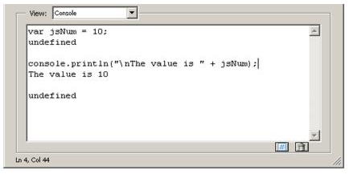

******************************************************
Tools
******************************************************

Acrobat provides an integrated development environment that offers several tools with which to develop and test JavaScript functionality. These tools are the JavaScript Editor, Console, and Debugger. In addition, Acrobat supports the use of third-party editors for code development.

.. raw:: html

   

Using the JavaScript Debugger console
===============================================

The JavaScript console provides an interactive and convenient interface for testing portions of JavaScript code and experimenting with object properties and methods. Because of its interactive nature, the console behaves as an editor that permits the execution of single lines or blocks of code.

There are two ways to activate the JavaScript console: either through an Acrobat menu command or through the use of the static ``console`` object within JavaScript code. In either case, it appears as a component of the JavaScript Debugger, and the primary means of displaying values and results is through the ``console.println`` method.

Opening the console
-------------------

#. To open the JavaScript Debugger console:
#. Open the Debugger window using one of these methods:

   -  Select **Tools pane** > **JavaScript** > **JavaScript Debugger** > or
   -  Type **Ctrl+J** > (Windows) or **Command+J** (Mac OS)

#. Select either **Console** or **Script and Console** from the debugger View list.

To open and close the console with JavaScript code, use ``console.show()`` and ``console.hide()`` methods, respectively.

.. raw:: html

   

Executing JavaScript

The JavaScript console allows you to evaluate single or multiple lines of code. There are three ways to evaluate JavaScript code while using the interactive console:

-  To evaluate a portion of a line of code, highlight the portion and press either the Enter key on the numeric keypad or press Ctrl + Enter.
-  To evaluate a single line of code, make sure the cursor is positioned on that line and press either the Enter key on the numeric keypad or press Ctrl + Enter.
-  To evaluate multiple lines of code, highlight those lines and press either the Enter key on the numeric keypad or press Ctrl + Enter.

In all cases, the result of the most recent single JavaScript statement executed is displayed in the console.

.. raw:: html

   

Formatting code
---------------

To indent code in the JavaScript console, use the Tab key.

-  To indent four spaces to the right, position the cursor at the beginning of a single line or highlight the block of code, and press the Tab key.
-  To indent four spaces to the left, position the cursor at the beginning of a single line or highlight a block of code and press Shift + Tab.

.. raw:: html

   

Enabling JavaScript

In order to use JavaScript, you must first verify that JavaScript has been enabled. In order to execute code from the console, you will also need to ensure that the JavaScript Debugger is enabled, since the Console window is a component within the JavaScript Debugger interface.

#. To enable JavaScript, the Debugger and the Console:
#. Launch Acrobat.
#. Select **Edit** >  **Preferences** or open the Preferences dialog box.
#. Select **JavaScript** from the list of options on the left side of the dialog box.
#. Select **Enable Acrobat JavaScript** if it is not already selected.
#. In the Preferences dialog box, select **Enable JavaScript Debugger After Acrobat is Restarted** from the JavaScript Debugger options.
#. Select **Enable Interactive Console**. This option enables you to evaluate code that you write in the console window.
#. Select **Show Console on Errors and Messages**. This ensures that whenever you make mistakes, the console displays helpful information.
#. Click **OK** or close the Preferences dialog box.
#. Close and restart Acrobat.
#. To test the interactive Console:
#. Select **Tools pane** >  **Javascript** >  **JavaScript** > **Debugger** or open the JavaScript Debugger.
#. In the debugger, select **Console** > from the **View** window.

The Console window appears.

#. Click **Clear** (the trash can icon), located at the bottom right of the Console, to delete any contents that appear in the window.
#. In the text window, type the following code:

::

    var jsNum = 10;

#. With the mouse cursor positioned somewhere in this line of code, press **Enter** in the numeric keypad or press **Ctrl + Enter**. The JavaScript variable is created and is assigned a value of 10. The results are shown in the following graphic.

Evaluating the variable declaration

After each JavaScript statement executes, the console window prints out ``undefined``, which is the return value of the statement. Note that the result of a statement is not the same as the value of an expression within the statement. In this case, the return value ``undefined`` does not mean that the value of ``jsNum`` is undefined; it just means that the entire JavaScript statement's value is ``undefined``.

Note the use of the ``console.println()`` method to display the result in a more human-readable format.

.. raw:: html

   

Debugging with the JavaScript Console
-------------------------------------

Though Acrobat Pro DC has a full-featured debugger, see `JavaScript Debugger <JS_Dev_Tools.html#65507>`__, for simple scripts it is often easier to debug scripts by the following methods:

-  testing and/or developing script snippets in the Console itself
-  inserting ``console.println()`` commands to write information to the Console.
-  Test a regular expression in the JavaScript Debugger Console

The following script, which can be created in the JavaScript Console, illustrates the use of ``console.println()``.

The regular expression

::

          var re = /(Professional|Pro)(s+)(d)/g

and the replacement function, ``myReplace()``, are used to search the string, ``str``, for the phrase ``"Professional`` ``7"`` or ``"Pro`` ``7"``, and to replace the string ``"7"`` with the string ``"8"``. The script is executed using the procedures described in `Executing JavaScript <JS_Dev_Tools.html#14633>`__.

After testing and debugging, the script can be copied and pasted to the target location.

Note the debugging loop inside the function ``myReplace()`` writes the arguments of the function to the Console. This helps in the development phase: the arguments are seen in the Console where you can verify that they are the ones expected. The loop can be deleted or commented out after testing.

::

      function myReplace() {
          var l = arguments.length;
          for ( var i = 0; i < l; i++)
              console.println("arg" + i + " = " + arguments[i])
              return arguments[1] + arguments[2] + "8";
      }
      var str = "Acrobat Pro DCn7 is a great application, "
          + "so I say on the 7th of May.nOn a laptop Acrobat Pro 7.0 is on the go!"
      var re = /(Professional|Pro)(s+)(d)/g;
      var newStr = str.replace( re, myReplace);
      console.println("nnewStr = " + newStr);

.. raw:: html

   

Using a JavaScript editor
=========================

There are several ways to invoke the JavaScript Editor, depending on the context. To begin with, it is possible to select JavaScripts from the JavaScript panel on the Tools pane and choose one of the following options:

-  Edit All JavaScripts
-  Document JavaScripts
-  Set Document Actions

A more basic approach, however, is to think of a script as an action associated with a part of the document, such as a page, bookmark, or form field. As in the following example, you can select the object of interest and edit its particular script.

#. To write a script for a document component:
#. Right-click a document component such as a bookmark. This triggers a context menu.
#. Select **Properties** and choose the **Actions** tab.
#. Select **Run a JavaScript** from the **Select Action** drop-down list.
#. Click **Add** to open the JavaScript editor.
#. In the editor window, write the JavaScript code to run when the event that activates the code is created.
#. Click **Close**.

If there are errors in your code, the JavaScript editor highlights the code line in question and displays an error message.

.. note::

   JavaScript actions have a scope associated with various levels of objects in a PDF document, such as a form field, a page, or the entire document. For example, a script at the document level would be available from all other scriptable locations within the document.

.. raw:: html

   

Specifying the default JavaScript editor
========================================

You can choose whether to use the built-in JavaScript editor that comes with Acrobat, or an external JavaScript editor of your choice.

#. To set the default editor:
#. Choose **Edit** >  **Preferences** (Ctrl+K) to open the Preferences dialog box.
#. Select **JavaScript** from the list of options on the left side of the dialog box.

This brings up the Preferences dialog box.

#. In the **JavaScript Editor** section, select the editor you would like to use.

The **Acrobat JavaScript Editor** option sets the built-in JavaScript editor as the default.

The **External JavaScript Editor** option sets an external editor as the default.

.. note::

   For some external editors, Acrobat provides extra command line options for invoking the editor. For details, see `Additional editor capabilities <JS_Dev_Tools.html#62428>`__.

Like the JavaScript Console, the built-in JavaScript Editor can be used to evaluate portions of JavaScript code. Select a line or block of code to be evaluated, and press the Enter key on the numeric keypad or Ctrl + Enter on the regular keyboard.

When you execute script from within an JavaScript Editor window, results appear in the Console window. The Console window should be open prior to opening any JavaScript Editor window.

The JavaScript Editor provides the same formatting options as those in the console window. For details, see `Formatting code <JS_Dev_Tools.html#24690>`__.

.. raw:: html

   

Using an external editor
========================

If an external editor program has been specified as the default application for editing scripts in Acrobat, Acrobat generates a temporary file and opens it in the external editor program. When editing a file in an external editor, note the following restrictions:

-  You must save the file in order for Acrobat to detect the changes.
-  Acrobat is inaccessible while the external editor is in use.
-  JavaScript code cannot be evaluated within the external editor.

.. raw:: html

   

Additional editor capabilities
------------------------------

Acrobat supports some additional command line editor capabilities for Windows-based applications, and provides support for two parameters in particular: the *file name*.``%f``) and the *target line number*.``%n``). Parameters for Mac OS-based editors are not supported.

Note that Acrobat launches a new instance of the editor for each new editing session. Some editors, if already running, load new files into the same session and may close the other open files without saving them. Thus, it is important to remember to take one of the following measures: save your changes before beginning a new editing session, close the editor application before starting a new editing session, or adjust its default preferences so that it always launches a new editor instance (this is the best course of action, if available).

If you are able to set the editor preferences to launch a new instance for each editing session, and if the editor requires a command line parameter in order to invoke a new editor instance, you can add that parameter to the editor command line specified, as described in `Specifying additional capabilities to your editor <JS_Dev_Tools.html#58122>`__ .

If your editor accepts a starting line number on the command line, Acrobat can start the editor on a line containing a syntax error by inserting the line number as a command line parameter (``%n``).

For your convenience, Acrobat provides predefined, command line templates for many current external editors. The external editor settings are defined in Edit > Preferences > JavaScript. If you use the Browse button to specify an external editor and it has a pre-defined command line template, the command line parameters and options appear to the right of the pathname for the editor application, and you can edit them. If no predefined template is available for your editor, you can still specify the appropriate command line parameters.

.. raw:: html

   

Specifying additional capabilities to your editor
-------------------------------------------------

Acrobat provides internal support for both of the commands described above on a few editors such as CodeWrite, Emacs, and SlickEdit (see the table `Supported external JavaScript editors with command line templates <JS_Dev_Tools.html#70286>`__).

If your editor is not one that Acrobat currently supports, it will be necessary to check the editor's documentation. You will need to search for the following information:

-  What are the command switches to tell the editor to always open a new instance?

    Switches vary depending on the editor and include such parameters as ``/NI`` and ``+new`` followed by the file name (``"%f"``). Note that the quotes are required, because the file name that Acrobat sends to the editor may contain spaces.

-  Is there a way to instruct the editor to open a file and jump to a line number?

    Some line number command switches are ``-#``, ``-L``, ``+``, and ``-l``, each followed by the line number (``%n``). For most editors, the line number switch and ``%n`` should be enclosed in square brackets ``[...]``. The text inside the square brackets will be used only when Acrobat requires that the editor jump to a specific line in order to correct a JavaScript syntax error. You can use an editor that does not support a line number switch; in this case, you will need to scroll to the appropriate line in the event of a syntax error.

For example, Acrobat recognizes the Visual SlickEdit editor as ``vs.exe`` and automatically supplies this command line template:

::

      "C:Program Filesvslickwinvs.exe" "%f" +new [-#%n]

When Acrobat opens the default JavaScript editor, it makes the appropriate substitutions in the command line and executes it with the operating system shell. In the above case, if the syntax error were on line 43, the command line generated would appear as follows:

::

      "C:Program Filesvslickwinvs.exe" "C:Tempjsedit.js" +new -#43

.. note::

   To insert ``%``, ``[``, or ``]`` as characters in the command line, precede each of them with the ``%`` escape character, thus using ``%%``, ``%[``, or ``%]`` respectively.

Supported external JavaScript editors with command line templates

.. list-table::
   :widths: 10 10 80
   :header-rows: 1

   * - Editor
     - Web site
     - Template command line arguments

   * - Boxer
     - http://www.boxersoftware.com
     - -G -2 "%f" [-L%n]

   * - ConTEXT
     - http://www.context.cx/
     - "%f" [/g1:%n]

   * - CodeWright
     - http://www.borland.com.tr/tr/products/codewright/index.html
     - -M -N -NOSPLASH "%f" [-G%n]

   * - Emacs
     - http://www.gnu.org/software/emacs/emacs.html
     - [+%n] "%f"

   * - Epsilon
     - http://www.lugaru.com
     - [+%n] "%f"

   * - Multi-Edit
     - http://www.multiedit.com
     - /NI /NS /NV [/L%n] "%f"

   * - TextPad
     - http://www.textpad.com
     - -m -q "%f"

   * - UltraEdit
     - http://www.ultraedit.com
     - "%f" [-l%n]

   * - VEDIT
     - http://www.vedit.com
     - -s2 "%f" [-l %n]

   * - Visual SlickEdit
     - http://www.slickedit.com
     - +new "%f" [-#%n]

#. To determine whether Acrobat can open your editor on a line number:
#. Open a script in your editor.
#. Add a syntax error.
#. Move the cursor to a line other than the one containing the syntax error.
#. Close and save the file.

If a dialog box automatically appears prompting you to fix the syntax error, check whether it correctly specifies the line containing the error.

Saving and closing a file with a syntax error
---------------------------------------------

If you save and close a file containing a syntax error, Acrobat displays a dialog box with a message asking if you would like to fix the error. For example, if there is an error on line 123, the following message appears:

::

      There is a JavaScript error at line 123. 
      Do you want to fix the error?

.. note::

   If you click No, Acrobat discards your file.

Always click Yes. Acrobat expands the path to the editor to include the line number in the specified syntax. The editor opens and the cursor is placed on the appropriate line.

.. raw:: html

   

Using the Debugger with Acrobat Reader
=========================================

The JavaScript Debugger is a fully capable debugger that allows you to set breakpoints and inspect variable values while stepping through code. While it is normally accessed from the Acrobat Pro DC user interface, it can also be triggered to appear in Acrobat Reader when an exception occurs.

Though fully supported JavaScript debugging is only available in Acrobat Pro DC, the following instructions to make the complete Debugger functionality available in Acrobat Reader on Windows and Mac OS platforms are provided as a courtesy. For Windows, note that this procedure involves editing the registry. Adobe Systems Incorporated does not provide support for editing the registry, which contains critical system and application information. It is recommended that you back up the registry before modifying it.

#. The file ``debugger.js``, available at the `Acrobat Developer Center <http://www.adobe.com/go/acrobat_developer>`__ or in the SDK installation (Acrobat <version number> SDK/JavaScriptSupport/Debugger/debugger.js), must be copied to the Acrobat <version number>/Reader/JavaScripts folder.
#. Create key/value pairs in the registry settings, starting at the location HKEY_CURRENT_USERSoftwareAdobeAcrobat Reader<version number>JSPrefs on Windows as shown in the table below, or in the property list file <user>:Library:Preferences:com.adobe.Reader<version number>.plist on Mac OS. For Mac OS, use an appropriate editor for the property list file, and add the following children under JSPrefs, using Type : Array in each case: ConsoleOpen, ConsoleInput, EnableDebugger, and Exceptions. Under each of these children, add the following children: 0 (number) and 1 (boolean).
#. Close and restart Acrobat Reader. At this point the Debugger will be available.

Registry key/value pairs for Windows

.. _section-1:

.. list-table::
   :widths: 10 10 80
   :header-rows: 0

   * - bConsoleInput
     - REG_DWORD
     - 0x00000001
   * - bEnableDebugger
     - REG_DWORD
     - 0x00000002
   * - iExceptions
     - REG_DWORD
     - 0x00000002 (This will break into the Debugger when exceptions occur.)

.. note::

   Since Acrobat Reader does not provide access to the Debugger through its menu items or the Ctrl + J key sequence, the only ways to access the Debugger are to execute a JavaScript, cause an error, or customize the user interface (for example, you could add a button that runs a JavaScript causing the Debugger to appear).

As you learned earlier when opening the JavaScript Console, which is integrated with the Debugger dialog box, the Debugger may be opening in Acrobat Pro DC by selecting JavaScript Debugger from the JavaScript panel on the Tools pane. In addition, the Debugger automatically opens if a running script throws an exception or encounters a previously set break point.

.. note::

   The JavaScript Debugger cannot be used to analyze JavaScript stored in HTML pages viewed by web browsers or any other kind of scripting languages.

.. raw:: html

   

Enabling the JavaScript Debugger
================================

The JavaScript Debugger can be a powerful tool for debugging complex scripts; however, it is a tool for an advanced user. For this reason, this section can be skipped at first reading. (Simple scripts can be debugged by inserting ``console.println()`` statements to read out debugging information to the console. For more information on this subject, see `Debugging with the JavaScript Console <JS_Dev_Tools.html#88566>`__.)

In order to make the Debugger available for use, you must enable both JavaScript and the Debugger. As you did earlier, use the Preferences dialog box (Ctrl+K) to control the behavior of the JavaScript development environment. Enabling JavaScript and the JavaScript editor are described in `Enabling JavaScript <JS_Dev_Tools.html#21559>`__. To enable the Debugger, select JavaScript from the list on the left in the Preferences dialog box and make sure the item Enable JavaScript Debugger after Acrobat is Restarted is enabled. Note that you must restart Acrobat for this option to take effect.

The Debugger options are located in the JavaScript Debugger section of the Preferences dialog box, and are explained in the following table.

JavaScript Debugger options

.. _section-2:

.. list-table::
   :widths: 30 70
   :header-rows: 1

   * - Option
     - Meaning

   * - Enable Javascript Debugger after Acrobat is restarted  T
     - enable the Debugger, check this option, which makes all Debugger features available the next time Acrobat is launched. 

   * - Store breakpoints in PDF file
     - This option enables you to store breakpoints so they are available the next time you start Acrobat or open the PDF file. To remove the breakpoints, do the following:   -  Turn this option off. -  Select **Tools pane** >  **JavaScript** >  **Document JavaScripts** and delete the ``ACRO_Breakpoints`` script. Save the file.

   * - When an exception is thrown
     - This option provides three choices for actions when an exception is thrown:  **Ignore** ignores the exception  **Trace** displays a stack trace  **Break** stops execution and displays a message window that gives you the option to start the debugger at the line where the exception occurred.

   * - Enable interactive console
     - This option allows you to enter JavaScript commands in the console window. If this option is not checked and you click in the console window, the following message appears:  The interactive console is not enabled. Would you like to enable it now?  Click **Yes** to enable this option from within the Debugger. In **Preferences** you will now see this option checked.

   * - Show console on errors and messages
     - This option opens the console window in the Debugger dialog box. Regardless of whether the Debugger is enabled, this option causes the Debugger dialog box to open when an error occurs and displays the error message to the console window.

JavaScript Debugger
===================

You can open the JavaScript Debugger at any time by selecting Tools pane > JavaScript > JavaScript Debugger. Familiarize yourself with the parts of the window and the controls as described here before you attempt interactive debugging of a script.

For information on the types and locations of scripts that may be debugged, see `Accessing scripts in the Scripts window <JS_Dev_Tools.html#94563>`__. The section `Starting the Debugger <JS_Dev_Tools.html#81893>`__ describes how to automatically start the Debugger for a script.

.. caution::

   In Windows, while the Debugger is open and a debugging session is in progress, Acrobat will be unavailable.

Main groups of controls
-----------------------

The Debugger dialog box, see `Debugger dialog box <JS_Dev_Tools.html#87157>`__, consists of three main groups of controls. The toolbar on the top left contains six button controls that provide basic debugging session functionality.

Immediately below the toolbar, a Scripts window displays the names of scripts available for debugging. These are organized in a tree hierarchy, such as the one shown below in the graphic `Debugger dialog box <JS_Dev_Tools.html#87157>`__, and may be accompanied by the Scripts window below, which shows the code for a single script corresponding to the one highlighted in the Scripts window.

The Call Stack and Inspect drop-down lists are located at the top right of the Debugger dialog box. Selecting entries in these lists enables you to view the nesting order of function calls, and enables you to inspect the details of variables, watches, and breakpoints in the Inspect Details window.

Debugger View windows
---------------------

Below the main group of controls, the debugger provides a View drop-down list with the following choices:

- **Script**:  view a single JavaScript script selected from the Scripts hierarchy window

- **Console**:  view the output of a selected script as it executes in the JavaScript Console window. The Console may also be used to run scripts or individual commands. See `Using the JavaScript Debugger console <JS_Dev_Tools.html#56714>`__.

- **Script and Console**:  view both the Console and Script windows at the same time. The Script window displays above the console window.

.. raw:: html

   

Debugger buttons
----------------

Debugger buttons summary

.. _section-3:

.. list-table::
   :widths: 10 90
   :header-rows: 1

   * - Button
     - Description

   * - Resume Execution
     - Runs a script stopped in the debugger.

   * - Interrupt
     - Halts execution.

   * - Quit
     - Closes the debugger and terminates script execution.

   * - Step over
     - Executes the next instruction, but does not enter a function call if encountered.

   * - Step into
     - Executes the next instruction, and enters a function call if encountered.

   * - Step out
     - Executes the remaining code in a function call, and stops at the next instruction in the calling script.

.. raw:: html

   

Resume execution
^^^^^^^^^^^^^^^^^^^^^^^^^^^^^^^^^

When the script is stopped, the Resume Execution button cause the script to continue execution until it reaches one of the following:

-  The next script to be executed
-  The next breakpoint encountered
-  The next error encountered
-  The end of the script

.. raw:: html

   

Interrupt
^^^^^^^^^^^^^^^^^^^^^^^^^^^^^^^^^

The Interrupt button halts execution of the current script. When clicked, it appears in red, which indicates that it has been activated and causes execution to stop at the beginning of the next script that is run. If this occurs, the Interrupt button is automatically deactivated and returns to its green color. It must be activated again in order to interrupt another script.

Quit
^^^^

The Quit button terminates the debugging session and closes the Debugger.

.. raw:: html

   

Step over
^^^^^^^^^^^^^^^^^^^^^^^^^^^^^^^^^

The Step Over button executes a single instruction, and if it is a function call, it executes the entire function in a single step, rather than stepping into the function. For example, the position indicator (yellow arrow) in the Debugger is to the left of a function call.

Execution is currently halted before the call to ``callMe``. Assuming that there are no errors or breakpoints in ``callMe``, clicking Step Over executes the entire ``callMe`` function, and advances the position indicator to the next script instruction following the function call.

If the statement at the position indicator does not contain a function call, Step Over simply executes that statement.

.. raw:: html

   

Step into
^^^^^^^^^^^^^^^^^^^^^^^^^^^^^^^^^

The Step Into button executes the next statement, and if it is a function call, it proceeds to the first statement within the function.

.. note::

   It is not possible to step into native functions, since they have no JavaScript implementation. This applies to Acrobat native functions as well as core JavaScript functions.

.. raw:: html

   

Step out
^^^^^^^^^^^^^^^^^^^^^^^^^^^^^^^^^

The Step Out button executes the remaining code within the current function call and stops at the instruction immediately following the call. This button provides a convenient means of eliminating cumbersome, stepwise execution of functions that do not contain bugs. If you are not inside a function call and there are no errors, the Step Out button continues executing code to the end of the current script or until a breakpoint is encountered.

.. raw:: html

   

Debugger Scripts window
-----------------------

All scripts associated with a PDF file are available in the Debugger dialog box. The Debugger displays these in the Scripts window.

.. raw:: html

   

Accessing scripts in the Scripts window
^^^^^^^^^^^^^^^^^^^^^^^^^^^^^^^^^^^^^^^^^^^^^^^^^^^^^^^^^^^^^^^^^^

To display the content of a script, click the triangle to its left in the Scripts window. Each triangle opens the next level in the containment hierarchy. A script icon indicates the lowest level, which means that the code for the given function is available. As shown above in the graphic `Scripts window <JS_Dev_Tools.html#89229>`__, a function has been defined for a mouse-up action on a button named ``Button1``. Click on the script icon to display its code.

JavaScript can be stored in several places, which may be either inside or outside PDF files. The following sections describe their possible locations.

Scripts inside PDF files
^^^^^^^^^^^^^^^^^^^^^^^^

The table below lists the types of scripts that can be placed in PDF files. These can be accessed from the Scripts window within the Debugger dialog box. You can edit them from inside the Debugger, and set breakpoints as described in `Breakpoints <JS_Dev_Tools.html#89729>`__.

.. note::

   Changes to scripts do not take effect until the scripts are re-run; changes cannot be applied to a running script.

Scripts inside PDF files

.. _section-4:

.. list-table::
   :widths: 10 90
   :header-rows: 1

   * - Location
     - Access

   * - Document level
     - **Tools pane** >  **JavaScript** >  **Document JavaScripts**

   * - Document actions
     - **Tools pane** >  **JavaScript** >  **Set Document Actions**

   * - Page actions
     - Click the page on the **Pages** tab; right-click the thumbnail for the page and click Page Properties.

   * - Forms
     - Double-click the form object in form editing mode (see below) to bring up the properties dialog box for that form object.

   * - Bookmarks
     - Click the bookmark on the **Bookmarks** tab; right-click the bookmark and click on Properties.

   * - Links
     - Double-click the link object in object editing mode (see below) to bring up the **Link Properties** dialog box.

**Form editing mode**:  To switch to form editing mode, select **Forms** > **Edit Form in Acrobat**.

Scripts outside PDF files
^^^^^^^^^^^^^^^^^^^^^^^^^

Scripts outside of Acrobat are also listed in the Scripts window and are available for debugging in Acrobat. The following table lists these script types and how to access them.

Scripts outside PDF files

.. _section-5:

.. list-table::
   :widths: 10 90
   :header-rows: 1

   * - Location
     - Access

   * - Folder level
     - Stored as JavaScript (``.js``) files in the App or User folder areas 

   * - Console
     - Entered and evaluated in the console window

   * - Batch
     - Choose **Advanced** Action Wizard

Folder-level scripts normally can be viewed and debugged but not edited in Acrobat. Console and batch processing scripts are not visible to the Debugger until they are executed. For this reason, you cannot set breakpoints prior to executing these scripts. You can access the scripts either using the Debug From Start option or by using the debugger keyword. See `Starting the Debugger <JS_Dev_Tools.html#81893>`__ for details.

.. raw:: html

   

Call Stack list
---------------

To the right of the Debugger control buttons is the Call Stack drop-down list which displays the currently executing function and its associated state within the current set of nested calls. An example is shown in the following graphic. When the Debugger has been used to suspend execution at a given statement, the call stack displays text indicating the current function call (stack frame). Each entry shows the current line number and function name. The most recent stack frame is displayed at the top of the Call Stack drop-down list. To inspect the local variables of a particular frame in the stack, click that entry. They appear in the Inspect details window immediately below the Call Stack list.

You can select any function in the call stack. Doing so selects that stack frame, and its location is shown in the Inspect details window. When Local Variables is selected in the Inspect drop-down list, the variables specific to that active frame are displayed in the Inspect details window.

.. raw:: html

   

Inspect details window
----------------------

The Inspect details window is located to the right of the Scripts window and below the Call Stack. Its purpose is to help you inspect the values of variables, customize the way in which variables are inspected (setting watches), and obtain detailed information about breakpoints.

Inspect details window controls
^^^^^^^^^^^^^^^^^^^^^^^^^^^^^^^

The three buttons at the bottom right of the Inspect details window, shown in the following graphic, can be used to edit, create, or delete items. The Edit, New, and Delete buttons become active when items in the Inspect drop-down list are selected.

Inspecting variables
^^^^^^^^^^^^^^^^^^^^

The Inspect details window is a powerful tool that you can use to examine the current state of JavaScript objects and variables. It enables you to inspect any objects and properties in a recursive manner within the current stack frame in the debugging session.

To inspect a variable, select Local Variables from the Inspect drop-down list, which displays a list of variable and value pairs in the Inspect details window. To place a value in a variable, highlight the variable in the details window (this activates the Edit button). Click the Edit button. An Edit Variable dialog box appears, allowing you to enter a new value for the variable as shown in the following graphic.

A triangle next to a name indicates that an object is available for inspection. If you would like to view its properties, click the triangle to expand the object.

Watches
^^^^^^^

The Watches list enables you to customize how variables are inspected. Watches are JavaScript expressions evaluated when the debugger encounters a breakpoint or a step in execution. The Watches list provides you with the ability to edit, add, or delete watches using the three buttons just below the Inspect details window. All results are displayed in the Inspect details window in the order in which they were created.

#. To set a watch:
#. Select **Watches** from the **Inspect** drop-down list.
#. Click the **New** button. A dialog box prompts you for the JavaScript variable or expression to be evaluated.
#. To change the value of a watch:
#. Select the watch from the list.
#. Click the **Edit** button, which displays a dialog box prompting you to specify a new expression for evaluation.
#. To delete a watch:

   #. Select the watch from the **Inspect** drop-down list.
   #. Click the **Delete** button.

.. raw:: html

   

Breakpoints
~~~~~~~~~~~

The Breakpoints option in the Inspect drop-down list enables you to manage program breakpoints, which in turn make it possible to inspect the values of local variables once execution is halted. A breakpoint may be defined so that execution halts at a given line of code, and conditions may be associated with them (see `Using conditional breakpoints <JS_Dev_Tools.html#69050>`__).

When a breakpoint is reached, JavaScript execution halts and the debugger displays the current line of code.

To add a breakpoint, click on the gray strip to the left of the code in the script view, which causes a red dot to appear. The lines at which breakpoints are permitted have small horizontal lines immediately to their left in the gray strip.

To remove the breakpoint, click on the red dot, which subsequently disappears.

Coding styles and breakpoints
~~~~~~~~~~~~~~~~~~~~~~~~~~~~~

Placement of the left curly brace (``{``) in a function definition is a matter of style.

Style 1: Place the left curly brace on the same line as the function name, for example,

::

      function callMe() { // curly brace on same line as function name
          var a = 0;
      }

Style 2: Place the left curly brace on a separate line, for example

::

      function callMe()
      { // curly brace is on a separate line
          var a = 0;
      }

If you would like to set a breakpoint at the function heading, use Style 1. Note that the JavaScript Debugger does not set a breakpoint at the function heading for Style 2. It is only possible to set a breakpoint from the line of code containing the left curly brace. This is illustrated in the graphic below. It is possible to set the breakpoint on the line below the function heading for ``callMe`` and on the line containing the function heading for ``testLoop``. Setting a breakpoint at a function heading causes execution to stop at the first statement within the function.

Listing breakpoints
~~~~~~~~~~~~~~~~~~~

To view the list of all breakpoints set for the debugging session, select the Breakpoints option from the Inspect drop-down list. You can edit and delete breakpoints using the button controls just beneath the Inspect details window, as shown in the graphic `Inspect details window button controls <JS_Dev_Tools.html#69235>`__.

.. raw:: html

   

Using conditional breakpoints
~~~~~~~~~~~~~~~~~~~~~~~~~~~~~

A conditional breakpoint causes the interpreter to stop the program and activate the Debugger only when a specified condition is true. Conditional breakpoints are useful for stopping execution when conditions warrant doing so, and streamline the debugging process by eliminating needless stepwise execution. For example, if you are only interested in debugging after 100 iterations in a loop, you can set a breakpoint that only becomes active when the looping index reaches the value of 100.

The condition is a JavaScript expression. If the expression evaluates to ``true``, the interpreter stops the program at the breakpoint. Otherwise, the interpreter does not stop the program. An unconditional breakpoint, the default, always causes the interpreter to stop the program and to activate the Debugger when it reaches the breakpoint, because its condition is always set to ``true``.

#. To change a breakpoint condition:
#. Select **Breakpoint** from the **Inspect** drop-down list
#. Click **Edit**. A dialog box appears and prompts you to change the breakpoint condition. 

.. raw:: html

   

Starting the Debugger

There are four ways to invoke the JavaScript Debugger. Two of these ways begin the debugging session from the start of execution, and the other two begin the session from a specified line of code.

Debugging from the start of execution
^^^^^^^^^^^^^^^^^^^^^^^^^^^^^^^^^^^^^

There are two ways to start the Debugger from the start of execution. In either case, use the `Step into <JS_Dev_Tools.html#13227>`__ button to proceed with the debugging session.

The first method is to choose Tools pane > Document Processing and, if the option is not already checked, click on Debug From Start.

This option causes the debugging session to begin at the start of execution of any new script.

.. note::

   Debug From Start does not turn off automatically. Be sure to turn off this option when you have finished debugging, otherwise it continues to stop on every new script you execute in Acrobat.

The second method uses the `Interrupt <JS_Dev_Tools.html#21536>`__ button. Open the Debugger window and click the Interrupt button, which displays in red. At this point, performing any action that runs a script causes execution to stop at the beginning of the script.

Unlike Debug From Start, the Interrupt button is automatically deactivated after being used. To stop at the beginning of a new script, you must reactivate it by clicking it again.

Debugging from an arbitrary point in the script
^^^^^^^^^^^^^^^^^^^^^^^^^^^^^^^^^^^^^^^^^^^^^^^

To start debugging from a specific point in your script, you can set a breakpoint. For more information, see `Breakpoints <JS_Dev_Tools.html#89729>`__.

An alternate approach is to insert the ``debugger`` keyword in any line of your code to stop execution and enter the Debugger when that particular line is reached.

.. note::

   Breakpoints created using the ``debugger`` keyword are not listed in the Inspect details window when you select Breakpoints from the Inspect drop-down list.

Final notes
-----------

There are limitations to debugging scripts in Acrobat from inside a browser, because not all scripts contained in a PDF file may be available if the PDF file has not been completely downloaded.

Debugging is not possible if a modal dialog box is running. This may occur when debugging a batch sequence. If a modal dialog box is running during a debugging session and the program stops responding, press the Esc key.

Debugging scripts with an event initiated by either the ``app.setInterval`` or ``app.setTimeOut`` method may trigger the appearance of a series of recurring alert messages. If this occurs, press the Esc key after the modal dialog box has exited.

