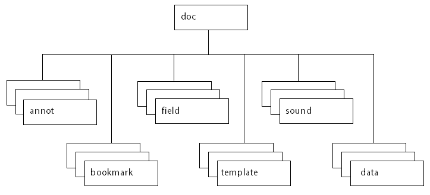

******************************************************
JavaScript Development for Acrobat
******************************************************

JavaScript was created to offload web page processing from a server onto a client in web-based applications. Acrobat extends the core language by adding new objects and their accompanying methods and properties, to the JavaScript language. These Acrobat-specific objects enable a developer to manage document security, communicate with a database, handle file attachments, manipulate a PDF file so that it behaves as an interactive, web-enabled form, and so on. Because the Acrobat-specific objects are added on top of core JavaScript, you still have access to its standard classes, including ``Math``, ``String``, ``Date``, and ``RegExp``.

PDF documents have great versatility since they can be displayed both within the Acrobat software as well as a web browser. Therefore, it is important to be aware of the differences between JavaScript used in a PDF file and JavaScript used in a web page:

-  JavaScript in a PDF file does not have access to objects within an HTML page. Similarly, JavaScript in a web page cannot access objects within a PDF file.
-  In HTML, JavaScript is able to manipulate such objects as ``Window``. JavaScript for Acrobat cannot access this particular object but it can manipulate PDF-specific objects.

Most people know Acrobat as a medium for exchanging and viewing electronic documents easily and reliably, independent of the environment in which they were created; however, Acrobat provides far more capabilities than a simple document viewer.

You can enhance a PDF document so that it contains form fields to capture user-entered data as well as buttons to initiate user actions. This type of PDF document can replace existing paper forms, allowing employees within a company to fill out forms and submit them via PDF files, and connect their solutions to enterprise workflows by virtue of their XML-based structure and the accompanying support for SOAP-based web services.

Acrobat also contains functionality to support *online team review*. Documents that are ready for review are converted to PDF. When a reviewer views a PDF document in Acrobat and adds comments to it, those comments (or *annotations*). constitute an additional layer of information on top of the base document. Acrobat supports a wide variety of standard comment types, such as a note, graphic, sound, or movie. To share comments on a document with others, such as the author and other reviewers, a reviewer can export just the comment "layer" to a separate comment repository.

In either of these scenarios, as well as others that are not mentioned here, you can customize the behavior of a particular PDF document, implement security policies, interact with databases and web services, and dynamically alter the appearance of a PDF document by using JavaScript. You can tie JavaScript code to a specific PDF document, a particular page within a PDF document, or a form field or button in a PDF file. When an end user interacts with Acrobat or a PDF file displayed in Acrobat that contains JavaScript, Acrobat monitors the interaction and executes the appropriate JavaScript code.

Not only can you customize the behavior of PDF documents in Acrobat, you can customize Acrobat itself. In earlier versions of Acrobat (prior to Acrobat 5), this type of customization could only be done by writing Acrobat plug-ins in a high-level language like C or C++. Now, much of that same functionality is available through Acrobat extensions to JavaScript. You will find that using JavaScript to perform a task such as adding a menu to Acrobat's user interface is much easier than writing a plug-in.

Using Acrobat Pro DC, you can create batch sequences for processing multiple documents, processing within a single document, processing for a given page, and processing for a single form field. For batch processing, it is possible to execute JavaScript on a set of PDF files, which enables tasks such as extracting comments from a comment repository, identifying spelling errors, and automatically printing PDF files.

JavaScript for Acrobat API Reference
==================================================

The companion document to this document is the `Acrobat JavaScript API Reference <https://www.adobe.com/go/acrobatsdk_jsapiref>`__. In addition to a list of APIs, it provides details about security restrictions placed on some of the methods.

These features are of particular importance:

-  The *quick bar*. In the `Acrobat JavaScript API Reference <https://www.adobe.com/go/acrobatsdk_jsapiref>`__, each object, property and method has a quick bar, a one-row table of icons that provides a summary of the item's availability and usage recommendations. Many lost hours of time can be avoided by paying attention to this quick bar. Refer to the `Acrobat JavaScript API Reference <https://www.adobe.com/go/acrobatsdk_jsapiref>`__ for details.
-  *Privileged context*. This guide contains detailed information on executing JavaScript in a privileged context, beyond that provided in`Acrobat JavaScript API Reference <https://www.adobe.com/go/acrobatsdk_jsapiref>`__, see `Privileged versus non-privileged context <JS_Dev_Contexts.html#76421>`__.
-  *Safe path*. Acrobat 6.0 introduced the concept of a *safe path* for JavaScript methods that write data to the local hard drive based on a path passed to it by one of its parameters. Generally, when a path is judged to be not safe, a ``NotAllowedError`` exception is thrown. See the `Acrobat JavaScript API Reference <https://www.adobe.com/go/acrobatsdk_jsapiref>`__ for more information about *safe paths*.

.. note::

   Many sample scripts presented in this guide reference the local file system. These scripts generally use the path ``"/c/temp/"``, which is a safe path.

.. raw:: html

   

Object summary
==============

The Acrobat extension to core JavaScript defines many objects that allow your code to interact with the Acrobat application, a PDF document, or form fields within a PDF document. This section introduces you to the primary objects used to access and control the application and document, the development environment itself, and general-purpose JavaScript functionality.

Below is a short listing of some of the main objects used in the document and in the sample files. A brief description of each of the objects follow the table.

.. list-table::
   :widths: 10 90
   :header-rows: 1

   * - Object
     - Purpose

   * - `app <JS_Dev_Overview.html#>`__
     - Acrobat 

   * - `console <JS_Dev_Overview.html#84505>`__
     - JavaScript Debugger

   * - `dbg <JS_Dev_Overview.html#42481>`__
     - Debugger

   * - `dialog <JS_Dev_Overview.html#33666>`__
     - Modal dialog boxes

   * - `Doc <JS_Dev_Overview.html#38137>`__
     - PDF document

   * - `event <JS_Dev_Overview.html#19566>`__
     - JavaScript events

   * - `global <JS_Dev_Overview.html#92413>`__
     - Persistent and cross-document information

   * - `search <JS_Dev_Overview.html#54262>`__
     - Searching and indexing

   * - `security <JS_Dev_Overview.html#37173>`__
     - Encryption and digital signatures

   * - `SOAP <JS_Dev_Overview.html#42628>`__
     - Web services

   * - `util <JS_Dev_Overview.html#13706>`__
     - JavaScript utility methods

app
-------------------------------

The ``app`` object is a static object that represents the Acrobat application itself. It offers a number of Acrobat-specific functions in addition to a variety of utility routines and convenience functions. By interacting with the ``app`` object, you can open or create PDF and FDF documents, and customize the Acrobat interface by setting its viewing modes, displaying popup menus, alerts, and thermometers, displaying a modal dialog box, controlling time intervals, controlling whether calculations will be performed, performing email operations, and modifying its collection of toolbar buttons, menus, and menu items. You can also query ``app`` to determine which Adobe product and version the end user is using (such as Acrobat Reader 8 or Acrobat Pro DC 7.0), as well as which printer names and color spaces are available.

Doc
-------------------------------

The Doc object is the primary interface to the PDF document, and it can be used to access and manipulate its content. The Doc object provides the interfaces between a PDF document open in the viewer and the JavaScript interpreter. By interacting with the Doc object, you can get general information about the document, navigate within the document, control its structure, behavior and format, create new content within the document, and access objects contained within the document, including bookmarks, form fields, templates, annotations, and sounds.

The following graphic represents the containment hierarchy of objects related to the Doc object.

Doc object containment hierarchy

Accessing the Doc object from JavaScript can be done in a variety of ways. The most common method is using the ``this`` object, which is normally equivalent to the Doc object of the current underlying document.

dbg
-------------------------------

You can use the ``dbg`` object, available only in Acrobat Pro DC, to control the JavaScript Debugger from a command line while the application is not executing a modal dialog box. The ``dbg`` object methods offer the same functionality as the buttons in the JavaScript debugger dialog box toolbar, which permit stepwise execution, setting, removing, and inspecting breakpoints, and quitting the debugger.

console
-------------------------------

The ``console`` object is a static object that is used to access the JavaScript console for displaying debug messages and executing JavaScript. It is useful as a debugging aid and as a means of interactively testing code and is only available within Acrobat Pro DC.

global
-------------------------------

The ``global`` object is used to store data that is persistent across invocations of Acrobat or shared by multiple documents. Global data sharing and notification across multiple documents is done through a subscription mechanism, which enables monitoring of global variables and reporting of their values to all subscribing documents. In addition, ``global`` can be used to store information that pertains to a group of documents, a situation that occurs when a batch sequence runs. For example, batch sequence code often stores the total number of documents to be processed as a property of ``global``. If information about the documents needs to be stored in a ``Report`` object, it is assigned to a set of properties within ``global`` so it is accessible to the ``Report`` object.

util
-------------------------------

The ``util`` object is a static JavaScript object that defines a number of utility methods and convenience functions for number and date formatting and parsing. It can also be used to convert information between rich content and XML representations.

dialog
-------------------------------

The ``dialog`` object is an object literal used by the ``app`` object's ``execDialog`` method to present a modal dialog box identical in appearance and behavior to those used across all Adobe applications. The ``dialog`` object literal consists of a set of event handlers and properties which determine the behavior and contents of the dialog box, and may be comprised of the following elements: push buttons, check boxes, radio buttons, list boxes, text boxes, popup controls, and containers and frames for sets of controls.

security
-------------------------------

The ``security`` object is a static JavaScript object, available without restriction across all Acrobat applications including Acrobat Reader, that employs a token-based security model to facilitate the creation and management of digital signatures and encryption in PDF documents, thus providing a means of user authentication and directory management. Its methods and properties are accessible during batch, console, menu, or application initialization events. The ``security`` object can be used to add passwords and set security options, add usage rights to a document, encrypt PDF files for a list of recipients, apply and assign security policies, create custom security policies, add security to document attachments, create and manage digital IDs using certificates, build a list of trusted identities, and check information on certificates.

SOAP
-------------------------------

The ``SOAP`` object can be used to make remote procedure calls to a server and invoke web services described by WSDL, and supports both SOAP 1.1 and 1.2 encoding. Its methods are available from Acrobat Pro DC, Acrobat Standard DC, and for documents with form export rights open in Acrobat Reader 6.0 or later. The ``SOAP`` object makes it possible to share comments remotely and to invoke web services in form field events. It provides support for rich text responses and queries, HTTP authentication and WS-Security, SOAP headers, error handling, sending or converting file attachments, exchanging compressed binary data, document literal encoding, object serialization, XML streams, and applying DNS service discovery to find collaborative repositories on an intranet. In addition the ``XMLData`` object can be used to evaluate XPath expressions and perform XSLT conversions on XML documents.

search
-------------------------------

The ``search`` object is a static object that can be used to perform simple and advanced searches for text in one or more PDF documents or index files, create, update, rebuild, or purge indexes for one or more PDF documents, and search through document-level and object-level metadata. The ``search`` object has properties that can be used to fine-tune the query, such as a thesaurus, words with similar sounds, case-sensitivity, and settings to search the text both in annotations and in EXIF metadata contained in JPEG images.

event
-------------------------------

All JavaScript actions are executed when a particular event occurs. For each event, an ``event`` object is created. When an event occurs, the ``event`` object can be used to obtain and manage any information associated with the state of that particular event. An ``event`` object is created for each of the following type of events: Acrobat initialization, batch sequences, mouse events on bookmarks, JavaScript console actions, document print, save, open, or close actions, page open and close events, form field mouse, keystroke, calculation, format, and validation events, and menu item selection events.

.. raw:: html

   

JavaScript applications
=======================

JavaScript for Acrobat enables you to do a wide variety of things within Acrobat and Acrobat Reader, and within PDF documents. The Acrobat extensions to JavaScript can help with the following workflows:

-  Creating PDF documents

   -  Create new PDF files
   -  Control the appearance and behavior of PDF files
   -  Convert PDF files to XML format
   -  Create and spawn templates
   -  Attach files to PDF documents

-  Creating Acrobat forms

   -  Create, modify, and fill in dynamically changing, interactive forms
   -  Import and export form, attachment, and image data
   -  Save form data in XML, XDP, or Microsoft Excel format
   -  Email completed forms
   -  Make forms accessible to visually impaired users
   -  Make forms web-ready
   -  Migrate legacy forms to dynamic XFA
   -  Secure forms

-  Facilitating review, markup, and approval

   -  Set comment repository preferences
   -  Create and manage comments
   -  Approve documents using stamps

-  Integrating digital media into documents

   -  Control and manage media players and monitors
   -  Add movie and sound clips
   -  Add and manage renditions
   -  Set multimedia preferences

-  Modifying the user interface

   -  Create dialog boxes
   -  Add navigation to PDF documents
   -  Manage PDF layers
   -  Manage print production

-  Searching and indexing of documents and document metadata

   -  Perform searches for text in one or more documents
   -  Create, update, rebuild, and purge indexes
   -  Search document metadata

-  Securing documents

   -  Create and manage digital signatures
   -  Add and manage passwords
   -  Add usage rights
   -  Encrypt files
   -  Manage digital certificates

-  Managing usage rights

   -  Write JavaScript for Acrobat Reader
   -  Enable collaboration

-  Interacting with databases

   -  Establish an ADBC connection
   -  Execute SQL statements
   -  Support for ADO (Windows only)

-  Interacting with web services

   -  Connection and method invocation
   -  HTTP authentication and WS-Security
   -  SOAP header support
   -  Error handling
   -  Handle file attachments
   -  Exchange compressed binary data
   -  Document literal encoding
   -  Serialize objects
   -  XML streams
   -  Apply DNS service discovery to find collaborative repositories on an intranet

-  XML

   -  Perform XSLT conversions on XML documents
   -  Evaluate XPath expressions