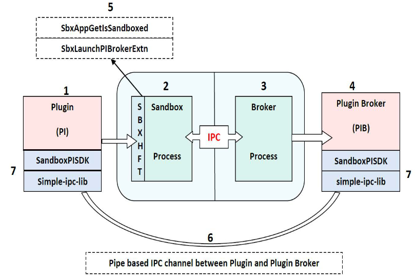

******************************************************
Sandbox Broker Extensibility
******************************************************

A plug-in loaded in a sandboxed process executes within the restrictions of the sandbox and it may need to implement a broker to perform any privileged operations or access resources that are blocked by the sandbox. This might require adding to the existing broker APIs to get its features working in the sandbox environment.

Broker extensibility provides a generic plug-and-play architecture that would enable extending the existing broker functionality provided by Protected Mode in the app. This architecture allows new features to work seamlessly in the sandbox environment on demand and at run time.

Extending broker APIs at run time
---------------------------------

The ``sandbox_pisdk_client`` and ``sandbox_pisdk_server`` libraries have been made available for broker extensibility. Plugins need to link to this library to implement broker extensibility. Doing so allows plug-ins loaded in sandbox process to extend broker APIs at run time and make IPC calls to the broker process to access the extended functionality.

The following figure illustrates the sandbox plug-in architecture provided to extend the broker API functionality by individual plug-ins at run time:

Components
----------

Plugin (PI)
~~~~~~~~~~~

The plug-in is loaded in the sandbox process that runs under restricted rights. Every plug-in that requires some added broker functionality must implement its own plug-in broker process to implement new broker APIs. These broker APIs can be used only by that plug-in and are not visible to any other code/module loaded inside the sandbox process. Plugins can use the sandbox plugin SDK for this.

Sandbox process
~~~~~~~~~~~~~~~

This is the renderer process running in protected mode under restricted rights. All application and plug-in code runs in this process. It has restricted access to files, registry, processes, window handles etc. It communicates with the broker process over the sandbox-broker IPC channel to service actions outside the sandbox boundary.

Broker process (The broker process running with full rights)
~~~~~~~~~~~~~~~~~~~~~~~~~~~~~~~~~~~~~~~~~~~~~~~~~~~~~~~~~~~~

This is the broker process which runs with full user rights and imposes policy white lists. It grants access to files, registry, and processes as per policy white list. It implements the broker APIs to service the functionality requested by the sandbox process outside the sandbox boundary. The sandbox process communicates with it over the sandbox-broker IPC channel.

Plugin broker (The plugin broker process that extends the broker APIs at runtime)
~~~~~~~~~~~~~~~~~~~~~~~~~~~~~~~~~~~~~~~~~~~~~~~~~~~~~~~~~~~~~~~~~~~~~~~~~~~~~~~~~

This is the plugin broker process which is private to the associated plug-in. This implements the plug-in specific broker APIs required for the full functionality of the plug-in in sandbox environment. We call them extended broker APIs, as they extend the existing broker APIs to fulfill the plug-in requirements.

The plug-in, which runs in Protected Mode context, communicates with this process directly over a separate IPC channel, 1 -> 6 -> 4, to service additional functionality outside the sandbox boundary which is not provided by broker APIs.

This process is launched by the broker process; it runs with full user rights and independent of the sandbox context. Also, by default it does not honor any policy restrictions or other security mechanisms. Thus it is the plug-in developer's responsibility to design and implement it with security in focus; otherwise it can be used to escape the sandbox context.

Also, this binary along with the description (input and output parameters) of the APIs it exposes have to be submitted to Adobe for code signing. Please note that signature of the plug-in broker executable is verified before launch if the 'Use only Certified plug-ins' is checked, so it is the responsibility of the plug-in developer to ensure that this is signed otherwise this would just not work.

SandboxHFT (Public HFT provided by sandbox for broker extensibility)
~~~~~~~~~~~~~~~~~~~~~~~~~~~~~~~~~~~~~~~~~~~~~~~~~~~~~~~~~~~~~~~~~~~~

This HFT contains two APIs which can be called by plug-ins to implement broker extensibility:

-  ``SbxAppGetIsSandboxed`` : This public API can be called from any plug-in that imports SandboxHFT to check whether the app is running with Protected Mode ON or OFF.
   The prototype for this API is:
   ``ASBool SbxAppGetIsSandboxed(void);``
-  ``SbxLaunchPIBrokerExe`` : This is the public API provided by sandbox process to extend broker API at run time. The plug-in makes a request via the ``SbxLaunchPIBrokerExe`` API to start its plugin broker process and do some initial handshake with it.

All the processes placed in ``App Install Directory(app name)plug_inspi_brokers`` are white listed. Third party plug-in developers must place their plugin broker processes at this location and can use this HFT. The prototype for this API is:

::

   HANDLE SbxLaunchPIBrokerExe(
   const wchar_t *piBroker // IN:plugin broker process name
   );

It takes the plugin broker process name in piBroker as input, looks it up in its process white list, if it succeeds then launches the piBroker process, and finally establishes IPC channel between the plug-in and piBroker. If everything succeeds, it then returns handle to the underlying IPC mechanism (in this it's the ``NamedPipe`` ) otherwise INVALID_HANDLE_VALUE is returned.

To aid thrid-party developers in setting up the IPC between plugin and plugin broker process (1 -> 6 -> 4), we have provided an API SandboxPISDK::InitSandboxPIBrokerIPCChannel which launches the PI-broker (by using above HFT function SbxLaunchPIBrokerExe) and sets up the IPC. See `Building a plug-in <SandboxBrokerExt.html#47413>`__ for more details.

Please note that there's one more API in this HFT - SbxLaunchPIBrokerExtn which has been deprecated from A11

IPC channel between plugin and plugin broker, 1->6->4
~~~~~~~~~~~~~~~~~~~~~~~~~~~~~~~~~~~~~~~~~~~~~~~~~~~~~

This is the dedicated IPC channel across which the plug-in and its plug-in broker process communicate. The IPC channel is established at run time, when the plugin makes a request via the InitSandboxPIBrokerIPCChannel API, to start its plugin broker process. The broker process looks up in its process white list and launches the requested plugin broker process and establishes the IPC channel. This communication channel bypasses the usual 1 -> 2 -> 3 trusted IPC channel between the plugin (in Protected Mode process) and broker process and talks directly to the PI broker process via 1->6->4.

simple-ipc-lib and SandboxPISDK
~~~~~~~~~~~~~~~~~~~~~~~~~~~~~~~

``simple-ipc-lib`` : This is a very light weight C++ inter-process communication library. It is used to communicate over the ``NamedPipe`` . This library needs to be built and linked into both the plugin and the plugin broker.

``SandboxPISDK`` : plugin developers must use this SDK to implement broker Extensibility for their Plugin. This SDK abstracts out a lot of internal details and has wrappers and macros to aid developers.

.. raw:: html

   

Building a plug-in
~~~~~~~~~~~~~~~~~~

#. Add ipc_lib project to the plug-in's project dependency list and also link to it.
#. Add the following headers from the SandboxPISDK into your project:

   -  ``SandboxPIIPCDefs.h``
   -  ``SandboxPIClientDefs.h``
   -  ``SandboxPISDKClientMacros.h``

#. Implement ``<plugin>CrossCalls.h`` and ``<plugin>IPCClient.cpp`` to add the client side of the Plugin specific broker Extensibility functionality. See `Implement CrossCalls (make calls from plug-in to plug-in's broker process) <SandboxBrokerExt.html#26339>`__.
#. Link to the ``sandbox_pisdk_client.lib`` provided along with SandboxPISDK
#. Call the API, ``InitSandboxPIBrokerIPCChannel`` provided with SandboxPISDK to setup the IPC channel with your Plugin's broker process.

Building a plugin's broker process
~~~~~~~~~~~~~~~~~~~~~~~~~~~~~~~~~~

#. Add ``ipc_lib`` project to the plug-in's project dependency list and also link to it.
#. Add the following headers from the SandboxPISDK into your project:

   -  ``SandboxPIIPCDefs.h``
   -  ``SandboxPIServerDefs.h``
   -  ``SandboxPISDKServerMacros.h``

#. Add the ``SandboxPIServerMain.cpp`` to the project
#. Implement ``<plugin>IPCServer.cpp`` to add the server/broker side of the Plugin broker Extensibility functionality. See `Implement CrossCalls (make calls from plug-in to plug-in's broker process) <SandboxBrokerExt.html#26339>`__.
#. Add ``ipc_lib`` project to your <Plugin>broker project's dependency list and also link to it.
#. Link to the ``sandbox_pisdk_server.lib`` provided along with SandboxPISDK

Refer the sample plugin/pluginbroker source code for more details.

Handshake between plugin and plugin broker
------------------------------------------

These steps create the initial setup for the IPC channel between the Plugin and its broker required to make the cross calls. The following sequence of steps takes place during the initial setup:

#. The plug-in provides a plug-in broker process placed at ``(app name)plug_inspi_brokers`` .
#. The plug-in sends a request via the ``InitSandboxPIBrokerIPCChannel`` call which in turn uses SandboxHFT call ``SbxLaunchPIBrokerExe`` to launch its piBroker process.
#. The broker process then validates the ``piBroker`` process name against a white list.
#. If the above validation succeeds, then the broker process launches the ``piBroker`` process. It then establishes the IPC channel using the ``simple-ipc-lib`` between ``piBroker`` process and plug-in.
#. If ``InitSandboxPIBrokerIPCChannel`` returns true then plug-in is now ready to make cross calls to the ``piBroker`` directly over the IPC channel to execute extended broker functionality.

Refer to the sample project to get started and for example code.

.. raw:: html

   

Implement CrossCalls (make calls from plug-in to plug-in's broker process)
--------------------------------------------------------------------------

The entire purpose of providing broker Extensibility to plugins is to offer plug-ins a mechanism to make CrossCalls i.e. perform privileged operations that don't work when called directly from the plug-in, for example, sending messages to HWND, read/write to files/registries, launch any application etc. The plug-in's broker run under the user rights and doesn't have any sandbox restrictions as a plugin running inside the app process has. So when a CrossCall is made, the plugin's broker performs the same operation on the plugin's behalf and returns the result to plugin. We are using chrome's ``simple-ipc-lib`` to perform Inter-process Communication and have written macros to define and make CrossCalls relatively easier.

Let's take an example where plugin needs to send ``WM_COPYDATA`` message to a window.

Changes required in the plugin (client)
~~~~~~~~~~~~~~~~~~~~~~~~~~~~~~~~~~~~~~~

File <plugin>CrossCalls.h
'''''''''''''''''''''''''

Create a unique id for new call and add it in between ``DECLARE_CROSS_CALL_START`` and ``DECLARE_CROSS_CALL_END:``

::

   
               DECLARE_CROSS_CALL_START
   
                           CROSS_CALL_ID(<UniqueId1>)
   
                           CROSS_CALL_ID(<UniqueId2>)
   
                           CROSS_CALL_ID(<UniqueIdN>)
   
                           CROSS_CALL_ID(SbxPISendMessage)
   
               DECLARE_CROSS_CALL_END

Now the ``INPUT PARAMETERS`` (params that are passed from plugin to broker) and ``OUTPUT PARAMERERS`` (params that are returned from broker to plugin) and their order need to be defined.

Macros ``DEFINE_IPC_MSG_CLIENT(<UniqueId>, <numOfInputParams>)`` and ``DEFINE_IPC_MSG_SERVER(<UniqueId>, <numOfOutputParams>)`` have been designed exactly for this purpose. For ``SbxPISendMessage`` CrossCall, the 4 input parameters are ``HWND`` (passed as ``VoidPtr`` ), ``MsgType`` (passed as ``UINT`` ), ``WPARAM`` (passed as ``UINT`` ), and ``buffer`` (passed as ``ByteArray`` ), and 2 output parameters are result – retrun value of ``SendMessage`` call (passed as ``UINT`` ) and ``LastError`` – ``GetLastError`` result after ``SendMessage`` (passed as ``UINT`` ).

::

   
               DEFINE_IPC_MSG_CLIENT(SbxPISendMessage, 4) {
   
                           INPUT_PARAM_VOID_PTR(1)
   
                           INPUT_PARAM_UINT(2)
   
                           INPUT_PARAM_UINT(3)
   
                           INPUT_PARAM_BUFFER(4)
   
               };
   
               DEFINE_IPC_MSG_SERVER(SbxPISendMessage, 2) {
   
                           OUTPUT_PARAM_UINT(1)
   
                           OUTPUT_PARAM_UINT(2)
   
   };

The following IPC data types are supported (as defined in files ``SandboxPISDKClientMacros.h`` and ``SandboxPISDKServerMacros.h`` ) :-

::

   INPUT_PARAM_VOID_PTR - for void*
   INPUT_PARAM_INT - int
   INPUT_PARAM_UINT - unsigned int
   INPUT_PARAM_LONG - long
   INPUT_PARAM_ULONG - unsigned long
   INPUT_PARAM_STRING - std::string
   INPUT_PARAM_WSTRING - std::wstring
   INPUT_PARAM_BUFFER - ipc::ByteArray
   OUTPUT_PARAM_VOID_PTR - for void*
   OUTPUT_PARAM_INT - int
   OUTPUT_PARAM_UINT - unsigned int
   OUTPUT_PARAM_LONG - long
   OUTPUT_PARAM_ULONG - unsigned long
   OUTPUT_PARAM_STRING - std::string
   OUTPUT_PARAM_WSTRING - std::wstring
   OUTPUT_PARAM_BUFFER - ipc::ByteArray

File <plugin>IPCClient.cpp
''''''''''''''''''''''''''

In this file, the entire client side of the CrossCall needs to be defined. Macro ``DEFINE_CLIENT_CROSS_CALL(<UniqueId>, <numOfInputParams>, <numOfOutputParams>)`` does all the work of generating the requisite class (client side).

::

   DEFINE_CROSS_CALL_CLIENT(SbxPISendMessage, 4, 2)

So once you have defined the cross call by using above macro, you have to use macro ``MAKE_CROSS_CALL() and MAKE_CROSS_CALL_WITH_RETURN_VAL()`` to call the function at the broker end. Whenever any UI is involved at the broker end and window handle from plugin is passed to the ``PIBroker`` , the macro ``MAKE_CROSS_CALL_WITH_MSG_PUMP()`` or ``MAKE_CROSS_CALL_WITH_MSG_PUMP_AND_RETURN_VAL()`` can be used which ensures that all UI messages from ``PIBroker`` to the plugin. Remember, the order of input and output parameters have to be exactly same as defined in ``<plugin>CrossCalls.h`` header file. Also, note that the input parameters are passed as const reference and output parameters are passed as reference.

::

   
                bool return_value = false;
   
                MAKE_CROSS_CALL_WITH_RETURN_VAL(SbxPISendMessage, return_value)(static_cast<LPVOID>(hWnd), msgType, wParam, ByteArrayBuffer, outRetVal, outLastErr);

Changes required in the plugin's broker (server)
~~~~~~~~~~~~~~~~~~~~~~~~~~~~~~~~~~~~~~~~~~~~~~~~

File <plugin>IPCServer.cpp
''''''''''''''''''''''''''

In this file, the entire server side of the CrossCall needs to be defined. Macro ``DEFINE_SERVER_CROSS_CALL_START(<UniqueId>, <numOfInputParams>, <numOfOutputParams>)`` does all the work of generating the requisite server side class:

::

   
               DEFINE_SERVER_CROSS_CALL_START(SbxPISendMessage, 4, 2)
   
                    virtual void Proc(const LVOID& input1, const UINT& input2, const UINT& input3, ipc::ByteArray &input4, UINT& out1, UINT& out2)
   
                   {
   
                      LRESULT result = 0;
   
                      HWND hWnd = static_cast<HWND>(input1);
   
                      //  likewise take other parameters and make them ready to be passed to
   
                      // SendMessage
   
                      result = SendMessage(hWnd, WM_CPYDATA, <other parameters>);
   
                      out1 = (result == FALSE) ? 0 : 1;
   
                      out2 = GetLastError();
   
                    }
   
              DEFINE_CROSS_CALL_SERVER_END

Please note that if Proc above raises any exception then it will be eaten away by the internal implementation, so you need to use your own try catch block if you want to pass on any exception raised here to the plug-in.

And finally use the ``MACRO - ADD_MSG_HANDLER`` to add above Cross all Proc to list of message handlers so that whenever ``SbxPISendMessage`` message arrives at the ``PIBroker`` end, it can be appropriately routed to its Proc.

::

   
           DEFINE_CROSS_CALL_HANDLER_START(<Plugin-Name>)
                 ADD_MSG_HANDLER(<Cross-Call UniqueId1>)
                 ADD_MSG_HANDLER(<Cross-Call UniqueId2>)
                 ADD_MSG_HANDLER(SbxPISendMessage)
            DEFINE_CROSS_CALL_HANDLER_END
   
   
   

Individual policy configuration for 3rd parties
===============================================

The 2020 release introduces a new mechanism which allows plugins to use individual custom policy config files. The new config files adhere to same format and syntax as the original config file. To create one:

#. Create a custom policy config file parallel to Acrobat.exe in Acrobat's installation folder.
#. Open the registry to ``HKEY_LOCAL_MACHINESOFTWAREPoliciesAdobeAcrobat Acrobat<Track>FeatureLockDown``
#. Create a key: ``cProtectedModeConfigFiles``
#. Add new preferences with a string with the name as your plugin's name and data as your config file name under:

Getting started with SampleExtn
===============================

To use the example, do the following:

#. Copy the ``SampleExtn`` folder to the ``…[PluginSupport]Sample`` folder of your ``SDK`` folder as: ``<Acrobat_SDK_Root>AdobeAcrobatSDKVersion1[PluginSupport]Samples[SampleExtn]`` . This folder contains the source code for SamplePI(Reader Plugin) and SamplePIBroker(PIBroker).
#. Open the Solution File: ``SampleExtnwin32[SampleExtn].sln`` and build it with VisualStudio 2019 SP1. Note: You will have to Reader Enable the ``SamplePI.api`` as described in Developing and enabling an Adobe Reader plug-in--Reader plugins must be signed; Acrobat-only plugins do not need signing.
#. Copy the Reader Enabled ``SamplePI.api`` to ``<Reader_Installed_Path>plug_ins[SamplePI].api``
#. Copy the SamplePIBroker.exe process to ``<Reader_Installed_Path>plug_inspi_brokers[SamplePIBroker].exe``
#. Start in Protected Mode and play with ``SamplePI.api`` from Acrobat SDK/SamplePI Menu.
