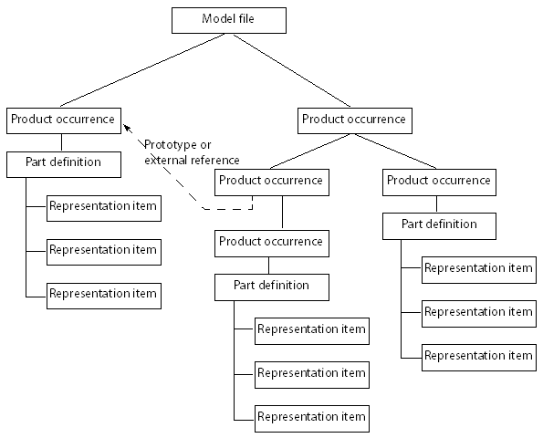
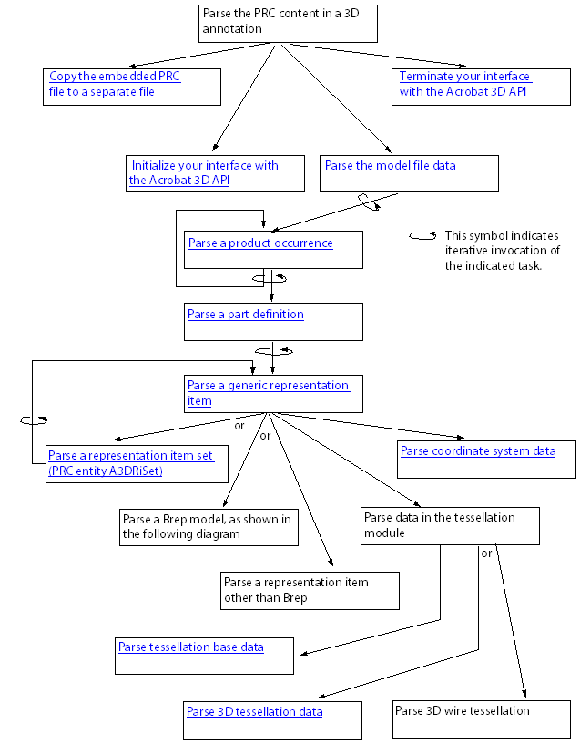
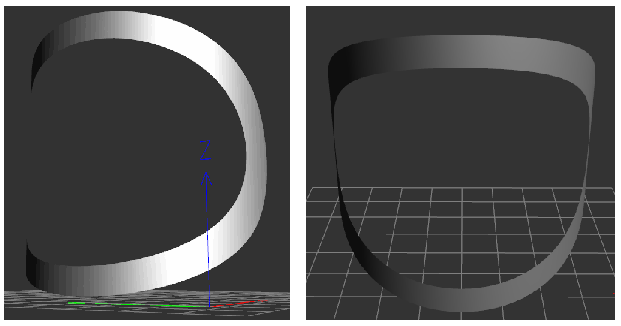
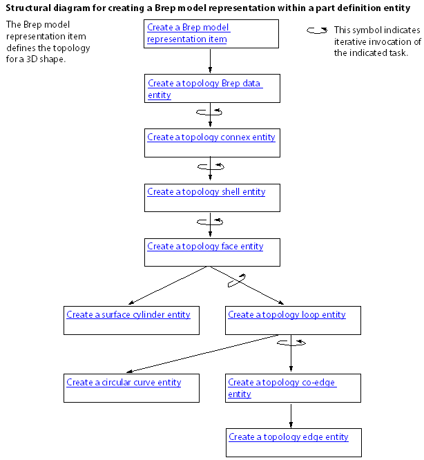

******************************************************
Parsing and Creating PRC Files
******************************************************

.. note::

   Starting Acrobat X, the ability to convert various 3D formats for use with PDF is no longer supported. The associated APIs are, therefore, not available from Acrobat X SDK onwards.

The Adobe Acrobat 3D API lets you develop Acrobat plugins and PDF Library applications that create and access data in a PRC stream. Such a stream can be embedded within a PDF document as a 3D annotation. This chapter explains how to export the contents of a PRC stream, and how to create a PRC stream.

PRC data can appear in PDF documents as streams referenced by 3D annotations. PRC data is a highly-compressed 3D representation supported in Acrobat 8.1 and later. It can represent faceted and exact geometry data. The PRC format is specified in the `PRC Format Specification <./API_References/PRCReference/PRC_Format_Specification/index.html>`__.

Before you read this chapter, it is strongly recommended that you become familiar with 3D concepts and OpenGL, and with 3D annotations. (See `Creating 3D Annotations <Plugins_3D_samples.html#50618421_43763>`__.) OpenGL is an open-source API for setting and accessing 3D data.

For a description of the PRC file format, see the `PRC Format Specification <./API_References/PRCReference/PRC_Format_Specification/index.html>`__.

Working with the Acrobat 3D API
===============================

The Acrobat 3D API provides a programmatic interface to the Acrobat 3D Library. It is the only mechanism that lets you create, access, and change PRC data that appears in a PDF document. It does not enable reading or writing PDF documents. (U3D is another 3D format that can be referenced by 3D annotations.)

You can use the Acrobat 3D API to develop the following settings:

-  Plugins that work with Acrobat Pro Extended
-  Applications that use the PDF Library. (Acrobat Pro Extended must also be installed.) When the Acrobat 3D Library initializes itself, it verifies the presence of Acrobat Pro Extended on the same computer.

Versions
--------

The following table shows the correlation between the Acrobat 3D Library versions and the Acrobat products that supports them. The table also shows the PRC format supported by the Acrobat 3D Library version.

+----------------------------+-------------------------+-----------------------------+
| Acrobat 3D Library version | Product                 | Supports PRC format version |
+============================+=========================+=============================+
| 2.0                        | | Acrobat Pro Extended  | 7094 and earlier            |
|                            | | version 9.0           |                             |
|                            |                         |                             |
|                            | PDF Library version 9.0 |                             |
+----------------------------+-------------------------+-----------------------------+
| 2.1                        | | Acrobat Pro Extended  | 7094 and earlier            |
|                            | | version 9.1           |                             |
|                            |                         |                             |
|                            | PDF Library version 9.1 |                             |
+----------------------------+-------------------------+-----------------------------+

Compatibility with different PRC format versions
-----------------------------------------------------------------------------------

In addition to supporting the PRC format specified in the previous table, Acrobat 3D Library provides forward and backward compatibility with other PRC format versions:

**Forward compatibility:** The Acrobat 3D Library is designed to avoid failing if it reads PRC documents that conform to future releases of the PRC format. It does so by ignoring any information it does not understand.

**Backward compatibility:** In a major release, Acrobat 3D Library support for PRC is backward compatible. Each new version of the software can read PRC files that conform to an earlier PRC format version.

Compatibility between the Acrobat 3D Library and the Acrobat 3D API
-----------------------------------------------------------------------------------

The Acrobat 3D API provides the public declarations for a particular version of the Acrobat 3D Library. Plugins developed with one version of the Acrobat 3D API are installed with the same version of Acrobat 3D Library, where that library is contained in Acrobat Pro Extended.

Acrobat 3D Library is designed to support backward compatibility within minor releases of the library.

Requirements
------------

To develop an Acrobat 3D Extended plugin that uses the Acrobat 3D Library, you must download the samples, documentation, and header files from the `Acrobat 3D Developer Center <http://www.adobe.com/go/acrobat3d_developer>`__. You must also download the Acrobat SDK from the `Acrobat Developer Center <http://www.adobe.com/go/acrobat_developer>`__.

To develop a PDF Library application that uses the Acrobat 3D Library, you must download the samples, documentation, and header files from the `Acrobat 3D Developer Center <http://www.adobe.com/go/acrobat3d_developer>`__. You must also download the PDF Library, which is available through your Adobe representative.

A licensed copy of Acrobat Pro Extended must be installed on the computer on which the plugin or PDF Library application is running. The Acrobat 3D Library verifies the presence of Acrobat Pro Extended before initializing its relationship with the application or plugin.

The file that contains the Acrobat 3D Library is A3DLIB.dll, which is located in the following directory:

C:Program FilesAdobeAcrobat DCAcrobat

Data types, naming conventions, and character encoding
------------------------------------------------------

The Acrobat 3D API adopts the Acrobat library definitions for basic types. Here are the basic types from the Acrobat library: ASInt8, ASInt16, ASInt32, ASUns8, ASUns16, ASUns32, and ASBool.

The Acrobat 3D API declares all non-basic types, which fall into these general categories:

**PRC entities.** Correspond to the non-terminal structures in the PRC format, such as product occurrences, tessellation base data, and texture transformations. Your software uses NULL pointers to reference PRC entities.

**Data structures.** Contain the data used to create a PRC entity. Data structures can also receive the data obtained from parsing a PRC entity. There is one data structure for each type of PRC entity.

Acrobat 3D API uses a naming convention that is self-documenting. The name for each function, structure, enumeration, and enumerator provides clues as to its type, its relationship to a PRC entity described in the PRC format, and its role relative to that PRC entity.

Character encoding is UTF-8, which uses the character encoding scheme described by the Internet Engineering Task Force (IETF) document *UTF-8, a transformation format of ISO 10646*. That document is available at http://tools.ietf.org/html/rfc3629.

Structured and recursive nature of PRC parsing
----------------------------------------------

Plugins and applications that process PRC data should be structured to reflect the hierarchy of the PRC format. Ideally, they implement one function to process or create each of the PRC entities. Additionally, they implement other functions to perform repeated tasks, such as processing or creating attribute data that can apply to a broad category of PRC entities.

Additionally, plugins and applications that process PRC data should support recursive function calls.

The PRC format is a highly-compressed hierarchical structure. The structural entities in a PRC document enable the definition of subassemblies that represent some part of the overall image, such as a gear or a nut. Subassemblies are then grouped to create more complex assemblies, or they can be referenced from other subassemblies similar to a macro.

The following diagram illustrates the hierarchical relationships that can exist between the structural elements:

-  Model files can have multiple child product occurrences.
-  Product occurrences can have multiple child product occurrences and a part definition. They can also reference product occurrences that act as prototypes or external data.
-  Part definitions have multiple child representation items.

 

Because some PRC entities can contain child entities of the same type, plugins that parse or create PRC data use recursion.

Implementing external linking in your plugin
============================================

The Acrobat 3D Library's import library (the.lib file) is not provided in the Acrobat SDK or through any other means. As a result, you must use explicit linking to resolve the external links in your plugin.

With explicit linking, the executable using the DLL must make function calls to explicitly load and unload the DLL, and to access the DLL's exported functions. Your plugin must call the exported functions through a function pointer. More specifically, your plugin must perform the following tasks:

-  Call the ``LoadLibrary`` function (or a similar function) to load the DLL and obtain a module handle.
-  Call the ``GetProcAddress`` function to obtain a function pointer to each exported function that your plugin calls. Because applications are calling the DLL's functions through a pointer, the compiler does not generate external references, so there is no need to link with an import library.
-  Call the ``FreeLibrary`` function when done with the DLL.

.. note::

   The Acrobat 3D API functions in this chapter are described as though implicit linking were possible. Wherever you see a direct call to one of these functions, you should instead use the pointer to the function. See `Implementing external linking <Plugins_A3D_API.html#50618396_37765>`__.

Implementing external linking
-----------------------------

#. Call the ``LoadLibrary`` function (or a similar function) to load the DLL and obtain a module handle.
#. Call the ``GetProcAddress`` function to obtain a function pointer to each exported function that your plugin calls. Because applications are calling the DLL's functions through a pointer, the compiler does not generate external references, so there is no need to link with an import library.
#. Main code segment that loads the Acrobat 3D library and defines function pointers

::

   HMODULE hModuleA3DPRCSDK = A3DPRCLoadLibrary();
   
   if (!hModuleA3DPRCSDK) {
     AVAlertNote("Failed to load A3DLIB.dll!");
     _unlink(prcName);
     _unlink(jsName);
     return;
   }
   
   A3DPRCFunctionPointersInitialize(hModuleA3DPRCSDK);
   
   /*------------------------------------
   /* Your plugin initializes its relationship with the Acrobat 3D Library
   /* and then it parses or creates PRC content. 
   /*------------------------------------
   
   A3DPRCUnloadLibrary(hModuleA3DPRCSDK);
   } else {
     char strMsg[128];
     sprintf(strMsg, "A3DDllInitialize returned %dn", iRet);
     AVAlertNote(strMsg); 
     _unlink(prcName);
     _unlink(jsName);
     A3DPRCUnloadLibrary(hModuleA3DPRCSDK);
   }

Loading the DLL and obtaining a module handle

::

   HMODULE A3DPRCLoadLibrary()
   {
     HMODULE hModuleA3DPRCSDK;
   
     wchar_t acFilePath[MAX_PATH];
     GetModuleFileNameW(NULL, acFilePath, MAX_PATH);
     wchar_t* backslash = wcsrchr(acFilePath, L'');
   
     if (backslash)
         acFilePath[backslash - acFilePath] = 0;
   
     wcscat(acFilePath, L"A3DLIB.dll");
   
   #ifdef UNICODE 
     hModuleA3DPRCSDK = LoadLibraryExW(acFilePath, NULL, LOAD_WITH_ALTERED_SEARCH_PATH);
   #else
     hModuleA3DPRCSDK = LoadLibraryExA(acFilePath, NULL, LOAD_WITH_ALTERED_SEARCH_PATH);
   #endif
     if (hModuleA3DPRCSDK)
         return hModuleA3DPRCSDK;
   
     return NULL;
   }

Setting up the function pointers

::

   void A3DPRCFunctionPointersInitialize(HMODULE hModule)
   {
   #define A3D_API(returntype,name,params) st_PF##name = (PF##name)GetProcAddress(hModule,#name);
   #include <A3DSDK.h>
   #include <A3DSDKTypes.h>
   #include <A3DSDKBase.h>
   #include <A3DSDKErrorCodes.h>
   #include <A3DSDKGeometry.h>
   #include <A3DSDKTessellation.h>
   #include <A3DSDKGraphics.h>
   #include <A3DSDKStructure.h>
   #include <A3DSDKRootEntities.h>
   #include <A3DSDKRepItems.h>
   #include <A3DSDKTessellation.h>
   #include <A3DSDKMarkup.h>
   #include <A3DSDKGlobalData.h>
   #include <A3DSDKTexture.h>
   #include <A3DSDKMisc.h>
   #include <A3DSDKGeometryCrv.h>
   #include <A3DSDKGeometrySrf.h>
   #include <A3DSDKTopology.h>
   #undef A3D_API
   }

Declaring the macro that resolves to the function pointer

::

   #define A3DCALL(name,params) st_PF##name params

Using the macro to invoke an Acrobat 3D API function

::

   if(iErr == A3D_SUCCESS) {
         ASInt32 iRet = A3DCALL(A3DDllInitialize,(iMajorVersion, iMinorVersion));
         if(iRet == A3D_SUCCESS) {
         …
     }
   }

Parsing a PRC file
==================

This section describes how to parse the data in a PRC file. You can then export the PRC data to an external file that uses a different CAD format, provided you understand the structure of that format and have an API that supports that format. It is beyond the scope of this chapter to explain how to convert PRC data into a specific CAD format. It is also beyond the scope of this chapter to provide an exhaustive explanation of parsing all aspects of a PRC file.

The following diagram shows the structure of a plugin that parses PRC data.

The following diagram shows the sequence of tasks required to parse a Brep model entity.

.. image:: images/parsebrep.png

Handling errors
---------------

Most of the Acrobat 3D API functions return an integer that indicates success or failure. A return value of ``A3D_SUCCESS`` indicates success, and any negative return value indicates failure. The following example shows one approach for evaluating this returned result:

::

   ASInt32 iRet = A3DAsmModelFileLoadFromFile(acFileName, NULL, &p);
   if (iRet == A3D_SUCCESS) {
     … 
   } else
     fprintf("Error: %1dn", iRet);

Although subsequent explanations in this section omit this description, you must still check for errors when an Acrobat 3D API function returns.

Copying the embedded PRC file to a separate file
------------------------------------------------

This section explains how to export a PRC stream represented in a PDF document as a 3D annotation.

Copy the embedded PRC file to a separate file

#. Retrieve the 3D annotation from within a PDF document. (See `Retrieving existing annotations <Plugins_Annotations.html#50618420_93262>`__.) Ensure that the annotation dictionary type is ``3DD`` and that the subtype is ``PRC``.
#. Write the PRC stream to a separate file. This will simplify accessing the data in the stream.

Initializing the Acrobat 3D API
-------------------------------

This section explains how to initialize the Acrobat 3D API.

Initialize your interface with the Acrobat 3D API

#. Verify that your plugin is compatible with the Acrobat 3D Library by comparing the version of the Acrobat 3D API against which you compiled and the version of the Acrobat 3D Library available to your plugin. Obtain the version identifiers for the currently installed Acrobat 3D Library by invoking the ``A3DDllGetVersion`` function. Evaluate the returned values as follows:

   -  Ensure that the value of the ``piMajorVersion`` argument matches the ``A3D_DLL_MAJORVERSION`` enumeration.
   -  Ensure that the value of the ``piMinorVersion`` argument is equal to or greater than the ``A3D_DLL_MINORVERSION`` enumeration. The Acrobat 3D Library provides backward compatibility for earlier releases of the API that have the same major version identifier.

#. Initialize the Acrobat 3D API by supplying the version identifiers for the Acrobat 3D API.

::

   if(iErr == A3D_SUCCESS) {
         ASInt32 iRet = A3DCALL(
             A3DDllInitialize,(A3D_DLL_MAJORVERSION, A3D_DLL_MINORVERSION));
         if(iRet == A3D_SUCCESS) { … }
   }

.. warning::

   For simplicity, this example uses a syntax that assumes the import library is available. That library is not publicly available, so your code must use a syntax that supports external linking (see `Implementing external linking in your plugin <Plugins_A3D_API.html#50618396_20817>`__). The following example shows the syntax to use:

Parsing structure PRC entities
------------------------------

The `Acrobat 3D API Reference <./API_References/PRCReference/3D_API_Reference/index.html>`__ groups the PRC entities that provide structure to the PRC document into the structure module. The PRC entities in the structure module are described here:

**Model file:** Is a root PRC entity. There is only one model file in a PRC file.

**Product occurrence:** Can contain multiple child product occurrences and one part definition. It can also reference other product occurrences used as prototypes or external data.

**Part definition:** Contains representation items.

**Filter:** Specifies inclusion or exclusion of topology, geometry, tessellation, or graphic entities, based on the entity's layer or entity type.

Parse the model file data
^^^^^^^^^^^^^^^^^^^^^^^^^^^^^^^^^^^^^^^^^^

#. Load the PRC file into memory by invoking the A3DAsmModelFileLoadFromFile function. In the following example, the ``acFileName`` argument points to an ``A3DUTF8Char`` array that contains the name of the PRC file, the second parameter must be ``NULL``, and the ``p`` pointer references a null A3DAsmModelFile object in which the Acrobat 3D Library stores the PRC model file.

::

   A3DAsmModelFile* p = NULL;
   ASInt32 iRet = A3DAsmModelFileLoadFromFile(acFileName, NULL, &p);

2. Populate the model file with the model file data by invoking the A3DAsmModelFileGet function to place the data in that structure. The A3D_INITIALIZE_DATA macro clears the memory allocated to the structure and checks the size of the structure to avoid alignment problems. The A3DAsmModelFileGet function creates a data structure from the model file pointer created in the previous step.

::

   A3DAsmModelFileData sData;

   A3D_INITIALIZE_DATA(sData);

   ASInt32 iRet = A3DAsmModelFileGet(p, &sData);

3. Save the value of the ``m_dUnit`` member in the structure in which you are saving data obtained from parsing the PRC file (your export structure). This member specifies a multiple of millimeters. The value of this member must be non-zero. A value of 1 indicates the units are in millimeters; and a value of 10 indicates the units are in centimeters.
#. If the ``m_bUnitFromCAD`` is present, save its value in your export structure. If the ``bUnitFromCAD`` member is true, then the ``m_bUnit`` is from the native CAD file.
#. Parse the entity base. (See `Parsing root-base entity data <Plugins_A3D_API.html#50618396_60919>`__.)
#. Declare an A3DMiscCascadedAttributes structure. This will be the root entry in a stack on which you store child product occurrences and other subordinate structures. This stack is used to iterate through the PRC structure.

::

   A3DMiscCascadedAttributes* pAttr;
   A3DMiscCascadedAttributesCreate(&pAttr);

As you parse subsequent PRC entities, you push the attributes onto this stack. For more information about using cascaded attribute stacks, see `Parsing PRC entities that specify graphics <Plugins_A3D_API.html#50618396_16174>`__ or click the Related Pages tab on the `Acrobat 3D API Reference <./API_References/PRCReference/3D_API_Reference/index.html>`__.

7. Parse each product occurrence pointer in the ``sData.m_ppPOccurrences`` array. The number of pointers is specified in ``sData.m_uiPOccurrencesSize``.

::

   for (ASUns32 ui = 0; ui < sData.m_uiPOccurrencesSize; ui++)
     parsePOccurrence(sData.m_ppPOccurrences[ui], pAttr);

For information about parsing product occurrences, see `Parse a product occurrence <Plugins_A3D_API.html#50618396_48520>`__.

Parse a product occurrence
^^^^^^^^^^^^^^^^^^^^^^^^^^^^^^^^^^^^^^^^^^

#. Parse the entity base, saving the entity name and other relevant data to your export structure. (See `Parsing root-base entity data <Plugins_A3D_API.html#50618396_60919>`__.)
#. Create and push a cascaded attributes structure for a product occurrence object, and push that structure onto the stack. (See `Parsing graphic attributes using miscellaneous cascaded attributes <Plugins_A3D_API.html#50618396_84985>`__.) Save relevant values to your export structure.
#. Declare and initialize an ``A3DAsmProductOccurrenceData`` structure.

::

   A3DAsmProductOccurrenceData sData;
   A3D_INITIALIZE_DATA(sData);

4. Get the product occurrence data by invoking the ``A3DAsmProductOccurrenceGet`` function.

::

   iRet = A3DAsmProductOccurrenceGet(p, &sData);

5. Parse the product occurrence data to identify subordinate or imported product occurrences and recursively parse the contents of each, as described in `Parse a product occurrence <Plugins_A3D_API.html#50618396_48520>`__ (this section). The member names and their significance are described below:

   -  ``m_pPrototype`` : Pointer to a product occurrence prototype, which typically represents a subassembly or part
   -  ``m_pExternalData`` : Pointer to an external product occurrence
   -  ``m_uiPOccurrencesSize`` : Number of child product occurrences, where the ``m_ppPOccurrences`` array references those child product occurrences

The following example parses prototype or external product occurrences. The ``sData`` variable is a populated ``A3DAsmProductOccurrenceData`` structure.

::

   if (sData.m_pPrototype) {
     parsePOccurrence(sData.m_pPrototype, pAttr);
   }
   if (sData.m_pExternalData) {
     parsePOccurrence(sData.m_pExternalData, pAttr);
   }

The following example parses child product occurrences (``sData.ppPOccurrences[ui]``. As before, the ``sdata`` variable is a populated ``A3DAsmProductOccurrenceData`` structure.

::

   for (ASUns32 ui = 0; ui < sData.m_uiPOccurrencesSize; ui++)
     parsePOccurrence(sData.m_ppPOccurrences[ui], pAttr);

#. If the product occurrence data references a part (``sData.m_pPart`` ), parse it. (See `Parse a product occurrence <Plugins_A3D_API.html#50618396_48520>`__.)
#. Parse any scene display parameters in the product occurrence.
#. Delete the ``A3DAsmProductOccurrenceData`` structure created in Step `Declare and initialize an ``A3DAsmProductOccurrenceData`` structure. <Plugins_A3D_API.html#50618396_31716>`__ by invoking the ``A3DAsmProductOccurrenceGet`` function with the first argument set to ``NULL`` and the second argument pointing to the product occurrence data.

::

   iRet = A3DAsmProductOccurrenceGet(NULL, &sData);

Parse a part definition
^^^^^^^^^^^^^^^^^^^^^^^^^^^^^^^^^^^^^^^^^^

#. Parse the entity base, saving the entity name and other relevant data to your export structure. (See `Parsing root-base entity data <Plugins_A3D_API.html#50618396_60919>`__.)
#. Create and push a cascaded attributes structure for a product occurrence object, and push that structure onto the stack. (See `Parsing graphic attributes using miscellaneous cascaded attributes <Plugins_A3D_API.html#50618396_84985>`__.) Record information from the data structure of the miscellaneous cascaded attributes structure that is meaningful to your representation.
#. Declare and initialize an ``A3DAsmPartDefinitionData`` structure, as shown in the following example:

::

   A3DAsmPartDefinitionData sData;
   A3D_INITIALIZE_DATA(sData);
   iRet = A3DAsmPartDefinitionGet(p, &sData);

#. Parse each representation item referenced by the part definition (See `Parsing representation items <Plugins_A3D_API.html#50618396_89551>`__.) In the following example, ``sData.m_uiRepItemsSize`` is the number of representation item entities in the part definition, and entry in the ``sData.m_ppRepItems[ui]`` array references a separate representation item.

::

   for (ASUns32 ui = 0; ui < sData.m_uiRepItemsSize; ui++)
     parseRI(sData.m_ppRepItems[ui], pAttr);

#. Delete the ``A3DAsmPartDefinitionData`` structure created in Step `Declare and initialize an ``A3DAsmPartDefinitionData`` structure, as shown in the following example: <Plugins_A3D_API.html#50618396_28760>`__ by invoking the ``A3DAsmPartDefinitionGet`` function with the first argument set to ``NULL`` and the second argument pointing to the part definition data.

::

   A3DAsmPartDefinitionGet(NULL, &sData);

Parsing representation items
^^^^^^^^^^^^^^^^^^^^^^^^^^^^^^^^^^^^^^^^^^

Representation items describe objects present in the 3D image, such as a wheel or a bolt. The exception is the representation item set (type ``kA3DTypeRiSet`` ), which is a container for other representation items.

Parse a generic representation item

#. Parse the entity base, saving the entity name and other relevant data to your export structure. (See `Parsing root-base entity data <Plugins_A3D_API.html#50618396_60919>`__.)
#. Create and push a miscellaneous cascaded attributes structure for the representation item, and then get the data for that structure (See `Parsing PRC entities that specify graphics <Plugins_A3D_API.html#50618396_16174>`__.) Record information from the miscellaneous cascaded attributes data structure that is meaningful to your representation.
#. Invoke the ``A3DEntityGetType`` function to determine the type of representation item, providing the following arguments:

   -  The first argument (``p`` in the following example) is a pointer to the representation item.
   -  The second argument (``eType`` in the following example) is a pointer to a variable in which the function stores the type enumerator.

::

    A3DEEntityType eType;
     iRet = A3DEntityGetType(p, &eType);

4. Parse the representation item depending on the type of representation item, as shown in the following example. (See `Parse a representation item set (PRC entity A3DRiSet) <Plugins_A3D_API.html#50618396_19073>`__ or `Parse a Brep model representation item (PRC entity A3DRiBrepModel) <Plugins_A3D_API.html#50618396_70316>`__.)

::

   switch(eType) {
   case kA3DTypeRiBrepModel:
     parseRiBrepModel(p, father);
     break;
   case kA3DTypeRiSet:
     …
     break;
   case kA3DTypeRiPointSet:
     …
     break;
   …
   default:
     …
   }

5. Get the representation item attributes by invoking the ``A3DRiRepresentationItemGet`` function.

::

   A3DRiRepresentationItemData sData;
   A3D_INITIALIZE_DATA(sData);
   iRet = A3DRiRepresentationItemGet(p, &sData);

6. Parse the tessellation base data referenced by the ``m_pTessBase`` member. (See `Parsing tessellation PRC entities <Plugins_A3D_API.html#50618396_89274>`__.)

::

   parseTess(sData.m_pTessBase, p, pAttr);

7. Parse the coordinate system referenced by the ``m_pCoordinateSystem`` member. (See `Parse coordinate system data <Plugins_A3D_API.html#50618396_94778>`__.)

::

   parseRiCSys(sData.m_pCoordinateSystem);

8. Delete the ``A3DRiRepresentationItemData`` created in Step `Get the representation item attributes by invoking the ``A3DRiRepresentationItemGet`` function. <Plugins_A3D_API.html#50618396_17261>`__ by invoking the ``A3DRiRepresentationItemGet`` function with the first argument set to ``NULL`` and the second argument set to the location of the structure (``&sData`` in the following example).

::

   A3DRiRepresentationItemGet(NULL, &sData);

Parse a representation item set (PRC entity A3DRiSet)
^^^^^^^^^^^^^^^^^^^^^^^^^^^^^^^^^^^^^^^^^^^^^^^^^^^^^^^^^^^^^

#. Parse the entity base. (See `Parsing root-base entity data <Plugins_A3D_API.html#50618396_60919>`__.) Save the entity name and other relevant data to your export structure.
#. Create and push a cascaded attributes structure for a product occurrence object, and push that structure onto the stack. (See `Parsing graphic attributes using miscellaneous cascaded attributes <Plugins_A3D_API.html#50618396_84985>`__.) Save relevant values to your export structure.
#. Declare and initialize an ``A3DRiSetData`` structure, and then get the data from the representation PRC entity.

::

   A3DRiSetData sData;
   A3D_INITIALIZE_DATA(sData);
   iRet = A3DRiSetGet(p, &sData);

#. Parse each representation item in the representation item set. (See `Parse a generic representation item <Plugins_A3D_API.html#50618396_16122>`__.) The ``m_uiRepItemsSize`` field specifies the number of child representation items, and the m_ppRepItems[] field is an array of pointers to the child representation items.

::

   for(ASUns32 ui = 0; ui<sData.m_uiRepItemsSize; ui++)
     parseRI(sData.m_ppRepItems[ui], pAttr, son);

#. Delete the A3DRiSetGet function created in Step `Declare and initialize an ``A3DAsmPartDefinitionData`` structure, as shown in the following example: <Plugins_A3D_API.html#50618396_28760>`__ by invoking the ``A3DAsmPartDefinitionGet`` function with the first argument set to ``NULL`` and the second argument pointing to the part definition data.

::

   A3DRiSetGet(NULL, &sData);

Parse a Brep model representation item (PRC entity A3DRiBrepModel)
^^^^^^^^^^^^^^^^^^^^^^^^^^^^^^^^^^^^^^^^^^^^^^^^^^^^^^^^^^^^^^^^^^^^^^^^^^^^^^^^

#. Parse the entity base. (See `Parsing root-base entity data <Plugins_A3D_API.html#50618396_60919>`__.) Save the entity name and other relevant data to your export structure.
#. Get the Brep model data by invoking the ``A3DRiBrepModelGet`` function. The first argument (``p`` in the following example) is a pointer to the PRC entity, and the second argument (``&sData`` in the following example) is the location of the ``A3DRiBrepModelData`` structure.

::

   A3DRiBrepModelData sData;
   A3D_INITIALIZE_DATA(sData);
   ASInt32 iRet = A3DRiBrepModelGet(p, &sData);

#. Parse the Brep model's topology body data, referenced by the ``m_pBrepData`` member. (See `Parse topology body data <Plugins_A3D_API.html#50618396_37745>`__.)
#. Parse the Brep model's data, referenced by the ``m_pBrepData`` member. (See `Parse the Brep model's data <Plugins_A3D_API.html#50618396_73034>`__.)

.. warning::

   The same member (``m_pBrepData`` ) is used to parse topology body data and topology model data. The Brep model's topology body data is recast as the ``A3DTopoBody`` type, which is an abstract root type for any topological body. The ``A3DTopoBodyGet`` function takes an argument of type ``A3DTopoBody``.

#. Delete the ``A3DRiBrepModelData`` created in Step `Get the Brep model data by invoking the ``A3DRiBrepModelGet`` function. The first argument (``p`` in the following example) is a pointer to the PRC entity, and the second argument (``&sData`` in the following example) is the location of the ``A3DRiBrepModelData`` structure. <Plugins_A3D_API.html#50618396_45175>`__ by invoking the ``A3DRiBrepModelGet`` function with the first argument set to ``NULL`` and the second argument set to the location of the structure (``&sData`` in the following example).

::

   A3DRiBrepModelGet(NULL, &sData);

Parse coordinate system data
^^^^^^^^^^^^^^^^^^^^^^^^^^^^^^^^^^^^^^^^^^

#. Parse the entity base. (See `Parsing root-base entity data <Plugins_A3D_API.html#50618396_60919>`__.) Save the entity name and other relevant data to your export structure.
#. Declare and initialize an ``A3DRiCoordinateSystemData`` structure.

::

   A3DRiCoordinateSystemData sData;
   A3D_INITIALIZE_DATA(sData);

3. Get the coordinate system data by invoking the ``A3DRiCoordinateSystemGet`` function. The first argument (``p`` in the following example) is a pointer to the ``A3DRiCoordinateSystem`` entity, and the second argument (``&sData`` in the following example) is the location of the ``A3DRiCoordinateSystemData`` structure.

::

   ASInt32 iRet = A3DRiCoordinateSystemGet(p, &sData);

4. Parse the coordinate system transformation data referenced by the ``m_pTransformation`` member of the ``A3DRiCoordinateSystemData`` structure.
#. Delete the ``A3DRiCoordinateSystemData`` structure created in Step `Declare and initialize an ``A3DRiCoordinateSystemData`` structure. <Plugins_A3D_API.html#50618396_58902>`__ by invoking the ``A3DRiCoordinateSystemGet`` function with the first argument set to ``NULL`` and the second argument set to the location of the structure (``&sData`` in the following example).

::

   A3DRiCoordinateSystemGet(NULL, &sData);

Parsing tessellation PRC entities
---------------------------------

Tessellation entities represent polygon facets.

Parse tessellation base data
^^^^^^^^^^^^^^^^^^^^^^^^^^^^^^^^^^^^^^^^^^^^

#. Parse the entity base. (See `Parsing root-base entity data <Plugins_A3D_API.html#50618396_60919>`__.) Save the entity name and other relevant data to your export structure.
#. Populate an ``A3DTessBaseData`` structure with the tessellation base data by invoking the ``A3DTessBaseGet`` function. The first argument (``p`` in the following example) is a pointer to the tessellation base data, and the second argument (``&sData`` in the following example) is the location of the ``A3DTessBaseData`` structure.

::

   A3DTessBaseData sData;
   A3D_INITIALIZE_DATA(sData);
   ASInt32 iRet = A3DTessBaseGet(p, &sData);

3. Export the coordinate size (sData.m_uiCoordSize), the coordinates array (sData.m_pdCoords), and the calculate attributes (``sData.m_bIsCalculated`` ) to your tessellation base data element.
#. Parse the tessellation data based on its type. The PRC format defines these types for tessellation data:

   -  ``kA3DTypeTess3D``, which is used for solids and surfaces (See `Parse 3D tessellation data <Plugins_A3D_API.html#50618396_81753>`__.)
   -  ``kA3DTypeTess3DWire``, which is used for 3D wireframes
   -  ``kA3DTypeTessMarkup``, which is used for markups

::

   A3DEEntityType eType;
   ASInt32 iErr = A3DEntityGetType(p, &eType);
   if (iErr == A3D_SUCCESS) {
     switch(eType) {
   case kA3DTypeTess3D:
     parse3DTess(p, pRepItem, pFatherAttr);
     break;
   case kA3DTypeTess3DWire:
     parse3DWireTess(p);
     break;
   case kA3DTypeTessMarkup:
     parse3DTessMarkup(p); 
     break;
   default:
     // error response.
   }

5. Delete the A3DTessBaseData created in Step `Populate an ``A3DTessBaseData`` structure with the tessellation base data by invoking the ``A3DTessBaseGet`` function. The first argument (``p`` in the following example) is a pointer to the tessellation base data, and the second argument (``&sData`` in the following example) is the location of the ``A3DTessBaseData`` structure. <Plugins_A3D_API.html#50618396_69214>`__ by invoking the ``A3DRiBrepModelGet`` function with the first argument set to ``NULL`` and the second argument set to the location of the structure (``&sData`` in the following example).

::

   A3DTessBaseGet(NULL, &sData);

Parse 3D tessellation data
^^^^^^^^^^^^^^^^^^^^^^^^^^^^^^^^^^^^^^^^^^^^

#. Parse the entity base. (See `Parsing root-base entity data <Plugins_A3D_API.html#50618396_60919>`__.) Save the entity name and other relevant data to your export structure.
#. Populate an ``A3DTess3DData`` structure with the tessellation data by invoking the ``A3DTess3DGet`` function.

::

   A3DTess3DData sData;
   A3D_INITIALIZE_DATA(sData);
   ASInt32 iRet = A3DTess3DGet(p, &sData);

3. Represent relevant data from the 3D tessellation data element in your export structure.
#. For each face in the tessellation data, create and push the cascaded attributes face data and then access its data members. (See `Parsing graphic attributes using miscellaneous cascaded attributes <Plugins_A3D_API.html#50618396_84985>`__.) In the following example, the ``CreateAndPushCascadedAttributesFace`` is a private function that pushes the miscellaneous cascaded attributes for a tessellation face onto the stack.

::

   ASUns32 uiNumberOfFaces = sData.m_uiFaceTessSize;
   
   for (ASUns32 ui = 0; ui < uiNumberOfFaces; ui++) {
     A3DTessFaceData& sTessFaceData = sData.m_psFaceTessData[ui];
   
     A3DMiscCascadedAttributes* pAttr;
     A3DMiscCascadedAttributesData sAttrData;
     // Read CascadedAttributes for one of the facec
     CreateAndPushCascadedAttributesFace(pRepItem, p, &sTessFaceData, 
         ui, pFatherAttr, &pAttr, &sAttrData);
   
     A3DMiscCascadedAttributesDelete(pAttr);
     A3DMiscCascadedAttributesGet(NULL, &sAttrData);
   }

5. Delete the cascaded attributes data structure.

::

   A3DMiscCascadedAttributesDelete(pAttr);

6. Delete the cascaded attributes structure.

::

   A3DMiscCascadedAttributesGet(NULL, &sAttrData);

7. Delete the ``A3DTess3DData`` structure created in Step `Populate an ``A3DTess3DData`` structure with the tessellation data by invoking the ``A3DTess3DGet`` function. <Plugins_A3D_API.html#50618396_64792>`__.

::

   A3DTess3DGet(NULL, &sData);

Parsing topology PRC entities
-----------------------------

The `Acrobat 3D API Reference <./API_References/PRCReference/3D_API_Reference/index.html>`__ groups the PRC entities that specify topology into the topology module. The PRC entities in this module specify the surfaces of 3D objects. This section describes how to parse the topology data in a Brep model.

Topology data in a Brep model contains data specific to the Brep and data that is generic to topology models.

**Data specific to Brep topology models**

The following entities contain the geometric data that represents the Brep data:

* Topology Brep data: A topological boundary representation comprised of a bounding box and references to multiple Connex entities (See `Create a topology Brep data entity <Plugins_A3D_API.html#50618396_82589>`__.)
* Connex: A collection of shell entities, such as a hollow sphere that contains another sphere that is represented by two connexes (See `Parse Connex data <Plugins_A3D_API.html#50618396_42463>`__.)
* Shell: A collection of face entities (See `Parse a shell entity <Plugins_A3D_API.html#50618396_13069>`__.)
* Face: A surface and a collection of loops (See `Parse the face's surface data <Plugins_A3D_API.html#50618396_89218>`__.)

**Data general to all topology models**

The following entities contain data that applies to any topology model:

**Topology body data:** A mask indicating the source of the bounding box (See `Parse topology body data <Plugins_A3D_API.html#50618396_37745>`__.)

**Topology context:** A mask indicating the behavior of the topology context (See `Parse topology context data <Plugins_A3D_API.html#50618396_86159>`__.)

Parse topology body data
^^^^^^^^^^^^^^^^^^^^^^^^^^^^^^^^^^^^^^^^^^^^

#. Parse the entity base. (See `Parsing root-base entity data <Plugins_A3D_API.html#50618396_60919>`__.) Save the entity name and other relevant data to your export structure.
#. Get the topology body data by invoking the ``A3DTopoBodyGet`` function. The first argument (``p`` in the following example) is a pointer to the Brep model's topology body data, and the second argument (``&sData`` in the following example) is the location of the ``A3DTopoBodyData`` structure.

::

   A3DTopoBodyData sData;
   A3D_INITIALIZE_DATA(sData);
   ASInt32 iRet = A3DTopoBodyGet(p, &sData);

3. Parse the context of the topology body context data, referenced by the ``m_pContext`` member. (See `Parse topology context data <Plugins_A3D_API.html#50618396_86159>`__.)

::

   parseContext(sData.m_pContext);

4. Delete the ``A3DTopoBodyData`` structure created in Step `Get the topology body data by invoking the ``A3DTopoBodyGet`` function. The first argument (``p`` in the following example) is a pointer to the Brep model's topology body data, and the second argument (``&sData`` in the following example) is the location of the ``A3DTopoBodyData`` structure. <Plugins_A3D_API.html#50618396_67857>`__, by invoking the ``A3DTopoBodyGet`` function with the first argument set to ``NULL`` and the second argument set to the location of the structure (``&sData`` in the following example).

::

   A3DTopoBodyGet(NULL, &sData);

Parse topology context data
^^^^^^^^^^^^^^^^^^^^^^^^^^^^^^^^^^^^^^^^^^^^

#. Parse the entity base. (See `Parsing root-base entity data <Plugins_A3D_API.html#50618396_60919>`__.) Save the entity name and other relevant data to your export structure.
#. Get the data in the topology context data by invoking the ``A3DTopoContextGet`` function. The first argument (``p`` in the following example) is a pointer to the topology context data, and the second argument (``&sData`` in the following example) is the location of the ``A3DTopoContextData`` structure.

::

   A3DTopoContextData sData;
   A3D_INITIALIZE_DATA(sData);
   ASInt32 iRet = A3DTopoContextGet(p, &sData);

3. If you plan to evaluate graphic data relative to the current surface, save the Body Scale for use in scaling the face's surface data to fit the Nurbs surface. (See `Parse the face's surface data <Plugins_A3D_API.html#50618396_89218>`__.) Body scale has no particular meaning for Nurb data conversion and can be called only on specific surface types.

::

   stdContextScale = sData.m_dScale; 

4. Delete the ``A3DTopoContextData`` structure, created in Step `Get the data in the topology context data by invoking the ``A3DTopoContextGet`` function. The first argument (``p`` in the following example) is a pointer to the topology context data, and the second argument (``&sData`` in the following example) is the location of the ``A3DTopoContextData`` structure. <Plugins_A3D_API.html#50618396_30926>`__, by invoking the ``A3DTopoContextGet`` function with the first argument set to ``NULL`` and the second argument set to the location of the structure (``&sData`` in the following example).

::

   A3DTopoContextGet(NULL, &sData);

Parse the Brep model's data
^^^^^^^^^^^^^^^^^^^^^^^^^^^^^^^^^^^^^^^^^^^^

#. Parse the entity base. (See `Parsing root-base entity data <Plugins_A3D_API.html#50618396_60919>`__.) Save the entity name and other relevant data to your export structure.
#. Get the data in the Brep model by invoking the A3DTopoBrepDataGet function. The first argument (``p`` in the following example) is a pointer to the Brep model's data, and the second argument (``&sData`` in the following example) is the location of the ``A3DBrepDataData`` structure.

::

   A3DTopoBrepDataData sData;
   A3D_INITIALIZE_DATA(sData);
   ASInt32 iRet = A3DTopoBrepDataGet(p, &sData);

3. The Brep data can reference Connex entities. The ``m_uiConnexSize`` member indicates the number of such references, and the m_ppConnexes[] member provides the references. Parse each Connex entry. (See `Parse Connex data <Plugins_A3D_API.html#50618396_42463>`__.)

::

   for(ASUns32 ui = 0; ui < sData.m_uiConnexSize; ui++)
     parseConnex(sData.m_ppConnexes[ui]);

4. Save the bounding box referenced by ``m_sBoundingBox`` as an attribute of the Brep data element in your export structure.
#. Delete the ``A3DTopoBrepDataData`` structure, created in Step `Get the data in the Brep model by invoking the A3DTopoBrepDataGet function. The first argument (``p`` in the following example) is a pointer to the Brep model's data, and the second argument (``&sData`` in the following example) is the location of the ``A3DBrepDataData`` structure. <Plugins_A3D_API.html#50618396_62843>`__, by invoking the ``A3DTopoBrepDataGet`` function with the first argument set to ``NULL`` and the second argument set to the location of the structure (``&sData`` in the following example).

::

   A3DTopoBrepDataGet(NULL, &sData);

Parse Connex data
^^^^^^^^^^^^^^^^^^^^^^^^^^^^^^^^^^^^^^^^^^^^

#. Parse the entity base. (See `Parsing root-base entity data <Plugins_A3D_API.html#50618396_60919>`__.) Save the entity name and other relevant data to your export structure.
#. Get the data in the Brep model by invoking the A3DTopoConnexGet function. The first argument (``p`` in the following example) is a pointer to the Connex entity, and the second argument (``&sData`` in the following example) is the location of the ``A3DTopoConnexData`` structure.

::

   A3DTopoConnexData sData;
   A3D_INITIALIZE_DATA(sData);
   ASInt32 iRet = A3DTopoConnexGet(p, &sData);

3. The Connex data can reference multiple Shell entities. The ``m_uiShellSize`` member indicates the number of such references, and the m_ppShells[] member provides the references. Parse each Shell entity. (See `Parse a shell entity <Plugins_A3D_API.html#50618396_13069>`__.)

::

   for(ASUns32 ui = 0; ui < sData.m_uiShellSize; ui++)
     parseShell(sData.m_ppShells[ui]);

4. Delete the ``A3DTopoConnexData`` structure, created in Step `Get the data in the Brep model by invoking the A3DTopoConnexGet function. The first argument (``p`` in the following example) is a pointer to the Connex entity, and the second argument (``&sData`` in the following example) is the location of the ``A3DTopoConnexData`` structure. <Plugins_A3D_API.html#50618396_62700>`__, by invoking the ``A3DTopoConnexGet`` function with the first argument set to ``NULL`` and the second argument set to the location of the structure (``&sData`` in the following example).

::

   A3DTopoConnexGet(NULL, &sData);

Parse a shell entity
^^^^^^^^^^^^^^^^^^^^^^^^^^^^^^^^^^^^^^^^^^^^

#. Parse the entity base. (See `Parsing root-base entity data <Plugins_A3D_API.html#50618396_60919>`__.) Save the entity name and other relevant data to your export structure.
#. Get the data in the topology shell entity by invoking the A3DTopoShellGet function. The first argument (``p`` in the following example) is a pointer to the topology shell entity, and the second argument (``&sData`` in the following example) is the location of the ``A3DTopoShellData`` structure.

::

   A3DTopoShellData sData;
   A3D_INITIALIZE_DATA(sData);
   ASInt32 iRet = A3DTopoShellGet(p, &sData);

3. The shell data can reference multiple face entities. The ``m_uiFaceSize`` member indicates the number of such references, and the m_ppFaces[] member provides the references. Parse each face entity, as described in `Parse the face's surface data <Plugins_A3D_API.html#50618396_89218>`__. [

::

   for(ASUns32 ui = 0; ui < sData.m_uiFaceSize; ui++)
     parseFace(ui, sData.m_ppFaces[ui]);

4. Save the closed indicator (the ``m_bClosed`` member) and the orientation of the surface normal with respect to the shell normal (the ``m_pucOrientationWithShell`` member) as attributes in the shell element in your export structure.
#. Delete the ``A3DTopoShellData`` structure, created in Step `Get the data in the topology shell entity by invoking the A3DTopoShellGet function. The first argument (``p`` in the following example) is a pointer to the topology shell entity, and the second argument (``&sData`` in the following example) is the location of the ``A3DTopoShellData`` structure. <Plugins_A3D_API.html#50618396_30248>`__, by invoking the ``A3DTopoShellGet`` function with the first argument set to ``NULL`` and the second argument set to the location of the structure (``&sData`` in the following example).

::

   A3DTopoShellGet(NULL, &sData);

Parse the face's surface data
^^^^^^^^^^^^^^^^^^^^^^^^^^^^^^^^^^^^^^^^^^^^

#. Parse the entity base. (See `Parsing root-base entity data <Plugins_A3D_API.html#50618396_60919>`__.) Save the entity name and other relevant data to your export structure.
#. Get the data in the topology face entity by invoking the A3DTopoFaceGet function. The first argument (``p`` in the following example) is a pointer to the topology face entity, and the second argument (``&sData`` in the following example) is the location of the ``A3DTopoFaceData`` structure.

::

   A3DTopoFaceData sData;
   A3D_INITIALIZE_DATA(sData);
   ASInt32 iRet = A3DTopoFaceGet(p, &sData);

3. Parse the surface data referenced by the ``m_pSurface`` member in the ``A3DTopoFaceData`` structure. (See `Parse generic surface data <Plugins_A3D_API.html#50618396_23874>`__.)
#. If you are converting the PRC data to a 3D model that does not support UV mapping, you must create a curve on surfaceto editors: this is a standard graphic term and convert it to Nurbs data. (See `Convert surface data to Nurbs (for other than UV-mapped surfaces) <Plugins_A3D_API.html#50618396_69663>`__.)
#. Delete the ``A3DTopoFaceData`` structure created in Step `Get the data in the topology face entity by invoking the A3DTopoFaceGet function. The first argument (``p`` in the following example) is a pointer to the topology face entity, and the second argument (``&sData`` in the following example) is the location of the ``A3DTopoFaceData`` structure. <Plugins_A3D_API.html#50618396_74067>`__ by invoking the ``A3DTopoFaceGet`` function with the first argument set to ``NULL`` and the second argument set to the location of the structure (``&sData`` in the following example).

::

   A3DTopoFaceGet(NULL, &sData);

Convert surface data to Nurbs (for other than UV-mapped surfaces)
^^^^^^^^^^^^^^^^^^^^^^^^^^^^^^^^^^^^^^^^^^^^^^^^^^^^^^^^^^^^^^^^^^^^^^^^^^^^^^^^

#. Declare and initialize an ``A3DCrvOnSurfData`` structure.
#. Populate the ``A3DCrvOnSurfData`` structure with the surface base and surface domain information from the ``A3DTopoFaceData`` structure.
#. Create an ``A3DCrvOnSurf`` PRC entity by invoking the ``A3DCrvOnSurfCreate`` function. The first argument in this function call is the ``A3DCrvOnSurfData`` structure, and the second is a pointer to the resulting PRC entity.
#. Convert a curve on the surface in the ``A3DCrvOnSurf`` PRC entity by invoking the ``A3DCrvBaseGetAsNurbs`` function.

Parse generic surface data
^^^^^^^^^^^^^^^^^^^^^^^^^^^^^^^^^^^^^^^^^^^^

#. Determine the type of surface data by invoking the ``A3DEntityGetType`` function. The first argument references the surface, and the second is a pointer to a variable in which the function stores the type enumerator.
#. Parse the surface data using the Acrobat 3D API functions most appropriate for the surface type. Use the A3DEntityGetType function to determine surface type. If the surface type is of type ``kA3DTypeSurfNurbs`` or if the surface type is unknown, parse the surface data as Nurbs surface data (see `Parse Nurbs surface data <Plugins_A3D_API.html#50618396_48547>`__).

::

   A3DEEntityType eType;
   iRet = A3DEntityGetType(p, &eType);
   switch (eType) {
   case kA3DTypeSurfNurbs:
     parseSurfaceNurbs(p);
     break;
   case kA3DTypeSurfSphere:
     parseSurfSphere(p);
     break;
   case kA3DTypeSurfBlend01:
     parseSurfaceBlend01(p);
     break;
   …
   }

Parse Nurbs surface data
^^^^^^^^^^^^^^^^^^^^^^^^^^^^^^^^^^^^^^^^^^^^

#. Declare and initialize an A3DSurfNurbsData structure.
#. Populate the surface Nurbs data structure by invoking the A3DSurfBaseGetAsNurbs function, providing the following arguments:

   -  The first argument (``sData.m_pSurface`` in the following example) is a pointer to the surface base entity.
   -  The second argument (``1e-3 / stdContextScale`` ) is a ratio that the function uses to scale the Nurbs data. The value ``1e-3`` specifies the desired tolerance (0.001 mm in the following example). The ``stdContextScale`` global variable is the Body Scale, which was obtained from the ``A3DTopoContextData`` structure. (See `Parse topology body data <Plugins_A3D_API.html#50618396_37745>`__.) The adjustment is calculated by dividing the targeted tolerance by the Body Scale.
   -  The third argument (``bUseSameParameterization`` ) specifies that the conversion from the surface data to Nurbs data should use the parameterization data (if any) that is already specified in the face's surface definition.
   -  The fourth argument (``&sNurbsData`` ) is a pointer to an empty structure in which the function stores the Nurbs data.

::

   ASBool bUseSameParameterization = TRUE;
   A3DSurfNurbsData sNurbsData;
   A3D_INITIALIZE_DATA(sNurbsData);
   iRet = A3DSurfBaseGetAsNurbs(sData.m_pSurface, 1e-3 / stdContextScale, 
     bUseSameParametrization, &sNurbsData);

3. Determine the result of the ``A3DSurfBaseGetAsNurbs`` function. In addition to returning the standard success and failure values, this function can also return the warning ``A3D_SRF_NURBS_CANNOT_KEEP_PARAMETERIZATION``. This warning indicates that the conversion yielded a valid Nurbs surface but that associated space parametric trimming curves may be unreliable.

::

   if (iRet == A3D_SUCCESS || 
     iRet == A3D_SRF_NURBS_CANNOT_KEEP_PARAMETERIZATION) {
     …
   }

#. If Step `Parse the surface data referenced by the ``m_pSurface`` member in the ``A3DTopoFaceData`` structure. (See Parse generic surface data.) <Plugins_A3D_API.html#50618396_80778>`__ did not return with an error, delete the ``A3DSurfNurbsData`` structure by invoking the ``A3DSurfNurbsGet`` function with the first argument set to ``NULL`` and the second argument set to the location of the structure (``&sNurbsData`` in the following example).

::

   A3DSurfNurbsGet(NULL, &sNurbsData);

Parsing PRC entities that specify graphics
------------------------------------------

The `Acrobat 3D API Reference <./API_References/PRCReference/3D_API_Reference/index.html>`__ groups the PRC entities that specify graphics into the graphic module. The graphics module includes the following categories of PRC entities:

-   **Graphics entities:** Specify attributes that can apply to any graphic entity, such as color, line pattern, and coordinate system transformation.
-   **Camera entities:** Specify the position and direction from which a scene is viewed.
-   **Light entities:** Specify the quality of light applied to a 3D scene.
-   **SceneDisplay:** Specify viewing characteristics for a 3D representation, such as camera, lights, plane clipping, and background style.

[DG says: "parsing graphic PRC entities". Explanation of Graphic Entities is very strange, and I cannot understand its meaning. These entities are very precise, and define precise things!!!!]

Some characteristics of PRC entities that specify graphics can be accessed only through the Acrobat 3D API *miscellaneous cascaded attributes*. These characteristics include the entity's layer, coordinate system, and style attributes. Style attributes include line pattern index, RGB color index, and transparency setting. (See `Parsing attributes that appear in an entity base <Plugins_A3D_API.html#50618396_78726>`__.)

Parsing attributes that appear in an entity base
------------------------------------------------

This section explains how to obtain data from the root-base entity or from the miscellaneous cascaded attributes.

The Acrobat 3D Library uses a parallel structure for representing attributes that apply to PRC entities that have a particular PRC entity base. Data that is specific to the entity is defined in ``A3D`` EntityName ``Data`` structures (for example the ``A3DAsmPartDefinitionData`` structure). These structures are used to create or parse the entity. Other data is defined in entities specific to the global or base types. (See the Related Pages on the `Acrobat 3D API Reference <./API_References/PRCReference/3D_API_Reference/index.html>`__.)

Parsing root-base entity data
^^^^^^^^^^^^^^^^^^^^^^^^^^^^^^^^^^^^^^^^^^^^^^^

#. Declare and initialize a ``A3DRootBaseData`` structure.

::

   A3DRootBaseData sData;
   A3D_INITIALIZE_DATA(sData);

2. Populate the ``A3DRootBaseData`` structure by invoking the ``A3DRootBaseGet`` function.

::

   ASInt32 iRet = A3DRootBaseGet(p, &sData);

3. Save the value of the ``m_pcName`` to your export structure.
#. For each ``A3DMiscAttribute`` entity referenced by the array that is referenced by ``m_ppAttributes``, process the contents. (See `Parse the miscellaneous attribute entity <Plugins_A3D_API.html#50618396_29718>`__.)
#. Delete the ``A3DRootBaseData`` structure.

::

   A3DRootBaseGet(NULL, &sData);

Parse the miscellaneous attribute entity
^^^^^^^^^^^^^^^^^^^^^^^^^^^^^^^^^^^^^^^^^^^^^^^

#. Declare and initialize an ``A3DMiscAttributeData`` structure.
#. Populate the ``A3DMiscAttributeData`` structure by invoking the ``A3DMiscAttributeGet`` function. The first argument references the ``A3DMiscAttribute`` entity (from root base data ``m_ppAttributes`` member), and the second argument references the ``A3DMiscAttributeData`` being populated.
#. Determine whether the root data contains modeler data by checking the ``m_pSingleAttributesData`` member. If its value is non-null, save the modeler data to your export structure.
#. Save the value of the ``m_pcName`` attribute to your export structure.
#. Delete the ``A3DMiscAttributeData`` structure created in Step `Declare and initialize an ``A3DMiscAttributeData`` structure. <Plugins_A3D_API.html#50618396_78650>`__.

Parsing graphic attributes using miscellaneous cascaded attributes
^^^^^^^^^^^^^^^^^^^^^^^^^^^^^^^^^^^^^^^^^^^^^^^^^^^^^^^^^^^^^^^^^^^^^^^^^^^^^^^^^

Miscellaneous cascaded attributes manage the inheritable graphics data that can be applied to a PRC entity. Such inheritable data includes the show and remove settings, style attributes such as color and pattern, layer attributes, and coordinate system transformations.

The ``A3DGraphicsCreate`` function lets you set the graphics data for an entity. It also lets you set inheritance behavior for the attributes. These bits can specify that an attribute be inherited from a child entity or from a parent entity.

The ``A3DGraphicsGet`` function gets the graphics data for an entity, but it does not take into account inherited settings.

The following diagram illustrates the steps required to create and push miscellaneous cascaded attributes, depending on whether the entity represents a tessellation face.

To create and push a miscellaneous cascaded attributes structure
^^^^^^^^^^^^^^^^^^^^^^^^^^^^^^^^^^^^^^^^^^^^^^^^^^^^^^^^^^^^^^^^^^^^^^^^^^^^

#. `Declare the structure for creating and pushing a cascaded attributes structure <Plugins_A3D_API.html#50618396_26284>`__.
#. Create and push a cascaded attributes structure. For entities in the tessellation module, include a pointer to the tessellation base entity (see `Create and push a cascaded attributes structure for entities in the tessellated module <Plugins_A3D_API.html#50618396_14663>`__. For all other entities in the graphics module, see `Create and push a cascaded attributes structure for graphic entities <Plugins_A3D_API.html#50618396_21570>`__.
#. `Delete the structure created for the miscellaneous cascaded attributes <Plugins_A3D_API.html#50618396_55967>`__.

Declare the structure for creating and pushing a cascaded attributes structure
~~~~~~~~~~~~~~~~~~~~~~~~~~~~~~~~~~~~~~~~~~~~~~~~~~~~~~~~~~~~~~~~~~~~~~~~~~~~~~~~~~~~~

#. Declare an empty cascaded data structure in which the cascaded attributes are to be stored. The macro ``A3D_INITIALIZE_DATA`` clears the memory allocated to the structure and checks the size of the structure to avoid alignment problems.

::

   A3DMiscCascadedAttributesData sAttrData;
   A3D_INITIALIZE_DATA(sAttrData);

2. Declare a null pointer to a miscellaneous cascaded attributes object.

::

   A3DMiscCascadedAttributes* pAttr;

Create and push a cascaded attributes structure for graphic entities
~~~~~~~~~~~~~~~~~~~~~~~~~~~~~~~~~~~~~~~~~~~~~~~~~~~~~~~~~~~~~~~~~~~~~~~~~~~~~~~~~~~

#. Create an empty miscellaneous cascaded attributes object by invoking the ``A3DMiscCascadedAttributesCreate`` function, providing as an argument the address of the previously created null pointer.

::

   ASInt32 iRet = A3DMiscCascadedAttributesCreate(&pAttr);

2. Invoke the ``A3DMiscCascadedAttributesPush`` function, which creates the ``A3DMiscCascadedAttributes`` object for the current PRC entity and pushes the parent ``A3DMiscCascadedAttributes`` object onto the stack. Provide the following arguments to ``A3DMiscCascadedAttributesPush``.

   -  The first argument (``pAttr`` in the following example) is a pointer to an empty miscellaneous cascaded attribute object. The ``A3DMiscCascadedAttributesPush`` function populates this object.
   -  The second argument (``pBase`` in the following example) is a pointer to the PRC entity of interest, recast as a ``const A3DRootBaseWithGraphics*``.
   -  The third argument (``pFatherAttr`` in the following example) is a pointer to the parent entity's ``A3DMiscCascadedAttributes`` object. Do not confuse this structure with the parent entity's ``A3DMiscCascadedAttributesData`` structure.

::

      iRet = A3DMiscCascadedAttributesPush (pAttr, pBase, pFatherAttr);

#. Get the data from the newly created cascaded attributes structure by invoking the ``A3DMiscCascadedAttributesGet`` function. Provide the following arguments:

   -  The first argument (``pAttr`` in the following example) references the cascaded attribute structure populated in Step `Invoke the ``A3DMiscCascadedAttributesPush`` function, which creates the ``A3DMiscCascadedAttributes`` object for the current PRC entity and pushes the parent ``A3DMiscCascadedAttributes`` object onto the stack. Provide the following arguments to ``A3DMiscCascadedAttributesPush``. <Plugins_A3D_API.html#50618396_62288>`__.
   -  The second argument (sAttrData in the following example) references the empty ``A3DMiscCascadedAttributesData`` structure created previously. (See `Declare the structure for creating and pushing a cascaded attributes structure <Plugins_A3D_API.html#50618396_26284>`__.) The ``A3DMiscCascadedAttributesGet`` function stores the entity's attributes in this structure.

::

   iRet = A3DMiscCascadedAttributesGet(pAttr, &sAttrData);

Create and push a cascaded attributes structure for entities in the tessellated module
~~~~~~~~~~~~~~~~~~~~~~~~~~~~~~~~~~~~~~~~~~~~~~~~~~~~~~~~~~~~~~~~~~~~~~~~~~~~~~~~~~~~~~~~~~~~~~~~~~

#. Invoke the ``A3DMiscCascadedAttributesPushTessFace`` function, providing the following arguments:

   -  The first argument (``pAttr`` in the following example) is a pointer to an empty miscellaneous cascaded attribute object. The ``A3DMiscCascadedAttributesPushTessFace`` function populates this object.
   -  The second argument (pRepItem in the following example) is a pointer to the representation item that contains the tessellation face.
   -  The third argument (``pTessBase`` in the following example) is a pointer to the tessellation entity that contains the face, recast as a ``const A3DTessBase*`` pointer. This argument can be cast from the ``A3DTess3D`` entity.
   -  The fourth argument (psTessFaceData in the following example) references an array of pointers to the ``A3DTessFaceData`` structures that contain the face data. Use the ``A3DTess3DGet`` function to obtain that structure.
   -  The fifth argument (uiFaceIndex in the following example) is the face index used with the fourth argument to access the face data from the ``m_psFaceTessData`` member of the psTess3DData structure.
   -  The sixth argument (``pFatherAttr`` in the following example) is a pointer to the parent entity's ``A3DMiscCascadedAttributes`` object. Do not confuse this structure with the parent entity's ``A3DMiscCascadedAttributesData`` structure.

::

   ASInt32 iRet = A3DMiscCascadedAttributesCreate(ppAttr);
   // This API is dedicated to tessellation
   iRet = A3DMiscCascadedAttributesPushTessFace(pAttr, pRepItem, pTessBase,
     psTessFaceData, uiFaceIndex, pFatherAttr);
   A3D_INITIALIZE_DATA((*psAttrData));
   iRet = A3DMiscCascadedAttributesGet(*ppAttr, psAttrData);

#. Save relevant data to your export structure.
#. Delete the structure created for the miscellaneous cascaded attributes
#. Delete the ``A3DMiscCascadedAttributes`` structure by invoking the ``A3DMiscCascadedAttributesDelete`` function.

::

   A3DMiscCascadedAttributesDelete(pAttr);

#. Delete the ``A3DMiscCascadedAttributesData`` structure by invoking the ``A3DMiscCascadedAttributesGet`` function, setting the first argument to ``NULL`` and the second to the address of the structure. Here is an example:

::

   A3DMiscCascadedAttributesGet(NULL, &sAttrData);
   A3DMiscCascadedAttributes* pAttr;

Terminating the interface with the Acrobat 3D API
-------------------------------------------------

When all parsing is complete, you must delete the in-memory model of the PRC, de-allocate any other memory allocations, and terminate the Acrobat 3D API.

Terminate your interface with the Acrobat 3D API
^^^^^^^^^^^^^^^^^^^^^^^^^^^^^^^^^^^^^^^^^^^^^^^^^^

#. Delete the model file in memory. This model was created when the ``A3DAsmModelFileLoadFromFile`` function was called.

::

   A3DAsmModelFileDelete(p)

#. Ensure that all memory is de-allocated.
#. Terminate the Acrobat 3D API by invoking the ``A3DDllTerminate`` function, as follows:

::

   A3DDllTerminate();

Creating a PRC file that uses boundary representation
=====================================================

The Acrobat 3D SDK lets you create a representation item for a boundary representation that is optionally accompanied by tessellation data. Boundary representations with or without tessellation data can represent curves, or open or closed solids. (See `Creating a tessellation entity for representing faceted objects <Plugins_A3D_API.html#50618396_79448>`__.)

This section explains how to create a PRC file that represents a circular band (a co-edge) that is UV-mapped to a clear cylinder surface (pictured below). More specifically, the solid in this 3D image contains a single face, which in turn contains a cylinder and a loop. The loop contains a single co-edge that contains two circular curves. The co-edge is UV-mapped to the cylinder. The following images show the resulting image from different perspectives. To open a PDF document that contains the PRC content pictured below, click `here <./CreatedPRC.pdf>`__.

.. _section-1:

The following diagram shows the tasks required to create each PRC entity to represent the image pictured above. This diagram is intended to portray a bottom-up process, where upper-level functions are not complete until their lower-level functions are completed. That is, the most basic PRC entities (such as vertices, edges and coedges) are created first, followed by the more complex PRC entities that consist of those basic PRC entities and other data. The last PRC entity to be created is the model file.

.. image:: images/prcstructural.png

.. _handling-errors-1:

Error handling
---------------

For information about handling errors, see `Handling errors <Plugins_A3D_API.html#50618396_19574>`__.

Creating a model file entity and exporting it to a physical file
----------------------------------------------------------------

This section describes how to initiate the process of creating a model file and how to export that data to a physical file.

Create a file that contains the PRC data
^^^^^^^^^^^^^^^^^^^^^^^^^^^^^^^^^^^^^^^^^^^^^^^^^^^^^^^^^

#. Create a pointer that references a populated model file entity. (See `Create a model file entity <Plugins_A3D_API.html#50618396_77401>`__.) In the following example, ``createModelFile`` is a private function that returns a pointer to a populated model file.

::

   A3DAsmModelFile* pModelFile = createModelFile();

2. Create the model file entity. (See `Create a model file entity <Plugins_A3D_API.html#50618396_77401>`__.)
#. Save the contents of the model file to a physical file by invoking the ``A3DAsmModelFileWriteToFile`` function.

::

   if (p != NULL) {
     if (_access(pcPRCName, 00) != -1) 
   _unlink(pcPRCName);
     ASInt32 iRet = A3DAsmModelFileWriteToFile(p, NULL, pcPRCName);

4. Delete the model file populated in Step `Create a pointer that references a populated model file entity. (See Create a model file entity.) In the following example, ``createModelFile`` is a private function that returns a pointer to a populated model file. <Plugins_A3D_API.html#50618396_97368>`__.

::

   A3DAsmModelFileDelete(pModelFile);

.. note::

   The Acrobat 3D API functions in this chapter are described as though implicit linking were possible. Wherever you see a direct call to one of these functions, you should instead use the pointer to the function. See `Implementing external linking <Plugins_A3D_API.html#50618396_37765>`__.

Creating structure PRC entities
-------------------------------

This section explains how to create the PRC entities that represent the structure of the PRC file, such as the model file, product occurrences, and part definitions. The names of structure module entities have the form ``A3DAsm`` *Entity_name*.

Create a model file entity
^^^^^^^^^^^^^^^^^^^^^^^^^^^^^^^^^^^^^^^^^^^^^^^

#. If the model file references multiple product occurrences, create an array to accommodate a pointer that references each product occurrence.
#. For each product occurrence in the model file, create a pointer that references a populated product occurrence entity. (See `Create a product occurrence <Plugins_A3D_API.html#50618396_92923>`__.) In the following example, ``createOccurrence`` is a private function that returns a pointer to a populated product occurrence.

::

   A3DAsmProductOccurrence* p = createOccurrence();

3. Declare and initialize a model file data structure and set the values of its members, as follows:

   -  m_uiPOccurrencesSize represents the number of child product occurrences.
   -  m_dUnit is a multiple of millimeters that specifies the units used by the 3D data in the structure element.
   -  m_ppPOccurrences references the array of product occurrence pointers.

::

   A3DAsmModelFileData sData;
   A3D_INITIALIZE_DATA(sData);
   sData.m_uiPOccurrencesSize = 1;
   sData.m_dUnit = 1.0;
   sData.m_ppPOccurrences = &p; 

4. Encapsulate the model file data by invoking the ``A3DAsmModelFileCreate`` function. The first argument is a pointer to the model file data, and the second argument is a pointer to the model file entity.

::

   ASInt32 iRet = A3DAsmModelFileCreate(&sData, &pModelFile);

5. Optionally, associate the model file entity with root-level attributes (see `Defining root-level attributes for a PRC entity <Plugins_A3D_API.html#50618396_49152>`__).

Create a product occurrence
^^^^^^^^^^^^^^^^^^^^^^^^^^^^^^^^^^^^^^^^^^^^^^^

#. Declare a null pointer to a product occurrence.

::

   A3DAsmProductOccurrence* pProductOccurrrence = NULL;

2. Create a pointer to a populated part definition. (See `Create a part definition <Plugins_A3D_API.html#50618396_60514>`__.) In the following example, ``createPart`` is a private function that returns a pointer to a populated part definition entity.

::

   A3DAsmPartDefinition* p = createPart();

3. Set the ``m_pPart`` member to reference the part created in Step `Create a pointer to a populated part definition. (See Create a part definition.) In the following example, ``createPart`` is a private function that returns a pointer to a populated part definition entity. <Plugins_A3D_API.html#50618396_82443>`__.

::

   A3DAsmProductOccurrenceData sData;
   A3D_INITIALIZE_DATA(sData);
   sData.m_pPart = p; 

4. Package the product occurrence data as a PRC entity by invoking the ``A3DAsmProductOccurrenceCreate`` function. The first argument is a pointer to the product occurrence data, and the second argument is an indirect pointer to the product occurrence.

::

   ASInt32 iRet = 
     A3DAsmProductOccurrenceCreate(&sData, &pProductOccurrence);

5. Define the cascaded attributes for the product occurrence. (See `Defining root-level attributes for a PRC entity <Plugins_A3D_API.html#50618396_49152>`__.)

Create a part definition
^^^^^^^^^^^^^^^^^^^^^^^^^^^^^^^^^^^^^^^^^^^^^^^

#. Declare a null pointer to a part definition.

::

   A3DAsmPartDefinition* pPartDefinition = NULL;

2. Declare and initialize a part definition data structure, as shown in the following example.

::

   A3DAsmPartDefinitionData sData;
   A3D_INITIALIZE_DATA(sData);

3. For each representation item referenced by this part definition, create a pointer to that representation item and populate it. (See `Create a Brep model representation item <Plugins_A3D_API.html#50618396_96018>`__.) In the following example, ``createRIBrep`` is a private function that returns a pointer to a populated Brep representation item.

::

   A3DRiRepresentationItem* p = createRIBrep();

4. Set the ``m_uiRepItemsSize`` member of the part definition to the number of representation items.
#. Set the ``m_ppRepItems`` member of the part definition to the array of pointers for the representation items. The following example describes a part definition that references a single representation item:

::

   sData.m_uiRepItemsSize = 1;
   sData.m_ppRepItems = &p;

6. Package the part definition data as a PRC entity by invoking the ``A3DAsmPartDefinitionCreate`` function. The first argument is a pointer to the product occurrence data, and the second is the pointer to the part definition created in Step `Declare a null pointer to a part definition. <Plugins_A3D_API.html#50618396_95370>`__.

::

   ASInt32 iRet = A3DAsmPartDefinitionCreate(&sData, &pPartDefinition);

Creating representation item PRC entities
-----------------------------------------

The `Acrobat 3D API Reference <./API_References/PRCReference/3D_API_Reference/index.html>`__ groups the PRC entities that specify individual objects present in the CAD file into the representation item module. Representation items define a particular aspect of the geometric data. The Brep model representation item is one of the PRC entities available for packaging distinct 3D objects. Some of the other representation items include set, point set, poly Brep model, and polywire.

Create a Brep model representation item
^^^^^^^^^^^^^^^^^^^^^^^^^^^^^^^^^^^^^^^^^^^^^^^

#. Declare a pointer to a Brep model entity.

::

   A3DRiBrepModel* pBrepModel = NULL;

2. Create a pointer to a populated topology Brep data entity. (See `Create a topology Brep data entity <Plugins_A3D_API.html#50618396_82589>`__.) The ``createTopoBrep`` function in the following example is a private function that returns a reference to a populated topology Brep data entity.

::

   A3DTopoBrep* p = createTopoBrep();

3. Declare and initialize a Brep model data structure, and set its member values. In the following example, the ``m_pBrepData`` member references the Brep data entity created in the previous step, and the ``m_bSolid`` member is set to ``FALSE``, indicating that the Brep model is a shell.

::

   A3DRiBrepModelData sData;
   A3D_INITIALIZE_DATA(sData);
   sData.m_pBrepData = p;
   sData.m_bSolid = FALSE;

4. Package the Brep model data as a PRC entity by invoking the ``A3DRiBrepModelCreate`` function. The first argument is a pointer to the Brep data structure, and the second is a pointer to the Brep model created in Step `Declare a pointer to a Brep model entity. <Plugins_A3D_API.html#50618396_71454>`__.

::

   ASInt32 iRet=A3DRiBrepModelCreate(&sData, &pBrepModel);

Creating topology PRC entities
------------------------------

The `Acrobat 3D API Reference <./API_References/PRCReference/3D_API_Reference/index.html>`__ groups the PRC entities that specify topology into the topology module. The topology module uses a hierarchy of faces to define the shapes of 3D objects.

Create a topology Brep data entity
^^^^^^^^^^^^^^^^^^^^^^^^^^^^^^^^^^^^^^^^^^^^^^^

#. Create a null pointer to a topology Brep data entity.

::

   A3DTopoBrepData* pTopoBrepData = NULL;

*Tip* : Do not confuse the A3DTopoBrepData entity with the ``A3DTopoBrepDataData`` structure. The former references a PRC entity (an opaque type), while the latter reveals the data in that entity.

2. For each topology connex data in the Brep data entity, create a pointer that references a populated topology connex entity. (See `Create a topology connex entity <Plugins_A3D_API.html#50618396_28148>`__.) In the following example, ``createTopoConnex`` is a private function that returns a reference to a populated topology connex entity.

::

   A3DTopoConnex* p = createTopoConnex();

3. If the Brep representation item references multiple topology connex entities, allocate memory for an array of references to the topology connexes in the Brep data entity.
4. Declare and initialize a ``A3DTopoBrepDataData`` structure. Set the ``m_ppConnexes`` member to reference the array of topology connex entities, and set the ``m_uiConnexSize`` member to the number of entries in the array.

::

   A3DTopoBrepDataData sData;
   A3D_INITIALIZE_DATA(sData);
   
   sData.m_ppConnexes = &p;
   sData.m_uiConnexSize = 1;

5. Package the A3DTopoBrepDataData structure as a PRC entity by invoking the ``A3DAsmPartDefinitionCreate`` function. The first argument is a pointer to the Brep-data data structure (``A3DTopoBrepDataData`` ), and the second is the pointer to the Brep data entity created in Step `Create a null pointer to a topology Brep data entity. <Plugins_A3D_API.html#50618396_66118>`__.

::

   ASInt32 iRet = A3DTopoBrepDataCreate(&sData, &pTopoBrepData);

Create a topology connex entity
^^^^^^^^^^^^^^^^^^^^^^^^^^^^^^^^^^^^^^^^^^^^^^^

#. Declare a pointer to a topology connex entity.

::

   A3DTopoConnex* pTopoConnex = NULL;

2. For each topology shell in the topology connex entity, create a pointer that references a populated topology shell entity. (See `Create a topology shell entity <Plugins_A3D_API.html#50618396_38928>`__.) In the following example, ``createTopoShell`` is a private function that returns a reference to a populated topology shell entity.

::

   A3DTopoShell* p = createTopoShell();

3. If the topology connex entity references multiple topology shell entities, allocate memory for an array to accommodate each topology shell entity pointer.
#. Declare and initialize an ``A3DTopoConnexData`` structure. Set the m_ppShells member to reference the array that contains the pointers, and set the m_uiShellSize member to the number of pointers.

::

   A3DTopoConnexData sData;
   A3D_INITIALIZE_DATA(sData);
   
   sData.m_ppShells = &p;
   sData.m_uiShellSize = 1;

5. Package the topology connex data as a PRC entity by invoking the ``A3DTopoConnexCreate`` function. The first argument is a pointer to the Brep-data data structure (``A3DTopoBrepDataData`` ), and the second is the pointer to the topology connex entity created in Step `Declare a pointer to a topology connex entity. <Plugins_A3D_API.html#50618396_81092>`__.

::

   ASInt32 iRet = A3DTopoConnexCreate(&sData, &pTopoConnex);

Create a topology shell entity
^^^^^^^^^^^^^^^^^^^^^^^^^^^^^^^^^^^^^^^^^^^^^^^

#. Declare a null pointer to a topology shell entity.

::

   A3DTopoShell* pTopoShell = NULL;

2. If the topology shell references multiple topology face entities, create an array to accommodate each pointer.
#. For each topology face in the topology shell, create a pointer that references a populated topology face entity. (See `Create a topology face entity <Plugins_A3D_API.html#50618396_58671>`__.) In the following example, ``createTopoFace`` is a private function that returns a reference to a populated topology shell entity.

::

   A3DTopoFace* p = createTopoFace();

4. Declare and initialize an ``A3DTopoShellData`` structure. Set the ``m_ppFaces`` member to reference the array of topology face entities, and set the ``m_uiFaceSize`` member to the number of topology shell face entities.

::

   A3DTopoShellData sData;
   A3D_INITIALIZE_DATA(sData);
   
   sData.m_ppFaces = &p;
   sData.m_uiFaceSize = 1;

5. Set the ``A3DTopoShellData`` structure's ``m_pucOrientationWithShell`` member to reference an ASUns8 integer that specifies the orientation of the surface normal with respect to the shell normal. If the shell is closed and otherwise arbitrary, the shell normal points outside the material. The following example specifies that the surface normal has the same orientation as the face and shell.

.. warning::

   Despite the simplicity of the values it expresses, the ``m_pucOrientationWithShell`` is a pointer to an ASUns8 integer; it is not itself an ASUns8 integer.

::

   ASUns8 orient = 1;
   sData.m_pucOrientationWithShell = &orient;

6. Package the topology shell data as a PRC entity by invoking the ``A3DTopoShellCreate`` function. The first argument is a pointer to the topology shell data, and the second is the pointer to the topology shell entity created in Step `Declare a null pointer to a topology shell entity. <Plugins_A3D_API.html#50618396_18056>`__.

::

   ASInt32 iRet = A3DTopoShellCreate(&sData, &pTopoShell);

Create a topology face entity
^^^^^^^^^^^^^^^^^^^^^^^^^^^^^^^^^^^^^^^^^^^^^^^

The example described here UV-maps onto a cylinder surface a topology loop representing a circular band.

#. Declare a null pointer to a topology face entity.

::

   A3DTopoFace* pTopoFace = NULL;
   
2. If the topology face references multiple loop entities, declare an array to accommodate each pointer.
#. For each loop in the topology face, create a pointer that references a populated loop entity. (See `Create a topology loop entity <Plugins_A3D_API.html#50618396_79807>`__.) In the following example, ``createTopoLoop`` is a private function that returns a reference to a populated loop entity.

::

   A3DDouble outerradius = 0.5;
   A3DDouble innerradius = 0.4;
   A3DTopoLoop* loops[2];
   loops[0] = createTopoLoop(outerradius);
   loops[1] = createTopoLoop(innerradius);

4. Declare and initialize an ``A3DTopoFaceData`` structure. Set the m_ppLoops member to reference the array of loop entity pointers, and set the m_uiLoopSize member to the number of loop entities in the array. Set the m_uiOuterLoopIndex member to the array index of the topology loop that describes the outer loop. If unknown, set that member to ``A3D_LOOP_UNKNOW_OUTER_INDEX``.

In the following example, ``m_uiOuterLoopIndex`` indicates that the outer loop is the first entry in the ``loops`` array.

::

   A3DTopoFaceData sData;
   A3D_INITIALIZE_DATA(sData);
   sData.m_ppLoops = loops;
   sData.m_uiLoopSize = 2;
   sData.m_uiOuterLoopIndex = 0;

5. Declare a pointer that references a populated surface base entity. (See `Create a surface cylinder entity <Plugins_A3D_API.html#50618396_54641>`__.) Set the m_pSurface member of the ``A3DTopoFaceData`` structure to reference the populated surface. In the following example, ``createSurface`` is a private function that returns a reference to a populated cylinder surface entity. The returned value is cast as a pointer to a surface base.

::

   A3DSurfBase * p = createSurface(); 
   sData.m_pSurface = p;

6. Package the topology face data as a PRC entity by invoking the A3DTopoFaceCreate function. The first argument is a pointer to the topology face data, and the second is the pointer to the topology face entity created in Step `Declare a null pointer to a topology face entity. <Plugins_A3D_API.html#50618396_14957>`__.

::

   ASInt32 iRet = A3DTopoFaceCreate(&sData, &pTopoFace);

Create a topology loop entity
^^^^^^^^^^^^^^^^^^^^^^^^^^^^^^^^^^^^^^^^^^^^^^^

A loop is a connected series of co-edges and describes the boundary of a face. Generally, loops are closed, having no start or end point.

#. Declare a null pointer to a topology loop entity.

::

   A3DTopoLoop* pTopoLoop = NULL;

2. If the topology loop references multiple co-edge entities, declare an array to accommodate each pointer.
#. For each co-edge in the loop, do the following:

   -  Create a pointer that references a populated circle entity with a given radius. (See `Create a circular curve entity <Plugins_A3D_API.html#50618396_81895>`__.)
   -  Create a pointer that references a populated co-edge entity with a given curve. (See `Create a topology co-edge entity <Plugins_A3D_API.html#50618396_67390>`__.)

In the following example, ``createCircle`` is a private function that takes a radius and returns a reference to a populated circular curve entity, and ``createTopoCoEdge`` is a private function that takes a pointer to a circle entity and returns a reference to a populated co-edge entity. The circle-entity describes a curve.

::

   A3DCrvBase* p = createCircle(radius);
   A3DTopoCoEdge* q = createTopoCoEdge(p);

4. Declare and initialize an A3DTopoLoopData structure. Set the m_ppCoEdges member to reference the array of co-edge entity pointers, and set the m_uiCoEdgeSize member to the number of entities in the array.

::

   A3DTopoLoopData sData;
   A3D_INITIALIZE_DATA(sData);
   sData.m_ppCoEdges = &q;
   sData.m_uiCoEdgeSize = 1;

5. Set the A3DTopoLoopData structure's m_ucOrientationWithSurface member to specify the orientation of the loop relative to the surface normal vector. The following example specifies that the orientation is perpendicular to the surface normal vector (or parallel with the surface).

::

   sData.m_ucOrientationWithSurface = 1;

6. Package the topology face data as a PRC entity by invoking the A3DTopoLoopCreate function. The first argument is a pointer to the topology loop data, and the second is the pointer to the topology loop entity created in Step `Declare a null pointer to a topology loop entity. <Plugins_A3D_API.html#50618396_78554>`__.

::

   ASInt32 iRet=A3DTopoLoopCreate(&sData, &pTopoLoop);

Create a topology co-edge entity
^^^^^^^^^^^^^^^^^^^^^^^^^^^^^^^^^^^^^^^^^^^^^^^

A coedge is a directed edge. The two co-edges related to an edge point in the same or opposite directions along the edge. Each co-edge is associated with a loop of one of the two neighboring/adjacent faces.

#. Create a pointer to a populated ``A3DTopoEdge`` entity. (See `Create a topology edge entity <Plugins_A3D_API.html#50618396_10967>`__.)
#. Declare and initialize a topology co-edge data entity.
#. Set the m_pUVCurve member of the data entity to reference the circle entity created earlier (see `Create a topology loop entity <Plugins_A3D_API.html#50618396_79807>`__).

Set the ``m_pEdge`` member to the edge entity created in Step `Create a pointer to a populated ``A3DTopoEdge`` entity. (See Create a topology edge entity.) <Plugins_A3D_API.html#50618396_38878>`__.

.. warning::

   To set the value of the ``m_pUVCurve`` member using meaningful data, you need your own modeler.

::

   A3DTopoCoEdgeData sData;
   A3D_INITIALIZE_DATA(sData);
   sData.m_pUVCurve = p;
   sData.m_pEdge = q;

4. Set the m_ucOrientationWithLoop member to indicate the relative orientation of the loop.

::

   sData.m_ucOrientationWithLoop = 1;    /* Same orientation as the adjacent co-edge
   sData.m_ucOrientationUVWithLoop = 1; 

5. Package the co-edge data as a PRC entity by invoking the A3DTopoEdgeCreate function. The first argument is a pointer to the topology loop data, and the second is the pointer to the topology edge entity created in Step `Create a pointer to a populated ``A3DTopoEdge`` entity. (See Create a topology edge entity.) <Plugins_A3D_API.html#50618396_38878>`__.

::

   ASInt32 iRet = A3DTopoCoEdgeCreate(&sData, &pp);

Create a topology edge entity
^^^^^^^^^^^^^^^^^^^^^^^^^^^^^^^^^^^^^^^^^^^^^^^

#. Declare a null pointer to a topology edge entity.

::

   A3DTopoEdge* pTopoEdge = NULL;

2. Declare and initialize a topology edge data structure.

::

   A3DTopoEdgeData sData;
   A3D_INITIALIZE_DATA(sData);

3. Populate the members with data.
#. Package the topology face data as a PRC entity by invoking the A3DTopoEdgeCreate function. The first argument is a pointer to the topology loop data, and the second is the pointer to the topology edge entity created in Step `Declare a null pointer to a topology edge entity. <Plugins_A3D_API.html#50618396_40375>`__.

::

   ASInt32 iRet = A3DTopoEdgeCreate(&sData, &pTopoEdge);

Creating geometry PRC entities
------------------------------

The `Acrobat 3D API Reference <./API_References/PRCReference/3D_API_Reference/index.html>`__ describes the PRC entities that specify geometry in the Geometry module. This module contains these submodules:

**Curves:** Entities that represent different kinds of curves, such as NURBS, elliptic, and helical.

**Surfaces:** Entities that represent different kinds of surfaces, such as NURBS, spheric, and toric.

**Common Structures for Geometric Entities:** Entities that supplement data in the Curves and Surfaces modules.

This section describes the creation of a cylinder surface on which a circular co-edge is UV-mapped.

A circular curve includes a coordinate system and parameterization settings. By default, the reference domain is [0, 2PI]. A circular curve uses an ``A3IntervalData`` entity as the linear domain and an ``A3DMiscCartesianTransformationData`` structure as the coordinate system. New parameterization is computed from two coefficients applied to the reference parameterization [0, 2PI].

Create a surface cylinder entity
^^^^^^^^^^^^^^^^^^^^^^^^^^^^^^^^^^^^^^^^^^^^^^^

#. Declare a null pointer to an A3DSurfCylinder entity.

::

   A3DSurfCylinder* pSurfCylinder = NULL;

2. Declare and initialize a surface cylinder data structure, and initialize the structures it contains.

::

   A3DSurfCylinderData sData;
   A3D_INITIALIZE_DATA(sData);
   A3D_INITIALIZE_DATA(sData.m_sParam);
   A3D_INITIALIZE_DATA(sData.m_sTrsf);

3. Set the UV-parameterization data of the surface cylinder data structure, which specifies how the circular curve is mapped to the cylinder. The following example specifies the trimming and orientation of the mapping:

   -  Minimum and maximum extents in the UV domain (``sData.m_sParam.m_sUVDomain`` ) establish the trimming contour in the final parameterization space. Each extent is a 2D vector. The following example clips the texture represented by the co-edge to the area described by [0.0, 0.0] and [360.0 40.0].
   -  Coefficients establish parameterization along the U and V axes. In this example, U values are expressed as inverted degrees (1.0/degrees). V values are expressed as inverted lengths (1.0/length).

::

   sData.m_sParam.m_sUVDomain.m_sMin.m_dX = 0.0;
   sData.m_sParam.m_sUVDomain.m_sMin.m_dY = 0.0;
   sData.m_sParam.m_sUVDomain.m_sMax.m_dX = 360.0;
   sData.m_sParam.m_sUVDomain.m_sMax.m_dY = 40.0;
   //    Parameters go from -1 to +1 in both directions
   sData.m_sParam.m_dUCoeffA = 
     1.0 / (sData.m_sParam.m_sUVDomain.m_sMax.m_dX / 2);
   sData.m_sParam.m_dUCoeffB = -1.0;
   sData.m_sParam.m_dVCoeffA = 
     1.0 / (sData.m_sParam.m_sUVDomain.m_sMax.m_dY / 2);
     sData.m_sParam.m_dVCoeffB = -1.0;
   sData.m_sParam.m_bSwapUV = FALSE;
   sData.m_sTrsf.m_ucBehaviour = kA3DTransformationIdentity;

4. Set other member values of the surface cylinder data structure. In the following example, the radius of the cylinder is set to 10.0. The unit of measure (as multiples of millimeters) was previously set for the model file entity. (See `Create a model file entity <Plugins_A3D_API.html#50618396_77401>`__.)

::

   sData.m_dRadius = 10.0;

5. Package the cylinder data as a PRC entity by invoking the A3DSurfCylinderCreate function. The first argument is a pointer to the surface cylinder data, and the second is the pointer to the surface cylinder entity created in Step `Declare a null pointer to an A3DSurfCylinder entity. <Plugins_A3D_API.html#50618396_52301>`__.

::

   ASInt32 iRet = A3DSurfCylinderCreate(&sData, &pSurfCylinder);

Create a circular curve entity
^^^^^^^^^^^^^^^^^^^^^^^^^^^^^^^^^^^^^^^^^^^^^^^

1. Declare a null pointer to a circular curve entity.

::

   A3DCrvCircle* pCrvCircle = NULL;

2. Declare and initialize a circular curve data structure, and initialize the structures it contains.

::

   A3DCrvCircleData sData;
   A3D_INITIALIZE_DATA(sData);
   A3D_INITIALIZE_DATA(sData.m_sParam);
   A3D_INITIALIZE_DATA(sData.m_sTrsf);

3. Set the values of the circular curve data structure. The following example sets the radius of the circle to a value originally specified during loop creation. (See `Create a topology face entity <Plugins_A3D_API.html#50618396_58671>`__.)

::

   sData.m_dRadius = radius;

4. Set the values of the parameterization structure within the circular curve data structure. In this example, the interval defines the circular arc as the entire circle and the co-efficients set the parameterization across the entire length of the circular arc.

::

   sData.m_sParam.m_dCoeffA = 1.0;
   sData.m_sParam.m_dCoeffB = 0.0;
   sData.m_sParam.m_sInterval.m_dMin = 0.0;
   sData.m_sParam.m_sInterval.m_dMax = 360;

5. Set the values of the Cartesian transformation structure within the circular curve data structure. The following example sets the behavior of the Cartesian transformation data to the identity transformation.

::

   sData.m_sTrsf.m_ucBehaviour = kA3DTransformationIdentity;

6. Package the curve data as a PRC entity by invoking the A3DCrvCircleCreate function. The first argument is a pointer to the curve circle data, and the second is the pointer to the circular curve entity created in Step `Declare a null pointer to a circular curve entity. <Plugins_A3D_API.html#50618396_46262>`__.

::

   ASInt32 iRet = A3DCrvCircleCreate(&sData, &pCrvCircle);

Defining root-level attributes for a PRC entity
-----------------------------------------------

The Acrobat 3D API lets you create a set of attributes named *root-level attributes* that can be applied to any PRC entity. These attributes are packaged as an ``A3DRootBase`` entity that is referenced from the PRC entity they describe.

-  ``A3DRootBaseData``. This structure has a name and can have pointers to multiple ``A3DMiscAttribute`` entities.
-  ``A3DMiscAttributeData``. This structure has a name and can reference a single ``A3DMiscSingle`` structure.
-  ``A3DMiscSingleAttributeData``. This structure is used for modeler data, such as string or time. It has a title, a type designation, and data. The name in the parent ``A3DMiscAttributeData`` must match the title in the ``A3DMiscSingleAttributeData``. This structure is terminal.

.. note::

   See the `Acrobat 3D API Reference <./API_References/PRCReference/3D_API_Reference/index.html>`__ for limitations on including modeler data in the root-level attributes for a PRC entity.

Here is a diagram that shows the structure of the ``A3DRootBase`` entity that can be associated with any PRC entity. The ``A3DMiscSingleAttributeData`` structures are used only for modeler attributes. The sample code that comes after the following task descriptions exemplifies this structure.

.. image:: images/rootbase.png

Define miscellaneous attributes that omit modeler data
^^^^^^^^^^^^^^^^^^^^^^^^^^^^^^^^^^^^^^^^^^^^^^^^^^^^^^^^^^^^^^

#. Determine the string to use at the top level of the attributes and (optionally) the strings to use at subordinate levels.
#. Declare an array to accommodate pointers to the ``A3DMiscAttribute`` entities that you will create in a subsequent step.
#. For each subordinate-level string, declare and initialize an ``A3DMiscAttributeData`` structure. Set the ``m_pcTitle`` member to the subordinate-level string. Leave the ``m_uiSize`` and ``m_pSingleAttributesData`` members set to 0 because this structure omits modeler data.
#. Package each ``A3DMiscAttributeData`` structure as an ``A3DMiscAttribute`` entity by invoking the ``A3DMiscAttributeCreate`` function. Save the entity pointer in the array created in Step `Declare an array to accommodate pointers to the ``A3DMiscAttribute`` entities that you will create in a subsequent step. <Plugins_A3D_API.html#50618396_49803>`__.
#. Declare and initialize an ``A3DRootBaseData`` structure. Set its ``m_pcName`` member to the top-level string. Set the ``m_ppAttributes`` member to reference the array that contains pointers to the ``A3DMiscAttribute`` entities.
#. Invoke the A3DRootBaseSet function to package the ``A3DRootBaseData`` structure as an ``A3DRootBase`` entity associated with a PRC entity. The first argument in this call is a pointer to the entity, and the second is a pointer to the ``A3DRootBaseData`` structure.

Define miscellaneous attributes that include modeler data
^^^^^^^^^^^^^^^^^^^^^^^^^^^^^^^^^^^^^^^^^^^^^^^^^^^^^^^^^^^^^^^^^^^^^

#. Determine the strings to use for modeler data and the type represented by each string. Here are the possible types and the enumerations that identify them:

   -  ``kA3DModellerAttributeTypeInt`` integer (32 bits)
   -  ``kA3DModellerAttributeTypeReal`` floating point
   -  ``kA3DModellerAttributeTypeTime`` integer (32 bits), which uses the same conventions as the ``time_t`` C datatype.
   -  ``kA3DModellerAttributeTypeString`` UTF-8 character string

2. Determine the titles to use for each piece of modeler data.
#. Declare an array to accommodate pointers to the ``A3DMiscAttributeData`` entities that you will create in a subsequent step.
#. For each modeler attribute associated with the root base entity, do the following:

   -  Declare and initialize an A3DMiscSingleAttributeData structure. Set the ``m_eType`` member to the type of the data, set the ``m_pcData`` member to a string that represents the data, and set the ``m_pcTitle`` member to a title that identifies the data.
   -  Declare and initialize an ``A3DMiscAttributeData`` structure. Set the ``m_pcTitle`` member to the same title used in the A3DMiscSingleAttributeData structure. Set the ``m_uiSize`` member to 1, and the ``m_pSingleAtttributesData`` member to reference the A3DMiscSingleAttributeData structure.

.. warning::

   Each A3DMiscSingleAttributeData structure that references another A3DMiscSingleAttributeData structure must reference only one such structure and must have the same title as that structure.

5. Package each ``A3DMiscAttributeData`` structure as an ``A3DMiscAttribute`` entity by invoking the ``A3DMiscAttributeCreate`` function. Save the entity pointer in the array created in Step `Declare an array to accommodate pointers to the ``A3DMiscAttributeData`` entities that you will create in a subsequent step. <Plugins_A3D_API.html#50618396_41483>`__.
#. Declare and initialize an ``A3DRootBaseData`` structure. (See Step `Declare and initialize an ``A3DRootBaseData`` structure. Set its ``m_pcName`` member to the top-level string. Set the ``m_ppAttributes`` member to reference the array that contains pointers to the ``A3DMiscAttribute`` entities. <Plugins_A3D_API.html#50618396_71665>`__ in `Define miscellaneous attributes that omit modeler data <Plugins_A3D_API.html#50618396_41376>`__.)
#. Package the ``A3DRootBaseData`` structure as an ``A3DRootBase`` entity. (See Step `Invoke the A3DRootBaseSet function to package the ``A3DRootBaseData`` structure as an ``A3DRootBase`` entity associated with a PRC entity. The first argument in this call is a pointer to the entity, and the second is a pointer to the ``A3DRootBaseData`` structure. <Plugins_A3D_API.html#50618396_44847>`__ in `Define miscellaneous attributes that omit modeler data <Plugins_A3D_API.html#50618396_41376>`__.)

The following sample code creates base root attributes that describe three sets of modeler data. For information about the relationships between the structures and entities that represent this data, see the diagram provided in `Defining root-level attributes for a PRC entity <Plugins_A3D_API.html#50618396_49152>`__.

::

   A3DVoid setAttributes(A3DEntity* p)
   {
     A3DMiscSingleAttributeData Single;
     A3D_INITIALIZE_DATA(Single);
   
     Single.m_eType = kA3DModellerAttributeTypeString;
     Single.m_pcTitle = "Title";
     Single.m_pcData = "Simple Brep building demonstration";
   
     A3DMiscAttributeData sAttribs;
     A3D_INITIALIZE_DATA(sAttribs);
   
     sAttribs.m_pcTitle = Single.m_pcTitle;
     sAttribs.m_pSingleAttributesData = &Single;
     sAttribs.m_uiSize = 1;
     ASInt32 iRet = A3DMiscAttributeCreate(&sAttribs, &pAttr[0]);
   
     Single.m_pcTitle = "Author";
     Single.m_pcData = "Adobe Lyon";
     sAttribs.m_pcTitle = Single.m_pcTitle;
     iRet = A3DMiscAttributeCreate(&sAttribs, &pAttr[1]);
   
     Single.m_pcTitle = "Company";
     Single.m_pcData = "Adobe Systems Incorporated";
     sAttribs.m_pcTitle = Single.m_pcTitle;
     iRet = A3DMiscAttributeCreate(&sAttribs, &pAttr[2]);
   
     A3DRootBaseData sRootData;
     A3D_INITIALIZE_DATA(sRootData);
   
     sRootData.m_pcName = "Trimmed surface";
     sRootData.m_ppAttributes = pAttr;
     sRootData.m_uiSize = 3;
     iRet = A3DRootBaseSet(p, &sRootData);
   }

Creating a 3D annotation that references the PRC file
-----------------------------------------------------

Within an existing PDF document, create a 3D annotation. (See `Creating annotations <Plugins_3D_samples.html#50618421_82159>`__.) Use the file created in `Creating a model file entity and exporting it to a physical file <Plugins_A3D_API.html#50618396_74492>`__ to create the 3D stream dictionary. Set the 3D stream dictionary ``Type`` attribute to ``3D`` and the ``Subtype`` attribute to ``PRC``, as shown in the following example.

::

   CosObj attrObj = CosStreamDict(stm3D);
   CosDictPutKeyString(attrObj, "Type", 
     CosNewNameFromString(cosDoc, false, "3D"));
   CosDictPutKeyString(attrObj, "Subtype", 
     CosNewName(cosDoc, false, ASAtomFromString("PRC")));
   CosDictPutKeyString(cosAnnot, "3DD", stm3D);

Creating a tessellation entity for representing faceted objects
===============================================================

This section explains how to add tessellation base data to an existing representation item. The Acrobat 3D SDK defines a dedicated type you can use to create faceted entities.

Create the tessellation base data
-----------------------------------------

#. Create a A3DTessBaseData structure and set its member values to represent the facets. The following explanation assumes facets are defined as triangles, although you could define facets having more than three points.

   -  ``m_uiCoordSize``. Set this member to the number of coordinates required to represent all facets in the object. This value is calculated as 9 * ``facetSize``. The 9 multiplier is the number of points in each facet (3) times the number of coordinates in each point (3). The ``facetSize`` variable represents the number of facets in the object.
   -  ``m_pdCoords``. Set this member to an array of *N* ``A3DDouble`` entries, where *N* is the value calculated for the ``m_uiCoordSize`` member.

2. Add coordinates for each vertex of each facet to the array referenced by the ``m_pdCoords`` member. The X, Y, and Z coordinates for each vertex are represented in sequential entries in the array, as shown in this example:

::

   sTessBaseData.m_pdCoords[j++] = x;
   sTessBaseData.m_pdCoords[j++] = y;
   sTessBaseData.m_pdCoords[j++] = z;

Create the tessellation facet data
-----------------------------------------------

#. Create an A3DTess3DData structure and set its members to represent the facet normals:

   -  ``m_uiNormalSize``. Set this member to the size of the array required to represent the normals for all facets in the objects. This is calculated as 3 * ``facetSize``. The 3 multiplier is the number of cordinates to represent each vector.
   -  ``m_pdNormals``. Set this member to an array of *N* ``A3DDouble`` entries, where *N* is the value calculated for the ``m_uiNormalSize`` member.
   -  m_uiTriangulatedIndexSize. Set this member to the number of entries required to represent the indexes associated with each facet in the objects. Each facet can have one to four indexes that reference texture coordinates, one index that references a facet normal, and three indexes that reference vertices. Normals are read from the ``m_pdNormals`` array, and textures are read from the ``m_pdTextureCoords`` array.
   -  m_puiTriangulatedIndexes. Set this member to an array of *N* ASUns32 entries, where *N* is the number of entries in the m_uiTriangulatedIndexSize member. This array contains the indexes of the points (m_pdCoords), normals (m_pdNormals), and texture arrays for each face's triangulated representation. The entries in this array correspond to the contents in the ``A3DTessFaceData`` entity.

2. Add the indexes for each facet, considering the number of entries to represent each facet. Each facet contains the following sequential representations in this array:

   -  (Optional) Index of the first texture in the array referenced by the m_pdTextureCoords member. This entry can be followed by three more entries for additional texture indexes.
   -  Index of the facet normal in the array referenced by the m_pdNormals member.
   -  Index of the first facet vertex in the array referenced by the m_pdCoords member.
   -  Index of the second facet vertex in the array referenced by the m_pdCoords member.
   -  Index of the third facet vertex in the array referenced by the m_pdCoords member.

In the following example for STL data, ``facetSize`` is set to 0 for the first facet represented by the array and to 1 for the second facet in the array.

::

   sTess3DData.m_puiTriangulatedIndexes[4 * facetSize] = i;
   sTess3DData.m_puiTriangulatedIndexes[4 * facetSize + 1] = j;
   sTess3DData.m_puiTriangulatedIndexes[4 * facetSize+2] = j + 3;
   sTess3DData.m_puiTriangulatedIndexes[4 * facetSize+3] = j + 6;

3. Add the coordinates of each facet normal to the array referenced by the ``m_pdNormals`` member. The X, Y, and Z coordinates for each vector are represented in sequential entries in the array, as shown in this example:

::

   sTess3DData.m_pdNormals[i++] = x;
   sTess3DData.m_pdNormals[i++] = y;
   sTess3DData.m_pdNormals[i++] = z;

4. For each face, create an ``A3DTessFaceData`` entity and set its member values as follows:

   -  ``m_usUsedEntitiesFlags``. Set this member to an enumeration that specifies the entities used in the current face tessellation. For example, the ``kA3DTessFaceDataTriangleOneNormal`` enumeration specifies that the face data is a triangle with a single normal facet.
   -  ``m_uiSizesTriangulatedSize``. Set this member to the number of entries in the array referenced by the ``m_puiSizesTriangulated`` member.
   -  ``m_puiSizesTriangulated``. Set this value to the repetition sequence applied to the ``m_usUsedEntitiesFlags`` member. A single entry with a value of 1 indicates that the first flag in ``m_usUsedEntitiesFlags`` applies to all face data.
   -  ``m_uiStartTriangulated``. Set this value to the starting index for the wire in the array of point indexes of the ``A3DTess3DData`` entity.

5. Set the ``A3DTess3DData`` structure's ``m_psFaceTessData`` member to reference an array that in turn references each face that applied to the facets. Set the ``m_uiFaceTessSize`` member to the number of faces in this array.
#. Declare a pointer to a null ``A3DTess3D`` entity.
#. Package the tessellation data by invoking the ``A3DTess3DCreate`` function, providing the location of the ``A3DTess3DData`` structure as the first argument and the location of the ``A3DTess3D`` pointer as the second argument.

::

   A3DTess3D* pTess3D = NULL;
   A3DTess3DCreate(&sTess3DData, &pTess3D);

8. Package the tessellation base data with in the ``A3DTess3D`` entity by invoking the ``A3DTessBaseSet`` function.

::

   A3DTessBaseSet(&pTess3D, &sTessBaseData);

9. Add the ``A3DTess3D`` data to a representation item. (See `Creating representation item PRC entities <Plugins_A3D_API.html#50618396_60869>`__.)

The following code sample creates an A3D tessellation entity from a file that conforms to the STL format. It packages this entity with a poly Brep model representation item. STL is a file format native to the stereolithography CAD software created by 3D Systems.

::

   // Create structure for facet data
   A3DTessBaseData sTessBaseData;
   A3D_INITIALIZE_DATA(sTessBaseData);
   sTessBaseData.m_uiCoordSize = 9 * facetSize;
   sTessBaseData.m_pdCoords =
     (A3DDouble*)allocCllBck(sTessBaseData.m_uiCoordSize * sizeof(A3DDouble));
   
   //Create structure for normal vector data
   A3DTess3DData sTess3DData;
   A3D_INITIALIZE_DATA(sTess3DData);
   sTess3DData.m_uiNormalSize = 3 * facetSize;
   sTess3DData.m_pdNormals = 
     (A3DDouble*)allocCllBck(sTess3DData.m_uiNormalSize * sizeof(A3DDouble));
   

   //Total amount of indexes is calculated as follows:
   //(one normal + one triangle (3 points)) * Number of facets
   sTess3DData.m_uiTriangulatedIndexSize = 4 * facetSize;
   sTess3DData.m_puiTriangulatedIndexes =
     (ASUns32*)allocCllBck(sTess3DData.m_uiTriangulatedIndexSize *
         sizeof(ASUns32));
   

   //Set up variables used in reading STL data.
   A3DUTF8Char name[100];
   A3DUTF8Char dummy[100];
   A3DDouble x, y, z;
   ASInt32 iRet = 0;
   ASUns32 i = 0;
   ASUns32 j = 0;
   const A3DUTF8Char* pcName = NULL;
   
   rewind(stlFile);
   curr = 0;
   facetSize = 0;
   memset(sBuffer, 0, A3D_MAX_BUFFER);
   while(fgets(sBuffer, A3D_MAX_BUFFER, stlFile) > 0) {
     sscanf(sBuffer, "%s", key);
     if(!_stricmp(key, "solid")) {
         iRet = sscanf(sBuffer, "%s %s", key, name);
         if (iRet != 2)
             sprintf(name,"unnamed");
     } else if (!_stricmp(key, "facet")) {
         iRet = sscanf(sBuffer,"%s %s %lf %lf %lf",key,dummy,&x,&y,&z);
         sTess3DData.m_puiTriangulatedIndexes[4 * facetSize] = i;
         sTess3DData.m_puiTriangulatedIndexes[4 * facetSize + 1] = j;
         sTess3DData.m_puiTriangulatedIndexes[4 * facetSize + 2] = j + 3;
         sTess3DData.m_puiTriangulatedIndexes[4 * facetSize + 3] = j + 6;
         sTess3DData.m_pdNormals[i++] = x;
         sTess3DData.m_pdNormals[i++] = y;
         sTess3DData.m_pdNormals[i++] = z;
         facetSize++;
     } else if (!_stricmp(key, "vertex")) {
         iRet = sscanf(sBuffer, "%s %lf %lf %lf", key, &x, &y, &z);
         sTessBaseData.m_pdCoords[j++] = x;
         sTessBaseData.m_pdCoords[j++] = y;
         sTessBaseData.m_pdCoords[j++] = z;
     }
     curr += strlen(sBuffer);
     prgIncCllBck(curr);
     memset(sBuffer, 0, A3D_MAX_BUFFER);
   }
   fclose(stlFile);
   prgEndCllBck();
   

   //one can consider that STL consists in one single face made of total amount of triangles
   A3DTessFaceData sTessFaceData;
   A3D_INITIALIZE_DATA(sTessFaceData);
   sTessFaceData.m_usUsedEntitiesFlags = kA3DTessFaceDataTriangleOneNormal; 
   sTessFaceData.m_uiSizesTriangulatedSize = 1; /* size of the next array */
   sTessFaceData.m_puiSizesTriangulated = &facetSize;
   sTessFaceData.m_uiStartTriangulated = 0;
   

   //so, only one face
   sTess3DData.m_uiFaceTessSize = 1;
   sTess3DData.m_psFaceTessData = &sTessFaceData;
   A3DTess3D* pTess3D = NULL;
   A3DTess3DCreate(&sTess3DData, &pTess3D);
   A3DTessBaseSet(pTess3D, &sTessBaseData);
   

   // Create a PolyBrepModel representation item
   A3DRiPolyBrepModel *pRiPolyBrepModel = NULL;
   A3DRiPolyBrepModelData sPolyBrepModelData;
   A3D_INITIALIZE_DATA(sPolyBrepModelData);
   sPolyBrepModelData.m_bIsClosed = TRUE;
   A3DRiPolyBrepModelCreate(&sPolyBrepModelData, &pRiPolyBrepModel);
   

   // Assign the tessellation to the PolyBrepModel
   A3DRiRepresentationItemData sRiData;
   A3D_INITIALIZE_DATA(sRiData);
   sRiData.m_pTessBase = pTess3D;
   A3DRiRepresentationItemSet(pRiPolyBrepModel, &sRiData);
   
