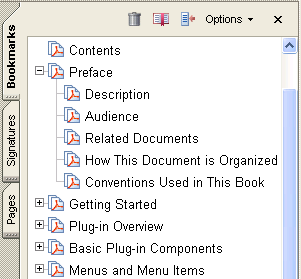
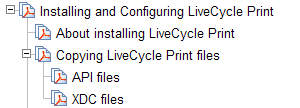

******************************************************
Working with Bookmarks
******************************************************

You can use the core API to create new bookmarks and search for existing ones. A bookmark is a link with representative text on the Bookmarks tab in the navigation pane. Each bookmark navigates to a different view or page within a PDF document. You can also use a bookmark to navigate to a specific destination within a PDF document, to another document (PDF or other), or to a web page. Bookmarks can also perform actions, such as executing a menu item or displaying a graphic file.

About bookmarks
===============

Bookmarks are represented by a ``PDBookmark`` object. All bookmarks have the following attributes:

-  A title that appears in Adobe Reader or Acrobat.
-  An action that specifies what happens when a user clicks on the bookmark. The typical action for a bookmark is to move to another location in the current document, although other actions can be specified.

Every document has a root bookmark. The root bookmark does not represent a physical bookmark that appears in Adobe Reader or Acrobat, but is the root from which all bookmarks in the tree are descended. Bookmarks are organized in a tree structure in which each bookmark has zero or more children that appear indented, and zero or more siblings that appear at the same indentation level. All bookmarks except the bookmark at the top level of the hierarchy have a parent, the bookmark under which it is indented. A bookmark is open if its children are visible on screen, and closed if they are not.

The following image shows how bookmarks appear in Adobe Reader or Acrobat.

The Acrobat core API contains methods that operate on bookmarks. Using these methods, you can perform the following tasks:

-  Create new bookmarks
-  Get and set various attributes of a bookmark (such as its title or action or whether it is open)
-  Search for a bookmark

Creating bookmarks
==================

Before you can create a bookmark, you must create a ``PDDoc`` object that represents the PDF document to which the bookmark is added. (See `Creating a PDDoc object <Plugins_Documents.html#50618416_97094>`__.)

To create bookmarks for a PDF document, perform the following tasks:

#. Get the root of the PDF document's bookmark tree by invoking the ``PDDocGetBookmarkRoot`` method. This method requires a ``PDDoc`` object and returns a ``PDBookmark`` object that represents the document's root bookmark. The document's root bookmark does not appear in Adobe Reader or Acrobat.
#. Create another ``PDBookmark`` object that represents the bookmark to add to the document's root bookmark by invoking the ``PDBookmarkAddNewChild`` method. This method requires a ``PDBookmark`` object that represents the parent bookmark (in this case the parent bookmark is also the document's root bookmark) and an ``ASAtom`` object that represents the bookmark's title.
#. Create a ``PDBookmark`` object that represents a sibling bookmark to the bookmark that was added to the document's root bookmark (the sibling bookmark is also a child of the document's root bookmark). You can perform this task by invoking the ``PDBookmarkAddNewSibling`` method. This method requires a ``PDBookmark`` object that represents the new bookmark's sibling bookmark and an ``ASAtom`` object that represents the bookmark's title.

The following code example adds two new bookmarks to a PDF document. After each bookmark is created, the ``PDBookmarkIsValid`` method is invoked to determine whether the bookmark is valid. The name of the ``PDDoc`` object used in this code example is ``myPDDoc``. (See `Creating a PDDoc object <Plugins_Documents.html#50618416_97094>`__.)

:: 

   //Declare a bookmark object
   PDBookmark rootBookmark;
   PDBookmark childBookmark ; 
   PDBookmark siblingBookmark; 
   

   //Get the root bookmark
   rootBookmark = PDDocGetBookmarkRoot(myPDDoc);
   
   if (PDBookmarkIsValid(rootBookmark)){
   

   //Add a child bookmark to the root bookmark
    childBookmark = PDBookmarkAddNewChild(rootBookmark, "Bookmark1");
     
     if (PDBookmarkIsValid(childBookmark)){
   

   //Add a sibling bookmark to the child bookmark
        siblingBookmark = PDBookmarkAddNewSibling(childBookmark, "Bookmark2"); 
     }
   }

Defining bookmark actions
-------------------------

After you create a new bookmark, you must define an action that occurs when a user clicks on the bookmark. Otherwise, nothing occurs when a user clicks on the bookmark.

To create an action for a bookmark, you must create a ``PDAction`` object that represents the action that occurs when a user clicks on a bookmark. Once you create a ``PDAction`` object, you can assign it to a bookmark. (See `Assigning an action to a bookmark <Plugins_Bookmark.html#50618419_70965>`__.)

As specified earlier in this chapter, a typical bookmark action is to move to another location in the current document. To illustrate how to create a bookmark action, this section defines a bookmark action that displays a specific page in a PDF document when a user clicks the bookmark.

To define a bookmark action that generates a specific view of a PDF document, you create a ``PDAction`` object by invoking the ``PDActionNewFromDest`` method. This method creates a new action that directs the user to the specified destination view and requires the following arguments:

-  A ``PDDoc`` that represents the PDF document for which the action is created.
-  A ``PDViewDestination`` object that represents a specific view in the PDF document. (See `Creating a PDViewDestination object <Plugins_Bookmark.html#50618419_74543>`__.)
-  A ``PDDoc`` that represents the destination document. This object is the same object that is specified as the first parameter.

The ``PDActionNewFromDest`` method returns a ``PDAction`` method.

Creating a PDViewDestination object
~~~~~~~~~~~~~~~~~~~~~~~~~~~~~~~~~~~

You must create a ``PDViewDestination`` object in order to invoke the ``PDActionNewFromDest`` method. To create a ``PDViewDestination`` object, invoke the ``AVPageViewToViewDest`` method and pass the following arguments:

-  An ``AVPageView`` object that represents the page view from which the destination is created. For information about creating this object, see `Creating a AVPageView object <Plugins_Bookmark.html#50618419_24473>`__.
-  An ``ASAtom`` object that specifies the fit type of the view destination (see the table that follows this list).
-  A ``PDDoc`` object that represents the PDF document for which the view is established.

The ``AVPageViewToViewDest`` method returns a ``PDViewDestination`` object. The following table specifies the fit type values that you pass to the ``AVPageViewToViewDest`` method as the second argument.

 

+-----------------------------------+-------------------------------------------------------------------------------------------------------------------------------------------------------------------------+
| Value                             | Description                                                                                                                                                             |
+===================================+=========================================================================================================================================================================+
|                                   | Destination specified as upper-left corner point and a zoom factor.                                                                                                     |
|                                   |                                                                                                                                                                         |
|    XYZ                            |                                                                                                                                                                         |
+-----------------------------------+-------------------------------------------------------------------------------------------------------------------------------------------------------------------------+
|                                   | Fits the page into the window, corresponding to the Acrobat viewer's Fit Page menu item.                                                                                |
|                                   |                                                                                                                                                                         |
|    Fit                            |                                                                                                                                                                         |
+-----------------------------------+-------------------------------------------------------------------------------------------------------------------------------------------------------------------------+
|                                   | Fits the width of the page into the window, corresponding to the Acrobat viewer's Fit Width menu item.                                                                  |
|                                   |                                                                                                                                                                         |
|    FitH                           |                                                                                                                                                                         |
+-----------------------------------+-------------------------------------------------------------------------------------------------------------------------------------------------------------------------+
|                                   | Fits the height of the page into a window.                                                                                                                              |
|                                   |                                                                                                                                                                         |
|    FitV                           |                                                                                                                                                                         |
+-----------------------------------+-------------------------------------------------------------------------------------------------------------------------------------------------------------------------+
|                                   | Fits the rectangle specified by its upper-left and lower-right corner points into the window.                                                                           |
|                                   |                                                                                                                                                                         |
|    FitR                           |                                                                                                                                                                         |
+-----------------------------------+-------------------------------------------------------------------------------------------------------------------------------------------------------------------------+
|                                   | Fits the rectangle containing all visible elements on the page (known as the bounding box) into the window (corresponds to the Acrobat viewer's Fit Visible menu item). |
|                                   |                                                                                                                                                                         |
|    FitB                           |                                                                                                                                                                         |
+-----------------------------------+-------------------------------------------------------------------------------------------------------------------------------------------------------------------------+
|                                   | Fits the width of the bounding box into the window.                                                                                                                     |
|                                   |                                                                                                                                                                         |
|    FitBH                          |                                                                                                                                                                         |
+-----------------------------------+-------------------------------------------------------------------------------------------------------------------------------------------------------------------------+
|                                   | Fits the height of the bounding box into the window.                                                                                                                    |
|                                   |                                                                                                                                                                         |
|    FitBV                          |                                                                                                                                                                         |
+-----------------------------------+-------------------------------------------------------------------------------------------------------------------------------------------------------------------------+

Creating a AVPageView object
~~~~~~~~~~~~~~~~~~~~~~~~~~~~

You must create an ``AVPageView`` object that represents the page view in order to invoke the ``AVPageViewToViewDest`` method. You can create an ``AVPageView`` object by invoking the ``AVDocGetPageView`` method. This method requires an ``AVDoc`` that represents a PDF document whose page view is obtained and returns an ``AVPageView`` object.

You can create an ``AVDoc`` object that is based on the ``PDDoc`` object that already exists by invoking the ``AVDocFromPDDo`` c method and passing the ``PDDoc`` object. You can invoke this method as an argument for the ``AVDocGetPageView`` method.

::

    AVPageView myPageView = AVDocGetPageView(AVDocFromPDDoc(myPDDoc));

Once you create an ``AVPageView`` object, you can specify a specific PDF document page number by invoking the ``AVPageViewGoTo`` method and passing the ``AVPageView`` object and an ``ASInt32`` object that represents the page number:

::

    ASInt32 pNum = 2; 
     AVPageViewGoTo(myPageView,pNum);

Assigning an action to a bookmark
~~~~~~~~~~~~~~~~~~~~~~~~~~~~~~~~~

After you create both an ``AVPageView`` object and an ``PDViewDestination`` object, you can create a ``PDAction`` object and assign it to a specific bookmark by invoking the ``PDBookmarkSetAction`` method and passing the ``PDBookmark`` object and the ``PDAction`` object as arguments.

The following code example creates a ``PDAction`` object and assigns it to a bookmark that is represented by a ``PDBookmark`` object named ``childBookmark``.

::

   //Create a PDDoc object based on the current PDF document
   AVDoc avDoc = AVAppGetActiveDoc();
   AVPageView pageView = AVDocGetPageView(avDoc);
   PDPageNumber pageNum = AVPageViewGetPageNum(pageView);
   PDDoc myPDDoc = AVDocGetPDDoc(avDoc);
   

   //Create a AVPageView object that represents the page view of a document
   AVPageView myPageView = AVDocGetPageView(AVDocFromPDDoc(myPDDoc)); 
   

   //Set the page view to the second page
   ASInt32 pNum = 2;
   AVPageViewGoTo(myPageView,pNum);
   

   //Create an PDViewDestination object that is used to create a PDAction object
   PDViewDestination pdvDes = AVPageViewToViewDest(myPageView,ASAtomFromString("Fit"),myPDDoc);
   

   //Create a PDAction object
   PDAction myAction = PDActionNewFromDest(myPDDoc,pdvDes,myPDDoc);
   

   //Attach an action to the bookmark
   PDBookmarkSetAction(childBookmark,myAction); 

.. caution::

   When running this code example, you must have the PDF document on which the ``PDDoc`` object is based open. Otherwise, a run-time error occurs. Also, you must create a ``PDBookmark`` object named ``childBookmark``. (See `Creating bookmarks <Plugins_Bookmark.html#50618419_40935>`__.)

Removing bookmark actions
-------------------------

You can remove an action from a bookmark by invoking the ``PDBookmarkRemoveAction`` method. After you remove a bookmark, you can add a new action. The ``PDBookmarkRemoveAction`` method requires a ``PDBookmark`` object that represents the bookmark from which the action is removed.

Opening and closing bookmarks
-----------------------------

You can programmatically open and close a bookmark. To open and close a bookmark, invoke the ``PDBookmarkSetOpen`` method and pass the following arguments:

-  A ``PDBookmark`` object to open or close.
-  An ``ASBool`` value that specifies whether to open or close the bookmark. The value ``true`` specifies to open the bookmark and the value ``false`` specifies to close the bookmark.

Before you invoke the ``PDBookmarkSetOpen`` method, it is recommended that you invoke the ``PDBookmarkIsOpen`` method to determine whether the bookmark is open. This method requires a ``PDBookmark`` object and returns an ``ASBool`` value. If the bookmark is open, then ``true`` is returned.

The following code example retrieves and opens a bookmark whose title is *Samples*. For information about retrieving a specific bookmark, see `Retrieving a specific bookmark <Plugins_Bookmark.html#50618419_90691>`__.

:: 

   //Retrieve a bookmark whose title is Samples
   PDBookmark rootBookmark, myBookmark;
   char* bookmarkTitle = "Samples";
   

   //Get the root bookmark
   rootBookmark = PDDocGetBookmarkRoot(myPDDoc);
   

   //Get the bookmark whose title is Samples
   myBookmark = PDBookmarkGetByTitle (rootBookmark, bookmarkTitle, strlen(bookmarkTitle), -1);
   if (PDBookmarkIsValid (myBookmark)){ 
         

   //Determine whether the bookmark is open
    if (!PDBookmarkIsOpen(myBookmark)){

   //Open the bookmark
        PDBookmarkSetOpen(myBookmark,true); 
         AVAlertNote("The bookmark was opened");
     }
   }
   else 
     AVAlertNote("The bookmark was not retrieved");

Retrieving bookmarks
====================

You can retrieve the root bookmark, retrieve a specific bookmark, or retrieve all bookmarks that are located within a PDF document.

Retrieving the root bookmark
----------------------------

Every PDF document has a root bookmark. The root bookmark does not represent a physical bookmark, but is the root from which all bookmarks in the tree are descended.

The following code example shows how to get a PDF document's root bookmark by creating application logic within a user-defined function named ``GetFirstBookmark``. First, the ``PDDocGetBookmarkRoot`` method is invoked to get the bookmark root. This method requires a ``PDDoc`` object that represents the PDF document from which the root bookmark is retrieved and returns a ``PDBookmark`` object that represents the root bookmark. (See `Creating a PDDoc object <Plugins_Documents.html#50618416_97094>`__.)

Next, the ``PDBookmarkGetFirstChild`` method is invoked to get the first child of the root. If there are no bookmarks, ``PDBookmarkGetFirstChild`` returns ``NULL``.

::

   PDBookmark GetFirstBookmark(PDDoc doc)
   {
     PDBookmark theroot, childBookmark;
     theroot = PDDocGetBookmarkRoot(doc);
     childBookmark = PDBookmarkGetFirstChild(theroot);
     return childBookmark;
   }

Retrieving a specific bookmark
------------------------------

You can retrieve a specific bookmark by specifying its title. The following code example retrieves a specific bookmark by invoking the ``PDDocGetBookmarkRoot`` method to get the document's root bookmark as a starting point for the search. It then invokes the ``PDBookmarkGetByTitle`` method to retrieve the first bookmark whose title matches the specified title. This method requires the following arguments:

-  The root of the bookmark tree that is searched.
-  A character pointer that specifies the title of the bookmark.
-  An ``ASInt32`` object that specifies the length of the character pointer.
-  An ``ASInt32`` object that specifies the number of bookmark levels to search. The value ``-1`` specifies to search the entire sub-tree. The value ``1`` specifies to search only child bookmarks of the current bookmark. The value ``0`` specifies to look at the current bookmark.
-  Retrieving a specific bookmark

:: 

   //Retrieve a bookmark whose title is Samples
   PDBookmark rootBookmark, myBookmark;
   char* bookmarkTitle = "Samples";
   

   //Get the root bookmark
   rootBookmark = PDDocGetBookmarkRoot(myPDDoc);
   

   //Retrieve a specific bookmark
   myBookmark = PDBookmarkGetByTitle (rootBookmark, bookmarkTitle, strlen(bookmarkTitle), -1);
   if (PDBookmarkIsValid (myBookmark)) 
     AVAlertNote("The bookmark was retrieved");
   else 
     AVAlertNote("The bookmark was not retrieved");

.. note::

   In the previous code example, a ``PDDoc`` object named ``myPDDoc`` is passed to the ``PDDocGetBookmarkRoot`` method. For information about creating this object, see `Creating a PDDoc object <Plugins_Documents.html#50618416_97094>`__.

Retrieving all bookmarks
------------------------

You can use the Acrobat core API to retrieve all bookmarks located within a PDF document. For example, you can retrieve the title of every bookmark that is located within a PDF document.

The following code example creates a recursive user-defined function named ``VisitAllBookmarks``. First it invokes the ``PDBookmarkIsValid`` method to ensure that the bookmark that is passed is valid (the root bookmark is always valid.)

Second, this user-defined function retrieves the title of the bookmark by invoking the ``PDBookmarkGetTitle`` method. This method requires the following arguments:

-  A ``PDBookmark`` object that contains the title to retrieve.
-  A character pointer that is populated with the bookmarks title.
-  An ``ASInt32`` object that represents the size of the character pointer.

Because the size of the bookmark's title is unknown, the ``PDBookmarkGetTitle`` is invoked twice. The first time it is invoked, ``NULL`` is passed as the buffer address (second argument) and ``0`` is specified as the buffer size (third argument). The text length is returned to an ``ASInt32`` object named ``bufSize``. The ``ASmalloc`` method is invoked which allocates ``bufSize`` bytes to the character pointer.

The second time ``PDBookmarkGetTitle`` is invoked, the allocated character pointer is passed as well as the ``ASInt32`` object named ``bufSize``. The character pointer is populated with the bookmark's title. The ``AVAlertNote`` method is invoked and the character pointer is passed as an argument that results in the bookmark's title being displayed within a message box.

The ``PDBookmarkHasChildren`` method is invoked to determine whether there are any child bookmarks under the current bookmark. If there are child bookmarks, the ``PDBookmarkGetFirstChild`` method is invoked to retrieve the first child bookmark. A recursive call is made to ``VisitAllBookmarks`` (that is, the user-defined method is invoking itself) until there are no more children bookmarks. Then the ``PDBookmarkGetNext`` method is invoked to get a sibling bookmark and the process continues until there are no more bookmarks within the PDF document.

:: 

   //Recursively go through bookmark tree to visit each bookmark
   void VisitAllBookmarks (PDBookmark aBookmark)
   {
     PDBookmark treeBookmark;
     DURING
   
   //Ensure that the bookmark is valid
    if (!PDBookmarkIsValid(aBookmark))
         E_RTRN_VOID
     
   //Get the title of the bookmark
    char * bmBuf; 
     ASInt32 bufSize = PDBookmarkGetTitle(aBookmark, NULL, 0) +1;
   
   //Allocate the size of bufSize to the character pointer
    bmBuf = (char*)ASmalloc((os_size_t)bufSize);
   
   //Populate bmBuf with the bookmark's title
    PDBookmarkGetTitle(aBookmark, bmBuf, bufSize);
   

   //Display the title of the bookmark within a message box
    AVAlertNote(bmBuf);

   //Determine if the current bookmark has children bookmark
    if (PDBookmarkHasChildren (aBookmark))
     {

   //Get the first child of the bookmark
        treeBookmark = PDBookmarkGetFirstChild(aBookmark);
         while (PDBookmarkIsValid (treeBookmark))    {
         VisitAllBookmarks (treeBookmark);
         treeBookmark = PDBookmarkGetNext(treeBookmark);
         }
     }
     HANDLER
   
     END_HANDLER
   }

Deleting bookmarks
==================

You can use the Acrobat core API to delete an existing bookmark. Deleting a bookmark deletes child bookmarks; however, PDF document content is not affected. To delete a bookmark, you must invoke the ``PDBookmarkDestroy`` method and pass a ``PDBookmark`` object that represents the bookmark to delete. For example, consider the bookmark structure shown in the following diagram.

Assume, for example, that you want to delete the bookmark titled Copying Print files. Once you delete this bookmark, the API files and XDC files bookmarks are also deleted. To delete the Copying Print files bookmark, you must create a ``PDBookmark`` object that represents this bookmark and pass this object to the ``PDBookmarkDestroy`` method.

The following code example deletes a bookmark. Included in this code example is application logic that retrieves a specific bookmark. (See `Retrieving a specific bookmark <Plugins_Bookmark.html#50618419_90691>`__.)

:: 

   //Retrieve a bookmark whose title is Samples
    PDBookmark rootBookmark, myBookmark;
   char* bookmarkTitle = "Copying Print files";
   

   //Get the root bookmark
   rootBookmark = PDDocGetBookmarkRoot(myPDDoc);
   

   //Retrieve a specific bookmark
   myBookmark = PDBookmarkGetByTitle(rootBookmark, bookmarkTitle, strlen(bookmarkTitle), -1);
   if (PDBookmarkIsValid (myBookmark)) 
     AVAlertNote("The bookmark was retrieved");
   else 
     AVAlertNote("The bookmark was not retrieved");
   

   //Delete this bookmark
   PDBookmarkDestroy(myBookmark);

.. note::

   In the previous code example, a ``PDDoc`` object named ``myPDDoc`` is passed to the ``PDDocGetBookmarkRoot`` method. For information about creating this object, see `Creating a PDDoc object <Plugins_Documents.html#50618416_97094>`__.
