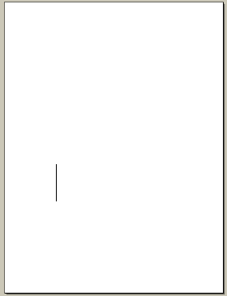
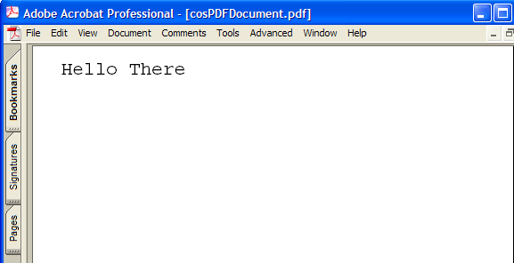

******************************************************
Working with Cos Objects
******************************************************

A PDF file is structured as a tree of low-level objects, called Cos objects. Cos objects form all PDF document components, such as bookmarks, pages, fonts, images, and annotations. The Acrobat core API contains methods (the Cos layer) that enable you to operate directly on these low-level objects. You may encounter a situation where you want to perform a task that is not supported by using AV and PD layer methods. In such a situation, it is necessary to use Cos methods.

For example, the `Creating Annotations <Plugins_Annotations.html#50618420_98126>`__ chapter explains how to set text annotations properties by using ``PDTextAnnot`` methods. Some newer types of annotations, such as 3D annotations, have properties that cannot be accessed directly by PD layer methods. As a result, you must use Cos layer methods to access the PDF dictionary that represents the annotation. (See `Creating 3D Annotations <Plugins_3D_samples.html#50618421_43763>`__.)

.. caution::

   Care is required when working with Cos objects. Unlike using AV and PD objects, Cos objects can produce invalid PDF files. Before working with Cos objects, it is strongly recommended that you be familiar with concepts such as resource dictionaries as discussed in the `PDF Reference <https://www.adobe.com/go/pdfreference>`__

About Cos objects
=================

PDF files contain various Cos object types. In addition to basic data types such as integer, fixed, and Boolean values, Cos objects also contain the following object types:

-  Array
-  Dictionary
-  Name
-  String
-  Stream

About direct and indirect objects
---------------------------------

You can create Cos objects as either direct or indirect objects; the choice is specified as a parameter to the method that creates the object. A direct object is placed directly into another object (such as an array or dictionary). Direct objects cannot be shared between two or more dictionaries or arrays. An indirect object is labeled so that it can be referenced by other objects multiple times. The following is the syntax of an indirect object.

:: 
   
     <object number> <generation number> obj
         <direct object>
     endobj

``<object number>`` ``<generation number>`` is known as an indirect object identifier. An object referencing another indirect object uses the following syntax:

:: 

   <object number> <generation number>
   R 

This reference is equivalent to the direct object represented by the indirect object.

This example shows indirect object 6, followed by a reference to it in indirect object 7.

:: 
   
       6 0 obj
           (This is a string)
       endobj

       7 0 obj
         [ 6 0 R ] %An array with one element that is indirect object 6
     endobj

If you were to retrieve the zeroth element in the array represented by object 7, you would get the Cos object that represents this string value:

:: 
   
   This is a string

On the other hand, in the following definition of indirect object 8, the elements of the array are all direct objects (the integer objects, 1, 2, and 3).

:: 
   
     8 0 obj
         [1 2 3]
     endobj

About Cos object types
----------------------

Two API objects exist in the Cos layer:

-  ``CosDoc``, which represents an entire PDF file.
-  ``CosObj``, which represents all the individual object types, such as a Cos string, described in this section. There are various methods to create the different types of Cos objects mentioned in this section, as well as getting and setting their values.

Cos strings
~~~~~~~~~~~

A string object consists of a series of bytes—unsigned integer values in the range 0 to 255. The string elements are not integer objects, but are stored in a more compact format. String objects can be written in the following ways:

-  As a sequence of literal characters enclosed in parentheses
-  As hexadecimal data enclosed in angle brackets

Literal strings
'''''''''''''''

A literal string is written as an arbitrary number of characters enclosed in parentheses. Any characters may appear in a string except unbalanced parentheses and the backslashes, which must be treated specially. Balanced pairs of parentheses within a string require no special treatment.

The following are examples of literal strings:

:: 

     (This is a string)
     (Strings may contain newlines
     and such)
     (Strings may contain balanced parentheses ( ) and
     special characters (*!&}^% and so on).)
     (The following is an empty string.)
     ()
     (It has zero (0) length.)

Within a literal string, the backslash () is used as an escape character for various purposes, such as including newline characters, nonprinting ASCII characters, unbalanced parentheses, or the backslash character itself in the string. The character immediately following the backslash determines its precise interpretation. If the character following the backslash is not one of those shown in the following table, the backslash is ignored. The following table shows valid literal string escape sequences.

=============== ==========================
Escape sequence Description
=============== ==========================
n               Line feed (LF)
r               Carriage return (CR)
t               Horizontal tab (HT)
b               Backspace (BS)
f               Form feed (FF)
(               Left parenthesis
)               Right parenthesis
\               Backslash
ddd             Character code ddd (octal)
=============== ==========================

If a string is too long to be conveniently placed on a single line, it may be split across multiple lines by using the backslash character at the end of a line to indicate that the string continues on the following line. The backslash and the end-of-line marker following it are not considered part of the string. For example, the following strings examples are equivalent:

:: 

   (These two strings are the same.)
   (These two strings are the same.)

Hexadecimal strings
~~~~~~~~~~~~~~~~~~~~

Strings may also be written in hexadecimal form, which is useful for including arbitrary binary data in a PDF file. A hexadecimal string is written as a sequence of hexadecimal digits (0–9 and either A–F or a–f) enclosed within angle brackets (< and >). Consider the following example:

:: 

   <4E6F762073686D6F7A206B6120706F702E >

Each pair of hexadecimal digits defines one byte of the string. White-space characters (such as space, tab, carriage return, line feed, and form feed) are ignored. If the final digit of a hexadecimal string is missing, that is, if there is an odd number of digits, the final digit is assumed to be 0. Consider the following example:

:: 

   <901FA3>

This is a 3-byte string consisting of the characters whose hexadecimal codes are 90, 1F, and A3, but ``<901FA>`` is a 3-byte string containing the characters whose hexadecimal codes are 90, 1F, and A0.

Cos arrays
~~~~~~~~~~

Arrays are one-dimensional collections of objects accessed by a numeric index. Array indexes are zero-based and may be any combination of the Cos data types. The following array has seven elements: three integers, a string, a Boolean value, a dictionary (containing one key-value pair), and an indirect object reference.

:: 
   
   [ 1 2 3 (This is a string) true << /Key (The value) >> 6 0 R ]

Cos names
~~~~~~~~~

A name object is an atomic symbol uniquely defined by a sequence of characters. Uniquely defined means that any two name objects made up of the same sequence of characters are identically the same object. Atomic means that a name has no internal structure; although it is defined by a sequence of characters, those characters are not considered elements of the name.

:: 
   
   /AName

A slash character (/) introduces a name. The slash is not part of the name but is a prefix indicating that the following sequence of characters constitutes a name. There can be no white-space characters between the slash and the first character in the name. The name may include any regular characters, but not delimiter or white-space characters. Uppercase and lowercase letters are considered distinct: /A and /a are different names. The following examples are valid literal names:

:: 

   /Name1
     /ASomewhatLongerName
     /A;Name_With-Various***Characters?
     /1.2
     /$$
     /@pattern
     /.notdef

Beginning with PDF 1.2, any character except null (character code 0) may be included in a name by writing its 2-digit hexadecimal code, preceded by the number sign character (#). This syntax is required to represent any of the delimiter or white-space characters or the number sign character itself; it is recommended but not required for characters whose codes are outside the range 33 (!) to 126 (~). The examples shown in the following table are valid literal names in PDF 1.2 and later.

.. _section-1:

======================== ===================
Literal name             Result
======================== ===================
/Adobe#20Green           Adobe Green
/PANTONE#205757#20CV     PANTONE 5757 CV
/paired#28#29parentheses paired()parentheses
/The_Key_of_F#23_Minor   The_Key_of_F#_Minor
/A#42                    AB
======================== ===================

The length of a name is subject to an implementation limit. The limit applies to the number of characters in the name's internal representation. For example, the name /A#20B has four characters (/, A, space, B), not six.

Name objects are treated as atomic symbols within a PDF file. Ordinarily, the bytes making up the name are never treated as text to be presented to a user. However, occasionally the need arises to treat a name object as text, such as one that represents a font name.

In such situations, it is recommended that the sequence of bytes (after expansion of # sequences, if any) be interpreted according to UTF-8, a variable-length byte-encoded representation of Unicode in which the printable ASCII characters have the same representations as in ASCII. This enables a name object to represent text in any natural language, subject to the implementation limit on the length of a name.

Cos dictionaries
~~~~~~~~~~~~~~~~

A dictionary object is an associative table containing pairs of objects, known as the dictionary's entries. The first element of each entry is the key and the second element is the value. The key must be a name. The value can be any kind of object, including other dictionaries and streams. A dictionary entry whose value is null is equivalent to an absent entry.

A dictionary is a table data structure whose elements are object pairs:

-  The first element is the key, which is always a name object, a sequence of characters beginning with the forward slash (/) character. No two entries in the same dictionary should have the same key. If a key does appear more than once, its value is undefined.
-  The second element is the Cos object representing the value. You can add new key-value pairs, modify existing key-value pairs, or delete existing key-value pairs in a dictionary.

The following is an example of a dictionary:

:: 

   << /Name John /Age 27 /AnArray [1 2 3]>>

The value associated with the ``Name`` key is the value ``John``. The value for the ``Age`` key is ``27``. And the value for the ``AnArray`` key is an array with the values ``1``, ``2``, and ``3``. For information about creating a Cos dictionary, see `Creating Cos dictionaries <Plugins_Cos.html#50618418_10844>`__.

Cos streams
~~~~~~~~~~~

A stream is a sequence of bytes that can be read a portion at a time. For this reason, objects with potentially large amounts of data, such as images and page descriptions, are represented as streams. A stream consists of a dictionary followed by zero or more bytes bracketed between the keywords ``stream`` and ``endstream``. The following example shows the basic syntax of a stream:

:: 
   
     dictionary
     stream
         …Zero or more bytes…
     endstream

The ``stream`` keyword should be followed by an end-of-line marker consisting of either a carriage return and a line feed or just a line feed, and not by a carriage return alone. The sequence of bytes that make up a stream is located between the ``stream`` and ``endstream`` keywords. Streams must be indirect objects and the stream dictionary must be a direct object. (See `About direct and indirect objects <Plugins_Cos.html#50618418_86862>`__.)

.. note::

   For more information about streams, see the `PDF Reference <https://www.adobe.com/go/pdfreference>`__.

Working with Cos strings
========================

This section discusses ways in which you can work with Cos strings. (See `Cos strings <Plugins_Cos.html#50618418_36150>`__.)

Creating Cos strings
--------------------

You can use the Acrobat core API to create a ``CosObj`` object that is based on a Cos string.

To create a Cos string:

#. Create a ``CosDoc`` object that represents a PDF file by invoking the ``PDDocGetCosDoc`` method and passing a ``PDDoc`` object.
#. Create a ``CosObj`` object that is based on a Cos string by invoking the ``CosNewString`` method and passing the following arguments:

   -  A ``CosDoc`` object.
   -  An ``ASBool`` object that specifies whether the ``CosObj`` object is an indirect or direct object. If ``true``, the string is an indirect object. If ``false``, the string is a direct object. (See `About direct and indirect objects <Plugins_Cos.html#50618418_86862>`__.)
   -  A character pointer that specifies the string. Cos strings can contain NULL characters.
   -  The length of the character pointer.

The following code example creates a ``CosObj`` that is based on a Cos string. A ``PDDoc`` object named ``myPDDoc`` is passed to the ``PDDocGetCosDoc`` method. (See `Creating a PDDoc object <Plugins_Documents.html#50618416_97094>`__.)

:: 
   
   //Create a new Cos string
   char* mystr = "New String";
   CosDoc cd = PDDocGetCosDoc(myPDDoc);
   CosObj strObj = CosNewString(cd, false, mystr, strlen(mystr));

Retrieving the string value
---------------------------

You can retrieve the string value from a ``CosObj`` that is based on a Cos string. To retrieve the string value, invoke the ``CosStringValue`` method and pass the following arguments:

-  A ``CosObj`` that is based on a Cos string.
-  The address of an ``ASTCount`` object that is used to store the string length.

An exception is thrown if the ``CosObj`` object that is passed to the ``CosStringValue`` method is not based on a Cos string. The following code example expands the previous code example by retrieving the string value by invoking the ``PDDocGetCosDoc`` method.

:: 
   
   //Create a new Cos string
   char* mystr = "New String";
   CosDoc cd = PDDocGetCosDoc (myPDDoc);
   CosObj strObj = CosNewString(cd,false,mystr,strlen(mystr));
   

   //Retrieve the string value
   char* strValue;
   ASTCount length;
   strValue = CosStringValue(strObj, &length);
   

   //Display the string value
   AVAlertNote(strValue);

Working with Cos arrays
=======================

This section discusses ways in which you can work with ``Cos`` arrays.

Creating Cos arrays
-------------------

You can use the Acrobat core API to create a ``CosObj`` object that is based on a ``Cos`` array. You specify the number of elements that the ``Cos`` array stores when you create it. However, you can add elements dynamically as needed. For example, assume that you create a ``Cos`` array that stores three elements. If required, you can add a fourth element. An exception is thrown if the ``CosObj`` object that is added to the ``Cos`` array is a direct object that is already located in another ``Cos`` collection object.

#. To create a Cos array:
#. Create a ``CosDoc`` object that represents a PDF file by invoking the ``PDDocGetCosDoc`` method and passing a ``PDDoc`` object.
#. Create a ``CosObj`` object that is based on a ``Cos`` array by invoking the ``CosNewArray`` method and passing the following arguments:

   -  A ``CosDoc`` object.
   -  An ``ASBool`` object that specifies whether the ``CosObj`` object is an indirect or direct object. If ``true``, the string is an indirect object. If ``false``, the string is a direct object. (See `About direct and indirect objects <Plugins_Cos.html#50618418_86862>`__.)
   -  An ``ASTArraySize`` object that specifies the number of elements.

4. Create a ``CosObj`` object that stores a value to add to the ``Cos`` array. For example, to create a ``CosObj`` object that is based on an integer value, invoke the ``CosNewInteger`` method and pass the following arguments:

   -  A ``CosDoc`` object.
   -  An ``ASBool`` object that specifies whether the ``CosObj`` object is an indirect or direct object. If ``true``, the string is an indirect object. If ``false``, the string is a direct object. (See `About direct and indirect objects <Plugins_Cos.html#50618418_86862>`__.)
   -  An ``ASInt32`` value that specifies the integer value.

5. Add the value to the ``Cos`` array by invoking the ``CosArrayPut`` method and passing the following arguments:

   -  A ``CosObj`` object that represents a ``Cos`` array.
   -  An ``ASTArraySize`` object that specifies a 0-based index value.
   -  A ``CosObj`` object that stores the value to add to the array.

The following code example creates a ``Cos`` array and adds the values ``1``, ``2``, ``3``, ``4``, and ``5`` to it. A ``PDDoc`` object named ``myPDDoc`` is passed to the ``PDDocGetCosDoc`` method. (See `Creating a PDDoc object <Plugins_Documents.html#50618416_97094>`__.)

:: 
   
   //Create a new Cos array
   CosObj ArrayObj, IntObj;
   CosDoc cd = PDDocGetCosDoc(myPDDoc);
   ArrayObj = CosNewArray (cd, false, 5); 
   
   for (int i=1; i<=5; i++)
   {

   //Create a new CosObj representing the integer value
   IntObj = CosNewInteger (cd, false, i);
     

   //Store the integer object in the array
   CosArrayPut (ArrayObj, i-1, IntObj);
   }

Retrieving Cos array values
---------------------------

You can use the Acrobat core API to retrieve values from a ``CosObj`` object that is based on a ``Cos`` array.

To retrieve values from a Cos array:

#. Determine the number of elements by invoking the ``CosArrayLength`` method. Pass the ``CosObj`` object that represents the ``Cos`` array as an argument.
#. Get the ``CosObj`` object that represents an array element by invoking the ``CosArrayGet`` method and passing the following arguments:

   -  The ``CosObj`` object that represents the ``Cos`` array
   -  An ``ASTArraySize`` object that represents the index of the array element to retrieve

The ``CosArrayGet`` method returns a ``CosObj`` object that represents the element

#. Get the element value. However, you must invoke the method that corresponds to the ``CosObj`` object's data type. If, for example, the ``Cos`` array stores integer values, invoke the ``CosIntegerValue`` method to obtain the element's integer value. Pass the ``CosObj`` object that represents the element. This method returns the corresponding value. If the ``CosIntegerValue`` method is invoked, then an ``ASInt32`` value is returned.

The following code illustrates a user-defined function named ``GetArrayValues`` that retrieves the value of each element and displays it in an alert box. Notice that a ``CosObj`` that represents a ``Cos`` array is passed to the ``GetArrayValues`` as its only parameter.

:: 
   
   void GetArrayValues(CosObj array)
   {
     CosObj IntObj;
     ASInt32 value, i, NumElements;
     char buf[256]; 
   

   //Determine the number of elements in the array
   NumElements = CosArrayLength(array);
   

   //Iterate through the array
   for (i=0; i < NumElements; i++)
     {

   //Retrieve a specific element
   IntObj = CosArrayGet(array, i);
   

   //Convert the CosObj to its ASInt32 value
   value = CosIntegerValue (IntObj);
   

   //Display the value
   sprintf(buf, "The element value is %d",value); 
     AVAlertNote(buf);
     }
   }

Working with Cos dictionaries
=============================

This section discusses ways in which you can work with Cos dictionaries. (See `Cos dictionaries <Plugins_Cos.html#50618418_50984>`__.)

Creating Cos dictionaries
-------------------------

You can create a ``CosObj`` object that is based on a Cos dictionary. Both the key and its value are ``CosObj`` objects that you create and add to the Cos dictionary, which is also a ``CosObj`` object.

To create a Cos dictionary:

#. Create a ``CosDoc`` object that represents a PDF file by invoking the ``PDDocGetCosDoc`` method and passing a ``PDDoc`` object.
#. Create a ``CosObj`` object that represents the dictionary by invoking the ``CosNewDict`` method and passing the following arguments:

   -  A ``CosDoc`` object.
   -  An ``ASBool`` object that specifies whether the ``CosObj`` object is an indirect or direct object. If ``true``, the string is an indirect object. If ``false``, the string is a direct object. (See `About Cos objects <Plugins_Cos.html#50618418_16671>`__.)
   -  An ``ASTArraySize`` object that specifies the number of dictionary entries (the number of key and value pairs).

The ``CosNewDict`` method returns a ``CosObj`` object that represents the new Cos dictionary.

3. Create a ``CosObj`` object that represents a dictionary value. You must invoke a method that corresponds to the value's data type. For example, to add an integer value, invoke the ``CosNewInteger`` method and pass the following arguments:

   -  A ``CosDoc`` object.
   -  An ``ASBool`` object that specifies whether the ``CosObj`` object is an indirect or direct object. If ``true``, the string is an indirect object. If ``false``, the string is a direct object. (See `About direct and indirect objects <Plugins_Cos.html#50618418_86862>`__.)
   -  An ``ASInt32`` value that specifies the integer value.

4. Place the ``CosObj`` object that represents a dictionary value into the dictionary by invoking the ``CosDictPut`` method and passing the following arguments:

   -  A ``CosObj`` that represents the dictionary
   -  An ``ASAtom`` object that specifies the key name
   -  A ``CosObj`` object that specifies the dictionary value

5. Repeat steps 3 and 4 for each dictionary entry that you want to add.

The following code example creates a Cos dictionary with the following entries: ``/Key1 1 /Key2``. A ``PDDoc`` object named ``myPDDoc`` is passed to the ``PDDocGetCosDoc`` method. (See `Creating a PDDoc object <Plugins_Documents.html#50618416_97094>`__.)

:: 
   
   //Create a Cos dictionary
   CosObj Dict, IntObj;
   CosDoc cd;
   

   //Get the CosDoc
   cd = PDDocGetCosDoc(myPDDoc);
   

   //Make a new dictionary with two entries
   Dict = CosNewDict (cd, false, 2);
   IntObj = CosNewInteger (cd, false, 1);
   

   //Place the key value pair of /Key1 1 into the dictionary
   CosDictPut (Dict, ASAtomFromString ("Key1"), IntObj);
   IntObj = CosNewInteger (cd, false, 2);
   

   //Place the key value pair of /Key2 2 into the dictionary
   CosDictPut (Dict, ASAtomFromString ("Key2"), IntObj);

Retrieving values from a Cos dictionary
---------------------------------------

You can retrieve a dictionary element value by performing the following steps:

#. Get a dictionary key value by invoking the ``CosDictGet`` method and passing the following arguments:

   -  A ``CosObj`` object that represents the dictionary.
   -  An ``ASAtom`` object that represents the key name.

The ``CosDictGet`` method returns a ``CosObj`` object that represents the dictionary value.

2. Get the element value. However, you must invoke the method that corresponds to the ``CosObj`` object's data type. If, for example, the ``Cos`` array stores integer values, invoke the ``CosIntegerValue`` method to obtain the dictionary entry value. Pass the ``CosObj`` object that represents the dictionary entry. This method returns the corresponding value. If the ``CosIntegerValue`` method is invoked, then an ``ASInt32`` value is returned.

The following code example retrieves the value of a dictionary element whose key is named Key1. The element value is displayed within an alert box.

:: 
   
   //Retrieve the value from the dictionary entry whose key is named Key1
   CosObj dictEntry;
   ASInt32 dicValue;
   char buf[256] ; 
   

   //Get the element whose key is named Key1
   dictEntry = CosDictGet(Dict, ASAtomFromString("Key1"));
   dicValue = CosIntegerValue(dictEntry);
   

   //Display the value of the dictionary element
   sprintf(buf,"The value of the dictionary element is %d",dicValue); 
   AVAlertNote(buf);

.. note::

   The ``Dict`` object is a ``CosObj`` that represents the dictionary. (See `Creating Cos dictionaries <Plugins_Cos.html#50618418_10844>`__.)

Querying a Cos dictionary for a key
-----------------------------------

You can use the Acrobat core API to determine whether a specific key-value pair exists. To perform this task, invoke the ``CosDictKnown`` method and pass the following arguments:

-  A ``CosObj`` object that represents the dictionary.
-  An ``ASAtom`` object that represents the key name.

This method returns an ``ASBool`` value that specifies whether the key-value pair exists. If this method returns ``true``, then the key-value pair exists. The following code example queries a dictionary to determine whether a key named ``Key1`` exists.

:: 

   //Determine whether a key named Key1 exists
   ASBool keyExist = CosDictKnown(Dict, ASAtomFromString("Key1"));
   if (keyExist == true)
     AVAlertNote("The dictionary contains a key named Key1");
   else
     AVAlertNote("The dictionary does not contain a key named Key1");
     

Working with Cos names
======================

This section discusses ways in which you can work with Cos names. (See `Cos names <Plugins_Cos.html#50618418_29290>`__.)

Creating Cos names
------------------

You can use the Acrobat core API to create a ``CosObj`` object that is based on a Cos name.

To create a Cos name:

#. Create a ``CosDoc`` object that represents a PDF file by invoking the ``PDDocGetCosDoc`` method and passing a ``PDDoc`` object.
#. Create a ``CosObj`` object that represents the name by invoking the ``CosNewName`` method and passing the following arguments:

   -  A ``CosDoc`` object.
   -  An ``ASBool`` object that specifies whether the ``CosObj`` object is an indirect or direct object. If ``true``, the string is an indirect object. If ``false``, the string is a direct object. (See `About direct and indirect objects <Plugins_Cos.html#50618418_86862>`__.)
   -  An ``ASAtom`` object that represent the name to create.

The ``CosNewName`` method returns a ``CosObj`` object that represents the new Cos name.

The following code example creates a Cos name with the value ``Name1``. A ``PDDoc`` object named ``myPDDoc`` is passed to the ``PDDocGetCosDoc`` method. (See `Creating a PDDoc object <Plugins_Documents.html#50618416_97094>`__.)

:: 
   
   //Create a Cos name
   CosObj nameObj;
   CosDoc cd = PDDocGetCosDoc(myPDDoc);
   nameObj = CosNewName(cd, false, ASAtomFromString("Name1"));

Retrieving the value of a name object
-------------------------------------

You can retrieve the value of a name object by using the Acrobat core API. For example, assume that you retrieve the value from the Cos name object created in the previous code example. In this situation, the value that is retrieved is ``Name1``.

To retrieve the value from a Cos name object:

#. Invoke the ``CosNameValue`` method and pass the ``CosObj`` that represents the Cos name. This method returns an ``ASAtom`` object that represents the name value.
#. Invoke the ``ASAtomGetString`` method to get a constant character pointer that specifies the Cos name value. Pass the ``ASAtom`` object that is returned from the ``CosNameValue`` method.

:: 
   
   //Create a Cos name
   CosObj nameObj;
   CosDoc cd = PDDocGetCosDoc(myPDDoc);
   nameObj = CosNewName (cd, false, ASAtomFromString ("Name1"));
   

   //Get and display the value of a Cos name object
   ASAtom nameVal = CosNameValue(nameObj);
   const char * str = ASAtomGetString(nameVal);
   AVAlertNote(str); 

.. note::

   The return value of the ``ASAtomGetString`` method is a constant character pointer, not a character pointer. You will generate a compile error if you omit the ``const`` keyword.

Working with Cos streams
========================

This section discusses ways in which you can work with Cos streams. (See `Cos streams <Plugins_Cos.html#50618418_63762>`__.)

A stream is represented by an ``ASStm`` object definition. A data stream can be a buffer in memory, a file, or an arbitrary user-written procedure. When writing or extracting data streams, an ``ASStm`` object must be converted to a Cos stream.

.. note::

   Before reading this section, it is strongly recommended that you are familiar with concepts discussed earlier in this chapter, such as ``Cos`` arrays and Cos dictionaries.

Creating Cos streams
--------------------

You can create a data stream in memory and then insert the stream into a PDF document page. The following diagram shows the result of a data stream that creates a thin black line segment being inserted into a PDF document.

The following example shows the syntax of a stream that creates a thin line segment:

:: 
   
   150 250 m 150 350 l S

In contrast, the following example shows the syntax of a stream that inserts the text ``Hello`` ``There`` into a PDF document:

:: 
   
   BT /F0 1 Tf 24 0 0 24 36 756 Tm 0 Tr 0 g 0 Tc 0 Tw (Hello There) Tj ET

.. note::

   For information about stream syntax, see the `PDF Reference <https://www.adobe.com/go/pdfreference>`__.

Creating a stream dictionary
~~~~~~~~~~~~~~~~~~~~~~~~~~~~

Each Cos stream has a stream dictionary that contains a ``Length`` entry that indicates how many bytes are used for the stream's data (if the stream has a filter, the ``Length`` entry is the number of bytes of encoded data). A limit of 4096 bytes exists for the ``Length`` entry. A stream dictionary also has optional entries that are not discussed in this section. For more information about stream dictionaries, see the `PDF Reference <https://www.adobe.com/go/pdfreference>`__

In addition, most filters are defined so that the data is self-limiting; that is, they use an encoding scheme in which an explicit end-of-data (EOD) marker delimits the extent of the data. Finally, streams are used to represent many objects from whose length attributes can be inferred. All of these constraints must be consistent.

For example, an image with 10 rows and 20 columns, using a single color component and 8 bits per component, requires exactly 200 bytes of image data. If the stream uses a filter, there must be enough bytes of encoded data in the PDF file to produce those 200 bytes. An error occurs if the ``Length`` entry is too small, if an explicit EOD marker occurs too soon, or if the decoded data does not contain 200 bytes. It is also an error if the stream contains too much data, with the exception that there may be an extra end-of-line marker in the PDF file before the ``endstream`` keyword. All streams created in this section have a stream dictionary defined.

For each stream that you want to insert into a PDF document, create a stream dictionary that contains at least the ``Length`` entry, as shown in the following example:

:: 
   
   <</Length 100>>

To create a stream dictionary with the Length entry defined:

#. Create a ``CosDoc`` object that represents a PDF file by invoking the ``PDDocGetCosDoc`` method.
#. Create an ``ASUns32`` object that represents the stream length.
#. Create a ``CosObj`` object that represents the length of the stream by invoking the ``CosNewInteger`` method and passing the following arguments:

   -  A ``CosDoc`` object that you created in step 1.
   -  An ``ASBool`` object that specifies whether the ``CosObj`` object is an indirect or direct object. If ``true``, the string is an indirect object. If ``false``, the string is a direct object. (See `About direct and indirect objects <Plugins_Cos.html#50618418_86862>`__.)
   -  The ``ASUns32`` object created in step 2 that represents the stream length.

The ``CosNewInteger`` method returns a ``CosObj`` object that represents the stream length.

#. Create a ``CosObj`` object that represents the Cos dictionary. (See `Creating Cos dictionaries <Plugins_Cos.html#50618418_10844>`__.)
#. Set the stream dictionary key and value by invoking the ``CosDictPutKeyString`` method and passing the following arguments:

   -  The ``CosObj`` object that you created in step 4 that represents the dictionary.
   -  A character pointer that specifies the name of the key, which in this situation is ``Length``.
   -  The ``CosObj`` object created in step 3 that specifies the length of the stream.

The following code example creates a stream dictionary. The first part of this code example creates a ``PDPage`` object by using an ``AVDoc`` object. For information about this application logic, see `Creating a PDEContent object <Plugins_Pages.html#50618407_91421>`__.

:: 
   
   //Create a PDPage object using the current page
   AVDoc avDoc = AVAppGetActiveDoc();
   AVPageView pageView = AVDocGetPageView(avDoc);
   PDPageNumber pageNum = AVPageViewGetPageNum(pageView);
   PDDoc pdDoc = AVDocGetPDDoc(avDoc); 
   PDPage pdPage = PDDocAcquirePage(pdDoc, pageNum);
   

   //Use the PDPage object to get the CosDoc object
   CosDoc cd = PDDocGetCosDoc(PDPageGetDoc(pdPage));
   

   //Define a stream to draw a line
   char buf [500]; 
   sprintf(buf,"150 250 m 150 350 l S");
   

   //Get the stream length
   ASUns32 streamLength = (ASUns32)strlen(buf);
   

   //Create a CosObj object that represents the stream length
   CosObj LengthEntry = CosNewInteger(cd, false,streamLength);
   

   //Create a CosObj that represents a stream dictionary

   //and sets its key-value pairs
   CosObj AttrDict = CosNewDict(cd, false, 5);
   char *Length_KStr = "Length";
   CosDictPutKeyString(AttrDict, Length_KStr, LengthEntry);
   

   //Determine if the stream dictionary is valid
   if (CosObjEqual (AttrDict, CosNewNull ()) == true)
   {
     AVAlertNote ("The attributes dictionary could not be created.");
     return;
   }

.. note::

   This code example creates a ``CosObj`` object named ``AttrDict`` that represents a stream dictionary.

Inserting a Cos stream into a PDF document
~~~~~~~~~~~~~~~~~~~~~~~~~~~~~~~~~~~~~~~~~~

When inserting a stream into a PDF document, ensure that the stream is valid; otherwise, a run-time error occurs. This section explains how to create a stream that draws a thin black line segment and then inserts the stream into the current PDF page.

To insert a stream into the current PDF document page:

#. Create a ``PDPage`` object that represents the current PDF page. (See `Creating a PDEContent object <Plugins_Pages.html#50618407_91421>`__.)
#. Create a ``CosDoc`` object that represents a PDF file by invoking the ``PDDocGetCosDoc`` method.
#. Define the stream that draws a thin black line segment. You can populate a character array with a stream by invoking the ``sprintf`` method.
#. Create an ``ASUns32`` object that represents the stream length.
#. Create a ``CosObj`` object that represents the stream dictionary. (See `Creating a stream dictionary <Plugins_Cos.html#50618418_71942>`__.)
#. Read the stream into memory by invoking the ``ASMemStmRdOpen`` method and passing the following arguments:

   -  A character pointer that contains the data stream
   -  An ``ASUns32`` object that specifies the stream length

This method returns an ``ASStm`` object that represents an in-memory data stream.

#. Create a new Cos stream that is based on data located in the ``ASStm`` object by invoking the ``CosNewStream`` method and passing the following arguments:

   -  A ``CosDoc`` object that specifies the PDF document in which the Cos stream is inserted (pass the ``CosDoc`` object created in step 2).
   -  An ``ASBool`` object that specifies whether the Cos stream is an indirect object. Because all streams are indirect objects, this argument must be set to ``true``.
   -  An ``ASStm`` object that contains the stream data (pass the ``ASStm`` object created in step 6).
   -  A ``CosStreamStartAndCode`` object that specifies the byte offset from which data reading starts. You can pass ``0`` to ensure that data reading starts at the beginning of the stream.
   -  An ``ASBool`` object that specifies whether the data is encoded using filters specified in the stream dictionary before it is written to the Cos stream.
   -  A ``CosObj`` object that represents the stream dictionary (pass the ``CosObj`` object created in step 5).
   -  A ``CosObj`` object that represents the parameters that are used by the encoding filter if the source data is encoded before it is written to the file. If encoding parameters are not required, this value is ignored. For information about encoding filters, see the `PDF Reference <https://www.adobe.com/go/pdfreference>`__
   -  A ``CosByteMax`` object that specifies the amount of data read from the source. If this value is ``-1``, data is read from the source until it reaches the end of the stream.

The ``CosNewStream`` method returns a ``CosObj`` object that represents the Cos stream.

#. Replace the contents of the specified page with the Cos stream by invoking the ``PDPageAddCosContents`` method and passing the following arguments:

   -  A ``PDPage`` object that represents the current page of the PDF document (pass the ``PDPage`` object created in step 1).
   -  A ``CosObj`` object that contains the Cos stream.

The following code example creates a Cos stream and inserts it into the current page of a PDF document.

:: 
   
   //Declare local variables used in this code example
   CosDoc cd;
   CosObj PageStrm, LengthEntry, AttrDict;
   CosObj EncodeParms = CosNewNull();
   ASStm OpenedStream;
   char buf [500];
   

   //Create a PDPage object using the current page
   AVDoc avDoc = AVAppGetActiveDoc();
   AVPageView pageView = AVDocGetPageView(avDoc);
   PDPageNumber pageNum = AVPageViewGetPageNum(pageView);
   PDDoc pdDoc = AVDocGetPDDoc(avDoc);
   PDPage pdPage = PDDocAcquirePage(pdDoc, pageNum); // acquire current page
   

   //Use the PDPage object to create a CosDoc object
   cd = PDDocGetCosDoc(PDPageGetDoc(pdPage));
   

   //Define a stream that creates a thin line segment
   sprintf(buf,"150 250 m 150 350 l S");
   

   //Get the stream length
   ASUns32 streamLength = (ASUns32)strlen(buf);
   

   //Create a CosObj object that represents the stream length
   LengthEntry = CosNewInteger(cd, false,streamLength);
   

   //Create a CosObj that represents a stream dictionary

   //and set it key-value pairs
   AttrDict = CosNewDict(cd, false,5);
   char *Length_KStr = "Length";
   CosDictPutKeyString(AttrDict, Length_KStr, LengthEntry);
   

   //Determine if the stream dictionary is valid
   if (CosObjEqual (AttrDict, CosNewNull ()) == true)
   {
     AVAlertNote ("The stream dictionary could not be created");
     return;
   }

   //Read the stream into memory by invoking the ASMemStmRdOpen method
   OpenedStream = ASMemStmRdOpen(buf,streamLength);
   
   DURING
     

   //Create a new Cos stream using data from the ASStm object
   //PageStrm = CosNewStream(cd, true, OpenedStream, 0,
      false, // StmDataIsNotDecoded 
      AttrDict, //The stream dictionary
      EncodeParms, -1);
   

   //Close the stream
   ASStmClose(OpenedStream);
   
   HANDLER
   AVAlertNote ("Trying to create new CosStream");
   CosObjDestroy (AttrDict);
   ASStmClose (OpenedStream);
   return;
   END_HANDLER
   

   //Completely replace the contents of the specified page with newContents
   PDPageAddCosContents (pdPage, PageStrm);

.. caution::

   If you execute this code example without having a PDF document open, you will cause an Adobe Reader or Acrobat run-time error. The run-time error occurs because this code example creates a ``PDPage`` object that is based on the current PDF document page.

Populating a PDF with a content stream
-----------------------------------------------

This section explains how to use the Acrobat core API to create a new PDF document, insert a page into the document, and populate the page with a Cos content stream that inserts the text ``Hello`` ``There``. When inserting a content stream into a PDF document, in addition to creating a stream dictionary, you must also create a resource dictionary and a page dictionary. A resource dictionary defines attributes such as the font that a content stream uses and a page dictionary defines attributes such as the page's height and width. For information about these dictionaries, see the `PDF Reference <https://www.adobe.com/go/pdfreference>`__

The following example shows the resource dictionary that is created in this section.

:: 
   
   4 0 obj
   <<
   /Font << /F0 5 0 R >>
   /ProcSet 6 0 R
   >>
   endobj

The following example shows the font descriptor that is created in this section.

:: 
   
   5 0 obj
   <<
   /Type /Font
   /Subtype /Type1
   /Name /F0
   /BaseFont /Courier
   /Encoding /WinAnsiEncoding
   >>
   endobj

The following example shows the Procset resource created in this section.

:: 
   
   This is a procset resource.
   6 0 obj
   [
   /PDF /Text
   ]
   endobj
   

The following example shows the page dictionary that is created in this section.

:: 
   
   This is the page dictionary.
   7 0 obj
   <<
   /Type /Page
   /MediaBox [ 0 0 612 792 ]
   /Parent 2 0 R
   /Resources 4 0 R
   /Contents 8 0 R
   >>
   endobj

The following diagram shows the PDF document that is created in this section.

To create a PDF document and populate it with a Cos content stream:

#. Define the media box rectangle used in the PDF document's page.

:: 
   
   //ASFixedRect MedBox;
     MedBox.left = ASInt32ToFixed (0);
     MedBox.top = ASInt32ToFixed (792);
     MedBox.right = ASInt32ToFixed (612);
     MedBox.bottom = ASInt32ToFixed (0);

2. Define the stream that is written to the PDF document page, as shown in the following example.

:: 
   
   char* StreamBuf = (char*)"BT /F0 1 Tf 24 0 0 24 36 756 Tm 0 Tr 0 g 0 Tc 0 Tw 
     (Hello There) Tj ET";

3. Create a ``PDDoc`` object that represents the new document by invoking the ``PDDocCreate`` method. After the document is created, at least one page must be added before Acrobat or Adobe Reader can display the document.

:: 
   
   PDDoc NewDoc = PDDocCreate ();

4. Create a ``PDPage`` object that represents the page by invoking the ``PDDocCreatePage`` method and passing the following arguments:

   -  The ``PDDoc`` object that you created.
   -  The ``PDBeforeFirstPage`` enum value that specifies where to place the page.
   -  The ``ASFixedRect`` object that defines the media box rectangle.

This method returns a ``PDPage`` object that represents the new page.

5. Create a ``CosObj`` object that represents a resource dictionary. In the following code example, a resource dictionary is created in a user-defined function named ``SetResourceForPage``.
#. Set the page's resource key. In the following code example, the page's resource's key is set in a user-defined function named ``CreateResourceDicts``.
#. Add a Cos stream to the page. In the following code example, a Cos stream is added to the page in a user-defined function named ``AddStreamToPage``.
#. Open the PDF document in Adobe Reader or Acrobat. In the following code example, this task occurs in the user-defined function named ``MakeTheFile``.
#. Save the PDF document. In the following code example, this task occurs in the user-defined function named ``MakeTheFile``.

The following code example represents an entire C source file that creates a PDF document and populates it with a Cos content stream. This source file is made up by various user-defined functions. To make it easier to view these functions, all function signatures are bolded. The entry point to this source file is the ``MakeTheFile`` function. You can invoke the ``MakeTheFile`` function from a menu item or toolbar button to execute this code example.

:: 
   
   #include "ascalls.h"
   #include "avcalls.h"
   #include "avcalls.h"
   #include "coscalls.h"
   #include "pdcalls.h"
   #include "ascalls.h"
   #include "corcalls.h"
   #include "dos.h"
   #include <io.h>
   #include <stdlib.h>
   #include <stdio.h>
   #include <string.h>
   
   //Declare global variables
   CosObj PageStrm; /* To hold the newly created Cos stream */
   CosObj AttrDict; /* As returned by CreateAttribsDict */
   CosObj EncodeDict;

   //Used to specify what filters are used to encode the stream if used for output.
   CosObj ResDict; /* Resource dictionary for the page */
   CosObj FontDictObj;
   CosObj FontDict;
   CosObj procArray;
   
   //Set the page's resource key. Return true if everything is valid, else false.

   ASBool SetResourceForPage (PDPage page)
    
   {
   CosObj PageCosObj;
   
   //Make sure that the page is valid
   if (!page)
     return false;
   
   DURING

   //Get a CosDoc object by using the PDPage page passed to this object
   PageCosObj = PDPageGetCosObj(page);
   
     if (CosDictKnown (PageCosObj, ASAtomFromString ("Resources") == true))
         CosObjDestroy (CosDictGet (PageCosObj, ASAtomFromString ("Resources")));
   

   //Place the ResDict object into the page's Resource Dictionary
   CosDictPut (PageCosObj, ASAtomFromString ("Resources"), ResDict);
   HANDLER
     return false;
   END_HANDLER
   return true;
   } /* end of SetResourceForPage*/
   
   //Create the font's resources. Return true if all is valid, else false.
   //Creates the required font and proc set dictionaries; then creates the global resource dictionary for the PDF page
   ASBool CreateResourceDicts (CosDoc cd)
    
   {
   DURING
     ResDict = CosNewDict (cd, true, 10);
   
   HANDLER
     AVAlertNote("Trying to create the resource dictionary.");
     return false;
     END_HANDLER
   
   DURING
     FontDictObj = CosNewDict (cd, true, 5);
   
   HANDLER
     AVAlertNote ("Trying to create the font's dictionary.");
     CosObjDestroy (ResDict);
     return false;
   END_HANDLER
   

   /* Create this font descriptor dictionary.

      <<
      /Type /Font
      /Subtype /Type1
      /Name /F0
      /BaseFont /Courier
      /Encoding /WinAnsiEncoding
      >>
   */
   DURING
     CosDictPut (FontDictObj, ASAtomFromString ("Type"),
     CosNewName (cd, false, ASAtomFromString ("Font")));
     CosDictPut (FontDictObj, ASAtomFromString ("Subtype"),
     CosNewName (cd, false, ASAtomFromString ("Type1")));
     CosDictPut (FontDictObj, ASAtomFromString ("Name"),
     CosNewName (cd, false, ASAtomFromString ("F0")));
     CosDictPut (FontDictObj, ASAtomFromString ("BaseFont"),
     CosNewName (cd,false, ASAtomFromString ("Courier")));
     CosDictPut (FontDictObj, ASAtomFromString ("Encoding"),
     CosNewName (cd,false, ASAtomFromString ("WinAnsiEncoding")));
   HANDLER
     AVAlertNote("Trying to add key-value pairs to the Font descriptor dictionary.");
     CosObjDestroy (FontDictObj);
     return false;
   END_HANDLER
   DURING
     FontDict = CosNewDict (cd, false, 2);
   HANDLER
     AVAlertNote ("Trying to create page's resource dictionary.");
     CosObjDestroy (FontDictObj);
   return false;
   END_HANDLER

      /* Add entries to the page's resource dictionary.
         <<
         /Font << /F0 5 0 R >>
         /ProcSet 6 0 R
         >>
      */

   DURING

      /* Add /Font key-value pair to resource dictionary */
         CosDictPut (FontDict, ASAtomFromString ("F0"), FontDictObj);
         CosDictPut (ResDict, ASAtomFromString ("Font"), FontDict);
         HANDLER
         AVAlertNote  ("Trying to add key-value pairs to the page's resource dict.");
         CosObjDestroy (FontDictObj);
         CosObjDestroy (FontDict);
         CosObjDestroy (ResDict);
         return false;
         END_HANDLER

      /* Create the following proc set resource array.
      ** [
      ** /PDF /Text
      ** ]
      */
   DURING
     procArray = CosNewArray (cd, true, 5);
   HANDLER
     AVAlertNote  ("Trying to create proc set array.");
     CosObjDestroy (FontDictObj);
     CosObjDestroy (FontDict);
     CosObjDestroy (ResDict);
     return false;
   END_HANDLER
   
   DURING
   CosArrayPut (procArray, 0, CosNewName (cd, false, ASAtomFromString ("PDF")));
   CosArrayPut (procArray, 1, CosNewName (cd, false, ASAtomFromString ("Text")));

   /*Place the proc set key-value pair into the page's resource dictionary.*/

   CosDictPut (ResDict, ASAtomFromString ("ProcSet"), procArray);
   HANDLER
     CosObjDestroy (FontDictObj);
     CosObjDestroy (FontDict);
     CosObjDestroy (ResDict);
     CosObjDestroy (procArray);
     return false;
   END_HANDLER
   return true;
   } 
   
   // Create and return the stream's dictionary that defines the Length attribute
   CosObj CreateAttribsDict(CosDoc Doc, ASInt32 Len)
    
   {
   //Declare local variables
   CosObj Dict; /* Holds newly created dictionary */
   ASAtom Key; /* Key used to retrieve CosObj in dictionary */
   CosObj Value; /* Assigned, then added to dictionary */
   CosObj DecodeArray;
   
   //Create the stream dictionary
   Dict = CosNewDict(Doc, false, 10);
   Key = ASAtomFromString("Length");
   Value = CosNewInteger(Doc, false, Len);
   CosDictPut(Dict, Key, Value);
   return Dict;
   } 
   
   //Add stream to page. Return false if there are problems
   ASBool AddStreamToPage (PDPage page, char* StreamBuf, ASInt32 StreamBufLen)
    
   {

   //Declare local variables
   CosDoc cd;
   ASStm Stm=NULL;
   CosObj PageStrm;
   CosObj EncodeParms = CosNewNull();
   
   DURING

   //Create the CosDoc object
   cd = PDDocGetCosDoc (PDPageGetDoc (page));
   
   HANDLER
     AVAlertNote("Unable to get CosDoc");
     return false;
   END_HANDLER
   

   //Retrieve the Attributes dictionary
   AttrDict = CreateAttribsDict (cd, StreamBufLen);
   
   if (CosObjEqual (AttrDict, CosNewNull ()) == true){
     AVAlertNote("Not making stream. Attribs dict not created.");
     return false;
   }

   //Read the stream into memory by invoking the ASMemStmRdOpen method
   Stm = ASMemStmRdOpen (StreamBuf, StreamBufLen);
   if (!Stm){
     AVAlertNote ("Unable to open data stream to create content stream.");
     return false;
   }
   DURING

   //Creates a new Cos stream using data from the ASStm object
   PageStrm = CosNewStream(cd, true, Stm, -1,
     false,
     AttrDict, /* attributesDict */
     EncodeParms,
     -1);
   
   ASStmClose (Stm);
   
   HANDLER
     AVAlertNote ("Trying to create new CosStream.");
     CosObjDestroy (AttrDict);
     ASStmClose (Stm);
     return false;
   END_HANDLER
   

   //Add the content stream to the page
   PDPageAddCosContents (page, PageStrm);
   return true;
   } /* end of AddStreamToPage */
   

   //Create the new PDF document
   void MakeTheFile (void)
    
   {

   //Declare local variables
   volatile PDDoc NewDoc = NULL;
   volatile PDPage NewPage;
   ASFixedRect MedBox;
   ASInt32 PageCount = 0;
   char* StreamBuf = NULL;
   int StreamBufLen = 0;
   ASBool result ; 

   //Set up the page's media box.
   MedBox.left = ASInt32ToFixed (0);
   MedBox.top = ASInt32ToFixed (792);
   MedBox.right = ASInt32ToFixed (612);
   MedBox.bottom = ASInt32ToFixed (0);

   //Define a stream to set the text matrix and write out the text
   StreamBuf = (char*)"BT /F0 1 Tf 24 0 0 24 36 756 Tm 0 Tr 0 g 0 Tc 0 Tw (Hello There) Tj ET";
   
   //Get the length of StreamBufLen - this is where is it determined
   StreamBufLen = strlen (StreamBuf);
   
   DURING

   //Create a PDDoc object
   NewDoc = PDDocCreate();
     if (NewDoc) {

   //Invoke the PDDocCreatePage method
   //  NewPage = PDDocCreatePage(NewDoc, PDBeforeFirstPage, MedBox);
         if (!NewPage)
             ASRaise (0); 

   //Invoke CreateResourceDicts
   //  if (CreateResourceDicts(PDDocGetCosDoc(NewDoc)) == false)
             ASRaise (0);
   

   //Invoke SetResourceForPage method
   result = SetResourceForPage(NewPage);
   
   // Invoke AddStreamToPage
   result = AddStreamToPage (NewPage, StreamBuf, StreamBufLen);
     if (result == false) 
         ASRaise (0);
   
     PDPageRelease (NewPage);
   }
   HANDLER
     AVAlertNote ("Problem creating document.");
     if (NewPage) PDPageRelease (NewPage);
     if (NewDoc) PDDocClose (NewDoc);
     return;
   END_HANDLER
   DURING
   

   //Open the new doc
   AVDocOpenFromPDDoc(NewDoc, NULL);
   

   //Save the PDF document to the root of C and name it cosPDFDocument.pdf
   PDDocSave(NewDoc, PDSaveFull | PDSaveLinearized,ASPathFromPlatformPath

   ("C:cosPDFDocument.pdf"), NULL, NULL, NULL);
   
   HANDLER
     AVAlertNote ("Cannot open new document.");
   END_HANDLER
   }
   
