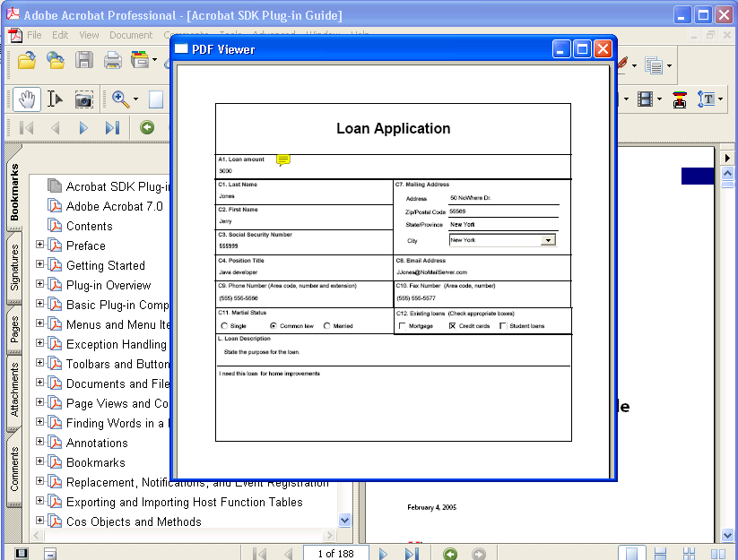

******************************************************
Working with Documents and Files
******************************************************

You can use the Acrobat core API to perform operations on PDFs and files, including opening a PDF in an external window. When working with documents and files, use the following typedefs:

-  An ``AVDoc`` typedef (from the AV layer) represents a document as a window in Acrobat or Adobe Reader. A single ``AVDoc`` object exists for each displayed document. Operations on ``AVDoc`` objects are usually visual modifications to the document's view.
-  A ``PDDoc`` typedef (from the PD layer) represents a document as a PDF file. You work with ``PDDoc`` objects to make changes to a document's contents. Using a ``PDDoc`` object, you can access components, such as a ``PDPage`` object.
-  An ``ASFile`` typedef (from the AS layer) represents a document as an open file.

Opening PDFs
=====================

You can use the Acrobat core API to create application logic that opens a PDF in Acrobat or Adobe Reader. The method that opens a PDF file is ``AVDocOpenFromFile``. Before you invoke this method, you must create an ``ASPathName`` object, which is a platform-independent path value that specifies the PDF file to open.

With Acrobat or Adobe Reader 8.0 and later, you can open PDFs that are based on Unicode-named files. (See `Working with Unicode Paths <Plugins_Unicode.html#50618402_14583>`__.)

You can create an ``ASPathName`` object by using different techniques. This section describes how to create an ``ASPathName`` object by invoking the ``ASFileSysCreatePathName`` method to convert a platform specific path name to an ``ASPathName`` object. This method requires the following arguments:

-  An ``ASFileSys`` object that represents the file system in which you are creating an ``ASPathName`` object. (See `Creating an ASFileSys object <Plugins_Unicode.html#50618402_67382>`__.)
-  An ``ASAtom`` object that specifies the data type of the third argument. You can specify ``Cstring``, which is accepted by the default file system on all platforms. In Windows, the path can be absolute (``C:folderfile.pdf`` ) or relative (``...folderfile.pdf`` ). In Mac OS, it must be an absolute path separated by colons (``VolumeName:Folder:file.pdf`` ). For information about additional supported values, see the ``ASFileSysCreatePathName`` method in the `Acrobat and PDF Library API Reference <https://www.adobe.com/go/apireference>`__.
-  A null- terminated character that specifies the PDF file on which the ``ASPathName`` object is based.
-  A null- terminated character that specifies additional data that you can use. You can pass ``NULL``. For more information, see the ``ASFileSysCreatePathName`` method in the `Acrobat and PDF Library API Reference <https://www.adobe.com/go/apireference>`__.

The ``ASFileSysCreatePathName`` method returns an ``ASPathName`` object. You can also create an ``ASPathName`` object by displaying an open dialog box. (See `Displaying an open dialog box <Plugins_Documents.html#50618416_57499>`__.)

To programmatic-ally open a PDF file in Acrobat or Adobe Reader, invoke the ``AVDocOpenFromFile`` method and pass the following arguments:

-  An ``ASPathName`` object that specifies the PDF file to open.
-  An ``ASFileSys`` object that represents the file system in which the PDF file is located. (See `Creating an ASFileSys object <Plugins_Unicode.html#50618402_67382>`__.)
-  An ``ASText`` object that specifies a string value to display in the Adobe Reader or Acrobat title bar.

The following code example opens a PDF that is based on a file named PurchaseOrder.pdf.

:: 

   //Specify the PDF file to open (host encoded names only)
      const char* myPath = "C:PurchaseOrder.pdf";
      ASAtom pathType = ASAtomFromString("Cstring");

   //Create an ASText object
      ASText titleText = ASTextNew();
      ASTextSetPDText(titleText, "This PDF was opened by using the Acrobat SDK");
      
   //Create an ASPathName object
      ASFileSys fileSys = ASGetDefaultFileSysForPath(pathType, myPath);
      ASPathName pathName = ASFileSysCreatePathName(fileSys, pathType, myPath, NULL);

   //Open the PDF file
      AVDoc myDoc = AVDocOpenFromFile(pathName, fileSys, titleText);

   //Do some clean up

      ASFileSysReleasePath(fileSys, pathName);
      ASTextDestroy(titleText);

Opening a PDF in an external window
============================================

You can use the Acrobat core API to open a PDF in an external window. For example, from within Adobe Reader or Acrobat, you can let a user select a PDF file and then display the PDF in an external window. This lets a user view two separate PDFs at the same time.

The following image shows a PDF displayed in an external window.

In addition to using the typedefs introduced in this chapter, you must also use the following typedefs to open a PDF in an external window:

-  ``AVDocOpenParamsRec`` - defines required parameters for opening a PDF in a window. This typedef lets you control the external window's size, location, and visibility.
-  ``ExternalDocServerCreationDataRec`` - defines data that is used in conjunction with an ``AVDoc`` object that is displayed in an external window.

To open a PDF in an external window, perform the following tasks:

#. Create a new window.
#. Create an ``AVDocOpenParamsRec`` object.
#. Create a ``ExternalDocServerCreationDataRec`` object.
#. Display an open dialog box to enable a user to retrieve a PDF file to open.
#. Display the PDF that the user selected within a window.

Creating a Window
-----------------

You must programmatic-ally create the external window in which to display a PDF. To create a window, you invoke standard platform C functions and not the Acrobat core API. For example, if you are creating your plugin in Windows, you can use the Win32 API to create a window. In this situation, part of the process of creating a window is to register the window class and define the window procedure. After you perform these tasks, you can obtain a handle to the window by invoking the ``CreateWindow`` function. For information about this function, see the MSDN online help at http://msdn.microsoft.com/library/default.asp.

.. note::

   Application logic that creates a window is shown in `Opening a PDF in an external window <Plugins_Documents.html#50618416_11768>`__.

Defining the parameters for an external window
----------------------------------------------

You must create an ``AVDocOpenParamsRec`` object in order to open and display a PDF in an external window. This object defines required parameters for opening a PDF within an external window. After you create an ``AVDocOpenParamsRec`` object, allocate its buffer size and set the following attributes:

* **size**: The size of the data structure. This attribute must be set to ``sizeof(AVDocOpenParamsRec)``.

* **useFrame**: If ``true``, the ``frame`` attribute specifies the size and location of the window in which the PDF is displayed. If ``false``, the ``frame`` attribute is ignored and a default frame is used.

* **frame**: An ``AVRect`` object specifying the size and location of the window in which the PDF is displayed. In the Windows operating system, the coordinates are MDI client coordinates. In Mac OS, the coordinates are global screen coordinates. This attribute is ignored if the ``useFrame`` attribute is ``false``.

* **useVisible**: If ``true``, the ``visible`` attribute determines whether the window is visible after the PDF is opened. If this attribute is ``false``, then the ``visible`` attribute is ignored.

* **visible**: Specifies the window's visibility. If this attribute is ``false`` and the ``useVisible`` attribute is ``true``, then the ``frame`` attribute is ignored regardless of the value of the ``useFrame`` attribute.

If you are using the Windows operating system and this attribute is ``true``, the PDF is opened in a visible window. If this attribute is false, the PDF is opened in a minimized window. This attribute is ignored if the ``useVisible`` attribute is ``false``.

* **useServerType**: An ``ASBool`` value that specifies whether the ``serverType`` and ``serverCreationData`` attributes are used.

* **serverType**: The name of the ``AVDoc`` server for this ``AVDoc`` object. Specify ``EXTERNAL`` for an external window.

* **serverCreationData**: Platform-dependent server data to associate with the ``AVDoc`` server. If the ``serverType`` attribute is ``EXTERNAL``, this attribute must be assigned the address of the ``ExternalDocServerCreationData`` object.

* **useViewType**: An ``ASBool`` value that specifies whether the ``viewType`` attribute is used.

* **viewType**: Specifies the appearance of the window that contains the PDF. The following values are valid:

  - **AVPageView**: Displays only the page view of the document. User interface components such as display scrollbars, toolbars, bookmarks, and thumbnails panes are not displayed. Annotations, such as links, are active.
  -   **AVDocView**: Displays the page view of the document as well as scroll bars, bookmarks, and the thumbnails pane. Annotations, such as links, are active.
  -   **AVExternalView**: Displays the page view of the document as well as scroll bars, toolbars, bookmarks, and the thumbnails pane. Annotations, such as links, are active.
  -   **AVEmbeddedView**: Embeds the PDF file in an external document such as an HTML file. The first page of the PDF is displayed; however, user-interface component such as scroll bars, toolbars, bookmarks, and the thumbnails pane are not displayed. Annotations, such as links, are not displayed or active.

* **useReadOnly**: An ``ASBool`` value that specifies whether the ``ReadOnly`` attribute is used.

* **readOnly**: An ``ASBool`` value that opens the document in read-only mode if set to ``true``.

* **useSourceDoc**: An ``ASBool`` value that specifies whether the ``SourceDoc`` attribute is used.

* **sourceDoc**: An ``AVDoc`` whose window is taken over by the new PDF.

.. note::

   Application logic that creates an ``AVDocOpenParamsRec`` object is shown in `Opening a PDF in an external window <Plugins_Documents.html#50618416_11768>`__.

Creating a handler for an external window
-----------------------------------------

You must create an ``ExternalDocServerCreationDataRec`` object in order to open a PDF in an external window. This object contains callback functions that implement a window handler. After you create an ``ExternalDocServerCreationDataRec`` object, allocate its buffer size and set the following attributes:

* **size**: The size of the data structure. This attribute must be set to ``sizeof(ExternalDocServerCreationDataRec)``.

* **platformWindow**: A platform-dependent structure of type ``ExternalDocWindowData`` representing a window. This is a platform specific value:

  -   **Windows**: use a ``HWND`` value cast as ``ExternalDocWindowData``
  -   **Mac OS**: use an ``ExternalDocWindowData`` object

* **acrobatProc**: An ``AVExecuteProc`` callback that is invoked when the Acrobat button (if present) is clicked in an external application. This attribute is optional.

* **acrobatProcData**: Client specific data that is used in the ``AVExecuteProc`` callback. This attribute is optional.

For a complete list of attributes that belong to an ``ExternalDocServerCreationDataRec`` object, see the `Acrobat and PDF Library API Reference <https://www.adobe.com/go/apireference>`__.

.. note::

   Application logic that creates an ``ExternalDocServerCreationDataRec`` object is shown in `Opening a PDF in an external window <Plugins_Documents.html#50618416_11768>`__.

Displaying an open dialog box
-----------------------------

You can display an open dialog box that enables a user to select a PDF to open. In addition to describing how to create an open dialog box, this section also describes how to use a dialog box to create an ``ASPathName`` object and an ``ASFileSys`` object, which are both used to open a PDF.

The Acrobat core API has a typedef named ``AVOpenSaveDialogParamsRec`` that you use to display an open dialog box. The ``AVOpenSaveDialogParamsRec`` typedef contains the following attributes that you programmatic-ally set:

* **size**: The size of the ``AVOpenSaveDialogParamsRec`` object's buffer.

* **flags**: An ``AVOpenSaveDialogFlags`` value that specifies the dialog box's appearance. The following values are valid:

   -   **kAVOpenSaveAllowAllFlag**: Specifies ``All Files`` ``(*.*)`` for the dialog box. This value is only applicable for an open dialog box.
   -   **kAVOpenSaveAllowMultiple**: Allows multiple files to be opened through the dialog box. This value is only applicable for an open dialog box.
   -   **kAVOpenSaveAllowForeignFileSystems**: Allows file systems other than the default to be used to open the files. You need to select this value to open Unicode-named files. This value is only applicable for an open dialog box.
   -   **kAVOpenSaveAllowSettingsButton**: Adds a settings button to the dialog box. This value is applicable to both open and save dialog boxes.
   -   **kAVOpenSaveMergeTogetherPassedFilters**: Meaningful only for open dialog boxes with more than one filter.

* **parentWindow**: An ``AVWindow`` object that specifies the parent window for the dialog box. This attribute is ignored on Mac OS.

* **windowTitle**: An ``ASText`` object that specifies the title for the dialog box. This attribute can be ``NULL``, in which case the default title is used.

* **actionButtonTitle**: An ``ASText`` object that specifies the title of the action button. This attribute can be ``NULL``, in which case the default title is used.

* **cancelButtonTitle**: An ``ASText`` object that specifies the title of the cancel button. This attribute can be ``NULL``, in which case the default title is used.

* **initialFileSys**: An ``ASFileSys`` object that specifies the default file system. This value can be ``NULL`` if the ``flags`` attribute does not contain ``kAVOpenSaveAllowForeignFileSystems``.

* **initialPathName**: An ``ASPathName`` object that specifies an initial path location. This value can be ``NULL``.

* **initialFileName**: Specifies an initial file to save. This value is ignored for an open dialog box.

* **fileFilters**: An array of pointers to addresses of ``AVFileFilterRec`` objects that act as a file filter (this attribute is set in the example that is described in this section).

* **numFileFilters**: Specifies the number of ``AVFileFilterRec`` pointers assigned to the ``fileFilters`` attribute.

To display an open dialog box, perform the following tasks:

#. Create an ``AVOpenSaveDialogParamsRec`` object.

::

    AVOpenSaveDialogParamsRec dialogParams;

2. Create an ``AVFileFilterRec`` object used to store a series of file type descriptors that define a file filter for an open or save dialog box. Secondly, create a pointer to an ``AVFileFilterRec``.

::

    AVFileFilterRec filterRec,*filterRecP;

3. Create an ``AVFileDescRec`` object used to store file extensions in an open dialog box.

::

    AVFileDescRec descRec;

4. Set the ``AVFileDescRec`` object's ``extension`` attribute with the value ``PDF``.

::

    strcpy (descRec.extension, "pdf");

5. Allocate the size of the ``AVFileFilterRec`` object's buffer by using the ``memset`` method. Next, set the ``AVFileFilterRec`` object's ``fileDescs`` and ``numFileDescs`` attributes. The ``fileDescs`` attribute defines file type and extension information. You can assign the address of the ``AVFileDescRec`` object to the ``fileDescs`` attribute. The ``numFileDescs`` attribute specifies the number of ``AVFileDescRecs`` objects assigned to the ``fileDescs`` attribute.

::

    memset (&filterRec, 0, sizeof(AVFileFilterRec));
     filterRec.fileDescs = &descRec;
     filterRec.numFileDescs = 1;

6. Assign the ``AVFileFilterRec`` pointer with the address of the ``AVFileFilterRec`` object (this pointer is used to set an attribute that belongs to the ``AVOpenSaveDialogParamsRec`` object).

::

    filterRecP = &filterRec;

7. Set attributes that belong to the ``AVOpenSaveDialogParamsRec`` object. In this example, the ``size``, ``fileFilters``, and ``numFileFilters`` attributes are set. Assign the ``fileFilters`` attribute with the address of the pointer that points to ``AVFileFilterRec``.

::

    memset (&dialogParams, 0, sizeof (AVOpenSaveDialogParamsRec));
     dialogParams.size = sizeof(AVOpenSaveDialogParamsRec);
     dialogParams.fileFilters = &filterRecP;
     dialogParams.numFileFilters = 1;

8. Set the ``AVFileFilterRec`` object's ``filterDescription`` attribute by invoking the ``ASTextSetEncoded`` method and passing the following arguments:

   -  An ``ASText`` object that is used to store the string value.
   -  A pointer to a ``char`` data type.
   -  An ``ASHostEncoding`` value that specifies an encoding type.

::

    filterRec.filterDescription = ASTextNew();
     ASTextSetEncoded (filterRec.filterDescription, "Adobe PDF Files",
     ASScriptToHostEncoding(kASRomanScript));

9. Set the ``AVOpenSaveDialogParamsRec`` object's ``windowTitle`` attribute by invoking the ``ASTextSetEncoded`` method (see step 8 for a description of this method).

::

    dialogParams.windowTitle = ASTextNew();
     ASTextSetEncoded (dialogParams.windowTitle, "Select A PDF 
     To Open",
     ASScriptToHostEncoding(kASRomanScript));

10. Display the open dialog box by invoking the ``AVAppOpenDialog`` method and passing the following arguments:

   -  The address of an ``AVOpenSaveDialogParams`` object that represents the dialog box to open.
   -  The address of an ``ASFileSys`` object. This method will populate the ``ASFileSys`` object with the file system in which the file that the user selects is located. This argument can be ``NULL`` if ``kAVOpenSaveAllowForeignFileSystems`` is not set as the ``flags`` value.
   -  The address of a pointer that points to an ``ASPathName`` typedef. This argument is populated with the file that was select by the user.
   -  The address of an ``AVArraySize`` object. This value can be NULL if ``kAVOpenSaveAllowMultiple`` is not set as the ``flags`` value.
   -  The address of an ``AVFilterIndex`` object. This value can be NULL.

The ``AVAppOpenDialog`` method returns ``true`` if the user clicks the action button (for example, the Open button). If the user clicks the Cancel button, the method returns ``false``.

::

    ASPathName * pathName = NULL;
     ASBool bSelected = AVAppOpenDialog(&dialogParams, NULL,(ASPathName**)&pathName, NULL, NULL);

11. Release existing ``ASText`` objects by invoking the ``ASTextDestroy`` method.

::

    ASTextDestroy (filterRec.filterDescription);
     ASTextDestroy (dialogParams.windowTitle);

.. note::

   This application logic is shown in `Opening a PDF in an external window <Plugins_Documents.html#50618416_11768>`__.

Displaying a PDF in a window
-----------------------------------------

Before you attempt to display a PDF in an external window, you must programmatic-ally create the window. (See `Creating a Window <Plugins_Documents.html#50618416_99182>`__.)

To display a PDF within an external window, perform the following tasks:

#. Open a PDF file by invoking the ``ASFileSysOpenFile`` method and passing the following arguments:

   -  An ``ASFileSys`` object that represents the file system in which the PDF file is located. (See `Creating an ASFileSys object <Plugins_Unicode.html#50618402_67382>`__.)
   -  An ``ASPathName`` object that represents the path in which the PDF file is located.
   -  An ``ASFileMode`` object that represents the mode in which to open the file. For example, specify ``ASFILE_READ`` to open the PDF in read mode.
   -  The address of an ``ASFile`` object. This method populates this argument with the file that was opened (file information is obtained from the ``ASPathName`` object).

If the ``ASFileSysOpenFile`` method is successful, then ``0`` is returned. Otherwise, an error value is returned.

2. Display the PDF within the window by invoking the ``AVDocOpenFromASFileWithParams`` method and passing the following arguments:

   -  An ``ASFile`` object that specifies a PDF file to display (you can use the same ``ASFile`` object whose address was passed to the ``ASFileSysOpenFile`` method).
   -  An ``ASText`` object that specifies the text to display in the window's title bar. Create an ``ASText`` object by invoking the ``ASTextFromScriptText`` method.
   -  The address of the ``AVDocOpenParamsRec`` object that you created. (See `Defining the parameters for an external window <Plugins_Documents.html#50618416_64706>`__.)

The following code example opens a PDF in an external window. The application logic that is located within the ``OpenExternalWindow`` user-defined function creates the window and displays a PDF within the window. A structure named ``gDocInfo`` that stores information such as the file to open is also defined.

This code example contains a user-defined method named ``AVWndProc`` that acts as a window procedure and another user-defined function named ``InitializeWindowHandler`` that registers the windows class that is specified as an argument to ``CreateWindow``.

Also shown in this code example is application logic that displays an open dialog box that enables a user to select a PDF file to open. This application logic is located within a user-defined function named ``OpenPDFFile``. (See `Displaying an open dialog box <Plugins_Documents.html#50618416_57499>`__.)

::

         struct t_ExternDocInfo
         {
            AVDoc doc;
            ASFile file;
         } gDocInfo; 

      //Create a function that opens a PDF in an external window
         ACCB1 void ACCB2 OpenExternalWindow (void * data)
         
         {

      //Declare local variables
         ASPathName pathName;
         ASInt32 retVal;
         ASFileSys myFileSys;
         bool bWindowIsOpen = false;
         
      //Create an AVDocOpenParamsRec object
         AVDocOpenParamsRec params;
         

      //Declare an ExternalDocServerCreationDataRec object
         ExternalDocServerCreationDataRec creationData;
         
      //Invoke CreateWindow to obtain a handle to a window
         HWND externHWnd = CreateWindow ("ExternalWindow", "PDFViewer",
         WS_OVERLAPPEDWINDOW,50, 50, 500, 500, 0, 0, gHINSTANCE, NULL);
         if (externHWnd)
         {

      //Set attributes that belong to the AVDocOpenParamsRec object
         memset(&params, 0, sizeof(AVDocOpenParamsRec));
         params.size = sizeof(AVDocOpenParamsRec);
         params.useFrame = false;
         params.useVisible = true;
         params.visible = true;
         params.useServerType = true;
         params.serverType = "EXTERNAL";
         params.serverCreationData = (void*) &creationData;
         params.useViewType = true;
         params.viewType = "AVDocView";
         params.useReadOnly = true;
         params.readOnly = true;
         params.useSourceDoc = false;
         params.useViewDef = false;
         
      //Set attributes that belong to the ExternalDocServerCreationDataRec object

         memset(&creationData, 0, sizeof(ExternalDocServerCreationDataRec));
         creationData.size = sizeof(ExternalDocServerCreationDataRec);
         creationData.platformWindow = (ExternalDocWindowData)externHWnd;
         creationData.acrobatProc = NULL;
         creationData.crossDocLinkWithDestData = (void *)externHWnd;
         
      //Invoke OpenPDFFile to display an open dialog box that
      //enables a user to select a PDF file
      //Pass the address of the ASFileSys object
         pathName = OpenPDFFile(&myFileSys); 
         
      //If PathName is valid
         if (pathName) {
         
      //Open the file specified in the file system
         retVal = ASFileSysOpenFile (myFileSys, pathName, ASFILE_READ,
         &gDocInfo.file);
         
         if (retVal ==0) {

      //Create a ASText object used to display in the new window
            ASText title = ASTextFromScriptText ("PDF Viewer", kASRomanScript);
                           
      //Opens and displays a document from a file, using the specified

      //parameters to control the window's size, location, and visibility

            AVDocOpenFromASFileWithParams (gDocInfo.file, title, &params);
               ASTextDestroy(title);
               bWindowIsOpen = true;
         } else
               AVAlertNote("Failed to open document.");
         }
         }
         }
         
      //Define the AVWndProc function
         LRESULT CALLBACK AVWndProc(HWND hwnd, UINT msg, WPARAM wParam, LPARAM lParam)
         
         {
         if (msg == WM_DESTROY)
         memset (&gDocInfo, 0, sizeof(gDocInfo));
         return DefWindowProc (hwnd, msg, wParam, lParam);
         }
         
      //Define the InitializeWindowHandler function
         ASBool InitializeWindowHandler (void)
         {
         WNDCLASS wndClass ;

      //This is the window class used to display the PDF
         wndClass.cbClsExtra     = 0;
         wndClass.hInstance      = gHINSTANCE;
         wndClass.style               = CS_DBLCLKS;
         wndClass.hCursor          = (HCURSOR)NULL;
         wndClass.hbrBackground  = (HBRUSH)NULL;
         wndClass.lpfnWndProc    = AVWndProc;
         wndClass.hIcon               = (HICON)NULL;
         wndClass.lpszMenuName   = NULL;
         wndClass.cbWndExtra     = 0;
         wndClass.lpszClassName  = "ExternalWindow";
         
         if (!RegisterClass(&wndClass))
         return false;
         return true;
         }
         

      //Display an open dialog box that enables a user to select a PDF file
         ASPathName OpenPDFFile(ASFileSys * ASF)
         
         {

      //Declare an AVOpenSaveDialogParamsRec object
         AVOpenSaveDialogParamsRec dialogParams;

      //Create local variables
         AVFileFilterRec filterRec,*filterRecP ;
         AVFileDescRec descRec;
         ASPathName * pathName = NULL;
         ASFileSys fileSys = NULL;
         ASBool bSelected = false; 
         char errorBuf[256];  

      //Set up the PDF file filter description
         strcpy (descRec.extension, "pdf");
         descRec.macFileType = 'PDF ';
         descRec.macFileCreator = 'CARO';
         
      //Set attributes that belong to the AVFileFilterRec object
         memset (&filterRec, 0, sizeof(AVFileFilterRec));
         filterRec.fileDescs = &descRec;
         filterRec.numFileDescs = 1;
         filterRecP = &filterRec;
         
      //Set attributes that belong to the AVOpenSaveDialogParamsRec object
         memset (&dialogParams, 0, sizeof (AVOpenSaveDialogParamsRec));
         dialogParams.size = sizeof(AVOpenSaveDialogParamsRec);
         dialogParams.fileFilters = &filterRecP;
         dialogParams.numFileFilters = 1;
         
         DURING
      //Set the AVFileFilterRec object's filterDescription attribute
         filterRec.filterDescription = ASTextNew();
         ASTextSetEncoded (filterRec.filterDescription, "Adobe PDF Files",
         ASScriptToHostEncoding(kASRomanScript));
         
      //Set the AVOpenSaveDialogParamsRec object's windowTitle attribute
         dialogParams.windowTitle = ASTextNew();
         ASTextSetEncoded (dialogParams.windowTitle, "Select A PDF To

         Open",ASScriptToHostEncoding(kASRomanScript));
         
      //Display the Open dialog box - pass the address of the ASFileSys object
         bSelected = AVAppOpenDialog(&dialogParams, &fileSys, (ASPathName**)&pathName, NULL, NULL); 

         HANDLER
      //Display an error message to the user
         ASGetErrorString (ASGetExceptionErrorCode(), errorBuf, 256);
         AVAlertNote (errorBuf);
         END_HANDLER
         
      //Destroy the ASText object then return
         ASTextDestroy (filterRec.filterDescription);
         ASTextDestroy (dialogParams.windowTitle);
         
      //Point the ASFileSys argument to the address of the ASFileSys object
         *ASF = fileSys;

         return bSelected ? *pathName : NULL;
         }

.. note::

   The ``OpenExternalWindow`` function can be invoked from an Adobe Reader or Acrobat user interface component, such as a toolbar button or a menu command. Ensure that the ``InitializeWindowHandler`` method is invoked before the ``OpenExternalWindow`` method; otherwise, the window class is not registered and the PDF file is not displayed in the external window.

Determining the PDF version
=========================================

All PDFs contain PDF version information in the header, such as 1.7. Additionally, PDF files that conform to ISO 32000 can include PDF version extension information that indicates that the PDF may contain PDF extensions added by third-party developers.

The Acrobat API provides methods that let you obtain the PDF version and the PDF version extension information.

PDF version
-----------

The ``PDDocGetVersion`` method lets you obtain the PDF version of a PDF. This PDF version indicates the PDF specification to which the document conforms, such as 1.4 or 1.7.

PDF version extensions
----------------------

Acrobat 8.1 and later add extensions to the PDF specification. These extensions are specified in the *Adobe Supplement to ISO 32000*. Each extension in that supplement is associated with a base version and an extension level. The ``Extensions`` dictionary located in the ``Catalog`` dictionary specifies PDF extensions added by Adobe or others.

For example, Acrobat 8.1 added a PDF extension to 3D annotations that enabled support for the PRC format, a highly compressed 3D representation. If a PDF contains a 3D annotation that specifies a PRC file, the PDF also contains an ``Extensions`` dictionary in the ``Catalog`` dictionary that specifies a base version of 1.7 and an extension level of "1" or greater. The following PDF segment shows the appearance of such an ``Extensions`` dictionary.

::

   %PDF 1.7
   <</Type /Catalog
     /Extensions
     <</ADBE
         << /BaseVersion /1.7 /ExtensionLevel 3 >>
     >>
   >>

Setting the extension level of a document
-----------------------------------------

When you add PDF extensions specified by Adobe or others, you must ensure that the ``Catalog`` dictionary contains an ``Extensions`` dictionary that describes the greatest extension level that can appear in the PDF. The ``Extensions`` dictionary can contain one dictionary for each company or other entity that adds PDF extensions.

To set the extension level, use the ``Cos`` object methods described in `Working with Cos Objects <Plugins_Cos.html#50618418_86959>`__.

Getting the extension level of a document
-----------------------------------------

Beginning with Acrobat 9.0, the ``PDDocGetVersionEx`` method lets you obtain the Adobe-specific version extension information and the PDF version.

To obtain version extension information introduced by entities other than Adobe, use the ``Cos`` object methods described in `Working with Cos Objects <Plugins_Cos.html#50618418_86959>`__.

Bridging core API layers
========================

To operate on the contents of a PDF, and not just manipulate its representation in Adobe Reader or Acrobat, you must use a ``PDDoc`` object. For example, to create an annotation for a PDF, you must create a ``PDDoc`` object. (See `Creating Annotations <Plugins_Annotations.html#50618420_98126>`__.)

You can create a ``PDDoc`` object by using an ``AVDoc`` object. To get a ``PDDoc`` object that corresponds to an ``AVDoc`` object, invoke the ``AVDocGetPDDoc`` method. This method is referred to as a bridge method because it allows your plugin to access other layers from the AV layer. There are several bridge methods which connect the different API layers (AV, PD, and Cos).

All ``AVDoc`` objects have an underlying ``PDDoc`` object. Operations on an ``AVDoc`` object usually result in visible modifications to the document's view. If you just want your plugin to make changes to a document's contents, it can open a ``PDDoc`` object directly (that is, without going through an ``AVDoc`` object to get the ``PDDo`` c object) and use PD layer methods.

Creating a PDDoc object
-----------------------

You can access a PDF file's contents without displaying the PDF file in Acrobat or Adobe Reader. To perform this task, create a ``PDDoc`` object by invoking the ``PDDocOpen`` method and passing the following arguments:

-  An ``ASPathName`` object that specifies the PDF file on which the ``PDDoc`` is based. For information about creating an ``ASPathName`` object, see `Opening PDFs <Plugins_Documents.html#50618416_65430>`__.
-  An ``ASFileSys`` object that represents the file system in which the PDF file is located. (See `Creating an ASFileSys object <Plugins_Unicode.html#50618402_67382>`__.)
-  A ``PDAuthProc`` authorization callback that is invoked only if the file has been secured (that is, if the file has either the user or the master password set). This callback must obtain required information to determine whether the user is authorized to open the file. You can pass ``NULL`` if an authorization callback is not required. For information about callbacks, see `Using callback functions <Plugins_Pimech.html#50618406_20671>`__.
-  An ``ASBool`` value. When set to ``true``, an attempt to repair a damaged file is performed. If ``false``, an attempt to repair a damaged file is not performed.

The following code example creates a ``PDDoc`` object that is based on a PDF file named PurchaseOrder.pdf and located in the root of the C drive. This code example is located within a user-defined function named ``getDocument``.

::

         PDDoc getDocument()
         {

      //Declare a PDDoc object
         PDDoc myPDDoc;
         

      //Declare a PDAuthProc callback
         PDAuthProc myAuthProcPtr;
         

      //Specify the PDF file on which to base the PDDoc object
         const char * myPath = "C:PurchaseOrder.pdf"; 
         ASAtom pathType = ASAtomFromString("Cstring");

      //Create an ASPathName object
         ASFileSys fileSys = ASGetDefaultFileSysForPath(pathType, myPath);
         ASPathName pathName = ASFileSysCreatePathName(fileSys,pathType,
         myPath,NULL);
         

      //Create the authentication callback
         myAuthProcPtr = ASCallbackCreateProto (PDAuthProc,&authProc);
         

      //Create a PDDoc object
         myPDDoc = PDDocOpen (pathName, fileSys, myAuthProcPtr, false);
         

      //Release the callback
         ASCallbackDestroy (myAuthProcPtr);
         return myPDDoc; 
         }
         

         ASBool authProc(PDDoc TheDoc)
         
         {

      //Define business logic that authenticates the user
         return true;
         }

Creating a PDDoc object for an open PDF
-----------------------------------------------------

You can create a ``PDDoc`` object that is based on a PDF that is currently open by performing the following tasks:

#. Create an ``AVDoc`` object by invoking the ``AVAppGetActiveDoc`` method. This method gets the frontmost document located in Adobe Reader or Acrobat.
#. Create a ``PDDoc`` object by invoking the ``AVDocGetPDDoc`` method. This method requires an ``AVDoc`` object and returns a ``PDDoc`` object.

::

   AVDoc avDoc = AVAppGetActiveDoc();
   PDDoc myPDDoc = AVDocGetPDDoc(avDoc);

Accessing non-PDF files
-----------------------

You can use the Acrobat core API to access non-PDF files. Your plugin can open a non-PDF file, write data to it, and then read the data at a later time by using ``ASFile`` methods. For example, your plugin can use a text file to track log information or other type of information.

The following code example invokes the Acrobat core API methods to open a file, write data, and read data. 

-  ``AVAlertNote`` displays an error message if something goes wrong.
-  ``ASFileSysOpenFile`` opens a file using the modes specified.
-  ``ASFileWrite`` writes data to the file.
-  ``ASFileClose`` closes the file.
-  ``ASFileRead`` reads data from the file.
-  ``ASFileGetEOF`` gets the current size of a file.

In the following code example, the ``CreateDataFile`` user-defined function creates a file and writes data to it. The ``ReadDataFile`` user-defined function opens a file and reads data from it.

:: 
   
      //Create a global character pointer
         char* gDataBuf = "This is some data in the file.";
         
         ACCB1 void ACCB2 ExeProc (void* data)
         
         {
         CreateDataFile("C:DataFile.txt");
         ReadDataFile("C:DataFile.txt");
         }

      // Returns false if error, true otherwise
         ASBool CreateDataFile (char* pathname)
         
         {
         ASPathName path = NULL;
         ASFile TheFile = NULL;
         ASInt32 err = 0;
         ASInt32 numBytes = 0;
         ASInt32 mode = ASFILE_WRITE | ASFILE_CREATE;
         path = MakeCrossPlatformASPathName (pathname);
         if (path == NULL)
         {
         AVAlertNote ("Unable to gain access to data file.");
         return false;
         }
         err = ASFileSysOpenFile (NULL, path, mode, &TheFile);
         if (err != 0) // Returns 0 if no error
         {
         AVAlertNote ("Unable to open data file for writing.");
         return false;
         }
         numBytes = ASFileWrite (TheFile, gDataBuf, strlen (gDataBuf));
         
         if (numBytes != strlen (gDataBuf))
         {
         ASFileClose (TheFile);
         AVAlertNote ("Number of bytes written was not the expected number.");
         return false;
         }
         ASFileClose (TheFile);
         return true;
         }
         

      //Read data from a file
         void ReadDataFile (char* pathname)

         {
         ASPathName path = NULL;
         ASFile TheFile = NULL;
         ASInt32 err = 0;
         ASInt32 mode = ASFILE_READ;
         char Data[500];
         char buf[500];
         path = MakeCrossPlatformASPathName (pathname);
         
         if (path == NULL)
         {
         AVAlertNote ("Unable to gain access to data file.");
         return;
         }
         err = ASFileSysOpenFile (NULL, path, mode, &TheFile);
         
         if (err != 0) // Returns 0 if no error
         {
         AVAlertNote ("Unable to open data file for reading.");
         return;
         }
         err = ASFileRead (TheFile, Data, ASFileGetEOF (TheFile));
         
         if (err != strlen (gDataBuf))
         AVAlertNote ("Number of bytes read was not the expected amount of bytes.");
         
         //NULL terminate the string.
         Data[ASFileGetEOF (TheFile) ] = '0'
         ASFileClose (TheFile);
         strcpy (buf, "Data read was: ");
         strcat (buf, Data);
         AVAlertNote(Data);
         return;
         }
         
         //Create a platform-independent path

         ASPathName MakeCrossPlatformASPathName (char* platformPathname)

         {
         ASPathName ThePathName = NULL;
         ThePathName = ASFileSysCreatePathName (NULL,ASAtomFromString("Cstring"), platformPathname, 0);
         return ThePathName;
         }

Printing documents
==================

You can use the Acrobat core API to print documents by using one of the following methods:

-  ``AVDocPrintPages``
-  ``AVDocPrintPagesWithParams``

The ``AVDocPrintPages`` method prints a document without displaying any user dialog boxes. The current printer, page settings, and job settings are used. Printing is complete when this method returns.

The ``AVDocPrintPagesWithParams`` method prints a document with a full range of options. Printing is complete when this method returns. It performs embedded printing; that is, it allows a PDF page to print within a bounding rectangle on a page. It allows interactive printing to the specified printer.

To print a document with a range of options, invoke the ``AVDocPrintPagesWithParams`` method and pass the following arguments:

-  An ``AVDoc`` object that represents the PDF from which to print page. For information about creating an ``AVDoc`` object, see `Opening PDFs <Plugins_Documents.html#50618416_65430>`__.
-  An instance of the ``AVDocPrintParams`` data structure that defines printing parameters. (See the `Acrobat and PDF Library API Reference <https://www.adobe.com/go/apireference>`__.)

Working with the PDF/X format
=============================

Beginning PDF Library XI, you can convert an existing PDF file to the PDF/X format. The converter aims at creating an output PDF/X document that is self-contained and whose visual fidelity is maintained over time. The converter manages operations like font embedding, changes in colors while printing, etc., to give a seamless PDF/X conversion process. PDF/X-1a:2001 and PDF/X-3:2003 are the two PDF/X standards that are supported by the PDF processor plugin. For files containing objects that cannot be converted as per the PDF/X standards, the conversion process is aborted.

.. note::

   PDFL SDK XI does not support the conversion of PDF packages or of PDF portfolios to the PDF/X format.

The following lists how various file elements are handled during conversion:

-  Color Spaces: All color spaces in the input file are converted to PDF/X compliant color spaces. For PDF/X-3:2003, conversions to the US SWOP colorspace is supported.
-  AcroForms: AcroForms are flattened in the PDF/X compliant output file. This may result in loss of interactivity if the source file includes annotations. In the case of text fields, only the visible text is saved.
-  Digital Signatures: Digital signatures are flattened and replaced by equivalent graphics operators with the same visual appearance.
-  Annotations and Actions: The PDF/X standard does not allow the use of annotations or actions inside the print area. Any actions present in the input file will not be available in the output PDF/X file Annotations, if present, are moved outside the print area in the converted PDF/X file. You can choose to turn off the relocation of annotations which will result in the removal of annotations altogether.
-  Tagged PDF: PDF files that include tags are not supported. All tagging information is lost when a tagged PDF file is converted to the PDF/X format.
-  Fonts: The conversion is aborted if fonts in the input file are not embedded, the fonts are not present on the system, or the font embedding permissions are not available. Any invisible text in the input file will not be available in the output PDF/X file.
-  Transparency: Transparency is not supported in the PDF/X format. All transparency is flattened when a file is converted to the PDF/X format

The following APIs are available for conversion using the PDF Processor:

-  PDFProcessorConvertAndSaveToPDFA
-  PDFProcessorConvertToPDFA
-  PDFProcessorTerminate
-  PDFProcessorConvertAndSaveToPDFX
-  PDFProcessorConvertToPDFX.

See the `Acrobat and PDF Library API Reference <https://www.adobe.com/go/apireference>`__ for more information.
