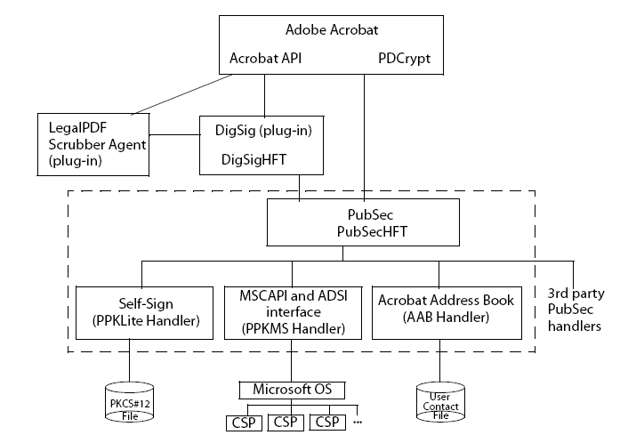
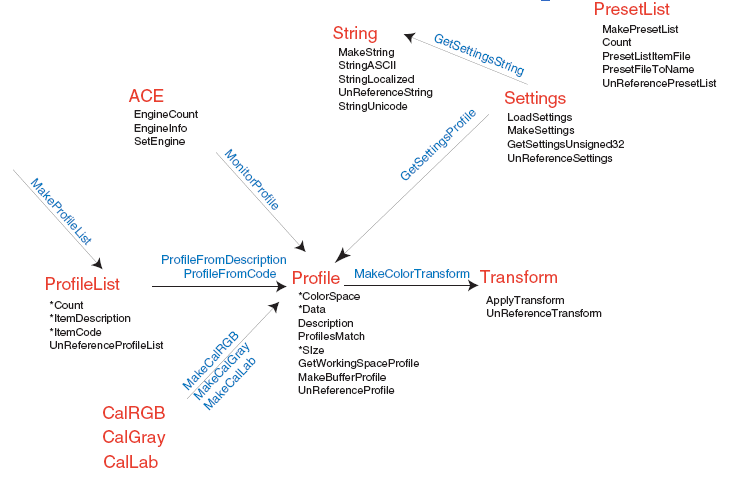

******************************************************
Working with Acrobat Extended APIs
******************************************************

Some of Acrobat's default plugins expose their APIs for use by third parties. These are Acrobat's extended APIs. These APIs are specified in the `Acrobat and PDF Library API Reference <https://www.adobe.com/go/apireference>`__.

Search extended API
===================

The Adobe Acrobat Search plugin allows users to perform text searches in PDF documents. It adds menus, menu items, a toolbar button, and a Search panel to the Acrobat viewer.

The Search plugin exports a host function table (HFT) that contains methods that can be used by other plugins. The HFT's name is Search, and its version number is 0. To use the Search plugin's HFT, a plugin must include the header file SrchClls.h. The plugin must also import the HFT using the ``ASExtensionMgrGetHFT`` method and assign the HFT returned by this call to a plugin-defined global variable named ``gSearchHFT``. (See `Working with Host Function Tables <Plugins_Hft.html#50618412_37928>`__.)

Acrobat 6.0 and later has two versions of the Search plugin:

-  The Search plugin uses a search engine licensed from Lextek International. Lextek can be contacted at `http:   //www.lextek.com <http:   //www.lextek.com.>`__.
-  The Search5 plugin uses a search engine licensed from Verity, Inc. Verity can be contacted at `http:   //www.verity.com <www.verity.com>`__.

You can perform the following tasks with either version of the Search plugin:

-  Create or delete indexes
-  Determine what indexes are available
-  Send queries to an existing index

You cannot use either version of the Search plugin to directly obtain the results of a search, for manipulation or for display in an application other than Adobe Acrobat. For information about the methods included in the Search extended API, see the `Acrobat and PDF Library API Reference <https://www.adobe.com/go/apireference>`__.

Catalog extended API
====================

Acrobat Catalog is a plugin that allows you to create a full-text index of a set of PDF documents. A full-text index is a searchable database of all the text in the documents. After building an index, you can use the Search command to search the entire library quickly. Searches of full-text indexes created using Catalog are faster and more convenient than using the Find command.

The Catalog plugin has an HFT consisting of several methods that plugin developers can import and use. In addition, Catalog supports DDE, and broadcasts several Windows messages. For information about the methods included in the Catalog extended API, see the `Acrobat and PDF Library API Reference <https://www.adobe.com/go/apireference>`__.

PDF Consultant and Accessibility Checker extended API
===================================================================

Acrobat comes with a plugin called the PDF Consultant and Accessibility Checker. This plugin walks through PDF documents, visiting each object and determining its type and other statistics. It can make certain modifications or repairs to the PDF document. The objects that the consultant visits can range from simple, primitive types such as Cos strings to higher-level objects such as images. Users invoke the consultant to operate on a particular PDF document, choose which tests or repairs to run, then view the results and select repair options.

The consultant visits the objects in a PDF document according to instructional flags you pass to it. After the consultant visits an object, the object may be different. The consultant reclassifies modified objects before moving on to the next object.

As the consultant traverses a PDF document, gathering objects of interest, it can perform the following tasks:

-  Walk a given hierarchy
-  Keep track of cycles
-  Ensure that objects are only visited once, if desired
-  Recognize object types
-  Keep a traversal stack list

Acrobat agents
---------------------------------

The consultant accomplishes its task by using agents, which are pieces of code you design to gather the statistics and recommend to the consultant the necessary repairs of the document. Separate agents handle each area of analysis and repair. The agents inform the consultant of the particular types of objects in which they are interested by registering with the consultant. When the consultant has one or more agents registered, it hands each object of the requested type(s) in the current document to each of the agents that requested that type. The consultant gives objects to each agent in turn, depending on the order in which they registered.

The consultant must intelligently determine the type of each object it comes across (both direct and indirect), so it can pass appropriate objects to the agents, or replace or remove ones that it has been instructed to handle itself. The consultant communicates directly with agents, keeping lists of which agents are interested in which objects, and obtaining instructions from the agent as to an object's visitation status.

Agents can perform their own repairs and modifications to the PDF document, and can return a corrected object to serve as a replacement for the object the consultant originally passed to it. Agents can also modify the Cos graph themselves (including adding or removing Cos objects or modifying the contents such as keys or array elements).

The consultant keeps a list of each object (starting with the object which began the traversal) that it visits on its way to any given object. Agents must be careful not to make any modifications that would affect any of the objects in the list, which is referred to as the traversal stack. For this reason, agents can specify a post-processing callback that the consultant invokes once it has finished traversing the entire document.

Reclassifying and revisiting
---------------------------------

If an agent or the consultant modifies an object, the consultant reclassifies that object, possibly changing its type.

Agents also pass visitation flags to the consultant that determine how object types should be visited. Limiting the traversal is important, as PDF documents are graphs, arbitrarily complex, and often there are many ways to visit a single object. If the consultant reclassifies an object, it may also change the way that object is revisited. You must keep this in mind as you develop your agents.

Agent architecture
---------------------------------

Your agent code will primarily consist of a structure, as defined in the ConsExpt.h header file. Acrobat provides a C++ wrapper class to facilitate writing agents; you can derive an agent class from this base class.

How the consultant works
------------------------------------------

The consultant completes a full, non-recursive traversal of the Cos graph that comprises a PDF document, keeping track of cycles as it goes. Note that there is no guarantee that objects will be visited in any particular order, only that the consultant will visit all objects (except isolated objects such as the ``DocInfo`` object or previously orphaned objects) at least once, provided no agents modify the graph such that graph paths are removed or redirected.

Removing or modifying objects
^^^^^^^^^^^^^^^^^^^^^^^^^^^^^^^^^^^^^

If an agent removes, replaces, or modifies an object, the consultant passes the modified objects (if they are encountered) to other agents. For example, ``DictA`` refers to ``DictB``.The first agent replaces all references to ``DictB`` with references to ``DictC``, so when later agents receive ``DicA`` from the consultant, they will see the references to ``DictC``.

Reclassifying objects
^^^^^^^^^^^^^^^^^^^^^^^^^^^^^^^^^^^^^

In general, the consultant reclassifies an object after an agent is finished performing operations on it. It is possible that, in the process of modifying the object, the agent may actually change the type of the object. This could mean that agents originally interested in the object may not be interested in it. So the consultant must reclassify an object after each agent has finished with it. Because the default behavior in the revisit upon reclassification mode is to revisit objects when they are reclassified, new objects added in this mode will actually be visited again if they are reclassified as the traversal continues.

Determining the higher-level type (the ``PDFObjType``, as the consultant code calls it) of a given Cos object is not always easy. The consultant not only looks at the construction of objects (what keys are present in the object) but also at how the object was reached (through what particular object type and via what keys). Objects that are interpreted differently depending on how they are traversed can be properly identified.

Consultant process
^^^^^^^^^^^^^^^^^^^^^^^^^^^^^^^^^^^^^

The following steps describe the consultant process:

#. You create a consultant.
#. You create an agent.
#. Register your agent with the consultant, with information as to which object types are of interest.
#. The user invokes the consultant to work on a particular PDF document.
#. The consultant creates a traversal stack to keep track of where it is in walking through the PDF document.
#. The consultant begins traversing the PDF document. If agents have instructed the consultant to modify or remove the object, it does so, returning the appropriate replacement.
#. The consultant pushes the object onto the traversal stack and sends a message to the agent that the object was found.
#. The agent sends messages to the consultant about what to do to objects: replace them, remove them, revisit them later or not.
#. When the entire PDF document has been traversed, the consultant calls the agent back to perform any post-processing repairs it may want to do.
#. The consultant unregisters all agents.
#. You release the agent object.
#. You release the consultant object.

Important issues for consultant development
---------------------------------------------------

First, you must decide if you actually do want to use a consultant. A consultant walks through an entire PDF document. If you only need to modify a small number of objects, and you know how to locate those objects, it makes more sense to write the object-finding code yourself.

If you decide to use the consultant, here are some planning considerations:

-  Avoid implementing an agent that modifies objects on the traversal stack while the consultant is still walking through the document, otherwise infinite loops and other problems can occur (see `Maintaining the traversal stack <Plugins_ExtendedAPI.html#50618414_93514>`__).
-  Decide whether the consultant or the agent does the work (see `Deciding consultant or the agent does the work <Plugins_ExtendedAPI.html#50618414_78898>`__).
-  Determine order in which agents interact with the consultant. This order is important because agents can modify objects that other agents want to view (see `Avoiding agent collisions <Plugins_ExtendedAPI.html#50618414_53252>`__).
-  Decide whether to allow the consultant to revisit objects that have multiple classifications and what conditions must exist to allow such repeat visits (see `Avoiding visitation collisions <Plugins_ExtendedAPI.html#50618414_42237>`__).

You should make your decisions about all of these issues before you write your code. Some of these issues lead to errors that are difficult to debug, so it is best to understand them all while creating your plugin.

Maintaining the traversal stack
^^^^^^^^^^^^^^^^^^^^^^^^^^^^^^^^^^^^^^

The consultant keeps track of the objects it has visited in the PDF document in the traversal stack. If an agent modifies an object such that it affected the traversal stack, the entire process is derailed. The consultant may no longer know if it had visited an object, which could cause infinite loops, multiple, unnecessary visitations, or objects that remain unvisited.

It is extremely important that the integrity of the traversal stack remain undamaged. You must design your agent carefully so as to avoid this problem. You can use the postprocessing step of your agent to handle many repair tasks, thereby avoiding dealing with objects still on the traversal stack.

Deciding consultant or the agent does the work
^^^^^^^^^^^^^^^^^^^^^^^^^^^^^^^^^^^^^^^^^^^^^^^^^^^^^^^

If the consultant performs object modifications, it does so as it goes through its traversal. Modifications that affect an object's type or properties alter the traversal stack and corrupt the traversal process. For these kinds of modifications, set up an agent to perform the tasks in the postprocessing step.

For example, suppose an agent wants to remove annotations while there are form widgets present in the document. There are a few ways the agent can remove the annotations while the consultant is working, but they all have problems:

-  Invoking the agent for all annotations and removing them at the Cos level does not clean up the forms tree if there are Widget Annots in the document.
-  Invoking the agent for all annotations and using the ``PDPageAnnotRemove`` method modifies the page object, which may still be in the traversal stack.

The best solution in this case is to enumerate all of the ``Annot`` objects by having the consultant look for ``Annot`` objects and keep a list of them, then let the agent invoke ``PDPageAnnotRemove`` on them in the post-processing step.

Avoiding agent collisions
^^^^^^^^^^^^^^^^^^^^^^^^^^^^^^^^^^^^^^

When running multiple agents on a document, the order in which you register your agents is the order in which the consultant will hand them objects. If your earlier agents modify objects, they may change the objects in such a way that they are missing important information or are of a different type than they were originally. For example, one agent may consider it correct to remove a given field of an object, while another would complain that the field was not present and would want to add it. If the first agent modified the object type, subsequent agents would no longer think they were interested in it, and their processing would not take place. You must group your agents so that you do not run multiple agents with conflicting goals at the same time.

A rarer problem could occur with self-referential objects. For example, if ``DictA`` contains a reference to itself and the first agent replaces ``DictA`` with ``DictB`` (which would still contain a reference to ``DictA`` ), another agent cannot work with ``DictB`` until the internal reference is changed. But if you are running the agents concurrently, there will be a collision. This would be a case best handled by the consultant.

Avoiding visitation collisions
^^^^^^^^^^^^^^^^^^^^^^^^^^^^^^^^^^^^^^

Objects that have multiple classifications can be reached from multiple paths. In such cases you may allow the consultant to revisit such objects if, and only if, they were reclassified on a new path. However, you must take care not to allow revisitation under other circumstances, or the consultant could miss objects, which would defeat the reason for using a mode that considers object classification.

Importing the consultant HFTs into a plugin
-------------------------------------------

The consultant exports its functions using an HFT. The variable name your plugin uses for the HFT must be of type HFT and named ``gConsultantHFT``. The consultant's HFT allows you to create consultants. The consultant exports an HFT that deals with the general operation of the consultant, including the creation and deletion of consultant objects and agent registration. You must load the consultant plugin before the HFTs plugins can import it. Importing the consultant's HFT is the same as importing any other plugin's HFT. (See `Importing an existing HFT <Plugins_Hft.html#50618412_72145>`__.)

To access the HFT, you must include the ConsHFT.h file into your project. In a plugin, the ``PluginImportReplaceAndRegister`` method should contain the code that imports the HFT.

::

   HFT gConsultantHFT= (HFT)NULL;
   ACCB1 ASBool ACCB2 PluginImportReplaceAndRegister(void)
   {
     ASBool bRetVal = false;
   
   // Import the Consultant's main HFT
    gConsultantHFT = Init_PDFConsultantHFT;    // Macro in ConsHFT.h
     if(gConsultantHFT != (HFT)NULL)
         bRetVal = true;
     else

   // Put in error message about the absence of the Consultant HFT
    return bRetVal;
   };

The consultant defines the following methods for HFT usage:

-  ``ConsultantCreate``
-  ``ConsultantDestroy``
-  ``ConsultantTraverseFrom``
-  ``ConsultantRegisterAgent``
-  ``ConsultantSetStart``
-  ``ConsultantNextObj``
-  ``ConsultantGetPercentDone``
-  ``ConsultantGetNumDirectVisited``
-  ``ConsultantGetNumIndirectVisited``
-  ``ConsultantSuspend``
-  ``ConsultantResume``
-  ``ConsStackGetCount``
-  ``ConsStackIndexGetObj``
-  ``ConsStackIndexGetTypeCount``
-  ``ConsStackIndexGetTypeAt``
-  ``ConsStackIndexIsDict``
-  ``ConsStackIndexIsArray``
-  ``ConsStackIndexGetDictKey``
-  ``ConsStackIndexGetArrayIndex``
-  ``PDFObjTypeGetSuperclass``
-  ``ConsultantGetNumUniqueIndirectsVisited``

Creating and destroying consultants
-----------------------------------

The consultant's HFT allows you to create a consultant for your own use. Once you have finished writing your agent class, you are ready to register it with the consultant and begin processing documents. You should keep your agent separate from the consultant object—that is, do not make the consultant object a member of your agent class. Use a plugin as the owner for both the consultant and your agent object.

Because there is some memory overhead in creating a consultant, you should only create a ``Consultant`` object when it is required, not before. If your target application is a plugin, the most logical place to perform all operations is in the menu item execute procedure. Whether or not it makes sense to destroy the ``Consultant`` object after each execution of the menu item depends on your project.

The consultant HFT provides the functions ``ConsultantCreate`` and ``ConsultantDestroy``, for creating and destroying ``Consultant`` objects. It also provides the Consultant data type, an opaque type for passing handles to ``Consultant`` objects. The ``ConsultantCreate`` method returns variables of that type and requires them as parameters to all other HFT functions having the ``Consultant`` prefix.

After each run the consultant unregisters all the agents that were registered with it; however the memory for the ``Consultant`` object itself remains, and the object must be explicitly destroyed to free the memory. Depending on the duties you assign your consultant, you may want to destroy it after each execution of the menu item that launches it, or you may wish to keep it running.

Registering agents with consultants
-----------------------------------

In order to modify or analyze documents, you must register your agent with the consultant by invoking the ``ConsultantRegisterAgent`` method.

Once the agent is registered with the consultant, it remains registered until a call to ``ConsultantTraverseFrom`` is made. You must re-register agents before each successive call to ``ConsultantTraverseFrom``.

When you register an agent, you supply a rule (one of the ``RegAgentFlag`` values) for revisitation of objects as the consultant runs through the document from the starting object. The following code example registers an agent with a consultant.

::

   // Declare volatile consultant because it is inside a DURING bloc
   //   Consultant volatile hConsultant = (Consultant)NULL;
   
   DURING
     AVDoc hAVDoc = AVAppGetActiveDoc();
     miAssert(hAVDoc != ( AVDoc )NULL );
     if( hAVDoc != ( AVDoc )NULL )
         {

   // Create a Consultant object
   //        hConsultant = ConsultantCreate(
         DumpAllObjectsAgentPercentDone );
         miAssert( hConsultant != ( Consultant )NULL );
         
         if( hConsultant != ( Consultant )NULL )
         {

   // Get the current document root
   //            PDDoc hPDDoc = AVDocGetPDDoc(hAVDoc);
             

   // Create an agent and register it
   //            gDumpAllObjectsAgent = new DumpAllObjectsAgent(hPDDoc);
             
             if((gDumpAllObjectsAgent == (DumpAllObjectsAgent*)NULL)
             || (gDumpAllObjectsAgent->IsValid() == false))
             {
             ASRaise(GenError(genErrNoMemory) );
             }
             else
             {
             ConsultantRegisterAgent(hConsultant,*gDumpAllObjectsAgent,
             REG_REVISITRECLASS_ALL );
             

   // Start the consultant
   //            ConsultantTraverseFrom(hConsultant, 
             CosDocGetRoot(PDDocGetCosDoc(hPDDoc)),PT_CATALOG);
             }
         }
   }
   HANDLER
  ... Destroy Consultant...Free Memory...
   END_HANDLER

Starting the consultant
-----------------------

The ``ConsultantTraverseFrom`` method instructs the consultant to begin traversing a document, starting at a specific Cos object. The Cos object should be the catalog of a currently open document. The ``ConsultantTraverseFrom`` method has no return value and instead raises an exception if an error occurs. The following code example demonstrates how to use the traversal stack manipulation functions.

::

   char* GetTraversalString(ConsStack stack, char *traversalString,
   ASUns32 strLen)
   { 
   ASUns32 Index, NumItems, CurStrLen;
   char StringUns32[16]; traversalString[0] = '0';
   CurStrLen = strlen(traversalString);
   

   // Get the number of items in the current traversal
   //   NumItems = ConsStackGetCount(stack);
   
   for(Index = 0; (Index < NumItems) && (CurStrLen < strLen); Index++)
   {
     if((CurStrLen += strlen(TRAVERSAL_SEP)) < strLen)
         strcat(traversalString, TRAVERSAL_SEP);
   

   // Add the parent key, if this stack entry has one */
   //    if(ConsStackIndexIsDict(stack, Index))
         {
         char* strParentKey =   ASAtomGetString(ConsStackIndexGetDictKey(stack,
         Index));
         if((CurStrLen += strlen(strParentKey)) < strLen)
             strcat(traversalString, strParentKey);
         }

   // Add the parent index, if this stack entry has one
   //   else if(ConsStackIndexIsArray(stack, Index))
   {
     sprintf(StringUns32, "%u",
     ConsStackIndexGetArrayIndex(stack, Index));
     if((CurStrLen += (strlen(StringUns32) + 2)) < strLen)
     {
         strcat(traversalString, "[");
         strcat(traversalString, StringUns32);
         strcat(traversalString, "]");
         }
     } 
   }
   return traversalString;
   }

Consultant object type identification
-------------------------------------

One of the main features the PDF Consultant and Accessibility Checker framework gives you is the use of its identification engine. This engine can look at Cos objects in a PDF file and, based on properties of the objects and of the object's parents, assign PDF object type identifiers to them.

Each Cos object has a simple Cos type and attributes, in the scheme of the document as a whole each object serves a particular purpose. The PDF object type assigned to each object represents that object's role in the PDF document.

Some PDF object types represent higher-level, conceptually-familiar objects like ``PT_PAGE`` (which indicates that the object is a page in the document), while others (like ``PT_AADICTIONARY`` ) are a bit more obscure, particularly to those who are not familiar with the PDF document format. PDF object types are represented using the enumerated type ``PDFObjType``, which is defined in ConsObTp.h. A good way to see all of the various PDF object types that the consultant can identify is to look at the constants defined in that file.

Some object types (in particular many simpler objects such as strings and numbers) are not assigned a particular type. The consultant can identify those objects that are of most use to you. If the consultant cannot identify a specific object, it assigns the identity of ``PT_UNKNOWN`` to the object. Just because the consultant assigns this value to an object does not mean the object is foreign or invalid (although it can potentially mean that), it may simply mean that the object type is not particularly significant in the realm of the PDF document format, and thus the consultant does not know about it.

To allow for greater agent flexibility, the consultant understands PDF object type subclasses and superclasses. Certain PDF object types are members of more generic classes of PDF object type. Agents can often make use of this information, so the consultant assigns object types that are actually arrays of types.

The consultant assigns to an object the most specific classification as well as the more generic classes of which the object is a member. Agent structures include a field called ``WantSubclasses`` that indicates whether or not the agent wants to be called for all the interesting objects' subclasses as well as their directly interesting types.

For example, the ``PT_ANNOTATION`` object type has a number of more specific subclasses such as ``PT_LINKANNOTATION``, ``PT_LINEANNOTATION``, and so on. If an agent requests only objects of type ``PT_ANNOTATION``, and its ``WantSubclasses`` member is ``false``, it may not be called back for very many objects. If the ``WantSubclasses`` member is ``true``, then the consultant will invoke the agent back for objects of all specific types of annotations as well as those classified only as ``PT_ANNOTATION``. This also means that when an agent retrieves the type of an object, it must specify which type it wants. The types in the array that is the classification of the object always go from the most specific (at index 0) to the least specific (the last index in the array).

Creating an agent class
-----------------------

A minimal ``Agent`` class needs only to define the functions defined as virtual in the ``ConsultantAgentObject`` class declared in ConsExpt.h. The following example shows this definition.

::

   #include "ConsExpt.h"
   class DumpAllObjectsAgent : public ConsultantAgentObj
   {
   protected:

   // Data members
   //   FILE* m_DumpFile;
   const static PDFObjType s_hAgentObjects[ ];
   const static ASUns32 s_iNumAgentObjects;
   public:
   

   // Constructor / destructor
   //   DumpAllObjectsAgent(PDDoc hPDDoc);
   virtual ~DumpAllObjectsAgent(void);
   

   // Required methods
   //   virtual void ConsAgentPostProcess(void);
   virtual ASInt32 ObjFound(CosObj Obj, const PDFObjType*
   pObjTypeHierarchy,
   const ASUns32 SizeObjHierarchy,
   TraversalStack Stack,CosObj* pObjToReturn);
   };

Creating agent constructors
---------------------------

In order to write an ``Agent`` class derived from the ``ConsultantAgentObj`` base class, you must invoke the base constructor in the derived classes construction list. The base constructor requires a constant array of so-called objects of interest (of type ``PDFObjType`` ) as well as the length of the array (as ``ASUns32`` ) to be passed as parameters. It is up to you as to where and how the array of types is stored; however, the storage must persist, as the base class saves only a pointer to the data. This has important implications for authoring agents; the derived class cannot initialize the data in its own constructor since the base constructor is called first.

The following example shows an example constructor. In the Agent example the array types and array length are static data members of the ``Agent`` class. In larger-scale systems it is better to create a host object for the agent that is responsible for determining the proper objects to include in the array and for passing them on to the ``Agent`` constructor. The list of object types is passed on to the consultant when ``ConsultantRegisterAgent`` is invoked.

::

   // Define static const data to be passed to parent class constructor
   //   const ASUns32 DumpAllObjectsAgent::s_iNumAgentObjects = 1;
   const PDFObjType
   DumpAllObjectsAgent::s_hAgentObjects[DumpAllObjectsAgent::

   s_iNumAgentObjects] = {DT_ALL};
   
   // Derived Agent class constructor
   DumpAllObjectsAgent::DumpAllObjectsAgent( PDDoc hPDDoc ) :
   ConsultantAgentObj( &s_hAgentObjects[ 0 ], s_iNumAgentObjects )
   {
   Open Temporary File and Initialize Data Members...}
   }

Recognizing objects of interest
-------------------------------

Agents register a list of objects with the consultant in which they are interested. When the consultant classifies an object as any of the types the agent registered with, the consultant calls the ``ObjFound`` callback function, a virtual function in the ``ConsultantAgentObj`` base class.

-  The parameters the consultant passes to this function allow the function to set up a return value with information about the current object, its parents, and the state of the consultant traversal stack.
-  The return value from the callback is an ``OR`` of bit flags that instruct the consultant on handling the current object.

In the `Creating agent constructors <Plugins_ExtendedAPI.html#50618414_14456>`__ example, an ``Agent`` constructor simply gathers information about each object encountered and outputs it to a file. It does not need to have the consultant make any modifications to the document. Therefore, in the definition of the ``ObjFound`` callback function, the return value is always ``OD_NOCHANGE`` and the object returned in ``pObjToReturn`` is simply the same object that was found. In many cases it makes the most sense for an agent to make all document modifications itself, without the consultant's replace and remove facilities. In these cases you must take special care not to modify objects that are currently on the consultant's traversal stack.

The ``DumpAllObjects`` plugin demonstrates that ``PDFConsultant`` agents can access any Cos object from any point in the document. The plugin writes information about certain Cos objects to an output file, called AllObjects.txt.

The ``ObjFound`` callback function of the ``DumpAllObjects`` agent writes to a file the Cos object traversal path that it took to reach a specific Cos object. The function calls ``GetTraversalString``, which describes, with respect to other objects, where a given object lives in the document. For example, the following shows the format of a traversal path of a text annotation:

::

    18 0 obj PT_TEXTANNOTATION | PT_ANNOTATION | ->AcroForm->Fields->[0]->
     P->Annots->[1]

The consultant looks at all Cos objects. To simplify the output, the ``DumpAllObjects`` agent only involves the most common Cos objects: ``CosString``, ``CosDict``, ``CosArray``, and ``CosStream``.

Post processing stage
---------------------

The second and final required function definition in any ``ConsultantAgentObj`` derived class is the ``PostProcess`` callback. This function is called when the consultant has finished its traversal and is preparing to unregister agents to prepare for the next possible run. This callback takes no parameters and returns no values (see ConsAgentPostProcessCallback). There are also no restrictions on what types of operations the Agent can perform on the document in this function.

The ``PostProcess`` callback function is the place to perform any operations that may otherwise damage the consultant's traversal by modifying objects up the consultant's current traversal stack.

Digital signature extended API
==============================

Digital signatures allow a person to attest to something about a document by signing their name to it. An Acrobat signature in a document is bound to that document in such a way that altering the signed document or moving the signature to a different document invalidates the signature.

A single document may be signed more than once, and changes may occur between signings. Acrobat's digital signatures link each signature with a particular state of the document. All changes append the PDF changes to the fully-preserved base PDF document. The ability to do serial signatures of protected documents is unique to Acrobat, and draws heavily on the PDF file design for an appended save.

Adobe Acrobat implements digital signatures using plugins that can handle both generic functions common to all digital signatures, and also specific kinds of signatures (signing methods), such as public-private key (PPK), handwriting, retinal scans, fingerprints, and so on.

The following diagram shows the security plugin relationships.

For information about the APIs that make up the Digital signature extended API, see the `Acrobat and PDF Library API Reference <https://www.adobe.com/go/apireference>`__.

The PubSec layer
----------------

The PubSec layer, introduced in Acrobat 6.0, is an interface for Acrobat public-key security handlers. PubSec forms a high-level interface to the digital signature facility; the PubSec code uses DigSig for digital signature operations, but provides many additional benefits. Developers are encouraged to use the PubSec HFT rather then DigSig HFT.

PubSec methods enable you to perform the following tasks:

-  Count and close encrypted documents.
-  Validate a specific signature field.
-  Access and create digests for data buffers.
-  Import and export certificate data, and manage the certificates in the Acrobat Address Book (AAB).
-  Manage signature appearances (DSAP files).
-  Register and unregister handlers. Handlers can register as PubSec handlers to provide the following cryptographic services:

   -  Do private-key signing and signature validation
   -  Act as a cryptographic source for decrypting using private keys
   -  Act as a directory source for certificate-based identity authentication

Handlers can call back into the PubSec HFT for various services. Most calls to PubSec pass an opaque state object called a ``PSEngine``. You specify a default engine upon registering the handler, and the default engine can make use of the security UI dialog boxes provided by PubSec and DigSig.

To register a handler with PubSec, perform the following tasks:

#. Implement the callbacks you need to provide customized functionality. Many of the callbacks for PubSec can be specified as NULL, in which case PubSec provides default behavior. It is recommended that you use the default behavior when possible.
#. Fill in the handler structure with pointers to your callback implementations (PubSecHandler).
#. Register the handler with PubSec by invoking the ``PSRegisterHandler`` method.

Digital signature components
----------------------------

Digital signatures contain two parts:

-  The signature field dictionary which is the PDF dictionary structure that stores information about the signature.
-  The signature annotation with its associated appearance (including the background and layout of name, time, and so on). A blind digital signature does not have an associated appearance.

Acrobat's digital signature plugin creates these two parts when the user chooses to sign a document. Your plugins do not have to handle deleting the signature, as the DigSig plugin does that transparently.

Digital signature scenarios
---------------------------

Acrobat supports three digital signature scenarios. Acrobat's Digital Signature plugin handles the first case, and allows other plugins to further handle the second and the third cases.[The following steps look as if they are part of a procedure, but I don't think they are. If they're simply three scenarios, they should be bulleted items, 5Heads, or perhaps reworked as inline headings with text. The other situation where we use a numbered list is if order is important, but I don't think that is the situation here either. The Adobe editorial style guide says "A numbered list should be sequential. If the items in the list are not sequential, don't number them.]

-  If the user creates a signature field and does not specify a default signing method, DigSig handles that case with no communication to your plugins:

   -  DigSig creates the signature field dictionary.
   -  DigSig creates the signature annotation dictionary.
   -  DigSig creates the (blank) signature appearance dictionary.

-  The Forms plugin also creates Signature fields. If the user creates a signature field and specifies a default method, Forms calls DigSig to fill in default values:

   -  DigSig creates the signature field dictionary, the signature annotation dictionary, and the (blank) signature appearance dictionary.
   -  DigSig calls the DSDefaultValueProc callback that your plugin provides. This callback must create the default signature value dictionary and create the /DV key in the signature field dictionary to point to it.

-  If the user asks to sign a specific signature field using the plugin, DigSig invokes callbacks into your plugin during a four-step sequence. Your plugin must register these callbacks during the plugin initialization phase. The four callbacks required for this scenario are:

   -  ``dsNewSigData``
   -  ``dsCommitSign``
   -  ``dsFinshSign``
   -  ``dsFreeSigData``

Initializing the digital signature plugin
-----------------------------------------

When Acrobat is started, all plugins go through a three-step initialization process that allows plugins to establish communication among themselves without being dependent on the order of loading. Plugins that interact with Acrobat's digital signature plugin (DigSig) use the following initialization sequence:

#. The DigSig plugin exports its HFT under the name DigSigHFT.
#. To work with DigSig, your plugin must import the DigSig HFT.
#. To work with DigSig, your plugin must create a ``DigSigHandlerRec`` structure, assign the relevant methods, and then invoke the ``DigSigRegisterFilter`` method to register the structure.

When the user opens a document, the digital signature plugin notifies your plugin of the new document by invoking the ``DSDocOpenProc`` method. You can allocate some storage or choose to automatically validate any of their respective signatures in the document.

Auto-validation may produce significant delays if it must read all of a large document from a CD-ROM or over a network, or if it must access a signature registry or authority over a network. Therefore, Adobe software only accesses signatures at user request.

When the user closes a document, the digital signature plugin invokes ``DSDocCloseProc``.

Understanding the process
-------------------------

The steps in this section are suggestions that describe the interactions of a digital signature plugin (the SignDoc sample plugin provided with this SDK is a more complete example).

Dialogs and signature gathering
^^^^^^^^^^^^^^^^^^^^^^^^^^^^^^^^^^^^^^^^^^^^^^^^^^

The digital signature plugin invokes your ``dsNewSigDataProc`` callback method, a callback that begins the signature gathering process:

-  Your plugin interacts with the user, and allows the user to cancel if they want to do so.
-  Your plugin acquires the signature itself in a method-specific way. All information is saved in memory, without altering the document itself.
-  If ``dsNewSigData`` does not cancel, DigSig prepares the document for saving. First, it calls ``dsUnValidateSig`` on every signature in the document to put any overprinting or underprinting in canonical form. It then counts how many pages and fields have changed since any prior signature and records this.
-  For a first signature, the digital signature plugin displays the Save As dialog box, allowing the user to select file name, optimization, and encryption. The user may cancel. Other than fatal errors, such as out-of-disk-space, this is the last chance to stop the process.

Saving a document
^^^^^^^^^^^^^^^^^^^^^^^^^^^^^^^^^^^^^^^^^^^^^^^^^^

The following steps describe how the digital signature plugin saves a document:

#. The digital signature plugin invokes your ``DSCommitSignProc`` callback method to update the document with the actual signature. Your ``DSCommitSignProc`` callback must perform the following tasks:

   -  Create the signature dictionary, possibly using information in the signature field /DV dictionary, perhaps using the ``/ByteRange`` and ``/Contents`` keys.
   -  Point /V in the signature field dictionary to this. Then create the /AP /N value in the signature annotation dictionary, using a method-specific visible representation of the signature, including a symbol signifying "unvalidated signature."
   -  Optionally allocate dynamic storage for a marked array, an array of marked COS objects that it cares about.
   -  Return a marked array that includes at least the /ByteRange and /Contents value objects.

#. The digital signature plugin inserts the /Changes array from step 1.
#. The digital signature plugin saves the PDF document to a file. For each Cos object in the marked array, DigSig records the object's byte offset and length in the file as written. The saved file may have objects encrypted by the Acrobat standard encryption handler, if the user so chooses.
#. The first time a document is signed, the digital signature plugin may rename the file and may invoke the Optimizer, Linearizer, and Garbage Collector. Upon return from the save, all Cos objects are invalid, including those in the marked array.

All PD-level objects except the ``PDDoc`` are invalid. Signing methods must not depend on saving any such state between ``dsCommitSign`` and ``dsFinishSign``. In particular, the byte offsets and lengths in the marked array are valid upon entry to ``doSign``, but the Cos objects are not. The order of entries is unchanged, however, these Cos objects will be rewritten as CosNull before invoking *dsFinishSign*.

Finishing the process
^^^^^^^^^^^^^^^^^^^^^^^^^^^^^^^^^^^^^^^^^^^^^^^^^^

The following describes how the digital signature plugin finishes the process of a signing a document:

#. Invokes ``dsFinishSign``, passing back in the marked array. Your ``DSFinishSignProc`` callback method must perform the following tasks:

   -  Calculate the ``/ByteRange`` that it desires, using the byte offsets and lengths in the marked array.
   -  Overwrite the marked ``/ByteRange`` value in the saved file, using the ``DigSigOverwriteIntArray`` or ``DigSigOverwriteBytes`` callback.
   -  Overwrite any other marked Cos objects it wants to.
   -  Calculate any document digest that it desires, using the ``DigSigFileGetEOF, DigSigFileSetPos``, and ``DigSigFileRead`` callbacks; or it may use the ``DigSigMD5ByteRange`` callback.
   -  Obscure or encrypt this digest in a method-specific way.
   -  Overwrite the marked ``/Contents`` value in the saved file, using ``DigSigOverwriteHexstring`` or ``DigSigOverwriteBytes``.
   -  Optionally delete dynamic storage for the marked array returned by the plugin.

#. Invokes ``dsFreeSigData``, which may free up any remaining storage.

Revalidating signatures
^^^^^^^^^^^^^^^^^^^^^^^^^^^^^^^^^^^^^^^^^^^^^^^^^^

If the user reopens the file, the signatures must be validated. If the user asks to validate one or more signature fields, the digital signature plugin sequences through them one at a time. Your ``DSValidateSignProc`` callback method must perform the following tasks:

-  Recalculate any document digest that it desires, using the ``DigSigFileGetEOF``, ``DigSigFileSetPos``, and ``DigSigFileRead`` callbacks; or it may use the ``DigSigMD5ByteRange`` callback.
-  Compare this result to the stored one, and do any other method-specific checks it desires.
-  Optionally do a validation against some stored (network) registry.
-  Update the ``/AP`` ``/N`` value in the signature annotation dictionary to show doublechecked/pass/fail symbol.
-  Return doublechecked/pass/fail.

The user may open more than one document at a time, and may switch between open documents.

Additional available callbacks
^^^^^^^^^^^^^^^^^^^^^^^^^^^^^^^^^^^^^^^^^^^^^^^^^^

The user may ask to show a signature panel containing summary information for each signature in an open document. If multiple documents are open, there may be multiple panels, or a single panel may be repainted as the user switches between documents. DigSig manages updating the panel(s), but may call the respective method plugin for each signature to get information to display on the panel. For each signature, the signature panel has two levels of detail:[Same comment as on page 15 about the following not being a sequential list.]

#. CLOSED displays a doublechecked/pass/fail/unknown/blank icon and a line of text for each signature field in the document. The default text is the name of the person signing and the date and time of signing, displayed in a language-independent way.
#. The digital signature plugin calls ``dsGetValidState`` to choose which icon to show.
#. OPEN displays an icon and line of text for each signature, then indented lines of further text, currently consisting of the name of the signer, date and time of signing, location of signing, reason for signing, and signing method.
#. The digital signature calls ``dsGetValidState`` to choose which icon to show.
#. Your plugin may update the signature panel for a document asynchronously (it may be doing validation as a background or idle-loop task). To do this, use the ``DigSigUpdatePanel`` callback.

Additional plugin support
^^^^^^^^^^^^^^^^^^^^^^^^^^^^^^^^^^^^^^^^^^^^^^^^^^

Whenever a signature is created or verified, the plugin may optionally alter the appearance of the signature in the document, for the purpose of displaying or printing. For example, it could change an overprinted question mark on an unverified signature to an underprinted logo for a verified signature. To help with this, DigSig provides an HFT callback ``DigSigGetStdXObj`` that returns an XObject for a blank appearance, a question mark, or a cross. These are suitable as targets of the Do operator in a signature's appearance stream.

To avoid saving a signature to a file with an appearance of valid (rather than unvalidated), just before each file save, DigSig loops through all the signature fields and calls the specific method's ``dsUnValidateSig`` entry. This routine restores the signature's appearance to the unvalidated state.

The AcroForms Widget Annot handler calls into DigSig using four entries. These calls all reflect user actions taken in the document view, not the Signatures panel view.

When the user selects an annotation by tabbing to it or by clicking it with the mouse, and that annotation is for a signature field, AcroForms calls DigSigDraw. If the annotation is selected, then ``bIsSelected`` is true. When the user tabs to a signature annotation and activates it by hitting the spacebar or enter key, this is equivalent to a left mouse click.

AcroForms calls ``DigSigKeyDown``. The parameters parallel those of ``AVAnnotHandlerDoKeyDownProc``. When the user left-clicks inside a signature annotation, AcroForms calls ``DigSigClick``. The parameters parallel those of ``DoClickProcType``.

When the user right-clicks inside a signature annotation, AcroForms calls DigSigRightClick.

Rollback support
^^^^^^^^^^^^^^^^^^^^^^^^^^^^^^^^^^^^^^^^^^^^^^^^^^

There is a constraint on the values in the /ByteRange array. This constraint allows DigSig to implement rollbacks prior to signatures.

The largest offset + length value in the /ByteRange array for a given signature must be equal to the length of the PDF file containing that signature; that is, it must equal offset + 1 of the "F" in the %%EOF at the end of the file.

In addition, the following constraints also apply:

-  All offsets must be in the range 0..2147483647.
-  All lengths must be in the range 1..2147483647.
-  Offset[n+1] must be strictly greater than offset[n] + length[n].

Forms extended API
==================

The Acrobat Forms plugin exports its own Host Function Table (HFT), whose methods can be used by other plugins. To use the Acrobat Forms plugin's HFT, a plugin must:

-  Include the FormsHFT.h header file (which includes AF_ExpT.h and AF_Sel.h).
-  Import the HFT using the ``ASExtensionMgrGetHFT`` method. A convenient way to perform this task is to use the ``Init_AcroFormHFT`` macro defined in FORMSHFT.H.

::

        #define Init_AcroFormHFT
         ASExtensionMgrGetHFT(ASAtomFromString(AcroFormHFT_NAME),
         AcroFormHFT_LATEST_VERSION)

-  Assign the HFT returned by this call to a plugin-defined global variable named ``gAcroFormHFT``.

Data may be imported and exported into Acrobat Forms in forms data format (FDF). FDF is used to submit form data to a server, as well as to receive the response and incorporate it into a form. FDF is based on PDF and uses the same syntax and set of basic object types as PDF. It also has the same file structure, except that the cross-reference table is optional. See the `PDF Reference <https://www.adobe.com/go/pdfreference>`__. for more information about the structure of a PDF document.

For information about the APIs included in the Forms extended API, see the `Acrobat and PDF Library API Reference <https://www.adobe.com/go/apireference>`__.

Weblink extended API
====================

A link in a PDF document that references a URL is referred to as a Weblink.

The Acrobat Weblink plugin exports its own Host Function Table (HFT), whose methods can be used by other plugins. The HFT's name is defined in the WLHFTNAME macro, and its version number is ``WEB_LINK_HFT_LATEST_VERSION``.

To use the Weblink plugin's HFT, a plugin must include the header file WeblinkHFT.h. The plugin must also import the HFT using ``ASExtensionMgrGetHFT`` and assign the HFT returned by this call to a plugin-defined global variable named ``gWLHFT``. The easiest way to do this is to use the ``Init_gWLHFT`` macro defined in the header files.

For information about the APIs included in the Weblink extended API, see the `Acrobat and PDF Library API Reference <https://www.adobe.com/go/apireference>`__.

Weblink services
----------------

The Weblink plugin provides the following services:

-  Maintenance of links (editing and storage of URLs associated with links, and so on)
-  Manipulation of links (appropriate cursor changes and dynamic display of URL destinations)
-  Selection of the external web browser
-  Manipulation of the Adobe standard web driver
-  Basic progress status services (progress monitor, wait cursor, and so on)

The Weblink plugin includes a standard driver, known as the Adobe Standard Web Driver. It allows support for transport mechanisms or web browsers to be added at a later time.

The Standard Web Driver uses DDE messages and Apple events to communicate with a web browser. It supports a protocol that consists of a suite of verbs—some going to and some coming from—the web browser. These verb definitions are provided so that web browsers can implement this protocol to be compatible with the Adobe standard web driver. Each verb is specified in terms of the platform-specific implementation: DDE for Windows and Apple events for Mac OS. The standard driver's use of each verb is also described. Browsers that wish to use their own protocol may do so by writing a custom driver.

The Weblink plugin communications software in the Weblink driver is independent of the Acrobat mechanism for handling links (the PDF implementation of URLs). This separation improves portability by isolating the highly platform-specific interapplication communication messages. Even on a given platform, there is no standard among web browsers for handling interapplication communication, and the actual transport mechanism may vary over time. By separating out the transport code, the Weblink plugin remains portable across platforms, across different vendors' implementations of web browsers, and across different versions of web browsers from the same vendor.

Writing a custom driver
-----------------------

A driver is an Acrobat core plugin, written like any other plugin. A driver must register itself with the Weblink plugin during the import, replace, and register phases of the plugin initialization process by invoking ``RegisterWebDriver``. You pass this method a ``WebDriverVector`` structure containing a version number and six pointers to functions that your driver provides to handle web-browser-specific tasks.

A driver is responsible for performing the following tasks:

-  Connecting with external services (either directly or through an external application)
-  Communicating with external services
-  Associating a base URL with a given document
-  Identifying external browsers that are compatible with the driver

In a typical session, the following actions can occur:[Same question as page 15. Is the following numbered list sequential?]

#. The user starts Acrobat.

   -  The Weblink plugin publishes a Host Function Table (HFT) during the ``exportHFTsCallback`` phase of initialization.
   -  During the ``importReplaceAndRegisterCallback`` phase, all drivers in turn invoke ``RegisterWebDriver`` in the Weblink plugin's HFT to register themselves as available.
   -  During the ``initCallback`` phase, the Weblink plugin, if possible, selects an appropriate driver and notifies it that it is the active driver.

#. The user opens a PDF document with Weblinks and clicks a Weblink.

   -  The Weblink plugin extracts the URL from the link and passes it to the driver.
   -  The driver packages the URL into an interapplication communication (IAC) message and sends it to an external web browser (launching the browser application, if necessary).
   -  The external web browser brings itself to the foreground unless the URL's MIME type is application/pdf.

#. The web browser retrieves the document and packages an IAC message.

   -  The driver accepts the IAC message from the browser and opens the PDF document by using the ``AVDocOpenFromFile`` method. The driver should associate the URL with the document.
   -  To resolve relative links, Weblink prepends either a base URL with the document, or if there is no base URL, the appropriate portion of the URL of the document the link is in.

Spelling extended API
=====================

Acrobat provides a Spelling plugin, which exports a Host Function Table (HFT) implementing a spell-check API for use by plugin developers.

To use the spelling HFT, a plugin must include the header file SpellerHFT.h, which includes Speller_Sel.h.

The following is a typical sequence of calls made by a plugin using the Spelling HFT. During its ``importReplaceAndRegister`` callback, the plugin should:

-  Import the HFT, using ``ASExtensionMgrGetHFT``, and assign the HFT returned by this call to a plugin-defined global variable named ``gSpellerHFT``. The easiest way to do this is to use the Init_SpellerHFT macro defined in SpellerHFT.h.
-  Allocate and initialize one ``SpellCheckParam`` block for each spelling domain the client will add.
-  Add zero or more domains using the ``SpellAddDomain`` call.

During execution, a plugin performs the following tasks:

#. Respond to the following callbacks for each domain:

   -  ``SCEnableProc`` is called by Spelling to ask if this domain has anything that needs to be checked
   -  ``SCGetTextProc`` is called to get a text buffer to be checked.
   -  ``SCCompletionProc`` is called after the user has modified the text buffer.

#. The client may call other Spelling HFT services during execution even if it did not add a domain.

During its ``unloadCallback``, a plugin should perform the following tasks:

#. Remove all spelling domains added during initialization using the ``SpellRemoveDomain`` method.
#. Free all memory associated with ``SpellCheckParam`` block(s) (``scInBuffer``, ``scOutBuffer``, and ``scClientData`` ).
#. Free the ``SpellCheckParam`` block(s).

Several of the Spelling API methods (``SpellCheck``, ``SpellCheckText``, and ``SpellCheckWord`` ) take input strings as parameters, and several methods return strings as output parameters.

Input strings are either big-endian Unicode strings with the bytes 0xFE 0xFF prepended, or strings with ``PDFDocEncoding``. In either case a string is expected to have the appropriate null-termination. If a string is UCS-2 it may have embedded language and country information.

Output text is in big-endian UCS-2 format with the bytes 0xFE 0xFF prepended. This string can be converted to a host encoded string by using the ``ASTextFromPDText`` and ``ASTextGetEncodedCopy`` methods.

::

    char **altArray = NULL;
     ASInt32 altCount = 0;
     ASBool status = SpellCheckWord(acd, cWord, NULL, 0, &altArray, &altCount);
     if (altCount) {
         ASText ast = ASTextFromPDText(altArray[1]);
         char* altWord = ASTextGetEncodedCopy(ast, (ASHostEncoding)
         PDGetHostEncoding() );
     }

AcroColor extended API
======================

AcroColor is an HFT that allows you to access the Adobe Color Engine (ACE), which provides color profile management for Acrobat and for other Adobe applications. Plugins can import the AcroColor HFT to use the color management methods.

The AcroColor extended API is the only extended API that is not installed as a plugin. It is part of the Acrobat core, but is considered an extended API. The AcroColor APIs, unlike the other extended APIs, can be used by the PDF Library.

The AcroColor HFT encapsulates color management into a set of convenient objects and functions. The objects represent basic color-management entities:

-  The color management engine, or ACE, which is used by the underlying software to control a color management session.
-  Device-specific ICC color profiles, which provide specific mapping between standard color specifications and specific values for particular output devices that produce those colors. Additional support objects include profile lists.
-  Color spaces for the different kinds of color production (such as grayscale, RGB, and CMYK). Additional support objects include calibrated color spaces for standard color specifications.
-  Transformations between profiles or color spaces.
-  Color settings, as listed in the Acrobat Preferences. Color settings files contain, for instance, references to color profiles, and apply across Adobe products. Additional support objects include a string object and preset lists of settings.

You can create an ICC color profile from available data (``ACMakeBufferProfile`` ), or use profiles that are installed on the system (``ACGetWorkingSpaceProfile`` ), or stored in color settings files (``ACGetSettingsProfile`` ).

You can extract information directly from profiles, such as a string to use in the UI (``ACProfileDescription`` ). However, the most important thing you do with color profiles is use them to make transformations (``ACMakeColorTransform`` ). You can then apply it (``ACApplyTransform)`` to transform a set of image data from one profile to another, so that it appears with the same colors on a different display device.

AcroColor objects are reference-counted. Each object type has an unreference method (such as ``ACUnReferenceProfile`` ). Whenever you create one of these objects, you are responsible for using the corresponding unreference method to release it when you are finished with it.

The following diagram shows objects and their relationships.

Color conversion operations
-------------------------------------------

The Color Conversion API has been extended in Acrobat 8.0 to include new APIs that enable you to add color conversion operations to your plugin or PDF Library applications. By using this extended API, you can convert a page based on a list of conversion actions. Each conversion action contains a set of matching fields (object attribute or type, color space, rendering intent), what the action should do if an object matches the matching fields, and conversion parameters (rendering intent, black point compensation, and target color space).

The list of conversion actions is evaluated in order. For example, a list could contain the following actions:

-  Convert JPEG images to CMYK.
-  Convert all images to CMYK.
-  Convert line art using saturation intent.

Object attributes
^^^^^^^^^^^^^^^^^^^^^^^^^^^^^^^^^^^^^^^^^^^^

An object located within a PDF document can contain the following attributes:

-  Image (for example, JPEG/JPEG2K, lossless)
-  Line art (for example, fill or stroke)
-  Text
-  Smooth shade
-  Transparency
-  Overprinting

Color space attributes
^^^^^^^^^^^^^^^^^^^^^^^^^^^^^^^^^^^^^^^^^^^^

The following list describes color space attributes:

-  Color space (RGB, CMYK, grayscale, Lab)
-  Calibrated
-  Device (for example, not calibrated)
-  Special (Separation/DeviceN)
-  Indexed
-  NChannel
-  Alternate color space
-  Base of indexed color space

Conversion actions
^^^^^^^^^^^^^^^^^^^^^^^^^^^^^^^^^^^^^^^^^^^^

The following is a list of conversion actions:

-  Convert to a color space
-  Preserve the object as it is
-  Alias a separation to a different one
-  Decalibrate the object, if possible (for example, replace calibrated spaces with device). This does not work with Lab color spaces.
-  Downconvert from NChannel to DeviceN

Action modifiers
^^^^^^^^^^^^^^^^^^^^^^^^^^^^^^^^^^^^^^^^^^^^

The following action modifiers apply if the action converts the object:

-  Render Intent:

   -  Override the color conversion with one of the ICC intents
   -  Use document intent

-  Preserve black
-  Black point compensation: on or off
-  Embed or do not embed the target profile if the object was converted

Ink aliasing
^^^^^^^^^^^^^^^^^^^^^^^^^^^^^^^^^^^^^^^^^^^^

Along with the list of actions, there is a list of inks, such as specific colorants, which can control whether a particular ink is converted to process or aliased to another colorant.

Data structures
^^^^^^^^^^^^^^^^^^^^^^^^^^^^^^^^^^^^^^^^^^^^

The AcroColor extended API contains methods, such as ``PDDocColorConvertPage``, that accept data structure instances as arguments. These data structures consist of a list of action records and a list of inks. Each action record specifies attributes, color spaces, and rendering intent, along with an action. That is, what to do with the particular object if a match is located. The ink list defines ink aliasing or conversion to process for particular named colorants.

The following list specifies the data structures that you use to work with the AcroColor extended API:

**PDColorConvertAction**: Defines a color conversion action for a combination of attributes, color space, and rendering intent.

**PDColorConvertParams**: Represents a list of actions that will be performed.

For information about these data structures and their data members, see the `Acrobat and PDF Library API Reference <https://www.adobe.com/go/apireference>`__.

Data enum values
^^^^^^^^^^^^^^^^^^^^^^^^^^^^^^^^^^^^^^^^^^^^

Some data structure members require enum values as values. For example, the ``mAction`` member, that belongs to the ``PDColorConvertAction`` data structure, requires a ``PDColorConvertActionType`` value. The following list specifies the data enum values that you use to work with the AcroColor extended API:

**PDColorConvertObjectAttributeFlags**: Specifies object attributes.

**PDColorConvertSpaceTypeFlags**: Specifies color space attributes.

**PDColorConvertActionType**: Specifies action types that occur when an object is matched.

For information about these enum values, see the `Acrobat and PDF Library API Reference <https://www.adobe.com/go/apireference>`__.

Converting a document to RGB
^^^^^^^^^^^^^^^^^^^^^^^^^^^^

You can use the AcroColor extended API to convert a document to RGB by performing the following steps:

#. Create an instance of the ``PDColorConvertParams`` data structure.
#. Create an ``AC_Profile`` object. This object is used to assign a value to the ``mConvertProfile`` data member that belongs to the ``PDColorConvertAction`` data structure. When you are done with this object, invoke the ``ACUnReferenceProfile`` method to release it from memory.
#. Invoke the ``ACProfileFromCode`` method and pass the following arguments:

   -  The address of the ``AC_Profile`` object.
   -  The value ``AC_Profile_AppleRGB`` (this is an ``AC_ProfileCode`` value)

4. Create a ``PDColorConvertActionType`` variable and assign it the value ``kColorConvConvert``. This variable is used to assign a value to the ``mAction`` data member that belongs to the ``PDColorConvertAction`` data structure.
#. Create an instance of the ``PDColorConvertAction`` data structure and assign the following values to its data members:

**mMatchAttributesAny**: Assign ``-1``

**mMatchSpaceTypeAny**: Assign ``-1``

**mMatchIntent**: Assign ``AC_UseProfileIntent`` (an ``AC_RenderIntent`` value)

**mConvertProfile**: Assign the ``AC_Profile`` object

**mEmbed**: Assign ``true``

**mPreserveBlack**: Assign ``false``

**mUseBlackPointCompensation**: Assign ``true``

**mAction**: Assign the ``PDColorConvertActionType`` variable

6. Assign the following values to the PDColorConvertParams data members:

**mActions**: Assign the instance of the ``PDColorConvertAction`` data structure to this data member

**mNumActions**: Assign ``1``

**mInks**: Assign ``NULL``

**mNumInks**: Assign ``0``

7. Invoke the ``PDDocColorConvertPage`` method and pass the following arguments:

   -  A ``PDDoc`` object that represents the document in which to convert a page. (See `Creating a PDDoc object <Plugins_Documents.html#50618416_97094>`__.)
   -  The instance of the ``PDColorConvertParams`` data structure that describes how color conversions are performed.
   -  An ``ASInt32`` value that specifies the page number to convert. This value is a 0-based index.
   -  An ``ASProgressMonitor`` object that represents the progress monitor callback. You can pass ``NULL`` if you do not want to provide a progress monitor callback.
   -  The data element to pass to the progress monitor callback. You can pass ``NULL`` if you do not want to provide a progress monitor callback.
   -  A ``PDColorConvertReportProc`` object that represents the reporting callback. You can pass ``0`` to indicate that there is no reporting callback.
   -  The data element to pass to the reporting callback. You can pass ``NULL`` if you do not want to provide a reporting callback.
   -  The address of an ``ASBool`` variable. If a conversion is made to the specified page, ``true`` is assigned.

The following code example converts a page in a PDF document to Apple RGB.

::

      //Define the color parameters
   PDColorConvertParams myColorParams; 
             
      //Define the color actions 
   PDColorConvertAction myAction;
     
      //Declare an AC_Profile object
   AC_Profile prof;
   
      //Define AppleRGB as the profile to use
   ACProfileFromCode(&prof, AC_Profile_AppleRGB);
   
      //Declare a PDColorConvertActionType variable
   PDColorConvertActionType actionType =  kColorConvConvert; 
     
      //Populate the PDColorConvertAction data members
   myAction->mMatchAttributesAny = -1; 
   myAction->mMatchSpaceTypeAny = -1; 
   myAction->mMatchIntent= AC_UseProfileIntent; 
   myAction->mConvertProfile=prof ;
   myAction->mEmbed = true;
   myAction->mPreserveBlack = false;
   myAction->mUseBlackPointCompensation= true; 
   myAction->mAction = actionType; 
         
      //Populate the PDColorConvertParams pointer
   myColorParams->mActions=myAction;
   myColorParams->mNumActions=1; 
   myColorParams->mInks= NULL;
   myColorParams->mNumInks=0;
   
      //Convert the second page to Apple RGB
   PDDocColorConvertPage (theDoc, myColorParams, 1, NULL, NULL,0,NULL,false); 
   
      //Deallocate the AC_Profile object
   ACUnReferenceProfile(prof);

For information about the APIs included in the AcroColor extended API, see the `Acrobat and PDF Library API Reference <https://www.adobe.com/go/apireference>`__.

PDF Optimizer API
=================

PDF Optimizer API is part of the AV layer and is exported using the AcroView HFT. You use this API to work with the PDF Optimizer tool, which optimizes an active PDF document and then saves it using the ``PDDocSaveWithParams`` method to a specified location. The PDF Optimizer API is available with Acrobat Pro and Acrobat Pro Extended, but not with Acrobat Standard or with Adobe Reader.

Using this API, you can reduce the size of bulky PDF files and run Distiller optimizations on PDF files without having to print them. Avoiding the print route enables you to retain bookmarks, tags, links, and so on. You can also make PDF files compatible with specific versions of Acrobat.

You can invoke the ``AVDocSaveOptimized`` method to run the PDF Optimizer tool on a specified PDF document. An optimized document is created using the settings specified in the ``PDFOptParams`` structure. The optimized document is saved to disk at the location specified in the parameter's structure. If the operation is successful, the active document is closed and the optimized document is opened for viewing. If the operation fails, the active document remains open.

The ``AVDoc`` object passed to the proc should not be dirty. PDF Optimizer is unavailable in external windows like those of a web browser, so the ``AVDoc`` object should not be from a document open in an external window. The document should not be of a version greater than the default PDF version of the Acrobat application.

When you invoke the ``AVDocSaveOptimized`` method, pass the following arguments:

-  An ``AVDoc`` object that represents the PDF document to optimize.
-  An instance of a ``PDFOptParams`` data structure. (See the `Acrobat and PDF Library API Reference <https://www.adobe.com/go/apireference>`__.)

