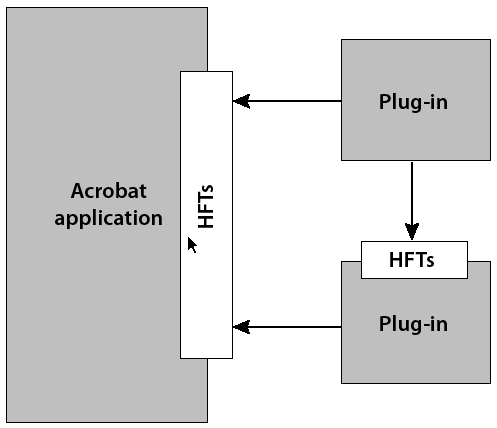
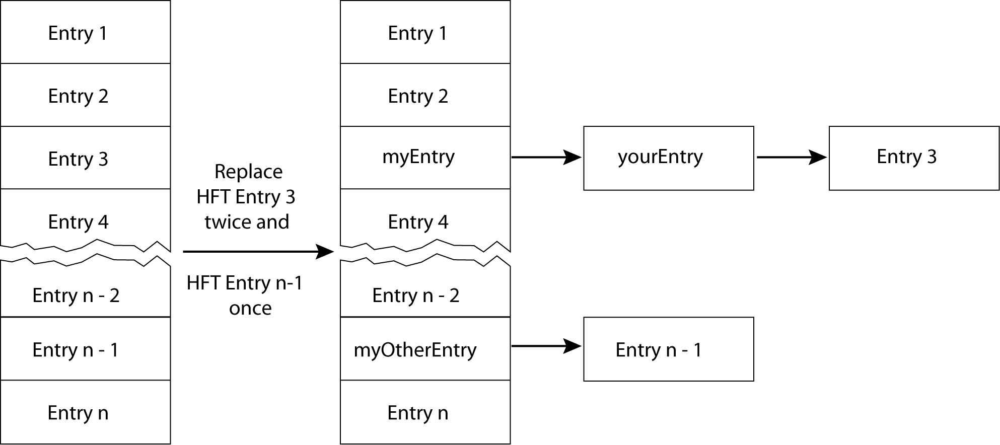

******************************************************
Working with Host Function Tables
******************************************************

A host function table (HFT) is the mechanism through which plugins and PDF Library applications invoke methods in Adobe Reader and Acrobat, as well as other plugins. Acrobat and Adobe Reader have HFTs containing pointers to all Acrobat core API methods. In addition, a plugin may create its own HFT to export its methods to other plugins. This chapter illustrates how to export and import HFTs.

About host function tables
==========================

An HFT is a table of function pointers where each HFT contains the following information:

-  A name
-  A version number
-  An array of one or more entries

Each entry represents a single method that a plugin can invoke, and is defined as a linked list of function pointers. Adobe Reader or Acrobat uses linked lists because some HFT entries may be marked so that they can be replaced by a plugin. Also, it is useful to keep a list of each implementation of a method that was replaced to allow methods to call the implementations they replaced.

The following diagram shows the relationship between Adobe Reader or Acrobat, other plugins, and HFTs.

Plugins must use the ``ASExtensionMgrGetHFT`` method to import each HFT they intend to use. A plugin requests an HFT by its name and version number. An HFT is imported during plugin initialization. (See `Importing HFTs and registering for notifications <Plugins_Pimech.html#50618406_19533>`__.)

When a plugin invokes a method in Adobe Reader, Acrobat, or another plugin, the function pointer at the appropriate location in the appropriate HFT is dereferenced and executed. Macros in the Acrobat SDK header files hide this functionality so that plugins contain only what appear to be normal function calls.

Each HFT is serviced by an HFT server. The HFT server is responsible for handling requests to obtain or destroy its HFT. As part of its responsibility to handle requests, an HFT server can choose to support multiple versions of the HFT. These versions generally correspond to versions of Acrobat, Adobe Reader or the plugin that exposes the HFT.

The ability to provide more than one version of an HFT improves backward-compatibility by allowing existing plugins to continue to work when new versions of Acrobat or Adobe Reader (or other plugins whose HFTs they use) become available. It is expected that HFT versions typically will differ only in the number, not the order, of methods they contain.

Exporting host function tables
==============================

You can use the Acrobat core API to export HFTs that result in a plugin's methods being available to other plugins. To export an HFT, perform the following tasks:

#. Create the HFT methods that you want to make available to other plugins.
#. Create HFT method definitions.
#. Create HFT callback functions.
#. Create new HFTs.

.. note::

   The remaining parts of this section examine each task in detail.

Creating HFT methods
--------------------

The first step in exporting HFTs is to create the methods that will be exported and made available to other plugins. For the purpose of this discussion, assume that the following three methods exist.

::

    ACCB1 void ACCB2 BeepOnceImplementation()
     {
         AVSysBeep (0);
         AVAlertNote ("In the BeepOnce method.");
     }
     ACCB1 void ACCB2 BeepTwiceImplementation()
     {
         AVSysBeep (0);
         AVSysBeep (0);
         AVAlertNote ("In the BeepTwice method.");
     }
     ACCB1 void ACCB2 BeepNTimesImplementation(ASInt32 numtimes)
     {
         ASInt32 i;
         for (i=0; i < numtimes; i++)
             AVSysBeep (0);
             AVAlertNote ("In the BeepNTimes method.");
     }

Creating HFT method definitions
-------------------------------

When you invoke a method in an HFT, the methods are accessed through a function pointer. Part of the process of defining a function pointer through which HFT methods are accessed is to create an enumeration that specifies the index of each method that you want to include within an HFT. The following enumeration enables indexing into the HFT. Note that the first element is not used.

::

    enum
     {
     DUMMYBLANKSELECTOR, /* 0 */
     BeepOnceSEL,    /* 1 */
     BeepTwiceSEL, /* 2 */
     BeepNTimesSEL, /* 3 */
     NUMSELECTORSPlusOne /* 4 */
     };

The indexes are called selectors, hence the ``SEL`` at the end of the method names. ``BeepOnce`` is at index 1; ``BeepTwice``, at index 2; and ``BeepNTimes``, at index 3. You can specify the number of indexes in the HFT by defining the following statement:

::

    #define NUMSELECTORS (NUMSELECTORSPlusOne - 1);

Also declare a global ``HFT`` object that is used in various tasks:

::

    extern HFT gMyHFT

For example, to define an HFT method name, you must specify an HFT object. (See `Defining an HFT method name <Plugins_Hft.html#50618412_60887>`__.)

Defining function prototypes
^^^^^^^^^^^^^^^^^^^^^^^^^^^^^^^^^^^^^^^

After you define an enumeration and an HFT object, you can define a function pointer for each method by using the following syntax:

::

    typdef ACCBPROTO1 return_type (ACCBPROTO2   *function_nameSELPROTO)(parameters);

The following table describes this syntax.

 

+-----------------------------------+----------------------------------------------+
|                                   | The return type of the HFT method            |
|                                   |                                              |
|    return_type                    |                                              |
+-----------------------------------+----------------------------------------------+
|                                   | The name of the HFT method                   |
|                                   |                                              |
|    function_name                  |                                              |
+-----------------------------------+----------------------------------------------+
|                                   | The HFT method's parameters with their types |
|                                   |                                              |
|    parameters                     |                                              |
+-----------------------------------+----------------------------------------------+

For example, to define a function pointer to the ``BeepNTimes`` method, specify the following syntax:

::

    typedef ACCBPROTO1 void (ACCBPROTO2 *BeepNTimesSELPROTO)(ASInt32 numtimes);

``ACCBPROTO1`` and ``ACCBPROTO2`` are macros whose definitions are platform-specific (for example, in Mac OS, ``ACCBPROTO1`` is defined as ``pascal`` ). ``BeepNTimesSELPROTO`` specifies a pointer to the ``BeepNTimes`` method. Without using these macros, you would have to use the following syntax:

::

    typedef void (*func)(ASInt32 numtimes);

Defining an HFT method name
^^^^^^^^^^^^^^^^^^^^^^^^^^^^^^^^^^^^^^^

You must specify a name for each method that is used to invoke the HFT method from other plugins. You can define an HFT method name by using the following syntax:

::

      #define method_name (*((method_nameSELPROTO)(HFTname [method_nameSEL])))

The following table describes this syntax.

.. _section-1:

 

+-----------------------------------+------------------------------------------------------------------------------------+
|                                   | The name of the HFT method that is used to invoke the method from external plugins |
|                                   |                                                                                    |
|    method_name                    |                                                                                    |
+-----------------------------------+------------------------------------------------------------------------------------+
|                                   | The name of the HFT object                                                         |
|                                   |                                                                                    |
|    HFTname                        |                                                                                    |
+-----------------------------------+------------------------------------------------------------------------------------+

For example, to define a method name for the ``BeepNTimesImplementation`` method, specify the following:

::

    #define BeepNTimes (*((BeepNTimesSELPROTO)(gMyHFT[BeepNTimesSEL])))

This macro defines the symbol ``BeepNTimes``, which is the HFT method name. ``gMyHFT[BeepNTimesSEL]`` is the function pointer obtained by indexing the HFT and ``BeepNTimesSELPROTO`` casts the pointer to the right type. The end result is that the method can be invoked by specifying the HFT method name:

::

    BeepNTimes(3);

HFT method names and the implementation method names must be different to avoid conflict between the ``#define`` statement and the corresponding method name.

Creating HFT callback functions
-------------------------------

You must create an HFT callback function in order to successfully export an HFT. It is recommended that you place the application logic to create an HFT callback in the ``PluginExportHFTs`` method. This is a handshaking method that enables your plugin to export an HFT. For information about handshaking, see `Handshaking <Plugins_Pimech.html#50618406_89824>`__.

To create an HFT callback function, declare an HFT ``ServerProvideHFTProc`` object that represents the callback:

::

    HFTServerProvideHFTProc provideMyHFTCallback

``HFTServerProvideHFTProc`` is a callback for an HFT server. After you create an ``HFTServerProvideHFTProc`` object, you can invoke the ``ASCallbackCreateProto`` macro to convert a user-defined function to an HFT callback function. For example, you can invoke ``ASCallbackCreateProto`` to convert a user-defined function named ``ProvideMyHFT`` to a callback function.

The ``ASCallbackCreateProto`` macro requires the following arguments:

-  The callback type. In this situation, specify ``HFTServerProvideHFTProc``.
-  The address of the user-defined function that you want to convert to a callback function.

The ``ASCallbackCreateProto`` macro returns a callback of the specified type that invokes the user-defined function whose address was passed as the second argument. The following lines of code show the ``ASCallbackCreateProto`` macro converting the ``ProvideMyHFT`` user-defined function to a ``PDWordProc`` callback.

::

    HFTServerProvideHFTProc provideMyHFTCallback =
     ASCallbackCreateProto(HFTServerProvideHFTProc, &ProvideMyHFT);

The callback function is invoked when another plugin attempts to use the HFT. After you create an HFT callback function, you can invoke the ``HFTServerNew`` method to obtain an HFT ``Server`` object, which is responsible for handling requests to obtain or destroy its HFT. An ``HFTServe`` r object is required in order to create a new ``HFT`` object.

The ``HFTServerNew`` method requires the following arguments:

-  A character pointer that specifies the name of the HFT server. An HFT server name is used to import the HFT. (See `Importing an existing HFT <Plugins_Hft.html#50618412_72145>`__.)
-  An ``HFTServerProvideHFTProc`` object that specifies the HFT callback function.
-  An ``HFTServerDestroyProc`` object that specifies the HFT callback function that releases memory from the HFT. This argument is optional and you can specify ``NULL``.
-  A pointer to user-supplied data to pass to the HFT server. This argument is optional and you can specify ``NULL``.

The following code example creates an HFT callback function within the ``PluginExportHFTs`` method. After the ``HFTServerProvideHFTProc`` object is created, the ``HFTServerNew`` method is invoked which creates an ``HFTServer`` object.

::

   ACCB1 ASBool ACCB2 PluginExportHFTs(void)
   {
   gMyHFT = NULL;
   gMyHFTServer = NULL;
   DURING

   //Create an HFT callback function
   //    provideMyHFTCallback = ASCallbackCreateProto(HFTServerProvideHFTProc,
     &ProvideMyHFT);
   

   //Create an HFT server
   //    gMyHFTServer = HFTServerNew("MyHFT", provideMyHFTCallback,
     NULL, NULL);
   HANDLER
     gSomethingWentWrong=1; 
     return false;
   END_HANDLER
   return true;
   }

.. note::

   In the previous code example, the ``gMyHFT``, ``gMyHFTServer``, and ``gSomethingWentWrong`` variables are declared as global variables. To view the complete code example, including the location of where these global variables are declared, see `Examining HFT header and source files <Plugins_Hft.html#50618412_55636>`__.

Creating new Host Function Tables
---------------------------------

You can create a new HFT by performing the following tasks within the HFT callback function that you define:

#. Create an ``HFT`` object by invoking the ``HFTNew`` method. This method requires an ``HFTServer`` object and the number of entries in the new HFT as arguments. The number of entries determines how many methods that the HFT contains. Each method occupies one entry.
#. Invoke the ``HFTReplaceEntry`` method to populate the entries in the ``HFT`` object with pointers to the HFT methods. This method requires the following arguments:

   -  An HFT object that you want to populate.
   -  The entry in the ``HFT`` object to replace. You can specify an index value that is specified in the enumeration that you created. For example, you can specify ``BeepTwiceSEL``. (See `Creating HFT method definitions <Plugins_Hft.html#50618412_49266>`__.)
   -  An ``HFTEntry`` object that represents a method that will become available through the HFT. You can, for example, reference the ``BeepTwiceImplementation`` method by passing the ``ASCallbackCreateReplacement`` method, as shown in the following example:

::

            ASCallbackCreateReplacement(BeepTwiceSEL,&BeepTwiceImplementation)

-  The new entry's properties. Currently, only ``HFTEntryReplaceable`` is defined.

You must invoke the ``HFTReplaceEntry`` method for each method that you expose through the HFT. For example, if you expose three methods through the HFT, then you invoke the ``HFTReplaceEntry`` method three times.

The following code example shows the syntax of the ``ProvideMyHFT`` method, which is the HFT callback function defined in the previous section. Within this method, a new HFT is created. For information about HFT callback methods, see `Creating HFT callback functions <Plugins_Hft.html#50618412_88064>`__.

::

   ACCB1 HFT ACCB2 ProvideMyHFT(HFTServer server, ASUns32 version,void *rock)
   {

   //Ensure version is 1
   //    if (version != 1)
         return NULL;
   
     DURING

   //Create a new HFT
   gMyHFT = HFTNew(gMyHFTServer, NUMSELECTORS);

   /*
   ** Replace the entries in the HFT
   ** with the methods that you want to make available.
   */
   HFTReplaceEntry (gMyHFT,

   BeepOnceSEL,ASCallbackCreateReplacement(BeepOnceSEL,&BeepOnce

   Implementation), 0);
         HFTReplaceEntry (gMyHFT,

   BeepTwiceSEL,ASCallbackCreateReplacement(BeepTwiceSEL,&BeepTwice

   Implementation), 0);
         HFTReplaceEntry (gMyHFT,

   BeepNTimesSEL,ASCallbackCreateReplacement(BeepNTimesSEL,&BeepNTimes

   Implementation), 0);
         
     HANDLER
             return NULL;
         
     END_HANDLER
   return gMyHFT;
   }

Examining HFT header and source files
-------------------------------------

To make it clear how to create HFTs, this section shows a typical header and source file that is used to create an HFT. All concepts that are discussed up to this point are shown.

Examining an HFT header file
^^^^^^^^^^^^^^^^^^^^^^^^^^^^^^^^^^^^^^^^^^^^

The following code example shows the syntax of a header file named myhft.h that is used to define HFT constructs.

::

   #include "corcalls.h"
   #include "avcalls.h"
   #include "coscalls.h"
   #include "pdcalls.h"
   #include "ascalls.h"
   
   enum
   {
   DUMMYBLANKSELECTOR,
   BeepOnceSEL,
   BeepTwiceSEL,
   BeepNTimesSEL,
   NUMSELECTORSPlusOne
   };
   extern HFT gMyHFT;
   
   #define NUMSELECTORS (NUMSELECTORSPlusOne - 1)
   
   typedef ACCBPROTO1 void (ACCBPROTO2 *BeepOnceSELPROTO)(void);
   
   #define BeepOnce (*((BeepOnceSELPROTO)(gMyHFT[BeepOnceSEL])))
   
   typedef ACCBPROTO1 void (ACCBPROTO2 *BeepTwiceSELPROTO)(void);
   
   #define BeepTwice (*((BeepTwiceSELPROTO)(gMyHFT[BeepTwiceSEL])))
   
   typedef ACCBPROTO1 void (ACCBPROTO2 *BeepNTimesSELPROTO)(ASInt32 numtimes);
   
   #define BeepNTimes (*((BeepNTimesSELPROTO)(gMyHFT[BeepNTimesSEL])))
   /* End of MyHFT.h */

Examining an HFT source file
^^^^^^^^^^^^^^^^^^^^^^^^^^^^^^^^^^^^^^^^^^^^^^^

The following code example shows the syntax of a source file used to create an HFT. Notice that the methods (``BeepOnceImplementation``, ``BeepTwiceImplementation``, and ``BeepNTimesImplementation`` ) that the HFT will make available to other plugins are defined. Also notice that the ``PluginExportHFTs`` method is defined. For information about this method, see `Importing HFTs and registering for notifications <Plugins_Pimech.html#50618406_19533>`__.

::

   #include "corcalls.h"
   #include "avcalls.h"
   #include "coscalls.h"
   #include "pdcalls.h"
   #include "ascalls.h"
   #include "myhft.h"
   

   //Declare global variables
   //   HFTServer gMyHFTServer = NULL;
   HFT gMyHFT = NULL;

   /* The implementation for the BeepOnce() function. Note it has a different name than the #define for the function in MyHFT.h */

   ACCB1 void ACCB2 BeepOnceImplementation ()
    
   {
   AVSysBeep (0);
   AVAlertNote ("In BeepOnceImplementation function.");
   }

  /* The implementation for the BeepTwice() function. Note it has a different name than the #define for the function in MyHFT.h*/
   //   ACCB1 void ACCB2 BeepTwiceImplementation()
    
   {
   AVSysBeep (0);
   AVSysBeep (0);
   AVAlertNote ("In BeepTwiceImplementation function.");
   }

   /* The implementation for the BeepNTimes() function. Note it has a
   ** different name than the #define for the function in MyHFT.h
   */
   ACCB1 void ACCB2 BeepNTimesImplementation (ASInt32 numtimes)
    
   {
     ASInt32 i;
     for (i=0; i < numtimes; i++)
         AVSysBeep (0);
         AVAlertNote ("In BeepNTimesImplementation function.");
   }

      /*
      ** Create a new HFT of NUMSELECTORS entries
      ** Then put the methods into the table via HFTReplaceEntry
      */
   ACCB1 HFT ACCB2 ProvideMyHFT(HFTServer server, ASUns32 version,void *rock)
    
   {
   ACCB1 HFT ACCB2 ProvideMyHFT(HFTServer server, ASUns32 version,void *rock)
   {
     //Ensure version is 1
     if (version != 1)
         return NULL;
   
     DURING
   
         //Create a new HFT
         gMyHFT = HFTNew(gMyHFTServer, NUMSELECTORS);
   
         /*
         ** Replace the entries in the HFT
         ** with the methods that you want to make available.
         */
         HFTReplaceEntry (gMyHFT,

   BeepOnceSEL,ASCallbackCreateReplacement(BeepOnceSEL,&BeepOnce

   Implementation), 0);
         HFTReplaceEntry (gMyHFT,

   BeepTwiceSEL,ASCallbackCreateReplacement(BeepTwiceSEL,&BeepTwice

   Implementation), 0);
         HFTReplaceEntry (gMyHFT,

   BeepNTimesSEL,ASCallbackCreateReplacement(BeepNTimesSEL,&BeepNTimes

   Implementation), 0);
         
     HANDLER
             return NULL;
     END_HANDLER
     return gMyHFT;
   }

   /*
   ** Called by viewer to set up for exporting an HFT. This method
   ** creates a new HFT server and provides a callback that provides the HFT.
   */
   ACCB1 ASBool ACCB2 PluginExportHFTs(void)
    
   {
   gMyHFTServer = NULL;
   DURING
   

   //Create an HFT callback function
   //    HFTServerProvideHFTProc provideMyHFTCallback =
     ASCallbackCreateProto(HFTServerProvideHFTProc, &ProvideMyHFT);
     

   //Create an HFT server
   //    gMyHFTServer = HFTServerNew("MyHFT", provideMyHFTCallback,NULL, NULL);
     
   HANDLER
     return false;
   END_HANDLER
   return true;
   }

Importing an existing HFT
=========================

You must import an existing HFT to invoke methods that are exposed through the HFT. To import an existing HFT, you must invoke the ``ASExtensionMgrGetHFT`` method within the ``PluginImportReplaceAndRegister`` handshaking method. The ``ASExtensionMgrGetHFT`` method requires the following arguments:

-  An ``ASAtom`` object that specifies the HFT server that corresponds to the HFT to import
-  An ``ASVersion`` object that specifies the version of the HFT

The ``ASExtensionMgrGetHFT`` method returns an ``HFT`` object. The following code example shows the ``PluginImportReplaceAndRegister`` handshaking method that contains application logic that imports the ``MyHFT`` HFT.

::

   ACCB1 ASBool ACCB2 PluginImportReplaceAndRegister(void)
   {
     gMyHFT = ASExtensionMgrGetHFT(ASAtomFromString("MyHFT"), 1);
     return (gMyHFT != NULL);
   }

.. note::

   Both the exporting and importing plugins must be located in Acrobat or Adobe Reader's plugins directory. If the exporting plugin is not located in this directory, the importing plugin cannot successfully import an HFT.

Invoking HFT methods
====================

After you import an HFT, you can invoke a method that it has made available. For example, after you import the ``MyHFT`` HFT, you can invoke the following methods:

-  ``BeepOnce``
-  ``BeepTwice``
-  ``BeepNTimes``

However, you must include the header file that defines the HFT method name in the source file in which an HFT method is invoked. Because the above methods are declared in a header file named myhft.h, you must specify the following statement to successfully invoke these methods:

::

    #include "myhft.h"

If you do not include the appropriate header file, you will receive a compile error.

Replacing HFT methods
=====================

You can use the Acrobat core API to replace methods that are located in existing HFTs. For example, a plugin could use this mechanism to change the appearance of all alert boxes displayed by Acrobat or Adobe Reader, or to override file opening behavior.

The following table lists all the replaceable Acrobat and Adobe Reader methods.

+-----------------------------------+-----------------------------------+
| ``AVAlert``                       | ``AVAppCanQuit``                  |
+-----------------------------------+-----------------------------------+
| ``AVAppChooseFolderDialog``       | ``AVAppHandleAppleEvent``         |
+-----------------------------------+-----------------------------------+
| ``AVAppOpenDialog``               | ``AVAppSaveDialog``               |
+-----------------------------------+-----------------------------------+
|                                   |                                   |
|                                   |                                   |
|    AVDocClose                     |    AVDocDoPrint                   |
+-----------------------------------+-----------------------------------+
| ``AVDocDoSave``                   | ``AVDocDoSaveAs``                 |
|                                   |                                   |
|                                   | (not replaceable in Adobe Reader) |
+-----------------------------------+-----------------------------------+
| ``AVDocDoSaveAsWithParams``       | ``AVDocOpenFromASFileWithParams`` |
|                                   |                                   |
| (not replaceable in Adobe Reader) |                                   |
+-----------------------------------+-----------------------------------+
| ``AVDocPrintPages``               | ``AVDocPrintPagesWithParams``     |
+-----------------------------------+-----------------------------------+
| ``AVPageViewGetNextView``         | ``PDDocSave``                     |
|                                   |                                   |
|                                   | (not replaceable in Adobe Reader) |
+-----------------------------------+-----------------------------------+
| ``PDDocSaveWithParams``           |                                   |
|                                   |                                   |
| (not replaceable in Adobe Reader) |                                   |
+-----------------------------------+-----------------------------------+

To replace one of these methods, a plugin invokes the ``HFTReplaceEntry`` method. In some cases, when the replacement method is finished executing, it should invoke the previous implementation of the method, using the ``CALL_REPLACED_PROC`` macro, to allow previously-registered implementations of the method (including Acrobat and Adobe Reader's built-in implementation) to execute. Previous implementations of the method are not invoked automatically; it is up to the replacement implementation to invoke them.

When you replace an Acrobat HFT method, the replaced method is available from other plugins. For example, assume you replace the ``AVAlert`` method. When other plugins invoke the ``AVAlert`` method, the replacement version of ``AVAlert`` is invoked.

When an HFT entry is replaced, the entry's linked list is updated so that the newly-added implementation is at the head of the linked list. Previous implementations, if any, follow in order, as shown in the following diagram.

To replace an HFT method, perform the following tasks:

-  Invoke the ``ASCallbackCreateReplacement`` macro to create the callback pointer.
-  Invoke the ``REPLACE`` macro to replace the desired method and pass the following arguments:

   -  The ``HFT`` object in which the method is replaced.
   -  The entry in the HFT to replace. Append SEL to the method's name. For example, to replace the ``AVAppCanQuit`` method, specify ``AVAppCanQuitSEL``.
   -  The address of the replacement method.

The following example shows how to replace the ``AVAppCanQuit`` method with a custom method named ``MyAvAppCanQuit``. The ``MyAVAppCanQuit`` method's arguments and return value are identical to those of the ``AVAppCanQuit`` method. Replaceable methods must be replaced with methods that have the same arguments and return type.

The first statement in the following code example initializes a global pointer named ``gMyAVAppCanQuitPtr`` to your replacement method. You can use this pointer to invoke the original method. For example, you can invoke your replacement method to exhibit custom functionality and then invoke the original method. To invoke the original method, use the ``CALL_REPLACED_PROC`` macro and pass the pointer to your replacement method. For more information about this macro, see the `Acrobat and PDF Library API Reference <https://www.adobe.com/go/apireference>`__.

::

   void* gMyAVAppCanQuitPtr = NULL;

   /*
   ** A function that informs the application whether it's OK to quit.
   ** When quitting, only allow exit when all docs are closed.
   */
   
   //   ACCB1 ASBool ACCB2 MyAVAppCanQuit (void)
   {
   if (AVAppGetNumDocs () == 0)
     return true;
   else
     return false;
   }
   void ReplaceAVAppCanQuit ()
   {
   DURING

   //Create the callback
   //   gMyAVAppCanQuitPtr =
   ASCallbackCreateReplacement (AVAppCanQuitSEL,
   &MyAVAppCanQuit);
   

   //Invoke the Replace macro
   //   REPLACE (gMyHFT, AVAppCanQuitSEL, gMyAVAppCanQuitPtr);
   
   HANDLER
     AVAlertNote("Trying to replace AVAppCanQuit");
   END_HANDLER
   }

.. note::

   In the previous code example, an ``HFT`` object named ``gMyHTF`` is passed to the ``REPLACE`` macro. To execute this example, you must create this object. (See `Exporting host function tables <Plugins_Hft.html#50618412_31298>`__.)

Migrating non-HFT PDF Library applications to HFT applications
==============================================================

In previous versions of Acrobat, a PDF Library application did not support use of HFTs. However, as of Acrobat 8, PDF Library applications are able to link to the PDF Library DLL file using HFTs. As a result, the PDF Library API is more closely aligned to the Acrobat core API.

You can migrate existing non-HFT PDF Library applications to HFT PDF Library applications by performing the following tasks:

#. Change your project settings from ``PRODUCT`` ``=`` "``Library.h`` " to ``PRODUCT`` ``=`` "``HFTLibrary.h`` " (the header files include the necessary code to translate from direct calls into calls though HFTs).
#. Add the following files to your PDF Library application: PDFLInitHFT.c and PDFLInitCommon.c.
#. Compile and link your project with the new source files (PDFLInitHFT.c and PDFLInitCommon.c).
#. Invoke the ``PDFLInitHFT`` method instead of the ``PDFLInit`` to initialize the HFT mechanism and the PDF Library. The PDFLInitHFT method is defined in PDFLInitHFT.c file and the prototype for this function is defined in PDFInit.h along with the prototype for the ``PDFLInit`` method. The ``PDFLInitHFT`` method can be called more than once and a count of the initializations will be maintained by PDF Library.
#. Invoke the ``PDFLTermHFT`` method instead of the ``PDFLTerm`` method to shutdown the HFT mechanism and PDF Library. The ``PDFLTermHFT`` method is defined in the PDFLInitHFT.c file. The prototype for this function is defined in the PDFInit.h file along with the prototype of the ``PDFLTerm`` method. In case of multiple initializations, the library shuts down after the number of terminations matches the number of initializations.

The following table lists PDF Library API methods that should be changed to newer methods when working with HFTs.

.. _section-3:

+-----------------------------------+-----------------------------------+
| Old method                        | New method                        |
+===================================+===================================+
|                                   |                                   |
|                                   |                                   |
|    ASSecs                         |    ASGetDefaultFileSysForPath     |
+-----------------------------------+-----------------------------------+
|                                   |                                   |
|                                   |                                   |
|    ASPushExceptionFrame           |    ACPushExceptionFrame           |
+-----------------------------------+-----------------------------------+
|                                   |                                   |
|                                   |                                   |
|    ASPopExceptionFrame            |    ACPopExceptionFrame            |
+-----------------------------------+-----------------------------------+
|                                   |                                   |
|                                   |                                   |
|    ASGetExceptionErrorCode        |    ACGetExceptionErrorCode        |
+-----------------------------------+-----------------------------------+

.. note::

   Other PDF Library API methods will work as is without any code change.

