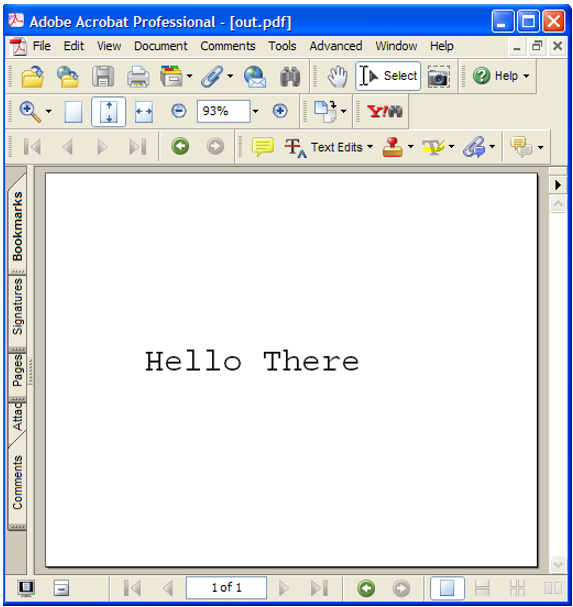

******************************************************
Inserting Text into PDF Documents
******************************************************

As stated earlier in this guide, the PDF Library API is a subset of the Acrobat core API that enables your application to interact and manipulate PDF documents. The PDF Library API is not used to create plugins for Adobe Reader or Acrobat. It is also not used to modify the user interface of Adobe Reader or Acrobat, such as by adding a toolbar or menu item.

You can use the PDF Library API to programmatically insert text into a PDF document. This functionality is useful for dynamically updating a PDF document with information obtained during run-time. You can insert text into a PDF document by performing the following tasks:

#. Create a new PDF document.
#. Create a new page and insert it into the PDF document.
#. Create a container for the page content.
#. Acquire a font and set its attributes.
#. Insert the text element into page content.
#. Convert content into resource and content objects.
#. Place resource and content objects onto the page.
#. Save the PDF document.
#. Release all objects.

.. note::

   Assume that all code examples specified in this chapter are located in an entry function named ``MainProc``.

Creating a new PDF document
=================================

You can programmatic-ally create a new PDF document by invoking the ``PDDocCreate`` method. This method returns a ``PDDoc`` object that only contains one COS object, which is a Catalog. For information about COS objects, see `Working with Cos Objects <Plugins_Cos.html#50618418_86959>`__.

The following code example creates a ``PDDoc`` object by invoking ``PDDocCreate`` method.

::

   PDDoc pdDoc ; 
   pdDoc = DDocCreate(); 

Creating a new page
=============================

You can create a new page by invoking the ``PDDocCreatePage`` method. However, before invoking this method, set the page size by creating an ``ASFixedRect`` object, which represents a rectangle region that specifies the page size. After you declare an ``ASFixedRect`` object, you can specify the page size by setting the ``ASFixedRect`` object's ``left``, ``top``, ``right``, and ``bottom`` attributes.

Next, invoke the ``PDDocCreatePage`` method and pass the following arguments:

-  A ``PDDoc`` object that was created.
-  An ``ASInt32`` value that specifies the page number after which the new page is inserted. Specify ``PDBeforeFirstPage`` to insert the new page at the beginning of the PDF document.
-  An ``ASFixedRect`` object that specifies the page size.

This method returns a ``PDPage`` object. The following code example creates a new page, sets it size, and inserts it into the PDF document represented by the ``PDDoc`` object.

::

   PDPage pdPage;
   ASFixedRect mediaBox;
   
   //Set the page size
   mediaBox.left = fixedZero;
   mediaBox.top = Int16ToFixed(4*72);
   mediaBox.right = Int16ToFixed(5*72);
   mediaBox.bottom = fixedZero;
   
   //Create a page and insert it as the first page
   PDPagepdPage = PDDocCreatePage(pdDoc, PDBeforeFirstPage, mediaBox);

Creating a container
=================================

To insert text into a PDF document, you must create a PDF container. A container contains the modifiable contents of a PDF page. To create a PDF container, invoke the ``PDPageAcquirePDEContent`` method and pass the following arguments:

-  A ``PDPage`` object.
-  An ``ASExtension`` object that represents the caller. If you invoke this method from a PDF Library project, you can pass ``NULL``. In contrast, if you invoke this method from a plugin, you would pass the ``gExtensionID`` extension.

The ``PDPageAcquirePDEContent`` method returns a ``PDEContent`` object, as shown in the following code example.

::

   PDEContent pdeContent;
   pdeContent = PDPageAcquirePDEContent(pdPage, NULL);

Acquiring fonts
===========================

You must acquire the font that you will use to insert text into a PDF document. You can reference a font that is installed on the host computer by creating a ``PDSysFont`` object and use this object to create a ``PDEFont`` object, which represents the font that is used to draw text on a page. To acquire a font, perform the following tasks:

#. Create a ``PDEFontAttrs`` object.
#. Allocate the size of the ``PDEFontAttrs`` object's buffer by using the ``memset`` method.
#. Set the ``PDEFontAttrs`` object's ``name`` and ``type`` attributes. The ``name`` attribute defines the font name. For example, you can specify ``CourierStd``. The ``type`` attribute defines the font subtype. For example, you can specify ``Type1``, which is a Type 1 PostScript font. For information about valid font subtype values, see the `Acrobat and PDF Library API Reference <https://www.adobe.com/go/apireference>`__.
#. Create a ``PDSysFont`` object by invoking the ``PDFindSysFont`` method and passing the following arguments:

   -  The address of the ``PDEFontAttrs`` object.
   -  Size of the ``PDEFontAttrs`` object in bytes.
   -  A value that specifies a ``PDSysFontMatchFlags`` value. (See the `Acrobat and PDF Library API Reference <https://www.adobe.com/go/apireference>`__.)

#. Create a ``PDEFont`` object that represents the font to use within a PDF document by invoking the ``PDEFontCreateFromSysFont`` method and passing the following arguments:

   -  A ``PDSysFont`` object that references a system font.
   -  An ``ASUnit32`` value that indicates whether to embed the font or whether to subset the font. You can pass ``kPDEFontDoNotEmbed`` to this argument. For information about other values, see the `Acrobat and PDF Library API Reference <https://www.adobe.com/go/apireference>`__.

The following code example acquires a font that is used to draw text on a page.

::

   PDSysFont sysFont;
   PDEFont pdeFont; 
   
   //Set the size of the PDSysFont and set its attributes
   memset(&pdeFontAttrs, 0, sizeof(pdeFontAttrs));
   pdeFontAttrs.name = ASAtomFromString("CourierStd");
   pdeFontAttrs.type = ASAtomFromString("Type1");
   
   //Get system font
   sysFont = PDFindSysFont(&pdeFontAttrs, sizeof(PDEFontAttrs), 0);
   
   //Create a font that is used to draw text on a page
   pdeFont = PDEFontCreateFromSysFont(sysFont, kPDEFontDoNotEmbed);

Creating a PDEGraphicState object
============================================

You must create a ``PDEGraphicState`` object that is used to define attributes of the ``PDEText`` object. After you create a ``PDEGraphicState`` object, set the following attributes:

* **strokeColorSpec**: The stroke color specification. The default value is ``DeviceGray``.
* **miterLimit**: The miter limit, corresponding to the M (setmiterlimit) operator. The default value is ``fixedTen``.
* **flatness**: The line flatness corresponding to the i (setflat) operator. The default value is ``fixedZero``.
* **lineWidth**: The line width corresponding to the w (setlinewidth) operator. The default value is ``fixedOne``.

For more information about attributes that belong to this object, see the `Acrobat and PDF Library API Reference <https://www.adobe.com/go/apireference>`__.

The following code example creates a ``PDEGraphicState`` object and sets it attributes.

::

   //Create a DEGraphicState object and set its attributes
   PDEGraphicState gState;
   PDEColorSpace pdeColorSpace = PDEColorSpaceCreateFromName(ASAtomFromString("DeviceGray"));
   memset(&gState, 0, sizeof(PDEGraphicState));
   gState.strokeColorSpec.space = gState.fillColorSpec.space = pdeColorSpace;
   gState.miterLimit = fixedTen;
   gState.flatness = fixedOne;
   gState.lineWidth = fixedOne;

Creating an ASFixedMatrix object
=========================================

Create an ``ASFixedMatrix`` object that represents the transformation matrix for the text. By creating this object, you can set text properties such as the font size and the width and height of the text. The following code example creates an ``ASFixedMatrix`` object and sets its attributes.

::

   //Create an ASFixedMatrix object
   memset(&textMatrix, 0, sizeof(textMatrix));    /* Set the buffer size */
   textMatrix.a = Int16ToFixed(24);     /* Set font width and height */
   textMatrix.d = Int16ToFixed(24);     /* to 24 point size       */
   textMatrix.h = Int16ToFixed(1*72);   /* x,y coordinate on page */
   textMatrix.v = Int16ToFixed(2*72);   /* in this case, 1" x 2"  */

Inserting text
============================

You can insert text into the PDF document by performing the following tasks:

#. Create a ``PDEText`` object by invoking the ``PDETextCreate`` method. This method does not require arguments.
#. Invoke the ``PDETextAdd`` method and pass the following arguments:

   -  A ``PDEText`` object that you created.
   -  A ``PDETextFlags`` value that specifies the type of text to add. Specify ``kPDETextRun`` for a text run.
   -  An ``ASInt32`` value that specifies the index after which to add the text run. You can specify ``0`` to add the text run to the beginning.
   -  A character pointer that specifies the text to insert into the PDF document.
   -  An ``ASInt32`` value that specifies the length of the text run.
   -  The ``PDEFont`` object that you created. (See `Acquiring fonts <Plugins_Insertext.html#50618411_68991>`__.)
   -  The address of the ``PDEGraphicState`` object that you created. (See `Creating a PDEGraphicState object <Plugins_Insertext.html#50618411_19751>`__.)
   -  The size of the ``PDEGraphicState`` object. You can use the ``sizeof`` method to get this information.
   -  The address of the ``PDETextState`` object. You can pass ``NULL``.
   -  The size of the ``PDETextState`` object.
   -  The address of the ``ASFixedMatrix`` object that you created. (See `Creating an ASFixedMatrix object <Plugins_Insertext.html#50618411_76571>`__.)
   -  The address of the ``ASFixedMatrix`` object that holds the matrix for the line width when stroking text. It is recommended that you pass ``NULL``.

3. Insert text into the page content by invoking the ``PDEContentAddElem`` method and passing the following arguments:

   -  The ``PDEContent`` object that you created. (See `Creating a container <Plugins_Insertext.html#50618411_53549>`__.)
   -  The location to where the text is added. Pass ``kPDEAfterLast`` to add the text to the end of the ``PDEContent`` object.
   -  The ``PDEText`` object and cast this object to ``PDEElement``.

4. Set the page's ``PDEContent`` back into the page by invoking the ``PDPageSetPDEContent`` method and passing the following arguments:

   -  A ``PDPage`` object that you created. (See `Creating a new page <Plugins_Insertext.html#50618411_72186>`__.)
   -  An ``ASExtension`` object that represents the caller. If you invoke this method from a PDF Library project, you can pass ``NULL``. In contrast, if you invoke this method from a plugin, you would pass the ``gExtensionID`` extension.

::

   //Create a PDEText object
   pdeText = PDETextCreate();
   
   //Create a character pointer
   char *HelloWorldStr = "Hello There";
   
   //Create new text run 
   PDETextAdd(pdeText,          //Text container to add to  
         kPDETextRun,            // kPDETextRun
         0,                       // index 
         HelloWorldStr,         // Text to add   
         strlen(HelloWorldStr),// Length of text
         pdeFont,                 // Font to apply to text 
         &gState,                 //Address of PDEGraphicState object
         sizeof(gState),               //Size of graphic state to apply to text
         NULL,
         0,                    
         &textMatrix,             //Transformation matrix for text  
         NULL);                    //Stroke matrix  
   
   //Insert text into page content 
   PDEContentAddElem(pdeContent, kPDEAfterLast, (PDEElement) pdeText);

Saving the PDF document
====================================

You can save the PDF document by invoking the ``PDDocSave`` method and passing the following arguments:

-  A ``PDDoc`` object that represents the PDF document.
-  A ``PDSaveFlags`` object that specifies save options. For example, you can pass ``PDSaveFull`` to this argument, which results in the entire document being saved. For more information about this parameter, see the `Acrobat and PDF Library API Reference <https://www.adobe.com/go/apireference>`__.
-  An ``ASPathName`` object that represents the path to which the file is saved.
-  An ``ASFileSys`` object that represents the file system. (See `Creating an ASFileSys object <Plugins_Unicode.html#50618402_67382>`__.)
-  A progress monitor value. Invoke the ``AVAppGetDocProgressMonitor`` method to obtain the default. You can pass ``NULL``, in which case no progress monitor is used.
-  The address of a ``progMonClientData`` object that contains user-supplied data to pass to ``progMon`` each time it is called. Pass ``NULL`` if the previous argument (progMon) is ``NULL``.

::

   //Save the PDF document
   #if !MAC_ENV
     PDDocSave(pdDoc, PDSaveFull | PDSaveLinearized,ASPathFromPlatformPath

   ("out.pdf"), NULL, NULL, NULL);
   #else
     ASPathName macPath = GetMacPath("out.pdf");
     PDDocSave(pdDoc, PDSaveFull | PDSaveLinearized, macPath, NULL, NULL, NULL);
     ASFileSysReleasePath(NULL,macPath);

Examining a PDFL app source file
===============================================

This section shows the entire source file that is responsible for importing text into a PDF document.

The following image shows the PDF that is created when this source file is executed.

::

   #ifdef MAC_ENV
   #include <Carbon/Carbon.h>
   #else
   #include <sys/types.h>
   #include <sys/stat.h>
   #endif
   
   #include <stdio.h>
   #include <stdlib.h>
   #include <string.h>
   #include <fcntl.h>
   
   #include "PDFInit.h"
   #include "CosCalls.h"
   #include "CorCalls.h"
   #include "ASCalls.h"
   #include "PDCalls.h"
   #include "PSFCalls.h"
   #include "PERCalls.h"
   #include "PEWCalls.h"
   #include "PIExcept.h"
   #include "PagePDECntCalls.h"
   
   #ifdef MAC_ENV 
   #include "macUtils.h"
   #endif
   
   void MainProc(void)
   {
     char buf[256];
     ASInt32 i;
     ASBool b;
     PDDoc pdDoc;               /* Reference to a PDF document  */
     PDPage pdPage;             /* Reference to a page in doc */
     PDEContent pdeContent;    /* Container for page content */
     ASFixedRect mediaBox;     /* Dimensions of page */
     PDSysFont sysFont;              /* Used by PDEFont creation */
     PDEFont pdeFont;           /* Reference to a font used on a page */
     PDEFontAttrs pdeFontAttrs; /* Font attributes    */
     PDEText pdeText;            /* Container for text */
     ASFixedMatrix textMatrix;  /* Transformation matrix for text */
     PDEColorSpace pdeColorSpace; /* ColorSpace */
     PDEGraphicState gState;    /* Graphic state to apply to operation */
     char *HelloWorldStr = "Hello There"; // Text to write to the PDF
   #ifdef MAC_ENV
     ASPathName macPath;
   #endif
   
   
   /*==================================================================*
                     Create the doc, page, and content container                 
   *==================================================================*/
   
   DURING
   
     pdDoc = PDDocCreate();                    /* Create new document  */
   
     mediaBox.left   = fixedZero;              /* Dimensions of page   */
     mediaBox.top    = Int16ToFixed(4*72);    /* In this case 5" x 4" */
     mediaBox.right  = Int16ToFixed(5*72);
     mediaBox.bottom = fixedZero;
   
     //Create a page with those dimensions and insert it as the first page
     pdPage = PDDocCreatePage(pdDoc, PDBeforeFirstPage, mediaBox);
   
     //Acquire a PDEContent container for the page
     pdeContent = PDPageAcquirePDEContent(pdPage, NULL);
   
   /*==================================================================*
         Acquire a font, add text, and insert into page content container 
   *==================================================================*/
   
     //Set the size of the PDSysFont and set its attributes
     memset(&pdeFontAttrs, 0, sizeof(pdeFontAttrs));
     pdeFontAttrs.name = ASAtomFromString("CourierStd");
     pdeFontAttrs.type = ASAtomFromString("Type1");
   
     sysFont = PDFindSysFont(&pdeFontAttrs, sizeof(PDEFontAttrs), 0);
     pdeFont = PDEFontCreateFromSysFont(sysFont, kPDEFontDoNotEmbed);
   
     /* The following code sets up the default graphics state.  We do this so that
      * we can free the PDEColorSpace objects
      */
     
     //PDEColorSpace pdeColorSpace; /* ColorSpace */
     //PDEGraphicState gState;    /* Graphic state to apply to operation */
   
     //Create a PDEGraphicState object and set its attributes
     pdeColorSpace = PDEColorSpaceCreateFromName(ASAtomFromString("DeviceGray"));
     memset(&gState, 0, sizeof(PDEGraphicState));
     gState.strokeColorSpec.space = gState.fillColorSpec.space = pdeColorSpace;
     gState.miterLimit = fixedTen;
     gState.flatness = fixedOne;
     gState.lineWidth = fixedOne;
   
     //Create an ASFixedMatrix object
     memset(&textMatrix, 0, sizeof(textMatrix));    /* Set the buffer size */
     textMatrix.a = Int16ToFixed(24);     /* Set font width and height */
     textMatrix.d = Int16ToFixed(24);     /* to 24 point size       */
     textMatrix.h = Int16ToFixed(1*72);   /* x,y coordinate on page */
     textMatrix.v = Int16ToFixed(2*72);   /* In this case, 1" x 2"  */
     
     //Create a PDEText object
     pdeText = PDETextCreate();           /* Create new text run    */
     
     PDETextAdd(pdeText,       /* Text container to add to  */
         kPDETextRun,          /* kPDETextRun, kPDETextChar */
         0,                    /* Index */
         HelloWorldStr,        /* Text to add    */
         strlen(HelloWorldStr),/* Length of text */
         pdeFont,              /* Font to apply to text */
         &gState, 
         sizeof(gState),        /* Graphic state to apply to text  */
         NULL,
         0,                     /* Text state and size of structure*/
         &textMatrix,           /* Transformation matrix for text  */
         NULL);                 /* Stroke matrix  */
   
     /* Insert text into the page content */
     PDEContentAddElem(pdeContent, kPDEAfterLast, (PDEElement) pdeText);
   
   
   /*==================================================================*
             Convert to objects, add to page, and release resources
   *==================================================================*/
   
     /* Set the PDEContent for the page */
     b = PDPageSetPDEContent(pdPage, NULL);
   
     /* Save document to a file */
   #if !MAC_ENV
     PDDocSave(pdDoc, PDSaveFull | PDSaveLinearized,ASPathFromPlatformPath

   ("out.pdf"), NULL, NULL, NULL);
   #else
     macPath = GetMacPath("out.pdf");
     PDDocSave(pdDoc, PDSaveFull | PDSaveLinearized, macPath, NULL, NULL, NULL);
     ASFileSysReleasePath(NULL,macPath);
   #endif
   
   
     //Release all objects 
     PDERelease((PDEObject) pdeFont);
     PDERelease((PDEObject) pdeText);
     i = PDPageReleasePDEContent(pdPage, NULL);
     PDERelease((PDEObject)pdeColorSpace);
     PDPageRelease(pdPage);
     PDDocRelease(pdDoc);
   
   HANDLER
     ASGetErrorString(ERRORCODE, buf, sizeof(buf));
     fprintf(stderr, "Error code: %ld, Error Message: %sn", ERRORCODE, buf);
     exit (-1);
   END_HANDLER
   }
   
   #define INCLUDE_MYPDFLIBAPP_CPP   1
   #include "MyPDFLibApp.cpp"
   #undef INCLUDE_MYPDFLIBAPP_CPP

