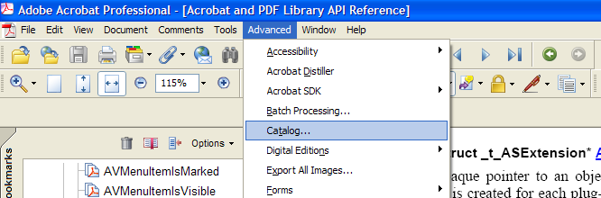

******************************************************
Creating Menus and Menu Commands
******************************************************

The Acrobat core API supports creating new menu commands and modify existing menus. A menu command lets a user interact with your plugin by clicking a menu command that is displayed in an Adobe Reader or Acrobat menu. When the user clicks the menu command, application logic that is defined in the callback function associated with the menu command is executed. It is your responsibility to define the application logic that is located in the callback function.

About menus
===========

Adobe Reader and Acrobat have a standard menu bar and menu that let a user invoke specific functionality. You can, for example, click the Open command that is located on the File menu to open an existing PDF file. Using the Acrobat core API, you can programmatic-ally modify the menu bar. The following illustration shows the menu bar located in Acrobat.

====== =====================
Letter Description
====== =====================
A      The Acrobat menu bar.
B      An Acrobat menu.
C      A menu command.
====== =====================

About AVmenubar typedefs
------------------------

An ``AVmenubar`` typedef represents the menu bar located within Adobe Reader or Acrobat and contains a list of all menus. A plugin can only have one ``AVmenubar`` object. You can add new menus to the menu bar, remove menus from the menu bar, or hide the menu bar by using the Acrobat core API.

About AVMenu typedefs
---------------------

An ``AVMenu`` typedef represents a menu in the Adobe Reader or Acrobat menu bar. You can create new menus, add menu commands to a menu, and remove menu items. Deleting an ``AVMenu`` removes it from the menu bar (if it was attached) and deletes all the menu items it contains.

Submenus (also called pull right menus) are ``AVMenu`` objects that are attached to an ``AVMenuItem`` object instead of to the menu bar.

Each menu has a title and a language-independent name. The title is the string that appears in the user interface, while the language-independent name is the same regardless of the language used in the user interface. Language-independent names enable a plugin to locate a specific menu, such as the File menu, without knowing, for example, that it is called Fichier in French.

You are strongly encouraged to begin your language-independent menu names with the plugin name (separated by a colon) to avoid name collisions when more than one plugin is present. For example, if a plugin is named myPlug, it may add a menu whose name is ``myPlug:Options``. (See `Using plugin prefixes <Plugins_Pimech.html#50618406_30769>`__.)

About AVMenuItem typedefs
-------------------------

An ``AVMenuItem`` is a menu command within a menu. It contains the following attributes:

-  A name
-  A keyboard shortcut
-  A callback function to execute when the menu item is selected
-  A callback function to compute whether the menu item is enabled
-  A callback function to compute whether the menu item is check marked, and whether it has a submenu

An ``AVMenuItem`` object can also serve as a separators between menu commands. You are encouraged to position your plugin menu commands relative to a separator. This helps ensure that if a block of menu commands is moved in a future version of Acrobat, your plugin menu commands also are moved.

A plugin can simulate a user selecting a menu command by invoking the ``AVMenuItemExecute`` method. If the menu command is disabled, the ``AVMenuItemExecute`` method returns without performing a task. The ``AVMenuItemExecute`` method works even when the menu item is not displayed (for example, if it has not been attached to a menu or if the menu bar is not visible). You can set the attributes of all menu commands that you create; however, do not modify the ``Execute`` procedure of the Acrobat built-in menu commands.

Your plugin can specify menu command names using either the names seen by a user, or language-independent names. The latter allows your plugin to locate a specific menu command without knowing, for example, that it is called Imprimer in French.

You are strongly encouraged to avoid name collisions when naming menu commands by using your plugin name and a colon. For example, if a plugin is named ``myPlug``, you can name a menu command ``myPlug:Open`` or ``myPlug:Find``. (See `Using plugin prefixes <Plugins_Pimech.html#50618406_30769>`__.)

Adding menu commands to menus
=============================

You can use the Acrobat core API to add a new menu command to an existing menu. For example, you can add a menu named Acrobat SDK to the Adobe Reader or Acrobat menu bar.

To add a new menu command to an existing menu, perform the following tasks:

#. Retrieve the Adobe Reader or Acrobat menu bar that is represented by an ``AVmenubar`` object by invoking the ``AVAppGetMenubar`` method.

::

    AVMenubar Themenubar = AVAppGetMenubar(); 

2. Retrieve the menu that will contain the new menu command by invoking the ``AVMenubarAcquireMenuByName`` method and passing the following arguments:

   -  An ``AVmenubar`` object that represents the menu bar.
   -  The name of the menu. For example, to reference the File menu, specify ``File``.

This method returns an ``AVMenu`` object that corresponds to the specified menu name.

::

      AVMenu 
   FileMenu = AVmenubarAcquireMenuByName (Themenubar, "File");

If the menu does not exist, you can programmatically create it (see the next step).

3. If necessary, programmatically create a new menu by invoking the ``AVMenuNew`` method and passing the following arguments:

   -  A string value that represents the text displayed in Adobe Reader or Acrobat.
   -  A unique, language-independent name for the menu. (See `Using plugin prefixes <Plugins_Pimech.html#50618406_30769>`__.)
   -  An ``ASExtension`` value that registers the menu. (See the `Acrobat and PDF Library API Reference <https://www.adobe.com/go/apireference>`__.)

The ``AVMenuNew`` method returns an instance of ``AVMenu``.

::

        AVMenu NewMenu = AVMenuNew ("Acrobat SDK", "ADBE:Acrobat_SDK",
         gExtensionID); 

After you create a new menu, you must attach it to the menu bar. (See `Adding a menu command to a new menu <Plugins_Menu.html#50618409_95514>`__.)

4. Create a new menu command by invoking the ``AVMenuItemNew`` method and passing the following arguments:

   -  A string value that represents the menu command's text. On Windows only, you can specify a keyboard shortcut by including an ampersand character (&) in the title.[I wonder whether an example would help here.] In Acrobat or Adobe Reader, an underscore character (_) is placed under the character following the ampersand ( *char* ).[I wonder whether an example would help here.] The user can then press alt+ *char* to select the item.
   -  The language-independent name of the menu command to create. (See `Using plugin prefixes <Plugins_Pimech.html#50618406_30769>`__.)
   -  An ``AVMenu`` object that represents a submenu for which this menu command is the parent. Pass ``null`` if this menu item does not have a submenu.
   -  A Boolean value. If ``true``, the menu item is visible only when the user selects Full Menus. If ``false``, the menu item is visible for both Full Menus and Short Menus modes. This value is ignored in Adobe Reader or Acrobat 3.0 or later.
   -  The key to use as a shortcut for the menu command (an ASCII character). Use ``NO_SHORTCUT`` if the menu command does not have a shortcut.
   -  Modifier keys, if any, that are used as part of the shortcut. Must be an OR of the Modifier Keys values, except that ``AV_COMMAND`` cannot be specified.
   -  An ``AVIcon`` object that represents the icon to show in the menu command, or ``null`` if no icon is shown. In Windows, a valid icon is a 24x24 sample monochrome ``HBITMAP``. In Mac OS, an icon is a handle to a standard SICN resource. For information about creating an ``AVIcon`` object, see `Creating toolbar buttons <Plugins_Toolbutton.html#50618403_92880>`__.
   -  An ``ASExtension`` value that registers this menu command. For information about an ``ASExtension`` value, see the `Acrobat and PDF Library API Reference <https://www.adobe.com/go/apireference>`__.

The ``AVMenuItemNew`` method returns an ``AVMenuItem`` object.

::

          AVMenuItem 
   menuItem = AVMenuItemNew ("Show Message", "ADBE:ExternWin",
         NULL, true, NO_SHORTCUT, 0, NULL, gExtensionID); 

5. Attach the menu command to a menu by invoking the ``AVMenuAddMenuItem`` method and passing the following arguments:

   -  An ``AVMenu`` object to which a menu command is attached.
   -  An ``AVMenuItem`` object that is attached.
   -  The location in the menu that specifies where the command is added. You can specify ``APPEND_MENUITEM`` to append the menu command to the end of the menu.

If this method is successful, the menu command is added to the specified menu.

::

          AVMenuAddMenuItem (
   FileMenu, menuItem, APPEND_MENUITEM);

#6 Release the typedef instances to free memory. To release an ``AVMenu`` instance, invoke the ``AVMenuRelease`` method and pass the ``AVMenu`` instance. To release an ``AVMenuItem`` instance, invoke the ``AVMenuItemRelease`` method and pass the ``AVMenuItem`` instance.

Adding a menu command to an existing menu
-----------------------------------------

The following code example creates a new menu command that displays the text ``Show`` ``Message`` and attaches it to the File menu.

#. Adding a menu command to an existing menu

:: 

   //Declare menu variables
      AVMenubar Themenubar = NULL; 
      AVMenu FileMenu = NULL;
      AVMenuItem NewMenuCommand = NULL;
      
   //Retrieve the menu bar in Adobe Reader or Acrobat
      Themenubar = AVAppGetMenubar();
      
   //Retrieve the File menu`
      FileMenu = AVMenubarAcquireMenuByName(Themenubar, "File");
      
   //Create a new menu command
      NewMenuCommand = AVMenuItemNew("Show Message", "ADBE:ExternWin", NULL, 

      true, NO_SHORTCUT, 0, NULL, gExtensionID);
      if (NewMenuCommand == NULL)
      {
      AVAlertNote ("Unable to create the menu command");
      AVMenuItemRelease(NewMenuCommand);
      return;
      }
   //Attach the new menu command to the File menu
      AVMenuAddMenuItem (FileMenu, NewMenuCommand, APPEND_MENUITEM);
      
   //Release the typedef instances
      AVMenuItemRelease(NewMenuCommand);
      AVMenuRelease(FileMenu);

.. note::

   This code example creates a new menu command that displays Show Message in the File menu. However, before the menu command performs an action, you have to create a callback menu function. (See `Creating menu callback functions <Plugins_Menu.html#50618409_73167>`__.)

.. tip::

   To see how the global ``gEntensionID`` variable is declared, see the plugin samples that accompany the Acrobat SDK.

Adding a menu command to a new menu
-----------------------------------

The following code example creates a new menu command that displays the text ``Show`` ``Message`` and attaches it to a new menu. The new menu is attached to the menu bar by invoking the ``AVmenubarAddMenu`` method.

:: 
   
   //Declare menu variables
      AVMenubar Themenubar = NULL;
      AVMenu NewMenu = NULL;
      AVMenuItem NewMenuCommand = NULL;

   //Retrieve the menu bar in Adobe Reader or Acrobat
      Themenubar = AVAppGetMenubar();

   //Create a new menu

      NewMenu = AVMenuNew("New Menu", "ADBE:NewMenu", gExtensionID);
      if (NewMenu == NULL)
      {
      AVAlertNote ("Unable to create the menu");
      AVMenuRelease (NewMenu);
      return ;
      }

   //Create a new menu command
      NewMenuCommand = AVMenuItemNew("Show Message", "ADBE:ExternWin", NULL, 
      true, NO_SHORTCUT, 0, NULL, gExtensionID);
      if (NewMenuCommand == NULL)
      {
      AVAlertNote ("Unable to create the menu command");
      AVMenuItemRelease(NewMenuCommand);
      return;
      }
      
   //Attach the menu item to the menu and the menu to

   //the menu bar
      AVMenuAddMenuItem (NewMenu, NewMenuCommand, 0);
      AVMenubarAddMenu (Themenubar, NewMenu, APPEND_MENU);
      
   //Release the typedef instances
      AVMenuItemRelease(NewMenuCommand);
      AVMenuRelease(NewMenu);

.. note::

   If you plan to add a submenu to a menu command, you must create the submenu before creating the menu command.

Creating menu callback functions
================================

When creating menus, you must create menu callback functions that are invoked by Adobe Reader or Acrobat. These types of callback functions can be created:

* **Execute**: Invoked by Adobe Reader or Acrobat in response to a user selecting a menu command. This callback is required.
* **Compute-enabled**: This optional callback is invoked by Adobe Reader or Acrobat when determining whether to enable the menu command.
* **Compute-marked**: This optional callback is invoked by Adobe Reader or Acrobat when determining whether the menu command should be checked.

For the purpose of this discussion, a simplistic user-defined function named ``ShowMessage`` is introduced. This method displays a message box by invoking the ``AVAlertNote`` method. The following code example shows the body of the ``ShowMessage`` function.

::

    ACCB1 void ACCB2 ShowMessage (void* data)
     {
         AVAlertNote ("A menu command was selected.");
     }

The data parameter for this and the other callbacks can be used to maintain private data for the menu command. Notice that this user-defined function is declared using the ``ACCB1`` and ``ACCB2`` macros. (See `Using callback functions <Plugins_Pimech.html#50618406_20671>`__.)

For each callback that you create, you declare pointers to callbacks that are defined in the Acrobat core API:

::

    AVExecuteProc ExecProcPtr = NULL;
     AVComputeEnabledProc CompEnabledProcPtr = NULL;
     AVComputeMarkedProc CompMarkedProcPtr = NULL;

``AVExecuteProc`` is a callback that you can create that is invoked by Acrobat or Adobe Reader when a user selects a menu item. ``AVComputeEnabledProc`` is a callback that you can create that is invoked by Adobe Reader or Acrobat when determining whether to enable the menu command. ``AVComputeMarkedProc`` is a callback that you can create that is invoked by Adobe Reader or Acrobat when determining whether the menu command should be checked.

After you create a pointer, such as a pointer that points to ``AVExecuteProc``, you can invoke the ``ASCallbackCreateProto`` macro that is defined in the Acrobat core API to convert a user-defined function to an Acrobat callback function. For example, you can invoke ``ASCallbackCreateProto`` to convert ``ShowMessage`` to a callback function. The ``ASCallbackCreateProto`` macro requires the following arguments:

-  The callback type. For example, you can pass ``AVExecuteProc``.
-  The address of the user-defined function to convert to a callback function.

The ``ASCallbackCreateProto`` macro returns a callback of the specified type that invokes the user-defined function whose address was passed as the second argument. The following code example shows the ``ASCallbackCreateProto`` macro converting the ``ShowMessage`` user-defined function to a ``AVExecuteProc`` callback.

::

    AVExecuteProc ExecProcPtr = NULL;
     ExecProcPtr = ASCallbackCreateProto(AVExecuteProc, &ShowMessage);

After you create an ``AVExecuteProc`` callback, invoke the ``AVMenuItemSetExecuteProc`` method to associate a menu command with a callback. That is, when a user selects a specific menu command, Acrobat or Adobe Reader will invoke the user-defined function whose address was passed to the ``ASCallbackCreateProto`` macro. The ``AVMenuItemSetExecuteProc`` method requires the following parameters:

-  An ``AVMenuItem`` instance that represents the menu command.
-  An ``AVExecuteProc`` that represents the callback function.
-  The address of a user-defined data structure that can be passed to the user-defined function.

When you are done with a menu callback, you can invoke the ``ASCallbackDestroy`` method to release memory that it consumes. The following code example creates callback functions for menu commands.

:: 

      /* Display a message box */
      ACCB1 void ACCB2 ShowMessage (void* data)
      { 
      AVAlertNote ("A menu command was selected.");
      }
      ACCB1 ASBool ACCB2 ComputeMarkedProc (void* data)
      { 
      ASBool expressionorcondition = true; 
      if (expressionorcondition) 
            return true; 
      else return false;
      }
      ACCB1 ASBool ACCB2 ComputeEnabledProc (void* data)
      {
      if (AVAppGetNumDocs() > 0) 
            return true;
      else return false;
      }
      ACCB1 ASBool ACCB2 PluginInit (void)
      { 
      
   //Declare menu callbacks
      AVExecuteProc ExecProcPtr = NULL;
      AVComputeEnabledProc CompEnabledProcPtr = NULL;
      AVComputeMarkedProc CompMarkedProcPtr = NULL;

   //Declare menu variables
      AVMenu FileMenu = NULL; 
      AVMenuItem NewItem = NULL; 
      

   //Retrieve the menu bar in Adobe Reader or Acrobat
      AVMenubar Themenubar = AVAppGetMenubar ();
      
   //Create menu callbacks
      ExecProcPtr = ASCallbackCreateProto (AVExecuteProc, &ShowMessage); 
      CompEnabledProcPtr = ASCallbackCreateProto (AVComputeEnabledProc,
      &ComputeEnabledProc); 
      CompMarkedProcPtr = ASCallbackCreateProto (AVComputeMarkedProc,
      &ComputeMarkedProc); 
      
   //Retrieve the File menu
      FileMenu = AVmenubarAcquireMenuByName (Themenubar, "File"); 
      if (FileMenu) 
      { 

   //Create a new menu item
      NewItem = AVMenuItemNew ("Show Message", "ADBE:ExternWin", NULL, true,
      NO_SHORTCUT, 0, NULL, gExtensionID); 
      if (NewItem == NULL) 
      { 
            AVAlertNote ("Unable to create a menu item, not loading."); 
            return false;
      } 
      AVMenuItemSetExecuteProc (NewItem, ExecProcPtr, NULL); 
      AVMenuItemSetComputeEnabledProc (NewItem,
      CompEnabledProcPtr,NULL); 
      AVMenuItemSetComputeMarkedProc (NewItem,
      CompMarkedProcPtr,NULL); 
      AVMenuAddMenuItem (FileMenu, NewItem, 1); 
      AVMenuRelease (FileMenu); 
      return true; 
      } 
      else return false;
      }
      ACCB1 ASBool ACCB2 PluginUnload (void)
      {
      ASCallbackDestroy (ExecProcPtr); 
      ASCallbackDestroy (CompEnabledProcPtr); 
      ASCallbackDestroy (CompMarkedProcPtr); 
      return true;
      }

.. note::

   Notice that the application logic that creates a menu command is located in the ``PluginInit`` procedure. (See `About plugin initialization <Plugins_Pimech.html#50618406_58810>`__.)

Determining if a menu item can be executed
==========================================

In previous versions of Adobe Reader and Acrobat, it was possible for a document to execute a menu item in the viewing application using a Named action or the ``app.execMenuItem`` JavaScript method. These two features, referred to as ``ExecMenu`` expose all menu items to the document, potentially allowing a malicious document to compromise a user's privacy or system. For example, it was possible to use the ``app.execMenuItem`` JavaScript method to obtain data from a document by creating the equivalent to a user selecting the menu sequence of Select All, Copy, and Paste.

Acrobat and Adobe Reader 8.0 and later contain a list of menu items that can be executed using ``ExecMenu``. Any menu item not on the list cannot be programmatically executed.

You can determine if a menu item can be programmatically executed by invoking the ``AVMenuItemIsScriptable`` method and passing an ``AVMenuItem``. This method returns a Boolean value. That is, if the menu item that corresponds to the ``AVMenuItem`` argument can be executed, ``True`` is returned; otherwise, ``False`` is returned.
