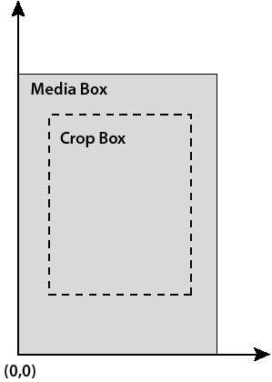
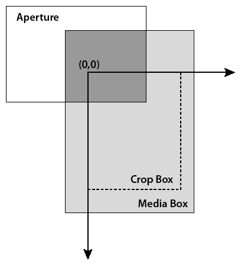

******************************************************
Working with Page Views and Contents
******************************************************

A page view is the area of the Acrobat or Adobe Reader window that displays the visible content of a document page. An example of a page view is a PDF document page displayed within Adobe Reader or Acrobat at a 120% magnification.

About page coordinates
======================

When working with page views and page contents, it is often necessary to specify page coordinates. Two coordinate systems are applicable to the Acrobat core API:

-  User space
-  Device space

User space is the coordinate system used within PDF documents. It specifies coordinates for most objects in the PD layer. (See `Portable Document layer <Plugins_Introduction.html#50618410_55631>`__.)

When working with the user space coordinate system, you use an ``ASFixedRect`` object to represent a rectangle. For example, to place an annotation on a page, create an ``ASFixedRect`` object and specify its coordinates. To specify a ``ASFixedRect`` object's coordinates, you must define its ``top``, ``right``, ``bottom``, and ``left`` attributes. (See `Creating text annotations <Plugins_Annotations.html#50618420_15829>`__.)

The following diagram shows a user space coordinate system.

Device space specifies coordinates in screen pixels and is used in the AV layer to specify screen coordinates of windows. In device space, you use an ``AVRect`` object to represent a specific coordinate. The following diagram shows a device space coordinate system.

The ``AVPageViewRectToDevice`` method can transform a rectangle's coordinates from user space to device space. For example, you can use PD methods to determine user space coordinates of a rectangle. However, to display an outline around the rectangle, you must convert user space coordinates to device space coordinates. (See `Modifying page contents <Plugins_Pages.html#50618407_23519>`__.)

About page views
================

A page view is represented by an ``AVPageView`` object. To create an ``AVPageView`` object, invoke the ``AVDocGetPageView`` method. (See `Displaying page views <Plugins_Pages.html#50618407_52579>`__.)

Using ``AVPageView`` methods, you can perform page-view tasks such as:

-  Displaying a page.
-  Selecting a zoom factor.
-  Scrolling the displayed page.
-  Highlighting one or more words.
-  Controlling screen redrawing.
-  Traversing the view stack that records where users have been in a document.

.. note::

   To control the size of the page view, you can invoke the ``AVWindowSetFrame`` and ``AVDocSetSplitterPosition`` methods. (See the `Acrobat and PDF Library API Reference <https://www.adobe.com/go/apireference>`__.)

Displaying page views
=====================

Using the Acrobat core API, you can programmatically display a page view by performing the following tasks:

#. Create an ``AVDoc`` object that represents the PDF document that contains the page on which the page view is based. (See `Opening PDF documents <Plugins_Documents.html#50618416_65430>`__.)
#. If desired, ensure that the specified page number does not exceed the number of pages located in the document. Convert the ``AVDoc`` object to a ``PDDoc`` object by invoking the ``AVDocGetPDDoc`` method. This method requires an ``AVDoc`` and returns a ``PDDoc`` object. Get the total number of pages located within the document by invoking the ``PDDocGetNumPages`` method. This method requires a ``PDDoc`` object and returns an ``ASInt32`` object representing the number of pages within the document.
#. Create an ``AVPageView`` object that represents the page view by invoking the ``AVDocGetPageView`` method. This method requires an ``AVDoc`` object and returns an ``AVPageView`` object.
#. Specify the page view's page number by invoking the ``AVPageViewGoTo`` method. This method requires an ``AVPageView`` object that represents the page view and an ``ASInt32`` object that specifies the page number. The page number uses a zero-based index value. Therefore the value of the first page is ``0``.
#. Display the page view by invoking the ``AVPageViewDrawNow`` method and passing the ``AVPageView`` object. When you invoke a method that affects a page view, you must invoke this method to redraw the page and display the page view. Otherwise, changes to a page view are not displayed.

The following code example displays a page view that is based on an ``AVDoc`` object named ``myDocument``. The specified page of the page view is 40 (which displays page 41). For information about creating an ``AVDoc`` object, see `Opening PDF documents <Plugins_Documents.html#50618416_65430>`__.

:: 

   //Create local variables
      ASInt32 totalPages; 
      ASInt32 pageNum= 40;
      AVPageView pageView;
      

   //Convert the AVDoc to a PDDoc and get the page count
      PDDoc pdDoc = AVDocGetPDDoc(myDocument);
      totalPages= PDDocGetNumPages(pdDoc);
      
      if (pageNum < totalPages){
      

   //Get a AVPageView object and display it
      pageView = AVDocGetPageView(myDocument);    
      AVPageViewGoTo(pageView,pageNum);
      AVPageViewDrawNow (pageView);
      }

Modifying page contents
=======================

Pages in a PDF document are represented by a ``PDPage`` object. Pages can contain properties such as annotations, contents, resources, bounding box, media box, crop box, rotation state, and Cos objects. These properties make up the page's content. ``PDPage`` methods enable you to perform tasks such as retrieving objects such as annotations, adding new objects, removing objects, and modifying existing objects.

To access a ``PDPage`` object, you must obtain the applicable ``PDDoc`` object, either directly or by invoking the ``AVDocGetPDDoc`` method. You can then invoke the ``PDDocAcquirePage`` method to acquire the page (the ``PDPage`` object).

To access the contents of PDF pages, you use ``PD`` layer methods. In addition, the Acrobat core API provides the ``PDFEdit`` typedef, which provides an easy way to access to the contents of a PDF page. ``PDFEdit`` methods are useful when working with page items such as images, paths, graphics, and text objects. This API treats the contents of a page as a list of objects whose values and attributes can be modified.

Each ``PDFEdit`` object encapsulates all the relevant information about itself. A ``PDEText`` object, for example, contains text and its attributes such as font and position on the page. It can access single characters or multiple character strings, but not words. To access words, you need to use ``PD`` layer methods. For information see `Portable Document layer <Plugins_Introduction.html#50618410_55631>`__.

Creating a PDEContent object
----------------------------

A ``PDEContent`` object is a container object that contains modifiable contents of a ``PDPage`` including ``PDEText``, ``PDEPath``, and ``PDEImage`` objects. After you create a ``PDEContent`` object, you can access and modify objects that it contains.

Create a ``PDEContent`` object by performing the following tasks:

#. Create an ``AVDoc`` object by invoking the ``AVAppGetActiveDoc`` method. This method gets the frontmost document located within Adobe Reader or Acrobat.
#. Create an ``AVPageView`` object by invoking the ``AVDocGetPageView`` method. This method requires an ``AVDoc`` object and returns an ``AVPageView`` object.
#. Get the current page number of the PDF document by invoking the ``AVPageViewGetPageNum`` method. This method requires an ``AVPageView`` object and returns a ``PDPageNumber`` object that represents the current page number.
#. Create a ``PDDoc`` object by invoking the ``AVDocGetPDDoc`` method. This method requires an ``AVDoc`` object and returns a ``PDDoc`` object.
#. Create a ``PDPage`` object by invoking the ``PDDocAcquirePage`` method. This method requires a ``PDDoc`` object and a ``PDPageNumber`` object as arguments and returns a ``PDPage`` object.
#. Create a ``PDEContent`` object by invoking the ``PDPageAcquirePDEContent`` method and passing a ``PDPageNumber`` object and an ``ASExtension`` object that represents the identity of the caller. For plugins, you can use the ``gExtensionID`` extension (this is defined in the PIMain.c file).

The following code example creates a ``PDEContent`` object.

::

      AVDoc avDoc = AVAppGetActiveDoc();
      AVPageView pageView = AVDocGetPageView(avDoc);
      PDPageNumber 
      pageNum = AVPageViewGetPageNum(pageView);

      /* Bridge method to PD doc*/
      PDDoc pdDoc = AVDocGetPDDoc(avDoc);
      
      /* Acquire current page */
      PDPage 
      pdPage = PDDocAcquirePage(pdDoc, pageNum);
      PDEContent 
      pdeContent = PDPageAcquirePDEContent(pdPage, gExtensionID);

Accessing page contents
-----------------------

Before you can modify page contents, you must access them by using a ``PDEContent`` object, which is a collection object that stores page contents. Each page content is stored as an element within the ``PDEContent`` object. An element is represented by a ``PDEElement`` object. For example, a ``PDEElement`` object can contain an annotation.

To access page contents, perform the following tasks:

#. Create a ``PDEContent`` object. (See `Creating a PDEContent object <Plugins_Pages.html#50618407_91421>`__.)
#. Invoke the ``PDEContentGetNumElems`` method to retrieve the number of elements located within the ``PDEContent`` object. This method requires a ``PDEContent`` object and returns an ``ASInt32`` object that specifies the number of elements.
#. Iterate through the ``PDEContent`` object and retrieve each element by invoking the ``PDEContentGetElem`` method. This method requires a ``PDEContent`` object and an ``ASInt32`` object that specifies the element index (this is a zero-based value) and returns a ``PDEElement`` object that represents a specific page property.

The following code example accesses each element located in a ``PDEContent`` object.

#. Accessing page contents

:: 

   //Declare a PDEElement object
   PDEElement pdeElement; 
   

   //Get the number of elements in the PDEContent object
   ASInt32 eleNum =  PDEContentGetNumElems(pdeContent); 
   

   //Get each element in the PDEContent object
   for (int j=0; j<eleNum; j++){
   
     pdeElement = PDEContentGetElem(pdeContent, j);
   }

Determining page element types
------------------------------

You can determine the element type that a ``PDEElement`` object represents by invoking the ``PDEObjectGetType`` method. This method requires a ``PDEObject`` ; however, you can pass a ``PDEElement`` object and cast it to a ``PDEObject``. This method returns an ``ASInt32`` object that specifies the element type. For example, if the element is a text element, this method returns ``kPDEText``. For a listing of all element types, see the `Acrobat and PDF Library API Reference <https://www.adobe.com/go/apireference>`__.

The following code example determines the element type by adding application logic to the application logic introduced in `Accessing page contents <Plugins_Pages.html#50618407_26389>`__.

#. Determining page element types

   //Declare a PDEElement object
   PDEElement pdeElement; 
   

   //Get the number of elements located in the PDEContent object
   ASInt32 eleNum =  PDEContentGetNumElems(pdeContent); 
   

   //Get each element located within the PDEContent object
   for (int j=0; j<eleNum; j++){
   
     pdeElement = PDEContentGetElem(pdeContent, j);
   

   //Determine if the element is a text element
    if (PDEObjectGetType((PDEObject)pdeElement) == kPDEText){

   //Perform an action
   }

Modifying text elements
-----------------------

You can modify elements located within a ``PDEContent`` object. This section discusses modifying text elements by placing a red border around them. To place a red border around a text element, you must create a ``PDColorValueRec`` object and define its attributes.

::
   
    //Create a PDColorValue and define red
    PDColorValueRec red;
     red.space = PDDeviceRGB;
     red.value[0] = ASInt32ToFixed(1);
     red.value[1] = 0;
     red.value[2] = 0;

After you create a ``PDColorValueRec`` object, you can attach it to an ``AVPageView`` object by invoking the ``AVPageViewSetColor`` method. This method requires an ``AVPageView`` object and a ``PDVColorValueRec`` object. Once set, this color is used in drawing operations.

A text element is represented by a ``PDEText`` object, which is a container of text runs. A text run can be a single character or multiple characters having the same attributes in a PDF file. You can get the number of text runs located within a ``PDEElement`` object by invoking the ``PDETextGetNumRuns`` method and passing the ``PDEElement`` object and casting it as a ``PDEText`` object.

::

    int numRuns = PDETextGetNumRuns((PDEText) pdeElement);

You can draw a red border around each ``PDEText`` object by performing the following tasks:

#. Get the bounding box of the ``PDEText`` object by invoking the ``PDETextGetBBox`` method and passing the following arguments:

   -  A ``PDEText`` object that represents the text element whose bounding box is obtained.
   -  A ``PDETextFlags`` value that specifies whether index refers to the character offset from the beginning of the text object or the index of the text run. Must be either ``kPDETextChar`` for a text character or ``kPDETextRun`` for a text run.
   -  An ``ASInt32`` value that specifies the index of the character or text run.
   -  The address of an ``ASFixedRect`` object that is populated with the coordinates of the bounding box of a specified character or text run.

2. Transform the bounding box's coordinates from user space to device space by invoking the ``AVPageViewRectToDevice`` method and passing the following arguments:

   -  An ``AVPageView`` object that represents the page view for which the coordinates are transformed. Use the same ``AVPageView`` object that was used to create a ``PDEContent`` object. (See `Creating a PDEContent object <Plugins_Pages.html#50618407_91421>`__.)
   -  The address of the ``ASFixedRect`` object that was passed to the ``PDETextGetBBox`` method. This object contains coordinate data that is transformed.
   -  The address of an ``AVRect`` object that is populated with device space coordinates.

3. Draw a stroked, but not filled, rectangle by invoking the ``AVPageViewDrawRectOutline`` method and passing the following arguments:

   -  An ``AVPageView`` object that represents the page view in which the rectangle is drawn.
   -  The address of the ``AVRect`` object that specifies device space coordinates. You can pass the address of the same ``AVRect`` object that was passed to the ``AVPageViewRectToDevice`` method.
   -  An ``AVDevSize`` object that specifies the border width in pixels.
   -  The address of an ``ASFixed`` object whose elements specify the length of dashes and gaps. You can specify ``NULL`` to draw a solid outline.
   -  An ``AVTArraySize`` object that specifies the number of elements in the ``ASFixed`` object. This value is ignored if you specified ``Null`` as the previous argument. As a result, you can specify ``0`` for this argument. The maximum allowed number of elements is currently 10.

The following code example modifies page contents by placing a red border around text elements and places a blue border around other elements that are located within a ``PDEContent`` object.

::

   //Declare objects used in this code example
      PDEElement pdeElement; 
      ASFixedRect bbox;
      AVRect rect;
      PDColorValueRec red, blue; 

   //Define red
      red.space = PDDeviceRGB;
      red.value[0] = ASInt32ToFixed(1);
      red.value[1] = 0;
      red.value[2] = 0;
      
   //Define blue
      blue.space = PDDeviceRGB;
      blue.value[0] = 0; 
      blue.value[1] = 0; 
      blue.value[2] = ASInt32ToFixed(1);
      
   //Create a PDEContent object based on the current page view
      AVDoc avDoc = AVAppGetActiveDoc();
      AVPageView pageView = AVDocGetPageView(avDoc);
      PDPageNumber pageNum = AVPageViewGetPageNum(pageView);
      PDDoc pdDoc = AVDocGetPDDoc(avDoc); 
      PDPage pdPage = PDDocAcquirePage(pdDoc, pageNum); 
      PDEContent pdeContent = PDPageAcquirePDEContent(pdPage, gExtensionID);
      
   //Get the number of elements located in the PDEContent object
      ASInt32 eleNum = PDEContentGetNumElems(pdeContent); 
      
   //Retrieve each element in the PDEContent object
      for (int  j=0; j < eleNum; j++){
      
   //Get a specific element
      pdeElement = PDEContentGetElem(pdeContent, j);
      
   //Determine if the object is of type text
      if (PDEObjectGetType((PDEObject) pdeElement) == kPDEText){
            
   //Get the number of text runs in the text element
         int numTextRuns = PDETextGetNumRuns((PDEText) pdeElement);
      
   //Assign red to the page view
         AVPageViewSetColor(pageView, &red);
      
      for (int i = 0; i < numTextRuns; i++){
            
   //Get the bounding box of the text run
         PDETextGetBBox ((PDEText) pdeElement, kPDETextRun, i, &bbox);
      
   //Convert from user space bbox to device space rect
         AVPageViewRectToDevice (pageView, &bbox, &rect);
      
   //Draw the rect
         AVPageViewDrawRectOutline (pageView,&rect,  1, NULL, 0);
            }
      }
      else
      {

   //Assign blue to the page view
         AVPageViewSetColor(pageView, &blue);
            

   //Get the bounding box of the non-text element
         PDEElementGetBBox (pdeElement, &bbox);

   //Convert from user space bbox to device space rect
         AVPageViewRectToDevice (pageView, &bbox, &rect);

   //Draw the rect
         AVPageViewDrawRectOutline (pageView, &rect, 1, NULL, 0);
      }
      }
      

   //Release objects
      PDPageRelease(pdPage);
      PDPageReleasePDEContent (pdPage, gExtensionID);

