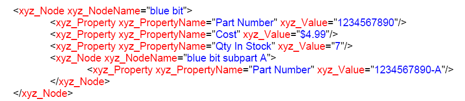

******************************************************
Understanding Plugins
******************************************************

Plugin loading and initialization
=======================================

When Acrobat or Adobe Reader is started, it searches the plugins directory (co-located with the Acrobat executable) to locate and load plugins. In addition, Acrobat or Adobe Reader searches folders that may be located within this folder. This search goes one level deep.

Acrobat and Adobe Reader display a progress message in the bottom line of the splash screen at start-up. As each plugin is loaded, the progress message shows the plugin name. No plugins are loaded if the Shift key is held down while Acrobat or Adobe Reader start. Also, if Acrobat or Adobe Reader are running in certified mode, no third-party plugins are loaded.

When creating methods for your plugin, keep the following rule in mind:

Implement ``PluginUnload`` procedure: This procedure frees allocated memory. This routine is invoked if any of the initialization routines returns ``false``. Under normal conditions, this procedure is not invoked until the user closes Acrobat or Adobe Reader.

Handshaking 
-----------

Acrobat and Adobe Reader perform a handshake with each plugin as it is opened and loaded. During handshaking, the plugin specifies its name, several initialization procedures, and an optional unload procedure.

A plugin must implement the following handshaking function:

::

    ACCB1 ASBool ACCB2 PIHandshake(ASUns32 handshakeVersion, void, *hsData)

During handshaking, the plugin receives the ``hsData`` data structure (defined in the PIVersn.h file). Acrobat and Adobe Reader convert all function pointers that are passed in this data structure into callbacks using the ``ASCallbackCreateProto`` method. For information about this method, see the `Acrobat and PDF Library API Reference <https://www.adobe.com/go/apireference>`__.

The DUCallbacks.h header file declares all callback methods that must be located in your plugin. The following shows the function signatures of these callback methods:

::

    ACCB1 ASBool ACCB2 PluginExportHFTs(void);
    ACCB1 ASBool ACCB2 PluginImportReplaceAndRegister(void);
    ACCB1 ASBool ACCB2 PluginInit(void);
    ACCB1 ASBool ACCB2 PluginUnload(void);

All callbacks return ``true`` if your plugin's procedure completes successfully or if the callbacks are optional and are not implemented. If your plugin's procedure fails, it returns ``false``. If either Acrobat, Adobe Reader, or a plug-in aborts handshaking, Acrobat or Adobe Reader displays an alert dialog box showing a brief explanation before loading other plugins. At minimum, a plugin must implement the ``PluginInit`` callback.

To ensure your plugin does not hinder Acrobat startup, you must limit code executed in your handshake functions to the minimum.

.. note::

   The handshaking function is located in the PIMain.c file. This source code located in this file is functional and must not be modified.

The following example shows how a plugin's ``PIHandshake`` method specifies the plugin callbacks provided during handshake and initialization. The tasks performed by each function is described in the next sections. For general information about creating callback functions, see `Using callback functions <Plugins_Pimech.html#50618406_20671>`__.

::

   ACCB1 ASBool ACCB2 PIHandshake(Uns32 handshakeVersion, void *handshakeData)
   {
     if(handshakeVersion == HANDSHAKE_V0200) 
     {
         PIHandshakeData_V0200 *hsData = (PIHandshakeData_V0200 *)handshakeData;
         hsData->extensionName = GetExtensionName();
         hsData->exportHFTsCallback =
             (void*)ASCallbackCreateProto(PIExportHFTsProcType,
                 &PluginExportHFTs);
         hsData->importReplaceAndRegisterCallback =
             (void*)ASCallbackCreateProto(PIImportReplaceAndRegisterProcType, 
                 &PluginImportReplaceAndRegister);
         hsData->initCallback = 
             (void*)ASCallbackCreateProto(PIInitProcType, &PluginLoad);
         hsData->unloadCallback = 
             (void*)ASCallbackCreateProto(PIUnloadProcType, &PluginUnload);
         return true;
     } 
     return false;
   }

Exporting HFTs
--------------

A Host Function Table (HFT) is the mechanism through which plugins invoke methods in Adobe Reader or Acrobat, as well as in other plugins. After Acrobat finishes handshaking with all the plugins, it invokes each plug-in's ``PluginExportHFTs`` callback procedure.

In the ``PluginExportHFTs`` procedure, a plugin may export any HFTs it intends to make available to other plugins. This callback should only export an HFT, not invoke other Acrobat core API methods. (See `Working with Host Function Tables <Plugins_Hft.html#50618412_37928>`__.)

.. note::

   The only time a plugin can export an HFT is during execution of its ``PluginExportHFTs`` procedure.

Importing HFTs and registering for notifications
------------------------------------------------

After Acrobat or Adobe Reader completes invoking each plugin's ``PluginExportHFTs`` callback method, it invokes each plugin's ``PluginImportReplaceAndRegister`` callback method. In this method, plugins perform three tasks:

#. Import any special HFTs they use (the standard Acrobat HFTs are automatically imported). Plugins also may import HFTs any time after this while the plugin is running.
#. Register for notifications by using the ``AVAppRegisterNotification`` method. Plugins also may register and unregister for notifications while the plugin is running. A plugin may receive a notification any time after it has registered for it, even if the plugin's initialization callback has not yet been called. This can occur if another plugin initializes first and performs an operation, such as creating a PDF document, which causes a notification to be sent. Plugins must be prepared to correctly handle notifications as soon as they register for them.
#. Replace any of the Acrobat API's replaceable HFT methods. (See `Replacing HFT methods <Plugins_Hft.html#50618412_19489>`__.)

.. note::

   The only time a plugin may import an HFT or replace a standard API method is within its ``PluginExportHFTs`` callback procedure. Plugins may register for notifications at this time or any time afterward.

Initialization
--------------

After Acrobat or Adobe Reader completes calling each plugin's ``PluginImportReplaceAndRegister`` callback method, it invokes each plugin's ``PluginInit`` procedure. Plugins can use their initialization procedures to hook into Acrobat's user interface by adding menu items, toolbar buttons, windows, and so on. It is also acceptable to modify Acrobat's user interface later when the plugin is running.

When creating the initialization portion of a plugin, keep the following rules in mind:

**Avoid creating dialog boxes:** Do not create a dialog box in your plugin's initialization or do anything else that may interfere with the successful startup of Acrobat or Adobe Reader. The application may be started by using an interapplication communication (IAC) event, in which case a user would not be present to respond to your dialog box.

**Avoid invoking methods that cause Acrobat to load non-critical components:** Here are actions your plugin should avoid, listed in order of importance:

-  Avoid invoking JavaScript, which loads the EScript plugin and starts the JavaScript engine.
-  Avoid invoking functions referenced from HFTs exported by Adobe plugins. Adobe plugins are not fully initialized until they are invoked or otherwise triggered.

.. note:: Non-Adobe plugins are fully initialized during Acrobat startup. Invoking functions declared in HFTs exported by non-Adobe plugins will not significantly delay Acrobat startup, unless those plugins violate the principles listed here.

-  Avoid invoking system methods that load more system libraries, such as accessing the disk.

**Do create your menu items**: Creating your menu items during initialization ensures that your menu items will be available in any PDF document opened using Acrobat or Adobe Reader.

If your plugin must carry out a task after all plugins are initialized, it should register for the ``AVAppDidInitialize`` notification. This notification is invoked when Acrobat finishes initializing and is about to enter its event loop.

Unloading
---------

A plugin's ``PluginUnload`` procedure should free any memory the plugin allocated and remove any user interface changes it made. Acrobat invokes this procedure when it terminates or when any of the other handshaking callbacks return ``false``. This function should perform the following tasks:

-  Remove and release all menu items and other user interface elements, HFTs, and HFTServers.
-  Release any memory or any other allocated resources.

Currently, plugins unload only when Acrobat exits.

Summarizing a plugin's life cycle
---------------------------------

The following steps describe the life cycle of a plugin:

#. At startup, Adobe Reader or Acrobat searches its plugin directory for plugin files.
#. For each plugin file, Adobe Reader or Acrobat attempts to load the file. If the plugin is successfully loaded, Adobe Reader or Acrobat invokes routines in PIMain.c that complete the handshaking process.
#. Adobe Reader or Acrobat invokes callback functions in this order:

   -  ``PluginExportHFTs``
   -  ``PluginImportReplaceAndRegister``
   -  ``PluginInit``

This sequence establishes the linkages between the plugin and Acrobat or Adobe Reader, and between the plugin and any other plugins. After all plugins are loaded, Acrobat or Adobe Reader continues its own loading and starts the user interface. It adds plugin tools to the toolbar, and plugin menu items to the menu bar. Then it starts the user session.

Using callback functions
========================

Acrobat or Adobe Reader invokes callback functions that you define to perform a specific task. For example, when a user clicks a button located on a toolbar, a callback method is invoked. (See `Creating toolbar button callback functions <Plugins_Toolbutton.html#50618403_31936>`__.)

To create a callback function, you can invoke the ``ASCallbackCreateProto``, ``ASCallbackCreateReplacement``, and ``ASCallbackCreateNotification`` methods to convert functions into callback functions and to perform type checking. This enables the compiler to determine whether the correct prototypes are used for a specific callback function. For information about these methods, see the `Acrobat and PDF Library API Reference <https://www.adobe.com/go/apireference>`__.

Type checking only occurs if the ``DEBUG`` macro is set to 1 at the time your plug-in is compiled. Be sure to set it appropriately in your development environment and remove it when you build the shipping version of your plugin.

The following code example shows the syntax to create a callback function:

::

    AVExecuteProc ExecProcPtr = NULL;
     ExecProcPtr= ASCallbackCreateProto(AVExecuteProc, &ShowMessage);

The ``ASCallbackCreateProto`` macro returns a callback of the specified type that invokes the user-defined function whose address is passed as the second argument. In this example, the ``ShowMessage`` function is converted to a callback function (the ``ShowMessage`` function is a user-defined function that is invoked when a specific action occurs).

The ``ASCallbackCreateProto`` macro returns a pointer to a function that can be invoked by a plugin or by Acrobat or Adobe Reader. Use the ``ASCallbackDestroy`` method to dispose of a callback that is no longer required.

All callbacks must be declared with Pascal calling conventions. To make your code portable between platforms, declare all your callback functions using the ``ACCB1`` and ``ACCB2`` macros:

::

    static ACCB1 const char* ACCB2 ShowMessage(Thing* foo);

Notifications
=============

The Acrobat core API provides a notification mechanism so that plugins can synchronize their actions with Acrobat or Adobe Reader. Notifications enable a plugin to indicate that it has an interest in a specified event, such as an annotation being modified, and to provide a procedure that Acrobat invokes each time that event occurs. (See `Registering for Event Notifications <Plugins_Notification.html#50618408_14583>`__.)

Handling events
===============

You can use the Acrobat core API to handle various types of events.

Mouse clicks
------------

Mouse clicks are passed to any procedure registered using the ``AVAppRegisterForPageViewClicks`` method. If all of those procedures return ``false``, the click is passed to the active tool. If that returns ``false``, the click is passed to any annotation at the current location.

You can query the state of the mouse buttons in a manner appropriate for drag operations by invoking the ``AVSysTrackMouse`` method. (See the `Acrobat and PDF Library API Reference <https://www.adobe.com/go/apireference>`__.)

Adjust cursor
-------------

Adjust cursor events are passed to any procedures registered using the ``AVAppRegisterForPageViewAdjustCursor`` method. If all of those procedures return ``false``, the event is passed to the active tool. If that returns ``false``, the event is passed to any annotation at the current location.

Key presses
-----------

Key presses are first passed to the currently active selection server. If the selection server's ``AVDocSelectionKeyDownProc`` callback returns ``false``, Acrobat or Adobe Reader handles special keys (Esc, Page Up, Page Down) or uses the key to select a tool from the toolbar.

Using plugin prefixes
=====================

It is important to correctly name all items located in your plugin, such as HFTs, menus, toolbars, and so on, to ensure they function properly. Failure to do so may cause your plugin to produce unpredictable results when your plugin collides with a plugin of another developer who used the same names.

Prevent spaces from being used in tokens you intend to use as names in a PDF file. This can happen, for example, if you allow a user to type a name into the PDF file and your plugin does not check the input before writing it to the file.

Obtaining a developer PDF name prefix
-------------------------------------

In support of ISO 32000, Adobe maintains a list of the prefixes of second class names for PDF. It is freely open to all developers and organizations following the specifications given in Annex E of ISO 32000. For example, Adobe uses ADBE or Acro. This chapter uses ADBE in the examples. Your plugins will use your unique PDF name. Register your name at https://github.com/adobe/pdf-names-list.

.. note::

   Registering a PDF name ensures that you name is unique. It is up to you to ensure that names are unique among all plugins you or your company write (for example, you must ensure that two of your plugins do not both use ADBE_save as a menu item name).

Using a developer prefix
------------------------

Every plugin must use the prefix to name its various elements as well as private data it writes into PDF documents. The following sections describe and provide an example of each element that must use a prefix.

Plugin name
~~~~~~~~~~~

``ExtensionName``, used in plugin handshaking, must use the following syntax: ``Prefix_PluginName``.

::

    hsData->extensionName = ASAtomFromString("ADBE_SuperCrop");

Menu prefixes
~~~~~~~~~~~~~

Menu names must use the following syntax: ``Prefix:MenuName``.

::

    SuperCropMenu = AVMenuNew(SuperCrop, "ADBE:SuperCropMenu", gExtensionID);

For information about invoking the ``AVMenuNew`` method, see `Adding menu commands to menus <Plugins_Menu.html#50618409_63428>`__.

Menu items prefixes
~~~~~~~~~~~~~~~~~~~

Menu item names must use the following syntax: ``Prefix:MenuItem``.

::

    SelSuperCropTool = AVMenuItemNew(SuperCrop, "ADBE:SuperCropMItem", NULL,
     false, '9', AV_OPTION, SuperCropIcon, gExtensionID);

Tool prefixes
~~~~~~~~~~~~~

Tools names must use the following syntax: ``Prefix:Tool``.

::

    static ACCB1 ASAtom ACCB2 SuperCropToolGetType(AVTool tool)
     {
         return ASAtomFromString("ADBE:SuperCropTool");
     }

Toolbar button prefixes
~~~~~~~~~~~~~~~~~~~~~~~

Toolbar buttons must use the following syntax: ``Prefix:ToolbarButton``.

::

    myButton = AVToolButtonNew(ASAtomFromString("ADBE:HelloWorld"), (void *)
     myBM, false, false);

For information about creating a toolbar button, see `Creating toolbar buttons <Plugins_Toolbutton.html#50618403_92880>`__.

Private data ID'd via second-class names
~~~~~~~~~~~~~~~~~~~~~~~~~~~~~~~~~~~~~~~~~~~~~~~~

If you add private data to keys defined in a Cos dictionary and you want the document to be readable to others outside your company, you must identify the data using second-class names. Such key names use the syntax Prefix_PrivateDataName, where Prefix identifies the company or other entity that introduces the key, and PrivateDataName identifies the data.

When adding keys that are directly referenced from private keys, it is not necessary to use the developer prefix. In the following example, the keys named ``First`` and ``Second`` cannot be referenced from any object in the PDF file except the private key that uses an appropriate prefix. Therefore, there is no need to use a prefix for the latter two keys.

:: 

  /ACME_aName << /First 2 /Second << /Third [ 2 3 ] >> >>

.. note::

   For information about Cos dictionaries, such as the one shown in the previous example, see `Working with Cos dictionaries <Plugins_Cos.html#50618418_96656>`__.

Action prefixes
~~~~~~~~~~~~~~~

Actions must use the following syntax: ``Prefix_ActionName``.

::

    AVAppRegisterActionHandler(&BkmkHandler, NULL, "ADBE_HWAction", "HWAct");

Annotation prefixes
~~~~~~~~~~~~~~~~~~~

Annotation prefixes must use the following syntax: ``Prefix_AnnotType``.

::

    return(ASAtomFromString("ADBE_MarkUpAnnot");

HFT prefixes
~~~~~~~~~~~~

When your plugin exposes any HFTs of its own, it must use an HFT name that conforms to the following syntax: ``Prefix_HFTName``.

::

    gDebuggWinHFTServer =
     HFTServerNew("ADBE_DebugWin",provideDebugWinHFTCallback, NULL, NULL);

For information about HFTs, see `Working with Host Function Tables <Plugins_Hft.html#50618412_37928>`__.

Modifying the Acrobat or Adobe Reader user interface
====================================================

This section describes typical operations that a plugin can perform to modify the Acrobat or Adobe Reader user interface. To modify the user interface, you must invoke methods that belong to the Acrobat Viewer Layer. As a result, you cannot modify the Acrobat or Adobe Reader user interface by using the PDF Library API. (See `Acrobat Viewer layer <Plugins_Introduction.html#50618410_82715>`__.)

Adding or removing menus and menu items
---------------------------------------

You can use the Acrobat core API to add new menus and add commands to existing menus. You can also remove a menu or a menu command.

Menu commands can have shortcuts (keyboard accelerators). Acrobat and Adobe Reader do not ensure that plugins add unique shortcuts, but it is possible to programmatic-ally check which shortcuts are already in use before adding them.

You are encouraged to have your plugin add its menu commands to the Tools menu. When the plugin starts, Acrobat or Adobe Reader automatically adds this menu, as well as the About Plugins and Plugin Help menus. After Acrobat or Adobe Reader loads all plugins, it checks these three menus and removes any that are empty. (See `Creating Menus and Menu Commands <Plugins_Menu.html#50618409_98126>`__.)

Modifying toolbars
------------------

You can add new buttons to the toolbar, although the size and resolution of the user's monitor can limit the number of tool buttons that are displayed. You can also remove buttons from an existing toolbar. (See `Creating Toolbars and Buttons <Plugins_Toolbutton.html#50618403_37598>`__.)

Controlling the About box and splash screen
-------------------------------------------

You can set values in the preferences file by invoking the ``AVAppSetPreference`` method to prevent the Acrobat or Adobe Reader About box or splash screen from appearing before displaying the first document. These changes take effect the next time Acrobat or Adobe Reader is started.

About Adobe Plugins is a standard menu command in the Help menu. This menu command contains a submenu. You are encouraged to have your plugin add a menu command to the submenu to bring up its own About box.

Creating help files
-------------------

The Help directory that accompanies Acrobat or Adobe Reader provides a standard location for your plug-in help files. You can place a help file either in the Help directory or in a subdirectory of the Help directory. If, for example, your plugin is localized for Japanese, you may want to place its Japanese help file in a Help_JPN subdirectory. To help open locale-specific help files, the Acrobat core API provides the ``AVAppOpenHelpFile`` method. (See the `Acrobat and PDF Library API Reference <https://www.adobe.com/go/apireference>`__.)

User interface guidelines
-------------------------

Follow these guidelines when modifying the Acrobat or Adobe Reader user interface:

-  During time-consuming operations, provide feedback to the user by using features such as progress monitors, cancel button, hourglass cursor, or status dialog boxes.
-  If you are adding an authoring tool to a toolbar, make it ignore all annotation types except your own. This way a link or thread will not interfere with the use of your tool. Navigation and selection tools should not ignore annotations. In Acrobat, for example, the Hand, Zoom, and selection tools all follow links. If the user holds down the Shift key, these tools will ignore annotations. All other tools, however, will ignore annotations that are not of the type authored by the tool.
-  Invoke the ``AVToolBarIsRoomFor`` method to determine if there is room on the toolbar to accommodate a new button. If there is not sufficient room, then do not attach the button to the toolbar. Because space is limited, add a menu command for each button you add to a toolbar. This provides a way for users to access a plugin's functionality, and also enables users to access functionality by using a shortcut key (if the menu command contains one).

Acquiring and releasing objects
===============================

Ensure that calls to ``Acquire`` and ``Release`` methods match. Objects obtained by ``Acquire`` methods must ultimately be released. If they are not released, Acrobat or Adobe Reader raises exceptions when a non-zero reference count is discovered. An exception can occur when Acrobat or Adobe Reader quits or when a document is closed.

When allocating memory to objects, follow these guidelines:

-  Use ``ASmalloc`` and ``ASfree`` instead of ``malloc`` and ``free``, or you risk memory leaks.
-  Ensure that ``ASmalloc`` and ``ASfree`` pairs match or you will create memory leaks.
-  Use ``ASmalloc`` to allocate memory for methods that state that Acrobat or Adobe Reader free the memory for you.
-  It is best to have your C++ classes derive from a base class which overrides ``new``, such as the class ``CSafeAlloc``, found in SafeAlloc.h.

If you use an ``Acquire`` method to obtain an object, you must subsequently use a ``Release`` method to correctly update the reference counter, as shown in the following example:

::

    PDDoc doc;
    PDPage page;
     
    //Acquire a page from a PDF document
    doc = PDDocOpenFromASFile("myPDF.pdf", null, true);
    page = PDDocAcquirePage(doc, 42);
        
    //Perform a task using the page
    //Release the page
    PDPageRelease (page);

Notice that the ``PDPage`` object is acquired by invoking the ``PDDocAcquirePage`` method and is released by invoking the ``PDPageRelease`` method. For information about working with pages, see `Working with Page Views and Contents <Plugins_Pages.html#50618407_48762>`__.

Debugging plugins
=================

When debugging your plugin, consider the following points:

-  Include the ``#define DEBUG 1`` statement to ensure that parameter type checking is performed by macros such as ``ASCallbackCreateProto`` and to enable the debug exception-handling macros.
-  The ``AVSysBeep`` method provides a simple way to add an audible indication that a certain point has been reached in a plugin's code. Likewise, the ``AVAlertNote`` method displays a message box that indicates whether a certain point of code is reached.
-  Creating a log file is very helpful when tracing large sections of code or checking values of a number of variables. Use C library calls such as ``printf`` or platform-specific code to create a log file containing whatever information is useful for the particular situation.

Page view layers
================

Acrobat and Adobe Reader drawing and mouse click processing rely on the concept of page view layers, which are numbers of type ``ASFixed`` that are associated with the document itself and each annotation type.

The following table shows the predefined layers used by Acrobat and Adobe Reader.

 

+-----------------------------------+------------------------------------------------------------------------------------+
| Layer                             | Item                                                                               |
+===================================+====================================================================================+
|                                   | Page contents                                                                      |
|                                   |                                                                                    |
|    0                              |                                                                                    |
+-----------------------------------+------------------------------------------------------------------------------------+
|                                   | Links                                                                              |
|                                   |                                                                                    |
|    LINK_LAYER (1)                 |                                                                                    |
+-----------------------------------+------------------------------------------------------------------------------------+
|                                   | Annotations, open and closed. Open annotations are drawn above closed annotations. |
|                                   |                                                                                    |
|    NOTE_LAYER (3)                 |                                                                                    |
+-----------------------------------+------------------------------------------------------------------------------------+

These layers are used in the following situations:

**Drawing**: The layers are drawn from lowest to highest. As indicated in the table, the page contents are drawn first, followed by links, closed annotations, and finally open annotations. As a result, open annotations are drawn over any closed annotations that they overlap.

**Mouse click processing**: Occurs from highest layer to lowest layer. When a mouse click occurs, it is first passed to any open text note at the mouse click's location, then any closed text note, then any link, and finally to the page view itself. However, mouse clicks are passed to a lower layer only if a higher layer declines to handle the mouse click by returning ``false`` from its ``DoClick`` callback. (See `Tool callbacks <Plugins_Handlers.html#50618413_51937>`__.)

Annotation handlers provided by plugins can reside in any layer. For example, a plugin could choose for its annotations to be between the page contents and links, such as in layer 0.5 (because layers are numbers of type ``ASFixed`` ).

An annotation handler's ``AVAnnotHandlerGetLayerProc`` callback is called during screen updates and mouse clicks to return its layer. Using a callback rather than a constant value allows an annotation's layer to change. For example, Acrobat's built-in text annotation changes its layer, allowing open text annotations to receive mouse clicks before closed annotations, if both are at the mouse click location (on the other hand, Acrobat's built-in link annotation does not change its layer).

.. note::

   Acrobat and Adobe Reader do not invoke ``AVAnnotHandlerGetLayerProc`` callbacks for changes in value, so be sure to invalidate the page rectangle of an annotation when its layer changes.

For information about page views, see `Working with Page Views and Contents <Plugins_Pages.html#50618407_48762>`__.

Minimizing screen redrawing
===========================

Minimize screen redrawing by using the ``AVPageViewBeginOperation`` and ``AVPageViewEndOperation`` methods to bracket any sequence of view changes you may perform. For example, the sequence of changing to another page, scrolling, and zooming would normally redraw the screen three times. But, by invoking the ``AVPageViewBeginOperation`` method before the sequence and the ``AVPageViewEndOperation`` method after it, only one redraw occurs.

Storing private data in PDF files
=================================

Plugins can store private data in PDF files, although private data must be stored in such a way that the file can still be drawn by Acrobat. Adobe maintains a registry of private PDF dictionary key names to reduce the possibility of a plugin's key names conflicting with names belonging to other plugins. For information about dictionaries, see `Working with Cos dictionaries <Plugins_Cos.html#50618418_96656>`__.

Private dictionary keys exist in the following categories:

-  Specific keys that are proposed by third parties but are generally useful. Adobe maintains a registry of these names.
-  Keys registered by third parties as well as keys whose prefix is registered that are applicable only to a limited set of users. Adobe maintains a registry of these names and prefixes.
-  Keys that begin with a special prefix reserved by Adobe for private extensions. These keys are intended for use in files that are never seen by other third parties, since these keys may conflict with keys defined by others.

Exporting data from PDF document objects
========================================

Using the Acrobat core API, you can export data from PDF document objects to XML files. Object data contain property-value pairs. For example, consider a PDF document object that contains the following XML elements:

.. _section-1:

=========== ================
Node        Name
=========== ================
nodeTag     xyz_Node
nodeNameTag xyz_NodeName
propTag     xyz_Property
propNameTag xyz_PropertyName
propValTag  xyz_Value
=========== ================

After you export the data from this object into an XML file, the data would appear as shown in the following diagram.

To retrieve data from a PDF document object, invoke the ``PDDocExportUserProperties`` method and pass the following arguments:

-  A ``PDDoc`` object that represents a PDF document that contains the object from which data is extracted. (See `Creating a PDDoc object <Plugins_Documents.html#50618416_97094>`__.)
-  A ``PDSElement`` instance that represents PDF structural elements.
-  An ``ASStm`` object that represents XML content converted from information from labels.
-  An ``ASBool`` value that specifies whether to save object data of the specified element (``false`` ) or the whole subtree (``true`` ).
-  An ``ASBool`` value that specifies whether to include hidden content of the element.
-  An instance of the ``PDUserPropertiesXMLLabels`` data structure that specifies information for converting object data to XML. For information about this data structure, see the `Acrobat and PDF Library API Reference <https://www.adobe.com/go/apireference>`__.

