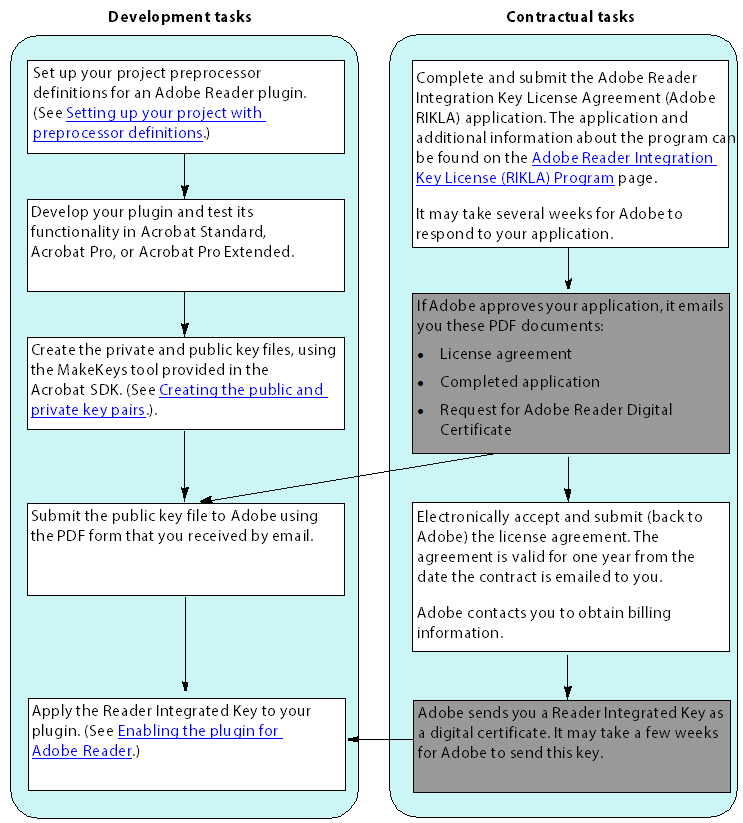

******************************************************
Creating an Adobe Reader plugin
******************************************************

Developing for Reader requires that you:

-  Set up definitions for your plugin project
-  Obtain the public key that Adobe uses to create your Adobe Integrated Key
-  Apply that key to a plugin.

The following diagram illustrates the development and contractual tasks required to develop and enable a plugin to work with Adobe Reader. The gray-filled boxes indicate tasks that Adobe performs.

Configuring preprocessor definitions
================================================================

Before building an Adobe Reader plugin, you must set up your project properties with preprocessor definitions for ``READER_PLUGIN``.

A common cause of difficulty when Reader-enabling a plugin is that the plugin attempts to acquire one or more Host Function Tables (HFTs) during startup that are not available within Adobe Reader. To avoid this problem on Windows and Mac OS, ensure that the ``READER_PLUGIN`` symbol is defined. With this symbol defined, only those HFTs available in Adobe Reader are acquired. (See `Working with Host Function Tables <Plugins_Hft.html#50618412_37928>`__.)

To define the READER_PLUGIN symbol in a Mac OS project:

Add the ``READER_PLUGIN`` symbol to the Xcode project-level build settings by selecting the plugin project in the Groups & Files pane and opening the Project Inspector. On the Build tab, under the GCC 4.0 Preprocessing settings, add ``READER_PLUGIN=1`` to the Preprocessor Macros setting.

To define the READER_PLUGIN symbol in a Visual C++ project (Windows):

To define the READER_PLUGIN symbol in a Win32 project:

#. Locate the ``AcroDspOptions.rsp`` file in the SDK's ``/PluginSupport/Samples`` directory.
#. Open the ``AcroDspOptions.rsp`` file in a text editor.
#. Change ACRO_SDK_LEVEL to 0x000A0000 from 0x00090000
#. Remove the ``AcroColorHFT`` define by removing the following line from the file:

``/D PI_ACROCOLOR_VERSION=0x00060000``

5. Add the READER_PLUGIN define by adding the following to the file:

``/D READER_PLUGIN``

6. Save the ``AcroDspOptions.rsp`` file.
#. Open and rebuild your Visual C++ plugin project.

.. note::

   This change affects all SDK plugins built after the change is made.

Creating the public and private key pairs
==================================================

Use the MakeKeys tool to create the public and private key pairs for your plugin.

The MakeKeys tool is a command line (Terminal tool). You can find this tool in the PluginSupport/Tools/Reader-enabling Tools directory in the Acrobat SDK. You can also download a ZIP file that contains this tool from http://www.adobe.com/go/rikla_tools.

To create public and private key pairs:

#. Open a Command Prompt (Windows) or Terminal (Mac OS).
#. Go to the directory that contains the MakeKeys tool.
#. Run the MakeKeys tool, providing it with the following parameters:

   -  ``-kp`` option followed by the name of the file in which to store the key pair. The directory must already exist. The file name cannot exceed the platform limitations on file name lengths.
   -  ``-pk`` option followed by the name of the file in which to store the public key. The directory must already exist. The file name cannot exceed the platform limitations on file name lengths.
   -  A random string that you create. The MakeKeys tool uses the string to generate a random number. The random string must contain only letters and digits. There is no limit on the length of the string.

The following example command line shows the options and parameters you supply to the MakeKeys tool. The italics in the command line indicate placeholders that you must replace with meaningful values.

::

    MakeKeys -kp KeyPairFileName -pk PubKeyFileName RandomString

The size of the resulting key pair file is approximately 450 bytes. The size of the public key pair file is approximately 98 bytes.

4. Submit the public key file to Adobe using the PDF form that you received by email, as described in ` <Plugins_ReaderPlug.html#50618405_28317>`__.

Enabling the plugin for Adobe Reader
==================================================

After receiving the Reader Integrated Key from Adobe, use the SignPlugin tool to enable the plugin for Adobe Reader.

The SignPlugin tool is a command line (Terminal tool). You can find this tool in the PluginSupport/Tools/Reader-enabling Tools directory in the Acrobat SDK. You can also download a ZIP file that contains this tool from http://www.adobe.com/go/rikla_tools.

To enable the plugin for Adobe Reader:

#. Open a Command Prompt (Windows) or Terminal (Mac OS).
#. Go to the directory that contains the SignPlugin tool.
#. Run the SignPlugin tool, providing it with the following parameters:

   -  ``-kp`` option followed by the location of the file that contains the key pair. This file was produced by the MakeKeys tool. (See `Creating the public and private key pairs <Plugins_ReaderPlug.html#50618405_51981>`__.)
   -  ``-cf`` option followed by the location of the file that contains the Reader Integrated Key provided by Adobe. (See ` <Plugins_ReaderPlug.html#50618405_28317>`__.)
   -  Location of the plugin.

The following example command line shows the options and parameters you supply to the SignPlugin tool. The italics in the command line indicate placeholders that you must replace with meaningful values.

::

    SignPlugin -kp 
   keypairFileName
    -cf Reader_Integrated_Key_
   FileName

     /MyDirectory/MyPlugin

If SignPlugin is successful, it returns the message: "Plugin.acroplugin successfully Reader Enabled."

The plugin can now be loaded by Adobe Reader. If you encounter any difficulties, see `Troubleshooting an Adobe Reader plugin <Plugins_ReaderPlug.html#50618405_49958>`__.

.. note::

   This procedure must be repeated each time the plugin is built.

The SignPlugin has been been upgraded to a 64 Bit executable to support running on Mac OS Catalina.

.. tip::

   On Mac OS, to easily copy paths to the command line, drag files from the Finder window to the Terminal window.

Troubleshooting an Adobe Reader plugin
======================================

There are some issues that can cause a plugin not to load in Adobe Reader. The most common issues are documented here. If the problem persists, contact Acrobat Developer Support.

Plugin appears to be ignored by Adobe Reader
--------------------------------------------

Several problems can cause this symptom:

-  The plugin was compiled without the ``READER_PLUGIN`` symbol being defined (Windows and Mac OS platforms only).

A common cause of difficulty when enabling a Adobe Reader plugin is that the plugin attempts to acquire one or more HFTs during startup that are not available in Adobe Reader. To avoid this problem on Windows and Mac OS, ensure that the ``READER_PLUGIN`` symbol is defined. (See `Setting up your project with preprocessor definitions <Plugins_ReaderPlug.html#50618405_81765>`__.)

With this symbol defined, only those HFTs available in Adobe Reader are acquired. For information about an HFT, see `Working with Host Function Tables <Plugins_Hft.html#50618412_37928>`__.

-  The Certified Plugins Only preference is set (Windows and Mac OS platforms only).

Adobe Reader recognizes only Adobe plugins as certified.

Ensure that the Certified Plugins Only option is not selected in the Options Preferences dialog box.

-  The plugin was not correctly enabled.

The resources file sent by Adobe may have been corrupted during delivery. Verify that the file sizes match those documented in the previous sections. If the public/private key pair or public key files are corrupt, you must regenerate new files and request a new Reader Integrated Key from Adobe. If the file that contains the key is corrupt, you must request a new Reader Integrated Key from Adobe, using the existing public key file.

Adobe Reader error messages
---------------------------

The following are the most commonly received error messages:

-  "There was an error while loading the plugin name.api. The plugin is incompatible with this version of the viewer."
-  "There was an error while loading the plugin name.api. The plugin failed to initialize."
-  "There was an error while loading the plugin ' *your plugin name* '. Two plugins are attempting to register with the same name."

The first error is displayed if the plugin returns ``false`` from the ``PISetupSDK`` method (defined in PIMain). The method returns ``false`` if the plugin attempts to acquire an HFT that is not available. (See `Working with Host Function Tables <Plugins_Hft.html#50618412_37928>`__.)
