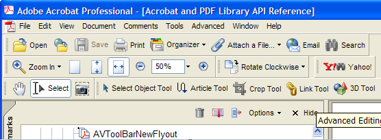

******************************************************
Creating Toolbars and Buttons
******************************************************

You can use the Acrobat core API to create new toolbars and toolbar buttons and to modify existing ones. For example, you can create a new button, attach it to an existing toolbar, and associate the button with a specified callback function that is executed when the user clicks the button.

About toolbars
==============

Adobe Reader and Acrobat consists of various toolbars that enable a user to invoke specific functionality. For example, you can click the ``Open`` button that is located on the ``File`` toolbar to open an existing PDF document. The following illustration shows two toolbars located in Acrobat.

.. tip::

   You can obtain the display name of the toolbar by pointing the mouse to the left portion of a toolbar.

.. note::

   The display name is the name that is displayed in Acrobat or Adobe Reader. However, toolbars also have internal names that may differ. That is, in some cases, the internal name and display name of a toolbar are different and in other cases they are the same. For example, consider the Help toolbar. The display name is Help and the internal name is HowTo. An internal name is used to programmatically retrieve a toolbar. (See `Retrieving toolbars <Plugins_Toolbutton.html#50618403_92112>`__. )

About AVToolBar typedefs
------------------------

An ``AVToolBar`` represents a toolbar that is located in Adobe Reader or Acrobat. A plugin can add buttons to and remove buttons from a toolbar, show or hide toolbars, and create new toolbars. Because screen space is limited on many monitors, it is recommended that you only create buttons that are necessary.

You can add a button to a toolbar by specifying the relative position of the button (before or after) to an existing button. A plugin controls the toolbar upon which a button will appear by placing the button next to an existing one already in the appropriate location.

About AVToolButton typedefs
---------------------------

An ``AVToolButton`` represents a button that is located within a toolbar. Like menu items, a callback function that is executed when the button is clicked must be defined. (See `Creating toolbar button callback functions <Plugins_Toolbutton.html#50618403_31936>`__.)

A plugin can invoke a button as if a user clicked it. Buttons can be enabled (selectable) or disabled (grayed out), and can be marked (selected). Each button also has an icon that appears in the toolbar. Normally, all tools are persistent and remain selected indefinitely. The Control key (Windows) or Option key (Mac OS) can be used to select a tool for one-shot use. Plugins should follow this convention to add buttons.

Separators between groups of buttons are themselves buttons, although they are neither selectable nor executable. Because they are buttons, however, they do have names, allowing other buttons to be positioned relative to them.

You are encouraged to position tool buttons relative to separators. Doing this increases the likelihood that tool buttons will be correctly placed if future versions of Acrobat move groups of tool buttons around.

Retrieving toolbars
===================

You can use the Acrobat core API to retrieve an existing toolbar that appears in Adobe Reader or Acrobat. After you retrieve a toolbar, you can perform additional tasks such as attaching a button. (See `Attaching a button to a toolbar <Plugins_Toolbutton.html#50618403_75762>`__.)

You retrieve a specific toolbar by invoking the ``AVAppGetToolBarByName`` method. This method requires a constant character pointer that specifies the internal name of a toolbar and returns an ``AVToolBar`` object that corresponds to the toolbar. If the name cannot be found, this method returns ``NULL``.

The following table lists toolbar names that appear in Acrobat and Adobe Reader (Adobe Reader does not contain all the toolbars that Acrobat does). The Display Name column specifies the toolbar name that appears in Acrobat or Adobe Reader. The Internal Name column specifies the value that you must pass to the ``AVAppGetToolBarByName`` method to retrieve the toolbar.

.. _section-1:

 

+------------------+-----------------+------------------------------------------------------------------------------------------------------+
| Display Name     | Internal Name   | Description                                                                                          |
+==================+=================+======================================================================================================+
| Advanced Editing | Editing         | Contains buttons that enable you to perform advanced editing operations such as using the Crop tool. |
+------------------+-----------------+------------------------------------------------------------------------------------------------------+
| Basic            | BasicTools      | Contains buttons that enable you to perform basic operations such as using the Hand tool.            |
+------------------+-----------------+------------------------------------------------------------------------------------------------------+
| Commenting       | Commenting      | Contains buttons that enable you to perform commenting operations such as using the Notes tool.      |
+------------------+-----------------+------------------------------------------------------------------------------------------------------+
| Drawing Markups  | AdvCommenting   | Contains buttons that enable you to perform drawing operations such using the Arrow tool.            |
+------------------+-----------------+------------------------------------------------------------------------------------------------------+
| Edit             | UndoRedo        | Contains buttons that enable you to perform editing operations such as checking the spelling.        |
+------------------+-----------------+------------------------------------------------------------------------------------------------------+
| File             | File            | Contains buttons that enable you to perform file operations such as opening a PDF file.              |
+------------------+-----------------+------------------------------------------------------------------------------------------------------+
| Help             | HowTo           | Contains a button that enables you to access online help topics.                                     |
+------------------+-----------------+------------------------------------------------------------------------------------------------------+
| Measuring        | Measuring       | Contains buttons that enable you to perform measuring operations such as using the Distance tool.    |
+------------------+-----------------+------------------------------------------------------------------------------------------------------+
| Navigation       | Navigation      | Contains buttons that enable you to perform navigation operations such as skipping to the next page. |
+------------------+-----------------+------------------------------------------------------------------------------------------------------+
| Print Production | PrintProduction | Contains buttons that enable you to perform print operations such as viewing an output preview.      |
+------------------+-----------------+------------------------------------------------------------------------------------------------------+
| Rotate View      | Rotate          | Contains a button that enables you to rotate a PDF document.                                         |
+------------------+-----------------+------------------------------------------------------------------------------------------------------+
| Tasks            | Tasks           | Contains buttons that enable you to perform operations such as digitally signing a document.         |
+------------------+-----------------+------------------------------------------------------------------------------------------------------+
| Typewriter       | Typewriter      | Enables you to type text on a PDF document.                                                          |
+------------------+-----------------+------------------------------------------------------------------------------------------------------+
| Zoom             | Viewing         | Contains buttons that enable you to perform viewing operations such as zooming in on a document.     |
+------------------+-----------------+------------------------------------------------------------------------------------------------------+

The following code example retrieves the Tasks toolbar by name: 

:: 

   //Retrieve the Tasks toolbar
   const char * toolbarName= "Tasks" ;
   AVToolBar myToolBar = AVAppGetToolBarByName(toolbarName); 

.. note::

   You can invoke the ``AVAppGetToolBar`` method to return an ``AVToolbar`` object that is based on the Advanced Editing toolbar.

Creating toolbar buttons
========================

You can create a new button that you can attach to a new or existing toolbar. To create a new button, invoke the ``AVToolButtonNew`` method and pass the following arguments:

-  An ``ASAtom`` object that specifies the button's name.
-  An ``AVIcon`` object that represents the button's icon. If a button does not have an icon, the button appears with a gray background.
-  An ``ASBool`` value that you can set to ``true`` or ``false``. If ``true``, the button is shown only when the user selects 'Full menus'. If ``false``, shows in both 'Full menu' and 'Short menu' modes. This argument is ignored in Acrobat 3.0 or later.
-  An ``ASBool`` value that you can set to ``true`` or ``false``. If ``true``, the new button is a separator used to leave space between groups of related buttons. Callback functions are ignored and a user cannot click on a separator. If ``false``, the button is normal.

The ``AVToolButtonNew`` method returns an ``AVToolButton`` object. You must attach this button to a toolbar in order to view it. (See `Attaching a button to a toolbar <Plugins_Toolbutton.html#50618403_75762>`__.)

It is strongly recommended that you create an ``AVIcon`` object when creating a new button. To create an ``AVIcon`` object, you must invoke platform specific APIs. That is, you do not invoke methods that belong to the Acrobat core API. If, for example, you are working on Windows, you can invoke a Win32 API method named ``LoadBitmap``. Likewise, if you are working on Mac OS, you can invoke ``SafeGetResource``.

The following code example shows how to create an ``AVIcon`` object that is based on a bitmap resource named ``IDB_BITMAP1``.

::

   AVIcon myIcon = (AVCursor)LoadBitmap(gHINSTANCE, MAKEINTRESOURCE(IDB_BITMAP1)); 

The ``gHINSTANCE`` object is an instance of ``HINSTANCE`` and is declared in the PIMain.c file. In addition to creating a new icon, you can also retrieve an existing icon appearing on a toolbar button. (See `Retrieving existing toolbar buttons <Plugins_Toolbutton.html#50618403_19658>`__.)

Once you create an ``AVIcon`` object, you can create a new toolbar button. The following code example creates a new toolbar button.

:: 

   //Declare an AVToolButton object
      AVToolButton MyButton = NULL;

   //Create an AVIcon object
      AVIcon myIcon = (AVCursor)LoadBitmap(gHINSTANCE, MAKEINTRESOURCE(IDB_BITMAP1)); 

   //Create a new button
      MyButton = AVToolButtonNew(ASAtomFromString("MyExtn:MyButton"), myIcon, false, false);

Setting help text for a button
------------------------------

A button's help text appears when the mouse scrolls over and pauses on a toolbar button. A small pop-up window appears with a text message. To set a button's help text, invoke the ``AVToolButtonSetHelpText`` method and pass the following arguments:

-  An ``AVToolButton`` object that represents a button for which the help text is set.
-  A constant character pointer that specifies the button's help text value.

The following code example sets a button's help text.

::

   //Declare an AVToolButton object
      AVToolButton MyButton = NULL;
      
   //Create an AVIcon object
      AVIcon myIcon = (AVCursor)LoadBitmap(gHINSTANCE, MAKEINTRESOURCE(IDB_BITMAP1)); 
      
   //Create a new button
      MyButton = AVToolButtonNew(ASAtomFromString("MyExtn:MyButton"), myIcon, FALSE, FALSE);
      
   //Set a button's help text
      const char * helpText = "Open PDF in external window" ; 
      AVToolButtonSetHelpText (MyButton, helpText);

Setting label text
------------------

A button's label text is the text that is displayed beside the button. To set a button's label, invoke the ``AVToolButtonSetLabelText`` method and pass the following arguments:

-  An ``AVToolButton`` object that represents a button for which the label text is set.
-  An ``ASConstText`` object that specifies the button's label text (the following code example demonstrates how to create this object).
-  An ``AVToolButtonLabelPriority`` value that specifies a set of priority values for a button's label text. This priority value determines the preference order in which labels are shown when a toolbar is too short to hold all of the button labels. The following values are valid:

   -  ``kAVButtonPriorityOffExtraLow``
   -  ``kAVButtonPriorityOffLow``
   -  ``kAVButtonPriorityOffNormal``
   -  ``kAVButtonPriorityOffHigh``
   -  ``kAVButtonPriorityOffExtraHigh``
   -  ``kAVButtonPriorityOnExtraLow``
   -  ``kAVButtonPriorityOnLow``
   -  ``kAVButtonPriorityOnNormal``
   -  ``kAVButtonPriorityOnHigh``
   -  ``kAVButtonPriorityOnExtraHigh``
   -  ``kAVButtonPriorityAlwaysOn``

The following code example sets a button's label text.

:: 
   
   //Declare an AVToolButton object
   AVToolButton MyButton = NULL;
   
   //Create a AVIcon object
      AVIcon myIcon = (AVCursor)LoadBitmap(gHINSTANCE, MAKEINTRESOURCE(IDB_BITMAP1)); 
      
   //Create a new button
      MyButton = AVToolButtonNew (ASAtomFromString("MyExtn:MyButton"), myIcon, FALSE, FALSE);  

   //Create an ASConstText object by using a ASText object
      ASText tmpText = ASTextNew();
      ASTextSetPDText(tmpText, "View PDF"); 
      ASConstText labelText = tmpText;
      
   //Set the button's label text with a kAVButtonPriorityOnNormal priority
      AVToolButtonSetLabelText (MyButton, labelText, kAVButtonPriorityOnNormal);

Creating a sub-menu for a button
--------------------------------

You can create a sub-menu that appears when a user clicks the button. A sub-menu contains menu comments that a user can select to invoke a specific action. To create a sub-menu for a button, invoke the ``AVToolButtonSetMenu`` method and pass the following arguments:

-  An ``AVToolButton`` object that specifies a button to which the menu is attached.
-  An ``AVMenu`` object that represents the menu. (See `Creating Menus and Menu Commands <Plugins_Menu.html#50618409_98126>`__.)

.. tip::

   To view an example of a sub-menu, click the Help button that appears on the Help toolbar.

Retrieving existing toolbar buttons
===================================

Instead of creating a new button, you can retrieve an existing button. You can, for example, retrieve a button from one toolbar and attach it to another toolbar. (See `Attaching a button to a toolbar <Plugins_Toolbutton.html#50618403_75762>`__.)

To retrieve an existing toolbar button, invoke the ``AVToolBarGetButtonByName`` method and pass the following arguments:

-  An ``AVToolBar`` object that represents the toolbar from which the button is retrieved.
-  An ``ASAtom`` object that represents the button name. For information about button names, see the `Acrobat and PDF Library API Reference <https://www.adobe.com/go/apireference>`__.

The ``AVToolBarGetButtonByName`` method returns an ``AVToolButton`` object that corresponds to the specified button. If the name is not found, then this method returns ``NULL``. Once you obtain a button, you can perform various tasks such as attaching it to another toolbar or retrieving its icon by invoking the ``AVToolButtonGetIcon`` method and passing the ``AVToolButton`` object that contains the icon.

The following code example retrieves the SecureTask button located on the Tasks toolbar and gets its icon.

::

   //Retrieve the Tasks toolbar
      const char * toolbarName= "Tasks" ;
      AVToolBar myToolBar = AVAppGetToolBarByName(toolbarName);     

   //Retrieve the SecureTask button located on the Tasks toolbar
      AVToolButton mySecureButton = AVToolBarGetButtonByName(myToolBar,ASAtomFromString("SecureTask"));
      
      if (mySecureButton == NULL)
      {
      AVAlertNote ("The button was not successfully retrieved");
      return;
      }
      
   //Get the icon located on the button

   //Pass the AVToolButton object
      AVIcon mySecureIcon = AVToolButtonGetIcon(mySecureButton); 

Attaching a button to a toolbar
===============================

After you create a new button, you must attach it to a toolbar. A button must be attached to a toolbar before it is visible within Adobe Reader or Acrobat. To attach a button to a toolbar, invoke the ``AVToolBarAddButton`` method and pass the following arguments:

-  An ``AVToolBar`` object that represents the toolbar to which the button is attached.
-  An ``AVToolButton`` object that represents the button that is attached.
-  An ``ASBool`` object that specifies the location of where the button is attached. If ``true``, the button is attached before the button specified by the ``otherButton`` argument. If ``false``, the button is attached after the button specified by the ``otherButton`` argument. If ``otherButton`` is NULL and this value is ``true``, the button is attached at the beginning of the toolbar. If ``otherButton`` is NULL and this value is ``false``, the button is attached at the end of the toolbar.
-  An ``AVToolButton`` object (the name of this argument is ``otherButton`` ) that is used in conjunction with the ``ASBool`` object that specifies the location of where the ``AVToolButton`` object is attached.

Before a button has functionality, you must create a callback function. (See `Creating toolbar button callback functions <Plugins_Toolbutton.html#50618403_31936>`__.)

Acrobat 9 adds the ``AVToolBarAddButtonEx`` method for creating a new button. This method takes a structure that lets you specify where you want the button to appear and whether the button should be hidden by default.

The following code example attaches a newly created button to the File toolbar.

::

   //Declare an AVToolButton object
      AVToolButton MyButton = NULL;

   //Create a AVIcon object
      AVIcon myIcon = (AVCursor)LoadBitmap(gHINSTANCE, MAKEINTRESOURCE(IDB_BITMAP1));   

   //Create a new button
      MyButton = AVToolButtonNew (ASAtomFromString("MyExtn:MyButton"), myIcon, FALSE, FALSE);
      
   //Retrieve the File toolbar
      const char * toolbarName= "File"; 
      AVToolBar ToolBar = AVAppGetToolBarByName(toolbarName);
      
   //Attach the button
      AVToolBarAddButton(ToolBar, MyButton, FALSE, NULL);

.. note::

   For information about creating a button, see `Creating toolbar buttons <Plugins_Toolbutton.html#50618403_92880>`__.

Exposing a button in a web browser
==================================

You can expose an Acrobat or Adobe Reader toolbar button within a web browser by invoking the ``AVToolButtonSetExternal`` method. Pass the following arguments to the ``AVToolButtonSetExternal`` method:

-  An ``AVToolButton`` object that represents the button to expose within a web browser.
-  Both the ``TOOLBUTTON_EXTERNAL`` and ``TOOLBUTTON_INTERNAL`` values to ensure that the button is visible within Acrobat or Adobe Reader and a web browser.

The following code example exposes a button in a web browser.

::

   //Declare an AVToolButton object
      AVToolButton MyButton = NULL;

   //Create a AVIcon object
      AVIcon myIcon = (AVCursor)LoadBitmap(gHINSTANCE, MAKEINTRESOURCE(IDB_BITMAP1));

   //Create a new button
      MyButton = AVToolButtonNew (ASAtomFromString("MyExtn:MyButton"), myIcon, FALSE, FALSE);

   //Retrieve the File toolbar
      const char * toolbarName= "File"; 
      AVToolBar ToolBar = AVAppGetToolBarByName(toolbarName);  

   //Expose the button in a web browser
      AVToolButtonSetExternal(MyButton, TOOLBUTTON_EXTERNAL | TOOLBUTTON_INTERNAL);

   //Attach the button
      AVToolBarAddButton(ToolBar, MyButton, FALSE, NULL);

Removing a button from a toolbar
================================

You can use the Acrobat core API to remove a button from a toolbar. To remove a button from a toolbar, invoke the ``AVToolButtonRemove`` method and pass a ``AVToolButton`` object that represents the button to remove. Although the button is removed from the toolbar, it is not destroyed. At any time, you can attach the button to the same or different toolbar. (See `Attaching a button to a toolbar <Plugins_Toolbutton.html#50618403_75762>`__.)

After you remove the button, invoke the ``AVToolBarUpdateButtonStates`` method to update the toolbar. This method requires an ``AVToolBar`` object that represents the toolbar to update. The following code example removes the SecureTask button located on the Tasks toolbar.

::

   //Retrieve the Tasks toolbar
      const char * toolbarName= "Tasks" ;
      AVToolBar myToolBar = AVAppGetToolBarByName(toolbarName); 
      
   //Retrieve the SecureTask button located on the Tasks toolbar
      AVToolButton mySecureButton = AVToolBarGetButtonByName(myToolBar,ASAtomFromString("SecureTask"));
      
      if (mySecureButton == NULL)
      {
      AVAlertNote ("The button was not successfully retrieved");
      return;
      }
      
   //Remove the SecureTask button from the Tasks toolbar
      AVToolButtonRemove(mySecureButton); 

   //Update the toolbar
      AVToolBarUpdateButtonStates(myToolBar); 

.. note::

   You can invoke the ``AVToolButtonDestroy`` method to destroy a button.

Creating toolbar button callback functions
==========================================

You can create a toolbar button callback function which is invoked by Adobe Reader or Acrobat when a user clicks a button. For the purposes of this discussion, a simplistic user-defined function named ``ShowButtonMessage`` is introduced. This method displays a message box by invoking the ``AVAlertNote`` method. The following code shows the body of the ``ShowButtonMessage`` function.

::

    ACCB1 void ACCB2 ShowButtonMessage (void* data)
     {
         AVAlertNote ("A button was clicked.");
     }

The data parameter for this and the other callbacks can be used to maintain private data that is used by the callback. Notice that this user-defined function is declared using the ``ACCB1`` and ``ACCB2`` macros. (See `Using callback functions <Plugins_Pimech.html#50618406_20671>`__.)

To create a callback for a button, create an ``AVExecuteProc`` object:

::

    AVExecuteProc ExecProcPtr = NULL;

``AVExecuteProc`` is a callback that you can create that is invoked by Acrobat or Adobe Reader when a user clicks a button. After you create an ``AVExecuteProc`` object, you can invoke the ``ASCallbackCreateProto`` macro that is defined in the Acrobat core API to convert a user-defined function to an Acrobat callback. For example, you can invoke ``ASCallbackCreateProto`` to convert ``ShowButtonMessage`` to a callback function. The ``ASCallbackCreateProto`` macro requires the following arguments:

-  The callback type. For example, you can pass ``AVExecuteProc``.
-  The address of the user-defined function to convert to a callback.

The ``ASCallbackCreateProto`` macro returns a callback of the specified type that invokes the user-defined function whose address was passed as the second argument. The following lines of code shows the ``ASCallbackCreateProto`` macro converting the ``ShowButtonMessage`` user-defined function to a ``AVExecuteProc`` callback.

::

    AVExecuteProc ExecProcPtr = NULL;
     ExecProcPtr= ASCallbackCreateProto(AVExecuteProc, &ShowButtonMessage);

After you create an ``AVExecuteProc`` callback, you can invoke the ``AVToolButtonSetExecuteProc`` method to associate a button with a callback. That is, when a user clicks a button, Acrobat or Adobe Reader will invoke the user-defined function whose address was passed to the ``ASCallbackCreateProto`` macro. The ``AVToolButtonSetExecuteProc`` method requires the following parameters:

-  An ``AVToolButton`` object that represents the button to associate with the callback
-  An ``AVExecuteProc`` object that represents the callback function
-  The address of a user-defined data structure that can be passed to the user-defined function

When you are done with a button callback, invoke the ``ASCallbackDestroy`` method to release the memory that it consumes.

The following code example creates a callback function for a button.

:: 

   //Define a toolbar button callback function
      ACCB1 void ACCB2 ShowButtonMessage (void* data)
      
      {
      AVAlertNote ("A button was clicked.");
      }
      ACCB1 ASBool ACCB2 PluginInit (void)
      
      {  

   //Declare an AVToolButton object
      AVToolButton MyButton = NULL;   

   //Create a AVIcon object
      AVIcon myIcon = (AVCursor)LoadBitmap(gHINSTANCE, MAKEINTRESOURCE(IDB_BITMAP1));   

   //Create a new button
      MyButton = AVToolButtonNew (ASAtomFromString("MyExtn:MyButton"), myIcon, FALSE, FALSE);
      
   //Retrieve the File toolbar
      const char * toolbarName= "File" ; 
      AVToolBar ToolBar = AVAppGetToolBarByName(toolbarName);
      
   //Create toolbar button callback
      AVExecuteProc ExecProcPtr = ASCallbackCreateProto (AVExecuteProc, &ShowButtonMessage); 
      AVToolButtonSetExecuteProc (MyButton, ExecProcPtr, NULL); 

   //Attach the button
      AVToolBarAddButton(ToolBar, MyButton, FALSE, NULL);
      
   //Release the callback function
      ASCallbackDestroy(ExecProcPtr);
      
      return true; 
      }

      ACCB1 ASBool ACCB2 PluginUnload (void)
      {
      ASCallbackDestroy (ExecProcPtr); 
      ASCallbackDestroy (CompEnabledProcPtr); 
      ASCallbackDestroy (CompMarkedProcPtr); 
      return true;
      }

.. note::

   Notice that the application logic that creates a toolbar button is located in the ``PluginInit`` procedure. (See `About plugin initialization <Plugins_Pimech.html#50618406_58810>`__.)

