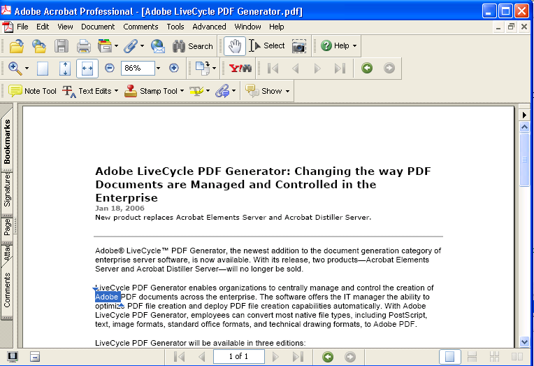

******************************************************
Working with Words
******************************************************

You can use the Acrobat core API to search for words, extract and display words, and highlight words. Using the Acrobat core API, you can, for example, create application logic that extracts words from a PDF document and places each word in a repository.

About searching for words
=========================

The Acrobat core API provides typedefs and methods for working with words. Two primary typedefs that you will use when working with words located in a PDF document are ``PDWord`` and ``PDWordFinder``. The following are two word-finding indicators:

-  Presence of non-alphanumeric characters such as dashes.
-  Offsets between characters. (While character offsets are well-defined quantities in a PDF file, word numbers are calculated by the Acrobat or Adobe Reader word finder algorithm).

About PDWord typedefs
---------------------

A ``PDWord`` object represents a word in a PDF file. Each word contains a sequence of characters in one or more styles. All characters in a word are not necessarily physically adjacent. For example, words can be hyphenated across line breaks on a page.

Each character in a word has a character type. Character types include: control code, lowercase letter, uppercase letter, digit, punctuation mark, hyphen, soft hyphen, ligature, white space, comma, period, unmapped glyph, end-of-phrase glyph, wildcard, word break, and glyphs that cannot be represented in the destination font encoding. (See the `Acrobat and PDF Library API Reference <https://www.adobe.com/go/apireference>`__.)

The ``PDWordGetCharacterTypes`` method can get the character type for each character in a word. The ``PDWordGetAttr`` method returns a mask containing information on the types of characters in a word. The mask is the logical OR of several flags, including the following:

-  One or more characters in the word cannot be represented in the output encoding.
-  One or more characters in the word are punctuation marks.
-  The first character in the word is a punctuation mark.
-  The last character in the word is a punctuation mark.
-  The word contains a ligature (a special typographic symbol consisting of two or more characters such as the English ligature used to replace the two-character sequence, f followed by i). Ligatures are used to improve the appearance of a word.
-  One or more characters in the word are digits.
-  There is a hyphen in the word.
-  There is a soft hyphen in the word.

A word's location is specified by the offset of its first character from the beginning of the page (known as the character offset). The characters are enumerated in the order in which they appear in page's content stream in the PDF file (which is not necessarily the order in which the characters are read when displayed or printed).

A word also has a character delta, which is the difference between the number of characters representing the word in the PDF file and the number of characters in the word. The character delta is non-zero, for example, when a word contains a ligature.

About PDWordFinder typedefs
---------------------------

A ``PDWordFinder`` extracts words from a PDF file, and enumerates the words on a single page or on all pages in a document. The Acrobat core API provides methods to extract words from a document, obtain information on the word finder, and to release a list of words.

Two primary methods of working with word finders are:

-  Invoking the ``PDWordFinderEnumWords`` method, which invokes a user-defined callback function each time a word is recognized on a page. (See `Extracting and displaying words <Plugins_Words.html#50618422_65675>`__.)
-  Using ``PDWordFinderAcquireWordList``, which builds a word list for an entire page before it returns. This method can return the recognized words in two possible orders:

   -  The order in which the words are encountered in the PDF file.
   -  According to word location on the page. For a page containing a single column of text, this generally is the same as reading order. For a page containing multiple columns of text, this is not true.

Creating a PDWordFinder object
==============================

To perform word operations, such as extracting and displaying words located in a PDF document, you must create a ``PDWordFinder`` object. You can create a ``PDWordFinder`` object by getting the active document (the frontmost document in Acrobat or Adobe Reader).

Optionally, you can create a ``PDWordFinderConfigRec`` object when creating a ``PDWordFinder`` object. A ``PDWordFinderConfigRec`` object enables you to customize how text is extracted. After you create an ``PDWordFinderConfigRec`` object, allocate its buffer size and set the following attributes:

* **recsize**: The size of the data structure. This attribute must be set to ``sizeof(PDWordFinderConfigRec)``.

* **ignoreCharGaps**: If ``true``, this attribute disables the conversion of large character gaps to space characters, so that the word finder reports a character space only when a space character appears in the PDF content.

* **ignoreLineGaps**: If true, this attribute disables the handling of vertical movements as line breaks, so that the word finder determines a line break only when a line break character or special tag information appears in the PDF content.

* **noAnnots**: If true, this attribute disables the extraction of text from text annotations. Normally, the word finder extracts text from the normal appearances of text annotations that are inside the page crop box.

* **noEncodingGuess**: If true, disables the guessing of the encoding of fonts that have unknown or custom encoding, when there is no ToUnicode table. Inappropriate encoding conversions can cause the word finder to mistakenly recognize non-Roman single-byte fonts as Standard Roman encoding fonts and extract the text in an unusable format. When this option is selected, the word finder avoids such unreliable encoding conversions and tries to provide the original characters without any encoding conversion for a client with its own encoding handling.

.. note::

   For a complete list of attributes that belong to a ``PDWordFinderConfigRec`` object, see the `Acrobat and PDF Library API Reference <https://www.adobe.com/go/apireference>`__.

Create a ``PDWordFinder`` object that is based on an active document by performing the following tasks:

#. Create an ``AVDoc`` object by invoking the ``AVAppGetActiveDoc`` method. (See `Opening PDF documents <Plugins_Documents.html#50618416_65430>`__.)
#. Create a ``PDDoc`` object by invoking the ``AVDocGetPDDoc`` method and passing the ``AVDoc`` object.
#. If desired, create a ``PDWordFinderConfigRec`` object. If you do not create a ``PDWordFinderConfigRec`` object, then default configuration is used. That is, all attributes that belong to an ``PDWordFinderConfigRec`` object are false.
#. Create a ``PDWordFinder`` object by invoking the ``PDDocCreateWordFinderEx`` method and passing the following arguments:

   -  A ``PDDoc`` that represents the PDF document for which the word finder is applicable.
   -  An ``ASInt16`` value that specifies the version of the word-finding algorithm to use. You can specify ``WF_LATEST_VERSION`` to use the latest version. For information about other values for this argument, see the `Acrobat and PDF Library API Reference <https://www.adobe.com/go/apireference>`__.
   -  An ``ASBool`` value that specifies whether to return Unicode. When ``true``, the word finder encodes the extracted text in Unicode format. Otherwise, the word-finding algorithm extracts the text in the host encoding format.
   -  The address of the ``PDWordFinderConfigRec`` object to use. You can pass ``NULL``, which results in the default configuration being used.

The following code example creates a ``PDWordFinder`` object.

::  

   //Get the current PDF document
   AVDoc currentAVDoc = AVAppGetActiveDoc();
   PDDoc currentPDDoc = AVDocGetPDDoc(currentAVDoc);
   

   //Create a PDWordFinderConfigRec object;
   PDWordFinderConfigRec pConfig;
   

   //Set the DWordFinderConfigRec object's attributes
   memset(&pConfig, 0, sizeof(PDWordFinderConfigRec));
   pConfig.recSize = sizeof(PDWordFinderConfigRec);
   pConfig.ignoreCharGaps = true;
   pConfig.ignoreLineGaps = true;
   pConfig.noAnnots = true;
   pConfig.noEncodingGuess = true;
   

   //Create a PDWordFinder object
   PDWordFinder pdWordFinder = PDDocCreateWordFinderEx(currentPDDoc, WF_LATEST_VERSION, false, &pConfig);

Extracting and displaying words
===============================

You can use a ``PDWordFinder`` object to extract and display all words that are located either in the entire document or the current page by creating a callback function that is invoked for each word found. To create a callback function that is invoked when a word is found, declare a ``PDWordProc`` object that represents the callback:

::

    PDWordProc wordProc;

``PDWordProc`` is a callback that is invoked when a word is located. After you create a ``PDWordProc`` object, you can invoke the ``ASCallbackCreateProto`` macro to convert a user-defined function to an Acrobat callback. For example, you can invoke ``ASCallbackCreateProto`` to convert a user-defined function named ``wordEnumerator`` to a callback function. The ``ASCallbackCreateProto`` macro requires the following arguments:

-  The callback type. In this situation, specify ``PDWordProc``.
-  The address of the user-defined function to convert to a callback function.

The ``ASCallbackCreateProto`` macro returns a callback of the specified type that invokes the user-defined function whose address was passed as the second argument. The following lines of code shows the ``ASCallbackCreateProto`` macro converting the ``wordEnumerator`` user-defined function to a ``PDWordProc`` callback.

::

    PDWordProc wordProc;
     wordProc= ASCallbackCreateProto(PDWordProc, &wordEnumerator
   );

After you create a callback function, invoke the ``PDWordFinderEnumWords`` method to extract all words from the specified page and pass the following arguments:

-  A ``PDWordFinder`` object that is responsible for finding and extracting words.
-  An ``ASInt32`` value that represents the page number from which to extract words.
-  A ``PDWordProc`` object that represents the callback function to invoke when a word is located.
-  A pointer to user-supplied data to pass to the callback function. Pass ``NULL`` if you do not want to pass user-supplied data.

To illustrate how to display words that are located on a page, this section contains a code example that creates a callback function named ``wordEnumerator`` that performs the following tasks:

-  Removes punctuation characters from the word by invoking the ``PDWordFilterWord`` method. The encoding information passed to the ``PDDocCreateWordFinderEx`` method determines which characters are removed.
-  Invokes the ``PDWordGetString`` method to get the word as a string.
-  Displays the string in an alert box by invoking the ``AVAlertConfirm`` method. If the user clicks OK, the next word is displayed until all words for the document page have been displayed. If the user clicks Cancel, this callback function returns ``false``.

The following code example extracts and displays all words that are located on the current PDF document page. Included in this code example is application logic that creates a ``PDWordFinder`` object. (See `Creating a PDWordFinder object <Plugins_Words.html#50618422_28279>`__.)

::

   ACCB1 void ACCB2 DisplayWords(void *data)
   {
   //Get the current PDF document page number
   AVDoc currentAVDoc = AVAppGetActiveDoc();
   PDDoc currentPDDoc = AVDocGetPDDoc(currentAVDoc);
   AVPageView currentPageView = AVDocGetPageView (currentAVDoc);
   ASInt32 pageNum = AVPageViewGetPageNum(currentPageView); 
     

   //Create a PDWordFinderConfigRec object;
   PDWordFinderConfigRec pConfig;
   

   //Set the DWordFinderConfigRec object's attributes
   memset(&pConfig, 0, sizeof(PDWordFinderConfigRec));
   pConfig.recSize = sizeof(PDWordFinderConfigRec);
   pConfig.ignoreCharGaps = true;
   pConfig.ignoreLineGaps = true;
   pConfig.noAnnots = true;
   pConfig.noEncodingGuess = true;
   

   //Create a PDWordFinder object
   PDWordFinder pdWordFinder = PDDocCreateWordFinderEx(currentPDDoc, WF_LATEST_VERSION, false, &pConfig);
   

   //Create a callback function
   PDWordProc wordProc = NULL;
   wordProc= ASCallbackCreateProto(PDWordProc, &wordEnumerator);
   

   //Extract and display words
   PDWordFinderEnumWords(pdWordFinder, pageNum, wordProc, NULL);
   PDWordFinderDestroy(pdWordFinder);
   }

   ACCB1 ASBool ACCB2 wordEnumerator(PDWordFinder wObj, PDWord wInfo, ASInt32 pgNum, void *clientData)
    
   {
   char stringBuffer[100];
   ASInt16 wordLength;
   

   //Remove punctuation
   PDWordFilterWord(wInfo, stringBuffer, 99, &wordLength);
   stringBuffer[wordLength] = 0;
   

   //Populate the char array with text that represents the word
   PDWordGetString (wInfo, stringBuffer, 99);
   return AVAlertConfirm(stringBuffer);
   }

.. note::

   In the previous code example, assume that the ``DisplayWords`` function was invoked from a menu item. (See `Creating Menus and Menu Commands <Plugins_Menu.html#50618409_98126>`__.)

.. caution::

   If you pass ``true`` as the ``PDDocCreateWordFinderEx`` method's third argument, then the word finder encodes the extracted text in Unicode format. As a result, words will not be displayed within the alert box. Notice in this code example, the value ``false`` is passed as the ``PDDocCreateWordFinderEx`` method's third argument.

Highlighting words
==================

You can use the Acrobat core API to highlight a word or a group of words located within a PDF document. By highlighting a word, you can make a specific word or group of words stand out. The following illustration shows the word *Adobe* highlighted.

To highlight a word you must create a ``HiliteEntry`` object and set its ``offset`` and length ``attributes``. The ``offset`` attribute specifies the location of the word from the beginning of the document. For example, if you specify 1, then the second word in the document is highlighted (this value is a 0-based index). The ``length`` attribute specifies the number of words that are highlighted. If you specify 1, then a single word is highlighted.

You can highlight a word that is located in the current page by performing the following tasks:

#. Create a ``HiliteEntry`` object and set its ``offset`` and length ``attributes``.
#. Create an ``AVDoc`` object by invoking the ``AVAppGetActiveDoc`` method. (See `Opening PDF documents <Plugins_Documents.html#50618416_65430>`__.)
#. Create a ``PDDoc`` object by invoking the ``AVDocGetPDDoc`` method and passing the ``AVDoc`` object.
#. Get the page view by invoking the ``AVDocGetPageView`` method and passing the ``AVDoc`` object. This method returns an ``AVPageView`` object. (See `Displaying page views <Plugins_Pages.html#50618407_52579>`__.)
#. Get the current page number by invoking the ``AVPageViewGetPageNum`` method and passing the ``AVPageView`` object. This method returns the page number of the current page view, which is required to highlight a word or group of words.
#. Create a ``PDPage`` object by invoking the ``PDDocAcquirePage`` method and passing the following arguments:

   -  A ``PDDoc`` object.
   -  The page number of the current page view.

The ``PDDocAcquirePage`` method returns a ``PDPage`` object.

#. Highlight a word or group of words by invoking the ``PDTextSelectCreateWordHilite`` method and passing the following arguments:

   -  A ``PDPage`` object that represents the page that will contain the highlighted word(s).
   -  The address of the ``HiliteEntry`` object.
   -  An ``ASInt32`` value that specifies the number of highlight entries.

This method returns a ``PDTextSelect`` object.

#. Set the PDF document's text selection type by invoking the ``AVDocSetSelection`` method. This method does not have a return value and requires the following arguments:

   -  An ``AVDoc`` object that represents the PDF document in which the highlighted words appear.
   -  An ``ASAtom`` object that specifies the selection type. Because words are highlighted, you can specify ``text``.
   -  A ``PDTextSelect`` object that represents the text selection. Cast the ``PDTextSelect`` object as a void pointer.
   -  An ``ASBool`` object that specifies whether to highlight the selection. Pass the value ``true`` to highlight the specified word(s).

#. Display the current selection by invoking the ``AVDocShowSelection`` method and passing the ``AVDoc`` that represents the PDF document that contains the highlighted word(s).
#. Release the ``PDPage`` object by invoking the ``PDPageRelease`` method and passing the ``PDPage`` object.

The following code example highlights the tenth word that is located in the page of the current PDF document.

:: 

   //Create a HiliteEntry object and set its attributes
   HiliteEntry hilite;
   hilite.offset = 10;
   hilite.length = 1;
   

   //Get the page number of the current page view
   AVDoc currentAVDoc = AVAppGetActiveDoc();
   PDDoc currentPDDoc = AVDocGetPDDoc(currentAVDoc);
   AVPageView currentPageView = AVDocGetPageView(currentAVDoc);
   ASInt32 pageNum = AVPageViewGetPageNum(currentPageView); 
   

   //Highlight the tenth word
   PDPage pdPage = PDDocAcquirePage (currentPDDoc, pageNum);
   PDTextSelect textSelection = PDTextSelectCreateWordHilite(pdPage, 

   &hilite, 1);
   AVDocSetSelection(currentAVDoc, ASAtomFromString("Text"), 

   (void *)textSelection, true);
   AVDocShowSelection (currentAVDoc);
   PDPageRelease (pdPage);
