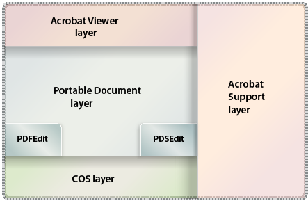
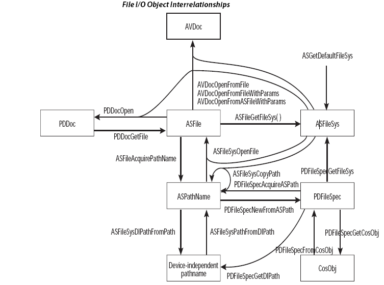
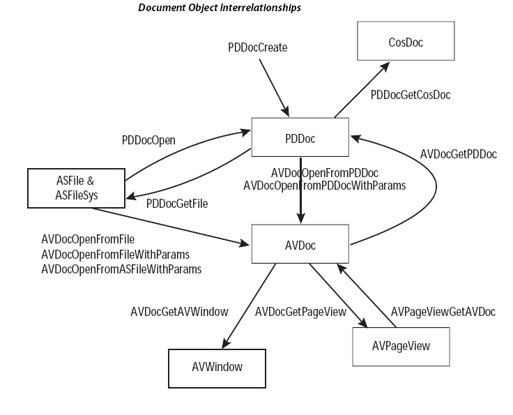
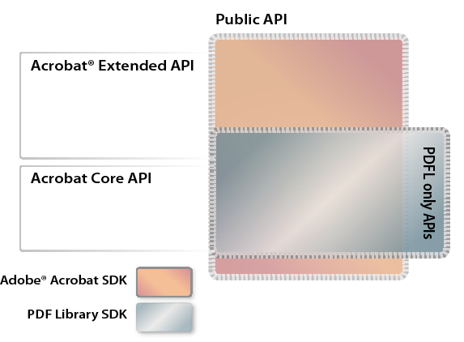

******************************************************
Introduction to Plugin Development
******************************************************

You can use the Acrobat SDK to create plugins for Adobe Reader and Acrobat as well as stand-alone applications that interact with and manipulate PDF documents. The Acrobat SDK contains two libraries: the Acrobat core API and the PDF Library API.

The Acrobat core API contains a set of interfaces that let you develop plugins that integrate with Acrobat and Adobe Reader. The PDF Library API lets you develop applications that interact with and manipulate PDF documents. It overlaps with the Acrobat core API (with the important exception of the AV-layer, which is only part of the Acrobat core API); however, the PDF Library API also extends the Acrobat core API with a small number of interfaces specific to the PDF Library API.

This chapter introduces the Acrobat core API and PDF Library API. The API descriptions appear in the `Acrobat and PDF Library API Reference <https://www.adobe.com/go/apireference>`__.

About plugins
=============

A plugin is an application that uses the resources of Acrobat or Adobe Reader as a host environment. This means that a plugin does not require complex user interface elements. However, it must perform certain basic functions to let Adobe Reader or Acrobat know of its presence.

Plugins are dynamically-linked extensions to Acrobat or Adobe Reader and are written using the Acrobat core API, which is an ANSI C/C++ library. Plugins add custom functionality and are equivalent to dynamically-linked libraries (DLLs) on the Microsoft Windows platform; however, the plugin file name extension is.api, not.dll. On Mac OS, the file name extension of a plugin is ``acroplugin``.

Acrobat and Adobe Reader plugins are grouped in the following categories:

-  Regular plugins. Most plugins fall under this category.
-  Reader-enabled plugins. Reader-enabled plugins access the limited set of APIs supported by Adobe Reader. These plugins are developed with permission from Adobe and require special processing to load under Adobe Reader. (See `Creating an Adobe Reader plugin <Plugins_ReaderPlug.html#50618405_11144>`__.)
-  Certified plugins. Certified plugins have undergone extensive testing to ensure that they do not compromise the integrity of the Acrobat security model. There is currently no way for third party plugins to be certified by Adobe. Certified plugins are reserved for Adobe only.

To ensure that only certified plugins are loaded with your installation of Acrobat or Adobe Reader, select the "Use only certified plugins" checkbox in the General panel of the Preferences dialog.

For security, DLLs cannot be loaded from subdirectories. Only DLLs located in the "plugins" folder will be loaded.

On the Mac OS platform, the third-party plugins should be installed in either of these directories:

-  ~/Library/Application Support/Adobe/Acrobat/(version)/Plugins
-  Library/Application Support/Adobe/Acrobat/(version)/Plugins

About the Acrobat core API
==========================

The Acrobat core API consists of methods that operate on objects located within PDF documents. The Acrobat core API is implemented as a standard ANSI C programming library where methods are C functions and objects are opaque data types that encapsulate their data. The Acrobat core API is supported on Windows (32- and 64-bit) and Mac OS.

The following diagram illustrates the hierarchy of the Acrobat core API.

Acrobat Viewer layer
---------------------------------

The Acrobat Viewer (AV) layer enables plugins to control Acrobat and modify its user interface. Using AV methods, you can, for example, add menus and menu commands, add buttons to toolbars, open and close files, display simple dialog boxes, and perform many other application-level tasks.

.. note::

   AV layer methods are not available through the PDF Library API.

Portable Document layer
---------------------------------

The Portable Document (PD) layer provides access to PDF document components such as pages and annotations. Closely related to the PD layer are two method groups, each of which controls a different aspect of a PDF document:

-  PDFEdit methods deal with the physical representation of a PDF document. More specifically, PDFEdit methods handle page content as a list of objects whose values and attributes are modifiable. These methods allow your plugin or PDF Library application to read, write, edit, and create page contents and page resources, which may contain fonts, images, and so on.
-  PDSEdit methods deal with the logical structure of a PDF document. A PDF document's logical structure is built independent of its physical representation, with pointers from the logical structure to the physical representation, and the reverse. PDSEdit methods store the logical structure information. They enable your plugin or PDF Library application to access PDF files by means of a structure tree. Having logical structure in PDF files facilitates navigating, searching, and extracting data from PDF documents. For example, PDSEdit methods can obtain logically-ordered content, independently of the drawing order.

Acrobat Support layer
---------------------------------

The Acrobat Support (AS) layer provides a variety of utility methods, including platform-independent memory allocation and fixed-point math utilities. In addition, it allows plugins to replace low-level file system routines used by Acrobat (including read, write, reopen, remove file, rename file, and other directory operations). This enables Acrobat to be used with other file systems, such as on-line systems.

Cos layer
---------------------------------

The Cos Object System (Cos) layer provides access to the building blocks used to construct PDF documents. Cos methods allow plugins and PDF Library applications to manipulate low-level data in a PDF file, such as dictionary and data streams. (See `Working with Cos Objects <Plugins_Cos.html#50618418_86959>`__.)

Platform-specific methods
---------------------------------

In addition to the method groups represented in the previous diagram, the Acrobat core API includes platform-specific plugin utilities to handle issues that are unique to Windows and Mac OS. For information about these methods, see the `Acrobat and PDF Library API Reference <https://www.adobe.com/go/apireference>`__.

Acrobat core API objects
=============================================

Most objects accessible through AV and PD layer methods are opaque. That is, they are neither pointers nor pointers to pointers. They provide equivalent functionality in that they reference an object's data rather than storing it. If you assign one object to another variable, both variables affect the same internal object.

Objects are typically named using the following conventions:

-  The name of the concrete definition for a complex type ends in ``Rec`` (for record).
-  A pointer to a simple or complex type ends in ``P`` (for pointer).
-  Opaque types do not contain a ``P`` suffix. For example, a ``PDDoc`` object references a PDF document.
-  Three names identify complex types that provide callback methods:

   -   **Monitor**: A set of callbacks for an enumeration method.
   -   **Server**: An implementation of a service added by a plugin.
   -   **Handler**: An implementation for a subtype of object handled by a plugin

-  Callback method names typically contain the suffix ``Proc`` (for procedure).

File object interrelationships
---------------------------------

The following diagram shows file object interrelationships and how certain objects can be obtained by using other objects.

Document object interrelationships
-------------------------------------

The following diagram shows document object interrelationships and how certain objects can be obtained by using other objects.

Acrobat core API methods
======================================

Acrobat core API method names typically conform to the following syntax:

::

    <layer><object><verb><thing>

**layer**: identifies the method's layer (for example, AV for Acrobat Viewer layer).

**object**: identifies the object upon which the method acts (for example, menu).

**verb**: specifies an action that the method performs (for example, get or set). See the table that follows this list for the most commonly used verbs in method names.

**thing**: specific to each method, usually an object of the operation. May not always be present.

The following table lists some common verbs that are used in method names and describes their meaning.

 

+-----------------------------------+------------------------------------------------------------------------------------------------------------------------------------------------------------------------------+
| Verb                              | Description                                                                                                                                                                  |
+===================================+==============================================================================================================================================================================+
| Acquire                           | | Obtains a shareable resource from a parent object or increments a reference counter for an object. The shared object is not destroyed until all acquires have released it. |
|                                   | | Example: ``AVMenuItemAcquire``                                                                                                                                             |
+-----------------------------------+------------------------------------------------------------------------------------------------------------------------------------------------------------------------------+
| Add                               | | Adds an object as a child to the current object.                                                                                                                           |
|                                   | | Example: ``PDBookmarkAddChild``                                                                                                                                            |
+-----------------------------------+------------------------------------------------------------------------------------------------------------------------------------------------------------------------------+
| AddNew                            | | Creates a new object using the specified parameters and adds the new object to the current object.                                                                         |
|                                   | | Example: ``PDBookmarkAddNewChild``                                                                                                                                         |
+-----------------------------------+------------------------------------------------------------------------------------------------------------------------------------------------------------------------------+
| Close                             | | Destroys an object that was opened and closes the underlying storage or stream.                                                                                            |
|                                   | | Example: ``ASFileClose``                                                                                                                                                   |
+-----------------------------------+------------------------------------------------------------------------------------------------------------------------------------------------------------------------------+
| Create                            | | Creates a new object of a given type.                                                                                                                                      |
|                                   | | Example: ``PDDocCreatePage``.                                                                                                                                              |
+-----------------------------------+------------------------------------------------------------------------------------------------------------------------------------------------------------------------------+
| Delete                            | | Removes the second object from the current object and destroys the second object.                                                                                          |
|                                   | | Example: ``PDDocDeletePages``                                                                                                                                              |
+-----------------------------------+------------------------------------------------------------------------------------------------------------------------------------------------------------------------------+
| Destroy                           | | Destroys the specified object and releases its resources immediately.                                                                                                      |
|                                   | | Example: ``PDBookmarkDestroy``                                                                                                                                             |
+-----------------------------------+------------------------------------------------------------------------------------------------------------------------------------------------------------------------------+
| Enum                              | | Enumerates the specified descendant objects of the current object.                                                                                                         |
|                                   | | Example: ``PDDocEnumFonts``                                                                                                                                                |
+-----------------------------------+------------------------------------------------------------------------------------------------------------------------------------------------------------------------------+
| Get                               | | Retrieves a specific object attribute.                                                                                                                                     |
|                                   | | Example: ``AVWindowGetTitle``                                                                                                                                              |
+-----------------------------------+------------------------------------------------------------------------------------------------------------------------------------------------------------------------------+
| Is                                | | Retrieves a Boolean attribute of the object.                                                                                                                               |
|                                   | | Example: ``PDBookmarkIsOpen``                                                                                                                                              |
+-----------------------------------+------------------------------------------------------------------------------------------------------------------------------------------------------------------------------+
| New                               | | Creates a new unattached object.                                                                                                                                           |
|                                   | | Example: ``AVMenuNew``                                                                                                                                                     |
+-----------------------------------+------------------------------------------------------------------------------------------------------------------------------------------------------------------------------+
| Open                              | | Opens an object from storage or a stream.                                                                                                                                  |
|                                   | | Example: ``AVDocOpenFromFile``                                                                                                                                             |
+-----------------------------------+------------------------------------------------------------------------------------------------------------------------------------------------------------------------------+
| Release                           | | Releases a shared object.                                                                                                                                                  |
|                                   | | Example: ``PDPageRelease``                                                                                                                                                 |
+-----------------------------------+------------------------------------------------------------------------------------------------------------------------------------------------------------------------------+
| Remove                            | | Removes the second object from the current object but does not destroy it.                                                                                                 |
|                                   | | Example: ``AVMenuRemove``                                                                                                                                                  |
+-----------------------------------+------------------------------------------------------------------------------------------------------------------------------------------------------------------------------+
| Set                               | | Sets an attribute of the object.                                                                                                                                           |
|                                   | | Example: ``PDAnnotSetFlags``                                                                                                                                               |
|                                   |   Note: Cos methods uses the verb Put.                                                                                                                                       |
+-----------------------------------+------------------------------------------------------------------------------------------------------------------------------------------------------------------------------+

While many API method names follow the syntax specified in this section, there are exceptions. For example, conversion methods conform to the following syntax:

::

    <layer><object><source_object>to<dest_object>

An example is the ``AVPageViewPointToDevice`` method. (See the `Acrobat and PDF Library API Reference <https://www.adobe.com/go/apireference>`__.)

Get and Set methods are used for getting and setting object attributes. Each object type has zero or more attributes. For example, an annotation object (``PDAnnot`` ) contains attributes such as color and date. You can obtain and modify attribute values by using methods such as ``PDAnnotGetColor`` and ``PDAnnotSetDate``.

In some cases, the return value of a Get method is another object. For example, the ``AVDocGetAVWindow`` method returns an ``AVWindow`` object corresponding to the specified ``AVDoc`` object.

Other methods that return objects have the word Acquire in their name. These methods are always paired with a corresponding Release method, and have the additional side effect of incrementing or decrementing a reference count. The Acrobat core API uses ``Acquire`` and ``Release`` methods to perform various tasks such as determining whether it is safe to free a memory structure representing an object. Failure to match ``Acquire`` and ``Release`` method pairs can result in Acrobat complaining that a document cannot be closed due to non-zero reference counts. For more information, see `Acquiring and releasing objects <Plugins_Pimech.html#50618406_68646>`__.

Data types
==========================

The Acrobat core API consists of the following data types:

-  Scalar
-  Simple
-  Complex
-  Opaque
-  Cos

Scalar types
---------------------------------

Scalar (non-pointer) types are based on underlying C language types, but have platform-independent sizes. They are defined in the header file CoreExpT.h. All scalar types are AS layer types. For portability, enumerated types are defined using a type of known size, such as ``ASEnum16``. (See `Acrobat Support layer <Plugins_Introduction.html#50618410_20071>`__.)

The following table describes scalar types.

.. _section-1:

 

+-----------------------+-----------------------+--------------------------------+
| Type                  | Byte Size             | Description                    |
+=======================+=======================+================================+
|                       | 2                     | Boolean                        |
|                       |                       |                                |
|    ASBool             |                       |                                |
+-----------------------+-----------------------+--------------------------------+
|                       | 1                     | unsigned char                  |
|                       |                       |                                |
|    ASUns8             |                       |                                |
+-----------------------+-----------------------+--------------------------------+
|                       | 2                     | unsigned short                 |
|                       |                       |                                |
|    ASUns16            |                       |                                |
+-----------------------+-----------------------+--------------------------------+
|                       | 4                     | unsigned long                  |
|                       |                       |                                |
|    ASUns32            |                       |                                |
+-----------------------+-----------------------+--------------------------------+
|                       | 1                     | char                           |
|                       |                       |                                |
|    ASInt8             |                       |                                |
+-----------------------+-----------------------+--------------------------------+
|                       | 2                     | signed short                   |
|                       |                       |                                |
|    ASInt16            |                       |                                |
+-----------------------+-----------------------+--------------------------------+
|                       | 4                     | signed long                    |
|                       |                       |                                |
|    ASInt32            |                       |                                |
+-----------------------+-----------------------+--------------------------------+
|                       | 8                     | signed long                    |
|                       |                       |                                |
|    ASInt64            |                       |                                |
+-----------------------+-----------------------+--------------------------------+
|                       | 1                     | enum (127 values)              |
|                       |                       |                                |
|    ASEnum8            |                       |                                |
+-----------------------+-----------------------+--------------------------------+
|                       | 2                     | enum (32767 values)            |
|                       |                       |                                |
|    ASEnum16           |                       |                                |
+-----------------------+-----------------------+--------------------------------+
|                       | 4                     | fixed point integer            |
|                       |                       |                                |
|    ASFixed            |                       |                                |
+-----------------------+-----------------------+--------------------------------+
|                       | 4                     | size of objects (as in size_t) |
|                       |                       |                                |
|    ASSize_t           |                       |                                |
+-----------------------+-----------------------+--------------------------------+

Simple types
---------------------------------

Simple types represent abstractions such as a rectangle or matrix. These objects have fields that do not change. The following are examples of simple data types:

-  ``ASFixedRect``
-  ``ASFixedMatrix``
-  ``AVRect32``

Complex types
---------------------------------

Complex types are structures that contain one or more fields. They are used in the following situations:

-  To transfer a large number of parameters to or from a method. For example, the ``PDFontGetMetrics`` method returns font metrics by filling out a complex structure (``PDFontMetrics`` ).
-  To define a data handler or server. For example, your plugin must provide a complex structure populated with callback methods (``AVAnnotHandlerRec`` ) when it registers an annotation handler.

Opaque types
---------------------------------

Many methods hide the concrete C-language representation of data structures. Most methods accept an object and then perform an action on the object. Examples of opaque objects are ``PDDoc`` and ``AVPageView`` objects.

Cos types
---------------------------------

A Cos object refers to its corresponding Cos object in the PDF document. Cos objects are represented as opaque 8-byte structures. They have subtypes of boolean, integer, real, name, string, array, dict, and stream. (See `Working with Cos Objects <Plugins_Cos.html#50618418_86959>`__.)

About PDF Library and plugin applications
=========================================

The Acrobat core API and the PDF Library API let you create plugins and PDF Library applications to enhance and manipulate PDF document content and to customize Acrobat and Adobe Reader to meet your requirements. The PDF Library API is a subset of the Acrobat core API, with some additional functions that are available only in PDF Library.

The following diagram shows the relationship between the PDF Library API and the Acrobat core API.

For information about creating an Acrobat core API or project or PDF Library API, see `Creating Plugin and PDF Library Applications <Plugins_CreatingSimplePlug.html#50618417_31734>`__.

.. note::

   The remaining parts of this section describe tasks that you can perform by using either the Acrobat core API or the PDF Library API and refer you to the corresponding sections located in this guide.

Manipulating Acrobat and Adobe Reader
-------------------------------------

Plugins can control the Acrobat and Adobe Reader interface. For example, you can create and load new buttons. (See `Attaching a button to a toolbar <Plugins_Toolbutton.html#50618403_75762>`__.)

Displaying a PDF document in an external window
-----------------------------------------------

Plugins can have Acrobat draw into an arbitrary window, allowing plugins to support PDF file viewing within their own user interface. For example, you can view a PDF document in an external window while Acrobat is displaying another PDF document. That way, you can view two separate PDF documents from within the same instance of Acrobat. (See `Opening a PDF document in an external window <Plugins_Documents.html#50618416_74021>`__.)

Indexed searching
-----------------

Indexed searching enables you to catalog, index, search, and highlight text in PDF files. Simple sequential text searching may be too time consuming for long documents, and completely inadequate for searching a large collection of documents. (See `Working with Words <Plugins_Words.html#50618422_87728>`__.)

Text retrieval systems overcome this problem by building a search index containing information on the location of all words in each document in the collection. A search system uses this index to determine which documents—and word locations within those documents—satisfy a given query. The search system then allows a user to browse the found documents, optionally displaying or highlighting the matching items.

Modifying file access
---------------------

Plugins can provide their own file access procedures that read and write data when requested by the Acrobat core API. Using this capability, a plugin can enable PDF documents to be read from on-line systems, e–mail, document management, or database programs. (See `Accessing non-PDF files <Plugins_Documents.html#50618416_95146>`__.)

Creating new annotation types
-----------------------------

Plugins can create their own annotation types, including any data they need. A custom annotation type can enable a user to draw (not just type) in an annotation, it can provide support for multiple fonts or text styles, or it can support annotations that can only be viewed by specific users. For example, you can use the Acrobat core API to create 3D annotations. (See `Creating 3D Annotations <Plugins_3D_samples.html#50618421_43763>`__.)

Dynamically adding text to PDF documents
----------------------------------------

You can use the Acrobat core API or the PDF Library API to dynamically modify a PDF document. For example, a plugin or PDF Library application can retrieve data from an enterprise database and insert the data into a PDF document. (See `Inserting Text into PDF Documents <Plugins_Insertext.html#50618411_44849>`__.)

Understanding your target application
=====================================

Both Acrobat and Adobe Reader accept plugins. Adobe Reader is designed predominantly for viewing and printing PDF documents. Acrobat Pro and Acrobat Pro Extended let you create PDF files, and offer advanced control over document exchange, review, and output. Acrobat Standard also lets you create PDF files and exchange and review comments.

Rights-enabled PDF documents
---------------------------------

PDF documents that are *rights-enabled* can access specific functionality in Adobe Reader that would otherwise be unavailable. When a PDF document is rights-enabled, additional APIs become available for plugin development.

Adobe Reader plugins
---------------------------------

Adobe Reader only accepts Reader-enabled plugins. (See `Creating an Adobe Reader plugin <Plugins_ReaderPlug.html#50618405_11144>`__.)

You may want your Reader-enabled plugin to access APIs that are available when the plugin is running with Acrobat but not when running with Adobe Reader. Use the ``ASGetConfiguration`` method to check whether Acrobat or Adobe Reader is running, and invoke these APIs only if your plugin is running with Acrobat. Failure to do so exposes the user to a variety of error messages. You can display a message to the user by invoking the ``AVAlertNote`` method. (See the `Acrobat and PDF Library API Reference <https://www.adobe.com/go/apireference>`__.)

If Adobe Reader attempts to load a plugin that is not Reader-enabled, Adobe Reader notifies the user that the plugin cannot function fully and then proceeds in one of these ways:

-  Does not load the plugin.
-  Omits toolbar buttons and menu items that enable editing.
-  Displays dimmed toolbar buttons and menu items that enable editing.

Plugins that need to check whether or not they are running under Adobe Reader should do so as early in initialization as possible. Plugins that create and manipulate custom annotations should allow their annotations to be displayed (they cannot be created, deleted, or edited) when running under Adobe Reader.

Registering plugins for use by the plugin finder
================================================

You can register your plugin with Adobe to ensure that users are prompted to download and install it when they open PDF documents that require it.

Registering your plugin means that Adobe adds information about your plugin to a list of registered plugins. Each entry in this list associates a PDF dictionary extension and other characteristics with a URL from which users can download and install the plugin that processes that extension. Acrobat and Adobe Reader access the list over the web. The list is not publicly displayed on adobe.com. That is, it cannot be used to advertise the availability of your plugins. If you wish to post on adobe.com information about your plugin, see your Adobe representative.

PDF dictionary extensions
-------------------------

PDF documents can include dictionaries that are extensions to the current PDF specification. Such dictionary extensions have names of the form ``prefix_propertyName`` that associate it with a particular plug-in developer.

To avoid collisions over company names and company-specific extension names, Adobe (on behalf of ISO) maintains a prefix name registry. This registry is used to designate a 4-character, case-sensitive prefix that identifies a company or other entity. This prefix is used to create second-class names (dictionary or property names) of the form ``MYCO_aPropertyName``.

   
