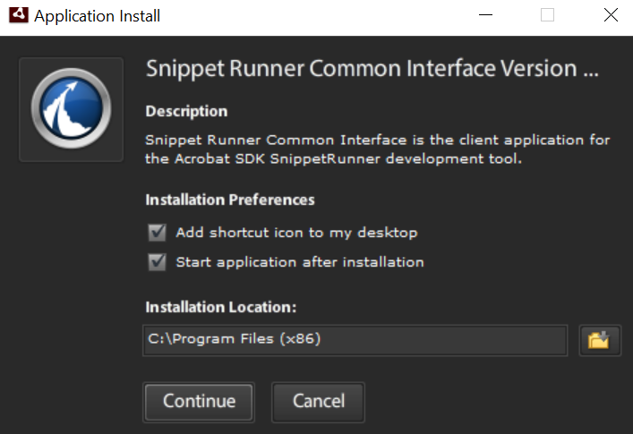
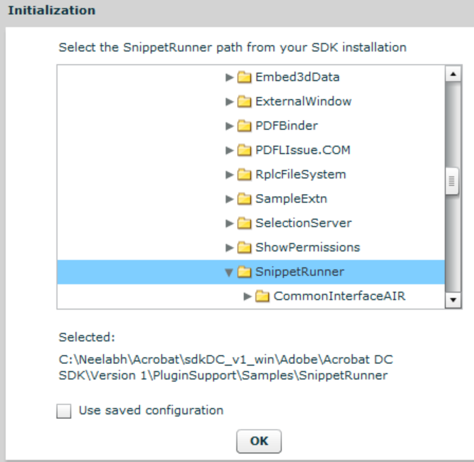

******************************************************
Plugin Samples
******************************************************

BasicPlugin
===========

**Location**

Plugins/Samples/BasicPlugin

**Description**

Provides the minimum code required to enable developers to get started. The code adds a new menu item under the Acrobat SDK menu and displays a simple message.

With the basic plugin framework set up in the sample, users can quickly make a plugin of their own by modifying and adding the code in the BasicPlugin.cpp file to set up their own menu item and menu function.

BatesNumbering
==============

.. _location-1:

**Location**

Plugins/Samples/BatesNumbering

.. _description-1:

**Description**

Demonstrates Bates Numbering features exposed to third-party developers:

-  How to extract Bates Numbering that is added by Acrobat.
-  How to use Acrobat API to programmatically add Bates Numbering to PDF documents.
-  How to use Acrobat API to programmatically remove Bates Numbering from PDF documents.

**Usage**

Follow these steps to test the functionality of the sample:

Open a PDF document.

-  Click Acrobat SDK > Bates Numbering > Add... to add Bates Numbering to the PDF document.
-  Click Acroabt SDK > Bates Numbering > Extract... to extract Bates Numbering from the PDF document.
-  Click Acrobat SDK > Bates Numbering > Remove... to remove Bates Numbering from the PDF document.

.. note::

   This plugin will not work in Adobe Reader.

CapiSamples
===========

.. _location-2:

**Location**

Plugins/Samples/CapiSamples

.. _description-2:

**Description**

There are two samples in this demonstration. One is SampleCsp. It is a DLL, and it is the actual Cryptographic Service Provider (CSP). The SampleRegistrar sample uses the services provided by SampleCsp.

The purpose of SampleCsp is to provide a reference implementation. The cryptographic functionality of this CSP is passed through to the Microsoft Enhanced Crypto Provider. This implementation currently works on PFX files. SampleCsp opens the PFX files and uses the credential within them.

SampleRegistrar is a separate application which allows users to manage the certificates bound to SampleCsp. This application interacts with SampleCsp to do the following:

-  Register a digital ID file (PFX file) and add its certificates to the windows "My" store.
-  Un-register a digital ID file and remove its certificates from the windows "My" store.
-  List the registered digital IDs.

.. _usage-1:

**Usage**

This sample requires a CSP digitally signed by Microsoft. Download Microsoft's CSDK from https://www.microsoft.com/en-us/download/details.aspx?id=30688.

Once signed, locate SampleCsp in the MsSignedSampleCsp directory.

To manage certificates by SampleRegistrar:

1. Compile SampleRegistrar.

2. Register SampleCsp by doing the following:

-  At Dos prompt, go to the MsSignedSampleCsp directory.
-  Type in Command 'regsvr32 SampleCsp.dll'.

3. At the DOS prompt, go to the directory where SampleRegistrar.exe resides.

4. Use the following commands to manage certificates:

-  To list registered PFXs: 'SampleRegistrar.exe -l'
-  To register PFX: 'SampleRegistrar.exe -r mycert.pfx password'
-  To un-register PFX: 'SampleRegistrar.exe -u <hex-encoded-sha1-cert-digest>'

There are some easy tests you can run to check the CSP is working with Acrobat:

1. Register a digital ID via the CSP. It must show up in the Security Settings under "Windows Digital IDs".

2. Try to make a digital signature with the registered digital ID.

3. Encrypt a file for this certificate and then try to decrypt it. You need to close the document and reopen it.

If all of these tests pass, then the CSP is working. The effect should be to un-register the digital ID, not to actually delete the file.

.. note::

   This plugin is Windows only.

DdeServer
=========

.. _location-3:

**Location**

PluginSupport/Samples/DdeServer

.. _description-3:

**Description**

Demonstrates how to establish communication between an external application and an Acrobat plugin using DDE. This allows a plugin to expose functionality to external applications that are not present in the standard IAC interfaces.

.. _usage-2:

**Usage**

A sample client application is provided with the DdeServer plugin. The application communicates with the plugin to obtain the page number associated with the active page view and to add a text annotation to the page associated with the active page view. Acrobat must be running for the client application to function correctly.

Limitations
~~~~~~~~~~~

-  Windows only.
-  This plugin will not work in Adobe Reader since it accesses annotations. It is possible to use this technique to communicate with an Adobe Reader plugin.
-  Non functional when Protected Mode is enabled.

DMSIntegration
==============

.. _location-4:

**Location**

Plugins/Samples/DMSIntegration

.. _description-4:

**Description**

Demonstrates how a DMS system can integrate with Acrobat. This sample demonstrates the following three steps needed for DMS systems to integrate with Acrobat:

1. Write an ASFileSys for the DMS system.

2. Replace the Acrobat dialogs.

-  AVAppChooseFolderDialog
-  AVAppOpenDialog
-  AVAppSaveDialog

DocSign
=======

.. _location-5:

**Location**

Plugins/Samples/DocSign

.. _description-5:

**Description**

Demonstrates how to use the PubSec API. It is more a "skeleton" plugin than a fully functional sample, since it has no encryption library. The plugin assumes a plugin author knows how to generate public/private key pairs, store them, use them to encrypt data, etc. This skeleton sample demonstrates how to hook into Acrobat. plugin does.

.. _usage-3:

**Usage**

To use DocSign, change the default signature handler in Acrobat Preferences to the DocSign handler. After that, DocSign will be used through the same user interface points as the standard signature handler.

**Implementation details**

This sample does not provide true digital signatures. It provides a skeleton of a PubSec API-based plugin. Developers must add your own encryption routines.

Embed3DData
===========

.. _location-6:

**Location**

PluginSupport/Samples/Embed3DData

.. _description-6:

**Description**

Demonstrates how to programmatically create a 3D annotation in a PDF file. For more information about the process, see the chapter titled "Creating 3D Annotations" in the Developing Plugins and Applications Guide (plugin_apps_developer_guide.pdf)

The program output is a new PDF file with the 3D annotation.

.. _implementation-details-1:

**Implementation details**

-  Create a new PDF file with one page.
-  Add a 3D annotation to the page.
-  Create the 3D stream with the input 3D data.
-  Create entries for the 3D stream dictionary.
-  Embed optional JavaScript code for the 3D stream.
-  Create optional "VA" entry for the 3D stream.
-  Create optional animation dictionary for the 3D stream.
-  Specify key-value pairs in the annotation dictionary.
-  Create optional activation entry for the 3D annotation.
-  Specify option default initial view entry for the 3D annotation.
-  Create an annotation appearance for the 3D annotation. The code shows two possible ways to create a form XObject for the 3D annotation's appearance. The annotation appearance can come from either a PDF file containing an image or a watermark generated on the fly.
-  The output PDF file works with Acrobat and Adobe Reader 7.0 or later.

.. _usage-4:

**Usage**

-  Select "Create PDF with 3D Annotation" from "Advanced-Acrobat SDK".
-  Select the U3D model file when prompted.
-  Choose whether you want to specify a poster for the 3D annotation when prompted.
-  Select the poster PDF file that has the image if you answered "Yes" in step 3.

.. note::

   This plugin does not work in Adobe Reader.

RplcFileSystem
==============

.. _location-7:

**Location**

Plugins/Samples/RplcFileSystem

.. _description-7:

**Description**

Demonstrates how to create a custom file system. The sample is basically a wrapper around the default file system. The point is to demonstrate the mechanism for adding a new file system without becoming bogged down with complex implementation considerations.

.. _usage-5:

**Usage**

The replacement file system can be exercised by selecting the Replacement File System menu item on the Acrobat SDK submenu.

.. _implementation-details-2:

**Implementation details**

The sample only implements the callbacks supported by the default file system.

SampleExtn
==========

.. _location-8:

**Location**

Plugins/Samples/SampleExtn

.. _description-8:

**Description**

This sample demonstrates how a plugin can work with the app in sandbox mode (protected mode is enabled). For details on how the plugin and broker interact with each other and hence the app, please refer 'Sandbox Broker Extensibility' the `Acrobat SDK Overview <https://www.adobe.com/go/acrobatsdk_overview>`__ .

.. _usage-6:

**Usage**

#. Configure the sample to enable it for the app and build the plugin.
#. Copy the SamplePI.api to <Installed_Path>plug_insSamplePI.api.
#. Copy the SamplePIBroker.exe process to <Install_Path>plug_inspi_brokersSamplePIBroker.exe.
#. Start the app in Protected Mode and play with SamplePI.api from the Acrobat SDK->SamplePI menu.

.. note::

   This is a Windows-only plugin

SelectionServer
===============

**Location**

PluginSupport/Samples/SelectionServer

.. _description-9:

**Description**

Demonstrates how to implement a minimal selection server. The SelectionServer plugin implements a selection server to handle images. The image selection tool allows users to select images by calling AVDocSetSelection() with a selection type of "Image". The selection server functionality is limited to getting, showing, and losing a selection.

.. _usage-7:

**Usage**

The plugin registers an Image Selection tool that allows users to select image XObjects on the page.

Installs the Acrobat SDK > Image Selection Tool menuitem and the associated AVToolButton. You can use either to toggle the state of the selection server.

.. note::

   Will display various messages using the SnippetRunner plugin HFT in the CommonInterface.air. You must compile and run the SnippetRunner sample and CommonInterface.air prior to running this sample.

.. note::

   Will not work in Adobe Reader.

Snippet Runner
==============

.. _location-9:

**Location**

PluginSupport/Samples/SnippetRunner

.. _description-10:

**Description**

The SnippetRunner plugin provides infrastructure and utility functions to support execution of Acrobat plugin code snippets. A snippet is a small complete portion of Acrobat plugin code. More than 100 sample code snippets are provided in the SnippetRunner project to demonstrate Acrobat API methods. However, the SnippetRunner plugin also allows developers to quickly prototype Acrobat API calls without the overhead of writing and verifying a complete plugin.

While this document includes information on the SnippetRunner environment and use, for more details on writing and loading original snippets, see the SnippetRunner Cookbook.

.. _implementation-details-3:

**Implementation details**

SnippetRunner interaction is via a common AIR-based graphical user interface for Windows and Mac. This Common User Interface acts as a client to its associated SnippetRunner back-end -- the SnippetRunnerServer Acrobat plugin -- and provides Acrobat with a common cross-platform GUI. By sending commands to the SnippetRunnerServer back-end and receiving feedback from it, the Common Interface executes snippet commands and provides rich information about snippets, output and document status. It also allows browsing the snippet source code from within the interface.

.. image:: images/snippetrunnerui.png

.. _usage-8:

**Usage**

Some snippets require external files. These can either be sample files for input or resources (for UI artifacts). Example files are delivered within the ``Examples`` directory of the SnippetRunner plugin.

.. note::

   This plugin will not work in Adobe Reader.

When starting Common Interface for the first time, set the root of the ``SnippetRunner`` folder. This persists between application instantiations. Note that for security, the root SnippetRunner folder must reside in the same partition as the boot partition.

When there's a PDF document open in a browser prior to explicitly start Acrobat, subsequent connection attempts from the Common Interface will be made with the SnippetRunnerServer plugin associated with the Acrobat browser plugin process rather than the Acrobat process you just started. If your Common Interface suddenly fails to connect with the SnippetRunnerServer or the changes you made to a snippet are not reflected after rebuilding the plugin and restarting Acrobat, quit your browser and restart Acrobat and the Common Interface.

To run the SnippetRunner:

#. Build the SnippetRunner sample.
#. Copy the SnippetRunnerServer.api to C:Program Files (x86)Adobe(product version)Acrobatplug_ins.
#. Install last available working version of Adobe AIR runtime from: https://get.adobe.com/air/. Doing so installs AIR to C:Program Files (x86)Common FilesAdobe AIRVersions1.0.
#. Add the AIR path above to your machine's PATH environment variables.
#. Open the command prompt as an Administrator.
#. Set the Snippet Runner directory. For example: cd C:(username)AcrobatsdkDC_v1_winAdobeAcrobat DC SDKVersion 1PluginSupportSamplesSnippetRunner
#. Run the command: "Adobe AIR Application Installer.exe" -ignoreExpiredCertificateTimestamp
#. Navigate to CommonInterfaceAIR.air in the Snippet Runner folder inside Acrobat SDK and click install.
#. Change the install location to the Snippet Runner directory where CommonInterfaceAIR.air is present.

#. Complete the installation
#. Once the CommonInterfaceAIR.air launches, select the Snippet Runner Folder path as the initial path. Doing so should load the snippet list.

#. Launch Acrobat so that it will act as server for SnippetRunner's CommonInterfaceAIR.air client.

Included snippets

* AVAlertSnip
* AVAppFrontDocChangeNotSnip
* AVAppPrefsSnip
* AVAppRegisterForContextMenuSnip
* AVAppRegisterForPageViewDrawingSnip
* AVDocAVWindowDidChangeSnip
* AVDocCloseNotSnip
* AVDocGetSelectionTypeSnip
* AVDocOpenNotSnip
* AVDocShowAnnotPropertiesSnip
* AVDocWindowWasAddedSnip
* AVDocWindowWasRemovedSnip
* AVEnumActionHandlerSnip
* AVPageViewDrawRectSnip
* AVPageViewToggleWireframeDrawingSnip
* AVPrintSnip
* AVSaveAsRtfSnip
* AVWindowMaximizeCurrentPageViewSnip
* CallJsCreateButtonSnip
* CallJsGetFieldValueSnip
* CallJsResponseSnip
* CallJsSignatureFieldSnip
* CallJsTextFieldSnip
* CloseFrontDocSnip
* ColorSelectedBookmarksSnip
* ColorSetupSnip
* ConvertFlate2JPXSnip
* CosDecryptDataSnip
* CosEncryptDataSnip
* DocMetadataSnip
* EmitPostScriptSnip
* EnumAVConvExtSnip
* ExportFormDataSnip
* FormCalculationsSnip
* IdleProcSnip
* InvokeAccessibilityCheckerCmdSnip
* InvokeCreateAllThumbsCmdSnip
* InvokeDeleteAllThumbsCmdSnip
* InvokeDeleteCmdSnip
* InvokeFlattenOCGsCmdSnip
* InvokeMakeAccessibleCmdSnip
* InvokeOpenOptionsCmdSnip
* InvokeSummarizeCmdSnip
* LoadHowToSnip
* OpenDocumentSnip
* OptContNotificationTracerSnip
* PDEPathToggleVisibilitySnip
* PDPageNotifyContentsChangeSnip
* RegisterFileConverterSnip
* ReplaceMethodSnip
* ResetFormSnip
* SeparationsPreviewSnip
* ShowTextFieldNamesSnip
* SmartPDPageSnip
* SnapZoomSnip
* TextInfoSnip
* TransformMetadataSnip
* TransHandlerSnip
* ACEEnumProfilesSnip
* ACEEnumSettingsSnip
* ACEGetWorkingSpaceSnip
* ACETransPDETextColorSnip
* AddGlyphsSnip
* AddImageMetadataSnip
* AddImageSnip
* AddPageMetadataSnip
* AddStructureSnip
* AddTagSnip
* AddXObjectStructureSnip
* ASBigFileSnip
* ASCabPutGetSnip
* ASChangeTempFileSysSnip
* ASDateSnip
* ASFileIteratorSnip
* ASGetConfigurationSnip
* ClassMapSnip
* ConvertOCGsToRadioButSnip
* CosCryptGetVersionSnip
* CosDictKeyNameStringSnip
* CosDoc64Snip
* CosNumberObjRangeSnip
* CosObjCompressionSnip
* CosObjDecompressionSnip
* CosObjectExplorerSnip
* CosObjWeakReferenceSnip
* CosStream64Snip
* CreateAnnotOCSnip
* CreateContentXORSnip
* CreateDocStructSnip
* CreateImageContentOCSnip
* CreateTextContentOCSnip
* ExploreMetadataSnip
* ExploreStructSnip
* FontInfoSnip
* GetDocKeywordSnip
* GetDocMetadataSnip
* ImageInfoSnip
* JPXColorSpaceExplorerSnip
* JPXPaletteExplorerSnip
* MakeBookmarkSnip
* ObjShiftSnip
* OCActionControlSnip
* OCGUIReorderSnip
* OCTextAutoStateSnip
* PDCreateMasterOCGSnip
* PDDocDidDeletePagesNotSnip
* PDEContentExplorerSnip
* PDEPathDrawCurveSnip
* PDEPathDrawLineSnip
* PDEPathDrawRectSnip
* PDEPathExplorerSnip
* PDOCConfigCreateSnip
* PDOCConfigExplorerSnip
* PDOCGChangeLockedStateSnip
* PDOCGExplorerSnip
* PDOCGToggleIntentSnip
* PDOCSetDefaultConfigSnip
* PDPageSetTransparencySnip
* RaiseExcepSnip
* RemoveEmbeddedFontSnip
* RoleMapSnip
* SecureDocumentSnip
* SetDocBaseURLSnip
* SimpleSnip
* TextChangeColourSnip
* TextExtractionSnip
* UserPropertiesExplorerSnip

Stamper
=======

.. _location-10:

**Location**

PluginSupport/Samples/Stamper

.. _description-11:

**Description**

Demonstrates how to implement an AVTool and an annotation handler. It also demonstrates use of the AVUndo API. It is accessed from the Acrobat SDK submenus' Stamper Annotations menu item.

.. _usage-9:

**Usage**

Stamper annotations can be added to documents by selecting the Stamper tool and dragging a rectangle that defines the desired boundary for the annotation.

.. note::

   Will not work in Adobe Reader.

Starter
=======

.. _location-11:

**Location**

PluginSupport/Samples/Starter

.. _description-12:

**Description**

A plugin template that provides a minimal implementation for a plugin. Developers may use this plugin as a basis for their own plugins.

UncompressPDF
=============

.. _location-12:

**Location**

Plugins/Samples/UncompressPDF

.. _description-13:

**Description**

A utility that removes all compression from the page content and form XObject streams within a PDF document. The sample illustrates how to implement an AVConversionFromPDFHandler, an object that is used to allow users to save PDF documents in a format other than those supported by Acrobat.

.. _usage-10:

**Usage**

The functionality of the sample is accessible through a file type filter in the File > Save As dialog box. The filter name is "Uncompressed PDF Files". When any document is saved as that file type, the compression is removed from all of the document's page content and form XObject streams.

.. _implementation-details-4:

**Implementation details**

The sample uses the PDF Consultant framework to locate all of the page content and form XObject streams in the document.

.. note::

   Will not work in Adobe Reader.

WeblinkDemo
===========

.. _location-13:

**Location**

PluginSupport/Samples/WeblinkDemo

.. _description-14:

**Description**

Demonstrates how to register a new Weblink driver with the Weblink plugin. This could be used to communicate with a web browser or application that is not included in the standard list, or to send information to the Netscape browser through a different interface than the standard Weblink driver.

.. _usage-11:

**Usage**

The sample simply highlights the interaction between Acrobat and a Weblink driver. Each callback writes a message to the Common Interface window indicating that it has been called.

.. note::

   This sample requires the CommonInterface.air window in the SnippetRunner plugin. The SnippetRunner sample must be compiled and running prior to running the WebLinkDemo sample.

wxPlugin
========

.. _location-14:

**Location**

Plugins/Samples/wxPlugin

.. note::

   This sample requires the third-party, open-source, cross-platform wxWidgets headers and libraries. The headers and libraries must be downloaded from www.wxwidgets.org prior to creating or compiling a project. This is one open-source, cross-platform UI technology Adobe has tried with Acrobat developer plugins. Feel free to investigate alternatives if you would rather not use wxWidgets.

.. _description-15:

**Description**

Provides a sample on how to integrate a third-party UI framework.

.. _usage-12:

**Usage**

To integrate wxWidgets into your plugin, follow the steps below for both the platform specific section, and the 'Both' section.

Both platform projects assume there is a NonAdobeSupport directory at the same level as PluginSupport. Inside this would be a wxWidgets/mac/ or wxWidgets/win/ directory containing the sub-directories 'include' and 'libraries', with the include directory having the contents of wxWidgets/include/, and the libraries directory containing the contents of the lib directory, including the lib/wx/ directory.

To create a project using wxWidgets:

#. Define WIN32_LEAN_AND_MEAN, __WXMSW__ and wxUSE_GUI in the project settings
#. Add header paths for ........NonAdobeSupportwxWidgetswininclude;........NonAdobeSupportwxWidgetswinlibrariesmswd;........NonAdobeSupportwxWidgetswinincludemsvc to C/C++->Preprocessor->Preprocessor Definitions.
#. Add ........NonAdobeSupportwxWidgetswinlibraries to Linker->General->Additional Library Directories
#. Add wx libraries to Linker->Input->Additional Dependences. You probably need at least wxbase3xd.lib and wxmsw3xd_core.lib.
#. This plugin requires wxWidgets 3x. Compile wxwidgets and copy the generated libs to NonAdobeSupportwxWidgetswinlib and header files to NonAdobeSupportwxWidgetswininclude. This path may differ as per project configuration.
#. Add Headers/SDK/wxInit.cpp to your project to get the PluginApp and AcrobatFrame classes.
#. Add wx initialization and tear down routines to your 'Plugin'Init file. See the sample for details.
#. Include necessary headers. Use the form wx/foo.h for namespace clarity.
#. Create a dialog class based on wxFrame or wxDialog.

CustomTool
==========

.. _location-15:

**Location**

Plugins/Samples/CustomTool

.. _description-16:

**Description**

Demonstrates method to add a custom tool in the tool center with scalable customizable pdf icons. The plugin adds two sub-tools in the top-bar. These sub-tools also have the scalable pdf icons. The first sub-tool lists all the documents currently opened in the Acrobat and demonstrates the usage of the AVDocGetDisplayTitle API. The second sub-tool brings the next document to front and demonstrates the usage of AVDocBringToFront API.

.. _usage-13:

**Usage**

Follow these steps to test the functionality of the sample:

#. Open more than one PDF document. If multi-tab functionality is turned on, each document opens in a separate tab, else each document opens in a separate window.
#. Open Tools > Add-ons > Multitab Utilities. A toolbar with two tools "Switch to next Doc" and "List all document titles" appears.
#. Click "Switch to next Doc" to move to the next document.
#. Click "List all document titles" to open a message box containing titles of all the open documents.
