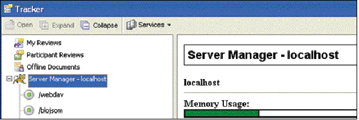
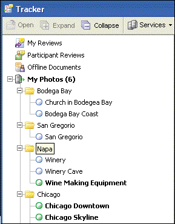

******************************************************
Acrobat and PDFL SDK: Tracker APIs
******************************************************

Acrobat DC Tracker is an XML-based tool, based on RSS 2.0, for presenting and describing lists of items. RSS 2.0 is an XML-based format used for describing lists of items. It also allows for extensions at any level by using XML namespaces. You can add content to Tracker from a server using RSS.

Benefits of RSS
===============

Information is often published using RSS because it makes it easy to alert the content consumer when changes take place. RSS can be used to improve a Web site that consumers are constantly checking or a service that sends notifications through email. The following are examples of what can be published using RSS:

-  Personal email (using authentication) or the contents of an email list
-  The result of a search
-  A set of documents that have been published for review
-  The state of an approval or form workflow
-  A blog

RSS allows the content provider to add custom extensions, such as metadata beyond that defined in the RSS standard. These custom extensions can be used by customizing Tracker. The extensions customize only the appearance of the content in Tracker. The content can still be used in other desktop RSS aggregators or in a server application such as a Web portal.

.. note::

   Tracker is designed to be used in an occasionally connected environment. The RSS data, icons, and user interface driver objects are stored persistently on the local machine. However, external references, such as images used in an RSS feed, are not stored. Keep this in mind when generating content for Tracker if working offline is required.

For more information on RSS, see its specification at http://blogs.law.harvard.edu/tech/rss .

Customizing the interface
=========================

The Tracker user interface is controlled through URL commands, XML extensions used in RSS 2.0 documents, and JavaScript extensions. The Tracker URL commands manage feed subscriptions and displaying the Tracker user interface. The user interface is managed by the XML extensions, which work together with a JavaScript-based user interface driver to customize its appearance and behavior.

You can customize the Tracker user interface by adding controls such as toolbar buttons and menus, and grouping feed items as shown in the following graphics.

Using RSS extensions to customize how icons are displayed

Dynamically changing grouping categories

For information on customizing the functionality of Tracker, see `Tracker API <Tracker_InboxAPI.html#50401297_76786>`__, and `Customization Examples <Tracker_Examples.html#50401283_28855>`__.

